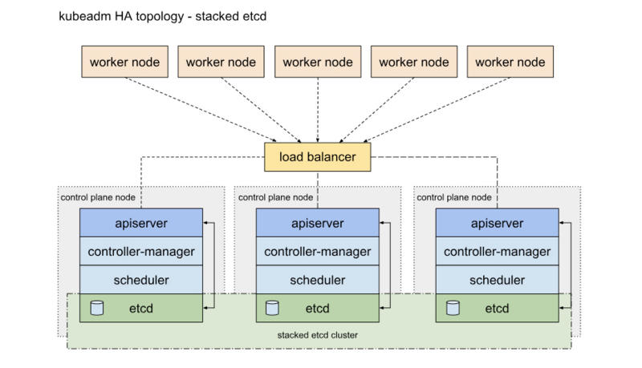
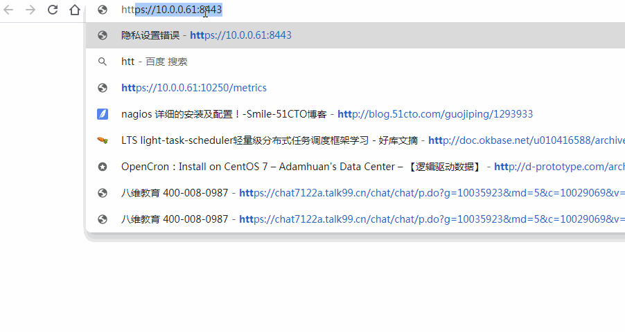
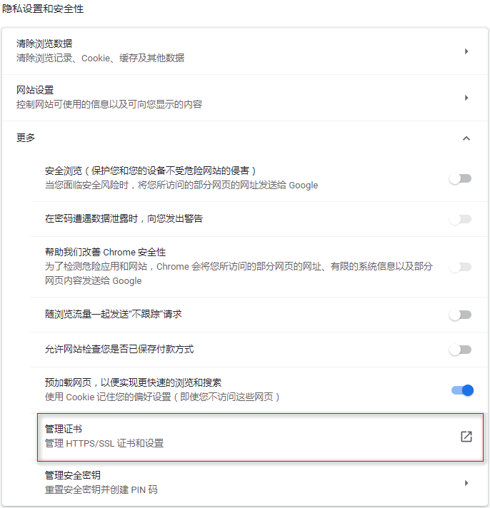
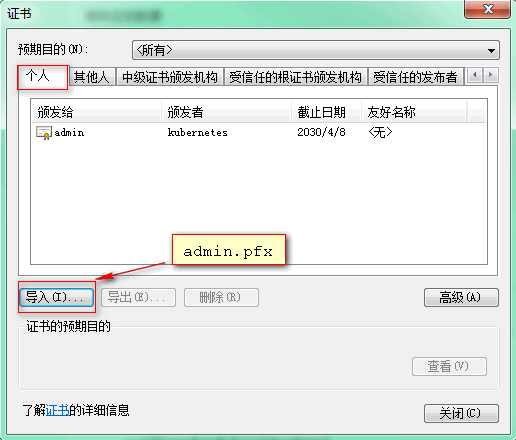
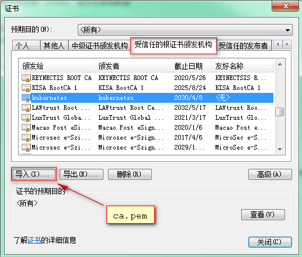
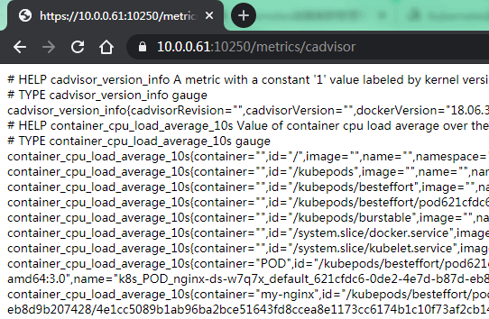

[TOC]


# Kubernets 高可用集群

Kubernetes的高可用主要指的是控制平面的高可用，即有多套Master节点组件和Etcd组件，工作节点通过负载均衡连接到各Master。 

# HA的两种部署方式

一种是将etcd与Master节点组件混布在一起



另外一种方式是，使用独立的Etcd集群，不与Master节点混布署。


两种方式的相同之处在于都提供了控制平面的冗余，实现了集群高可以用，区别在于：

**Etcd混布方式：**

- 所需机器资源少
- 部署简单，利于管理
- 容易进行横向扩展
- 风险大，一台宿主机挂了，master和etcd就都少了一套，集群冗余度受到的影响比较大。

**Etcd独立部署方式：**

- 所需机器资源多（按照Etcd集群的奇数原则，这种拓扑的集群关控制平面最少就要6台宿主机了）。
- 部署相对复杂，要独立管理etcd集群和和master集群。
- 解耦了控制平面和Etcd，集群风险小健壮性强，单独挂了一台master或etcd对集群的影响很小。


# 1.1 环境规划

> ==以下为二进制方式部署。三台机器采用混合节点部署即master和node同为一台机器；生产环境中建议分开。然后结合nginx四层代理+keepalived实现kube-apiserver高可用。==

 **环境介绍**

| 主机名  | 配置  | 外网IP    | 内网IP      | k8s相关软件                                                  | 高可用相关               | 系统版本       | 备注 |
| ------- | ----- | --------- | ----------- | ------------------------------------------------------------ | ------------------------ | -------------- | ---- |
| k8s-m01 | 2核4G | 10.0.0.61 | 172.16.1.61 | kube-apiserver,kube-controller-manager,kube-scheduler,etcd,kubelet,kube-proxy,flannel,docker | nginx四层代理+keepalived | centos7.7.1908 |      |
| k8s-m02 | 2核4G | 10.0.0.62 | 172.16.1.62 | kube-apiserver,kube-controller-manager,kube-scheduler,etcd,kubelet,kube-proxy,flannel,docker | nginx四层代理+keepalived | centos7.7.1908 |      |
| k8s-m03 | 2核4G | 10.0.0.63 | 172.16.1.63 | kube-apiserver,kube-controller-manager,kube-scheduler,etcd,kubelet,kube-proxy,flannel,docker | nginx四层代理+keepalived | centos7.7.1908 |      |
| VIP     |       | 10.0.0.88 |             |                                                              |                          |                |      |

**软件版本及下载链接**

| 软件       | 版本    | 下载地址                                                     | 备注                    |
| ---------- | ------- | ------------------------------------------------------------ | ----------------------- |
| k8s-server | v1.17.4 | <https://dl.k8s.io/v1.17.4/kubernetes-server-linux-amd64.tar.gz> | 已包含kubectl命令行工具 |
| k8s-node   | v1.17.4 | <https://dl.k8s.io/v1.17.4/kubernetes-node-linux-amd64.tar.gz> |                         |
| k8s-client | v1.17.4 | https://dl.k8s.io/v1.17.4/kubernetes-client-linux-amd64.tar.gz | 单独的kubectl命令行工具 |
| flannel    | v0.11.0 | https://github.com/coreos/flannel/releases/download/v0.11.0/flannel-v0.11.0-linux-amd64.tar.gz |                         |
| etcd       | v3.3.19 | https://github.com/etcd-io/etcd/releases/download/v3.3.19/etcd-v3.3.19-linux-amd64.tar.gz |                         |


# 1.2 环境初始化准备

**1、修改主机名**

```shell
hostnamectl set-hostname k8s-m01
hostnamectl set-hostname k8s-m02
hostnamectl set-hostname k8s-m03
```

**2、添加hosts解析**

```shell
cat >/etc/hosts<<EOF
127.0.0.1   localhost localhost.localdomain localhost4 localhost4.localdomain4
::1         localhost localhost.localdomain localhost6 localhost6.localdomain6
10.0.0.61 k8s-m01
10.0.0.62 k8s-m02
10.0.0.63 k8s-m03
EOF
```

**3、添加节点信任关系**

本操作只需要在 k8s-m01 节点上进行，设置 root 账户可以无密码登录**所有节点**：

```
ssh-keygen -t rsa 
ssh-copy-id root@k8s-m01
ssh-copy-id root@k8s-m02
ssh-copy-id root@k8s-m03
```

**4、关闭无关的服务**

```shell
systemctl stop postfix && systemctl disable postfix
```

**5、创建kubernetes工作目录**

```shell
mkdir -p  /opt/k8s/{bin,work} /etc/{kubernetes,etcd,flanneld}/cert
```

 **6、更新PATH变量** 

```
echo 'export PATH=/opt/k8s/bin:$PATH' >>/etc/profile
source /etc/profile
```

 **7、安装依赖包** 

```bash
yum install -y epel-release
yum install -y conntrack ntpdate ntp ipvsadm ipset jq iptables curl sysstat libseccomp wget lsof telnet gcc gcc-c++ pcre pcre-devel zlib zlib-devel openssl openssl-devel
```

**8、时间同步**

```shell
echo "*/5 * * * * /usr/sbin/ntpdate ntp1.aliyun.com >/dev/null 2>&1" >/var/spool/cron/root
```

**9、加载并优化内核参数**

```shell
cat >/etc/sysctl.d/kubernetes.conf<<EOF
net.bridge.bridge-nf-call-iptables=1
net.bridge.bridge-nf-call-ip6tables=1
net.ipv4.ip_forward=1
net.ipv4.tcp_tw_recycle=0
vm.swappiness=0
vm.overcommit_memory=1
vm.panic_on_oom=0
fs.inotify.max_user_instances=8192
fs.inotify.max_user_watches=1048576
fs.file-max=52706963
fs.nr_open=52706963
net.ipv6.conf.all.disable_ipv6=1
net.netfilter.nf_conntrack_max=2310720
EOF

modprobe ip_vs_rr
modprobe br_netfilter
sysctl -p /etc/sysctl.d/kubernetes.conf
```

> 注：tcp_tw_recycle 和 Kubernetes 的 NAT 冲突，必须关闭 ，否则会导致服务不通；
> 关闭不使用的 IPV6 协议栈，防止触发 docker BUG；
>
> 报错：sysctl: cannot stat /proc/sys/net/bridge/bridge-nf-call-iptables；解决措施：modprobe br_netfilter

**10、关闭swap分区**

如果开启了swap分区，kubelet会启动失败(可以通过将参数 --fail-swap-on 设置为false来忽略swap on)，故需要在每个node节点机器上关闭swap分区。

```shell
swapoff -a
sed -ri 's/.*swap.*/#&/' /etc/fstab
```

**11、关闭并禁用firewalld及selinux**

 在每台机器上关闭防火墙，清理防火墙规则，设置默认转发策略 

```shell
systemctl stop firewalld
systemctl disable firewalld
iptables -F && iptables -X && iptables -F -t nat && iptables -X -t nat
iptables -P FORWARD ACCEPT
setenforce 0
sed -i  '/^SELINUX/s#enforcing#disabled#g' /etc/selinux/config
```

**12、设置rsyslogd 和systemd journald**

systemd 的 journald 是 Centos 7 缺省的日志记录工具，它记录了所有系统、内核、Service Unit 的日志。相比 systemd，journald 记录的日志有如下优势：

- 可以记录到内存或文件系统；(默认记录到内存，对应的位置为 /run/log/jounal)；
- 可以限制占用的磁盘空间、保证磁盘剩余空间；
- 可以限制日志文件大小、保存的时间；
- journald 默认将日志转发给 rsyslog，这会导致日志写了多份，/var/log/messages 中包含了太多无关日志，不方便后续查看，同时也影响系统性能。

```bash
mkdir /var/log/journal
mkdir /etc/systemd/journald.conf.d
cat > /etc/systemd/journald.conf.d/99-prophet.conf <<EOF
[Journal]
# 持久化保存到磁盘
Storage=persistent
     
# 压缩历史日志
Compress=yes
     
SyncIntervalSec=5m
RateLimitInterval=30s
RateLimitBurst=1000
     
# 最大占用空间 10G
SystemMaxUse=10G
     
# 单日志文件最大 200M
SystemMaxFileSize=200M
     
# 日志保存时间 2 周
MaxRetentionSec=2week
     
# 不将日志转发到 syslog
ForwardToSyslog=no
EOF
     
systemctl restart systemd-journald
```

**13、升级内核**

Docker overlay2需要使用kernel 4.x版本，所以我们需要升级内核。

CentOS 7.x 系统自带的 3.10.x 内核存在一些 Bugs，导致运行的 Docker、Kubernetes 不稳定，例如：

```shell
高版本的 docker(1.13 以后) 启用了 3.10 kernel 实验支持的 kernel memory account 功能(无法关闭)，当节点压力大如频繁启动和停止容器时会导致 cgroup memory leak；
网络设备引用计数泄漏，会导致类似于报错："kernel:unregister_netdevice: waiting for eth0 to become free. Usage count = 1";
```

*启用 ELRepo 仓库*

ELRepo 仓库是基于社区的用于企业级 Linux 仓库，提供对 RedHat Enterprise (RHEL) 和 其他基于 RHEL的 Linux 发行版（CentOS、Scientific、Fedora 等）的支持。
ELRepo 聚焦于和硬件相关的软件包，包括文件系统驱动、显卡驱动、网络驱动、声卡驱动和摄像头驱动等。

导入ELRepo仓库的公共密钥

```shell
rpm --import https://www.elrepo.org/RPM-GPG-KEY-elrepo.org
```

安装ELRepo仓库的yum源

```shell
rpm -Uvh http://www.elrepo.org/elrepo-release-7.0-3.el7.elrepo.noarch.rpm
```

查看可用的系统内核包

```shell
yum --disablerepo="*" --enablerepo="elrepo-kernel" list available
```

内核版本介绍：

- **lt**:longterm的缩写：长期维护版；
- **ml**:mainline的缩写：最新稳定版；

安装内核

```shell
yum --enablerepo=elrepo-kernel install kernel-lt -y
```

设置 grub2并重启

内核安装好后，需要设置为默认启动选项并重启后才会生效

```bash
grub2-set-default  0 && grub2-mkconfig -o /etc/grub2.cfg
reboot
```

**13、设置环境变量脚本**

后续所有的使用环境变量都定义在 [environment.sh](assets\environment.sh) 中，需要根据个人机器及网络环境修改。并且需要拷贝到所有节点的/opt/k8s/bin目录下

```shell
cd /opt/k8s/work/
cat >environment.sh<<\EOF
#!/bin/bash
# 生成 EncryptionConfig 所需的加密 key
export ENCRYPTION_KEY=8gbbPskhkRKHD6buJmqD/wZt24/Vmo+sJ1PjfcMGv60=

# 集群各机器 IP 数组
export NODE_IPS=(10.0.0.61 10.0.0.62 10.0.0.63)

# 集群各 IP 对应的主机名数组
export NODE_NAMES=(k8s-m01 k8s-m02 k8s-m03)

# 集群MASTER机器 IP 数组
export MASTER_IPS=(10.0.0.61 10.0.0.62 10.0.0.63)

# 集群所有的master Ip对应的主机
export MASTER_NAMES=(k8s-m01 k8s-m02 k8s-m03)

# etcd 集群服务地址列表
export ETCD_ENDPOINTS="https://10.0.0.61:2379,https://10.0.0.62:2379,https://10.0.0.63:2379"

# etcd 集群间通信的 IP 和端口
export ETCD_NODES="k8s-m01=https://10.0.0.61:2380,k8s-m02=https://10.0.0.62:2380,k8s-m03=https://10.0.0.63:2380"

# etcd 集群所有node ip
export ETCD_IPS=(10.0.0.61 10.0.0.62 10.0.0.63)

# kube-apiserver 的反向代理(kube-nginx)地址端口
export KUBE_VIP="10.0.0.88"
export KUBE_APISERVER="https://10.0.0.88:8443"

# 节点间互联网络接口名称
export IFACE="ens33"

# etcd 数据目录
export ETCD_DATA_DIR="/data/k8s/etcd/data"

# etcd WAL 目录，建议是 SSD 磁盘分区，或者和 ETCD_DATA_DIR 不同的磁盘分区
export ETCD_WAL_DIR="/data/k8s/etcd/wal"

# k8s 各组件数据目录
export K8S_DIR="/data/k8s/k8s"

# docker 数据目录
export DOCKER_DIR="/data/k8s/docker"

## 以下参数一般不需要修改
# TLS Bootstrapping 使用的 Token，可用命令 head -c 16 /dev/urandom | od -An -t x | tr -d ' ' 生成
BOOTSTRAP_TOKEN="41f7e4ba8b7be874fcff18bf5cf41a7c"
# 最好使用 当前未用的网段 来定义服务网段和 Pod 网段
# 服务网段，部署前路由不可达，部署后集群内路由可达(kube-proxy 保证)
SERVICE_CIDR="10.254.0.0/16"
# Pod 网段，建议 /16 段地址，部署前路由不可达，部署后集群内路由可达(flanneld 保证)
CLUSTER_CIDR="172.30.0.0/16"
# 服务端口范围 (NodePort Range)
export NODE_PORT_RANGE="20000-40000"
# flanneld 网络配置前缀
export FLANNEL_ETCD_PREFIX="/kubernetes/network"
# kubernetes 服务 IP (一般是 SERVICE_CIDR 中第一个IP)
export CLUSTER_KUBERNETES_SVC_IP="10.254.0.1"
# 集群 DNS 服务 IP (从 SERVICE_CIDR 中预分配)
export CLUSTER_DNS_SVC_IP="10.254.0.2"
# 集群 DNS 域名（末尾不带点号）
export CLUSTER_DNS_DOMAIN="cluster.local"
# 将二进制目录 /opt/k8s/bin 加到 PATH 中
export PATH=/opt/k8s/bin:$PATH
EOF
```

 分发环境变量脚本 

```shell
cd /opt/k8s/work/
source environment.sh
for node_ip in ${NODE_IPS[@]}
  do
    echo -e "\033[42;37m >>> ${node_ip} <<< \033[0m"
    scp environment.sh root@${node_ip}:/opt/k8s/bin/
    ssh root@${node_ip} "chmod +x /opt/k8s/bin/*"
done
```


==**注意：以下操作如无特殊标注；均在k8s-m01上操作。**==

# 1.3 下载 [cfssl](https://github.com/cloudflare/cfssl) 创建CA根证书

为确保安全，kubernetes系统各组件需要使用 x509证书对通信进行加密和认证。

CA (Certificate Authority) 是自签名的根证书，用来签名后续创建的其它证书。

**1、下载cfssl**

```shell
curl -L https://github.com/cloudflare/cfssl/releases/download/v1.4.1/cfssl_1.4.1_linux_amd64 -o /opt/k8s/bin/cfssl
curl -L https://github.com/cloudflare/cfssl/releases/download/v1.4.1/cfssljson_1.4.1_linux_amd64 -o /opt/k8s/bin/cfssljson
curl -L https://github.com/cloudflare/cfssl/releases/download/v1.4.1/cfssl-certinfo_1.4.1_linux_amd64 -o /opt/k8s/bin/cfssl-certinfo
chmod +x /opt/k8s/bin/*
```

**容器相关证书类型**

client certificate：用于服务端认证客户端,例如etcdctl、etcd proxy、fleetctl、docker客户端

server certificate: 服务端使用，客户端以此验证服务端身份,例如docker服务端、kube-apiserver

peer certificate: 双向证书，用于etcd集群成员间通信

> 注意：以下证书生成均在k8s-master上配置核生成，然后进行分发。

**2、创建 CA 根证书和秘钥**

CA 配置文件用于配置根证书的使用场景 (profile) 和具体参数 (usage，过期时间、服务端认证、客户端认证、加密等)，后续在签名其它证书时需要指定特定场景。

```shell
cd /opt/k8s/work
cat > ca-config.json <<EOF
{
  "signing": {
    "default": {
      "expiry": "87600h"
    },
    "profiles": {
      "kubernetes": {
        "usages": [
            "signing",
            "key encipherment",
            "server auth",
            "client auth"
        ],
        "expiry": "87600h"
      }
    }
  }
}
EOF
```

- signing ：表示该证书可用于签名其它证书，生成的 `ca.pem` 证书中 `CA=TRUE`；
- server auth ：表示 client 可以用该该证书对 server 提供的证书进行验证；
- client auth ：表示 server 可以用该该证书对 client 提供的证书进行验证；

**3、创建证书签名请求文件**

```shell
cd /opt/k8s/work
cat > ca-csr.json <<EOF
{
  "CN": "kubernetes",
  "key": {
    "algo": "rsa",
    "size": 2048
  },
  "names": [
    {
      "C": "CN",
      "ST": "BeiJing",
      "L": "BeiJing",
      "O": "k8s",
      "OU": "4Paradigm"
    }
  ],
  "ca": {
    "expiry": "87600h"
 }
}
EOF
```

- CN：Common Name，kube-apiserver 从证书中提取该字段作为请求的用户名 (User Name)，浏览器使用该字段验证网站是否合法；
- O：Organization，kube-apiserver 从证书中提取该字段作为请求用户所属的组 (Group)；
- kube-apiserver 将提取的 User、Group 作为 RBAC 授权的用户标识；

**生成 CA 证书和私钥：**

```shell
cd /opt/k8s/work
cfssl gencert -initca ca-csr.json | cfssljson -bare ca
ls ca*.pem
```

**分发证书文件：**

```shell
cd /opt/k8s/work
source environment.sh
for node_ip in ${NODE_IPS[@]}
  do
    echo -e "\033[42;37m >>> ${node_ip} <<< \033[0m"
    scp ca*.pem ca-config.json root@${node_ip}:/etc/kubernetes/cert
done
```


# 1.4 部署 kubectl 命令行工具

kubectl 是 kubernetes 集群的命令行管理工具，kubectl 默认从 ~/.kube/config 文件读取kube-apiserver地址和认证信息，如果没有配置，执行kubectl时就会报错！kubectl只需要部署一次，生成的kubeconfig文件是通用的，可以拷贝到需要执行kubectl命令的节点机器，重命名为 ~/.kube/config；这里将kubectl节点只部署到三个master节点机器上，其他节点不部署kubectl命令。也就是说后续进行kubectl命令管理就只能在master节点上操作。 

**1、下载和解压kubectl**

```shell
cd /opt/k8s/work
wget https://dl.k8s.io/v1.17.4/kubernetes-client-linux-amd64.tar.gz
tar -xzvf kubernetes-client-linux-amd64.tar.gz
```

分发所有使用kubectl节点：

```shell
cd /opt/k8s/work
source /opt/k8s/bin/environment.sh
for node_ip in ${NODE_IPS[@]}
do
    echo -e "\033[42;37m >>> ${node_ip} <<< \033[0m"
    scp kubernetes/client/bin/kubectl root@${node_ip}:/opt/k8s/bin/
    ssh root@${node_ip} "chmod +x /opt/k8s/bin/*"
done
```

**2、创建admin证书和私钥**

kubectl与apiserver https通信，apiserver对提供的证书进行认证和授权。kubectl作为集群的管理工具，需要被授予最高权限，这里创建具有最高权限的admin证书

创建证书签名请求：

```shell
cd /opt/k8s/work
cat > admin-csr.json <<EOF
{
  "CN": "admin",
  "hosts": [],
  "key": {
    "algo": "rsa",
    "size": 2048
  },
  "names": [
    {
      "C": "CN",
      "ST": "BeiJing",
      "L": "BeiJing",
      "O": "system:masters",
      "OU": "4Paradigm"
    }
  ]
}
EOF
```

- `O: system:masters`：kube-apiserver 收到使用该证书的客户端请求后，为请求添加组（Group）认证标识 `system:masters`；
- 预定义的 ClusterRoleBinding `cluster-admin` 将 Group `system:masters` 与 Role `cluster-admin` 绑定，该 Role 授予操作集群所需的**最高**权限；
- 该证书只会被 kubectl 当做 client 证书使用，所以 `hosts` 字段为空；

生成证书和私钥：

```shell
cd /opt/k8s/work
cfssl gencert -ca=/opt/k8s/work/ca.pem \
  -ca-key=/opt/k8s/work/ca-key.pem \
  -config=/opt/k8s/work/ca-config.json \
  -profile=kubernetes admin-csr.json | cfssljson -bare admin
ls admin*
```

**3、创建kubeconfig文件**

kubeconfig为kubectl的配置文件，包含访问apiserver的所有信息，如apiserver地址、CA证书和自身使用的证书

```shell
cd /opt/k8s/work
source /opt/k8s/bin/environment.sh
# 设置集群参数
kubectl config set-cluster kubernetes \
  --certificate-authority=/opt/k8s/work/ca.pem \
  --embed-certs=true \
  --server=${KUBE_APISERVER} \
  --kubeconfig=kubectl.kubeconfig
#设置客户端认证参数
kubectl config set-credentials admin \
  --client-certificate=/opt/k8s/work/admin.pem \
  --client-key=/opt/k8s/work/admin-key.pem \
  --embed-certs=true \
  --kubeconfig=kubectl.kubeconfig
# 设置上下文参数
kubectl config set-context kubernetes \
  --cluster=kubernetes \
  --user=admin \
  --kubeconfig=kubectl.kubeconfig
# 设置默认上下文
kubectl config use-context kubernetes --kubeconfig=kubectl.kubeconfig
```

- `--certificate-authority`：验证 kube-apiserver 证书的根证书；
- `--client-certificate`、`--client-key`：刚生成的 `admin` 证书和私钥，与 kube-apiserver https 通信时使用；
- `--embed-certs=true`：将 ca.pem 和 admin.pem 证书内容嵌入到生成的 kubectl.kubeconfig 文件中(否则，写入的是证书文件路径，后续拷贝 kubeconfig 到其它机器时，还需要单独拷贝证书文件，不方便。)；
- `--server`：指定 kube-apiserver 的地址，这里指向第一个节点上的服务；

**4、分发kubeconfig文件**

分发到所有使用kubectl命令的节点，保存文件名为~/.kube/config

```shell
cd /opt/k8s/work
source /opt/k8s/bin/environment.sh
for node_ip in ${NODE_IPS[@]}
do
    echo -e "\033[42;37m >>> ${node_ip} <<< \033[0m"
    ssh root@${node_ip} "mkdir -p ~/.kube"
    scp kubectl.kubeconfig root@${node_ip}:~/.kube/config
done
```

**5、kubectl命令补全功能**

```shell
yum install -y bash-completion
source /usr/share/bash-completion/bash_completion
source <(kubectl completion bash)
echo "source <(kubectl completion bash)" >> /etc/profile
```


# 1.5 部署 etcd 存储集群

etcd是一个高可用的分布式键值(key-value)数据库。由 CoreOS 开发，常用于服务注册和发现、共享配置以及并发控制（如 leader 选举、分布式锁等）。etcd内部采用raft协议作为一致性算法，etcd基于Go语言实现。

etcd与zookeeper相比算是轻量级系统，两者的一致性协议也一样，etcd的raft比zookeeper的paxos简单。

**1、使用场景**

- 配置管理
- 服务注册于发现
- 选主
- 应用调度
- 分布式队列
- 分布式锁

**2、原理**

etcd推荐使用奇数作为集群节点个数。因为奇数个节点和其配对的偶数个节点相比，容错能力相同，却可以少一个节点。综合考虑性能和容错能力，etcd官方文档推荐的etcd集群大小是3,5,7。由于etcd使用是Raft算法，每次写入数据需要有2N+1个节点同意可以写入数据，所以部分节点由于网络或者其他不可靠因素延迟收到数据更新，但是最终数据会保持一致，高度可靠。随着节点数目的增加，每次的写入延迟会相应的线性递增，除了节点数量会影响写入数据的延迟，如果节点跟接节点之间的网络延迟，也会导致数据的延迟写入。

**结论：**

- 节点数并非越多越好，过多的节点将会导致数据延迟写入。
- 节点跟节点之间的跨机房，专线之间网络延迟，也将会导致数据延迟写入。
- 受网络IO和磁盘IO的延迟
- 为了提高吞吐量，etcd通常将多个请求一次批量处理并提交Raft，增加节点，读性能会提升，写性能会下降，减少节点，写性能会提升

**3、下载和分发 etcd 二进制文件**

```shell
cd /opt/k8s/work
wget https://github.com/etcd-io/etcd/releases/download/v3.3.19/etcd-v3.3.19-linux-amd64.tar.gz
tar -zxvf etcd-v3.3.19-linux-amd64.tar.gz

source /opt/k8s/bin/environment.sh
for node_ip in ${ETCD_IPS[@]}
  do
    echo -e "\033[42;37m >>> ${node_ip} <<< \033[0m"
    scp etcd-v3.3.19-linux-amd64/etcd* root@${node_ip}:/opt/k8s/bin
    ssh root@${node_ip} "chmod +x /opt/k8s/bin/*"
  done
```

**4、创建 Etcd 证书和私钥**

**创建etcd证书签名请求：**

```shell
cd /opt/k8s/work
cat > etcd-csr.json <<EOF
{
  "CN": "etcd",
  "hosts": [
    "127.0.0.1",
    "10.0.0.61",
    "10.0.0.62",
    "10.0.0.63"
  ],
  "key": {
    "algo": "rsa",
    "size": 2048
  },
  "names": [
    {
      "C": "CN",
      "ST": "BeiJing",
      "L": "BeiJing",
      "O": "k8s",
      "OU": "4Paradigm"
    }
  ]
}
EOF
```

`hosts`：指定授权使用该证书的 etcd 节点 IP 列表，**需要将 etcd 集群所有节点 IP 都列在其中**；

**生成etcd证书和私钥：**

```shell
cd /opt/k8s/work
cfssl gencert -ca=ca.pem \
    -ca-key=ca-key.pem \
    -config=ca-config.json \
    -profile=kubernetes etcd-csr.json | cfssljson -bare etcd
ls etcd*pem
```

**分发生成的证书和私钥到各 etcd 节点：**

```shell
cd /opt/k8s/work
source /opt/k8s/bin/environment.sh
for node_ip in ${ETCD_IPS[@]}
  do
    echo -e "\033[42;37m >>> ${node_ip} <<< \033[0m"
    scp etcd*.pem root@${node_ip}:/etc/etcd/cert/
  done
```

**5、创建 etcd 的 systemd**

```shell
cd /opt/k8s/work
source /opt/k8s/bin/environment.sh
cat > etcd.service.template <<EOF
[Unit]
Description=Etcd Server
After=network.target
After=network-online.target
Wants=network-online.target
Documentation=https://github.com/coreos
[Service]
Type=notify
WorkingDirectory=${ETCD_DATA_DIR}
ExecStart=/opt/k8s/bin/etcd \\
  --data-dir=${ETCD_DATA_DIR} \\
  --wal-dir=${ETCD_WAL_DIR} \\
  --name=##NODE_NAME## \\
  --cert-file=/etc/etcd/cert/etcd.pem \\
  --key-file=/etc/etcd/cert/etcd-key.pem \\
  --trusted-ca-file=/etc/kubernetes/cert/ca.pem \\
  --peer-cert-file=/etc/etcd/cert/etcd.pem \\
  --peer-key-file=/etc/etcd/cert/etcd-key.pem \\
  --peer-trusted-ca-file=/etc/kubernetes/cert/ca.pem \\
  --peer-client-cert-auth \\
  --client-cert-auth \\
  --listen-peer-urls=https://##NODE_IP##:2380 \\
  --initial-advertise-peer-urls=https://##NODE_IP##:2380 \\
  --listen-client-urls=https://##NODE_IP##:2379,http://127.0.0.1:2379 \\
  --advertise-client-urls=https://##NODE_IP##:2379 \\
  --initial-cluster-token=etcd-cluster-0 \\
  --initial-cluster=${ETCD_NODES} \\
  --initial-cluster-state=new \\
  --auto-compaction-mode=periodic \\
  --auto-compaction-retention=1 \\
  --max-request-bytes=33554432 \\
  --quota-backend-bytes=6442450944 \\
  --heartbeat-interval=250 \\
  --election-timeout=2000
Restart=on-failure
RestartSec=5
LimitNOFILE=65536
[Install]
WantedBy=multi-user.target
EOF
```

- `WorkingDirectory`、`--data-dir`：指定工作目录和数据目录为 `${ETCD_DATA_DIR}`，需在启动服务前创建这个目录；
- `--wal-dir`：指定 wal 目录，为了提高性能，一般使用 SSD 或者和 `--data-dir` 不同的磁盘；
- `--name`：指定节点名称，当 `--initial-cluster-state` 值为 `new` 时，`--name` 的参数值必须位于 `--initial-cluster` 列表中；
- `--cert-file`、`--key-file`：etcd server 与 client 通信时使用的证书和私钥；
- `--trusted-ca-file`：签名 client 证书的 CA 证书，用于验证 client 证书；
- `--peer-cert-file`、`--peer-key-file`：etcd 与 peer 通信使用的证书和私钥；
- `--peer-trusted-ca-file`：签名 peer 证书的 CA 证书，用于验证 peer 证书；

 **生成各个节点启动文件：** 

```shell
cd /opt/k8s/work
source /opt/k8s/bin/environment.sh
for (( i=0; i < 3; i++ ))
  do
    sed -e "s/##NODE_NAME##/${MASTER_NAMES[i]}/" -e "s/##NODE_IP##/${ETCD_IPS[i]}/" etcd.service.template > etcd-${ETCD_IPS[i]}.service 
  done
ls *.service
```

- NODE_NAMES 和 NODE_IPS 为相同长度的 bash 数组，分别为节点名称和对应的 IP；

**分发etcd启动文件到对应的服务器：**

```shell
cd /opt/k8s/work
source /opt/k8s/bin/environment.sh
for node_ip in ${MASTER_IPS[@]}
  do
    echo -e "\033[42;37m >>> ${node_ip} <<< \033[0m"
    scp etcd-${node_ip}.service root@${node_ip}:/etc/systemd/system/etcd.service
  done
```

**6、启动etcd服务**

etcd首次进程启动会等待其他节点加入etcd集群，启动第一个etcd，可能会卡住；因为单独etcd还无法进行选举；当三个etcd都启动后，即可恢复正常。启动完后查看状态。

```shell
cd /opt/k8s/work
source /opt/k8s/bin/environment.sh
for node_ip in ${MASTER_IPS[@]}
do
    echo -e "\033[42;37m >>> ${node_ip} <<< \033[0m"
    ssh root@${node_ip} "mkdir -p ${ETCD_DATA_DIR} ${ETCD_WAL_DIR}"
    ssh root@${node_ip} "systemctl daemon-reload && systemctl enable etcd && systemctl restart etcd && systemctl status etcd|grep Active" &
done
```

注意：上面for循环后的`&`符不能少，否则启动报错：

```
health check for peer 19f3c191758492d6 could not connect: dial tcp 10.0.0.62:2380: connect: connection refused (prober "..._SNAPSHOT")
```

如果etcd集群状态不是active (running)，请使用下面命令查看etcd日志

```shell
journalctl -fu etcd
```

**7、验证ETCD集群状态** 

```shell
cd /opt/k8s/work
source /opt/k8s/bin/environment.sh
for node_ip in ${MASTER_IPS[@]}
  do
    echo -e "\033[42;37m >>> ${node_ip} <<< \033[0m"
    ETCDCTL_API=3 /opt/k8s/bin/etcdctl \
    --endpoints=https://${node_ip}:2379 \
    --cacert=/etc/kubernetes/cert/ca.pem \
    --cert=/etc/etcd/cert/etcd.pem \
    --key=/etc/etcd/cert/etcd-key.pem endpoint health
  done
```

- 输出均为 healthy 时表示集群服务正常。 

**8、查看当前etcd集群leader**

```shell
source /opt/k8s/bin/environment.sh
ETCDCTL_API=3 /opt/k8s/bin/etcdctl \
  -w table --cacert=/etc/kubernetes/cert/ca.pem \
  --cert=/etc/etcd/cert/etcd.pem \
  --key=/etc/etcd/cert/etcd-key.pem \
  --endpoints=${ETCD_ENDPOINTS} endpoint status
```

输出：

```shell
+------------------------+------------------+---------+---------+-----------+-----------+------------+
|        ENDPOINT        |        ID        | VERSION | DB SIZE | IS LEADER | RAFT TERM | RAFT INDEX |
+------------------------+------------------+---------+---------+-----------+-----------+------------+
| https://10.0.0.61:2379 | 373881ac0e3f8182 |  3.3.19 |   20 kB |      true |         5 |         14 |
| https://10.0.0.62:2379 | 19f3c191758492d6 |  3.3.19 |   20 kB |     false |         5 |         14 |
| https://10.0.0.63:2379 | f83fa3bd8f58acc0 |  3.3.19 |   20 kB |     false |         5 |         14 |
+------------------------+------------------+---------+---------+-----------+-----------+------------+

```

**9、etcd注意事项**

1.ETCD3.4版本ETCDCTL_API=3 etcdctl 和 etcd --enable-v2=false 成为了默认配置，如要使用v2版本，执行etcdctl时候需要设置ETCDCTL_API环境变量，例如：ETCDCTL_API=2 etcdctl

2.ETCD3.4版本会自动读取环境变量的参数，所以EnvironmentFile文件中有的参数，不需要再次在ExecStart启动参数中添加，二选一，如同时配置，会触发以下类似报错“etcd: conflicting environment variable "ETCD_NAME" is shadowed by corresponding command-line flag (either unset environment variable or disable flag)”


# 1.6 部署 flannel 容器网络

Flannel 是由 CoreOS 维护的一个虚拟网络方案。目前是kubernetes默认的网络，它由golang编写。

 kubernetes要求集群内各节点(这里指master和node节点)能通过Pod网段互联互通。flannel使用vxlan技术为各节点创建一个可以互通的Pod网络，使用的端口为UDP 8472（需要开放该端口，如公有云AWS等）。

flanneld第一次启动时，从etcd获取配置的Pod网段信息，为本节点分配一个未使用的地址段，然后创建flannedl.1网络接口（也可能是其它名称，如flannel1等）。flannel将分配给自己的Pod网段信息写入/run/flannel/docker文件，docker后续使用这个文件中的环境变量设置docker0网桥，从而从这个地址段为本节点的所有Pod容器分配IP。 


**1、下载和分发 flanneld 二进制文件**

```shell
cd /opt/k8s/work
wget https://github.com/coreos/flannel/releases/download/v0.11.0/flannel-v0.11.0-linux-amd64.tar.gz
mkdir -p flannel
tar -xzvf flannel-v0.11.0-linux-amd64.tar.gz -C flannel
```

分发二进制文件到所有集群的节点

```shell
source /opt/k8s/bin/environment.sh
for node_ip in ${NODE_IPS[@]}
  do
    echo -e "\033[42;37m >>> ${node_ip} <<< \033[0m"
    scp flannel/{flanneld,mk-docker-opts.sh} root@${node_ip}:/opt/k8s/bin/
    ssh root@${node_ip} "chmod +x /opt/k8s/bin/*"
  done
```


**2、创建 Flannel 证书和私钥**

flanneld 从 etcd 集群存取网段分配信息，而 etcd 集群启用了双向 x509 证书认证，所以需要为 flanneld 生成证书和私钥。

**创建证书签名请求：**

```shell
cd /opt/k8s/work
cat > flanneld-csr.json <<EOF
{
  "CN": "flanneld",
  "hosts": [],
  "key": {
    "algo": "rsa",
    "size": 2048
  },
  "names": [
    {
      "C": "CN",
      "ST": "BeiJing",
      "L": "BeiJing",
      "O": "k8s",
      "OU": "4Paradigm"
    }
  ]
}
EOF
```

- 该证书只会被 kubectl 当做 client 证书使用，所以 hosts 字段为空；

**生成证书和私钥：**

```shell
cd /opt/k8s/work
cfssl gencert -ca=/opt/k8s/work/ca.pem \
  -ca-key=/opt/k8s/work/ca-key.pem \
  -config=/opt/k8s/work/ca-config.json \
  -profile=kubernetes flanneld-csr.json | cfssljson -bare flanneld
ls flanneld*pem
```

将证书和私钥分发到**所有节点**（master 和 worker）：

```shell
cd /opt/k8s/work
source /opt/k8s/bin/environment.sh
for node_ip in ${NODE_IPS[@]}
  do
    echo -e "\033[42;37m >>> ${node_ip} <<< \033[0m"
    scp flanneld*.pem root@${node_ip}:/etc/flanneld/cert
  done
```

**3、向 etcd 写入集群 Pod 网段信息**

```shell
cd /opt/k8s/work
source /opt/k8s/bin/environment.sh
etcdctl \
  --endpoints=${ETCD_ENDPOINTS} \
  --ca-file=/opt/k8s/work/ca.pem \
  --cert-file=/opt/k8s/work/flanneld.pem \
  --key-file=/opt/k8s/work/flanneld-key.pem \
  mk ${FLANNEL_ETCD_PREFIX}/config '{"Network":"'${CLUSTER_CIDR}'", "SubnetLen": 21, "Backend": {"Type": "vxlan"}}'
```

注意：

- 本步骤只需执行一次。

- Falnnel要用etcd存储自身一个子网信息，所以要保证能成功连接Etcd，写入预定义子网段；
- docker默认用172.17.0.0/16这个网段，为了知道是flanneld提供的网络，于是就用了172.30.0.0/16；
- flanneld当前版本`v0.11.0`不支持etcd v3，故使用etcd v2 API写入配置Key和网段数据，因为etcd分v2和v3俩版本，不同版本使用的命令参数不同，得到的结果也不同；
- 写入的Pod网段`"Network":"172.30.0.0/16"`地址段(如/16)必须小于SubnetLen，必须与kube-controller-manager的–cluster-cidr参数一致；

**4、创建flanneld的启动文件**

```shell
cd /opt/k8s/work
source /opt/k8s/bin/environment.sh
cat > flanneld.service << EOF
[Unit]
Description=Flanneld overlay address etcd agent
After=network.target
After=network-online.target
Wants=network-online.target
After=etcd.service
Before=docker.service
[Service]
Type=notify
ExecStart=/opt/k8s/bin/flanneld \\
  -etcd-cafile=/etc/kubernetes/cert/ca.pem \\
  -etcd-certfile=/etc/flanneld/cert/flanneld.pem \\
  -etcd-keyfile=/etc/flanneld/cert/flanneld-key.pem \\
  -etcd-endpoints=${ETCD_ENDPOINTS} \\
  -etcd-prefix=${FLANNEL_ETCD_PREFIX} \\
  -iface=${IFACE} \\
  -ip-masq
ExecStartPost=/opt/k8s/bin/mk-docker-opts.sh -k DOCKER_NETWORK_OPTIONS -d /run/flannel/docker
Restart=always
RestartSec=5
StartLimitInterval=0
[Install]
WantedBy=multi-user.target
RequiredBy=docker.service
EOF
```

- mk-docker-opts.sh 脚本将分配给 flanneld 的 Pod 子网段信息写入 /run/flannel/docker 文件，后续 docker 启动时使用这个文件中的环境变量配置 docker0 网桥；
- flanneld 使用系统缺省路由所在的接口与其它节点通信，对于有多个网络接口（如内网和公网）的节点，可以用 -iface 参数指定通信接口;
- flanneld 运行时需要 root 权限；
- -ip-masq: flanneld 为访问 Pod 网络外的流量设置 SNAT 规则，同时将传递给 Docker 的变量 –ip-masq（/run/flannel/docker 文件中）设置为 false，这样 Docker 将不再创建 SNAT 规则； Docker 的 –ip-masq 为 true 时，创建的 SNAT 规则比较“暴力”：将所有本节点 Pod 发起的、访问非 docker0 接口的请求做 SNAT，这样访问其他节点 Pod 的请求来源 IP 会被设置为 flannel.1 接口的 IP，导致目的 Pod 看不到真实的来源 Pod IP。 flanneld 创建的 SNAT 规则比较温和，只对访问非 Pod 网段的请求做 SNAT。

**分发启动文件到所有节点：**

```shell
cd /opt/k8s/work
source /opt/k8s/bin/environment.sh
for node_ip in ${NODE_IPS[@]}
do
    echo -e "\033[42;37m >>> ${node_ip} <<< \033[0m"
    scp flanneld.service root@${node_ip}:/etc/systemd/system/
done
```

**5、启动flanneld**

```shell
cd /opt/k8s/work
source /opt/k8s/bin/environment.sh
for node_ip in ${NODE_IPS[@]}
do
    echo -e "\033[42;37m >>> ${node_ip} <<< \033[0m"
    ssh root@${node_ip} "systemctl daemon-reload && systemctl enable flanneld && systemctl restart flanneld && systemctl status flanneld|grep Active"
done
```

- 确保状态为 active (running)，否则查看日志，确认原因"journalctl -u flanneld"

**6、查看flanneld分配 的 Pod 网段信息**

**检查分配给flanneld的Pod网段信息（/16）：**

```shell
source /opt/k8s/bin/environment.sh
etcdctl \
  --endpoints=${ETCD_ENDPOINTS} \
  --ca-file=/etc/kubernetes/cert/ca.pem \
  --cert-file=/etc/flanneld/cert/flanneld.pem \
  --key-file=/etc/flanneld/cert/flanneld-key.pem \
  get ${FLANNEL_ETCD_PREFIX}/config
```

**查看已分配的Pod子网网段列表（/21）：**

```shell
source /opt/k8s/bin/environment.sh
etcdctl \
  --endpoints=${ETCD_ENDPOINTS} \
  --ca-file=/etc/kubernetes/cert/ca.pem \
  --cert-file=/etc/flanneld/cert/flanneld.pem \
  --key-file=/etc/flanneld/cert/flanneld-key.pem \
  ls ${FLANNEL_ETCD_PREFIX}/subnets
```

**查看某Pod网段对应节点IP和flannel接口地址：**

```shell
source /opt/k8s/bin/environment.sh
etcdctl \
  --endpoints=${ETCD_ENDPOINTS} \
  --ca-file=/etc/kubernetes/cert/ca.pem \
  --cert-file=/etc/flanneld/cert/flanneld.pem \
  --key-file=/etc/flanneld/cert/flanneld-key.pem \
  get ${FLANNEL_ETCD_PREFIX}/subnets/172.30.224.0-21
```

- 后面节点IP需要根据我们查出来的地址进行修改

**查看节点flannel网络信息**

```
ip addr show
```

flannel.1网卡的地址为分配的pod自网段的第一个个IP (.0)，且是/32的地址

```
ip addr show|grep flannel.1
```

到其它节点 Pod 网段请求都被转发到 flannel.1 网卡；

flanneld 根据 etcd 中子网段的信息，如 `${FLANNEL_ETCD_PREFIX}/subnets/172.30.224.0-21`，来决定进请求发送给哪个节点的互联 IP；

**验证各节点能通过 Pod 网段互通**

在各节点上部署 flannel 后，检查是否创建了 flannel 接口(名称可能为 flannel0、flannel.0、flannel.1 等)：

```shell
source /opt/k8s/bin/environment.sh
for node_ip in ${NODE_IPS[@]}
  do
    echo -e "\033[42;37m >>> ${node_ip} <<< \033[0m"
    ssh root@${node_ip} "/usr/sbin/ip addr show flannel.1|grep -w inet"
  done
```

**flannel启动报错：**

```shell
报错一：fatal: parameter inet_interfaces: no local interface found for ::1	
sed -i '/inet_interfaces/s#inet_interfaces = localhost#inet_interfaces = all#g' /etc/postfix/main.cf
systemctl restart postfix.service

报错二：Failed to start Flanneld overlay address etcd agent.
Failed at step MEMORY spawning /opt/kubernetes/bin/flanneld: Cannot allocate memory

报错三：Failed to create SubnetManager: parse
解释：这个问题是由于 -etcd-endpoints= 后面的参数用了"" 的原因；
解决办法： 把 "" 去掉，问题就解决了
```


# 1.7 部署 Master 节点

kubernetes master 节点运行如下组件：

```shell
kube-apiserver
kube-scheduler
kube-controller-manager
```

- kube-apiserver、kube-scheduler 和 kube-controller-manager 均以多实例模式运行：

- kube-scheduler 和 kube-controller-manager 会自动选举产生一个 leader 实例，其它实例处于阻塞模式，当 leader 挂了后，重新选举产生新的 leader，从而保证服务可用性；
- kube-apiserver 是无状态的，可以通过 kube-nginx 进行四层代理访问，从而保证服务可用性；

**下载kubernetes二进制包，并分发到所有master节点** 

```shell
cd /opt/k8s/work
wget https://dl.k8s.io/v1.17.4/kubernetes-server-linux-amd64.tar.gz
tar -zxvf kubernetes-server-linux-amd64.tar.gz
cd kubernetes
tar -xzvf  kubernetes-src.tar.gz
```

拷贝二进制文件到所有 master 节点：

```shell
cd /opt/k8s/work
source /opt/k8s/bin/environment.sh
for node_ip in ${MASTER_IPS[@]}
do
    echo -e "\033[42;37m >>> ${node_ip} <<< \033[0m"
    scp kubernetes/server/bin/{kube-apiserver,apiextensions-apiserver,kube-controller-manager,kube-proxy,kube-scheduler,kubeadm,kubectl,kubelet,mounter} root@${node_ip}:/opt/k8s/bin/
    ssh root@${node_ip} "chmod +x /opt/k8s/bin/*"
done
```

同时将kubelet，kube-proxy拷贝到所有node节点：

```bash
cd /opt/k8s/work
source /opt/k8s/bin/environment.sh
for node_ip in ${NODE_IPS[@]}
do
	echo -e "\033[42;37m >>> ${node_ip} <<< \033[0m"
    scp kubernetes/server/bin/{kubelet,kube-proxy} root@${node_ip}:/opt/k8s/bin/
    ssh root@${node_ip} "chmod +x /opt/k8s/bin/*"
done
```


## 1.7.1 kube-apiserver 高可用集群

**1、创建 k8s-master 证书和私钥**

**创建证书签名请求：**

```shell
cd /opt/k8s/work
cat > kubernetes-csr.json <<EOF
{
  "CN": "kubernetes",
  "hosts": [
    "127.0.0.1",
    "10.0.0.61",
    "10.0.0.62",
    "10.0.0.63",
    "${KUBE_VIP}",
    "${CLUSTER_KUBERNETES_SVC_IP}",
    "kubernetes",
    "kubernetes.default",
    "kubernetes.default.svc",
    "kubernetes.default.svc.cluster",
    "kubernetes.default.svc.cluster.local"
  ],
  "key": {
    "algo": "rsa",
    "size": 2048
  },
  "names": [
    {
      "C": "CN",
      "ST": "BeiJing",
      "L": "BeiJing",
      "O": "k8s",
      "OU": "4Paradigm"
    }
  ]
}
EOF
```

- hosts 字段指定授权使用该证书的 **IP 和域名列表**，这里列出了 master 节点 IP、kubernetes 服务的 IP 和域名；

**生成证书和私钥：**

```shell
cfssl gencert -ca=/opt/k8s/work/ca.pem \
	-ca-key=/opt/k8s/work/ca-key.pem \
	-config=/opt/k8s/work/ca-config.json \
	-profile=kubernetes kubernetes-csr.json | cfssljson -bare kubernetes
ls kubernetes*pem
```

**将生成的证书和私钥文件拷贝到所有master节点：**

```shell
cd /opt/k8s/work
source /opt/k8s/bin/environment.sh
for node_ip in ${MASTER_IPS[@]}
  do
    echo -e "\033[42;37m >>> ${node_ip} <<< \033[0m"
    scp kubernetes*.pem root@${node_ip}:/etc/kubernetes/cert/
  done
```

**2、创建加密配置文件：**

```shell
cd /opt/k8s/work
source /opt/k8s/bin/environment.sh
cat > encryption-config.yaml <<EOF
kind: EncryptionConfig
apiVersion: v1
resources:
  - resources:
      - secrets
    providers:
      - aescbc:
          keys:
            - name: key1
              secret: ${ENCRYPTION_KEY}
      - identity: {}
EOF
```

将加密配置文件拷贝到master节点的`/etc/kubernetes`目录下

```shell
cd /opt/k8s/work
source /opt/k8s/bin/environment.sh
for node_ip in ${MASTER_IPS[@]}
  do
    echo -e "\033[42;37m >>> ${node_ip} <<< \033[0m"
    scp encryption-config.yaml root@${node_ip}:/etc/kubernetes/
  done
```

**3、创建审计策略文件：**

```shell
cd /opt/k8s/work
source /opt/k8s/bin/environment.sh
cat > audit-policy.yaml <<EOF
apiVersion: audit.k8s.io/v1beta1
kind: Policy
rules:
  # The following requests were manually identified as high-volume and low-risk, so drop them.
  - level: None
    resources:
      - group: ""
        resources:
          - endpoints
          - services
          - services/status
    users:
      - 'system:kube-proxy'
    verbs:
      - watch
  - level: None
    resources:
      - group: ""
        resources:
          - nodes
          - nodes/status
    userGroups:
      - 'system:nodes'
    verbs:
      - get
  - level: None
    namespaces:
      - kube-system
    resources:
      - group: ""
        resources:
          - endpoints
    users:
      - 'system:kube-controller-manager'
      - 'system:kube-scheduler'
      - 'system:serviceaccount:kube-system:endpoint-controller'
    verbs:
      - get
      - update
  - level: None
    resources:
      - group: ""
        resources:
          - namespaces
          - namespaces/status
          - namespaces/finalize
    users:
      - 'system:apiserver'
    verbs:
      - get
  # Don't log HPA fetching metrics.
  - level: None
    resources:
      - group: metrics.k8s.io
    users:
      - 'system:kube-controller-manager'
    verbs:
      - get
      - list
  # Don't log these read-only URLs.
  - level: None
    nonResourceURLs:
      - '/healthz*'
      - /version
      - '/swagger*'
  # Don't log events requests.
  - level: None
    resources:
      - group: ""
        resources:
          - events
  # node and pod status calls from nodes are high-volume and can be large, don't log responses for expected updates from nodes
  - level: Request
    omitStages:
      - RequestReceived
    resources:
      - group: ""
        resources:
          - nodes/status
          - pods/status
    users:
      - kubelet
      - 'system:node-problem-detector'
      - 'system:serviceaccount:kube-system:node-problem-detector'
    verbs:
      - update
      - patch
  - level: Request
    omitStages:
      - RequestReceived
    resources:
      - group: ""
        resources:
          - nodes/status
          - pods/status
    userGroups:
      - 'system:nodes'
    verbs:
      - update
      - patch
  # deletecollection calls can be large, don't log responses for expected namespace deletions
  - level: Request
    omitStages:
      - RequestReceived
    users:
      - 'system:serviceaccount:kube-system:namespace-controller'
    verbs:
      - deletecollection
  # Secrets, ConfigMaps, and TokenReviews can contain sensitive & binary data,
  # so only log at the Metadata level.
  - level: Metadata
    omitStages:
      - RequestReceived
    resources:
      - group: ""
        resources:
          - secrets
          - configmaps
      - group: authentication.k8s.io
        resources:
          - tokenreviews
  # Get repsonses can be large; skip them.
  - level: Request
    omitStages:
      - RequestReceived
    resources:
      - group: ""
      - group: admissionregistration.k8s.io
      - group: apiextensions.k8s.io
      - group: apiregistration.k8s.io
      - group: apps
      - group: authentication.k8s.io
      - group: authorization.k8s.io
      - group: autoscaling
      - group: batch
      - group: certificates.k8s.io
      - group: extensions
      - group: metrics.k8s.io
      - group: networking.k8s.io
      - group: policy
      - group: rbac.authorization.k8s.io
      - group: scheduling.k8s.io
      - group: settings.k8s.io
      - group: storage.k8s.io
    verbs:
      - get
      - list
      - watch
  # Default level for known APIs
  - level: RequestResponse
    omitStages:
      - RequestReceived
    resources:
      - group: ""
      - group: admissionregistration.k8s.io
      - group: apiextensions.k8s.io
      - group: apiregistration.k8s.io
      - group: apps
      - group: authentication.k8s.io
      - group: authorization.k8s.io
      - group: autoscaling
      - group: batch
      - group: certificates.k8s.io
      - group: extensions
      - group: metrics.k8s.io
      - group: networking.k8s.io
      - group: policy
      - group: rbac.authorization.k8s.io
      - group: scheduling.k8s.io
      - group: settings.k8s.io
      - group: storage.k8s.io
  # Default level for all other requests.
  - level: Metadata
    omitStages:
      - RequestReceived
EOF
```

**分发审计策略文件：**

```shell
cd /opt/k8s/work
source /opt/k8s/bin/environment.sh
for node_ip in ${MASTER_IPS[@]}
  do
    echo -e "\033[42;37m >>> ${node_ip} <<< \033[0m"
    scp audit-policy.yaml root@${node_ip}:/etc/kubernetes/audit-policy.yaml
  done
```

**4、创建后续访问 metrics-server 或 kube-prometheus 使用的证书**

创建证书签名请求:

```bash
cd /opt/k8s/work
cat > proxy-client-csr.json <<EOF
{
  "CN": "aggregator",
  "hosts": [],
  "key": {
    "algo": "rsa",
    "size": 2048
  },
  "names": [
    {
      "C": "CN",
      "ST": "BeiJing",
      "L": "BeiJing",
      "O": "k8s",
      "OU": "4Paradigm"
    }
  ]
}
EOF
```

- CN 名称需要位于 kube-apiserver 的 `--requestheader-allowed-names` 参数中，否则后续访问 metrics 时会提示权限不足。

生成证书和私钥：

```bash
cfssl gencert -ca=/etc/kubernetes/cert/ca.pem \
  -ca-key=/etc/kubernetes/cert/ca-key.pem  \
  -config=/etc/kubernetes/cert/ca-config.json  \
  -profile=kubernetes proxy-client-csr.json | cfssljson -bare proxy-client
ls proxy-client*.pem
```

将生成的证书和私钥文件拷贝到所有 master 节点：

```bash
source /opt/k8s/bin/environment.sh
for node_ip in ${NODE_IPS[@]}
  do
    echo -e "\033[42;37m >>> ${node_ip} <<< \033[0m"
    scp proxy-client*.pem root@${node_ip}:/etc/kubernetes/cert/
  done
```

**5、创建 kube-apiserver启动文件**

```shell
cd /opt/k8s/work
source /opt/k8s/bin/environment.sh
cat > kube-apiserver.service.template <<EOF
[Unit]
Description=Kubernetes API Server
Documentation=https://github.com/GoogleCloudPlatform/kubernetes
After=network.target
[Service]
WorkingDirectory=${K8S_DIR}/kube-apiserver
ExecStart=/opt/k8s/bin/kube-apiserver \\
  --advertise-address=##NODE_IP## \\
  --default-not-ready-toleration-seconds=360 \\
  --default-unreachable-toleration-seconds=360 \\
  --feature-gates=DynamicAuditing=true \\
  --max-mutating-requests-inflight=2000 \\
  --max-requests-inflight=4000 \\
  --default-watch-cache-size=200 \\
  --delete-collection-workers=2 \\
  --encryption-provider-config=/etc/kubernetes/encryption-config.yaml \\
  --etcd-cafile=/etc/kubernetes/cert/ca.pem \\
  --etcd-certfile=/etc/kubernetes/cert/kubernetes.pem \\
  --etcd-keyfile=/etc/kubernetes/cert/kubernetes-key.pem \\
  --etcd-servers=${ETCD_ENDPOINTS} \\
  --bind-address=##NODE_IP## \\
  --secure-port=6443 \\
  --tls-cert-file=/etc/kubernetes/cert/kubernetes.pem \\
  --tls-private-key-file=/etc/kubernetes/cert/kubernetes-key.pem \\
  --insecure-port=0 \\
  --audit-dynamic-configuration \\
  --audit-log-maxage=15 \\
  --audit-log-maxbackup=3 \\
  --audit-log-maxsize=100 \\
  --audit-log-truncate-enabled \\
  --audit-log-path=${K8S_DIR}/kube-apiserver/audit.log \\
  --audit-policy-file=/etc/kubernetes/audit-policy.yaml \\
  --profiling \\
  --anonymous-auth=false \\
  --client-ca-file=/etc/kubernetes/cert/ca.pem \\
  --enable-bootstrap-token-auth \\
  --requestheader-allowed-names="aggregator" \\
  --requestheader-client-ca-file=/etc/kubernetes/cert/ca.pem \\
  --requestheader-extra-headers-prefix="X-Remote-Extra-" \\
  --requestheader-group-headers=X-Remote-Group \\
  --requestheader-username-headers=X-Remote-User \\
  --service-account-key-file=/etc/kubernetes/cert/ca.pem \\
  --authorization-mode=Node,RBAC \\
  --runtime-config=api/all=true \\
  --enable-admission-plugins=NodeRestriction \\
  --allow-privileged=true \\
  --apiserver-count=3 \\
  --event-ttl=168h \\
  --kubelet-certificate-authority=/etc/kubernetes/cert/ca.pem \\
  --kubelet-client-certificate=/etc/kubernetes/cert/kubernetes.pem \\
  --kubelet-client-key=/etc/kubernetes/cert/kubernetes-key.pem \\
  --kubelet-https=true \\
  --kubelet-timeout=10s \\
  --proxy-client-cert-file=/etc/kubernetes/cert/proxy-client.pem \\
  --proxy-client-key-file=/etc/kubernetes/cert/proxy-client-key.pem \\
  --service-cluster-ip-range=${SERVICE_CIDR} \\
  --service-node-port-range=${NODE_PORT_RANGE} \\
  --logtostderr=true \\
  --v=2
Restart=on-failure
RestartSec=10
Type=notify
LimitNOFILE=65536
[Install]
WantedBy=multi-user.target
EOF
```

**配置详解：**

| 配置选项                                              | 选项说明                                                     |
| :---------------------------------------------------- | :----------------------------------------------------------- |
| --advertise-address                                   | 向集群成员通知 apiserver 消息的 IP 地址，这个地址必须能够被集群中其他成员访问，如果 IP 地址为空，将会使用 --bind-address，如果未指定 --bind-address，将会使用主机的默认接口地址 |
| --default-not-ready-toleration-seconds                | 表示 notReady状态的容忍度秒数：默认情况下，NoExecute 被添加到尚未具有此容忍度的每个 Pod 中 |
| --default-unreachable-toleration-seconds              | 表示 unreachable状态的容忍度秒数：默认情况下，NoExecute 被添加到尚未具有此容忍度的每个 Pod 中 |
| --feature-gates=DynamicAuditing=true                  | 用于实验性质的特性开关组,每个key=value表示                   |
| --max-mutating-requests-inflight=2000                 | 在给定时间内进行中可变请求的最大数量，当超过该值时，服务将拒绝所有请求，0 值表示没有限制（默认值 200） |
| --max-requests-inflight=4000                          | 在给定时间内进行中不可变请求的最大数量，当超过该值时，服务将拒绝所有请求，0 值表示没有限制。（默认值 400） |
| --default-watch-cache-size=200                        | 默认监视缓存大小，0 表示对于没有设置默认监视大小的资源，将禁用监视缓存 |
| --delete-collection-workers=2                         | 用于 DeleteCollection 调用的工作者数量，这被用于加速 namespace 的清理( 默认值 1) |
| --encryption-provider-config                          | 将Secret数据加密存储到etcd中的配置文件                       |
| --etcd-cafile                                         | 用于etcd 通信的 SSL CA 文件                                  |
| --etcd-certfile                                       | 用于 etcd 通信的的 SSL 证书文件                              |
| --etcd-keyfile                                        | 用于 etcd 通信的 SSL 密钥文件 .                              |
| --etcd-servers                                        | 连接的 etcd 服务器列表 , 形式为（scheme://ip:port)，使用逗号分隔 |
| --bind-address                                        | 监听 --seure-port 的 IP 地址，被关联的接口必须能够被集群其它节点和 CLI/web 客户端访问，如果为空，则将使用所有接口（0.0.0.0） |
| --secure-port=6443                                    | 用于监听具有认证授权功能的 HTTPS 协议的端口，默认值是6443    |
| --tls-cert-file                                       | 包含用于 HTTPS 的默认 x509 证书的文件，（如果有 CA 证书，则附加于 server 证书之后），如果启用了 HTTPS 服务，并且没有提供 --tls-cert-file 和 --tls-private-key-file，则将为公共地址生成一个自签名的证书和密钥并保存于 /var/run/kubernetes 目录中 |
| --tls-private-key-file                                | 包含匹配 --tls-cert-file 的 x509 证书私钥的文件              |
| --insecure-port=0                                     | 监听不安全端口，默认值是8080，设置为0，表示禁用不安全端口    |
| --audit-dynamic-configuration                         | 动态审计配置                                                 |
| --audit-log-maxage=15                                 | 基于文件名中的时间戳，旧审计日志文件的最长保留天数           |
| --audit-log-maxbackup=3                               | 旧审计日志文件的最大保留个数                                 |
| --audit-log-maxsize=100                               | 审计日志被轮转前的最大兆字节数                               |
| --audit-log-truncate-enabled                          | 是否启用事件和batch截断功能。                                |
| --audit-log-path                                      | 如果设置，表示所有到apiserver的请求都会记录到这个文件中，‘-’表示写入标准输出 |
| --audit-policy-file                                   | 定义审计策略配置文件的路径，需要打开 ‘AdvancedAuditing’ 特性开关，AdvancedAuditing 需要一个配置来启用审计功能 |
| --profiling                                           | 在 web 接口 host:port/debug/pprof/ 上启用 profiling（默认值 true） |
| --anonymous-auth                                      | 启用到 API server 的安全端口的匿名请求，未被其他认证方法拒绝的请求被当做匿名请求，匿名请求的用户名为 system:anonymous，用户组名为 system:unauthenticated（默认值 true） |
| --client-ca-file                                      | 如果设置此标志，对于任何请求，如果存包含 client-ca-file 中的 authorities 签名的客户端证书，将会使用客户端证书中的 CommonName 对应的身份进行认证 |
| --enable-bootstrap-token-auth                         | 启用此选项以允许 ‘kube-system’ 命名空间中的 ‘bootstrap.kubernetes.io/token’ 类型密钥可以被用于 TLS 的启动认证 |
| --requestheader-allowed-names                         | 使用 --requestheader-username-headers 指定的，允许在头部提供用户名的客户端证书通用名称列表。如果为空，任何通过 --requestheader-client-ca-file 中 authorities 验证的客户端证书都是被允许的 |
| --requestheader-client-ca-file                        | 在信任请求头中以 --requestheader-username-headers 指示的用户名之前，用于验证接入请求中客户端证书的根证书捆绑 |
| –requestheader-extra-headers-prefix=“X-Remote-Extra-” | 用于检查的请求头的前缀列表，建议使用 X-Remote-Extra-         |
| --requestheader-group-headers=X-Remote-Group          | 用于检查群组的请求头列表，建议使用 X-Remote-Group            |
| --requestheader-username-headers=X-Remote-User        | 用于检查用户名的请求头列表，建议使用 X-Remote-User           |
| --service-account-key-file                            | 包含 PEM 加密的 x509 RSA 或 ECDSA 私钥或公钥的文件，用于验证 ServiceAccount 令牌，如果设置该值，–tls-private-key-file 将会被使用，指定的文件可以包含多个密钥，并且这个标志可以和不同的文件一起多次使用 |
| --authorization-mode=Node,RBAC                        | 在安全端口上进行权限验证的插件的顺序列表，以逗号分隔的列表，包括：AlwaysAllow,AlwaysDeny,ABAC,Webhook,RBAC,Node.（默认值 “AlwaysAllow”） |
| --runtime-config=api/all=true                         | 传递给 apiserver 用于描述运行时配置的键值对集合              |
| --enable-admission-plugins=NodeRestriction            | 资源限制的相关配置                                           |
| --allow-privileged=true                               | 如果为 true, 将允许特权容器                                  |
| --apiserver-count=3                                   | 集群中运行的 apiserver 数量，必须为正数（默认值 1            |
| --event-ttl=168h                                      | 事件驻留时间（默认值 1h0m0s)                                 |
| --kubelet-certificate-authority                       | 证书 authority 的文件路径                                    |
| --kubelet-client-certificate                          | 用于 TLS 的客户端证书文件路径                                |
| --kubelet-client-key                                  | 用于 TLS 的客户端证书密钥文件路径                            |
| --kubelet-https=true                                  | 为 kubelet 启用 https（默认值 true）                         |
| --kubelet-timeout=10s                                 | kubelet 操作超时时间（默认值5秒）                            |
| --proxy-client-cert-file                              | 当必须调用外部程序时，用于证明 aggregator 或者 kube-apiserver 的身份的客户端证书，包括代理到用户 api-server 的请求和调用 webhook 准入控制插件的请求，它期望这个证书包含一个来自于 CA 中的 --requestheader-client-ca-file 标记的签名，该 CA 在 kube-system 命名空间的 ‘extension-apiserver-authentication’ configmap 中发布，从 Kube-aggregator 收到调用的组件应该使用该 CA 进行他们部分的双向 TLS 验证 |
| --proxy-client-key-file                               | 当必须调用外部程序时，用于证明 aggregator 或者 kube-apiserver 的身份的客户端证书密钥。包括代理到用户 api-server 的请求和调用 webhook 准入控制插件的请求 |
| --service-cluster-ip-range                            | Service网络地址分配 ，CIDR 表示的 IP 范围，服务的 cluster ip 将从中分配， 一定不要和分配给 nodes 和 pods 的 IP 范围产生重叠 |
| --service-node-port-range                             | Service使用的端口范围                                        |
| --logtostderr=true                                    | 输出日志到标准错误控制台，不输出到文件                       |
| --v=2                                                 | 指定输出日志的级别                                           |

注意：

1. `--requestheader-client-ca-file` 指定的 CA 证书，必须具有 `client auth and server auth`；
2. 如果 `--requestheader-allowed-names` 不为空,且 `--proxy-client-cert-file` 证书的 CN 名称不在 allowed-names 中，则后续查看 node 或 pods 的 metrics 失败，提示：

```
$ kubectl top nodes
Error from server (Forbidden): nodes.metrics.k8s.io is forbidden: User "aggregator" cannot list resource "nodes" in API group "metrics.
```

**为各个节点创建和分发kube-apiserver启动文件：**

替换模板文件的变量，为各个节点生成启动文件

```shell
cd /opt/k8s/work
source /opt/k8s/bin/environment.sh
#这里是三个节点所以为3,请根据实际情况修改,后边不在提示
for (( i=0; i < 3; i++ ))
  do
    sed -e "s/##NODE_NAME##/${MASTER_NAMES[i]}/" -e "s/##NODE_IP##/${MASTER_IPS[i]}/" kube-apiserver.service.template > kube-apiserver-${MASTER_IPS[i]}.service 
  done
ls kube-apiserver*.service
```

**分发apiserver启动文件：**

```shell
cd /opt/k8s/work
source /opt/k8s/bin/environment.sh
for node_ip in ${MASTER_IPS[@]}
do
    echo -e "\033[42;37m >>> ${node_ip} <<< \033[0m"
    scp kube-apiserver-${node_ip}.service root@${node_ip}:/etc/systemd/system/kube-apiserver.service
done
```

**6、启动apiserver**

```shell
source /opt/k8s/bin/environment.sh
for node_ip in ${MASTER_IPS[@]}
do
    echo -e "\033[42;37m >>> ${node_ip} <<< \033[0m"
    ssh root@${node_ip} "mkdir -p ${K8S_DIR}/kube-apiserver"
    ssh root@${node_ip} "systemctl daemon-reload && systemctl enable kube-apiserver && systemctl restart kube-apiserver && systemctl status kube-apiserver |grep Active"
    sleep 2
done
```

检查kube-apiserver监听的端口：

```bash
netstat -lntup|grep kube

tcp        0      0 10.0.0.61:6443          0.0.0.0:*               LISTEN      16496/kube-apiserve
```

确保状态为active (running)，否则查看日志，确认原因：

```shell
 journalctl -u kube-apiserver
```

**7、打印kube-apiserver写入etcd数据：**

```shell
source /opt/k8s/bin/environment.sh
ETCDCTL_API=3 etcdctl \
    --endpoints=${ETCD_ENDPOINTS} \
    --cacert=/opt/k8s/work/ca.pem \
    --cert=/opt/k8s/work/etcd.pem \
    --key=/opt/k8s/work/etcd-key.pem \
get /registry/ --prefix --keys-only
```

**8、检查集群信息** 

```shell
kubectl cluster-info

To further debug and diagnose cluster problems, use 'kubectl cluster-info dump'.
Unable to connect to the server: dial tcp 10.0.0.88:8443: connect: no route to host

```

因为脚本中定义了`KUBE_APISERVER="https://10.0.0.88:8443"`；此时10.0.0.88为vip所以需要引入keepalived，并且写入了`~/.kube/config`。


==**一、kube-apiserver 高可用**==

- 使用Nginx 4层透明代理功能实现k8s节点(master节点和worker节点)高可用访问kube-apiserver的步骤
- 控制节点的kube-controller-manager、kube-scheduler是多实例部署，所以只要一个实例正常，就可以保证集群高可用
- 集群内的Pod使用k8s服务域名kubernetes访问kube-apiserver，kube-dns会自动解析多个kube-apiserver节点的IP，所以也是高可用的
  在每个Nginx进程，后端对接多个apiserver实例，Nginx对他们做健康检查和负载均衡
- kubelet、kube-proxy、controller-manager、schedule通过本地nginx (监听我们vip 10.0.0.66)访问kube-apiserver，从而实现kube-apiserver高可用

**一、部署nginx**

**1、下载编译nginx** 

(k8s-m01安装就可以，后面有拷贝步骤)

```shell
cd /opt/k8s/work
wget http://nginx.org/download/nginx-1.16.1.tar.gz
tar -xzvf nginx-1.16.1.tar.gz

#编译
cd /opt/k8s/work/nginx-1.16.1
mkdir nginx-prefix
./configure --with-stream --without-http --prefix=$(pwd)/nginx-prefix --without-http_uwsgi_module 
make && make install

#############
--without-http_scgi_module --without-http_fastcgi_module
--with-stream：开启 4 层透明转发(TCP Proxy)功能；
--without-xxx：关闭所有其他功能，这样生成的动态链接二进制程序依赖最小；
```

查看 nginx 动态链接的库：

```shell
ldd ./nginx-prefix/sbin/nginx
```

由于只开启了 4 层透明转发功能，所以除了依赖 libc 等操作系统核心 lib 库外，没有对其它 lib 的依赖(如 libz、libssl 等)，这样可以方便部署到各版本操作系统中

**2、创建目录结构**

```shell
cd /opt/k8s/work
source /opt/k8s/bin/environment.sh
for node_ip in ${NODE_IPS[@]}
  do
    echo -e "\033[42;37m >>> ${node_ip} <<< \033[0m"
    ssh root@${node_ip} "mkdir -p /opt/k8s/kube-nginx/{conf,logs,sbin}"
  done
```

**3、拷贝二进制程序到其他主机**

```shell
cd /opt/k8s/work
source /opt/k8s/bin/environment.sh
for node_ip in ${NODE_IPS[@]}
  do
    echo -e "\033[42;37m >>> ${node_ip} <<< \033[0m"
    scp ./nginx-1.16.1/nginx-prefix/sbin/nginx  root@${node_ip}:/opt/k8s/kube-nginx/sbin/kube-nginx
    ssh root@${node_ip} "chmod a+x /opt/k8s/kube-nginx/sbin/*"
    sleep 2
  done
```

**4、配置Nginx文件，开启4层透明转发**

```shell
cd /opt/k8s/work
cat > kube-nginx.conf <<EOF
worker_processes 1;
events {
    worker_connections  1024;
}
stream {
    upstream backend {
        hash $remote_addr consistent;
        server 10.0.0.61:6443        max_fails=3 fail_timeout=30s;
        server 10.0.0.62:6443        max_fails=3 fail_timeout=30s;
        server 10.0.0.63:6443        max_fails=3 fail_timeout=30s;
    }
    server {
        listen *:8443;
        proxy_connect_timeout 1s;
        proxy_pass backend;
    }
}
EOF
```

- 需要将server替换成自己的地址

分发配置文件

```shell
cd /opt/k8s/work
source /opt/k8s/bin/environment.sh
for node_ip in ${MASTER_IPS[@]}
  do
    echo -e "\033[42;37m >>> ${node_ip} <<< \033[0m"
    scp kube-nginx.conf  root@${node_ip}:/opt/k8s/kube-nginx/conf/kube-nginx.conf
  done
```

**5、配置Nginx启动文件**

```shell
cd /opt/k8s/work
cat > kube-nginx.service <<EOF
[Unit]
Description=kube-apiserver nginx proxy
After=network.target
After=network-online.target
Wants=network-online.target
[Service]
Type=forking
ExecStartPre=/opt/k8s/kube-nginx/sbin/kube-nginx -c /opt/k8s/kube-nginx/conf/kube-nginx.conf -p /opt/k8s/kube-nginx -t
ExecStart=/opt/k8s/kube-nginx/sbin/kube-nginx -c /opt/k8s/kube-nginx/conf/kube-nginx.conf -p /opt/k8s/kube-nginx
ExecReload=/opt/k8s/kube-nginx/sbin/kube-nginx -c /opt/k8s/kube-nginx/conf/kube-nginx.conf -p /opt/k8s/kube-nginx -s reload
PrivateTmp=true
Restart=always
RestartSec=5
StartLimitInterval=0
LimitNOFILE=65536
[Install]
WantedBy=multi-user.target
EOF
```

分发nginx启动文件

```shell
cd /opt/k8s/work
source /opt/k8s/bin/environment.sh
for node_ip in ${MASTER_IPS[@]}
  do
    echo -e "\033[42;37m >>> ${node_ip} <<< \033[0m"
    scp kube-nginx.service  root@${node_ip}:/etc/systemd/system/
  done
```

启动 kube-nginx 服务

```shell
cd /opt/k8s/work
source /opt/k8s/bin/environment.sh
for node_ip in ${MASTER_IPS[@]}
  do
    echo -e "\033[42;37m >>> ${node_ip} <<< \033[0m"
    ssh root@${node_ip} "systemctl daemon-reload && systemctl enable kube-nginx && systemctl restart kube-nginx && systemctl status kube-nginx |grep 'Active:'"
  done
```

**二、部署KeepLived **

==高可用方案需要一个VIP，供集群内部访问；本次部署使用keepalived的非抢占模式。==

**1、所有master节点安装keeplived**

```shell
cd /opt/k8s/work
source /opt/k8s/bin/environment.sh
for node_ip in ${MASTER_IPS[@]}
  do
    echo -e "\033[42;37m >>> ${node_ip} <<< \033[0m"
    ssh root@${node_ip} "yum  install -y keepalived"
  done
```

**2、生成配置文件**

```shell
cd /opt/k8s/work
source /opt/k8s/bin/environment.sh
for node_ip in ${MASTER_IPS[@]}
  do
echo -e "\033[42;37m >>> ${node_ip} <<< \033[0m"
cat > keepalived.${node_ip}.conf<<EOF
! Configuration File for keepalived
global_defs {
   router_id ${node_ip}
   script_user root
   enable_script_security
}
vrrp_script chk_nginx {
    script "/etc/keepalived/check_port.sh 8443"
    interval 2
    weight -30
}
vrrp_instance VI_1 {
    state BACKUP
    interface ${IFACE}
    virtual_router_id 251
    priority 100
    advert_int 1
    mcast_src_ip ${node_ip}
    nopreempt
    authentication {
        auth_type PASS
        auth_pass 11111111
    }
    track_script {
         chk_nginx
    }
    virtual_ipaddress {
        ${KUBE_VIP}
    }
}
EOF
done
```

修改priority优先级

```shell
cd /opt/k8s/work
source /opt/k8s/bin/environment.sh
for (( i=0; i < 3; i++ ))
  do
    num=`expr 100 - 10 \* $i`
    echo -e "\033[42;37m >>> ${MASTER_IPS[i]} <<< \033[0m"
    sed -i "/priority/s#100#${num}#g" keepalived.${MASTER_IPS[i]}.conf
  done
```

分发配置文件

```shell
cd /opt/k8s/work
source /opt/k8s/bin/environment.sh
for node_ip in ${MASTER_IPS[@]}
  do
    echo -e "\033[42;37m >>> ${node_ip} <<< \033[0m"
    scp keepalived.${node_ip}.conf root@${node_ip}:/etc/keepalived/keepalived.conf
done
```

**3、创建健康检查脚本并分发**

创建

```shell
cd /opt/k8s/work
cat >check_port.sh<<\EOF
CHK_PORT=$1
 if [ -n "$CHK_PORT" ];then
        PORT_PROCESS=`ss -lntp|grep $CHK_PORT|wc -l`
        if [ $PORT_PROCESS -eq 0 ];then
                echo "Port $CHK_PORT Is Not Used,End."
                systemctl stop keepalived.service
        fi
 else
        echo "Check Port Cant Be Empty!"
 fi
EOF
```

分发

```bash
source /opt/k8s/bin/environment.sh
for node_ip in ${MASTER_IPS[@]}
  do
    echo -e "\033[42;37m >>> ${node_ip} <<< \033[0m"
    scp check_port.sh  root@${node_ip}:/etc/keepalived/
    ssh root@${node_ip} "chmod +x /etc/keepalived/check_port.sh"
done
```

**4、启动keeplived**

```shell
cd /opt/k8s/work
source /opt/k8s/bin/environment.sh
for node_ip in ${MASTER_IPS[@]}
  do
    echo -e "\033[42;37m >>> ${node_ip} <<< \033[0m"
    ssh root@${node_ip} "systemctl daemon-reload && systemctl enable keepalived && systemctl restart keepalived && systemctl status keepalived |grep Active"
    sleep 2
done
```

==问题一：systemctl无法彻底停掉keepalived==

```shell
[root@ k8s-m01 sysconfig]# systemctl stop keepalived.service
[root@ k8s-m01 sysconfig]# ps -ef|grep keep
root      83812      1  0 18:50 ?        00:00:00 /usr/sbin/keepalived -D
root      83813  83812  0 18:50 ?        00:00:00 /usr/sbin/keepalived -D
root      83814  83812  0 18:50 ?        00:00:00 /usr/sbin/keepalived -D
root      88808  34825  0 19:07 pts/0    00:00:00 grep --color=auto keep
```

如果还有进程，那么其实问题就简单了。因为keeplived进程没有全部杀掉。systemd的启动脚本有问题。

此时，直接启动keepalived的话，日志中会报错

```shell
systemd: Can't open PID file /var/run/keepalived.pid (yet?) after start: No such file or directory
```

修改keepalived启动脚本：

```shell
cd /opt/k8s/work
source /opt/k8s/bin/environment.sh
for node_ip in ${MASTER_IPS[@]}
  do
    echo -e "\033[42;37m >>> ${node_ip} <<< \033[0m"
    ssh root@${node_ip} "sed -i 's/KillMode/#KillMode/g' /usr/lib/systemd/system/keepalived.service"
    ssh root@${node_ip} "systemctl daemon-reload && systemctl enable keepalived && systemctl restart keepalived && systemctl status keepalived |grep 'Active:'"
    sleep 2
done
```

`KillMode=process `   #表示只杀掉程序的主进程，打开的子进程不管。我们keepalived肯定要全部杀掉。所以注释掉这一行。默认值是control-group，即当前控制组里的所有进程全部杀掉。 

**5、检查集群状态**

```shell
[root@ k8s-m01 work]# kubectl cluster-info
Kubernetes master is running at https://10.0.0.88:8443

To further debug and diagnose cluster problems, use 'kubectl cluster-info dump'.
[root@ k8s-m01 work]# kubectl get all --all-namespaces
NAMESPACE   NAME                 TYPE        CLUSTER-IP   EXTERNAL-IP   PORT(S)   AGE
default     service/kubernetes   ClusterIP   10.254.0.1   <none>        443/TCP   4d13h
[root@ k8s-m01 work]# kubectl get componentstatuses
NAME                 STATUS      MESSAGE                                                                                     ERROR
scheduler            Unhealthy   Get http://127.0.0.1:10251/healthz: dial tcp 127.0.0.1:10251: connect: connection refused
controller-manager   Unhealthy   Get http://127.0.0.1:10252/healthz: dial tcp 127.0.0.1:10252: connect: connection refused
etcd-0               Healthy     {"health":"true"}
etcd-2               Healthy     {"health":"true"}
etcd-1               Healthy     {"health":"true"}
```

此时，scheduler和controller-manager还没有部署，所以状态为`Unhealthy`。

**6、验证apiserver高可用性**

停掉vip所在服务器的kube-nginx,并查看集群状态。

```shell
[root@ k8s-m01 work]# ip a show ens33
2: ens33: <BROADCAST,MULTICAST,UP,LOWER_UP> mtu 1500 qdisc pfifo_fast state UP group default qlen 1000
    link/ether 00:0c:29:b3:29:fe brd ff:ff:ff:ff:ff:ff
    inet 10.0.0.61/24 brd 10.0.0.255 scope global ens33
       valid_lft forever preferred_lft forever
    inet 10.0.0.88/32 scope global ens33
       valid_lft forever preferred_lft forever
[root@ k8s-m01 work]# systemctl stop kube-nginx.service
[root@ k8s-m01 work]# ip a show ens33
2: ens33: <BROADCAST,MULTICAST,UP,LOWER_UP> mtu 1500 qdisc pfifo_fast state UP group default qlen 1000
    link/ether 00:0c:29:b3:29:fe brd ff:ff:ff:ff:ff:ff
    inet 10.0.0.61/24 brd 10.0.0.255 scope global ens33
       valid_lft forever preferred_lft forever
[root@ k8s-m01 work]# kubectl cluster-info
Kubernetes master is running at https://10.0.0.88:8443

To further debug and diagnose cluster problems, use 'kubectl cluster-info dump'.
[root@ k8s-m01 work]# kubectl get componentstatuses
NAME                 STATUS      MESSAGE                                                                                     ERROR
scheduler            Unhealthy   Get http://127.0.0.1:10251/healthz: dial tcp 127.0.0.1:10251: connect: connection refused
controller-manager   Unhealthy   Get http://127.0.0.1:10252/healthz: dial tcp 127.0.0.1:10252: connect: connection refused
etcd-0               Healthy     {"health":"true"}
etcd-2               Healthy     {"health":"true"}
etcd-1               Healthy     {"health":"true"}
```


## 1.7.2 kube-controller-manager 高可用集群

kube-controller-manager（k8s控制器管理器）是一个守护进程，它通过kube-apiserver监视集群的共享状态（kube-apiserver收集或监视到的一些集群资源状态，供kube-controller-manager或其它客户端watch）, 控制器管理器并尝试将当前的状态向所定义的状态迁移（移动、靠近），它本身是有状态的，会修改集群状态信息，如果多个控制器管理器同时生效，则会有一致性问题，所以kube-controller-manager的高可用，只能是主备模式，而kubernetes集群是采用租赁锁实现leader选举，需要在启动参数中加入--leader-elect=true。 

该集群包含 3 个节点，启动后将通过竞争选举机制产生一个 leader 节点，其它节点为阻塞状态。当 leader 节点不可用时，阻塞的节点将再次进行选举产生新的 leader 节点，从而保证服务的可用性。

为保证通信安全，本文档先生成 x509 证书和私钥，kube-controller-manager 在如下两种情况下使用该证书：

1. 与 kube-apiserver 的安全端口通信;
2. 在**安全端口**(https，10252) 输出 prometheus 格式的 metrics；

注意：如果没有特殊指明，本文档的所有操作**均在 k8s-m01 节点上执行**。


**1、创建kube-controller-manager证书和私钥**

创建证书签名请求：

```shell
cd /opt/k8s/work
cat > kube-controller-manager-csr.json <<EOF
{
    "CN": "system:kube-controller-manager",
    "key": {
        "algo": "rsa",
        "size": 2048
    },
    "hosts": [
      "127.0.0.1",
      "10.0.0.61",
      "10.0.0.62",
      "10.0.0.63"
    ],
    "names": [
      {
        "C": "CN",
        "ST": "BeiJing",
        "L": "BeiJing",
        "O": "system:kube-controller-manager",
        "OU": "4Paradigm"
      }
    ]
}
EOF
```

- host列表包含所有的kube-controller-manager节点IP(VIP不需要输入)
- CN和O均为system:kube-controller-manager，kubernetes内置的ClusterRoleBindings system:kube-controller-manager赋予kube-controller-manager工作所需权限

生成证书和私钥：

```shell
cd /opt/k8s/work
cfssl gencert -ca=/opt/k8s/work/ca.pem \
  -ca-key=/opt/k8s/work/ca-key.pem \
  -config=/opt/k8s/work/ca-config.json \
  -profile=kubernetes kube-controller-manager-csr.json | cfssljson -bare kube-controller-manager
ls kube-controller-manager*pem
```

将生成的证书和私钥分发到所有master节点：

```shell
cd /opt/k8s/work
source /opt/k8s/bin/environment.sh
for node_ip in ${MASTER_IPS[@]}
  do
    echo -e "\033[42;37m >>> ${node_ip} <<< \033[0m"
    scp kube-controller-manager*.pem root@${node_ip}:/etc/kubernetes/cert/
  done
```


**2、创建和分发kubeconfig文件**

kube-controller-manager使用kubeconfig文件访问apiserver。该文件提供了apiserver地址、嵌入的CA证书和kube-controller-manager证书。

```shell
cd /opt/k8s/work
source /opt/k8s/bin/environment.sh
kubectl config set-cluster kubernetes \
  --certificate-authority=/opt/k8s/work/ca.pem \
  --embed-certs=true \
  --server=${KUBE_APISERVER} \
  --kubeconfig=kube-controller-manager.kubeconfig
kubectl config set-credentials system:kube-controller-manager \
  --client-certificate=kube-controller-manager.pem \
  --client-key=kube-controller-manager-key.pem \
  --embed-certs=true \
  --kubeconfig=kube-controller-manager.kubeconfig
kubectl config set-context system:kube-controller-manager \
  --cluster=kubernetes \
  --user=system:kube-controller-manager \
  --kubeconfig=kube-controller-manager.kubeconfig
kubectl config use-context system:kube-controller-manager --kubeconfig=kube-controller-manager.kubeconfig
```

分发kubeconfig到所有master节点

```shell
cd /opt/k8s/work
source /opt/k8s/bin/environment.sh
for node_ip in ${MASTER_IPS[@]}
  do
    echo -e "\033[42;37m >>> ${node_ip} <<< \033[0m"
    scp kube-controller-manager.kubeconfig root@${node_ip}:/etc/kubernetes/
  done
```


**3、创建kube-controller-manager启动文件**

```shell
cd /opt/k8s/work
source /opt/k8s/bin/environment.sh
cat > kube-controller-manager.service.template <<EOF
[Unit]
Description=Kubernetes Controller Manager
Documentation=https://github.com/GoogleCloudPlatform/kubernetes
[Service]
WorkingDirectory=${K8S_DIR}/kube-controller-manager
ExecStart=/opt/k8s/bin/kube-controller-manager \\
  --profiling \\
  --cluster-name=kubernetes \\
  --controllers=*,bootstrapsigner,tokencleaner \\
  --kube-api-qps=1000 \\
  --kube-api-burst=2000 \\
  --leader-elect \\
  --use-service-account-credentials=true \\
  --concurrent-service-syncs=2 \\
  --bind-address=0.0.0.0 \\
  --secure-port=10257 \\
  --port=10252 \\
  --tls-cert-file=/etc/kubernetes/cert/kube-controller-manager.pem \\
  --tls-private-key-file=/etc/kubernetes/cert/kube-controller-manager-key.pem \\
  --authentication-kubeconfig=/etc/kubernetes/kube-controller-manager.kubeconfig \\
  --client-ca-file=/etc/kubernetes/cert/ca.pem \\
  --requestheader-allowed-names="aggregator" \\
  --requestheader-client-ca-file=/etc/kubernetes/cert/ca.pem \\
  --requestheader-extra-headers-prefix="X-Remote-Extra-" \\
  --requestheader-group-headers=X-Remote-Group \\
  --requestheader-username-headers=X-Remote-User \\
  --authorization-kubeconfig=/etc/kubernetes/kube-controller-manager.kubeconfig \\
  --cluster-signing-cert-file=/etc/kubernetes/cert/ca.pem \\
  --cluster-signing-key-file=/etc/kubernetes/cert/ca-key.pem \\
  --experimental-cluster-signing-duration=876000h \\
  --horizontal-pod-autoscaler-sync-period=10s \\
  --concurrent-deployment-syncs=10 \\
  --concurrent-gc-syncs=30 \\
  --node-cidr-mask-size=24 \\
  --service-cluster-ip-range=${SERVICE_CIDR} \\
  --pod-eviction-timeout=6m \\
  --terminated-pod-gc-threshold=10000 \\
  --root-ca-file=/etc/kubernetes/cert/ca.pem \\
  --service-account-private-key-file=/etc/kubernetes/cert/ca-key.pem \\
  --kubeconfig=/etc/kubernetes/kube-controller-manager.kubeconfig \\
  --logtostderr=true \\
  --v=2
Restart=on-failure
RestartSec=5
[Install]
WantedBy=multi-user.target
EOF
```

**配置详解：**

| 配置选项                                                     | 选项说明                                                     |
| :----------------------------------------------------------- | :----------------------------------------------------------- |
| --profiling                                                  | 通过web界面启动分析接口，host:port/debug/pprof/              |
| --cluster-name=kubernetes                                    | 集群名称，默认是kubernetes                                   |
| --controllers=                                               | *是启用默认启用所有控制器，但bootstrapsigner,tokencleaner 这两个控制器默认是禁用的，需要人为指定启用 |
| --kube-api-qps=1000                                          | 与kube-apiserver通信时的QPS                                  |
| --kube-api-burst=2000                                        | 与kube-apiserver通信时使用                                   |
| --leader-elect                                               | 高可用时启用选举功能                                         |
| --use-service-account-credentials                            | 如果为true，为每个控制器使用单独的service account            |
| --concurrent-service-syncs=2                                 | 允许同时同步Service数量，数字越大，服务管理响应越快，同时消耗更多的CPU和网络资源； |
| --bind-address=0.0.0.0                                       | 监控地址                                                     |
| --secure-port=10257                                          | 提供HTTPS服务，默认端口为10257，如果为0，不提供https服务     |
| --tls-cert-file                                              | 指定x509证书文件，如果启用了HTTPS服务，但是 --tls-cert-file和–tls-private-key-file 未提供，则会为公共地址生成自签名证书和密钥，并将其保存到–cert-dir指定的目录中。 |
| --tls-private-key-file                                       | 指定与–tls-cert-file对应的私钥                               |
| --port=10252                                                 | 提供HTTP服务，不认证，如果设置0，不提供HTTP服务，默认值是10252 |
| --authentication-kubeconfig                                  | kube-controller-kube-controller-manager也是kube-apiserver的客户端，也可以使用kubeconfig方式访问kube-apiserver， |
| --client-ca-file                                             | 启用客户端证书认证                                           |
| --requestheader-allowed-names=“aggregator”                   | 允许通过的客户端证书Common Name列表，可以提供 –requestheader-username-headers 中的 Header 的用户名。如果为空，则所有通过–requestheader-client-ca-file校验的都允许通过 |
| --requestheader-client-ca-file                               | 针对收到的请求，在信任–requestheader-username-header指定的header里包含的用户名之前，验证客户端证书的根证书 |
| --requestheader-extra-headers-prefix=“X-Remote-Extra-”       | 要检查的请求头前缀列表，建议使用 X-Remote-Extra-             |
| --requestheader-group-headers=X-Remote-Group                 | 请求头中需要检查的组名                                       |
| --requestheader-username-headers=X-Remote-User               | 请求头中需要检查的用户名                                     |
| --authorization-kubeconfig                                   | 指定kubeconfig配置文件路径                                   |
| --cluster-signing-cert-file                                  | 指定用于集群签发的所有集群范围内证书文件（根证书文件）       |
| --cluster-signing-key-file                                   | 指定集群签发证书的key                                        |
| --experimental-cluster-signing-duration=876000h              | 证书签发时间                                                 |
| --horizontal-pod-autoscaler-sync-period=10s                  | HPA控制器检查周期                                            |
| --concurrent-deployment-syncs=10                             | 允许并发同步的Deployment对象的数量，更大的数量等于更快的部署响应 |
| --concurrent-gc-syncs=30                                     | 允许并发同步的垃圾收集器数量。默认值20                       |
| --node-cidr-mask-size=24                                     | node节点的CIDR掩码，默认是24                                 |
| --service-cluster-ip-range=10.254.0.2/16                     | 集群Services 的CIDR范围                                      |
| --pod-eviction-timeout=6m                                    | 在失败节点删除Pod的宽限期，默认是300秒                       |
| --terminated-pod-gc-threshold=10000                          | 在Pod垃圾收集器开始删除终止Pod前，允许存在终止的Pod数量，默认是12500 |
| --root-ca-file=/etc/kubernetes/cert/ca.pem                   | 如果设置，该根证书权限将包含service acount的toker secret，这必须是一个有效的PEM编码CA 包 |
| --service-account-private-key-file=/etc/kubernetes/cert/ca-key.pem | 包含用于签署service account token的PEM编码RSA或者ECDSA私钥的文件名 |
| --kubeconfig=/etc/kubernetes/kube-controller-manager.kubeconfig | 指定kubeconfig配置文件                                       |
| --logtostderr=true                                           | 错误日志到标准输出，而不是文件                               |
| --v=2                                                        | 日志级别                                                     |

 注意：

- 控制器管理器管理控制器，各个控制器负责监视（watch）apiserver暴露的集群状态，并不断地尝试把当前状态向所期待的状态迁移；
- 配置使用kubeconfig访问kube-apiserver安全端口；
- 默认非安全端口10252，安全端口10257；
- kube-controller-manager 3节点高可用，去竞争锁，成为leader；

替换启动文件，并分发脚本：

```shell
cd /opt/k8s/work
source /opt/k8s/bin/environment.sh
for (( i=0; i < 3; i++ ))
  do
    sed -e "s/##NODE_NAME##/${MASTER_NAMES[i]}/" -e "s/##NODE_IP##/${MASTER_IPS[i]}/" kube-controller-manager.service.template > kube-controller-manager-${MASTER_IPS[i]}.service 
  done
ls kube-controller-manager*.service
```

分发到所有master节点：

```shell
cd /opt/k8s/work
source /opt/k8s/bin/environment.sh
for node_ip in ${MASTER_IPS[@]}
  do
    echo -e "\033[42;37m >>> ${node_ip} <<< \033[0m"
    scp kube-controller-manager-${node_ip}.service root@${node_ip}:/etc/systemd/system/kube-controller-manager.service
  done
```

**4、启动服务**

```shell
source /opt/k8s/bin/environment.sh
for node_ip in ${MASTER_IPS[@]}
  do
    echo -e "\033[42;37m >>> ${node_ip} <<< \033[0m"
    ssh root@${node_ip} "mkdir -p ${K8S_DIR}/kube-controller-manager"
    ssh root@${node_ip} "systemctl daemon-reload && systemctl enable kube-controller-manager && systemctl restart kube-controller-manager && systemctl status kube-controller-manager|grep Active"
    sleep 2
  done
```

确保状态为 active (running)，否则查看日志，确认原因：

```
journalctl -u kube-controller-manage
```

kube-controller-manager 监听 10252 端口，接收 http 请求：

```shell
[root@ k8s-m01 work]# netstat -lnpt | grep kube-controll
tcp6       0      0 :::10257                :::*                    LISTEN      16274/kube-controll
tcp6       0      0 :::10252                :::*                    LISTEN      16274/kube-controll
```

**5、检查集群状态，controller-manager的状态为"ok"**

注意：当kube-controller-manager集群中的1个或2个节点的controller-manager服务挂掉，只要有一个节点的controller-manager服务活着，则集群中controller-manager的状态仍然为"ok",仍然会继续提供服务！

```shell
[root@ k8s-m01 work]# kubectl get cs
NAME                 STATUS      MESSAGE                                                                                     ERROR
scheduler            Unhealthy   Get http://127.0.0.1:10251/healthz: dial tcp 127.0.0.1:10251: connect: connection refused
controller-manager   Healthy     ok
etcd-0               Healthy     {"health":"true"}
etcd-1               Healthy     {"health":"true"}
etcd-2               Healthy     {"health":"true"}
```


 **6、看输出的 metrics** 

 注意：在kube-controller-manager节点上执行。 

 kube-controller-manager一般不会被访问，只有在监控时采集metrcis指标数据时被访问。 

```bash
source /opt/k8s/bin/environment.sh
for node_ip in ${MASTER_IPS[@]}
  do
    echo -e "\033[42;37m >>> ${node_ip} <<< \033[0m"
    ssh root@${node_ip} "curl -s http://${node_ip}:10252/metrics|head"
  done
```

**7、查看kube-controller-manager 的权限**

ClusteRole: system:kube-controller-manager 的权限很小，只能创建 secret、serviceaccount 等资源对象，各 controller 的权限分散到 ClusterRole system:controller:XXX 中。

```shell
[root@ k8s-m01 work]# kubectl describe clusterrole system:kube-controller-manager
Name:         system:kube-controller-manager
Labels:       kubernetes.io/bootstrapping=rbac-defaults
Annotations:  rbac.authorization.kubernetes.io/autoupdate: true
PolicyRule:
  Resources                                  Non-Resource URLs  Resource Names             Verbs
  ---------                                  -----------------  --------------             -----
  secrets                                    []                 []                         [create delete get update]
  serviceaccounts                            []                 []                         [create get update]
  events                                     []                 []                         [create patch update]
  events.events.k8s.io                       []                 []                         [create patch update]
  endpoints                                  []                 []                         [create]
  serviceaccounts/token                      []                 []                         [create]
  tokenreviews.authentication.k8s.io         []                 []                         [create]
  subjectaccessreviews.authorization.k8s.io  []                 []                         [create]
  leases.coordination.k8s.io                 []                 []                         [create]
  endpoints                                  []                 [kube-controller-manager]  [get update]
  leases.coordination.k8s.io                 []                 [kube-controller-manager]  [get update]
  configmaps                                 []                 []                         [get]
  namespaces                                 []                 []                         [get]
  *.*                                        []                 []                         [list watch]

```

需要在 kube-controller-manager 的启动参数中添加 --use-service-account-credentials=true 参数，这样 main controller 会为各 controller 创建对应的 ServiceAccount XXX-controller。内置的 ClusterRoleBinding system:controller:XXX 将赋予各 XXX-controller ServiceAccount 对应的 ClusterRole system:controller:XXX 权限。

```bash
[root@ k8s-m01 work]# kubectl get clusterrole|grep controller
system:controller:attachdetach-controller                              6d11h
system:controller:certificate-controller                               6d11h
system:controller:clusterrole-aggregation-controller                   6d11h
system:controller:cronjob-controller                                   6d11h
system:controller:daemon-set-controller                                6d11h
system:controller:deployment-controller                                6d11h
system:controller:disruption-controller                                6d11h
system:controller:endpoint-controller                                  6d11h
system:controller:expand-controller                                    6d11h
system:controller:generic-garbage-collector                            6d11h
system:controller:horizontal-pod-autoscaler                            6d11h
system:controller:job-controller                                       6d11h
system:controller:namespace-controller                                 6d11h
system:controller:node-controller                                      6d11h
system:controller:persistent-volume-binder                             6d11h
system:controller:pod-garbage-collector                                6d11h
system:controller:pv-protection-controller                             6d11h
system:controller:pvc-protection-controller                            6d11h
system:controller:replicaset-controller                                6d11h
system:controller:replication-controller                               6d11h
system:controller:resourcequota-controller                             6d11h
system:controller:route-controller                                     6d11h
system:controller:service-account-controller                           6d11h
system:controller:service-controller                                   6d11h
system:controller:statefulset-controller                               6d11h
system:controller:ttl-controller                                       6d11h
system:kube-controller-manager                                         6d11h
```

 以 deployment controller 为例： 

```bash
[root@ k8s-m01 work]#  kubectl describe clusterrole system:controller:deployment-controller
Name:         system:controller:deployment-controller
Labels:       kubernetes.io/bootstrapping=rbac-defaults
Annotations:  rbac.authorization.kubernetes.io/autoupdate: true
PolicyRule:
  Resources                          Non-Resource URLs  Resource Names  Verbs
  ---------                          -----------------  --------------  -----
  replicasets.apps                   []                 []              [create delete get list patch update watch]
  replicasets.extensions             []                 []              [create delete get list patch update watch]
  events                             []                 []              [create patch update]
  events.events.k8s.io               []                 []              [create patch update]
  pods                               []                 []              [get list update watch]
  deployments.apps                   []                 []              [get list update watch]
  deployments.extensions             []                 []              [get list update watch]
  deployments.apps/finalizers        []                 []              [update]
  deployments.apps/status            []                 []              [update]
  deployments.extensions/finalizers  []                 []              [update]
  deployments.extensions/status      []                 []              [update]

```

**8、测试 kube-controller-manager 集群的高可用**

查看当前的 leader

```shell
[root@ k8s-m01 work]# kubectl get endpoints kube-controller-manager --namespace=kube-system  -o yaml
apiVersion: v1
kind: Endpoints
metadata:
  annotations:
    control-plane.alpha.kubernetes.io/leader: '{"holderIdentity":"k8s-m01_037dd3e5-9c62-4967-9dca-59f8fba2084d","leaseDurationSeconds":15,"acquireTime":"2020-04-07T23:42:46Z","renewTime":"2020-04-07T23:43:47Z","leaderTransitions":4}'
  creationTimestamp: "2020-04-07T23:06:09Z"
  name: kube-controller-manager
  namespace: kube-system
  resourceVersion: "14916"
  selfLink: /api/v1/namespaces/kube-system/endpoints/kube-controller-manager
  uid: b02c7f6a-c45c-4021-bdd0-6ca8cc3a6be9

```

 可见，当前的 leader 为 k8s-m01 节点。 

停掉一个或两个节点的 kube-controller-manager 服务，观察其它节点的日志，看是否获取了 leader 权限。

```shell
[root@ k8s-m01 work]# systemctl stop kube-controller-manager.service
[root@ k8s-m01 work]# kubectl get endpoints kube-controller-manager --namespace=kube-system  -o yaml
apiVersion: v1
kind: Endpoints
metadata:
  annotations:
    control-plane.alpha.kubernetes.io/leader: '{"holderIdentity":"k8s-m03_5ebe9c81-2673-4f5f-9e6a-2369bce33a2a","leaseDurationSeconds":15,"acquireTime":"2020-04-07T23:45:39Z","renewTime":"2020-04-07T23:45:57Z","leaderTransitions":5}'
  creationTimestamp: "2020-04-07T23:06:09Z"
  name: kube-controller-manager
  namespace: kube-system
  resourceVersion: "15072"
  selfLink: /api/v1/namespaces/kube-system/endpoints/kube-controller-manager
  uid: b02c7f6a-c45c-4021-bdd0-6ca8cc3a6be9

#leader已经变成了k8s-m03。
```


## 1.7.3 kube-scheduler 高可用集群

 kube-scheduler作为kubemaster核心组件运行在master节点上面，主要是watch kube-apiserver中未被调度的Pod，如果有，通过调度算法找到最适合的节点Node，然后通过kube-apiserver以对象（pod名称、Node节点名称等）的形式写入到etcd中来完成调度，kube-scheduler的高可用与kube-controller-manager一样，需要使用选举的方式产生。 

该集群包含 3 个节点，启动后将通过竞争选举机制产生一个 leader 节点，其它节点为阻塞状态。当 leader 节点不可用后，剩余节点将再次进行选举产生新的 leader 节点，从而保证服务的可用性。

为保证通信安全，本文档先生成 x509 证书和私钥，kube-scheduler 在如下两种情况下使用该证书：

1. 与 kube-apiserver 的安全端口通信;
2. 在**安全端口**(https，10251) 输出 prometheus 格式的 metrics；

注意：如果没有特殊指明，本文档的所有操作**均在 k8s-m01 节点上执行**。

**1、创建 kube-scheduler 证书和私钥**

创建证书签名请求：

```shell
cd /opt/k8s/work
cat > kube-scheduler-csr.json <<EOF
{
    "CN": "system:kube-scheduler",
    "hosts": [
      "127.0.0.1",
      "10.0.0.61",
      "10.0.0.62",
      "10.0.0.63"
    ],
    "key": {
        "algo": "rsa",
        "size": 2048
    },
    "names": [
      {
        "C": "CN",
        "ST": "BeiJing",
        "L": "BeiJing",
        "O": "system:kube-scheduler",
        "OU": "4Paradigm"
      }
    ]
}
EOF
```

- hosts 列表包含所有 kube-scheduler 节点 IP；
- CN 和 O 均为 system:kube-scheduler，kubernetes 内置的 ClusterRoleBindings system:kube-scheduler 将赋予 kube-scheduler 工作所需的权限；

生成证书和私钥：

```shell
cd /opt/k8s/work
cfssl gencert -ca=/opt/k8s/work/ca.pem \
  -ca-key=/opt/k8s/work/ca-key.pem \
  -config=/opt/k8s/work/ca-config.json \
  -profile=kubernetes kube-scheduler-csr.json | cfssljson -bare kube-scheduler
ls kube-scheduler*pem
```

分发证书和私钥到所有 master 节点：

```shell
cd /opt/k8s/work
source /opt/k8s/bin/environment.sh
for node_ip in ${MASTER_IPS[@]}
  do
    echo -e "\033[42;37m >>> ${node_ip} <<< \033[0m"
    scp kube-scheduler*.pem root@${node_ip}:/etc/kubernetes/cert/
  done
```

**2、创建和分发 kubeconfig 文件**

kube-scheduler 使用 kubeconfig 文件访问 apiserver，该文件提供了 apiserver 地址、嵌入的 CA 证书和 kube-scheduler 证书： 

```shell
cd /opt/k8s/work
source /opt/k8s/bin/environment.sh
kubectl config set-cluster kubernetes \
  --certificate-authority=/opt/k8s/work/ca.pem \
  --embed-certs=true \
  --server=${KUBE_APISERVER} \
  --kubeconfig=kube-scheduler.kubeconfig
kubectl config set-credentials system:kube-scheduler \
  --client-certificate=kube-scheduler.pem \
  --client-key=kube-scheduler-key.pem \
  --embed-certs=true \
  --kubeconfig=kube-scheduler.kubeconfig
kubectl config set-context system:kube-scheduler \
  --cluster=kubernetes \
  --user=system:kube-scheduler \
  --kubeconfig=kube-scheduler.kubeconfig
kubectl config use-context system:kube-scheduler --kubeconfig=kube-scheduler.kubeconfig
```

分发 kubeconfig 到所有 master 节点：

```shell
cd /opt/k8s/work
source /opt/k8s/bin/environment.sh
for node_ip in ${MASTER_IPS[@]}
  do
    echo -e "\033[42;37m >>> ${node_ip} <<< \033[0m"
    scp kube-scheduler.kubeconfig root@${node_ip}:/etc/kubernetes/
  done
```

**3、创建 kube-scheduler 配置文件**

```shell
cd /opt/k8s/work
cat >kube-scheduler.yaml.template <<EOF
apiVersion: kubescheduler.config.k8s.io/v1alpha1
kind: KubeSchedulerConfiguration
bindTimeoutSeconds: 600
clientConnection:
  burst: 200
  kubeconfig: "/etc/kubernetes/kube-scheduler.kubeconfig"
  qps: 100
enableContentionProfiling: false
enableProfiling: true
hardPodAffinitySymmetricWeight: 1
healthzBindAddress: 127.0.0.1:10251
leaderElection:
  leaderElect: true
metricsBindAddress: ##NODE_IP##:10251
EOF
```

- –kubeconfig：指定 kubeconfig 文件路径，kube-scheduler 使用它连接和验证 kube-apiserver；
- –leader-elect=true：集群运行模式，启用选举功能；被选为 leader 的节点负责处理工作，其它节点为阻塞状态；

替换模板文件中的变量：

```shell
cd /opt/k8s/work
source /opt/k8s/bin/environment.sh
for (( i=0; i < 3; i++ ))
  do
    sed -e "s/##NODE_NAME##/${NODE_NAMES[i]}/" -e "s/##NODE_IP##/${NODE_IPS[i]}/" kube-scheduler.yaml.template > kube-scheduler-${NODE_IPS[i]}.yaml
  done
ls kube-scheduler*.yaml
```

分发 kube-scheduler 配置文件到所有 master 节点：

```shell
cd /opt/k8s/work
source /opt/k8s/bin/environment.sh
for node_ip in ${MASTER_IPS[@]}
  do
    echo -e "\033[42;37m >>> ${node_ip} <<< \033[0m"
    scp kube-scheduler-${node_ip}.yaml root@${node_ip}:/etc/kubernetes/kube-scheduler.yaml
  done
```

**4、创建kube-scheduler启动文件**

```bash
cd /opt/k8s/work
cat > kube-scheduler.service.template <<EOF
[Unit]
Description=Kubernetes Scheduler
Documentation=https://github.com/GoogleCloudPlatform/kubernetes
[Service]
WorkingDirectory=${K8S_DIR}/kube-scheduler
ExecStart=/opt/k8s/bin/kube-scheduler \\
  --config=/etc/kubernetes/kube-scheduler.yaml \\
  --bind-address=##NODE_IP## \\
  --secure-port=10259 \\
  --port=10251 \\
  --tls-cert-file=/etc/kubernetes/cert/kube-scheduler.pem \\
  --tls-private-key-file=/etc/kubernetes/cert/kube-scheduler-key.pem \\
  --authentication-kubeconfig=/etc/kubernetes/kube-scheduler.kubeconfig \\
  --client-ca-file=/etc/kubernetes/cert/ca.pem \\
  --requestheader-allowed-names="aggregator" \\
  --requestheader-client-ca-file=/etc/kubernetes/cert/ca.pem \\
  --requestheader-extra-headers-prefix="X-Remote-Extra-" \\
  --requestheader-group-headers=X-Remote-Group \\
  --requestheader-username-headers=X-Remote-User \\
  --authorization-kubeconfig=/etc/kubernetes/kube-scheduler.kubeconfig \\
  --logtostderr=true \\
  --v=2
Restart=always
RestartSec=5
StartLimitInterval=0
[Install]
WantedBy=multi-user.target
EOF
```

**启动参数详解：**

| 配置选项                                   | 选项说明                                                     |
| :----------------------------------------- | :----------------------------------------------------------- |
| --config                                   | 配置文件的路径                                               |
| --bind-address                             | 监控地址                                                     |
| --secure-port=10259                        | 监听的安全端口，设置为0，不提供安全端口                      |
| --port=10251                               | 监听非安全端口，设置为0，不提供非安全端口                    |
| --tls-cert-file                            | 包含默认的 HTTPS x509 证书的文件，（CA证书（如果有）在服务器证书之后并置），如果启用了 HTTPS 服务，并且未提供 --tls-cert-file 和 --tls-private-key-file，则会为公共地址生成一个自签名证书和密钥，并将其保存到 --cert-dir 指定的目录中 |
| --tls-private-key-file                     | 包含与 --tls-cert-file 匹配的默认 x509 私钥的文件            |
| --authentication-kubeconfig                | 指定kube-scheduler做为kube-apiserver客户端时使用kubeconfig文件 |
| --client-ca-file                           | 如果已设置，由 client-ca-file 中的授权机构签名的客户端证书的任何请求都将使用与客户端证书的 CommonName 对应的身份进行身份验证 |
| --requestheader-allowed-names=“aggregator” | 客户端证书通用名称列表允许在 --requestheader-username-headers 指定的头部中提供用户名。如果为空，则允许任何由权威机构 --requestheader-client-ca-file 验证的客户端证书。 |
| --requestheader-client-ca-file             | 在信任 --requestheader-username-headers 指定的头部中的用户名之前用于验证传入请求上的客户端证书的根证书包。警告：通常不依赖于传入请求已经完成的授权。 |
| --requestheader-extra-headers-prefix       | 要检查请求头部前缀列表。建议使用 X-Remote-Extra-             |
| --requestheader-group-headers              | 用于检查组的请求头部列表。建议使用 X-Remote-Group            |
| --requestheader-username-headers           | 用于检查用户名的请求头部列表。X-Remote-User 很常见。         |
| --authorization-kubeconfig                 | 指向具有足够权限以创建 subjectaccessreviews.authorization.k8s.io 的 ‘core’ kubernetes 服务器的 kubeconfig 文件，这是可选的，如果为空，则禁止所有未经授权跳过的请求 |
| --logtostderr=true                         | 日志记录到标准错误而不是文件                                 |
| –v=2                                       | 日志级别详细程度的数字                                       |

为各节点创建和分发 kube-scheduler systemd unit 文件

```shell
cd /opt/k8s/work
source /opt/k8s/bin/environment.sh
for (( i=0; i < 3; i++ ))
  do
    sed -e "s/##NODE_NAME##/${NODE_NAMES[i]}/" -e "s/##NODE_IP##/${NODE_IPS[i]}/" kube-scheduler.service.template > kube-scheduler-${NODE_IPS[i]}.service 
  done
ls kube-scheduler*.service
```

 分发 systemd unit 文件到所有 master 节点： 

```shell
cd /opt/k8s/work
source /opt/k8s/bin/environment.sh
for node_ip in ${MASTER_IPS[@]}
  do
    echo -e "\033[42;37m >>> ${node_ip} <<< \033[0m"
    scp kube-scheduler-${node_ip}.service root@${node_ip}:/etc/systemd/system/kube-scheduler.service
  done
```

**5、启动kube-scheduler**

```shell
source /opt/k8s/bin/environment.sh
for node_ip in ${MASTER_IPS[@]}
  do
    echo -e "\033[42;37m >>> ${node_ip} <<< \033[0m"
    ssh root@${node_ip} "mkdir -p ${K8S_DIR}/kube-scheduler"
    ssh root@${node_ip} "systemctl daemon-reload && systemctl enable kube-scheduler && systemctl restart kube-scheduler && systemctl status kube-scheduler|grep Active"
    sleep 2
done
```


**6、查看输出的 metrics**

kube-scheduler 监听 10251 和 10259 端口：

10251：接收 http 请求，非安全端口，不需要认证授权；

10259：接收 https 请求，安全端口，需要认证授权；

两个接口都对外提供 /metrics 和 /healthz 的访问。

```bash
[root@ k8s-m01 work]# netstat -lnpt |grep kube-sch
tcp        0      0 10.0.0.61:10251         0.0.0.0:*               LISTEN      2100/kube-scheduler
tcp        0      0 127.0.0.1:10251         0.0.0.0:*               LISTEN      2100/kube-scheduler
tcp        0      0 10.0.0.61:10259         0.0.0.0:*               LISTEN      2100/kube-scheduler
```

 下面几种方式均能获取到kube-schedule的metrics数据信息（分别使用http的10251 和 https的10259端口） 

```bash
source /opt/k8s/bin/environment.sh
for node_ip in ${MASTER_IPS[@]}
  do
    echo -e "\033[42;37m >>> ${node_ip} <<< \033[0m"
    ssh root@${node_ip} "curl -s http://${node_ip}:10251/metrics |head"
done
########
source /opt/k8s/bin/environment.sh
for node_ip in ${MASTER_IPS[@]}
do
    echo -e "\033[42;37m >>> ${node_ip} <<< \033[0m"
    ssh root@${node_ip} "curl -s --cacert /etc/kubernetes/cert/ca.pem http://${node_ip}:10251/metrics |head"
done
```

**7、测试 kube-scheduler 集群的高可用**

查看当前的 leader

```bash
[root@ k8s-m01 work]# kubectl get endpoints kube-scheduler --namespace=kube-system  -o yaml
apiVersion: v1
kind: Endpoints
metadata:
  annotations:
    control-plane.alpha.kubernetes.io/leader: '{"holderIdentity":"k8s-m01_ee5e425b-ee34-4aad-a5f6-5acad0628a70","leaseDurationSeconds":15,"acquireTime":"2020-04-08T00:04:18Z","renewTime":"2020-04-08T00:08:11Z","leaderTransitions":0}'
  creationTimestamp: "2020-04-08T00:04:18Z"
  name: kube-scheduler
  namespace: kube-system
  resourceVersion: "17026"
  selfLink: /api/v1/namespaces/kube-system/endpoints/kube-scheduler
  uid: cfc4792c-052b-4348-a44c-8e882a4d77ea
```

此时，kube-scheduler的leader为k8s-m01。

停掉 k8s-m01的kube-scheduler的服务，看其它节点是否获取了 leader 权限。

```shell
[root@ k8s-m01 work]# systemctl stop kube-scheduler.service
#需要等待一会；重新选举。
[root@ k8s-m01 work]# kubectl get endpoints kube-scheduler --namespace=kube-system  -o yaml
apiVersion: v1
kind: Endpoints
metadata:
  annotations:
    control-plane.alpha.kubernetes.io/leader: '{"holderIdentity":"k8s-m03_fcf4e117-715b-43be-a514-983a876a3348","leaseDurationSeconds":15,"acquireTime":"2020-04-08T00:10:07Z","renewTime":"2020-04-08T00:10:13Z","leaderTransitions":1}'
  creationTimestamp: "2020-04-08T00:04:18Z"
  name: kube-scheduler
  namespace: kube-system
  resourceVersion: "17294"
  selfLink: /api/v1/namespaces/kube-system/endpoints/kube-scheduler
  uid: cfc4792c-052b-4348-a44c-8e882a4d77ea
```

此时，kube-scheduler的leader为k8s-m03。

检查集群状态

```bash
[root@ k8s-m01 work]# kubectl get cs
NAME                 STATUS    MESSAGE             ERROR
scheduler            Healthy   ok
controller-manager   Healthy   ok
etcd-1               Healthy   {"health":"true"}
etcd-2               Healthy   {"health":"true"}
etcd-0               Healthy   {"health":"true"}
```


# 1.8 部署 Node 节点

kubernetes worker 节点运行如下组件：

- flannel
- docker
- kubelet
- kube-proxy


注意：如果没有特殊指明，本文档的所有操作均在 `k8s-m01` 节点上执行。


## 1.8.1 docker 容器

docker 是容器的运行环境，管理它的生命周期。kubelet 通过 Container Runtime Interface (CRI) 与 docker 进行交互。

**yum安装**

```
yum install -y yum-utils device-mapper-persistent-data lvm2
wget -P /etc/yum.repos.d/ https://mirrors.aliyun.com/docker-ce/linux/centos/docker-ce.repo
yum makecache
yum install docker-ce-18.06.3.ce -y
```

所需的软件包 yum-utils提供了yum-config-manager实用程序， device-mapper-persistent-data和lvm2是devicemapper存储驱动程序所必需的。

==**1、本次使用二进制安装**==

 下载地址： https://download.docker.com/linux/static/stable/x86_64/ 

```
cd /opt/k8s/work
wget https://download.docker.com/linux/static/stable/x86_64/docker-18.06.3-ce.tgz
tar -xvf docker-18.06.3-ce.tgz
```

分发二进制文件到所有 node 节点：

```shell
source /opt/k8s/bin/environment.sh
for node_ip in ${NODE_IPS[@]}
do
	echo -e "\033[42;37m >>> ${node_ip} <<< \033[0m"
	scp docker/docker*  root@${node_ip}:/opt/k8s/bin/
    ssh root@${node_ip} "chmod +x /opt/k8s/bin/* && yum install -y yum-utils device-mapper-persistent-data lvm2 &>/dev/null"
sleep 3
done
```

**2、配置docker配置文件**

```shell
cd /opt/k8s/work
source /opt/k8s/bin/environment.sh
cat > docker-daemon.json <<EOF
{
    "registry-mirrors": ["https://docker.mirrors.ustc.edu.cn","https://hub-mirror.c.163.com","https://dockerhub.azk8s.cn"],
    "exec-opts": ["native.cgroupdriver=cgroupfs"],
    "max-concurrent-downloads": 20,
    "live-restore": true,
    "max-concurrent-uploads": 10,
    "debug": true,
    "data-root": "${DOCKER_DIR}/data",
    "exec-root": "${DOCKER_DIR}/exec",
    "log-opts": {
    "max-size": "100m",
    "max-file": "10"
    }
}
EOF
```

分发 docker 配置文件到所有 work 节点：

```shell
source /opt/k8s/bin/environment.sh
for node_ip in ${NODE_IPS[@]}
  do
    echo -e "\033[42;37m >>> ${node_ip} <<< \033[0m"
    ssh root@${node_ip} "mkdir -p  /etc/docker/"
    scp docker-daemon.json root@${node_ip}:/etc/docker/daemon.json
  done
```

==注意==：一定要保证该文件符合 json 规范，否则 Docker 将不能启动。开启live-restore；保证 docker daemon重启，但容器不重启。

**3、创建和分发 systemd unit 文件**

```shell
cd /opt/k8s/work
cat >docker.service<<"EOF"
[Unit]
Description=Docker Application Container Engine
Documentation=https://docs.docker.com

[Service]
Environment="PATH=/opt/k8s/bin:/bin:/sbin:/usr/bin:/usr/sbin"
EnvironmentFile=-/run/flannel/docker
ExecStart=/opt/k8s/bin/dockerd $DOCKER_NETWORK_OPTIONS
ExecReload=/bin/kill -s HUP $MAINPID
LimitNOFILE=infinity
LimitNPROC=infinity
LimitCORE=infinity
#TasksMax=infinity
TimeoutStartSec=0
Delegate=yes
KillMode=process
Restart=on-failure
StartLimitBurst=3
StartLimitInterval=60s
EOF
```

- **EOF 前后有双引号，这样 bash 不会替换文档中的变量**，如 `$DOCKER_NETWORK_OPTIONS` (这些环境变量是 systemd 负责替换的。)；

- dockerd 运行时会调用其它 docker 命令，如 docker-proxy，所以需要将 docker 命令所在的目录加到 PATH 环境变量中；

- flanneld 启动时将网络配置写入 `/run/flannel/docker` 文件中，dockerd 启动前读取该文件中的环境变量 `DOCKER_NETWORK_OPTIONS` ，然后设置 docker0 网桥网段；

- 如果指定了多个 `EnvironmentFile` 选项，则必须将 `/run/flannel/docker` 放在最后(确保 docker0 使用 flanneld 生成的 bip 参数)；

- docker 需要以 root 用于运行；

- docker 从 1.13 版本开始，可能将 **iptables FORWARD chain的默认策略设置为DROP**，从而导致 ping 其它 Node 上的 Pod IP 失败，遇到这种情况时，需要手动设置策略为 `ACCEPT`：

  ```
  sudo iptables -P FORWARD ACCEPT
  ```

  并且把以下命令写入 `/etc/rc.local` 文件中，防止节点重启**iptables FORWARD chain的默认策略又还原为DROP**

  ```shell
  echo "/sbin/iptables -P FORWARD ACCEPT" >>/etc/rc.local
  ```

分发 systemd unit 文件到所有 node 机器：

```shell
source /opt/k8s/bin/environment.sh
for node_ip in ${NODE_IPS[@]}
  do
    echo -e "\033[42;37m >>> ${node_ip} <<< \033[0m"
    scp docker.service root@${node_ip}:/etc/systemd/system/
  done
```

**4、启动 docker 服务**

```shell
cd /opt/k8s/work
source /opt/k8s/bin/environment.sh
for node_ip in ${NODE_IPS[@]}
  do
    echo -e "\033[42;37m >>> ${node_ip} <<< \033[0m"
    ssh root@${node_ip} "systemctl daemon-reload && systemctl enable docker && systemctl restart docker && systemctl status docker|grep Active"
  done
```

确保各节点的 docker0 网桥和 flannel.1 接口的 IP 处于同一个网段中：

```shell
cd /opt/k8s/work
source /opt/k8s/bin/environment.sh
for node_ip in ${NODE_IPS[@]}
  do
    echo -e "\033[42;37m >>> ${node_ip} <<< \033[0m"
    ssh root@${node_ip} "ip a show flannel.1 && ip a show docker0"
  done
```

==注意：==

flannel网络应该先于docker启动, 如果docker服务早于flanneld服务安装，此时 worker 节点的 docker0 网桥和 flannel.1 接口的 IP可能不会同处同一个网段下，这个时候请先停止docker服务, 手工删除docker0网卡，重新启动docker服务后即可修复:

```shell
systemctl stop docker
ip link delete docker0
systemctl start docker
```

**5、查看 docker 的状态信息**

```shell
[root@ k8s-m01 work]# ps -ef|grep docker|grep -v grep
root      53106      1  0 16:36 ?        00:00:00 /opt/k8s/bin/dockerd --bip=172.30.184.1/21 --ip-masq=false --mtu=1450
root      53115  53106  1 16:36 ?        00:00:01 docker-containerd --config /var/run/docker/containerd/containerd.toml
[root@ k8s-m01 k8s]# docker info

#查看docker版本以及存储引擎是否是overlay2
```


## 1.8.2  kubelet 组件

kubelet 运行在每个 worker 节点上，接收 kube-apiserver 发送的请求，管理 Pod 容器，执行交互式命令，如 exec、run、logs 等。kubelet 启动时自动向 kube-apiserver 注册节点信息，内置的 cadvisor 统计和监控节点的资源使用情况。

为确保安全，部署时关闭了 kubelet 的非安全 http 端口，对请求进行认证和授权，拒绝未授权的访问(如 apiserver、heapster 的请求)。

==注意==：kubelet二进制文件在`kubernetes-server-linux-amd64.tar.gz`包中；前面已经分发到了各个机器。

**1、创建kubelet bootstrap kubeconfig文件**

```shell
cd /opt/k8s/work
source /opt/k8s/bin/environment.sh
for node_name in ${NODE_NAMES[@]}
  do
    echo ">>> ${node_name}"
    # 创建 token
    export BOOTSTRAP_TOKEN=$(kubeadm token create \
      --description kubelet-bootstrap-token \
      --groups system:bootstrappers:${node_name} \
      --kubeconfig ~/.kube/config)
    # 设置集群参数
    kubectl config set-cluster kubernetes \
      --certificate-authority=/etc/kubernetes/cert/ca.pem \
      --embed-certs=true \
      --server=${KUBE_APISERVER} \
      --kubeconfig=kubelet-bootstrap-${node_name}.kubeconfig
    # 设置客户端认证参数
    kubectl config set-credentials kubelet-bootstrap \
      --token=${BOOTSTRAP_TOKEN} \
      --kubeconfig=kubelet-bootstrap-${node_name}.kubeconfig
    # 设置上下文参数
    kubectl config set-context default \
      --cluster=kubernetes \
      --user=kubelet-bootstrap \
      --kubeconfig=kubelet-bootstrap-${node_name}.kubeconfig
    # 设置默认上下文
    kubectl config use-context default --kubeconfig=kubelet-bootstrap-${node_name}.kubeconfig
  done
```

- 向kubeconfig写入的是token，bootstrap结束后kube-controller-manager为kubelet创建client和server证书 

查看kubeadm为各个节点创建的token：

```shell
[root@ k8s-m01 work]# kubeadm token list --kubeconfig ~/.kube/config
TOKEN                     TTL         EXPIRES                     USAGES                   DESCRIPTION                                                EXTRA GROUPS
74hk4o.90hephj2ymg1fedh   23h         2020-04-09T16:47:44+08:00   authentication,signing   kubelet-bootstrap-token                                    system:bootstrappers:k8s-m03
kcqq8n.oo3zgdtiuekvpu9g   23h         2020-04-09T16:47:43+08:00   authentication,signing   kubelet-bootstrap-token                                    system:bootstrappers:k8s-m01
wy7vg7.hdaiulg3htzi94sg   23h         2020-04-09T16:47:44+08:00   authentication,signing   kubelet-bootstrap-token                                    system:bootstrappers:k8s-m02
```

- token有效期为1天，超期后将不能被用来bootstrap kubelet，且会被kube-controller-manager的token cleaner清理
- kube-apiserver接收kubelet的bootstrap token后，将请求的user设置为system:bootstrap; group设置为system:bootstrappers，后续将为这个group设置ClusterRoleBinding

查看各token关联的Secret：

```shell
[root@ k8s-m01 work]# kubectl get secrets  -n kube-system|grep bootstrap-token
bootstrap-token-74hk4o                           bootstrap.kubernetes.io/token         7      30m
bootstrap-token-kcqq8n                           bootstrap.kubernetes.io/token         7      30m
bootstrap-token-wy7vg7                           bootstrap.kubernetes.io/token         7      30m
```

 分发 bootstrap kubeconfig 文件到所有 node 节点 ：

```shell
cd /opt/k8s/work
source /opt/k8s/bin/environment.sh
for node_name in ${NODE_NAMES[@]}
  do
    echo -e "\033[42;37m >>> ${node_ip} <<< \033[0m"
    scp kubelet-bootstrap-${node_name}.kubeconfig root@${node_name}:/etc/kubernetes/kubelet-bootstrap.kubeconfig
  done
```

**2、创建和分发kubelet配置文件**

```shell
cd /opt/k8s/work
source /opt/k8s/bin/environment.sh
cat > kubelet-config.yaml.template <<EOF
kind: KubeletConfiguration
apiVersion: kubelet.config.k8s.io/v1beta1
address: "##NODE_IP##"
staticPodPath: ""
syncFrequency: 1m
fileCheckFrequency: 20s
httpCheckFrequency: 20s
staticPodURL: ""
port: 10250
readOnlyPort: 0
rotateCertificates: true
serverTLSBootstrap: true
authentication:
  anonymous:
    enabled: false
  webhook:
    enabled: true
  x509:
    clientCAFile: "/etc/kubernetes/cert/ca.pem"
authorization:
  mode: Webhook
registryPullQPS: 0
registryBurst: 20
eventRecordQPS: 0
eventBurst: 20
enableDebuggingHandlers: true
enableContentionProfiling: true
healthzPort: 10248
healthzBindAddress: "##NODE_IP##"
clusterDomain: "${CLUSTER_DNS_DOMAIN}"
clusterDNS:
  - "${CLUSTER_DNS_SVC_IP}"
nodeStatusUpdateFrequency: 30s
nodeStatusReportFrequency: 1m
imageMinimumGCAge: 2m
imageGCHighThresholdPercent: 85
imageGCLowThresholdPercent: 80
volumeStatsAggPeriod: 1m
kubeletCgroups: ""
systemCgroups: ""
cgroupRoot: ""
cgroupsPerQOS: true
cgroupDriver: cgroupfs
runtimeRequestTimeout: 10m
hairpinMode: promiscuous-bridge
maxPods: 220
podCIDR: "${CLUSTER_CIDR}"
podPidsLimit: -1
resolvConf: /etc/resolv.conf
maxOpenFiles: 1000000
kubeAPIQPS: 1000
kubeAPIBurst: 2000
serializeImagePulls: false
evictionHard:
  memory.available:  "100Mi"
nodefs.available:  "10%"
nodefs.inodesFree: "5%"
imagefs.available: "15%"
evictionSoft: {}
enableControllerAttachDetach: true
failSwapOn: true
containerLogMaxSize: 20Mi
containerLogMaxFiles: 10
systemReserved: {}
kubeReserved: {}
systemReservedCgroup: ""
kubeReservedCgroup: ""
enforceNodeAllocatable: ["pods"]
EOF
```

**配置详解：**

| 配置选项                                    | 选项说明                                                     |
| :------------------------------------------ | :----------------------------------------------------------- |
| address                                     | kubelet 服务监听的地址，不能为 127.0.0.1，否则 kube-apiserver、heapster 等不能调用 kubelet 的 API； |
| staticPodPath: “”                           | kubelet 会定期的扫描这个文件夹下的YAML/JSON 文件来创建/删除静态Pod，使用kubeadm安装时非常有用 |
| syncFrequency: 1m                           | 同步运行容器和配置之间的最大时间间隔，默认为1m               |
| fileCheckFrequency: 20s                     | 检查新数据配置文件的周期，默认 20s                           |
| httpCheckFrequency: 20s                     | 通过 http 检查新数据的周期，默认 20s                         |
| staticPodURL: “”                            |                                                              |
| port: 10250                                 | kubelet 服务的端口，默认 10250                               |
| readOnlyPort: 0                             | 没有认证/授权的只读 kubelet 服务端口 ，设置为 0 表示禁用，默认 10255 |
| rotateCertificates                          | 远程认证，默认为false                                        |
| serverTLSBootstrap: true                    | kubelet安全引导认证，重启 Kubelet，会发现出现了新的 CSR      |
| authentication:                             | 认证方式有以下几种                                           |
| anonymous:                                  | 匿名                                                         |
| enabled: false                              | 值为false                                                    |
| webhook:                                    | webhook的方式                                                |
| enabled: true                               | 值为true                                                     |
| x509:                                       | x509认证                                                     |
| clientCAFile: “/etc/kubernetes/cert/ca.pem” | 集群ca证书                                                   |
| authorization:                              | 授权                                                         |
| mode: Webhook                               | 授权webhook                                                  |
| registryPullQPS                             | 限制每秒拉取镜像个数，设置为 0 表示不限制， 默认 5           |
| registryBurst                               | 仅当 --registry-qps 大于 0 时使用，设置拉取镜像的最大并发数，允许同时拉取的镜像数，不能超过 registry-qps ，默认 10 |
| eventRecordQPS                              | 限制每秒创建的事件数目，设置为0则不限制，默认为5             |
| eventBurst                                  | 当–event-qps大于0时，临时允许该事件记录值超过设定值，但不能超过 event-qps 的值，默认10 |
| enableDebuggingHandlers                     | 启用用于日志收集和本地运行容器和命令的服务端端点，默认值：true |
| enableContentionProfiling                   | 如果启用了 profiling，则启用性能分析锁                       |
| healthzPort                                 | 本地 healthz 端点的端口，设置为 0 将禁用，默认值：10248      |
| healthzBindAddress                          | 监听healthz 端口的地址                                       |
| clusterDomain: “cluster.local”              | 集群域名, kubelet 将配置所有容器除了主机搜索域还将搜索当前域 |
| clusterDNS:                                 | DNS 服务器的IP地址列表                                       |
| - “10.254.0.2”                              | 指定一个DNS服务器地址                                        |
| nodeStatusUpdateFrequency: 10s              | node节点状态更新上报频率，默认：10s                          |
| nodeStatusReportFrequency: 1m               | node节点上报自身状态频率，默认：1m                           |
| imageMinimumGCAge: 2m                       | 设置镜像最少多久没有被使用才会被清理                         |
| imageGCHighThresholdPercent: 85             | 设置镜像占用磁盘比率最大值，超过此值将执行镜像垃圾回收，默认 85 |
| imageGCLowThresholdPercent: 80              | 设置镜像占用磁盘比率最小值，低于此值将停止镜像垃圾回收，默认 80 |
| volumeStatsAggPeriod: 1m                    | 指定kubelet计算和缓存所有容器组及卷的磁盘使用量时间间隔，设置为0禁用卷计算，默认：1m |
| kubeletCgroups: “”                          | 可选的 cgroups 的绝对名称来创建和运行 kubelet                |
| systemCgroups: “”                           | 可选的 cgroups 的绝对名称，用于将未包含在 cgroup 内的所有非内核进程放置在根目录 / 中，修改这个参数需要重启 |
| cgroupRoot: “”                              | Pods 可选的root cgroup, 这是由container runtime，在最佳工作的基础上处理的，默认值: ‘’，意思是使用container runtime的默认处理 |
| cgroupsPerQOS: true                         | 支持创建QoS cgroup的层级结构，如果是true，最高层级的         |
| cgroupDriver: systemd                       | Kubelet用来操作主机cgroups的驱动                             |
| runtimeRequestTimeout: 10m                  | 除了长时间运行的请求(pull,logs,exec，attach)以外，所有runtime请求的超时时间，当触发超时时，kubelet会取消请求，抛出一个错误并稍后重试，默认值:2m0s |
| hairpinMode: promiscuous-bridge             | Kubelet该怎么设置hairpin promiscuous-bridge.这个参数允许Service的端点试图访问自己的Service。如果网络没有正确配置为 “hairpin” 流量，通常当 kube-proxy 以 iptables 模式运行，并且 Pod 与桥接网络连接时，就会发生这种情况。Kubelet 公开了一个 hairpin-mode 标志，如果 pod 试图访问他们自己的 Service VIP，就可以让 Service 的 endpoints 重新负载到他们自己身上。hairpin-mode 标志必须设置为 hairpin-veth 或者 promiscuous-bridge。 |
| maxPods                                     | 当前 kubelet 可以运行的容器组数目，默认：110                 |
| podCIDR                                     | pod使用的CIDR网段                                            |
| podPidsLimit: -1                            | pod中设置PID限制                                             |
| resolvConf                                  | 用作容器DNS解析配置的解析器配置文件，默认： “/etc/resolv.conf” |
| maxOpenFiles: 1000000                       | kubelet 进程可以打开的文件数目，默认：1000000                |
| kubeAPIQPS                                  | 与kube-apiserver会话时的QPS，默认：15                        |
| kubeAPIBurst                                | 与kube-apiserver会话时的并发数，默认：10                     |
| serializeImagePulls: false                  | 禁止一次只拉取一个镜像                                       |
| evictionHard:                               | 一个清理阈值的集合，达到该阈值将触发一次容器清理             |
| memory.available: “100Mi”                   | 小gf 100Mi时清理                                             |
| nodefs.available: “10%”                     |                                                              |
| nodefs.inodesFree: “5%”                     |                                                              |
| imagefs.available: “15%”                    |                                                              |
| evictionSoft: {}                            | 清理阈值的集合，如果达到一个清理周期将触发一次容器清理       |
| enableControllerAttachDetach: true          | 允许附加/分离控制器来管理调度到当前节点的附加/分离卷，并禁用kubelet执行任何附加/分离操作，默认：true |
| failSwapOn: true                            | 如果在节点上启用了swap，kubelet将启动失败                    |
| containerLogMaxSize: 20Mi                   | 容器日志容量最大值                                           |
| containerLogMaxFiles: 10                    | 容器日志文件数最大值                                         |
| systemReserved: {}                          | https://kubernetes.io/zh/docs/tasks/administer-cluster/reserve-compute-resources/，系统守护进程争取资源预留，这里均设置为默认值 |
| kubeReserved: {}                            | kubernetes 系统守护进程争取资源预留，这里均设置为默认值      |
| systemReservedCgroup: “”                    | 要选择性的在系统守护进程上执行 kube-reserved，需要把 kubelet 的 --kube-reserved-cgroup 标志的值设置为 kube 守护进程的父控制组要想在系统守护进程上可选地执行 system-reserved，请指定 --system-reserved-cgroup kubelet 标志的值为 OS 系统守护进程的父级控制组，这里均设置为默认值 |
| kubeReservedCgroup: “”                      | 要选择性的在系统守护进程上执行 kube-reserved，需要把 kubelet 的 --kube-reserved-cgroup 标志的值设置为 kube 守护进程的父控制组这里均设置为默认值 |
| enforceNodeAllocatable: [“pods”]            | 无论何时，如果所有 pod 的总用量超过了 Allocatable，驱逐 pod 的措施将被执行 |

为各个节点分发kubelet配置文件：

```shell
cd /opt/k8s/work
source /opt/k8s/bin/environment.sh
for node_ip in ${NODE_IPS[@]}
  do 
    echo -e "\033[42;37m >>> ${node_ip} <<< \033[0m"
    sed -e "s/##NODE_IP##/${node_ip}/" kubelet-config.yaml.template > kubelet-config-${node_ip}.yaml.template
    scp kubelet-config-${node_ip}.yaml.template root@${node_ip}:/etc/kubernetes/kubelet-config.yaml
  done
```

**3、创建和分发kubelet启动文件**

```shell
cd /opt/k8s/work
source /opt/k8s/bin/environment.sh
cat > kubelet.service.template <<EOF
[Unit]
Description=Kubernetes Kubelet
Documentation=https://github.com/GoogleCloudPlatform/kubernetes
After=docker.service
Requires=docker.service
[Service]
WorkingDirectory=${K8S_DIR}/kubelet
ExecStart=/opt/k8s/bin/kubelet \\
  --bootstrap-kubeconfig=/etc/kubernetes/kubelet-bootstrap.kubeconfig \\
  --cert-dir=/etc/kubernetes/cert \\
  --cni-conf-dir=/etc/cni/net.d \\
  --container-runtime=docker \\
  --container-runtime-endpoint=unix:///var/run/dockershim.sock \\
  --root-dir=${K8S_DIR}/kubelet \\
  --kubeconfig=/etc/kubernetes/kubelet.kubeconfig \\
  --config=/etc/kubernetes/kubelet-config.yaml \\
  --hostname-override=##NODE_NAME## \\
  --pod-infra-container-image=registry.cn-hangzhou.aliyuncs.com/google-containers/pause-amd64:3.0 \\
  --image-pull-progress-deadline=15m \\
  --volume-plugin-dir=${K8S_DIR}/kubelet/kubelet-plugins/volume/exec/ \\
  --logtostderr=true \\
  --v=2
Restart=always
RestartSec=5
StartLimitInterval=0
[Install]
WantedBy=multi-user.target
EOF
```

**启动参数详解：**

| 配置选项                        | 选项说明                                                     |
| :------------------------------ | :----------------------------------------------------------- |
| --bootstrap-kubeconfig          | 指定令牌认证文件                                             |
| --cert-dir                      | 设置kube-controller-manager生成证书和私钥的目录              |
| --cni-conf-dir=                 | 指定cni配置文件目录                                          |
| --container-runtime=docker      | 指定容器运行时引擎                                           |
| --container-runtime-endpoint=   | 监听的unix socket位置（Windows上面为 tcp 端口）。            |
| --root-dir=                     | kubelet 保存数据的目录，默认：/var/lib/kubelet               |
| --kubeconfig=                   | kubelet作为客户端使用的kubeconfig认证文件，此文件是由kube-controller-mananger生成的 |
| --config=                       | 指定kubelet配置文件                                          |
| --hostname-override=            | 用来配置该节点在集群中显示的主机名，kubelet设置了-–hostname-override参数后，kube-proxy也需要设置，否则会出现找不到Node的情况 |
| --pod-infra-container-image=    | 每个pod中的network/ipc 名称空间容器将使用的镜像；不使用 redhat 的 `pod-infrastructure:latest` 镜像，它不能回收容器的僵尸； |
| --image-pull-progress-deadline= | 镜像拉取进度最大时间，如果在这段时间拉取镜像没有任何进展，将取消拉取，默认：1m0s |
| --volume-plugin-dir=            | 第三方卷插件的完整搜索路径，默认："/usr/libexec/kubernetes/kubelet-plugins/volume/exec/" |
| --logtostderr=true              | 日志记录到标准错误而不是文件                                 |
| --v=2                           | 日志级别详细程度的数字                                       |

分发启动文件：

```shell
cd /opt/k8s/work
source /opt/k8s/bin/environment.sh
for node_name in ${NODE_NAMES[@]}
  do 
    echo -e "\033[42;37m >>> ${node_ip} <<< \033[0m"
    sed -e "s/##NODE_NAME##/${node_name}/" kubelet.service.template > kubelet-${node_name}.service
    scp kubelet-${node_name}.service root@${node_name}:/etc/systemd/system/kubelet.service
  done
```

**4、启动 kubelet 服务**

```shell
source /opt/k8s/bin/environment.sh
for node_ip in ${NODE_IPS[@]}
  do
    echo -e "\033[42;37m >>> ${node_ip} <<< \033[0m"
    ssh root@${node_ip} "mkdir -p ${K8S_DIR}/kubelet/kubelet-plugins/volume/exec/"
    ssh root@${node_ip} "/usr/sbin/swapoff -a"
    ssh root@${node_ip} "systemctl daemon-reload && systemctl enable kubelet && systemctl restart kubelet && systemctl status kubelet|grep running"
  done
```

- 启动服务前必须先创建工作目录；
- 关闭 swap 分区，否则 kubelet 会启动失败；

kubelet 启动后使用 `--bootstrap-kubeconfig` 向 kube-apiserver 发送 CSR 请求，当这个 CSR 被 approve 后，kube-controller-manager 为 kubelet 创建 TLS 客户端证书、私钥和 --kubeletconfig 文件。

注意：kube-controller-manager 需要配置 `--cluster-signing-cert-file` 和 `--cluster-signing-key-file` 参数，才会为 TLS Bootstrap 创建证书和私钥。

**==kubelet启动报错==**

问题一：

```json
failed to run Kubelet: failed to create kubelet: misconfiguration: kubelet cgroup driver: "systemd" is different from docker cgroup driver: "cgroupfs"
```

原因分析：

kubelet文件驱动是systemd, 而docker使用的文件驱动是cgroupfs, 不一致, 造成导致镜像无法启动。

现在有两种方式, 一种是修改docker, 另一种是修改kubelet。 

修改docker的驱动：

 修改 /etc/docker/daemon.json 文件，添加如下内容： 

```json
"exec-opts": ["native.cgroupdriver=cgroupfs"],
```

问题二：

```
manager.go:577] Failed to retrieve checkpoint for "kubelet_internal_checkpoint": checkpoint is not found
```

重启docker和kubelet。


**5、授予 kube-apiserver 访问 kubelet API 的权限**

在执行 kubectl exec、run、logs 等命令时，apiserver 会将请求转发到 kubelet 的 https 端口。这里定义 RBAC 规则，授权 apiserver 使用的证书（kubernetes.pem）用户名（CN：kuberntes-master）访问 kubelet API 的权限：

```bash
kubectl create clusterrolebinding kube-apiserver:kubelet-apis --clusterrole=system:kubelet-api-admin --user kubernetes
```

**6、Bootstrap Token Auth 和授予权限** 

kubelet启动时查找--kubeletconfig参数对应的文件是否存在，如果不存在则使用 --bootstrap-kubeconfig 指定的 kubeconfig 文件向 kube-apiserver 发送证书签名请求 (CSR)。

kube-apiserver 收到 CSR 请求后，对其中的 Token 进行认证，认证通过后将请求的 user 设置为 `system:bootstrap:<Token ID>`，group 设置为 `system:bootstrappers`，这一过程称为 Bootstrap Token Auth。

默认情况下，这个 user 和 group 没有创建 CSR 的权限，kubelet 启动失败，错误日志如下：

```bash
[root@ k8s-m01 ~]# tail -f /var/log/messages
Apr  9 22:47:23 k8s-m01 kubelet: E0409 22:47:23.533586  103968 kubelet.go:2263] node "k8s-m01" not found
Apr  9 22:47:23 k8s-m01 kubelet: E0409 22:47:23.559200  103968 reflector.go:153] k8s.io/kubernetes/pkg/kubelet/kubelet.go:458: Failed to list *v1.Node: Unauthorized
Apr  9 22:47:23 k8s-m01 kubelet: E0409 22:47:23.559631  103968 reflector.go:153] k8s.io/kubernetes/pkg/kubelet/config/apiserver.go:46: Failed to list *v1.Pod: Unauthorized
Apr  9 22:47:23 k8s-m01 kubelet: E0409 22:47:23.561093  103968 reflector.go:153] k8s.io/kubernetes/pkg/kubelet/kubelet.go:449: Failed to list *v1.Service: Unauthorized
Apr  9 22:47:23 k8s-m01 kubelet: E0409 22:47:23.616198  103968 reflector.go:153] k8s.io/client-go/informers/factory.go:135: Failed to list *v1beta1.CSIDriver: Unauthorized
Apr  9 22:47:23 k8s-m01 kubelet: E0409 22:47:23.631919  103968 reflector.go:153] k8s.io/client-go/informers/factory.go:135: Failed to list *v1beta1.RuntimeClass: Unauthorized
```

 解决办法是：

创建一个 clusterrolebinding，将 group system:bootstrappers 和 clusterrole system:node-bootstrapper 绑定：

```shell
kubectl create clusterrolebinding kubelet-bootstrap --clusterrole=system:node-bootstrapper --group=system:bootstrappers
```


**7、自动approve CSR请求**

创建三个ClusterRoleBinding，分别用于自动approve client、renew client、renew server证书

```yaml
cd /opt/k8s/work
cat > csr-crb.yaml <<EOF
 # Approve all CSRs for the group "system:bootstrappers"
 kind: ClusterRoleBinding
 apiVersion: rbac.authorization.k8s.io/v1
 metadata:
   name: auto-approve-csrs-for-group
 subjects:
 - kind: Group
   name: system:bootstrappers
   apiGroup: rbac.authorization.k8s.io
 roleRef:
   kind: ClusterRole
   name: system:certificates.k8s.io:certificatesigningrequests:nodeclient
   apiGroup: rbac.authorization.k8s.io
---
 # To let a node of the group "system:nodes" renew its own credentials
 kind: ClusterRoleBinding
 apiVersion: rbac.authorization.k8s.io/v1
 metadata:
   name: node-client-cert-renewal
 subjects:
 - kind: Group
   name: system:nodes
   apiGroup: rbac.authorization.k8s.io
 roleRef:
   kind: ClusterRole
   name: system:certificates.k8s.io:certificatesigningrequests:selfnodeclient
   apiGroup: rbac.authorization.k8s.io
---
# A ClusterRole which instructs the CSR approver to approve a node requesting a
# serving cert matching its client cert.
kind: ClusterRole
apiVersion: rbac.authorization.k8s.io/v1
metadata:
  name: approve-node-server-renewal-csr
rules:
- apiGroups: ["certificates.k8s.io"]
  resources: ["certificatesigningrequests/selfnodeserver"]
  verbs: ["create"]
---
 # To let a node of the group "system:nodes" renew its own server credentials
 kind: ClusterRoleBinding
 apiVersion: rbac.authorization.k8s.io/v1
 metadata:
   name: node-server-cert-renewal
 subjects:
 - kind: Group
   name: system:nodes
   apiGroup: rbac.authorization.k8s.io
 roleRef:
   kind: ClusterRole
   name: approve-node-server-renewal-csr
   apiGroup: rbac.authorization.k8s.io
EOF
kubectl apply -f csr-crb.yaml
```

- auto-approve-csrs-for-group 自动approve node的第一次CSR，注意第一次CSR时，请求的Group为system:bootstrappers
- node-client-cert-renewal 自动approve node后续过期的client证书，自动生成的证书Group为system:nodes
- node-server-cert-renewal 自动approve node后续过期的server证书，自动生成的证书Group

**8、查看 kubelet 情况**

稍等一会，三个节点的 其它CSR 都被自动 approved：

```shell
[root@ k8s-m01 work]# kubectl get csr|grep Pending
csr-7jv57   7m42s   system:node:k8s-m03       Pending
csr-bwm28   7m32s   system:node:k8s-m02       Pending
csr-fkt48   7m28s   system:node:k8s-m01       Pending
```

- 剩余Pending 的 CSR 用于创建 kubelet server 证书，需要手动 approve 

 所有节点均注册（NotReady 状态需要安装网络插件 calico 或 flannel）： 

```shell
[root@ k8s-m01 work]#  kubectl get node
NAME      STATUS   ROLES    AGE   VERSION
k8s-m01   Ready    <none>   14s   v1.17.4
k8s-m02   Ready    <none>   25s   v1.17.4
k8s-m03   Ready    <none>   26s   v1.17.4
```

 kube-controller-manager 为各 node 生成了 kubeconfig 文件和公私钥： 

```shell
[root@ k8s-m01 work]# ls -l /etc/kubernetes/kubelet.kubeconfig
-rw------- 1 root root 2246 Apr  8 19:08 /etc/kubernetes/kubelet.kubeconfig
[root@ k8s-m01 work]# ls -l /etc/kubernetes/cert/kubelet-client-*
-rw------- 1 root root 1224 Apr  8 19:09 /etc/kubernetes/cert/kubelet-client-2020-04-08-19-09-14.pem
lrwxrwxrwx 1 root root   59 Apr  8 19:09 /etc/kubernetes/cert/kubelet-client-current.pem -> /etc/kubernetes/cert/kubelet-client-2020-04-08-19-09-14.pem
```

-  没有自动生成 kubelet server 证书； 

**9、手动 approve server cert csr**

基于[安全性考虑](https://kubernetes.io/docs/reference/command-line-tools-reference/kubelet-tls-bootstrapping/#kubelet-configuration)，CSR approving controllers 不会自动 approve kubelet server 证书签名请求，需要手动 approve：

```bash
[root@ k8s-m01 work]# kubectl get csr|grep Pending
csr-7jv57   9m8s    system:node:k8s-m03       Pending
csr-bwm28   8m58s   system:node:k8s-m02       Pending
csr-fkt48   8m54s   system:node:k8s-m01       Pending
```

手动 approve

```bash
kubectl get csr | grep Pending | awk '{print $1}' | xargs kubectl certificate approve
```

自动生成了 server 证书

```bash
[root@ k8s-m01 work]# ls -l /etc/kubernetes/cert/kubelet-server*
-rw------- 1 root root 1256 Apr  9 23:11 /etc/kubernetes/cert/kubelet-server-2020-04-09-23-11-23.pem
lrwxrwxrwx 1 root root   59 Apr  9 23:11 /etc/kubernetes/cert/kubelet-server-current.pem -> /etc/kubernetes/cert/kubelet-server-2020-04-09-23-11-23.pem
```


 **10、kubelet 提供的 API 接口** 

 kubelet 启动后监听多个端口，用于接收 kube-apiserver 或其它客户端发送的请求： 

```bash
[root@ k8s-m01 work]# netstat -lnpt|grep kubelet
tcp        0      0 127.0.0.1:38868         0.0.0.0:*               LISTEN      109248/kubelet
tcp        0      0 10.0.0.61:10248         0.0.0.0:*               LISTEN      109248/kubelet
tcp        0      0 10.0.0.61:10250         0.0.0.0:*               LISTEN      109248/kubelet
```

- 10248: healthz http服务端口，即健康检查服务的端口
- 10250: kubelet服务监听的端口,api会检测他是否存活。即https服务，访问该端口时需要认证和授权（即使访问/healthz也需要）；
- 10255：只读端口，可以不用验证和授权机制，直接访问。这里配置"readOnlyPort: 0"表示未开启只读端口10255；如果配置"readOnlyPort: 10255"则打开10255端口

由于关闭了匿名认证，同时开启了webhook 授权，所有访问10250端口https API的请求都需要被认证和授权。
预定义的 ClusterRole system:kubelet-api-admin 授予访问 kubelet 所有 API 的权限(kube-apiserver 使用的 kubernetes 证书 User 授予了该权限)：

```bash
[root@ k8s-m01 work]#  kubectl describe clusterrole system:kubelet-api-admin
Name:         system:kubelet-api-admin
Labels:       kubernetes.io/bootstrapping=rbac-defaults
Annotations:  rbac.authorization.kubernetes.io/autoupdate: true
PolicyRule:
  Resources      Non-Resource URLs  Resource Names  Verbs
  ---------      -----------------  --------------  -----
  nodes/log      []                 []              [*]
  nodes/metrics  []                 []              [*]
  nodes/proxy    []                 []              [*]
  nodes/spec     []                 []              [*]
  nodes/stats    []                 []              [*]
  nodes          []                 []              [get list watch proxy]

```


 **11、kubelet api 认证和授权** 

kubelet 配置了如下认证参数：

- authentication.anonymous.enabled：设置为 false，不允许匿名�访问 10250 端口；
- authentication.x509.clientCAFile：指定签名客户端证书的 CA 证书，开启 HTTPs 证书认证；
- authentication.webhook.enabled=true：开启 HTTPs bearer token 认证；

同时配置了如下授权参数：

- authroization.mode=Webhook：开启 RBAC 授权；

kubelet 收到请求后，使用 clientCAFile 对证书签名进行认证，或者查询 bearer token 是否有效。如果两者都没通过，则拒绝请求，提示 Unauthorized：

```bash
curl -s --cacert /etc/kubernetes/cert/ca.pem https://10.0.0.61:10250/metrics
输出：
Unauthorized

curl -s --cacert /etc/kubernetes/cert/ca.pem -H "Authorization: Bearer 123456" https://10.0.0.61:10250/metrics
输出：
Unauthorized
```

通过认证后，kubelet 使用 SubjectAccessReview API 向 kube-apiserver 发送请求，查询证书或 token 对应的 user、group 是否有操作资源的权限(RBAC)；

下面进行证书认证和授权：

权限不足的证书；

```shell
curl -s --cacert /etc/kubernetes/cert/ca.pem --cert /etc/kubernetes/cert/kube-controller-manager.pem --key /etc/kubernetes/cert/kube-controller-manager-key.pem https://172.16.60.244:10250/metrics
输出：
Forbidden (user=system:kube-controller-manager, verb=get, resource=nodes, subresource=metrics)
```

 使用部署 kubectl 命令行工具时创建的、具有最高权限的 admin 证书； 

```bash
curl -s --cacert /etc/kubernetes/cert/ca.pem --cert /opt/k8s/work/admin.pem --key /opt/k8s/work/admin-key.pem https://10.0.0.61:10250/metrics|head
```

 注意：--cacert、--cert、--key 的参数值必须是文件路径，否则返回 401 Unauthorized； 

bear token 认证和授权

创建一个 ServiceAccount，将它和 ClusterRole system:kubelet-api-admin 绑定，从而具有调用 kubelet API 的权限：

```bash
kubectl create sa kubelet-api-test
kubectl create clusterrolebinding kubelet-api-test --clusterrole=system:kubelet-api-admin --serviceaccount=default:kubelet-api-test
SECRET=$(kubectl get secrets | grep kubelet-api-test | awk '{print $1}')
TOKEN=$(kubectl describe secret ${SECRET} | grep -E '^token' | awk '{print $2}')
echo ${TOKEN}
```

再接着进行kubelet请求：

```bash
curl -s --cacert /etc/kubernetes/cert/ca.pem -H "Authorization: Bearer ${TOKEN}" https://10.0.0.61:10250/metrics|head
```


**12、 cadvisor 和 metrics** 

**cadvisor介绍：**

Google的 cAdvisor 是另一个知名的开源容器监控工具。

只需在宿主机上部署cAdvisor容器，用户就可通过Web界面或REST服务访问当前节点和容器的性能数据(CPU、内存、网络、磁盘、文件系统等等)，非常详细。

默认cAdvisor是将数据缓存在内存中，数据展示能力有限；它也提供不同的持久化存储后端支持，可以将监控数据保存、汇总到Google BigQuery、InfluxDB或者Redis之上。

==新的Kubernetes版本里，cadvior功能已经被集成到了kubelet组件中。从 K8S v1.10 开始，去除了 --cadvisor-port 参数（默认 4194 端口），不支持访问 cAdvisor UI & API。==

需要注意的是，cadvisor的web界面，只能看到单前物理机上容器的信息，其他机器是需要访问对应ip的url，数量少时，很有效果，当数量多时，比较麻烦，所以需要把cadvisor的数据进行汇总、展示，需要到“cadvisor+influxdb+grafana”组合。

```
[root@ k8s-m01 work]# netstat -lntp|grep kubelet
tcp        0      0 127.0.0.1:34806         0.0.0.0:*               LISTEN      7357/kubelet
tcp        0      0 10.0.0.61:10248         0.0.0.0:*               LISTEN      7357/kubelet
tcp        0      0 10.0.0.61:10250         0.0.0.0:*               LISTEN      7357/kubelet
```

浏览器访问https://10.0.0.61:10250/metrics 和 https://10.0.0.61:10250/metrics/cadvisor 分别返回 kubelet 和 cadvisor 的 metrics。

**注意：**

- kubelet.config.json 设置 authentication.anonymous.enabled 为 false，不允许匿名证书访问 10250 的 https 服务；
- 参考下面的"浏览器访问kube-apiserver安全端口"，创建和导入相关证书，然后就可以在浏览器里成功访问kube-apiserver和上面的kubelet的10250端口了。

**浏览器访问kube-apiserver安全端口和kubelet的10250端口：**

https://10.0.0.61:8443/ 

https://10.0.0.61:10250/metrics/cadvisor 



****

因为 kube-apiserver 的 server 证书是我们创建的根证书 ca.pem 签名的，需要将根证书 ca.pem 导入操作系统，并设置永久信任。 

给浏览器生成一个 client 证书，访问 apiserver 的 6443 https 端口时使用。这里使用部署 kubectl 命令行工具时创建的 admin 证书、私钥和上面的 ca 证书，创建一个浏览器可以使用 PKCS#12/PFX 格式的证书: 

```bash
cd /opt/k8s/work/
openssl pkcs12 -export -out admin.pfx -inkey admin-key.pem -in admin.pem -certfile ca.pem
#Enter Export Password:                      # 这里输入自己设定的任意密码，比如"123456"
#Verifying - Enter Export Password:          # 确认密码: 123456
# 下载admin.pfx和ca.pem到系统桌面
```

**谷歌浏览器：**








注意：浏览器缓存导致页面刷新无变化。



## 1.8.4 kube-proxy组件

kube-proxy运行在所有worker节点上，它监听apiserver中service和endpoint的变化情况，创建路由规则提供服务IP和负载均衡功能。这里使用ipvs模式的kube-proxy进行部署。

> 在各个节点需要安装ipvsadm和ipset命令，加载ip_vs内核模块

**1、创建kube-proxy证书签名请求**

```bash
cd /opt/k8s/work
cat > kube-proxy-csr.json <<EOF
{
  "CN": "system:kube-proxy",
  "key": {
    "algo": "rsa",
    "size": 2048
  },
  "names": [
    {
      "C": "CN",
      "ST": "BeiJing",
      "L": "BeiJing",
      "O": "k8s",
      "OU": "4Paradigm"
    }
  ]
}
EOF
```

- CN：指定该证书的 User 为 system:kube-proxy；
- 预定义的 RoleBinding system:node-proxier 将User system:kube-proxy 与 Role system:node-proxier 绑定，该 Role 授予了调用 kube-apiserver Proxy 相关 API 的权限；
- 该证书只会被 kube-proxy 当做 client 证书使用，所以 hosts 字段为空；

生成证书和私钥：

```bash
cd /opt/k8s/work
cfssl gencert -ca=/opt/k8s/work/ca.pem \
  -ca-key=/opt/k8s/work/ca-key.pem \
  -config=/opt/k8s/work/ca-config.json \
  -profile=kubernetes  kube-proxy-csr.json | cfssljson -bare kube-proxy
ls kube-proxy*
```

**2、创建和分发 kubeconfig 文件**

```bash
cd /opt/k8s/work
source /opt/k8s/bin/environment.sh
kubectl config set-cluster kubernetes \
  --certificate-authority=/opt/k8s/work/ca.pem \
  --embed-certs=true \
  --server=${KUBE_APISERVER} \
  --kubeconfig=kube-proxy.kubeconfig
kubectl config set-credentials kube-proxy \
  --client-certificate=kube-proxy.pem \
  --client-key=kube-proxy-key.pem \
  --embed-certs=true \
  --kubeconfig=kube-proxy.kubeconfig
kubectl config set-context default \
  --cluster=kubernetes \
  --user=kube-proxy \
  --kubeconfig=kube-proxy.kubeconfig
kubectl config use-context default --kubeconfig=kube-proxy.kubeconfig
```

- –embed-certs=true：将 ca.pem 和 admin.pem 证书内容嵌入到生成的kubectl-proxy.kubeconfig文件中(不加时，写入的是证书文件路径)；

分发 kubeconfig 文件：

```bash
cd /opt/k8s/work
source /opt/k8s/bin/environment.sh
for node_name in ${NODE_NAMES[@]}
  do
    echo -e "\033[42;37m >>> ${node_name} <<< \033[0m"
    scp kube-proxy.kubeconfig root@${node_name}:/etc/kubernetes/
  done
```

**3、创建kube-proxy配置文件**

从v1.10开始，kube-proxy部分参数可以配置在文件中，可以使用–write-config-to选项生成该配置文件。

```bash
cd /opt/k8s/work
cat > kube-proxy-config.yaml.template <<EOF
kind: KubeProxyConfiguration
apiVersion: kubeproxy.config.k8s.io/v1alpha1
clientConnection:
  burst: 200
  kubeconfig: "/etc/kubernetes/kube-proxy.kubeconfig"
  qps: 100
bindAddress: ##NODE_IP##
healthzBindAddress: ##NODE_IP##:10256
metricsBindAddress: ##NODE_IP##:10249
enableProfiling: true
clusterCIDR: ${CLUSTER_CIDR}
hostnameOverride: ##NODE_NAME##
mode: "ipvs"
portRange: ""
kubeProxyIPTablesConfiguration:
  masqueradeAll: false
kubeProxyIPVSConfiguration:
  scheduler: rr
  excludeCIDRs: []
EOF
```

- bindAddress: 监听地址；
- clientConnection.kubeconfig: 连接 apiserver 的 kubeconfig 文件；
- -clusterCIDR: kube-proxy 根据 –cluster-cidr判断集群内部和外部流量，指定 –cluster-cidr 或 –masquerade-all 选项后 kube-proxy 才会对访问 Service IP 的请求做 SNAT；
- hostnameOverride: 参数值必须与 kubelet 的值一致，否则 kube-proxy 启动后会找不到该 Node，从而不会创建任何 ipvs 规则；
- mode: 使用 ipvs 模式；

分发和创建kube-proxy配置文件：

```bash
cd /opt/k8s/work
source /opt/k8s/bin/environment.sh
for (( i=0; i < 3; i++ ))
  do 
    echo -e "\033[42;37m >>> ${NODE_NAMES[i]} <<< \033[0m"
    sed -e "s/##NODE_NAME##/${NODE_NAMES[i]}/" -e "s/##NODE_IP##/${NODE_IPS[i]}/" kube-proxy-config.yaml.template > kube-proxy-config-${NODE_NAMES[i]}.yaml.template
    scp kube-proxy-config-${NODE_NAMES[i]}.yaml.template root@${NODE_NAMES[i]}:/etc/kubernetes/kube-proxy-config.yaml
  done
```

**4、创建和分发 kube-proxy systemd unit 文件**

```bash
cd /opt/k8s/work
source /opt/k8s/bin/environment.sh
cat > kube-proxy.service <<EOF
[Unit]
Description=Kubernetes Kube-Proxy Server
Documentation=https://github.com/GoogleCloudPlatform/kubernetes
After=network.target
[Service]
WorkingDirectory=${K8S_DIR}/kube-proxy
ExecStart=/opt/k8s/bin/kube-proxy \\
  --config=/etc/kubernetes/kube-proxy-config.yaml \\
  --logtostderr=true \\
  --v=2
Restart=on-failure
RestartSec=5
LimitNOFILE=65536
[Install]
WantedBy=multi-user.target
EOF
```

分发 kube-proxy systemd unit 文件：

```bash
cd /opt/k8s/work
source /opt/k8s/bin/environment.sh
for node_name in ${NODE_NAMES[@]}
  do 
    echo -e "\033[42;37m >>> ${node_name} <<< \033[0m"
    scp kube-proxy.service root@${node_name}:/etc/systemd/system/
  done
```

**5、启动 kube-proxy 服务**

```bash
cd /opt/k8s/work
source /opt/k8s/bin/environment.sh
for node_ip in ${NODE_IPS[@]}
  do
    echo -e "\033[42;37m >>> ${node_ip} <<< \033[0m"
    ssh root@${node_ip} "mkdir -p ${K8S_DIR}/kube-proxy"
    ssh root@${node_ip} "modprobe ip_vs_rr"
    ssh root@${node_ip} "systemctl daemon-reload && systemctl enable kube-proxy && systemctl restart kube-proxy && systemctl status kube-proxy|grep Active"
  done
```

==启动报错：==

1、 --random-fully,至少要在 iptables 1.6.2版本才能支持 

```bash
Not using `--random-fully` in the MASQUERADE rule for iptables because the local version of iptables does not support it 
```

解决：升级iptables

```bash
yum install gcc make libnftnl-devel libmnl-devel autoconf automake libtool bison flex  libnetfilter_conntrack-devel libnetfilter_queue-devel libpcap-devel -y
export LC_ALL=C
wget wget https://www.netfilter.org/projects/iptables/files/iptables-1.6.2.tar.bz2
tar -xvf iptables-1.6.2.tar.bz2
cd iptables-1.6.2
./autogen.sh
./configure
make -j4
make install
\cp /usr/local/sbin/iptables* /sbin
# 也可以把cd /usr/local/sbin下面的iptables相关的东西打包然后分发到其它服务器
```

重启kube-proxy 与 kubelet

```bash
cd /opt/k8s/work
source /opt/k8s/bin/environment.sh
for node_ip in ${NODE_IPS[@]}
  do
    echo -e "\033[42;37m >>> ${node_ip} <<< \033[0m"
    ssh root@${node_ip} "systemctl restart kube-proxy && systemctl restart kubelet"
  done
  
source /opt/k8s/bin/environment.sh
for node_ip in ${NODE_IPS[@]}
  do
    echo -e "\033[42;37m >>> ${node_ip} <<< \033[0m"
    ssh root@${node_ip} "systemctl status kube-proxy|grep Active && systemctl status kube-proxy|grep Active"
    done
```


**6、检查监听端口** 

```bash
[root@ k8s-m01 work]# netstat -lnpt|grep kube-prox
tcp        0      0 10.0.0.61:10249         0.0.0.0:*               LISTEN      113551/kube-proxy
tcp        0      0 10.0.0.61:10256         0.0.0.0:*               LISTEN      113551/kube-proxy
```

**7、查看ipvs路由规则**

```bash
source /opt/k8s/bin/environment.sh
for node_ip in ${NODE_IPS[@]}
  do
    echo -e "\033[42;37m >>> ${node_ip} <<< \033[0m"
    ssh root@${node_ip} "/usr/sbin/ipvsadm -ln"
  done
```

输出：

```shell
 >>> 10.0.0.61 <<<
IP Virtual Server version 1.2.1 (size=4096)
Prot LocalAddress:Port Scheduler Flags
  -> RemoteAddress:Port           Forward Weight ActiveConn InActConn
TCP  10.254.0.1:443 rr
  -> 10.0.0.61:6443               Masq    1      0          0
  -> 10.0.0.62:6443               Masq    1      0          0
  -> 10.0.0.63:6443               Masq    1      0          0
 >>> 10.0.0.62 <<<
IP Virtual Server version 1.2.1 (size=4096)
Prot LocalAddress:Port Scheduler Flags
  -> RemoteAddress:Port           Forward Weight ActiveConn InActConn
TCP  10.254.0.1:443 rr
  -> 10.0.0.61:6443               Masq    1      0          0
  -> 10.0.0.62:6443               Masq    1      0          0
  -> 10.0.0.63:6443               Masq    1      0          0
 >>> 10.0.0.63 <<<
IP Virtual Server version 1.2.1 (size=4096)
Prot LocalAddress:Port Scheduler Flags
  -> RemoteAddress:Port           Forward Weight ActiveConn InActConn
TCP  10.254.0.1:443 rr
  -> 10.0.0.61:6443               Masq    1      0          0
  -> 10.0.0.62:6443               Masq    1      0          0
  -> 10.0.0.63:6443               Masq    1      0          0
```


# 1.9  **验证Kubernetes集群功能** 

**1、检查节点状态**

```bash
[root@ k8s-m01 work]# kubectl get nodes
NAME      STATUS   ROLES    AGE   VERSION
k8s-m01   Ready    <none>   83m   v1.17.4
k8s-m02   Ready    <none>   83m   v1.17.4
k8s-m03   Ready    <none>   83m   v1.17.4
```

 都为 Ready 且版本为v1.17.4 时正常。 

**2、创建测试文件**

```yaml
cd /opt/k8s/work
cat > nginx-ds.yml <<EOF
apiVersion: v1
kind: Service
metadata:
  name: nginx-ds
  labels:
    app: nginx-ds
spec:
  type: NodePort
  selector:
    app: nginx-ds
  ports:
  - name: http
    port: 80
    targetPort: 80
---
apiVersion: apps/v1
kind: DaemonSet
metadata:
  name: nginx-ds
  labels:
    addonmanager.kubernetes.io/mode: Reconcile
spec:
  selector:
    matchLabels:
      app: nginx-ds
  template:
    metadata:
      labels:
        app: nginx-ds
    spec:
      containers:
      - name: my-nginx
        image: daocloud.io/library/nginx:latest
        ports:
        - containerPort: 80
EOF
```

执行测试

```bash
kubectl create -f nginx-ds.yml
```

 **3、检查各节点的 Pod IP 连通性**

```bash
[root@ k8s-m01 work]# kubectl get pods
NAME             READY   STATUS    RESTARTS   AGE
nginx-ds-4kjd2   1/1     Running   0          111s
nginx-ds-p56p4   1/1     Running   0          111s
nginx-ds-wb7wn   1/1     Running   0          111s
```

如果状态不是`Running`；可以`kubectl describe pod  nginx-ds-4kjd2`进行查看。

```bash
[root@ k8s-m01 work]# kubectl get pods -o wide|grep nginx-ds
nginx-ds-4kjd2   1/1     Running   0          2m36s   172.30.32.2    k8s-m03   <none>           <none>
nginx-ds-p56p4   1/1     Running   0          2m36s   172.30.224.2   k8s-m01   <none>           <none>
nginx-ds-wb7wn   1/1     Running   0          2m36s   172.30.72.2    k8s-m02   <none>           <none>
```

可见，nginx-ds的 Pod IP分别是 172.30.32.2、172.30.224.2、172.30.72.2，在所有 Node 上分别 ping 这三个 IP，看是否连通：

```bash
cd /opt/k8s/work
source /opt/k8s/bin/environment.sh
for node_ip in ${NODE_IPS[@]}
  do
    echo -e "\033[42;37m >>> ${node_ip} <<< \033[0m"
    ssh root@${node_ip} "ping -c 1 172.30.32.2;ping -c 1 172.30.224.2;ping -c 1 172.30.72.2"
  done
```

**4、 检查服务 IP 和端口可达性** 

```bash
[root@ k8s-m01 work]# kubectl get svc
NAME         TYPE        CLUSTER-IP      EXTERNAL-IP   PORT(S)        AGE
kubernetes   ClusterIP   10.254.0.1      <none>        443/TCP        17h
nginx-ds     NodePort    10.254.219.88   <none>        80:23446/TCP   7m8s
```

可见nginx-ds的信息：

- Service Cluster IP：10.254.219.88
- 服务端口：80
- NodePort 端口：23446

**5、在所有 Node 上 curl Service IP**

```bash
source /opt/k8s/bin/environment.sh
for node_ip in ${NODE_IPS[@]}
  do
    echo -e "\033[42;37m >>> ${node_ip} <<< \033[0m"
    ssh ${node_ip} "curl -Is 10.254.219.88"
  done
```

输出 nginx `HTTP/1.1 200 OK`状态码。

**6、检查服务的 NodePort 可达性**

在所有 Node 上执行：

```bash
source /opt/k8s/bin/environment.sh
for node_ip in ${NODE_IPS[@]}
do
   echo -e "\033[42;37m >>> ${node_ip} <<< \033[0m"
   ssh ${node_ip} "curl -Is ${node_ip}:23446"
done
```

输出 nginx `HTTP/1.1 200 OK`状态码。


