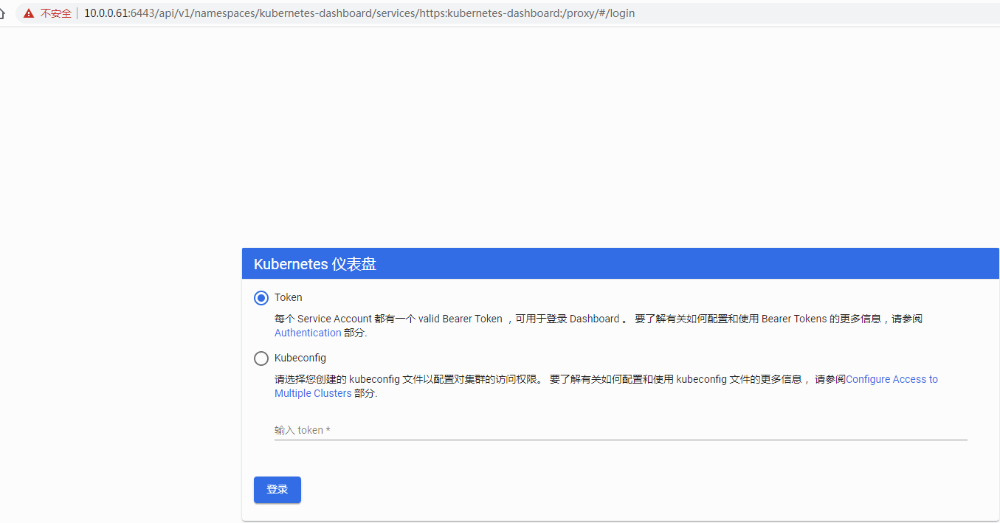
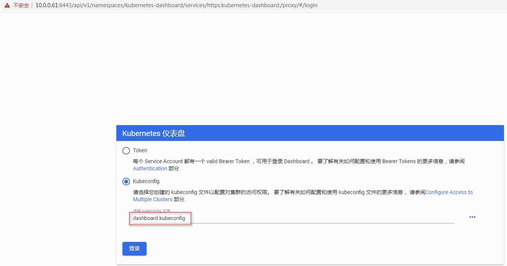
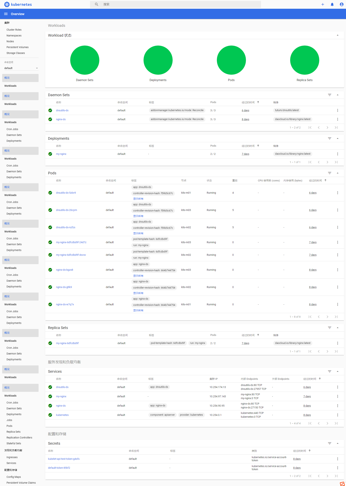
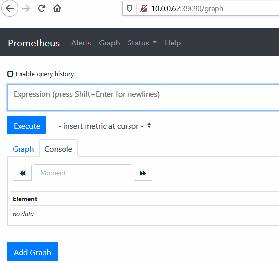
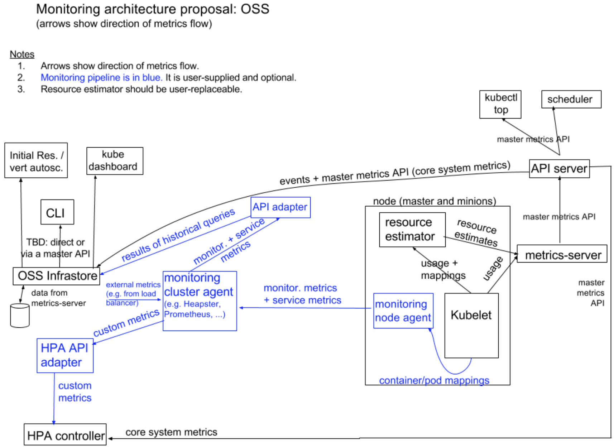
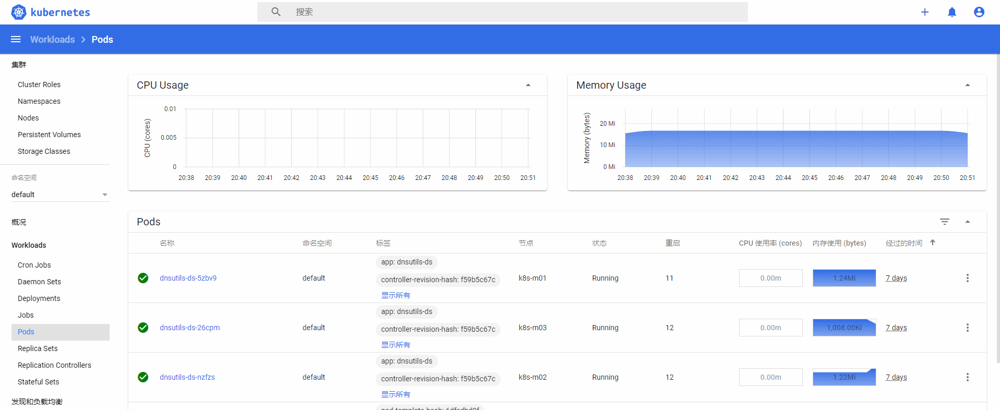

[TOC]


# Kubernetes集群插件


插件是Kubernetes集群的附件组件，丰富和完善了集群的功能，这里分别介绍的插件有coredns、Dashboard、Metrics Server，需要注意的是：kuberntes 自带插件的 manifests.yaml 文件使用 gcr.io 的 docker registry，国内被墙，需要手动替换为其它registry 地址或提前在翻墙服务器上下载，然后再同步到对应的k8s部署机器上。

## 1.1 Coredns

官网 ：https://coredns.io/ 

CoreDNS是Golang编写的一个插件式DNS服务器，是Kubernetes 1.13 后所内置的默认DNS服务器；由于其灵活性，它可以在多种环境中使用。

CoreDNS 其实就是一个 DNS 服务，而 DNS 作为一种常见的服务发现手段，所以很多开源项目以及工程师都会使用 CoreDNS 为集群提供服务发现的功能，Kubernetes 就在集群中使用 CoreDNS 解决服务发现的问题。

CoreDNS 的大多数功能都是由插件来实现的，插件和服务本身都使用了 Caddy 提供的一些功能，所以项目本身也不是特别的复杂。


**1、下载和配置 coredns**

```bash
cd /opt/k8s/work
git clone https://github.com/coredns/deployment.git
mv deployment coredns-deployment
```

**2、创建 coredns**

```bash
cd /opt/k8s/work/coredns-deployment/kubernetes
source /opt/k8s/bin/environment.sh
./deploy.sh -i ${CLUSTER_DNS_SVC_IP} -d ${CLUSTER_DNS_DOMAIN} | kubectl apply -f -
```

**3、检查 coredns 功能**

```shell
$ kubectl get all -n kube-system -l k8s-app=kube-dns
NAME                           READY   STATUS    RESTARTS   AGE
pod/coredns-59845f77f8-l7rjh   1/1     Running   0          37h

NAME               TYPE        CLUSTER-IP   EXTERNAL-IP   PORT(S)                  AGE
service/kube-dns   ClusterIP   10.254.0.2   <none>        53/UDP,53/TCP,9153/TCP   37h

NAME                      READY   UP-TO-DATE   AVAILABLE   AGE
deployment.apps/coredns   1/1     1            1           37h

NAME                                 DESIRED   CURRENT   READY   AGE
replicaset.apps/coredns-59845f77f8   1         1         1       37h
```

查看创建的coredns的pod状态 ：

```bash
$ kubectl describe pod/coredns-59845f77f8-l7rjh -n kube-system
Name:                 coredns-59845f77f8-l7rjh
Namespace:            kube-system
Priority:             2000000000
Priority Class Name:  system-cluster-critical
Node:                 k8s-m01/10.0.0.61
Start Time:           Fri, 10 Apr 2020 20:24:29 +0800
Labels:               k8s-app=kube-dns
                      pod-template-hash=59845f77f8
Annotations:          <none>
Status:               Running
IP:                   172.30.40.3
IPs:
  IP:           172.30.40.3
Controlled By:  ReplicaSet/coredns-59845f77f8
```


**4、新建一个 Deployment**

```yml
cd /opt/k8s/work
cat > my-nginx.yaml <<EOF
apiVersion: apps/v1
kind: Deployment
metadata:
  name: my-nginx
spec:
  replicas: 3
  selector:
    matchLabels:
      run: my-nginx
  template:
    metadata:
      labels:
        run: my-nginx
    spec:
      containers:
      - name: my-nginx
        image: daocloud.io/library/nginx:latest
        ports:
        - containerPort: 80
EOF
kubectl create -f my-nginx.yaml
```

export 该 Deployment, 生成 my-nginx 服务：

```bash
$ kubectl expose deploy my-nginx
$ kubectl get services --all-namespaces |grep my-nginx
default       my-nginx     ClusterIP   10.254.97.143   <none>        80/TCP                   35s
```

创建一个dns测试工具Pod，查看 /etc/resolv.conf 是否包含 kubelet 配置的 `--cluster-dns` 和 `--cluster-domain`：

```yml
cd /opt/k8s/work
cat > dnsutils-ds.yml <<EOF
apiVersion: v1
kind: Service
metadata:
  name: dnsutils-ds
  labels:
    app: dnsutils-ds
spec:
  type: NodePort
  selector:
    app: dnsutils-ds
  ports:
  - name: http
    port: 80
    targetPort: 80
---
apiVersion: apps/v1
kind: DaemonSet
metadata:
  name: dnsutils-ds
  labels:
    addonmanager.kubernetes.io/mode: Reconcile
spec:
  selector:
    matchLabels:
      app: dnsutils-ds
  template:
    metadata:
      labels:
        app: dnsutils-ds
    spec:
      containers:
      - name: my-dnsutils
        image: tutum/dnsutils:latest
        command:
          - sleep
          - "3600"
        ports:
        - containerPort: 80
EOF
kubectl create -f dnsutils-ds.yml
```

**5、查看dnsutils的pod状态**

确保是`Running`；如不是请查看`kubectl describe pod dnsutils-ds-2rlkm`

```bash
$ kubectl get pods -lapp=dnsutils-ds
NAME                READY   STATUS              RESTARTS   AGE
dnsutils-ds-2rlkm   1/1     Running			    0          5m28s
dnsutils-ds-9hw5m   1/1     Running             0          5m28s
dnsutils-ds-mlxnr   1/1     Running             0          5m28s
```

查看pod的`/etc/resolv.conf`

```bash
$ kubectl -it exec dnsutils-ds-26cpm  cat /etc/resolv.conf
nameserver 10.254.0.2
search default.svc.cluster.local svc.cluster.local cluster.local
options ndots:5
```

```bash
$ kubectl -it exec dnsutils-ds-26cpm nslookup kubernetes
Server:		10.254.0.2
Address:	10.254.0.2#53

Name:	kubernetes.default.svc.cluster.local
Address: 10.254.0.1
```

```bash
$ kubectl -it exec dnsutils-ds-26cpm nslookup www.baidu.com
Server:		10.254.0.2
Address:	10.254.0.2#53

Non-authoritative answer:
www.baidu.com	canonical name = www.a.shifen.com.
Name:	www.a.shifen.com
Address: 61.135.169.121
Name:	www.a.shifen.com
Address: 61.135.169.125
```

 发现可以将服务 my-nginx 解析到上面它对应的 Cluster IP 10.254.97.143 :

```bash
$ kubectl -it exec dnsutils-ds-26cpm nslookup my-nginx
Server:		10.254.0.2
Address:	10.254.0.2#53

Name:	my-nginx.default.svc.cluster.local
Address: 10.254.97.143
```


## 1.2 Dashboard

Dashboard 是基于网页的 Kubernetes 用户界面。您可以使用 Dashboard 将容器应用部署到 Kubernetes 集群中，也可以对容器应用排错，还能管理集群本身及其附属资源。您可以使用 Dashboard 获取运行在集群中的应用的概览信息，也可以创建或者修改 Kubernetes 资源（如 Deployment，Job，DaemonSet 等等）。例如，您可以对 Deployment 实现弹性伸缩、发起滚动升级、重启 Pod 或者使用向导创建新的应用。

在kubernetes Dashboard中可以查看集群中应用的运行状态，也能够创建和修改各种kubernetes资源（比如Deployment，Job，Daemonset等等），用户可以对Deployment实现弹性伸缩，执行滚动升级，重启pod或者使用向导创建新的应用。

可以说，kubernetes Dashboard提供了kubectl的绝大部分功能。

- 全面的群集管理：命名空间，节点，窗格，副本集，部署，存储，RBAC创建修改等
- 快速且始终如一的即时更新：无需刷新页面即可查看最新信息
- 快速查看集群运行状况：实时图表可帮助快速跟踪性能不佳的资源
- 易于CRUD和扩展：加上内联API文档，可以轻松了解每个字段的作用
- 简单的OpenID集成：无需特殊代理

Dashboard 同时展示了kubernetes集群中的资源状态信息和所有报错信息。


官方参考文档：https://kubernetes.io/zh/docs/tasks/access-application-cluster/web-ui-dashboard/
GitHub项目下载地址：https://github.com/kubernetes/dashboard 

**1、部署Dashboard UI**

```bash
cd /opt/k8s/work
wget https://raw.githubusercontent.com/kubernetes/dashboard/v2.0.0-rc7/aio/deploy/recommended.yaml
mv  recommended.yaml dashboard-recommended.yaml
```

 [dashboard-recommended.yaml](assets\dashboard-recommended.yaml) 

执行所有定义文件：

```bash
cd /opt/k8s/work
kubectl apply -f  dashboard-recommended.yaml
```

查看运行状态：

```bash
$ kubectl get pods -n kubernetes-dashboard
NAME                                        READY   STATUS    RESTARTS   AGE
dashboard-metrics-scraper-b68468655-vfnbf   1/1     Running   0          2m31s
kubernetes-dashboard-64999dbccd-tkvx2       1/1     Running   0          2m32s
```

查看`kubernetes-dashboard`信息：

```bash
$ kubectl get pod,deployment,svc -n kubernetes-dashboard
NAME                                            READY   STATUS    RESTARTS   AGE
pod/dashboard-metrics-scraper-b68468655-vfnbf   1/1     Running   0          9m44s
pod/kubernetes-dashboard-64999dbccd-tkvx2       1/1     Running   0          9m45s

NAME                                        READY   UP-TO-DATE   AVAILABLE   AGE
deployment.apps/dashboard-metrics-scraper   1/1     1            1           9m45s
deployment.apps/kubernetes-dashboard        1/1     1            1           9m45s

NAME                                TYPE        CLUSTER-IP       EXTERNAL-IP   PORT(S)    AGE
service/dashboard-metrics-scraper   ClusterIP   10.254.124.164   <none>        8000/TCP   9m45s
service/kubernetes-dashboard        ClusterIP   10.254.119.42    <none>        443/TCP    9m45s
```

**2、访问 dashboard**

从 1.7 开始，dashboard 只允许通过 https 访问，如果使用 kube proxy 则必须监听 localhost 或 127.0.0.1。对于 NodePort 没有这个限制，但是仅建议在开发环境中使用。对于不满足这些条件的登录访问，在登录成功后浏览器不跳转，始终停在登录界面。

**访问方式：**

Dashboard的github  https://github.com/kubernetes/dashboard/blob/master/docs/user/accessing-dashboard/1.7.x-and-above.md

- **kubectl proxy**：kubectl proxy在您的机器和Kubernetes API服务器之间创建代理服务器。默认情况下，只能在本地（从启动它的计算机上）访问它。

- **kubectl port-forward**：通过端口转发映射本地端口到指定的应用端口，从而访问集群中的应用程序(Pod)。

- **NodePort**：这种方法只推荐使用在一个node节点的方案，在大多数的环境都需要多个node节点，因此这种方法没有什么实用价值，不建议使用。

- **API Server**：如果Kubernetes API服务器是公开的并且可以从外部访问，则可以直接在以下位置访问仪表板： https://<master-ip>:<apiserver-port>/api/v1/namespaces/kubernetes-dashboard/services/https:kubernetes-dashboard:/proxy/

  注意：仅当您选择在浏览器中安装用户证书时，才可以使用这种方式访问Dashboard。在示例中，可以使用kubeconfig文件用于联系API服务器的证书。

- **Ingress**


访问： https://10.0.0.61:6443/api/v1/namespaces/kubernetes-dashboard/services/https:kubernetes-dashboard:/proxy/ 




**3、创建登录 Dashboard 的 token 和 kubeconfig 配置文件**

dashboard 默认只支持 token 认证（不支持 client 证书认证），所以如果使用 Kubeconfig 文件，需要将 token 写入到该文件。

**方式一：创建登录 token**

```bash
kubectl create sa dashboard-admin -n kube-system
kubectl create clusterrolebinding dashboard-admin --clusterrole=cluster-admin --serviceaccount=kube-system:dashboard-admin
ADMIN_SECRET=$(kubectl get secrets -n kube-system | grep dashboard-admin | awk '{print $1}')
DASHBOARD_LOGIN_TOKEN=$(kubectl describe secret -n kube-system ${ADMIN_SECRET} | grep -E '^token' | awk '{print $2}')
echo ${DASHBOARD_LOGIN_TOKEN}
```

则可以使用上面输出的token 登录 Dashboard。


**方法二：创建使用 token 的 KubeConfig 文件 （推荐使用这种方式）**

```bash
source /opt/k8s/bin/environment.sh
# 设置集群参数
kubectl config set-cluster kubernetes \
  --certificate-authority=/etc/kubernetes/cert/ca.pem \
  --embed-certs=true \
  --server=${KUBE_APISERVER} \
  --kubeconfig=dashboard.kubeconfig

# 设置客户端认证参数，使用上面创建的 Token
kubectl config set-credentials dashboard_user \
  --token=${DASHBOARD_LOGIN_TOKEN} \
  --kubeconfig=dashboard.kubeconfig

# 设置上下文参数
kubectl config set-context default \
  --cluster=kubernetes \
  --user=dashboard_user \
  --kubeconfig=dashboard.kubeconfig

# 设置默认上下文
kubectl config use-context default --kubeconfig=dashboard.kubeconfig

[root@ k8s-m01 ~]# ll
-rw-------  1 root root 3015 2020-04-19 10:44 dashboard.kubeconfig
```

用生成的 dashboard.kubeconfig 登录 Dashboard（其它API server节点也可以用）。

登录：






这里由于缺少Heapster或metrics-server插件，当前dashboard还不能展示 Pod、Nodes 的 CPU、内存等统计数据和图表。


## 1.3 Kube-prometheus

很多地方提到Prometheus Operator是kubernetes集群监控的终极解决方案，但是目前Prometheus Operator已经不包含完整功能，完整的解决方案已经变为kube-prometheus。项目地址为：

https://github.com/coreos/kube-prometheus

kube-prometheus 是一整套监控解决方案，它使用 Prometheus 采集集群指标，Grafana 做展示，包含如下组件：

- The Prometheus Operator
- Highly available Prometheus
- Highly available Alertmanager
- Prometheus node-exporter
- ==Prometheus Adapter for Kubernetes Metrics APIs （k8s-prometheus-adapter）==
- ==kube-state-metrics==
- Grafana

其中 k8s-prometheus-adapter 使用 Prometheus 实现了 metrics.k8s.io 和 custom.metrics.k8s.io API，所以**不需要再部署** metrics-server（ metrics-server 通过 kube-apiserver 发现所有节点，然后调用 kubelet APIs（通过 https 接口）获得各节点（Node）和 Pod 的 CPU、Memory 等资源使用情况。 从 Kubernetes 1.12 开始，kubernetes 的安装脚本移除了 Heapster，从 1.13 开始完全移除了对 Heapster 的支持，Heapster 不再被维护）。


**1、下载和安装**

上传kube-prometheus的所有镜像到/opt/k8s/work并且导入。

```bash
cd /opt/k8s/work

source /opt/k8s/bin/environment.sh
for node_ip in ${MASTER_IPS[@]}
do
	echo -e "\033[42;37m >>> ${node_ip} <<< \033[0m"
	scp kube-prometheus-0.5.0.tar root@${node_ip}:/opt/k8s/work
	ssh root@${node_ip} "cd /opt/k8s/work/ && tar xf kube-prometheus-0.5.0.tar"
done

#所有节点导入镜像
cd /opt/k8s/work/kube-prometheus-0.5.0/ && for i in `ls`;do docker load -i $i;done
```

**2、下载源码**

```
cd /opt/k8s/work
git clone https://github.com/coreos/kube-prometheus.git

```


**3、修改访问模式为nodeport**

==修改grafana-service文件：==

```yml
cd /opt/k8s/work/kube-prometheus/
cat >manifests/grafana-service.yaml<<EOF
apiVersion: v1
kind: Service
metadata:
  labels:
    app: grafana
  name: grafana
  namespace: monitoring
spec:
  type: NodePort
  ports:
  - name: http
    port: 3000
    targetPort: http
    nodePort: 33000
  selector:
    app: grafana
EOF
```

==修改Prometheus-service文件：==

```yml
cd /opt/k8s/work/kube-prometheus/
cat >manifests/prometheus-service.yaml<<EOF
apiVersion: v1
kind: Service
metadata:
  labels:
    prometheus: k8s
  name: prometheus-k8s
  namespace: monitoring
spec:
  type: NodePort
  ports:
  - name: web
    port: 9090
    targetPort: web
    nodePort: 39090
  selector:
    app: prometheus
    prometheus: k8s
  sessionAffinity: ClientIP
EOF
```

==修改alertmanager-service文件：==

```bash
cd /opt/k8s/work/kube-prometheus/
cat >manifests/alertmanager-service.yaml<<EOF
apiVersion: v1
kind: Service
metadata:
  labels:
    alertmanager: main
  name: alertmanager-main
  namespace: monitoring
spec:
  type: NodePort
  ports:
  - name: web
    port: 9093
    targetPort: web
    nodePort: 39093
  selector:
    alertmanager: main
    app: alertmanager
  sessionAffinity: ClientIP
EOF
```


**3、执行安装操作**

```bash
# 安装 prometheus-operator
kubectl apply -f manifests/setup
# 安装 promethes metric adapter
kubectl apply -f manifests/
```


**4、查看需要哪些镜像**

```yml
[root@ k8s-m01 kube-prometheus]# grep -r quay.io manifests/*
manifests/alertmanager-alertmanager.yaml:  image: quay.io/prometheus/alertmanager:v0.20.0
manifests/kube-state-metrics-deployment.yaml:        image: quay.io/coreos/kube-state-metrics:v1.9.5
manifests/kube-state-metrics-deployment.yaml:        image: quay.io/coreos/kube-rbac-proxy:v0.4.1
manifests/kube-state-metrics-deployment.yaml:        image: quay.io/coreos/kube-rbac-proxy:v0.4.1
manifests/node-exporter-daemonset.yaml:        image: quay.io/prometheus/node-exporter:v0.18.1
manifests/node-exporter-daemonset.yaml:        image: quay.io/coreos/kube-rbac-proxy:v0.4.1
manifests/prometheus-adapter-deployment.yaml:        image: quay.io/coreos/k8s-prometheus-adapter-amd64:v0.5.0
manifests/prometheus-prometheus.yaml:  image: quay.io/prometheus/prometheus:v2.15.2
manifests/setup/prometheus-operator-deployment.yaml:        - --prometheus-config-reloader=quay.io/coreos/prometheus-config-reloader:v0.38.1
manifests/setup/prometheus-operator-deployment.yaml:        image: quay.io/coreos/prometheus-operator:v0.38.1
manifests/setup/prometheus-operator-deployment.yaml:        image: quay.io/coreos/kube-rbac-proxy:v0.4.1

[root@ k8s-m01 kube-prometheus]# grep -r jimmidyson manifests/*
manifests/setup/prometheus-operator-deployment.yaml:        - --config-reloader-image=jimmidyson/configmap-reload:v0.3.0

```

**5、查看Prometheus资源**

```bash
$ kubectl get pod -n monitoring
NAME                                   READY   STATUS    RESTARTS   AGE
alertmanager-main-0                    2/2     Running   0          15s
alertmanager-main-1                    2/2     Running   0          15s
alertmanager-main-2                    1/2     Running   0          15s
grafana-86b55cb79f-j4qv5               0/1     Running   0          13s
kube-state-metrics-dbb85dfd5-5zl2b     3/3     Running   0          12s
node-exporter-dc6bs                    2/2     Running   0          12s
node-exporter-vnvpl                    2/2     Running   0          12s
node-exporter-z9r5q                    2/2     Running   0          12s
prometheus-adapter-5cd5798d96-2qnd6    1/1     Running   0          10s
prometheus-k8s-0                       3/3     Running   1          7s
prometheus-k8s-1                       3/3     Running   1          7s
prometheus-operator-5cfbdc9b67-ngv75   2/2     Running   0          34s


$ kubectl get svc -n monitoring
NAME                    TYPE        CLUSTER-IP       EXTERNAL-IP   PORT(S)                      AGE
alertmanager-main       NodePort    10.254.76.23     <none>        9093:39093/TCP               27s
alertmanager-operated   ClusterIP   None             <none>        9093/TCP,9094/TCP,9094/UDP   23s
grafana                 NodePort    10.254.171.162   <none>        3000:33000/TCP               24s
kube-state-metrics      ClusterIP   None             <none>        8443/TCP,9443/TCP            23s
node-exporter           ClusterIP   None             <none>        9100/TCP                     23s
prometheus-adapter      ClusterIP   10.254.157.0     <none>        443/TCP                      21s
prometheus-k8s          NodePort    10.254.7.138     <none>        9090:39090/TCP               18s
prometheus-operated     ClusterIP   None             <none>        9090/TCP                     12s
prometheus-operator     ClusterIP   None             <none>        8443/TCP                     30s


```

**6、清除资源**

```bash
kubectl delete --ignore-not-found=true -f manifests/ -f manifests/setup

#强制删除pod
kubectl delete pod prometheus-k8s-1 -n monitoring --force --grace-period=0
```

以上各组件说明：

- MerticServer： k8s集群资源使用情况的聚合器，收集数据给k8s集群内使用；如kubectl，hpa，scheduler
- PrometheusOperator：是一个系统监测和警报工具箱，用来存储监控数据。
- NodeExPorter：用于各个node的关键度量指标状态数据。
- kubeStateMetrics：收集k8s集群内资源对象数据，指定告警规则。
- Prometheus：采用pull方式收集apiserver，scheduler，control-manager，kubelet组件数据，通过http协议传输。
- Grafana：是可视化数据统计和监控平台。


**7、 Prometheus监控页面展示**

==访问Prometheus web页面：==

因为Prometheus的`replicas: 2`；所以可能会随机创建在三台机器中的任意两台。




# 附录：

# 使用Kube-prometheus，则无需部署以下插件


## 1.1 Metrics-server

Metrics Server是Kubernetes内置自动伸缩管道的可扩展，高效的容器资源指标来源。

Metrics Server从Kubelet收集资源指标，并通过[Metrics API](https://github.com/kubernetes/metrics)在Kubernetes apiserver中公开它们， 以供[Horizontal Pod Autoscaler](https://kubernetes.io/docs/tasks/run-application/horizontal-pod-autoscale/)和[Vertical Pod Autoscaler使用](https://github.com/kubernetes/autoscaler/tree/master/vertical-pod-autoscaler)。也可以通过访问Metrics API `kubectl top`，从而更轻松地调试自动缩放管道。

Metrics Server并非用于非自动缩放目的。例如，请勿将其用于将指标转发到监视解决方案，也不要将其用作监视解决方案指标的来源。

Metrics Server提供：

- 适用于大多数集群的单个部署（请参阅[需求](https://github.com/kubernetes-sigs/metrics-server#requirements)）
- 可扩展支持多达5,000个节点集群
- 资源效率：Metrics Server使用0.5m核心CPU和每个节点4 MB内存

metrics-server 通过 kube-apiserver 发现所有节点，然后调用 kubelet APIs（通过 https 接口）获得各节点（Node）和 Pod 的 CPU、Memory 等资源使用情况。从 Kubernetes 1.12 开始，kubernetes 的安装脚本移除了 Heapster，从 1.13 开始完全移除了对 Heapster 的支持，Heapster 不再被维护。替代方案如下：

- 用于支持自动扩缩容的 CPU/memory HPA metrics：metrics-server；
- 通用的监控方案：使用第三方可以获取 Prometheus 格式监控指标的监控系统，如 Prometheus Operator；
- 事件传输：使用第三方工具来传输、归档 kubernetes events；

从 Kubernetes 1.8 开始，资源使用指标（如容器 CPU 和内存使用率）通过 Metrics API 在 Kubernetes 中获取, metrics-server 替代了heapster。Metrics Server 实现了Resource Metrics API，Metrics Server 是集群范围资源使用数据的聚合器。 Metrics Server 从每个节点上的 Kubelet 公开的 Summary API 中采集指标信息。

有了Metrics Server组件，也采集到了该有的数据，也暴露了api，但因为api要统一，如何将请求到api-server的/apis/metrics请求转发给Metrics Server呢，解决方案就是：kube-aggregator,在k8s的1.7中已经完成，之前Metrics Server一直没有面世，就是耽误在了kube-aggregator这一步。kube-aggregator（聚合api）主要提供：

- Provide an API for registering API servers;
- Summarize discovery information from all the servers;
- Proxy client requests to individual servers;

**Metric API的使用：**

- Metrics API 只可以查询当前的度量数据，并不保存历史数据;
- Metrics API URI 为 /apis/metrics.k8s.io/，在 k8s.io/metrics 维护;
- 必须部署 metrics-server 才能使用该 API，metrics-server 通过调用 Kubelet Summary API 获取数据

Metrics server定时从Kubelet的Summary API(类似/ap1/v1/nodes/nodename/stats/summary)采集指标信息，这些聚合过的数据将存储在内存中，且以metric-api的形式暴露出去。Metrics server复用了api-server的库来实现自己的功能，比如鉴权、版本等，为了实现将数据存放在内存中吗，去掉了默认的etcd存储，引入了内存存储（即实现Storage interface)。因为存放在内存中，因此监控数据是没有持久化的，可以通过第三方存储来拓展，这个和heapster是一致的。

Kubernetes Dashboard 还不支持 metrics-server，如果使用 metrics-server 替代 Heapster，将无法在 dashboard 中以图形展示 Pod 的内存和 CPU 情况，需要通过 Prometheus、Grafana 等监控方案来弥补。kuberntes 自带插件的 manifests yaml 文件使用 gcr.io 的 docker registry，国内被墙，需要手动替换为其它 registry 地址（本文档未替换）；可以从微软中国提供的 gcr.io 免费代理下载被墙的镜像。

**监控架构：**



Metrics server出现后，新的Kubernetes 监控架构将变成上图的样子

核心流程（黑色部分）：这是 Kubernetes正常工作所需要的核心度量，从 Kubelet、cAdvisor 等获取度量数据，再由metrics-server提供给 Dashboard、HPA 控制器等使用。

监控流程（蓝色部分）：基于核心度量构建的监控流程，比如 Prometheus 可以从 metrics-server 获取核心度量，从其他数据源（如 Node Exporter 等）获取非核心度量，再基于它们构建监控告警系统。

官方地址：https://github.com/kubernetes-incubator/metrics-server

==**metric-server使用：**==

如上文提到的，metric-server是扩展的apiserver，依赖于kube-aggregator，因此需要在apiserver中开启相关参数。

```ruby
--requestheader-allowed-names="aggregator"
--requestheader-client-ca-file=/etc/kubernetes/cert/ca.pem
--requestheader-extra-headers-prefix="X-Remote-Extra-"
--requestheader-group-headers=X-Remote-Group
--requestheader-username-headers=X-Remote-User
--proxy-client-cert-file=/etc/kubernetes/cert/proxy-client.pem
--proxy-client-key-file=/etc/kubernetes/cert/proxy-client-key.pem
```

**1、安装 metrics-server**

==详细请看 [metrics-server-deployment.yaml](assets\metrics-server-deployment.yaml)== 

```yml
cd /opt/k8s/work/
# git clone https://github.com/kubernetes-sigs/metrics-server.git
# 此处用的是v0.3.6
tar -zxvf metrics-server-v0.3.6.tar.gz
cd metrics-server-0.3.6/deploy/1.8+/
cp metrics-server-deployment.yaml{,.bak}
vim metrics-server-deployment.yaml
......
spec:
      hostNetwork: true #新增
      serviceAccountName: metrics-server
      volumes:
      - name: tmp-dir
        emptyDir: {}
      containers:
      - name: metrics-server
        image: registry.cn-hangzhou.aliyuncs.com/google_containers/metrics-server-amd64:v0.3.6 #修改国内镜像源
        command:	#新增
        - /metrics-server #新增
        - --metric-resolution=30s #新增
        - --kubelet-insecure-tls #新增
        - --kubelet-preferred-address-types=InternalIP,Hostname,InternalDNS,ExternalDNS,ExternalIP #新增
        imagePullPolicy: Always  #修改
......

#创建metrics-server
kubectl create -f .
```

**2、 查看运行情况** 

```bash
[root@ k8s-m01 1.8+]# kubectl -n kube-system get pods -l k8s-app=metrics-server
NAME                              READY   STATUS    RESTARTS   AGE
metrics-server-7c4c487b76-fn8jv   1/1     Running   0          51s
[root@ k8s-m01 1.8+]# kubectl get svc -n kube-system  metrics-server
NAME             TYPE        CLUSTER-IP      EXTERNAL-IP   PORT(S)   AGE
metrics-server   ClusterIP   10.254.91.183   <none>        443/TCP   61s

[root@ k8s-m01 ~]# kubectl cluster-info
Kubernetes master is running at https://10.0.0.88:8443
CoreDNS is running at https://10.0.0.88:8443/api/v1/namespaces/kube-system/services/kube-dns:dns/proxy
Metrics-server is running at https://10.0.0.88:8443/api/v1/namespaces/kube-system/services/https:metrics-server:/proxy
```

**3、 查看 metrics-server 输出的 metrics** 

 通过 kube-apiserver 或 kubectl proxy 访问： 

```bash
https://10.0.0.61:8443/apis/metrics.k8s.io/v1beta1/nodes
https://10.0.0.61:8443/apis/metrics.k8s.io/v1beta1/pods
```

直接使用 kubectl 命令访问 ：

```bash
kubectl get --raw https://10.0.0.61:6443/apis/metrics.k8s.io/v1beta1/nodes | jq .
kubectl get --raw https://10.0.0.61:6443/apis/metrics.k8s.io/v1beta1/pods | jq .
kubectl get --raw https://10.0.0.61:6443/apis/metrics.k8s.io/v1beta1/nodes/<node-name> | jq .
kubectl get --raw https://10.0.0.61:6443/apis/metrics.k8s.io/v1beta1/namespace/<namespace-name>/pods/<pod-name> | jq .
```

**4、使用 kubectl top 命令查看集群节点资源使用情况**

```bash
[root@ k8s-m01 1.8+]# kubectl top pods -n kube-system
NAME                              CPU(cores)   MEMORY(bytes)
coredns-59845f77f8-l7rjh          4m           16Mi
metrics-server-7c4c487b76-fn8jv   3m           14Mi
[root@ k8s-m01 1.8+]# kubectl top nodes
NAME      CPU(cores)   CPU%   MEMORY(bytes)   MEMORY%
k8s-m01   160m         8%     2485Mi          64%
k8s-m02   181m         9%     1984Mi          51%
k8s-m03   161m         8%     1931Mi          50%
```

此时，k8s的Dashboard也可以看到pod使用资源情况。




## 1.2 kube-state-metrics

**1、概述：**

已经有了cadvisor、heapster、metric-server，几乎容器运行的所有指标都能拿到，但是下面这种情况却无能为力：

- 我调度了多少个replicas？现在可用的有几个？
- 多少个Pod是running/stopped/terminated状态？
- Pod重启了多少次？
- 我有多少job在运行中

而这些则是kube-state-metrics提供的内容，它基于client-go开发，轮询Kubernetes API，并将Kubernetes的结构化信息转换为metrics。

**2、功能：**

kube-state-metrics提供的指标，按照阶段分为三种类别：

1.实验性质的：k8s api中alpha阶段的或者spec的字段。

2.稳定版本的：k8s中不向后兼容的主要版本的更新

3.被废弃的：已经不在维护的。

**指标类别包括：**

```bash
CronJob Metrics
DaemonSet Metrics
Deployment Metrics
Job Metrics
LimitRange Metrics
Node Metrics
PersistentVolume Metrics
PersistentVolumeClaim Metrics
Pod Metrics
Pod Disruption Budget Metrics
ReplicaSet Metrics
ReplicationController Metrics
ResourceQuota Metrics
Service Metrics
StatefulSet Metrics
Namespace Metrics
Horizontal Pod Autoscaler Metrics
Endpoint Metrics
Secret Metrics
ConfigMap Metrics
```

**以pod为例：**

```
kube_pod_info
kube_pod_owner
kube_pod_status_phase
kube_pod_status_ready
kube_pod_status_scheduled
kube_pod_container_status_waiting
kube_pod_container_status_terminated_reason
...
```

==kube-state-metrics与metric-server (或heapster)的对比：==

1. metric-server是从api-server中获取cpu,内存使用率这种监控指标，并把它们发送给存储后端，如influxdb或云厂商，它当前的核心作用是：为HPA等组件提供决策指标支持；
2. kube-state-metrics关注于获取k8s各种资源的最新状态，如deployment或者daemonset，之所以没有把kube-state-metrics纳入到metric-server的能力中，是因为它们的关注点本质上是不一样的。metric-server仅仅是获取、格式化现有数据，写入特定的存储，实质上是一个监控系统。而kube-state-metrics是将k8s的运行状况在内存中做了个快照，并且获取新的指标，但它没有能力导出这些指标；
3. 换个角度讲，kube-state-metrics本身是metric-server的一种数据来源，虽然现在没有这么做；
4. 另外，像Prometheus这种监控系统，并不会去用metric-server中的数据，它都是自己做指标收集、集成的（Prometheus包含了metric-server的能力），但Prometheus可以监控metric-server本身组件的监控状态并适时报警，这里的监控就可以通过kube-state-metrics来实现，如metric-serverpod的运行状态；

==kube-state-metrics本质上是不断轮询api-server，其性能优化：==

kube-state-metrics在之前的版本中暴露出两个问题：

1. /metrics接口响应慢(10-20s)
2. 内存消耗太大，导致超出limit被杀掉

问题一的方案：就是基于client-go的cache tool实现本地缓存，具体结构为：`var cache = map[uuid][]byte{}`

问题二的的方案是：对于时间序列的字符串，是存在很多重复字符的（如namespace等前缀筛选），可以用指针或者结构化这些重复字符。

==kube-state-metrics优化点和问题：==

1. 因为kube-state-metrics是监听资源的add、delete、update事件，那么在kube-state-metrics部署之前已经运行的资源的数据是不是就拿不到了？其实kube-state-metric利用client-go可以初始化所有已经存在的资源对象，确保没有任何遗漏；
2. kube-state-metrics当前不会输出metadata信息(如help和description）；
3. 缓存实现是基于golang的map，解决并发读问题当期是用了一个简单的互斥锁，应该可以解决问题，后续会考虑golang的sync.Map安全map；
4. kube-state-metrics通过比较resource version来保证event的顺序；
5. kube-state-metrics并不保证包含所有资源；


**3、使用**

```bash
cd /opt/k8s/work/
git clone https://github.com/kubernetes/kube-state-metrics.git
cd kube-state-metrics/examples/standard/

vim service.yaml
apiVersion: v1
kind: Service
metadata:
  labels:
    app.kubernetes.io/name: kube-state-metrics
    app.kubernetes.io/version: 1.9.5
  name: kube-state-metrics
  namespace: kube-system
  annotations:
   prometheus.io/scrape: "true" #添加此参数，允许prometheus自动发现
spec:
  clusterIP: None
  ports:
  - name: http-metrics
    port: 8080
    targetPort: http-metrics
  - name: telemetry
    port: 8081
    targetPort: telemetry
  selector:
    app.kubernetes.io/name: kube-state-metrics
    
#创建kube-state-metrics
kubectl delete -f .
```

查看状态：

```bash
$ kubectl get pod,svc -n kube-system|grep kube-state-metrics
pod/kube-state-metrics-6d4847485d-xwlm8   1/1     Running   0          5m20s
service/kube-state-metrics   ClusterIP   None            <none>        8080/TCP,8081/TCP        5m21s
```


