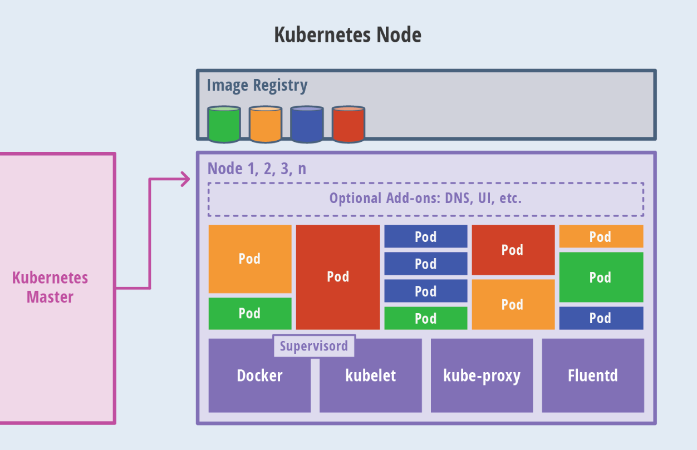
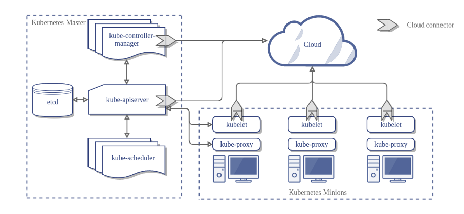

[TOC]

# 第一章 Kubernetes入门及实践

# 1.1 Kebernets介绍
Kubernetes(k8s)是Google2014年开源的容器集群管理系统（谷歌内部:Borg），它主要用于容器容器化应用程序的部署、扩展和管理。

k8s提供了容器编排、资源调度、弹性伸缩、部署管理、服务发现等一系列功能。

k8s的目标是让部署容器化的应用简单并且高效，k8s提供了应用部署、规划、更新、维护的一种机制！

官网地址：<https://kubernetes.io/>

# 1.2 Kubernetes主要功能

| 名词             | 解释                                                         |
| ---------------- | ------------------------------------------------------------ |
| 数据卷           | Pod中容器之间共享数据，可以使用数据卷。                      |
| 应用程序健康检查 | 容器内服务可能进程堵塞无法处理请求，可以设置监控检查策略保证应用健壮性。 |
| 复制应用程序实例 | 控制器维护着Pod副本数量，保证一个Pod或一组同类的Pod数量始终可用。 |
| 弹性伸缩         | 根据设定的指标（CPU利用率）自动缩放Pod副本数。               |
| 服务发现         | 使用环境变量或DNS服务插件保证容器中程序发现Pod入口访问地址。 |
| 负载均衡         | 一组Pod副本分配一个私有的集群IP地址，负载均衡转发请求到后端容器。在集群内部其他Pod可通过这个ClusterIP访问应用。 |
| 滚动更新         | 更新服务不中断，一次更新一个Pod，而不是同时删除整个服务。    |
| 服务编排         | 通过文件描述部署服务，使得应用程序部署变得更高效。           |
| 资源监控         | Node节点组件集成cAdvisor资源收集工具，可通过Heapster汇总整个集群节点资源数据，然后存储到InfluxDB时序数据库，再由Grafana展示。 |
| 提供认证和授权   | 支持角色访问控制（RBAC）认证授权等策略。                     |

# 1.3 设计架构及核心组件

上图可以看到如下组件，使用特别的图标表示Service和Label：

| EN                     | CN               |
| ---------------------- | ---------------- |
| Pod                    | 根容器（容器组） |
| Container              | 容器             |
| Label                  | 标签             |
| Replication Controller | 复制控制器       |
| Service                | 服务             |
| Node                   | 节点             |
| Kubernetes Master      | Kubernetes主节点 |

## 1.3.1 Master 节点组件

master节点上主要运行四个组件：api-server、scheduler、controller-manager、etcd。

| 组件               | 作用                                                         |
| ------------------ | ------------------------------------------------------------ |
| api-server         | 提供了资源操作的唯一入口，各组件协调者并提供认证、授权、访问控制、API注册和发现等机制； |
| scheduler          | 负责资源的调度，按照预定的调度策略将Pod调度到相应的机器上，Kubernetes目前提供了调度算法，但是同样也保了接口，用户可以根据自己的需求定义自己的调度算法。； |
| controller-manager | 如果说APIServer做的是“前台”的工作的话，那controller manager就是负责“后台”的。每个资源一般都对一个控制器，而controller manager就是负责管理这些控制器的。比如我们通过APIServer创建一个pod，当这个pod创建成功后，APIServer的任务就算完成了。而后面保证Pod的状态始终和我们预期的一样的重任就由controller manager去保证了。 |
| etcd               | etcd是一个高可用的键值存储系统，Kubernetes使用它来存储各个资源的状态，从而实现了Restful的API。 |

## 1.3.2 Node 节点组件

每个Node节点主要由三个模块组成：kubelet、kube-proxy、Container runtime。

| 组件              | 作用                                                         |
| ----------------- | ------------------------------------------------------------ |
| Container runtime | 负责镜像管理以及Pod和容器的真正运行（CRI）；指的是容器运行环境，目前Kubernetes支持docker和rkt两种容器。 |
| kube-proxy        | 负责为Service提供cluster内部的服务发现和负载均衡；该模块实现了Kubernetes中的服务发现和反向代理功能。反向代理方面：kube-proxy支持TCP和UDP连接转发，默认基于Round Robin算法将客户端流量转发到与service对应的一组后端pod。服务发现方面，kube-proxy使用etcd的watch机制，监控集群中service和endpoint对象数据的动态变化，并且维护一个service到endpoint的映射关系，从而保证了后端pod的IP变化不会对访问者造成影响。另外kube-proxy还支持session affinity。 |
| kubelet           | 负责维护容器的生命周期，同时也负责Volume（CVI）和网络（CNI）的管理；是Master在每个Node节点上面的agent，是Node节点上面最重要的模块，它负责维护和管理该Node上面的所有容器但是如果容器不是通过Kubernetes创建的，它并不会管理。本质上，它负责使Pod得运行状态与期望的状态一致。 |

除了核心组件，还有一些推荐的Add-ons（插件）：

- kube-dns负责为整个集群提供DNS服务
- Ingress Controller为服务提供外网入口
- Heapster提供资源监控
- Dashboard提供GUI
- Federation提供跨可用区的集群
- Fluentd-elasticsearch提供集群日志采集、存储与查询

**master与node关系：**

## 1.3.3 分层架构

Kubernetes设计理念和功能其实就是一个类似Linux的分层架构，如下图所示

- 核心层：Kubernetes最核心的功能，对外提供API构建高层的应用，对内提供插件式应用执行环境
- 应用层：部署（无状态应用、有状态应用、批处理任务、集群应用等）和路由（服务发现、DNS解析等）
- 管理层：系统度量（如基础设施、容器和网络的度量），自动化（如自动扩展、动态Provision等）以及策略管理（RBAC、Quota、PSP、NetworkPolicy等）
- 接口层：kubectl命令行工具、客户端SDK以及集群联邦
- 生态系统：在接口层之上的庞大容器集群管理调度的生态系统，可以划分为两个范畴
  - Kubernetes外部：日志、监控、配置管理、CI、CD、Workflow、FaaS、OTS应用、ChatOps等
  - Kubernetes内部：CRI、CNI、CVI、镜像仓库、Cloud Provider、集群自身的配置和管理等

# 1.4 基本对象概念

**基本对象：**

|   名称    | 概念                                                         |
| :-------: | :----------------------------------------------------------- |
|    Pod    | 容器组Pod是最小部署单元，一个Pod有一个或多个容器组成， Pod中容器共享存储和网络，在同一台Docker主机上运行。 |
|  Service  | Service一个应用服务抽象，定义了Pod逻辑集合和访问这个Pod集合的策略。 Service代理Pod集合对外表现是为一个访问入口，分配一个集群IP地址，来自这个IP的请求将负载均衡转发后端Pod中的容器。 Service通过Lable Selector选择一组Pod提供服务。 |
|  Volume   | 数据卷，共享Pod中容器使用的数据。分为临时卷、本地卷和网络卷，临时卷和本地卷位于Node本地，常用于数据缓存 |
| Namespace | 命名空间将对象逻辑上分配到不同Namespace，可以是不同的项目、用户等区分管理，并设定控制策略，从而实现多租户。命名空间也称为虚拟集群。同一类型资源对象的Name必须唯一，逻辑分组，默认名称空间是default |
|   Lable   | 标签用于区分对象（比如Pod、 Service），是key/values数据；每个对象可以有多个标签，通过标签关联对象。标签可以在创建一个对象的时候直接给与，也可以在后期随时修改，每一个对象可以拥有多个标签，但是，key值必须是唯一的。 |

**基于基本对象更高层次抽象：**

| 名称        | 概念                                                         |
| ----------- | ------------------------------------------------------------ |
| ReplicaSet  | 下一代Replication Controller。确保任何给定时间指定的Pod副本数量，并提供声明式更新等功能。RC与RS唯一区别就是lable selector支持不同， RS支持新的基于集合的标签， RC仅支持基于等式的标签。 |
| Deployment  | Deployment是一个更高层次的API对象，它管理ReplicaSets和Pod，并提供声明式更新等功能。官方建议使用Deployment管理ReplicaSets，而不是直接使用ReplicaSets，这就意味着可能永远不需要直接操作。 |
| StatefulSet | StatefulSet适合持久性的应用程序，有唯一的网络标识符（IP），持久存储，有序的部署、扩展、删除和滚动更新。 |
| DaemonSet   | DaemonSet确保所有（或一些）节点运行同一个Pod。当节点加入Kubernetes集群中， Pod会被调度到该节点上运行，当节点从集群中。移除时， DaemonSet的Pod会被删除。删除DaemonSet会清理它所有创建的Pod。 |
| Job         | 一次性任务，运行完成后Pod销毁，不再重新启动新容器。还可以任务定时运行。 |

