[TOC]


# 第三章 Kube-prometheus监控

# 1.1 介绍

很多地方提到Prometheus Operator是kubernetes集群监控的终极解决方案，但是目前Prometheus Operator已经不包含完整功能，完整的解决方案已经变为kube-prometheus。项目地址为：

https://github.com/coreos/kube-prometheus

kube-prometheus 是一整套监控解决方案，它使用 Prometheus 采集集群指标，Grafana 做展示，包含如下组件：

| 组件                                                         | 功能描述                                                     |
| :----------------------------------------------------------- | :----------------------------------------------------------- |
| The Prometheus Operator                                      | 可以非常简单的在kubernetes集群中部署Prometheus服务，并且提供对kubernetes集群的监控，并且可以配置和管理prometheus |
| Highly available Prometheus                                  | 高可用监控工具                                               |
| Highly available Alertmanager                                | 高可用告警工具，用于接收 Prometheus 发送的告警信息，它支持丰富的告警通知渠道，而且很容易做到告警信息进行去重，降噪，分组等，是一款前卫的告警通知系统。 |
| node-exporter                                                | 用于采集服务器层面的运行指标，包括机器的loadavg、filesystem、meminfo等基础监控，类似于传统主机监控维度的zabbix-agent |
| Prometheus Adapter for Kubernetes Metrics APIs （k8s-prometheus-adapter） | 轮询Kubernetes API，并将Kubernetes的结构化信息转换为metrics  |
| kube-state-metrics                                           | 收集kubernetes集群内资源对象数据，制定告警规则。             |
| grafana                                                      | 用于大规模指标数据的可视化展现，是网络架构和应用分析中最流行的时序数据展示工具 |

其中 k8s-prometheus-adapter 使用 Prometheus 实现了 metrics.k8s.io 和 custom.metrics.k8s.io API，所以**不需要再部署** metrics-server（ metrics-server 通过 kube-apiserver 发现所有节点，然后调用 kubelet APIs（通过 https 接口）获得各节点（Node）和 Pod 的 CPU、Memory 等资源使用情况。 从 Kubernetes 1.12 开始，kubernetes 的安装脚本移除了 Heapster，从 1.13 开始完全移除了对 Heapster 的支持，Heapster 不再被维护）。

# 1.2 部署

## 1.2.1 下载源码

```bash
cd /etc/kubernetes
git clone https://github.com/coreos/kube-prometheus.git
```


## 1.2.2 执行安装

```bash
# 导入或者下载所需要的镜像
# 安装 prometheus-operator
cd kube-prometheus
kubectl apply -f manifests/setup
# 安装 promethes metric adapter
kubectl apply -f manifests/
```


## 1.2.3 查看资源

```bash
$ kubectl get pod,svc,ep -n monitoring
NAME                                       READY   STATUS    RESTARTS   AGE
pod/alertmanager-main-0                    2/2     Running   0          29s
pod/alertmanager-main-1                    2/2     Running   0          29s
pod/alertmanager-main-2                    2/2     Running   0          29s
pod/grafana-5c55845445-xkhzv               1/1     Running   0          28s
pod/kube-state-metrics-957fd6c75-n824h     3/3     Running   0          28s
pod/node-exporter-7vjxs                    2/2     Running   0          28s
pod/node-exporter-g66bj                    2/2     Running   0          28s
pod/prometheus-adapter-5949969998-bbllb    1/1     Running   0          27s
pod/prometheus-k8s-0                       3/3     Running   1          19s
pod/prometheus-k8s-1                       3/3     Running   1          19s
pod/prometheus-operator-574fd8ccd9-mdtvj   2/2     Running   0          35s

NAME                            TYPE        CLUSTER-IP       EXTERNAL-IP   PORT(S)                      AGE
service/alertmanager-main       ClusterIP   10.100.127.126   <none>        9093/TCP                     30s
service/alertmanager-operated   ClusterIP   None             <none>        9093/TCP,9094/TCP,9094/UDP   29s
service/grafana                 ClusterIP   10.101.41.118    <none>        3000/TCP                     29s
service/kube-state-metrics      ClusterIP   None             <none>        8443/TCP,9443/TCP            29s
service/node-exporter           ClusterIP   None             <none>        9100/TCP                     29s
service/prometheus-adapter      ClusterIP   10.108.198.82    <none>        443/TCP                      28s
service/prometheus-k8s          ClusterIP   10.109.241.36    <none>        9090/TCP                     27s
service/prometheus-operated     ClusterIP   None             <none>        9090/TCP                     19s
service/prometheus-operator     ClusterIP   None             <none>        8443/TCP                     37s

NAME                              ENDPOINTS                                                           AGE
endpoints/alertmanager-main       10.244.4.116:9093,10.244.4.117:9093,10.244.4.118:9093               30s
endpoints/alertmanager-operated   10.244.4.116:9094,10.244.4.117:9094,10.244.4.118:9094 + 6 more...   29s
endpoints/grafana                 10.244.4.119:3000                                                   29s
endpoints/kube-state-metrics      10.244.4.120:9443,10.244.4.120:8443                                 29s
endpoints/node-exporter           10.0.0.61:9100,10.0.0.62:9100                                       29s
endpoints/prometheus-adapter      10.244.4.121:6443                                                   28s
endpoints/prometheus-k8s          10.244.4.122:9090,10.244.4.123:9090                                 27s
endpoints/prometheus-operated     10.244.4.122:9090,10.244.4.123:9090                                 19s
endpoints/prometheus-operator     10.244.4.115:8443                                                   37s
                                          118m

```

**kube-prometheus 创建的 crd 资源：**

```bash
$ kubectl get crd -o wide
NAME                                    CREATED AT
alertmanagers.monitoring.coreos.com     2020-05-07T01:08:40Z
podmonitors.monitoring.coreos.com       2020-05-07T01:08:40Z
prometheuses.monitoring.coreos.com      2020-05-07T01:08:40Z
prometheusrules.monitoring.coreos.com   2020-05-07T01:08:40Z
servicemonitors.monitoring.coreos.com   2020-05-07T01:08:40Z
thanosrulers.monitoring.coreos.com      2020-05-07T01:08:41Z

```

**prometheus 资源定义了 prometheus 服务应该如何运行：**

```bash
$ kubectl -n monitoring get prometheus,alertmanager
NAME                                   VERSION   REPLICAS   AGE
prometheus.monitoring.coreos.com/k8s   v2.17.2   2          5m49s

NAME                                      VERSION   REPLICAS   AGE
alertmanager.monitoring.coreos.com/main   v0.20.0   3          5m52s
```

**prometheus 和 alertmanager 都是 statefulset 控制器：**

```bash
$ kubectl get statefulset -o wide -n monitoring
NAME                READY   AGE     CONTAINERS                                                       IMAGES
alertmanager-main   3/3     7m17s   alertmanager,config-reloader                                     quay.io/prometheus/alertmanager:v0.20.0,jimmidyson/configmap-reload:v0.3.0
prometheus-k8s      2/2     7m7s    prometheus,prometheus-config-reloader,rules-configmap-reloader   quay.io/prometheus/prometheus:v2.17.2,quay.io/coreos/prometheus-config-reloader:v0.38.1,jimmidyson/configmap-reload:v0.3.0

```

**查看node和pod资源使用率：**

 https://10.0.0.61:6443/api/v1/namespaces/kubernetes-dashboard/services/https:kubernetes-dashboard:/proxy/ 

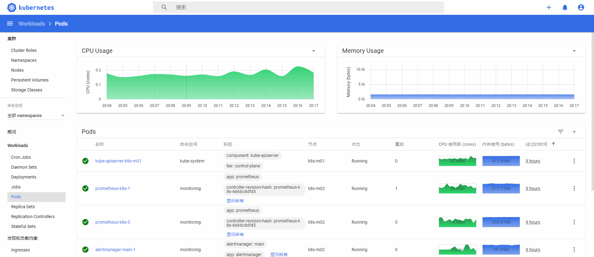


命令行查看node和pod使用资源信息

```bash
$ kubectl top node
NAME      CPU(cores)   CPU%   MEMORY(bytes)   MEMORY%
k8s-m01   227m         11%    1541Mi          40%
k8s-m02   178m         8%     1886Mi          49%
$ kubectl top pod
No resources found in default namespace.
$ kubectl top pod -n kube-system
NAME                              CPU(cores)   MEMORY(bytes)
coredns-66bff467f8-7k984          6m           21Mi
coredns-66bff467f8-shp9g          4m           26Mi
etcd-k8s-m01                      22m          122Mi
kube-apiserver-k8s-m01            61m          407Mi
kube-controller-manager-k8s-m01   20m          57Mi
kube-flannel-ds-amd64-2jfp7       1m           14Mi
kube-flannel-ds-amd64-mlqvv       1m           12Mi
kube-proxy-jpblt                  0m           27Mi
kube-proxy-svj9c                  0m           17Mi
kube-scheduler-k8s-m01            3m           24Mi
```


## 1.2.4 清除资源

```bash
kubectl delete --ignore-not-found=true -f manifests/ -f manifests/setup
# 强制删除pod
kubectl delete pod prometheus-k8s-1 -n monitoring --force --grace-period=0
```

以上各组件说明：

- MerticServer： k8s集群资源使用情况的聚合器，收集数据给k8s集群内使用；如kubectl，hpa，scheduler
- PrometheusOperator：是一个系统监测和警报工具箱，用来存储监控数据。
- NodeExPorter：用于各个node的关键度量指标状态数据。
- kubeStateMetrics：收集k8s集群内资源对象数据，指定告警规则。
- Prometheus：采用pull方式收集apiserver，scheduler，control-manager，kubelet组件数据，通过http协议传输。
- Grafana：是可视化数据统计和监控平台。


# 1.3 访问方式

## 1.3.1 kubectl port-forward

**kubectl port-forward**：通过端口转发映射本地端口到指定的应用端口，从而访问集群中的应用程序(Pod)。注意：此方式依赖 socat。 

**访问 Prometheus UI：**

```bash
nohup kubectl port-forward --address 0.0.0.0 pod/prometheus-k8s-0 -n monitoring 9090:9090 &
```

**访问 Grafana UI：**

```bash
nohup kubectl port-forward --address 0.0.0.0 svc/grafana -n monitoring 3000:3000 &
```

**访问 Alertmanager UI：**

```bash
nohup kubectl port-forward --address 0.0.0.0 svc/alertmanager-main -n monitoring 9093:9093 &
```


## 1.3.2 nodeport方式

Kubernetes 服务的 NodePort 默认端口范围是 30000-32767，在某些场合下，这个限制不太适用，我们可以自定义它的端口范围，操作步骤如下：

编辑 vi /etc/kubernetes/manifests/kube-apiserver.yaml 配置文件，增加配置`--service-node-port-range=20000-50000`

```yml
vi /etc/kubernetes/manifests/kube-apiserver.yaml
apiVersion: v1
kind: Pod
metadata:
  annotations:
    kubeadm.kubernetes.io/kube-apiserver.advertise-address.endpoint: 10.0.0.61:6443
  creationTimestamp: null
  labels:
    component: kube-apiserver
    tier: control-plane
  name: kube-apiserver
  namespace: kube-system
spec:
  containers:
  - command:
    - kube-apiserver
    - --advertise-address=10.0.0.61
    - --service-node-port-range=20000-50000
```

==修改grafana-service文件：==

```yml
cd /etc/kubernetes/kube-prometheus/
cat >manifests/grafana-service.yaml<<EOF
apiVersion: v1
kind: Service
metadata:
  labels:
    app: grafana
  name: grafana
  namespace: monitoring
spec:
  type: NodePort
  ports:
  - name: http
    port: 3000
    targetPort: http
    nodePort: 33000
  selector:
    app: grafana
EOF
kubectl apply -f manifests/grafana-service.yaml
```

==修改Prometheus-service文件：==

```yml
cd /etc/kubernetes/kube-prometheus/
cat >manifests/prometheus-service.yaml<<EOF
apiVersion: v1
kind: Service
metadata:
  labels:
    prometheus: k8s
  name: prometheus-k8s
  namespace: monitoring
spec:
  type: NodePort
  ports:
  - name: web
    port: 9090
    targetPort: web
    nodePort: 39090
  selector:
    app: prometheus
    prometheus: k8s
  sessionAffinity: ClientIP
EOF
kubectl apply -f manifests/prometheus-service.yaml
```

==修改alertmanager-service文件：==

```bash
cd /etc/kubernetes/kube-prometheus/
cat >manifests/alertmanager-service.yaml<<EOF
apiVersion: v1
kind: Service
metadata:
  labels:
    alertmanager: main
  name: alertmanager-main
  namespace: monitoring
spec:
  type: NodePort
  ports:
  - name: web
    port: 9093
    targetPort: web
    nodePort: 39093
  selector:
    alertmanager: main
    app: alertmanager
  sessionAffinity: ClientIP
EOF
kubectl apply -f manifests/alertmanager-service.yaml
```


# 1.4 Prometheus监控页面展示

==访问Prometheus web页面：== http://10.0.0.61:9090/ 

展开Status菜单，查看targets，可以看到只有图中两个监控任务没有对应的目标，这和serviceMonitor资源对象有关

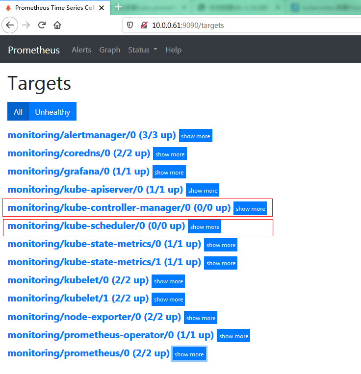

**原因分析：**

　　因为serviceMonitor选择svc时，是根据labels标签选取，而在指定的命名空间(kube-system)，并没有对应的标签。kube-apiserver之所以正常是因为kube-apiserver 服务 namespace 在default使用默认svc kubernetes。其余组件服务在kube-system 空间 ，需要单独创建svc。

**解决办法：**

```yml
# 查看serviceMonitor选取svc规则
$ cd /etc/kubernetes/kube-prometheus/
$ grep -2 selector manifests/prometheus-serviceMonitorKube*
manifests/prometheus-serviceMonitorKubeControllerManager.yaml-    matchNames:
manifests/prometheus-serviceMonitorKubeControllerManager.yaml-    - kube-system
manifests/prometheus-serviceMonitorKubeControllerManager.yaml:  selector:
manifests/prometheus-serviceMonitorKubeControllerManager.yaml-    matchLabels:
manifests/prometheus-serviceMonitorKubeControllerManager.yaml-      k8s-app: kube-controller-manager
--
manifests/prometheus-serviceMonitorKubelet.yaml-    matchNames:
manifests/prometheus-serviceMonitorKubelet.yaml-    - kube-system
manifests/prometheus-serviceMonitorKubelet.yaml:  selector:
manifests/prometheus-serviceMonitorKubelet.yaml-    matchLabels:
manifests/prometheus-serviceMonitorKubelet.yaml-      k8s-app: kubelet
--
manifests/prometheus-serviceMonitorKubeScheduler.yaml-    matchNames:
manifests/prometheus-serviceMonitorKubeScheduler.yaml-    - kube-system
manifests/prometheus-serviceMonitorKubeScheduler.yaml:  selector:
manifests/prometheus-serviceMonitorKubeScheduler.yaml-    matchLabels:
manifests/prometheus-serviceMonitorKubeScheduler.yaml-      k8s-app: kube-scheduler

# 新建prometheus-kubeSchedulerService.yaml
$ cd /etc/kubernetes/kube-prometheus/
$ cat >manifests/prometheus-kubeSchedulerService.yaml<<EOF
apiVersion: v1
kind: Service
metadata:
  namespace: kube-system
  name: kube-scheduler
  labels:
    k8s-app: kube-scheduler
spec:
  selector:
    component: kube-scheduler
  type: ClusterIP
  clusterIP: None
  ports:
  - name: http-metrics
    port: 10251
    targetPort: 10251
    protocol: TCP
---
apiVersion: v1
kind: Endpoints
metadata:
  labels:
    k8s-app: kube-scheduler
  name: kube-scheduler
  namespace: kube-system
subsets:
- addresses:
  - ip: 10.0.0.61
  ports:
  - name: http-metrics
    port: 10251
    protocol: TCP
EOF
kubectl apply -f manifests/prometheus-kubeSchedulerService.yaml

# 同理新建prometheus-kubeControllerManagerService.yaml
cat >manifests/prometheus-kubeControllerManagerService.yaml<<EOF  
apiVersion: v1
kind: Service
metadata:
  namespace: kube-system
  name: kube-controller-manager
  labels:
    k8s-app: kube-controller-manager
spec:
  selector:
    component: kube-controller-manager
  type: ClusterIP
  clusterIP: None
  ports:
  - name: http-metrics
    port: 10252
    targetPort: 10252
    protocol: TCP
---
apiVersion: v1
kind: Endpoints
metadata:
  labels:
    k8s-app: kube-controller-manager
  name: kube-controller-manager
  namespace: kube-system
subsets:
- addresses:
  - ip: 10.0.0.61
  ports:
  - name: http-metrics
    port: 10252
    protocol: TCP
EOF
kubectl apply -f manifests/prometheus-kubeControllerManagerService.yaml
```


# 1.5 访问alertmanager

==**访问alertmanager web页面：**== http://10.0.0.61:9093/ 

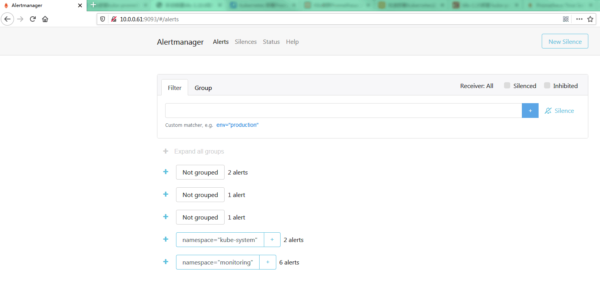

# 1.6 访问grafana 

http://10.0.0.61:3000/ 


用 admin/admin 登录：

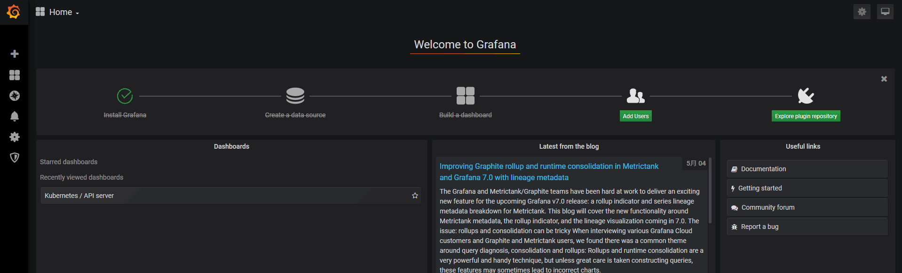

设置grafana时间为UTC时间：

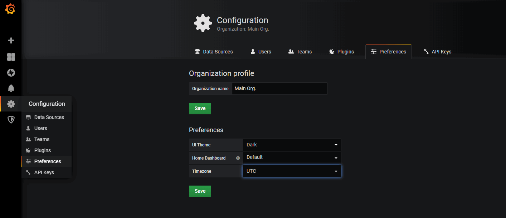

查看自带的一些模板：

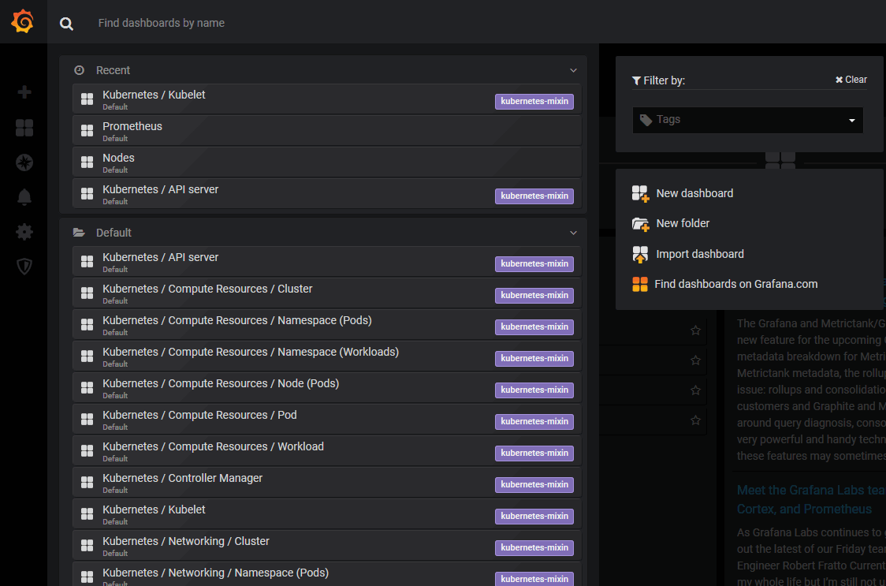

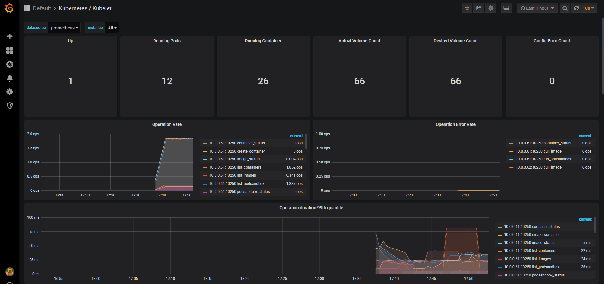

本身自带很多模板；当然也可以去grafana官网下载 https://grafana.com/grafana/dashboards 或者自己写。

导入模板：

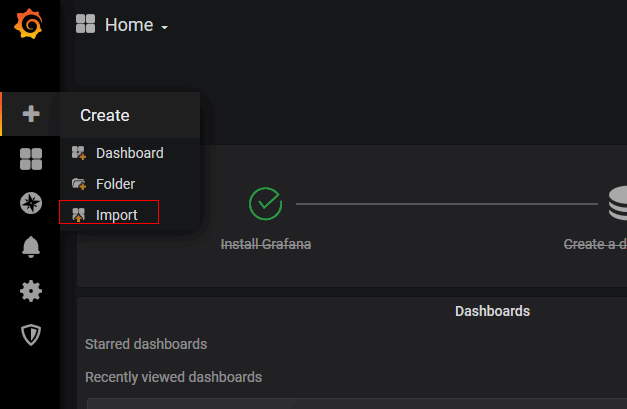

官网找到 `Cluster Monitoring for Kubernetes`  模板的id：

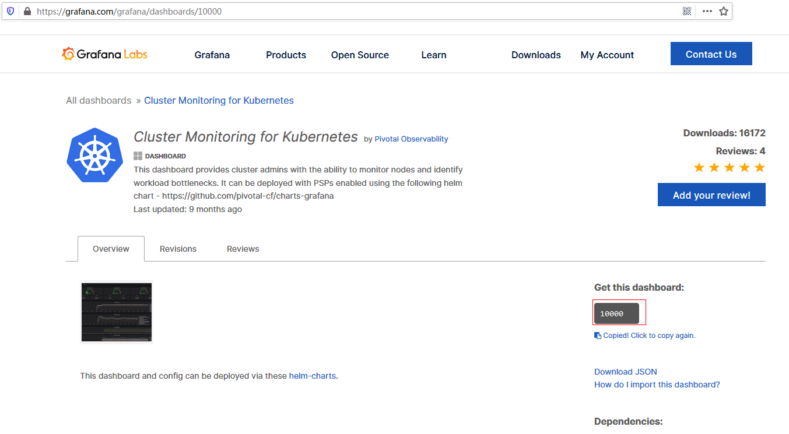

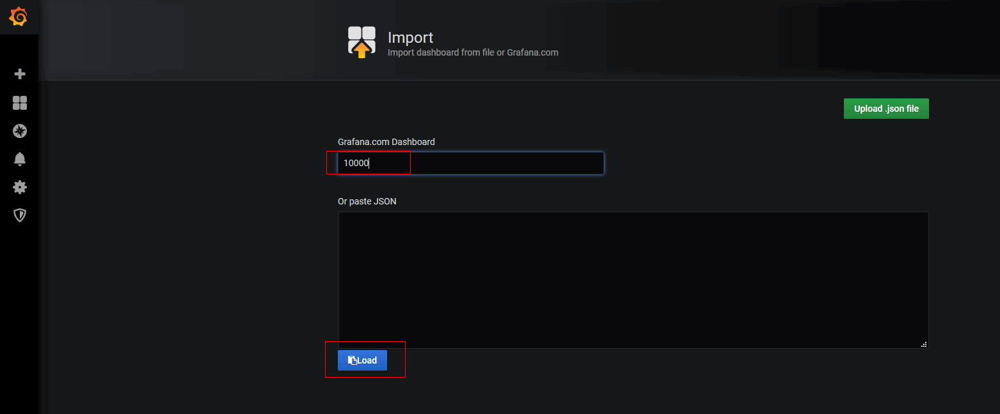


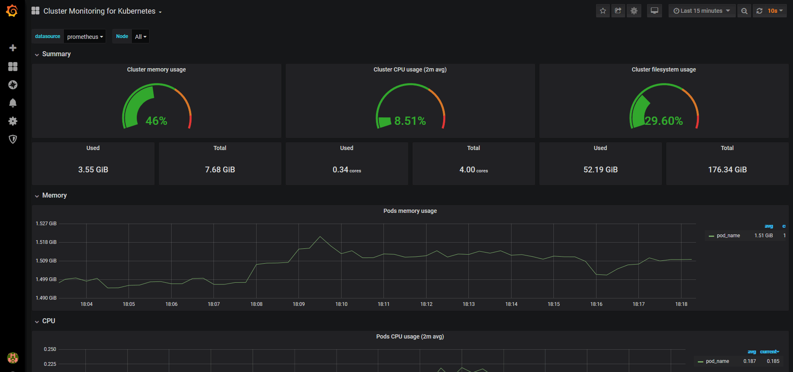

**常用几个模板：**

1 Node Exporter for Prometheus Dashboard CN v20191102 （ID：8919）

【中文版本】支持 Node Exporter v0.16及以上的版本，精简优化重要指标展示。包含：CPU 内存 磁盘 IO 网络 温度等监控指标。

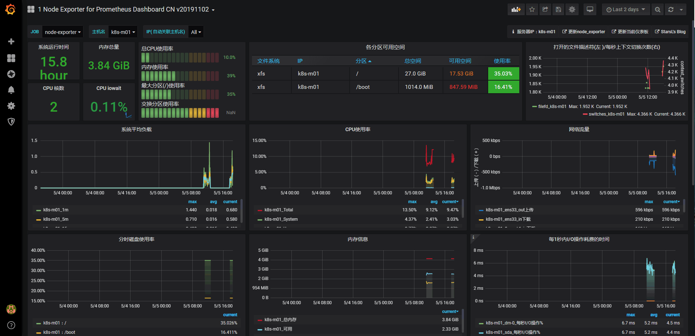