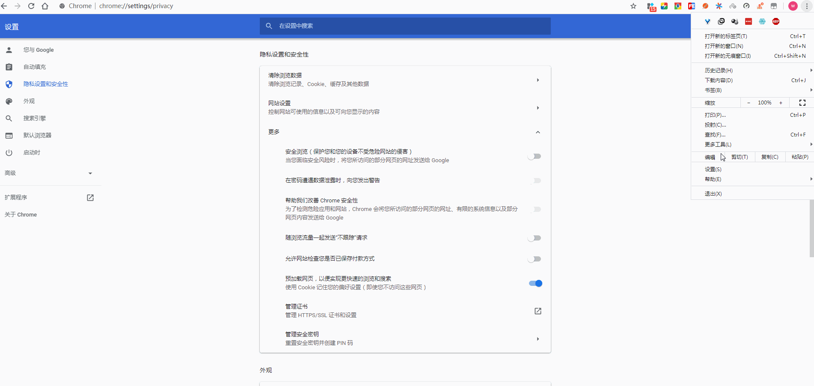
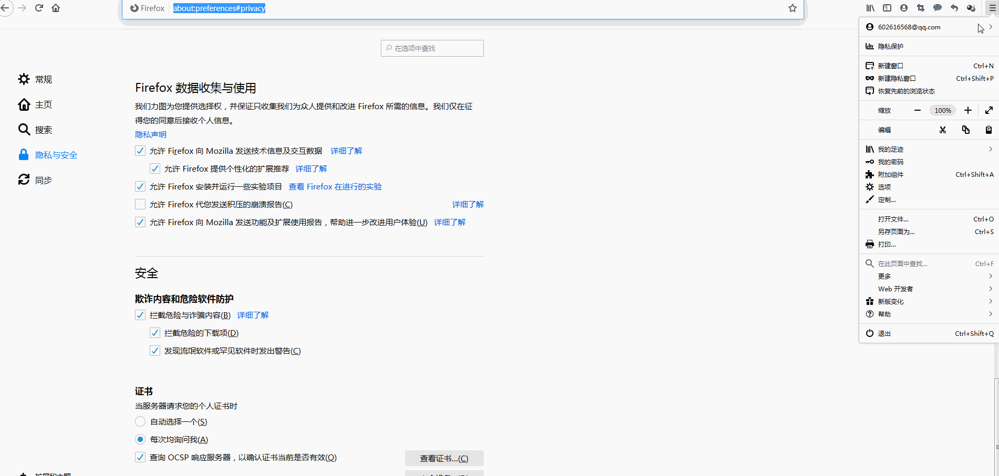
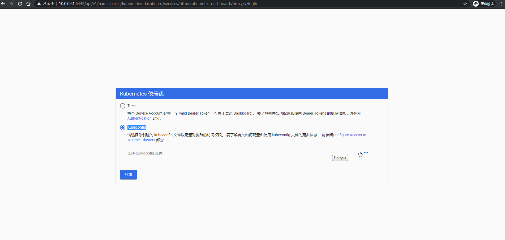

[TOC]


# 第二章 Kubeadm部署--单主集群

**官方提供的三种部署方式**

**1.minikube**

Minikube是一个工具，可以在本地快速运行一个单点的Kubernetes，仅用于尝试Kubernetes或日常开发的用户使用。

部署地址：<https://kubernetes.io/docs/setup/minikube/>

**2.kubeadm**

Kubeadm也是一个工具，提供kubeadm init和kubeadm join，用于快速部署Kubernetes集群。 

部署地址：<https://kubernetes.io/docs/reference/setup-tools/kubeadm/kubeadm/>

**3.二进制包**

推荐，从官方下载发行版的二进制包，手动部署每个组件，组成Kubernetes集群。

部署地址：<https://github.com/kubernetes/kubernetes/releases>


# 1.1 kubeadm部署介绍

Kubeadm是一个工具，它提供`kubeadm init`和`kubeadm join`作为创建Kubernetes集群的最佳实践“快捷路径”。

kubeadm执行必要的操作来启动和运行最小可行集群。按照设计，它只关心引导，而不关心配置机器。同样，安装各种漂亮的插件(比如Kubernetes Dashboard、监控解决方案和特定于云的插件)也不在讨论范围之内。

相反，我们期望在kubeadm的基础上构建更高级、更定制化的工具，理想情况下，使用kubeadm作为所有部署的基础将使创建符合规范的集群变得更容易。


## 1.1.1 环境介绍

| 主机名  | 角色   |  外网IP   |   内网IP    |   系统    | 内核版本                    | 备注 |
| :-----: | ------ | :-------: | :---------: | :-------: | --------------------------- | ---- |
| k8s-m01 | master | 10.0.0.61 | 172.16.1.61 | centos7.7 | 4.4.218-1.el7.elrepo.x86_64 |      |
| k8s-m02 | node   | 10.0.0.62 | 172.16.1.62 | centos7.7 | 4.4.218-1.el7.elrepo.x86_64 |      |


## 1.1.2 初始化准备

**1、修改主机名**

```shell
hostnamectl set-hostname k8s-m01
hostnamectl set-hostname k8s-m02
```

**2、添加hosts解析**

```shell
cat >/etc/hosts<<EOF
127.0.0.1   localhost localhost.localdomain localhost4 localhost4.localdomain4
::1         localhost localhost.localdomain localhost6 localhost6.localdomain6
10.0.0.61 k8s-m01
10.0.0.62 k8s-m02
EOF
```

**3、时间同步**

```shell
echo "*/5 * * * * /usr/sbin/ntpdate ntp1.aliyun.com >/dev/null 2>&1" >/var/spool/cron/root
```

**4、加载并优化内核参数**

```shell
cat >/etc/sysctl.d/kubernetes.conf<<EOF
net.bridge.bridge-nf-call-iptables=1
net.bridge.bridge-nf-call-ip6tables=1
net.ipv4.ip_forward=1
net.ipv4.tcp_tw_recycle=0
vm.swappiness=0
vm.overcommit_memory=1
vm.panic_on_oom=0
fs.inotify.max_user_instances=8192
fs.inotify.max_user_watches=1048576
fs.file-max=52706963
fs.nr_open=52706963
net.ipv6.conf.all.disable_ipv6=1
net.netfilter.nf_conntrack_max=2310720
EOF

modprobe ip_vs_rr
modprobe br_netfilter
sysctl -p /etc/sysctl.d/kubernetes.conf
```

> 注：tcp_tw_recycle 和 Kubernetes 的 NAT 冲突，必须关闭 ，否则会导致服务不通；
> 关闭不使用的 IPV6 协议栈，防止触发 docker BUG；
>
> 报错：sysctl: cannot stat /proc/sys/net/bridge/bridge-nf-call-iptables；解决措施：modprobe br_netfilter

**5、关闭swap分区**

如果开启了swap分区，kubelet会启动失败(可以通过将参数 --fail-swap-on 设置为false来忽略swap on)，故需要在每个node节点机器上关闭swap分区。

```shell
swapoff -a
sed -ri 's/.*swap.*/#&/' /etc/fstab
```

**6、关闭并禁用firewalld及selinux**

 在每台机器上关闭防火墙，清理防火墙规则，设置默认转发策略 

```shell
systemctl stop firewalld
systemctl disable firewalld
iptables -F && iptables -X && iptables -F -t nat && iptables -X -t nat
iptables -P FORWARD ACCEPT
setenforce 0
sed -i  '/^SELINUX/s#enforcing#disabled#g' /etc/selinux/config
```


**7、安装docker**

```bash
yum install -y yum-utils device-mapper-persistent-data lvm2
wget -P /etc/yum.repos.d/ https://mirrors.aliyun.com/docker-ce/linux/centos/docker-ce.repo
yum makecache
yum install docker-ce-18.06.3.ce -y

mkdir -p /etc/docker/
cat >/etc/docker/daemon.json<<EOF
{
    "registry-mirrors": ["https://docker.mirrors.ustc.edu.cn","https://hub-mirror.c.163.com","https://dockerhub.azk8s.cn"],
    "exec-opts": ["native.cgroupdriver=systemd"],
    "max-concurrent-downloads": 20,
    "live-restore": true,
    "storage-driver": "overlay2",
    "max-concurrent-uploads": 10,
    "debug": true,
    "log-opts": {
    "max-size": "100m",
    "max-file": "10"
    }
}
EOF

systemctl daemon-reload
systemctl restart docker
systemctl enable docker
```


**8、升级内核**

```shell
rpm --import https://www.elrepo.org/RPM-GPG-KEY-elrepo.org
rpm -Uvh http://www.elrepo.org/elrepo-release-7.0-3.el7.elrepo.noarch.rpm
yum --enablerepo=elrepo-kernel install kernel-lt -y
grub2-set-default  0 && grub2-mkconfig -o /etc/grub2.cfg
reboot
```


# 1.2 kubeadm部署集群


## 1.2.1 安装 kubeadm、kubelet、kubectl

所有节点都安装 kubeadm、kubelet、kubectl，注意：node节点的kubectl不是必须的。

- kubeadm: 集群管理命令。
- kubelet: 该组件运行在集群中的所有机器上，执行启动pod和容器等操作。
- kubectl: 与集群通信的命令行工具。

kubeadm不会为您安装或管理kubelet或kubectl，因此你需要确保它们与kubeadm安装的Kubernetes控制平面版本匹配。否则，就有发生版本倾斜的风险，这可能导致意外的错误行为。 然而，kubelet和控制平面之间的一个小版本倾斜是允许的，但是kubelet版本可能永远不会超过API服务器版本。例如，运行1.7.0的kubelets应该完全兼容1.8.0 API服务器，反之则不然。 

```bash
# 配置yum源
cat <<EOF > /etc/yum.repos.d/kubernetes.repo
[kubernetes]
name=Kubernetes
baseurl=https://mirrors.aliyun.com/kubernetes/yum/repos/kubernetes-el7-x86_64/
enabled=1
gpgcheck=0
repo_gpgcheck=0
gpgkey=https://mirrors.aliyun.com/kubernetes/yum/doc/yum-key.gpghttps://mirrors.aliyun.com/kubernetes/yum/doc/rpm-package-key.gpg
EOF
yum clean all
yum makecache

# 安装-由于k8s更新很快，建议制定需要的版本
yum install -y kubelet-1.18.0 kubeadm-1.18.0 kubectl-1.18.0
systemctl enable --now kubelet
```

## 1.2.2 初始化 master

**1、获得默认配置文件**

```bash
kubeadm config print init-defaults > kubeadm-config.yaml
```

**2、修改配置文件**

```bash
vim kubeadm-config.yaml

apiVersion: kubeadm.k8s.io/v1beta2
bootstrapTokens:
- groups:
  - system:bootstrappers:kubeadm:default-node-token
  token: abcdef.0123456789abcdef
  ttl: 24h0m0s
  usages:
  - signing
  - authentication
kind: InitConfiguration
localAPIEndpoint:
  advertiseAddress: 10.0.0.61    #宿主机IP地址
  bindPort: 6443
nodeRegistration:
  criSocket: /var/run/dockershim.sock
  name: k8s-m01
  taints:
  - effect: NoSchedule
    key: node-role.kubernetes.io/master
---
apiServer:
  timeoutForControlPlane: 4m0s
apiVersion: kubeadm.k8s.io/v1beta2
certificatesDir: /etc/kubernetes/pki
clusterName: kubernetes
#controlPlaneEndpoint: "10.0.0.88:6443"    #haproxy负载均衡ip和端口
controllerManager: {}
dns:
  type: CoreDNS
etcd:
  local:
    dataDir: /var/lib/etcd
imageRepository: k8s.gcr.io #使用阿里的镜像地址，否则无法拉取镜像
kind: ClusterConfiguration
kubernetesVersion: v1.18.0
networking:
  dnsDomain: cluster.local
  podSubnet: "10.244.0.0/16"  #网络插件flannel的默认网络地址
  serviceSubnet: 10.96.0.0/12
scheduler: {}
```

**3、查看并获取镜像**

```bash
# 查看需要的镜像
kubeadm config images list --config kubeadm-config.yaml
输出：
k8s.gcr.io/kube-apiserver:v1.18.0
k8s.gcr.io/kube-controller-manager:v1.18.0
k8s.gcr.io/kube-scheduler:v1.18.0
k8s.gcr.io/kube-proxy:v1.18.0
k8s.gcr.io/pause:3.2
k8s.gcr.io/etcd:3.4.3-0
k8s.gcr.io/coredns:1.6.7

# 拉取需要的镜像
kubeadm config images pull --config kubeadm-config.yaml
# 注意：此处由于网络限制，无法拉取；可以自己导入或者构建镜像。
```

**4、初始化**

```bash
# 初始化
kubeadm init --config kubeadm-config.yaml

输出：
W0503 19:35:53.117138    8149 configset.go:202] WARNING: kubeadm cannot validate component configs for API groups [kubelet.config.k8s.io kubeproxy.config.k8s.io]
[init] Using Kubernetes version: v1.18.0
[preflight] Running pre-flight checks
[preflight] Pulling images required for setting up a Kubernetes cluster
[preflight] This might take a minute or two, depending on the speed of your internet connection
[preflight] You can also perform this action in beforehand using 'kubeadm config images pull'
[kubelet-start] Writing kubelet environment file with flags to file "/var/lib/kubelet/kubeadm-flags.env"
[kubelet-start] Writing kubelet configuration to file "/var/lib/kubelet/config.yaml"
[kubelet-start] Starting the kubelet
[certs] Using certificateDir folder "/etc/kubernetes/pki"
[certs] Generating "ca" certificate and key
[certs] Generating "apiserver" certificate and key
[certs] apiserver serving cert is signed for DNS names [k8s-m01 kubernetes kubernetes.default kubernetes.default.svc kubernetes.default.svc.cluster.local] and IPs [10.96.0.1 10.0.0.61]
[certs] Generating "apiserver-kubelet-client" certificate and key
[certs] Generating "front-proxy-ca" certificate and key
[certs] Generating "front-proxy-client" certificate and key
[certs] Generating "etcd/ca" certificate and key
[certs] Generating "etcd/server" certificate and key
[certs] etcd/server serving cert is signed for DNS names [k8s-m01 localhost] and IPs [10.0.0.61 127.0.0.1 ::1]
[certs] Generating "etcd/peer" certificate and key
[certs] etcd/peer serving cert is signed for DNS names [k8s-m01 localhost] and IPs [10.0.0.61 127.0.0.1 ::1]
[certs] Generating "etcd/healthcheck-client" certificate and key
[certs] Generating "apiserver-etcd-client" certificate and key
[certs] Generating "sa" key and public key
[kubeconfig] Using kubeconfig folder "/etc/kubernetes"
[kubeconfig] Writing "admin.conf" kubeconfig file
[kubeconfig] Writing "kubelet.conf" kubeconfig file
[kubeconfig] Writing "controller-manager.conf" kubeconfig file
[kubeconfig] Writing "scheduler.conf" kubeconfig file
[control-plane] Using manifest folder "/etc/kubernetes/manifests"
[control-plane] Creating static Pod manifest for "kube-apiserver"
[control-plane] Creating static Pod manifest for "kube-controller-manager"
W0503 19:35:58.706923    8149 manifests.go:225] the default kube-apiserver authorization-mode is "Node,RBAC"; using "Node,RBAC"
[control-plane] Creating static Pod manifest for "kube-scheduler"
W0503 19:35:58.708546    8149 manifests.go:225] the default kube-apiserver authorization-mode is "Node,RBAC"; using "Node,RBAC"
[etcd] Creating static Pod manifest for local etcd in "/etc/kubernetes/manifests"
[wait-control-plane] Waiting for the kubelet to boot up the control plane as static Pods from directory "/etc/kubernetes/manifests". This can take up to 4m0s
[apiclient] All control plane components are healthy after 21.004574 seconds
[upload-config] Storing the configuration used in ConfigMap "kubeadm-config" in the "kube-system" Namespace
[kubelet] Creating a ConfigMap "kubelet-config-1.18" in namespace kube-system with the configuration for the kubelets in the cluster
[upload-certs] Skipping phase. Please see --upload-certs
[mark-control-plane] Marking the node k8s-m01 as control-plane by adding the label "node-role.kubernetes.io/master=''"
[mark-control-plane] Marking the node k8s-m01 as control-plane by adding the taints [node-role.kubernetes.io/master:NoSchedule]
[bootstrap-token] Using token: abcdef.0123456789abcdef
[bootstrap-token] Configuring bootstrap tokens, cluster-info ConfigMap, RBAC Roles
[bootstrap-token] configured RBAC rules to allow Node Bootstrap tokens to get nodes
[bootstrap-token] configured RBAC rules to allow Node Bootstrap tokens to post CSRs in order for nodes to get long term certificate credentials
[bootstrap-token] configured RBAC rules to allow the csrapprover controller automatically approve CSRs from a Node Bootstrap Token
[bootstrap-token] configured RBAC rules to allow certificate rotation for all node client certificates in the cluster
[bootstrap-token] Creating the "cluster-info" ConfigMap in the "kube-public" namespace
[kubelet-finalize] Updating "/etc/kubernetes/kubelet.conf" to point to a rotatable kubelet client certificate and key
[addons] Applied essential addon: CoreDNS
[addons] Applied essential addon: kube-proxy

Your Kubernetes control-plane has initialized successfully!

To start using your cluster, you need to run the following as a regular user:

  mkdir -p $HOME/.kube
  sudo cp -i /etc/kubernetes/admin.conf $HOME/.kube/config
  sudo chown $(id -u):$(id -g) $HOME/.kube/config

You should now deploy a pod network to the cluster.
Run "kubectl apply -f [podnetwork].yaml" with one of the options listed at:
  https://kubernetes.io/docs/concepts/cluster-administration/addons/

Then you can join any number of worker nodes by running the following on each as root:

kubeadm join 10.0.0.61:6443 --token abcdef.0123456789abcdef \
    --discovery-token-ca-cert-hash sha256:1bb69bed3841cad1e0b9cf4f7b04e595bc410614c41f9652ef4ef1cae9b17e41

    
# 恢复 kubeadm init和 kubeadm join对该主机所做的任何更改
kubeadm reset --kubeconfig kubeadm-config.yaml
```

**5、验证测试**

 **配置kubectl命令：** 

```yml
mkdir -p $HOME/.kube
sudo cp -i /etc/kubernetes/admin.conf $HOME/.kube/config
sudo chown $(id -u):$(id -g) $HOME/.kube/config
```

**获取pods列表命令：**

```bash
# kubectl自动补充
yum install -y bash-completion
echo 'source /usr/share/bash-completion/bash_completion' >> /etc/profile
source /etc/profile
source <(kubectl completion bash)
echo "source <(kubectl completion bash)" >> ~/.bashrc
source ~/.bashrc

$ kubectl get pods --all-namespaces
NAMESPACE     NAME                              READY   STATUS    RESTARTS   AGE
kube-system   coredns-66bff467f8-22wcs          0/1     Pending   0          15s
kube-system   coredns-66bff467f8-cvdzg          0/1     Pending   0          15s
kube-system   etcd-k8s-m01                      1/1     Running   0          26s
kube-system   kube-apiserver-k8s-m01            1/1     Running   0          26s
kube-system   kube-controller-manager-k8s-m01   1/1     Running   0          26s
kube-system   kube-proxy-5rmz2                  1/1     Running   0          15s
kube-system   kube-scheduler-k8s-m01            1/1     Running   0          26s
```

 其中coredns pod处于`Pending`状态，**先不管** .

 **查看集群的健康状态：** 

```bash
$ kubectl get cs
NAME                 STATUS    MESSAGE             ERROR
controller-manager   Healthy   ok
scheduler            Healthy   ok
etcd-0               Healthy   {"health":"true"}

$ kubectl get nodes
NAME      STATUS     ROLES    AGE   VERSION
k8s-m01   NotReady   master   60s   v1.18.0

# node节点为NotReady，因为corednspod没有启动，缺少网络pod
```


## 1.2.3 安装网络插件Flannel

**1、简介**

Flannel是一种基于overlay网络的跨主机容器网络解决方案，也就是将TCP数据包封装在另一种网络包里面进行路由转发和通信，Flannel是CoreOS开发,专门用于docker多机互联的一个工具,让集群中的不同节点主机创建的容器都具有全集群唯一的虚拟ip地址。

Flannel使用go语言编写。

**2、Flannel实现原理**

Flannel为每个host分配一个subnet，容器从这个subnet中分配IP，这些IP可以在host间路由，容器间无需使用nat和端口映射即可实现跨主机通信。

每个subnet都是从一个更大的IP池中划分的，flannel会在每个主机上运行一个叫flanneld的agent，其职责就是从池子中分配subnet。

Flannel使用etcd存放网络配置、已分配 的subnet、host的IP等信息。

Flannel数据包在主机间转发是由backend实现的，目前已经支持UDP、VxLAN、host-gw、AWS VPC和GCE路由等多种backend。

**3、下载yml**

```bash
curl -o kube-flannel.yml https://raw.githubusercontent.com/coreos/flannel/master/Documentation/kube-flannel.yml
```

需要注意的是：

flannel 默认会使用主机的第一张物理网卡，如果你有多张网卡，需要通过配置单独指定。修改 kube-flannel.yml 中的以下部分。

```bash
vim kube-flannel.yml
      containers:
      - name: kube-flannel
        image: quay.io/coreos/flannel:v0.12.0-amd64
        command:
        - /opt/bin/flanneld
        args:
        - --ip-masq
        - --kube-subnet-mgr
        - --iface=ens33		# 指定网卡
```

**4、执行kube-flannel.yml**

```bash
kubectl apply -f kube-flannel.yml
```

**5、检查集群状态**

```bash
$ kubectl get pods --all-namespaces -o wide
NAMESPACE     NAME                              READY   STATUS    RESTARTS   AGE     IP           NODE      NOMINATED NODE   READINESS GATES
kube-system   coredns-66bff467f8-7k984          1/1     Running   0          6m44s   10.244.0.3   k8s-m01   <none>           <none>
kube-system   coredns-66bff467f8-shp9g          1/1     Running   0          6m44s   10.244.0.2   k8s-m01   <none>           <none>
kube-system   etcd-k8s-m01                      1/1     Running   0          6m55s   10.0.0.61    k8s-m01   <none>           <none>
kube-system   kube-apiserver-k8s-m01            1/1     Running   0          6m55s   10.0.0.61    k8s-m01   <none>           <none>
kube-system   kube-controller-manager-k8s-m01   1/1     Running   0          6m55s   10.0.0.61    k8s-m01   <none>           <none>
kube-system   kube-flannel-ds-amd64-mlqvv       1/1     Running   0          26s     10.0.0.61    k8s-m01   <none>           <none>
kube-system   kube-proxy-jpblt                  1/1     Running   0          6m44s   10.0.0.61    k8s-m01   <none>           <none>
kube-system   kube-scheduler-k8s-m01            1/1     Running   0          6m55s   10.0.0.61    k8s-m01   <none>           <none>

$ kubectl get nodes
NAME      STATUS   ROLES    AGE   VERSION
k8s-m01   Ready    master   8m    v1.18.0

$ kubectl get svc
NAME         TYPE        CLUSTER-IP   EXTERNAL-IP   PORT(S)   AGE
kubernetes   ClusterIP   10.96.0.1    <none>        443/TCP   32m

$ kubectl get cs
NAME                 STATUS    MESSAGE             ERROR
scheduler            Healthy   ok
controller-manager   Healthy   ok
etcd-0               Healthy   {"health":"true"}
```


## 1.2.4 加入node节点

节点(node)是工作负载(容器和pod等)运行的地方，如果要向集群添加新节点，请为每台机器执行以下操作：

- node节点执行 1.1.2 初始化准备
- 下载安装镜像
- 执行`kubeadm join`


**1、下载安装镜像**

node上也是需要下载安装一些镜像的，需要下载的镜像为：kube-proxy、pause、flannel

```
$ docker images
REPOSITORY               TAG                 IMAGE ID            CREATED             SIZE
quay.io/coreos/flannel   v0.12.0-ppc64le     bc2581fdbbc4        4 hours ago         70.3MB
k8s.gcr.io/pause         3.2                 877251810461        4 hours ago         683kB
k8s.gcr.io/kube-proxy    v1.18.0             6d1eac3bcac6        5 hours ago         117MB
quay.io/coreos/flannel   v0.12.0-s390x       59b06ff3da1b        15 hours ago        56.9MB
quay.io/coreos/flannel   v0.12.0-arm64       249df3c55115        15 hours ago        53.6MB
quay.io/coreos/flannel   v0.12.0-arm         17b3e9df2be2        15 hours ago        47.8MB
quay.io/coreos/flannel   v0.12.0-amd64       66efeb957edc        17 hours ago        52.8MB

```

不知道令牌，可以在主节点上运行以该命令:

```bash
kubeadm token list
```

**2、加入node节点**

```bash
# 加入node节点
kubeadm join 10.0.0.61:6443 --token abcdef.0123456789abcdef \
    --discovery-token-ca-cert-hash sha256:1bb69bed3841cad1e0b9cf4f7b04e595bc410614c41f9652ef4ef1cae9b17e41

# 注意：token有24H的有效期；失效后执行以下命令,重新生成了加入node节点的命令
$ kubeadm token create --print-join-command
kubeadm join 10.0.0.61:6443 --token fb791y.q3ty2hta7dq1dw4p  --discovery-token-ca-cert-hash sha256:1bb69bed3841cad1e0b9cf4f7b04e595bc410614c41f9652ef4ef1cae9b17e41
```

**3、检查node状态**

```bash
$ kubectl get nodes
NAME      STATUS   ROLES    AGE    VERSION
k8s-m01   Ready    master   128m   v1.18.0
k8s-m02   Ready    <none>   16s    v1.18.0

# 如果状态为NotReady；查看一下pods的状态并检查：
$ kubectl get pods -n kube-system
NAME                              READY   STATUS    RESTARTS   AGE
coredns-66bff467f8-7k984          1/1     Running   0          128m
coredns-66bff467f8-shp9g          1/1     Running   0          128m
etcd-k8s-m01                      1/1     Running   0          128m
kube-apiserver-k8s-m01            1/1     Running   0          128m
kube-controller-manager-k8s-m01   1/1     Running   0          128m
kube-flannel-ds-amd64-mlqvv       1/1     Running   0          121m
kube-flannel-ds-amd64-sh5fm       1/1     Running   0          15s
kube-proxy-4n2xg                  1/1     Running   0          15s
kube-proxy-jpblt                  1/1     Running   0          128m
kube-scheduler-k8s-m01            1/1     Running   1          128m

$ kubectl -n kube-system describe pods kube-proxy-4n2xg
```

## 1.2.5 验证Kubernetes功能

**==注意：以下操作均在master上。==**

**（1）创建测试文件**

```yml
cat > nginx-ds.yml <<EOF
apiVersion: v1
kind: Service
metadata:
  name: nginx-ds
  labels:
    app: nginx-ds
spec:
  type: NodePort
  selector:
    app: nginx-ds
  ports:
  - name: http
    port: 80
    targetPort: 80
---
apiVersion: apps/v1
kind: DaemonSet
metadata:
  name: nginx-ds
  labels:
    addonmanager.kubernetes.io/mode: Reconcile
spec:
  selector:
    matchLabels:
      app: nginx-ds
  template:
    metadata:
      labels:
        app: nginx-ds
    spec:
      containers:
      - name: my-nginx
        image: daocloud.io/library/nginx:latest
        ports:
        - containerPort: 80
EOF
```

执行测试：

```bash
kubectl create -f nginx-ds.yml
```

**（2）检查各节点的 Pod IP 连通性**

```
$ kubectl get pods -o wide|grep nginx-ds
nginx-ds-j7m44   1/1     Running   0          3m5s   10.244.2.3   k8s-m02   <none>           <none>
$ ping 10.244.2.3
```

**（3）检查服务 IP 和端口可达性**

```bash
$ kubectl get svc
NAME         TYPE        CLUSTER-IP       EXTERNAL-IP   PORT(S)        AGE
kubernetes   ClusterIP   10.96.0.1        <none>        443/TCP        140m
nginx-ds     NodePort    10.104.166.179   <none>        80:31124/TCP   5m58s

```

可见nginx-ds的信息：

- Service Cluster IP：10.104.166.179
- 服务端口：80
- NodePort 端口：31124

**（5）检查服务的 NodePort 可达性**

```bash
$ curl -Is 10.0.0.62:31124
HTTP/1.1 200 OK
Server: nginx/1.17.10
Date: Mon, 04 May 2020 05:31:58 GMT
Content-Type: text/html
Content-Length: 612
Last-Modified: Tue, 14 Apr 2020 14:19:26 GMT
Connection: keep-alive
ETag: "5e95c66e-264"
Accept-Ranges: bytes
```


## 1.2.6 移除node节点

```bash
# master节点执行
kubectl drain k8s-m02 --delete-local-data --force --ignore-daemonsets
kubectl delete node k8s-m02
# node节点执行
kubeadm reset
systemctl stop kubelet
systemctl stop docker
rm -rf /var/lib/cni/ /var/lib/kubelet/* /etc/cni/
ifconfig cni0 down
ifconfig flannel.1 down
ifconfig docker0 down
ip link delete cni0
ip link delete flannel.1
systemctl start docker
# 查看容器发现都已删除
docker ps -a
```


# 1.3 Dashboard界面

Dashboard 是基于网页的 Kubernetes 用户界面。您可以使用 Dashboard 将容器应用部署到 Kubernetes 集群中，也可以对容器应用排错，还能管理集群本身及其附属资源。您可以使用 Dashboard 获取运行在集群中的应用的概览信息，也可以创建或者修改 Kubernetes 资源（如 Deployment，Job，DaemonSet 等等）。例如，您可以对 Deployment 实现弹性伸缩、发起滚动升级、重启 Pod 或者使用向导创建新的应用。

在kubernetes Dashboard中可以查看集群中应用的运行状态，也能够创建和修改各种kubernetes资源（比如Deployment，Job，Daemonset等等），用户可以对Deployment实现弹性伸缩，执行滚动升级，重启pod或者使用向导创建新的应用。

可以说，kubernetes Dashboard提供了kubectl的绝大部分功能。

- 全面的群集管理：命名空间，节点，窗格，副本集，部署，存储，RBAC创建修改等
- 快速且始终如一的即时更新：无需刷新页面即可查看最新信息
- 快速查看集群运行状况：实时图表可帮助快速跟踪性能不佳的资源
- 易于CRUD和扩展：加上内联API文档，可以轻松了解每个字段的作用
- 简单的OpenID集成：无需特殊代理

Dashboard 同时展示了kubernetes集群中的资源状态信息和所有报错信息。

官方参考文档：https://kubernetes.io/zh/docs/tasks/access-application-cluster/web-ui-dashboard/

GitHub项目下载地址：https://github.com/kubernetes/dashboard 

## 1.3.1 下载 dashboard 文件

```
curl -o dashboard-recommended.yaml https://raw.githubusercontent.com/kubernetes/dashboard/v2.0.0-rc7/aio/deploy/recommended.yaml
kubectl apply -f  dashboard-recommended.yaml
```

查看运行状态：

```bash
$ kubectl get pods -n kubernetes-dashboard
NAME                                        READY   STATUS    RESTARTS   AGE
dashboard-metrics-scraper-dc6947fbf-zz6xw   1/1     Running   0          12m
kubernetes-dashboard-5d4dc8b976-z4kn6       1/1     Running   0          12m
```

查看kubernetes-dashboard所有信息：

```bash
$ kubectl get all -n kubernetes-dashboard
NAME                                            READY   STATUS    RESTARTS   AGE
pod/dashboard-metrics-scraper-dc6947fbf-zz6xw   1/1     Running   0          18m
pod/kubernetes-dashboard-5d4dc8b976-z4kn6       1/1     Running   0          18m

NAME                                TYPE        CLUSTER-IP       EXTERNAL-IP   PORT(S)    AGE
service/dashboard-metrics-scraper   ClusterIP   10.110.248.70    <none>        8000/TCP   22m
service/kubernetes-dashboard        ClusterIP   10.103.148.191   <none>        443/TCP    22m

NAME                                        READY   UP-TO-DATE   AVAILABLE   AGE
deployment.apps/dashboard-metrics-scraper   1/1     1            1           22m
deployment.apps/kubernetes-dashboard        1/1     1            1           22m

NAME                                                  DESIRED   CURRENT   READY   AGE
replicaset.apps/dashboard-metrics-scraper-dc6947fbf   1         1         1       22m
replicaset.apps/kubernetes-dashboard-5d4dc8b976       1         1         1       22m

```

## 1.3.2 访问 dashboard

从 1.7 开始，dashboard 只允许通过 https 访问，如果使用 kube proxy 则必须监听 localhost 或 127.0.0.1。对于 NodePort 没有这个限制，但是仅建议在开发环境中使用。对于不满足这些条件的登录访问，在登录成功后浏览器不跳转，始终停在登录界面。

**访问方式：**

Dashboard的github  https://github.com/kubernetes/dashboard/blob/master/docs/user/accessing-dashboard/1.7.x-and-above.md

- **kubectl proxy**：kubectl proxy在您的机器和Kubernetes API服务器之间创建代理服务器。默认情况下，只能在本地（从启动它的计算机上）访问它。

- **kubectl port-forward**：通过端口转发映射本地端口到指定的应用端口，从而访问集群中的应用程序(Pod)。

- **NodePort**：这种方法只推荐使用在一个node节点的方案，在大多数的环境都需要多个node节点，因此这种方法没有什么实用价值，不建议使用。

- **API Server**：如果Kubernetes API服务器是公开的并且可以从外部访问，则可以直接在以下位置访问仪表板： https://<master-ip>:<apiserver-port>/api/v1/namespaces/kubernetes-dashboard/services/https:kubernetes-dashboard:/proxy/

  注意：仅当您选择在浏览器中安装用户证书时，才可以使用这种方式访问Dashboard。在示例中，可以使用kubeconfig文件用于联系API服务器的证书。

- **Ingress**


采用API Server访问： https://10.0.0.61:6443/api/v1/namespaces/kubernetes-dashboard/services/https:kubernetes-dashboard:/proxy/ 


我们使用的是system:anonymous用户来访问位于kube-system命名空间中的名为https:kubernetes-dashboard的service资源。这个用户没有权限访问，所以被拒绝了。


## 1.3.3 生成浏览器访问证书

dashboard 默认只支持 token 认证（不支持 client 证书认证），所以如果使用 Kubeconfig 文件，需要将 token 写入到该文件。

**创建证书：**

首先需要确认kubectl命令的配置文件，默认情况下为/etc/kubernetes/admin.conf，而且已经自动创建在$HOME/.kube/config中，如果没有创建则需要手动赋值。

```
cat $HOME/.kube/config
```

如果确认有集群的配置，则运行以下命令来生成一个p12格式的浏览器证书

```bash
cd /etc/kubernetes/pki
grep 'client-certificate-data' ~/.kube/config | head -n 1 | awk '{print $2}' | base64 -d > dashboard.crt
grep 'client-key-data' ~/.kube/config | head -n 1 | awk '{print $2}' | base64 -d > dashboard.key
```

 生成p12证书，按要求输入密码直接回车即可，密码不要胡乱输，后面给浏览器导入的时候要用。 

```bash
$ openssl pkcs12 -export -clcerts -inkey dashboard.key -in dashboard.crt -out dashboard.p12 -name "kubernetes-client"
Enter Export Password:123456
Verifying - Enter Export Password:123456
```

**将生成的dashboard.p12证书下载到电脑；然后导入浏览器：**

导入谷歌浏览器



导入火狐浏览器




## 1.3.4 登录dashboard 

**2、创建登录 dashboard 的 token 和 kubeconfig 配置文件**

**方式一：创建登录 token**

```bash
kubectl create sa dashboard-admin -n kube-system
kubectl create clusterrolebinding dashboard-admin --clusterrole=cluster-admin --serviceaccount=kube-system:dashboard-admin
ADMIN_SECRET=$(kubectl get secrets -n kube-system | grep dashboard-admin | awk '{print $1}')
DASHBOARD_LOGIN_TOKEN=$(kubectl describe secret -n kube-system ${ADMIN_SECRET} | grep -E '^token' | awk '{print $2}')
echo ${DASHBOARD_LOGIN_TOKEN}
```

则可以使用上面输出的token 登录 Dashboard。

**方法二：创建使用 token 的 KubeConfig 文件 （推荐使用这种方式）**

```bash
cd /etc/kubernetes/pki
KUBE_APISERVER="https://10.0.0.61:6443"
DASHBOARD_LOGIN_TOKEN=$(kubectl describe secret -n kube-system ${ADMIN_SECRET} | grep -E '^token' | awk '{print $2}')
# 设置集群参数
kubectl config set-cluster kubernetes \
  --certificate-authority=/etc/kubernetes/cert/ca.pem \
  --embed-certs=true \
  --server=${KUBE_APISERVER} \
  --kubeconfig=dashboard.kubeconfig

# 设置客户端认证参数，使用上面创建的 Token
kubectl config set-credentials dashboard_user \
  --token=${DASHBOARD_LOGIN_TOKEN} \
  --kubeconfig=dashboard.kubeconfig

# 设置上下文参数
kubectl config set-context default \
  --cluster=kubernetes \
  --user=dashboard_user \
  --kubeconfig=dashboard.kubeconfig

# 设置默认上下文
kubectl config use-context default --kubeconfig=dashboard.kubeconfig
```

将dashboard.kubeconfig下载到电脑端，用生成的 dashboard.kubeconfig 登录 Dashboard（其它API server节点也可以用）。




# 1.4 

