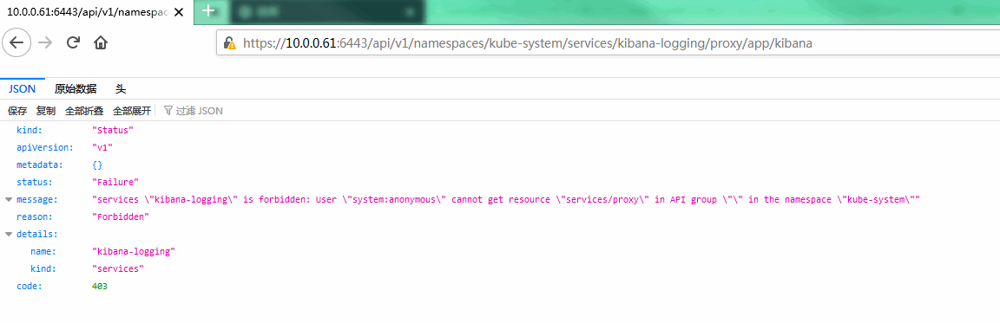
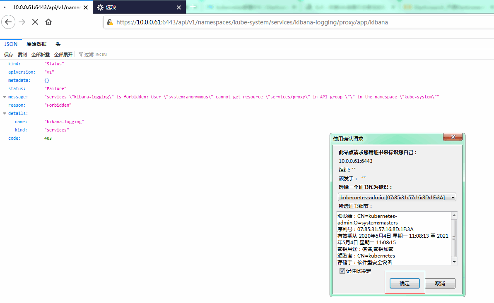
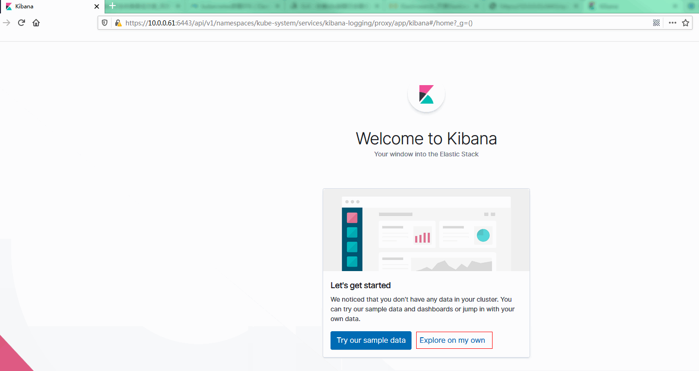
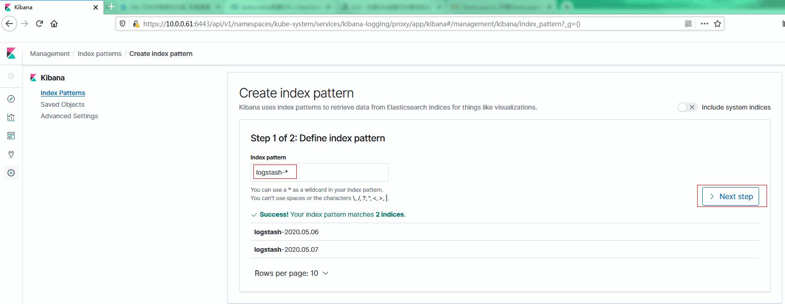
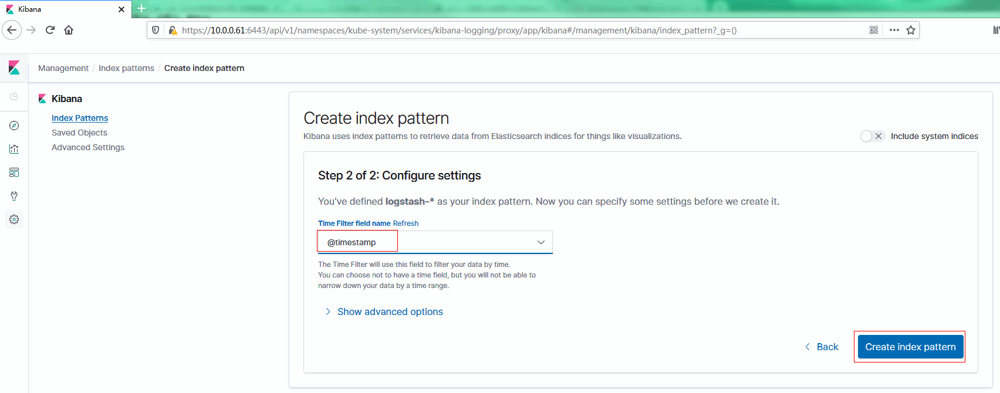
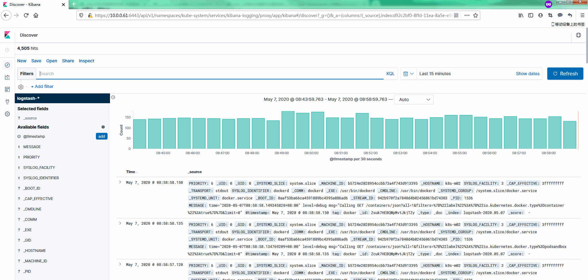

[TOC]


# 第四章 EFK日志收集

# 1.1 EFK 组件简介


顾名思义，EFK 是 Elasticsearch、Fluentd、Kibana 三个开源软件组件的首字母缩写，EFK 是业界主流的容器时代日志收集处理的最佳解决方案。三个组件组合起来工作就是 EFK，组件之间数据流是这样：Log 源（比如 Log 文件、k8s Pod 日志、Docker 日志驱动等等）—> Fluentd 收集 —> Elasticsearch 存储 —> Kibana UI 查看。

Kubernetes中比较流行的日志收集解决方案是Elasticsearch、Fluentd 和 Kibana（EFK）技术栈，也是官方现在比较推荐的一种方案。

- Elasticsearch是一个实时的、分布式的可扩展的搜索引擎，允许进行全文、结构化搜索，它通常用于索引和搜索大量日志数据，也可用于搜索许多不同类型的文档。
- Fluentd是一个流行的开源数据收集器，是CNCF的毕业项目。我们将在Kubernetes集群节点上以DaemonSet的方式安装Fluentd，通过获取容器日志文件、过滤和转换日志数据，然后将数据传递到 Elasticsearch集群，在该集群中对其进行索引和存储。
- Kibana是Elasticsearch的一个功能强大的数据可视化 dashboard，Kibana提供了web 界面来浏览 Elasticsearch 日志数据。


# 1.2 日志层次

在Kubernetes中，有三个层次的日志：

- 基础日志

- Node级别的日志
- 群集级别的日志架构


## 1.2.1 基础日志

​		kubernetes基础日志即将日志数据输出到标准输出流，可以使用kubectl  logs命令获取容器日志信息。如果Pod中有多个容器，可以通过将容器名称附加到命令来指定要访问哪个容器的日志。例如，在Kubernetes集群中的devops命名空间下有一个名称为nexus3-f5b7fc55c-hq5v7的Pod，就可以通过如下的命令获取日志：

```
$ kubectl logs nexus3-f5b7fc55c-hq5v7 --namespace=devops
```

## 1.2.2 Node级别的日志

​		容器化应用写入到stdout和stderr的所有内容都是由容器引擎处理和重定向的。例如，docker容器引擎会将这两个流重定向到日志记录驱动，在Kubernetes中该日志驱动被配置为以json格式写入文件。docker json日志记录驱动将每一行视为单独的消息。当使用docker日志记录驱动时，并不支持多行消息，因此需要在日志代理级别或更高级别上处理多行消息。

​		默认情况下，如果容器重新启动，kubectl将会保留一个已终止的容器及其日志。如果从Node中驱逐Pod，那么Pod中所有相应的容器也会连同它们的日志一起被驱逐。Node级别的日志中的一个重要考虑是实现日志旋转，这样日志不会消耗Node上的所有可用存储。Kubernetes目前不负责旋转日志，部署工具应该建立一个解决方案来解决这个问题。


在Kubernetes中有两种类型的系统组件：运行在容器中的组件和不在容器中运行的组件。例如：

- kubernetes调度器和kube-proxy在容器中运行。
- kubelet和容器运行时，例如docker，不在容器中运行。

在带有systemd的机器上，kubelet和容器运行时写入journaId。如果systemd不存在，它们会在/var/log目录中写入.log文件。在容器中的系统组件总是绕过默认的日志记录机制，写入到/var/log目录，它们使用golg日志库。可以找到日志记录中开发文档中那些组件记录严重性的约定。
类似于容器日志，在/var/log目录中的系统组件日志应该被旋转。这些日志被配置为每天由logrotate进行旋转，或者当大小超过100mb时进行旋转。


## 1.2.3 集群级别的日志架构

Kubernetes本身没有为群集级别日志记录提供原生解决方案，但有几种常见的方法可以采用：

- 使用运行在每个Node上的Node级别的日志记录代理；
- 在应用Pod中包含一个用于日志记录的sidecar。
- 将日志直接从应用内推到后端。

经过综合考虑，本文采用通过在每个Node上包括Node级别的日志记录代理来实现群集级别日志记录。日志记录代理暴露日志或将日志推送到后端的专用工具。通常，logging-agent是一个容器，此容器能够访问该Node上的所有应用程序容器的日志文件。

因为日志记录必须在每个Node上运行，所以通常将它作为DaemonSet副本、或一个清单Pod或Node上的专用本机进程。然而，后两种方法后续将会被放弃。使用Node级别日志记录代理是Kubernetes集群最常见和最受欢迎的方法，因为它只为每个节点创建一个代理，并且不需要对节点上运行的应用程序进行任何更改。但是，Node级别日志记录仅适用于应用程序的标准输出和标准错误。

Kubernetes本身并没有指定日志记录代理，但是有两个可选的日志记录代理与Kubernetes版本打包发布：和谷歌云平台一起使用的Stackdriver和Elasticsearch，两者都使用自定义配置的fluentd作为Node上的代理。在本文的方案中，Logging-agent 采用 Fluentd，而 Logging Backend 采用 Elasticsearch，前端展示采用Grafana。即通过 Fluentd 作为 Logging-agent 收集日志，并推送给后端的Elasticsearch；Grafana从Elasticsearch中获取日志，并进行统一的展示。


# 1.3 部署

## 1.3.1 下载yaml文件

Elasticsearch 附加组件本身会作为 Kubernetes 的应用在集群里运行，其 YAML 配置文件可从kubernetes官方 github仓库获取：

https://github.com/kubernetes/kubernetes/tree/master/cluster/addons/fluentd-elasticsearch

```bash
cd /etc/kubernetes && mkdir -p efk && cd efk
cat >efk.ini<<EOF
https://raw.githubusercontent.com/kubernetes/kubernetes/master/cluster/addons/fluentd-elasticsearch/es-statefulset.yaml
https://raw.githubusercontent.com/kubernetes/kubernetes/master/cluster/addons/fluentd-elasticsearch/es-service.yaml
https://raw.githubusercontent.com/kubernetes/kubernetes/master/cluster/addons/fluentd-elasticsearch/fluentd-es-configmap.yaml
https://raw.githubusercontent.com/kubernetes/kubernetes/master/cluster/addons/fluentd-elasticsearch/fluentd-es-ds.yaml
https://raw.githubusercontent.com/kubernetes/kubernetes/master/cluster/addons/fluentd-elasticsearch/kibana-service.yaml
https://raw.githubusercontent.com/kubernetes/kubernetes/master/cluster/addons/fluentd-elasticsearch/kibana-deployment.yaml
EOF
for i in `cat ekf.ini`;do wget -c $i;done
```

由于是虚机测试资源不够；因此修改几个参数；以防ES无法启动。

```yml
vim es-statefulset.yaml
# RBAC authn and authz
apiVersion: v1
kind: ServiceAccount
metadata:
  name: elasticsearch-logging
  namespace: kube-system
  labels:
    k8s-app: elasticsearch-logging
    addonmanager.kubernetes.io/mode: Reconcile
---
kind: ClusterRole
apiVersion: rbac.authorization.k8s.io/v1
metadata:
  name: elasticsearch-logging
  labels:
    k8s-app: elasticsearch-logging
    addonmanager.kubernetes.io/mode: Reconcile
rules:
- apiGroups:
  - ""
  resources:
  - "services"
  - "namespaces"
  - "endpoints"
  verbs:
  - "get"
---
kind: ClusterRoleBinding
apiVersion: rbac.authorization.k8s.io/v1
metadata:
  namespace: kube-system
  name: elasticsearch-logging
  labels:
    k8s-app: elasticsearch-logging
    addonmanager.kubernetes.io/mode: Reconcile
subjects:
- kind: ServiceAccount
  name: elasticsearch-logging
  namespace: kube-system
  apiGroup: ""
roleRef:
  kind: ClusterRole
  name: elasticsearch-logging
  apiGroup: ""
---
# Elasticsearch deployment itself
apiVersion: apps/v1
kind: StatefulSet
metadata:
  name: elasticsearch-logging
  namespace: kube-system
  labels:
    k8s-app: elasticsearch-logging
    version: v7.3.2
    addonmanager.kubernetes.io/mode: Reconcile
spec:
  serviceName: elasticsearch-logging
  replicas: 1   #修改
  selector:
    matchLabels:
      k8s-app: elasticsearch-logging
      version: v7.3.2
  template:
    metadata:
      labels:
        k8s-app: elasticsearch-logging
        version: v7.3.2
    spec:
      serviceAccountName: elasticsearch-logging
      containers:
      - image: quay.io/fluentd_elasticsearch/elasticsearch:v7.3.2
        name: elasticsearch-logging
        imagePullPolicy: IfNotPresent  #修改
        resources:
          # need more cpu upon initialization, therefore burstable class
          limits:
            cpu: 1000m
           # memory: 3Gi  #注释
          requests:
            cpu: 100m
           # memory: 3Gi  #注释
        ports:
        - containerPort: 9200
          name: db
          protocol: TCP
        - containerPort: 9300
          name: transport
          protocol: TCP
        volumeMounts:
        - name: elasticsearch-logging
          mountPath: /data
        env:
        - name: "NAMESPACE"
          valueFrom:
            fieldRef:
              fieldPath: metadata.namespace
      volumes:
      - name: elasticsearch-logging
        emptyDir: {}
      # Elasticsearch requires vm.max_map_count to be at least 262144.
      # If your OS already sets up this number to a higher value, feel free
      # to remove this init container.
      initContainers:
      - image: alpine:3.6
        command: ["/sbin/sysctl", "-w", "vm.max_map_count=262144"]
        name: elasticsearch-logging-init
        securityContext:
          privileged: true
```


## 1.3.2 下载镜像

查看需要的镜像

```yml
$ grep image: *
es-statefulset.yaml:      - image: quay.io/fluentd_elasticsearch/elasticsearch:v7.4.2
es-statefulset.yaml:      - image: alpine:3.6
fluentd-es-configmap.yaml:    # time="2016-02-04T07:53:57.505612354Z" level=error msg="HTTP Error" err="No such image: -f" statusCode=404
fluentd-es-ds.yaml:        image: quay.io/fluentd_elasticsearch/fluentd:v3.0.1
kibana-deployment.yaml:        image: docker.elastic.co/kibana/kibana-oss:7.2.0
```

所有节点上传并导入镜像

```bash
cd /etc/kubernetes/efk
tar -zxf efk.tar.gz
cd /etc/kubernetes/efk/efk && for i in `ls`;do docker load -i $i;done
```

## 1.3.3 执行定义文件

```bash
cd /etc/kubernetes/efk
kubectl apply -f .
```

## 1.3.4 检查执行结果

```bash
$ kubectl get all -n kube-system |grep -E 'elasticsearch|fluentd|kibana'
pod/elasticsearch-logging-0           0/1     Pending   0          41s
pod/fluentd-es-v3.0.1-rmwkb           0/1     Running   0          41s
pod/kibana-logging-5b578cd4fb-pggg5   0/1     Running   0          41s
service/elasticsearch-logging     ClusterIP   10.100.9.8      <none>        9200/TCP                       41s
service/kibana-logging            ClusterIP   10.103.74.155   <none>        5601/TCP                       41s
daemonset.apps/fluentd-es-v3.0.1         1         1         0       1            0           <none>                   41s
deployment.apps/kibana-logging   0/1     1            0           41s
replicaset.apps/kibana-logging-5b578cd4fb   1         1         0       41s
statefulset.apps/elasticsearch-logging   0/2     41s
```

## 1.3.5 查看pod信息

```bash
$ kubectl get pods -n kube-system|egrep 'elasticsearch|fluentd|kibana'
elasticsearch-logging-0           0/1     Running   1          8m13s
fluentd-es-v3.0.1-rmwkb           0/1     Running   7          8m13s
kibana-logging-5b578cd4fb-pggg5   0/1     Running   7          8m13s

$ kubectl describe pods elasticsearch-logging-0 -n kube-system|tail -5
                 node.kubernetes.io/unreachable:NoExecute for 300s
Events:
  Type     Reason            Age                  From               Message
  ----     ------            ----                 ----               -------
  Warning  FailedScheduling  60s (x5 over 3m59s)  default-scheduler  0/2 nodes are available: 1 Insufficient memory, 1 node(s) had taint {node-role.kubernetes.io/master:}, that the pod didn't tolerate.
# 以上报错是内存空间不足；由于虚机内存给了4G不够；关机后增加内存重启即可

$ kubectl logs  elasticsearch-logging-0 -n kube-system
```

注意：只有当 Kibana pod 启动完成后，浏览器才能查看 kibana dashboard，否则会被拒绝。


# 1.4 访问 kibana

## 1.4.1 kubectl proxy 访问 kibana(未使用)

创建代理：

```bash
$ kubectl proxy --address='10.0.0.61' --port=38086 --accept-hosts='^*$'
```

查看访问地址：

```
$ kubectl cluster-info |grep kibana
Kibana is running at https://10.0.0.61:6443/api/v1/namespaces/kube-system/services/kibana-logging/proxy
```

浏览器访问 URL：http://10.0.0.61:38086/api/v1/namespaces/kube-system/services/kibana-logging/proxy


## 1.4.3 API server方式访问

浏览器访问：https://10.0.0.61:6443/api/v1/namespaces/kube-system/services/kibana-logging/proxy



报错403；是因为要使用之前dasboard使用的证书。

导入证书后访问：





在 Management -> Indices 页面创建一个 index（相当于 mysql 中的一个 database），选中 Index contains time-based events，使用默认的 logstash-* pattern，点击 Create ;



"Time-field name" 默认 @timestamp，最后点击 “Create” 即可完成索引创建。



等待一会，查看边栏中的”Discover”，如果你看到类似下面截图中的日志内容输出，说明kibana可以正常从elasticsearch获取数据了：

