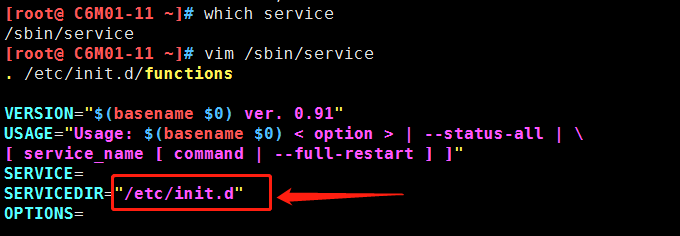
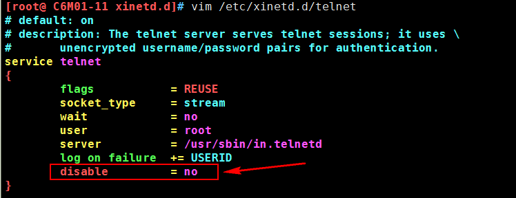

[TOC]


# 第一单元 远程管理

# 1.1 Linux服务分类

## 1.1.1 系统服务

**概念**

系统服务（system services）是一种`应用程序类型`。服务一经启动，除非因为关闭系统或管理者手动结束服务，否则都将在`后台执行`。

**特点**

- 占用系统资源较多 
- 响应速度较快


## 1.1.2 临时服务

**概念**

临时服务平时并不会启动，而是当客户端请求时才会被启动，使用完毕就会结束。 

**特点**

- 响应速度较慢 
- 节省系统资源


## 1.1.3 服务管理

为了简化Linux服务管理的麻烦，Linux特别为每一个独立式的服务，提供了一个服务启动程序文件（Service Startup Script）。 所有的服务启动文件被储存在`/etc/rc.d/init.d/`目录下。


`CentOS 6`系统所有的预设服务都可以通过查看`/etc/rc.d/init.d/`目录得到。

```shell
[root@ C6M01-11 ~]# ls -ld /etc/init.d
lrwxrwxrwx. 1 root root 11 6月  30 2018 /etc/init.d -> rc.d/init.d
```

其实`/etc/init.d`是一个符号链接文件，链接指向`/etc/rc.d/init.d`

### 1.1.3.1 管理方式

- 利用脚本文件直接管理服务 

```shell
/etc/init.d/服务名 start|stop|restart 
```

- service命令管理方法 

```shell
service 服务名 start|stop|restart 
```

能够使用service命令进行操作的，就是已经注册成为`linux`的系统服务了。那么`/etc/init.d/服务名 start`和`service 服务名 start`有何区别？

`service`实际上是调用的`/etc/init.d/`目录下的启动脚本。有图有真相：




### 1.1.3.2 开机自启

`chkconfig`命令主要用来更新（启动或停止）和查询系统服务的运行级信息。

谨记`chkconfig`不是立即自动禁止或激活一个服务，而是下次重启系统时生效。

使用`chkconfig`的前提条件必须有供调用的脚本文件(也就是这个服务要是系统服务可以让service调用)。

使用语法：

```
chkconfig --add/--del/--list 系统服务
chkconfig --level <等级代号> 系统服务 on/off/reset
```

示例：

```shell
chkconfig --list
chkconfig --level 3 network off
chkconfig --level 345 network off
chkconfig --del network
chkconfig --add network
```

**查看系统服务在各个级别开机启动情况**	

```shell
[root@ C6M01-11 init.d]# chkconfig
rsyslog        	0:关闭	1:关闭	2:启用	3:启用	4:启用	5:启用	6:关闭
saslauthd      	0:关闭	1:关闭	2:关闭	3:关闭	4:关闭	5:关闭	6:关闭
smartd         	0:关闭	1:关闭	2:关闭	3:关闭	4:关闭	5:关闭	6:关闭
sshd           	0:关闭	1:关闭	2:启用	3:启用	4:启用	5:启用	6:关闭
```


### 1.1.3.3 linux运行级别

简单的说，运行级就是操作系统当前正在运行的功能级别。这个级别从1到6 ，具有不同的功能。

- 0：关机
- 1：单用户模式
- 2：无网络支持的多用户模式
- 3：有网络支持的多用户模式
- 4：保留，未使用
- 5：有网络支持有X-Windows(图形界面)支持的多用户模式
- 6：重新引导系统，即重启

查看当前系统运行级别

```
runlevel
```


### 1.1.3.4 xinetd

`xinetd`是一个特殊的程序，不断监控所有通讯端口。一旦有客户端调用某一个启动文件时，这个程序就要负责启动该服务；而在客户端使用完毕后，该程序也必须要负责结束。 所以通常用来管理临时服务。

**使用`xinetd`启动守护进程**

原则上任何系统服务都可以使用`xinetd`，然而最适合的应该是那些常用的网络服务，因为这些服务的请求数目和频繁程度不会太高。像`DNS`和`Apache`就不适合采用这种方式，而像FTP、Telnet、SSH等就适合使用`xinetd`模式，具体可以查看/etc/services文件。

**守护进程服务位置**

```
/etc/xinetd.d
```

**管理xinetd** 

```shell
service xinetd start/stop/restart|status
/etc/init.d/xinetd start/stop/restart|status
```


# 1.2 远程管理介绍

## 1.2.1 基本概念

对于服务器其一般都是放置在我们的`IDC（Internet Data Center，即互联网数据中心)`机房当中，我们通常是无法直接接触到服务器硬件，那么我们如果要对服务器进行操作的话，就只能通过远程管理的方式来对我们的服务器进行控制了。 


## 1.2.2 常见的远程管理工具 

- 传统的telnet服务器 
- 提供安全连接的ssh服务器--**重点**
- 提供图形界面的`VNC`服务器


### 1.2.2.1 telnet

telnet是进行远程登录的标准协议，它是当今Internet上使用最为广泛的协议之一。它把用户正在使用的终端或计算机变成网络某 一远程主机的仿真终端，使得用户可以方便地使用远程主机上的软、硬件资源。 

**缺点**：telnet协议以明文的方式传送所有数据（包括账号和口令），数据在传输过程中很容易被入侵者窃听会篡改，所以建议在对安全性不高的环境下使用。 

**telnet服务端安装** 

```shell
yum -y install  telnet-server
或
rpm -qa telnet-server
```

**telnet服务端配置** 

修改`/etc/xinetd.d/telnet` 文件



1) disable 参数意义: 是否启用服务（no为启用、yes为禁用）
2) only_from 参数意义：允许哪些主机访问
3) no_access 参数意义：拒绝哪些主机访问
4) access_times 参数意义：服务开放时间
**重启`xinetd`服务**

```shell
/etc/init.d/xinetd restart
```

**查看23端口是否开启**

```shell
netstat -lntp |grep 23 
```

**telnet客户端连接测试**

此处10.0.0.11为服务端ip

```shell
[root@ C6S02-12 ~]# telnet 10.0.0.11
Trying 10.0.0.11...
Connected to 10.0.0.11.
Escape character is '^]'.
CentOS release 6.8 (Final)
Kernel 2.6.32-642.el6.x86_64 on an x86_64
login: root
Password:
Login incorrect
```

**说明：telnet默认不允许root连接，需要将`/etc/securetty`删除或改名。**

创建普通用户tom进行测试：

```shell
useradd tom
echo "123456"|passwd --stdin tom
telnet -l tom 10.0.0.21
```


### 1.2.2.2 ssh--重点

**（1）什么是SSH？**

简单说，SSH是一种网络协议，用于计算机之间的加密登录。

最早的时候，互联网通信都是明文通信，一旦被截获，内容就暴露无疑。1995年，芬兰学者Tatu Ylonen设计了SSH协议，将登录信息全部加密，成为互联网安全的一个基本解决方案，迅速在全世界获得推广，目前已经成为Linux系统的标准配置。

**（2）SSH连接原理**

ssh服务是一个守护进程(demon)，系统后台监听客户端的连接，ssh服务端的进程名为`sshd`,负责实时监听客户端的请求(IP 22端口)，包括公共秘钥等交换等信息。

ssh服务端由2部分组成： `openssh`(提供ssh服务)    `openssl`(提供加密的程序)

ssh的客户端可以用 `XSHELL`，`Securecrt`, `Mobaxterm`等工具进行连接

**ssh连接排错**

①确认网路通讯是否正常(客户端执行)

```shell
ping 服务器ip
tracert -d 服务器ip地址(windows下操作)
traceroute -n 服务器ip(linux下操作)
```

②安全机制进行了阻拦

```shell
关闭iptables:  /etc/init.d/iptables stop && chkconfig iptables off
关闭selinux：	setenforce 0 && sed -i 's#SELINUX=.*#SELINUX=disabled#g' /etc/selinux/config
```

③检查ssh进程，确认服务是否运行良好（客户端操作）

```shell
telnet ip 22
namp ip -p 22 （nmap是linux命令）
```

**（3）SSH知识小结**

```shell
SSH是安全的加密协议，用于远程连接Linux服务器
SSH的默认端口是22，安全协议版本是SSH2
SSH服务器端主要包含2个服务功能SSH连接和SFTP服务器
SSH客户端包含ssh连接命令和远程拷贝scp命令等 
```

 **（4）防止SSH登录入侵小结**

    1、用密钥登录并更改默认22端口，尽量不用密码登陆(即使使用也必须使用复杂密码，并定期更换)
    2、牤牛阵法：解决SSH安全问题
       a.防火墙封闭SSH,指定源IP限制(局域网、信任公网)
       b.开启SSH只监听本地内网IP（ListenAddress 172.16.1.61）。
    3、尽量不给服务器外网IP

**（5）安装配置**

**安装：**

```shell
yum -y install openssh*
```

需要安装`OpenSSH `四个安装包：

```shell
openssh-*：包含OpenSSH 服务器及客户端需要的核心文件
openssh-clients-*：OpenSSH 客户端软件包
openssh-server-*：OpenSSH 服务器软件包
openssh-askpass-*：支持对话框窗口的显示，是一个基于X 系统的密码
```

`OpenSSH `配置文件

`OpenSSH `常用配置文件有两个`/etc/ssh/ssh_config` 和`/etc/ssh/sshd_config`。

`ssh_config `为客户端配置文件

`sshd_config `为服务器端配置文件

**配置**

```shell
vim /etc/ssh/sshd_config
Port 22 		#设置端口号
protocol 2,1 	#使用ssh协议的顺序，默认先使用ssh2协议
PermitEmptyPasswords no			#是否允许空密码
PasswordAuthentication yes 		#是否允许密码验证

#加快ssh连接速度
UseDNS no
GSSAPIAuthentication no
```

**（6）ssh服务的启停** 

```shell
service sshd restart|start|stop
或者 
/etc/init.d/sshd restart|start|stop
```

**（7）最基本的用法**

**密码口令登录**

SSH主要用于远程登录。假定你要以用户名user，登录远程主机host，只要一条简单命令就可以了。

```
$ ssh user@host
```

如果本地用户名与远程用户名一致，登录时可以省略用户名。

```
$ ssh host
```

SSH的默认端口是22，也就是说，你的登录请求会送进远程主机的22端口。使用p参数，可以修改这个端口。

```shell
$ ssh -p 2220 user@host
```

上面这条命令表示，ssh直接连接远程主机的2220端口。

**公钥登录(ssh互信任)**

使用密码登录，每次都必须输入密码，非常麻烦。好在SSH还提供了公钥登录。

公钥登录是为了解决每次登录服务器都要输入密码的问题，流行使用`RSA`加密方案，主要流程包含：

​	1、客户端生成`RSA`公钥和私钥

​	2、客户端将自己的公钥存放到服务器

​	3、客户端请求连接服务器，服务器将一个随机字符串发送给客户端

​	4、客户端根据自己的私钥加密这个随机字符串之后再发送给服务器

​	5、服务器接受到加密后的字符串之后用公钥解密，如果正确就让客户端登录，否则拒绝。这样就不用使用密码了。

这种方法要求用户必须提供自己的公钥。如果没有现成的，可以直接用`ssh-keygen`生成一个：

- 交互式创建和分发秘钥

```shell
ssh-keygen
```


运行上面的命令以后，系统会出现一系列提示，可以一路回车。其中有一个问题是，要不要对私钥设置口令（`passphrase`），如果担心私钥的安全，这里可以设置一个。
运行结束以后，在$HOME/.ssh/目录下，会新生成两个文件：`id_rsa.pub`和`id_rsa`。前者是你的公钥，后者是你的私钥。 

这时再将公钥传送到远程主机host上面： 

```shell
ssh-copy-id user@host 
```

好了，从此你再登录，就不需要输入密码了。

如果还是不行，就打开远程主机的`/etc/ssh/sshd_config`这个文件，检查下面几行前面"#"注释是否取掉。

```shell
RSAAuthentication yes
PubkeyAuthentication yes
AuthorizedKeysFile .ssh/authorized_keys
```

然后，重启远程主机的ssh服务。

- 非交互式创建和分发秘钥

创建

```shell
ssh-keygen -t dsa -f ~/.ssh/id_dsa -P ""
```

命令说明：
ssh-keygen:生成密钥对命令
-t：指定密钥对的密码加密类型（rsa，dsa两种）
-f：指定密钥对文件的生成路径包含文件名
-P（大写）：指定密钥对的密码

分发

```shell
yum -y install sshpass
sshpass -p "123456" ssh-copy-id -i ~/.ssh/id_dsa.pub "-p 52083 -o StrictHostKeyChecking=no root@10.0.0.12"
```

**（8）scp的使用**

Linux `scp`命令用于Linux之间复制文件和目录。

`scp`是 secure copy的缩写, `scp`是`linux`系统下基于ssh登陆进行安全的远程文件拷贝命令。

```shell
[root@ C6M01-11 ~]# scp --h
usage: scp [-1246BCpqrv] [-c cipher] [-F ssh_config] [-i identity_file]
           [-l limit] [-o ssh_option] [-P port] [-S program]
           [[user@]host1:]file1 ... [[user@]host2:]file2


复制本地文件到远程服务器
[root@ C6M01-11 ~]# scp -P 52083 aaa.txt root@10.0.0.12:/root

拉取远程服务器文件到本地
[root@ C6M01-11 ~]# scp -P 52083  root@10.0.0.12:/root/bbb.txt /root

复制本地目录到远程服务器
scp -r -P 52083 /data/www  root@10.0.0.12:/root

拉取远程服务器目录到本地
scp -r -P 52083  root@10.0.0.12:/data/logs  /root
```

小结：

①`scp`是加密的远程拷贝，而`cp`仅为本地拷贝。

②支持推拉模式

③全量拷贝，效率不高，适合第一次拷贝用，增量拷贝用`rsync`

### 1.2.2.3 vnc

`VNC (Virtual Network Console)`是虚拟网络控制台的缩写。优点是支持跨操作系统的远程图形化控制。

**安装:**

```shell
yum -y install tigervnc-server
```

**`vnc`服务的配置：**

```shell
vim /etc/sysconfig/vncservers

# VNCSERVERARGS[2]="-geometry 800x600 -nolisten tcp -localhost"
VNCSERVERS="1:root 2:tom"
```

 vncservers处表示系统登录用户  冒号前面表示端口号， 默认从5900开始， 1表示5901，2表示5902 ，如果是设置其他的端口就要全部写完  例如  8080端口，就是8080：root，**多个用户用空格分开**

vncserverargs配置vnc的参数： 800*600分辨率、-nolisten tcp是否允许多用户连接、-localhost是否允许远程连接

【注意：】VNC`还需要有单独的密码，所以我们要对每个启用`VNC`服务的用户创建单独的`VNC`密码，通过 `vncpasswd `命令必须要切换到该用户才行，否则`VNC`服务启动不起来：

```shell
useradd tom  #创建用户
su - tom	#切换到用户
vncpasswd	#给vnc用户生成密码
```

为root用户设置好单独的`VNC`密码后，启动 `vncserver `并添加开机自启

```shell
vncpasswd
/etc/init.d/vncserver start		#启动vncserver
chkconfig  vncserver   on		#添加到开机自启动
```

**查看vnc进程**

```shell
[root@ c6m01 ~]# ps -ef|grep vnc
root       1291      1  0 09:38 pts/0    00:00:00 /usr/bin/Xvnc :1 -desktop c6m01:1 (root) -auth /root/.Xauthority -geometry 1024x768 -rfbwait 30000 -rfbauth /root/.vnc/passwd -rfbport 5901 -fp catalogue:/etc/X11/fontpath.d -pn
root       1299      1  0 09:38 pts/0    00:00:00 vncconfig -iconic
tom        1325      1  0 09:38 ?        00:00:00 /usr/bin/Xvnc :2 -desktop c6m01:2 (tom) -auth /home/tom/.Xauthority -geometry 1024x768-rfbwait 30000 -rfbauth /home/tom/.vnc/passwd -rfbport 5902 -fp catalogue:/etc/X11/fontpath.d -pn
tom        1333      1  0 09:38 ?        00:00:00 vncconfig -iconic
```

**测试远程连接：**

```shell
#输入命令查看端口号
[tom@ c6m01 ~]$ vncserver -list

TigerVNC server sessions:
X DISPLAY #	PROCESS ID
:1		26324
```


