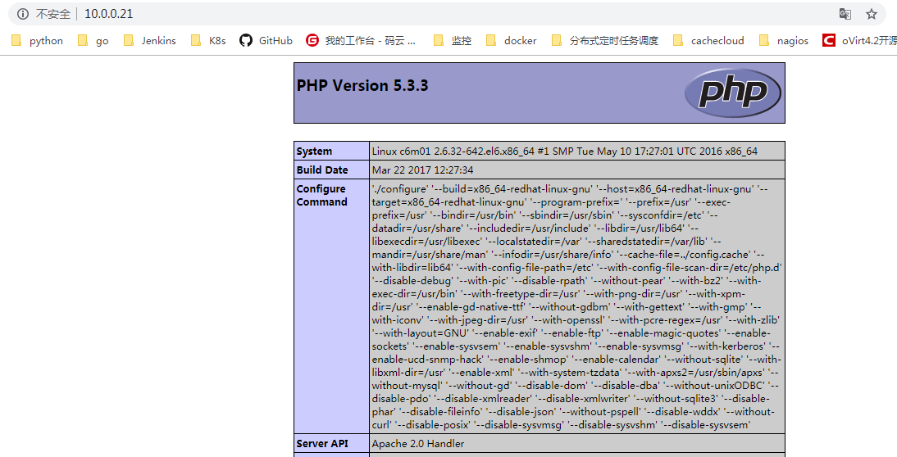
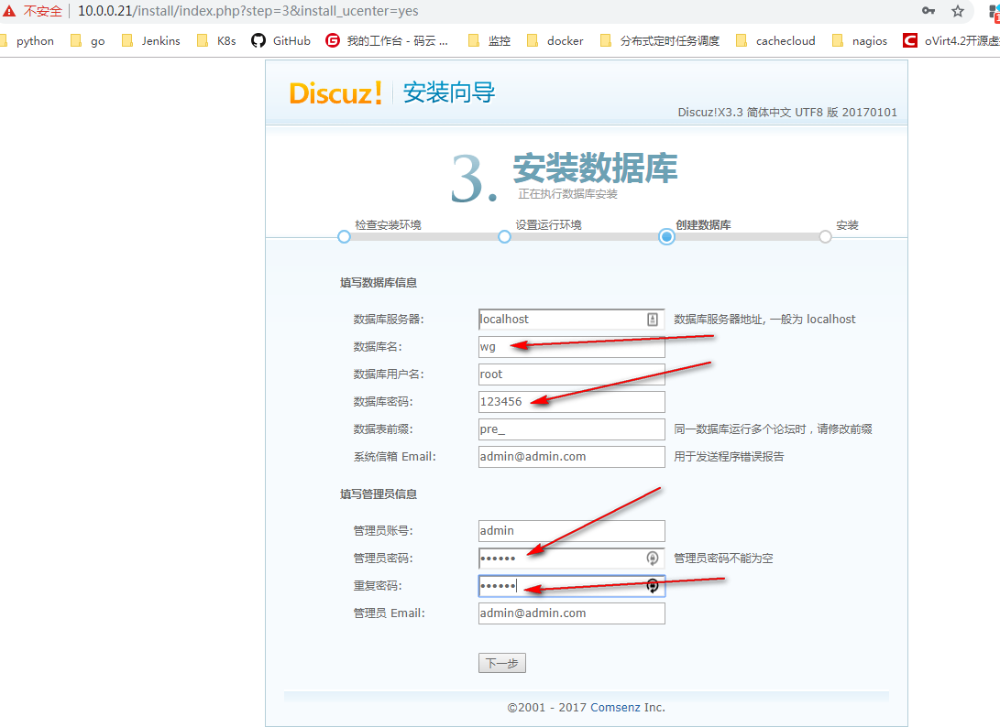
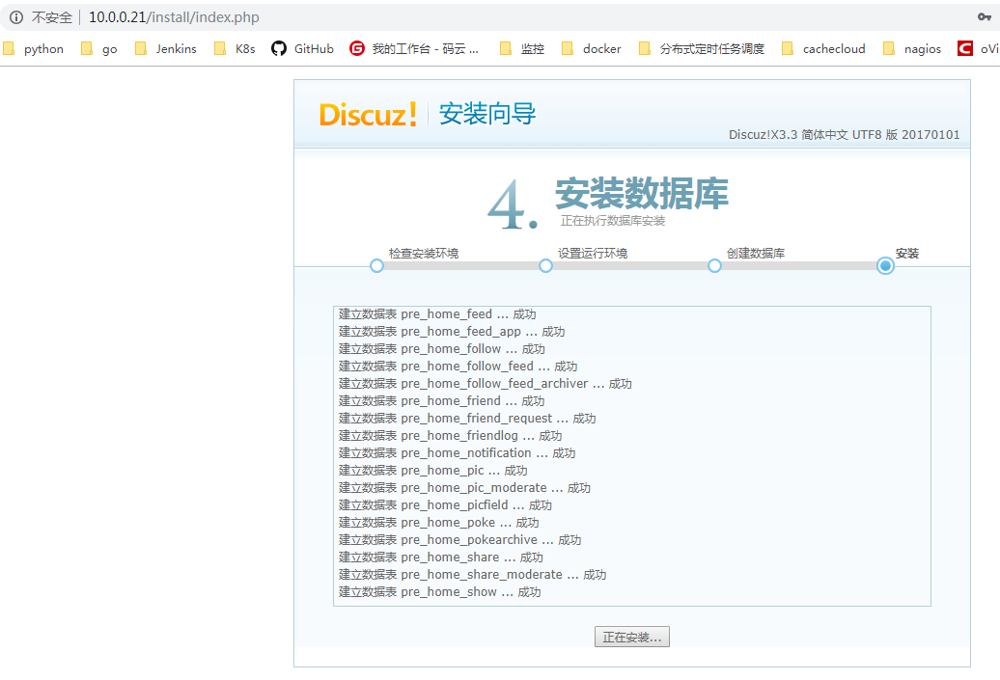

[TOC]


# 第七单元 LAMP（一）	


## 7.1 LAMP架构概述

### 7.1.1 LAMP动态网站架构组成

lamp的全称是linux+apache+mysql+php 


### 7.1.2 LAMP组成部分的作用

在LAMP的环境机构中，apache、mysql和php的主要功能分别如下。


    apache主要实现如下功能：
    第一：处理http的请求、构建响应报文等自身服务；
    第二：配置让Apache支持PHP程序的响应（通过PHP模块或FPM）；
    第三：配置Apache具体处理php程序的方法，如通过反向代理将php程序交给fcgi处理。
    
    php主要实现如下功能：
    第一：提供apache的访问接口，即CGI或Fast CGI(FPM);
    第二：提供PHP程序的解释器；
    第三：提供mysql/mairadb数据库的连接函数的基本环境。
    
    mysql主要实现如下功能：
    第一：提供PHP程序对数据的存储；
    第二：提供PHP程序对数据的读取(通常情况下从性能的角度考虑，尽量实现数据库的读写分离)。
    
    由此可知，要实现LAMP在配置每一个服务时，安装功能需求进行配置，即可实现LAMP的架构，当然apache、mysql和php服务都可配置为独立服务，安装在不同服务器之上。


## 7.2 RPM包搭建LAMP架构

### 7.2.1 RPM搭建LAMP所需软件包

Centos yum安装保存rpm到本地

1.修改yum配置文件

```shell
sed -i "s/keepcache=0/keepcache=1/g" /etc/yum.conf
```

2.清理yum缓存

```shell
yum clean all
yum makecache
```

3.yum安装

```shell
yum install mysql mysql-server php php-mysql php-fpm httpd -y
或
yum install mysql* php* httpd* -y
```

4.下载rpm包到本地

```
cd /var/cache/yum/x86_64/6/base/packages
sz *
```


### 7.2.2 开启mysql服务

```shell
/etc/init.d/mysqld start

在刚安装好的mysql默认进入是没有密码的直接在终端中输入：mysql 就可以登录，但是为了保证其安全性，可以修改其密码
#登录数据库
mysql
mysql -u root -h 10.0.0.21 -p '123456'

#退出数据库
mysql> \q
mysql> exit

#mysql数据库登录密码
/usr/bin/mysqladmin -u root password '123456'
```


## 7.4 配置Apache支持php

```shell
vim /etc/httpd/conf/httpd.conf
在DirectoryIndex index.html后添加加index.php #支持php
添加AddType application/x-httpd-php .php   #支持php应用
```


## 7.5 创建php测试页

```shell
#创建php测试页
vim /var/www/html/index.php
内容：
<?php
phpinfo();
?>
```


## 7.6 重启apache测试php页面

```shell
/etc/init.d/httpd restart
访问
http://10.0.0.21/
```




## 7.6 安装配置Discuz 论坛

### 7.6.1 上传Discuz的upload文件夹内的文件到网站根目录

`Discuz_X3.3_SC_UTF8.zip`

```
#将论坛的安装包上传到服务器并解压
#安装解压工具：
yum -y install unzip
解压
unzip Discuz_X3.3_SC_UTF8.zip

rm -f /var/www/html/*
cp -a upload/* /var/www/html

cd /var/www/html
#增加可写权限
chmod 777 -R *
```


### 7.6.2 浏览器访问安装，接受许可条款


### 7.6.3 配置php

```
#编辑php配置文件
vim /etc/php.ini
#修改
229 short_open_tag = On
#重启httpd
service httpd restart
```


### 7.6.4 连接到数据库，选择网站内容存放数据库

```shell
#mysql数据库的操作
创建数据库
mysqladmin create wg
或者
[root@ c6m01 ~]# mysql -uroot -hlocalhost -p'123456'
mysql> show databases;
+--------------------+
| Database           |
+--------------------+
| information_schema |
| mysql              |
| test               |
+--------------------+

mysql> create database wg;

退出数据库
mysql> quit
mysql> \q
mysql> exit

修改数据库root账户密码
mysqladmin password 123456
```


### 7.6.5 设置后台管理员及密码








### 7.6.6 访问论坛地址

http://10.0.0.21


## 7.7 SVN服务搭建 +apache实现 基于http访问的svn器及权限管理

