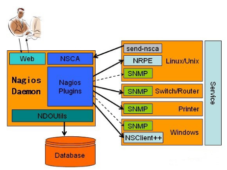
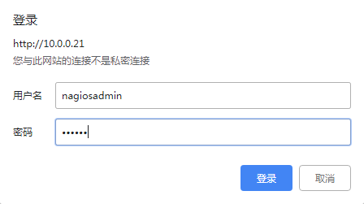

[TOC]


# 第十四单元-Nagios	

# 14.1 nagios介绍

　　

​	

​	Nagios是一款开源的电脑系统和网络监视工具，能有效监控Windows、Linux和Unix的主机状态，交换机路由器等网络设置，打印机等。在系统或服务状态异常时发出邮件或短信报警第一时间通知网站运维人员，在状态恢复后发出正常的邮件或短信通知。

主要功能：
网络服务监控（SMTP、POP3、HTTP、NNTP、ICMP、SNMP、FTP、SSH）

主机资源监控（CPU load、disk usage、system logs），也包括Windows主机（使用NSClient++ plugin）

可以指定自己编写的Plugin通过网络收集数据来监控任何情况（温度、警告……）

可以通过配置Nagios远程执行插件远程执行脚本

远程监控支持SSH或SSL加通道方式进行监控

简单的plugin设计允许用户很容易的开发自己需要的检查服务，支持很多开发语言（shell scripts、C++、Perl、ruby、Python、PHP、C#等）

包含很多图形化数据Plugins（Nagiosgraph、Nagiosgrapher、PNP4Nagios等）

可并行服务检查

能够定义网络主机的层次，允许逐级检查，就是从父主机开始向下检查

当服务或主机出现问题时发出通告，可通过email, pager, sms 或任意用户自定义的plugin进行通知

能够自定义事件处理机制重新激活出问题的服务或主机

自动日志循环

支持冗余监控

包括Web界面可以查看当前网络状态，通知，问题历史，日志文件等


# 14.2 nagios工作原理

　　Nagios的功能是监控服务和主机，但是他自身并不包括这部分功能，所有的监控、检测功能都是通过各种插件来完成的。

　　启动Nagios后，它会周期性的自动调用插件去检测服务器状态，同时Nagios会维持一个队列，所有插件返回来的状态信息都进入队列，Nagios每次都从队首开始读取信息，并进行处理后，把状态结果通过web显示出来。

　　Nagios提供了许多插件，利用这些插件可以方便的监控很多服务状态。安装完成后，在nagios主目录下的`/libexec`里放有nagios自带的可以使用的所有插件，如，check_disk是检查磁盘空间的插件，check_load是检查CPU负载的，等等。每一个插件可以通过运行`./check_xxx –h` 来查看其使用方法和功能。

　　Nagios可以识别4种状态返回信息，即 0(OK)表示状态正常/绿色、1(WARNING)表示出现警告/黄色、2(CRITICAL)表示出现非常严重的错误/红色、3(UNKNOWN)表示未知错误/深黄色。Nagios根据插件返回来的值，来判断监控对象的状态，并通过web显示出来，以供管理员及时发现故障。

四种监控状态


　　再说报警功能，如果监控系统发现问题不能报警那就没有意义了，所以报警也是nagios很重要的功能之一。但是，同样的，Nagios 自身也没有报警部分的代码，甚至没有插件，而是交给用户或者其他相关开源项目组去完成的。

　　Nagios 安装，是指基本平台，也就是Nagios软件包的安装。它是监控体系的框架，也是所有监控的基础。

　　打开Nagios官方的文档，会发现Nagios基本上没有什么依赖包，只要求系统是Linux或者其他Nagios支持的系统。不过如果你没有安装apache（http服务），那么你就没有那么直观的界面来查看监控信息了，所以apache姑且算是一个前提条件。关于apache的安装，网上有很多，照着安装就是了。安装之后要检查一下是否可以正常工作。

　　知道Nagios 是如何通过插件来管理服务器对象后，现在开始研究它是如何管理远端服务器对象的。Nagios 系统提供了一个`插件NRPE`。Nagios 通过周期性的运行它来获得远端服务器的各种状态信息。它们之间的关系如下图所示：



Nagios 通过NRPE 来远端管理服务

1. Nagios 执行安装在它里面的check_nrpe 插件，并告诉check_nrpe 去检测哪些服务。

2. 通过SSL，check_nrpe 连接远端机子上的NRPE daemon

3. NRPE 运行本地的各种插件去检测本地的服务和状态(check_disk,..etc)

4. 最后，NRPE 把检测的结果传给主机端的check_nrpe，check_nrpe 再把结果送到Nagios状态队列中。

5. Nagios 依次读取队列中的信息，再把结果显示出来。


# 14.3 实验环境

| **Host type** | **OS**                     | **IP**    | **Software**                              |
| ------------- | -------------------------- | --------- | ----------------------------------------- |
| Nagios-Server | CentOS release 6.8 (Final) | 10.0.0.21 | Apache、Php、Nagios、nagios-plugins、nrpe |
| Nagios-Linux  | CentOS release 6.8 (Final) | 10.0.0.22 | nagios-plugins、nrpe                      |

Server 安装了nagios软件，对监控的数据做处理，并且提供web界面查看和管理。当然也可以对本机自身的信息进行监控。
Client 安装了NRPE等客户端，根据监控机的请求执行监控，然后将结果回传给监控机。

防火墙已关闭/iptables: Firewall is not running
SELINUX=disabled


# 14.4 nagios监控端部署

## 14.4.1  lamp环境搭建

```
yum -y install httpd php lrzsz openssl-devel gcc gcc-c++
```

整合Apache和PHP

```
vim /etc/httpd/conf/httpd.conf
DirectoryIndex index.php index.html index.html.var
AddType application/x-httpd-php .php
```


## 14.4.2 安装nagios-server端

**创建nagios用户组和用户**

```shell
groupadd nagios
useradd -g nagios nagios
```

**编译安装nagios**

```shell
wget https://assets.nagios.com/downloads/nagioscore/releases/nagios-4.3.1.tar.gz
tar -zxvf nagios-4.3.1.tar.gz
cd nagios-4.3.1
./configure --prefix=/usr/local/nagios	#检查编译环境
make all		#编译
make install	#安装Nagios程序的主要文件
make install-init	#安装Nagios服务init脚本
make install-commandmode	#安装Nagios权限相关
make install-webconf		#安装Nagios网页配置文件
make install-config			#安装Nagios配置文件目录
```

**生成Nagios网页认证文件并创建用户**

```shell
htpasswd  -c  /usr/local/nagios/etc/htpasswd.users   nagiosadmin
```

**添加nagios到开机自启**

```shell
chkconfig --add nagios
chkconfig --level 35 nagios on
chkconfig --list nagios
```

**启动httpd和nagios**

```shell
/etc/init.d/httpd restart
/etc/init.d/nagios restart
```

## 14.4.3 安装nagios-plugins

```shell
wget https://nagios-plugins.org/download/nagios-plugins-2.1.4.tar.gz
tar -zxvf nagios-plugins-2.1.4.tar.gz
cd nagios-plugins-2.1.4
./configure --prefix=/usr/local/nagios --with-nagios-user=nagios --with-nagios-group=nagios
make
make install
#注意：如果要监控mysql 需要添加 --with-mysql
```

## 14.4.4 安装nrpe

NRPE是监控软件nagios的一个扩展，它被用于被监控的服务器上，向nagios监控平台提供该服务器的一些本地的情况。例如，cpu负载、内存使用、硬盘使用等等。NRPE可以称为nagios的for linux 客户端。

```
yum -y install gcc gcc-c++ openssl-devel xinetd
wget http://prdownloads.sourceforge.net/sourceforge/nagios/nrpe-2.15.tar.gz
tar -zxvf nrpe-2.15.tar.gz
cd nrpe-2.15
./configure --prefix=/usr/local/nagios
make all
make install-plugin
make install-daemon
make install-daemon-config
make install-xinetd
```

**配置NRPE**

```
vim /usr/local/nagios/etc/nrpe.cfg
allowed_hosts=10.0.0.21

vim /etc/xinetd.d/nrpe
only_from       = 10.0.0.21
```

**配置/etc/services**

```
vim +429 /etc/services
nrpe            5666/tcp
nrpe            5666/udp
```

**启动NRPE**

```
/etc/init.d/xinetd restart
```

**启动httpd和nagios**

```
/etc/init.d/httpd restart
/etc/init.d/nagios restart
```

**测试nrpe效果**

```
/usr/local/nagios/libexec/check_nrpe -H 10.0.0.21 -c check_load
```


## 14.4.5 浏览器访问

http://10.0.0.21/nagios/




# 14.5 Nagios主配置文件

```shell
nagios.cfg
```

路径整理

```shell
Nagios安装目录：/usr/local/nagios
Nagios插件目录：/usr/local/nagios/libexec
Nagios配置文件目录：/usr/local/nagios/etc
```

配置文件整理

```shell
Nagios主配置文件：/usr/local/nagios/etc/nagios.cfg
Nagios定义命令的配置文件：/usr/local/nagios/etc/objects/commands.cfg
Nagios定义联系人的配置文件：/usr/local/nagios/etc/objects/contacts.cfg
Nagios定义监控windows系统的配置文件：/usr/local/nagios/etc/objects/windows.cfg
Nagios定义监控本机的配置文件：/usr/local/nagios/etc/objects/localhost.cfg
Nagios定义模板的配置文件：/usr/local/nagios/etc/objects/templates.cfg
Nagios定义监控时间模板的配置文件：/usr/local/nagios/etc/objects/timeperiods.cfg
Nagios定义变量的配置文件：/usr/local/nagios/etc/resource.cfg
```


# 14.6 nagios被监控端部署（linux）


监控另一台linux服务器

(1)添加nagios用户

```shell
useradd -s /sbin/nologin nagios
mkdir /usr/local/nagios
chown -R nagios.nagios /usr/local/nagios
```

(2)安装nagios-plugins

```shell
wget https://nagios-plugins.org/download/nagios-plugins-2.1.4.tar.gz
tar -zxvf nagios-plugins-2.1.4.tar.gz
cd nagios-plugins-2.1.4
./configure --prefix=/usr/local/nagios --with-nagios-user=nagios --with-nagios-group=nagios
make
make install
```

(3)安装NRPE

```shell
yum -y install gcc gcc-c++ openssl-devel xinetd
wget http://prdownloads.sourceforge.net/sourceforge/nagios/nrpe-2.15.tar.gz
tar -zxvf nrpe-2.15.tar.gz
cd nrpe-2.15
./configure --prefix=/usr/local/nagios
make all
make install-plugin
make install-daemon
make install-daemon-config
make install-xinetd
```

(4) 配置NRPE

注意：此处的ip为nagios服务端的ip

```shell
vim /usr/local/nagios/etc/nrpe.cfg
allowed_hosts=10.0.0.21

vim /etc/xinetd.d/nrpe
only_from       = 10.0.0.21

#配置/etc/services
vim +429 /etc/services
nrpe            5666/tcp
nrpe            5666/udp

```

(5)启动NRPE

```shell
/etc/init.d/xinetd restart
```


# 14.7 nagios服务端配置

**在Nagios监控端10.0.0.21上添加一台被监控的主机**

(1)新增一个配置文件linux.cfg

```shell
vim /usr/local/nagios/etc/nagios.cfg
```

增加

```shell
cfg_file=/usr/local/nagios/etc/objects/linux.cfg
```

(2)编辑新加主机的配置文件

```shell
vim /usr/local/nagios/etc/objects/linux.cfg

define host{
        use                     linux-server
        host_name               c6s02
        alias                   c6s02
        address                 10.0.0.22
        }
```

修改属主属组

```
chown -R nagios.nagios /usr/local/nagios/etc/objects/linux.cfg	
```


(3)检查语法并重启

```shell
/usr/local/nagios/bin/nagios -v /usr/local/nagios/etc/nagios.cfg
```

或者

```shell
/etc/init.d/nagios configtest
/etc/init.d/nagios restart
```


