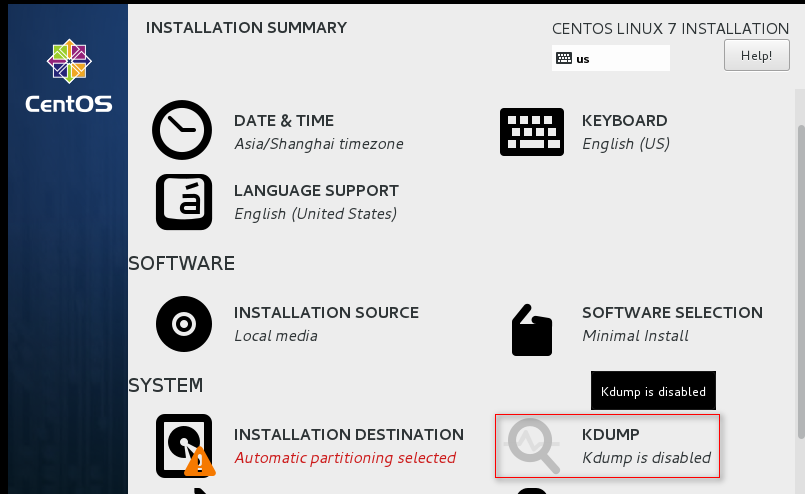
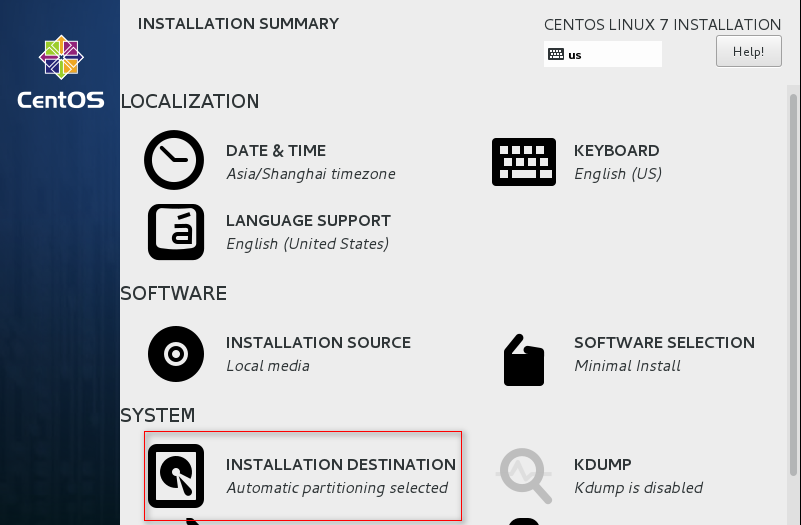

[TOC]


# 1.CentOS7安装








# 2.CentOS7安装后克隆虚机前的部分优化

## 2.1 关闭防火墙和selinux

```shell
systemctl   stop   firewalld.service
systemctl   disable firewalld.service

setenforce 0
sed -i  '/^SELINUX/s#enforcing#disabled#g' /etc/selinux/config
```


## 2.2 修改yum源为阿里云

```shell
yum install -y wget 
wget -O /etc/yum.repos.d/CentOS-Base.repo http://mirrors.aliyun.com/repo/Centos-7.repo
wget -O /etc/yum.repos.d/epel.repo http://mirrors.aliyun.com/repo/epel-7.repo
yum clean all
yum makecache

yum -y install gcc gcc-c++  cmake curl  nmap  lrzsz unzip zip ntpdate telnet vim tree bash-completion iptables-services ntp dos2unix lsof net-tools sysstat psmisc
```


## 2.3 时间同步

```bash
echo "*/5 * * * * /usr/sbin/ntpdate ntp1.aliyun.com >/dev/null 2>&1">>/var/spool/cron/root
```


## 2.4 关闭图形化网卡管理

不关闭会出现，ip无法出现的问题。

```shell
systemctl stop NetworkManager
systemctl disable NetworkManager
```


