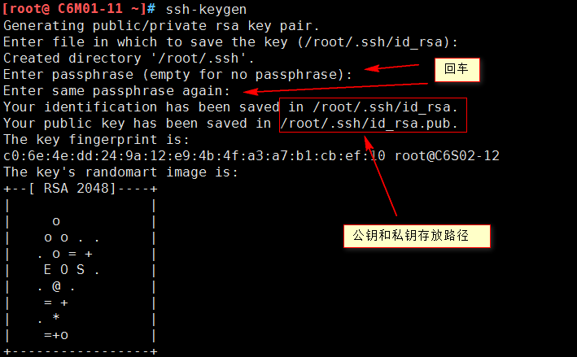
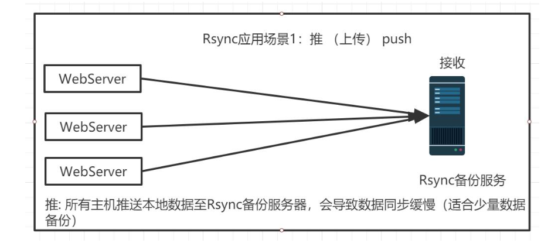
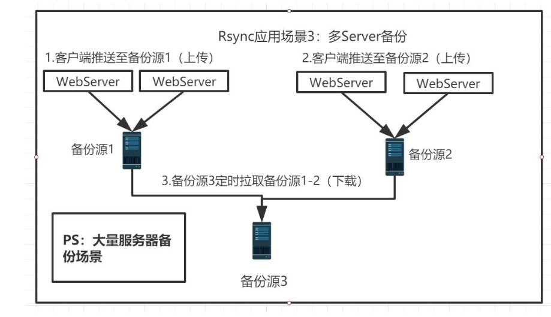

[TOC]


# 第一单元 远程管理


## 1.1 Linux服务分类

### 1.1.1 系统服务

**概念**

系统服务（system services）是一种`应用程序类型`。服务一经启动，除非因为关闭系统或管理者手动结束服务，否则都将在`后台执行`。

**特点**

- 占用系统资源较多 
- 响应速度较快


### 1.1.2 临时服务

**概念**

临时服务平时并不会启动，而是当客户端请求时才会被启动，使用完毕就会结束。 

**特点**

- 响应速度较慢 
- 节省系统资源


### 1.1.3 服务管理

为了简化Linux服务管理的麻烦，Linux特别为每一个独立式的服务，提供了一个服务启动程序文件（Service Startup Script）。 所有的服务启动文件被储存在`/etc/rc.d/init.d/`目录下。


`CentOS 6`系统所有的预设服务都可以通过查看`/etc/rc.d/init.d/`目录得到。

```shell
[root@ C6M01-11 ~]# ls -ld /etc/init.d
lrwxrwxrwx. 1 root root 11 6月  30 2018 /etc/init.d -> rc.d/init.d
```

其实`/etc/init.d`是一个符号链接文件，链接指向`/etc/rc.d/init.d`


#### 1.1.3.1 管理方式

- 利用脚本文件直接管理服务 

```shell
/etc/init.d/服务名 start|stop|restart 
```

- service命令管理方法 

```shell
service 服务名 start|stop|restart 
```

能够使用service命令进行操作的，就是已经注册成为`linux`的系统服务了。


`/etc/init.d/服务名 start`和`service 服务名 start`有何区别？

`service`实际上是调用的`/etc/init.d/`目录下的启动脚本。有图有真相：


#### 1.1.3.2 开机自启

`chkconfig`命令主要用来更新（启动或停止）和查询系统服务的运行级信息。

谨记`chkconfig`不是立即自动禁止或激活一个服务，而是下次重启系统时生效。

使用`chkconfig`的前提条件必须有供调用的脚本文件(也就是这个服务要是系统服务可以让service调用)。

使用语法：

```
chkconfig --add/--del/--list 系统服务
chkconfig --level <等级代号> 系统服务 on/off/reset
```

示例：

```shell
chkconfig --list
chkconfig --level 3 network off
chkconfig --level 345 network off
chkconfig --del network
chkconfig --add network
```

**查看系统服务在各个级别开机启动情况**	

```shell
[root@ C6M01-11 init.d]# chkconfig
rsyslog        	0:关闭	1:关闭	2:启用	3:启用	4:启用	5:启用	6:关闭
saslauthd      	0:关闭	1:关闭	2:关闭	3:关闭	4:关闭	5:关闭	6:关闭
smartd         	0:关闭	1:关闭	2:关闭	3:关闭	4:关闭	5:关闭	6:关闭
sshd           	0:关闭	1:关闭	2:启用	3:启用	4:启用	5:启用	6:关闭
```


#### 1.1.3.3 linux运行级别

简单的说，运行级就是操作系统当前正在运行的功能级别。这个级别从1到6 ，具有不同的功能。

- 0：关机
- 1：单用户模式
- 2：无网络支持的多用户模式
- 3：有网络支持的多用户模式
- 4：保留，未使用
- 5：有网络支持有X-Windows(图形界面)支持的多用户模式
- 6：重新引导系统，即重启

查看当前系统运行级别

```
runlevel
```


#### 1.1.3.4 xinetd

`xinetd`是一个特殊的程序，不断监控所有通讯端口。一旦有客户端调用某一个启动文件时，这个程序就要负责启动该服务；而在客户端使用完毕后，该程序也必须要负责结束。 所以通常用来管理临时服务。

**使用`xinetd`启动守护进程**

原则上任何系统服务都可以使用`xinetd`，然而最适合的应该是那些常用的网络服务，因为这些服务的请求数目和频繁程度不会太高。像`DNS`和`Apache`就不适合采用这种方式，而像FTP、Telnet、SSH等就适合使用`xinetd`模式，具体可以查看/etc/services文件。

**守护进程服务位置**

```
/etc/xinetd.d
```

**管理xinetd** 

```shell
service xinetd start/stop/restart|status
/etc/init.d/xinetd start/stop/restart|status
```


## 1.2 远程管理介绍

### 1.2.1 基本概念

对于服务器其一般都是放置在我们的`IDC（Internet Data Center，即互联网数据中心)`机房当中，我们通常是无法直接接触到服务器硬件，那么我们如果要对服务器进行操作的话，就只能通过远程管理的方式来对我们的服务器进行控制了。 


### 1.2.2 常见的远程管理工具 

- 传统的telnet服务器 
- 提供安全连接的ssh服务器--**重点**
- 提供图形界面的`VNC`服务器


#### 1.2.2.1 telnet

telnet是进行远程登录的标准协议，它是当今Internet上使用最为广泛的协议之一。它把用户正在使用的终端或计算机变成网络某 一远程主机的仿真终端，使得用户可以方便地使用远程主机上的软、硬件资源。 

**缺点**：telnet协议以明文的方式传送所有数据（包括账号和口令），数据在传输过程中很容易被入侵者窃听会篡改，所以建议在对安全性不高的环境下使用。 

**telnet服务端安装** 

```shell
yum -y install  telnet-server
或
rpm -qa telnet-server
```

**telnet服务端配置** 

修改`/etc/xinetd.d/telnet` 文件


1) disable 参数意义: 是否启用服务（no为启用、yes为禁用）
2) only_from 参数意义：允许哪些主机访问
3) no_access 参数意义：拒绝哪些主机访问
4) access_times 参数意义：服务开放时间
**重启`xinetd`服务**

```shell
/etc/init.d/xinetd restart
```

**查看23端口是否开启**

```shell
netstat -lntp |grep 23 
```

**telnet客户端连接测试**

此处10.0.0.11为服务端ip

```shell
[root@ C6S02-12 ~]# telnet 10.0.0.11
Trying 10.0.0.11...
Connected to 10.0.0.11.
Escape character is '^]'.
CentOS release 6.8 (Final)
Kernel 2.6.32-642.el6.x86_64 on an x86_64
login: root
Password:
Login incorrect
```

**说明：telnet默认不允许root连接，需要将`/etc/securetty`删除或改名。**

创建普通用户tom进行测试：

```shell
useradd tom
echo "123456"|passwd --stdin tom
telnet -l tom 10.0.0.21
```


#### 1.2.2.2 ssh--重点

**（1）什么是SSH？**

简单说，SSH是一种网络协议，用于计算机之间的加密登录。

最早的时候，互联网通信都是明文通信，一旦被截获，内容就暴露无疑。1995年，芬兰学者Tatu Ylonen设计了SSH协议，将登录信息全部加密，成为互联网安全的一个基本解决方案，迅速在全世界获得推广，目前已经成为Linux系统的标准配置。


**（2）SSH连接原理**

ssh服务是一个守护进程(demon)，系统后台监听客户端的连接，ssh服务端的进程名为`sshd`,负责实时监听客户端的请求(IP 22端口)，包括公共秘钥等交换等信息。

ssh服务端由2部分组成： `openssh`(提供ssh服务)    `openssl`(提供加密的程序)

ssh的客户端可以用 `XSHELL`，`Securecrt`, `Mobaxterm`等工具进行连接

**ssh连接排错**

①确认网路通讯是否正常(客户端执行)

```shell
ping 服务器ip
tracert -d 服务器ip地址(windows下操作)
traceroute -n 服务器ip(linux下操作)
```

②安全机制进行了阻拦

```shell
关闭iptables:  /etc/init.d/iptables stop && chkconfig iptables off
关闭selinux：	setenforce 0 && sed -i 's#SELINUX=.*#SELINUX=disabled#g' /etc/selinux/config
```

③检查ssh进程，确认服务是否运行良好（客户端操作）

```shell
telnet ip 22
namp ip -p 22 （nmap是linux命令）
```


**（3）SSH知识小结**

```shell
SSH是安全的加密协议，用于远程连接Linux服务器
SSH的默认端口是22，安全协议版本是SSH2
SSH服务器端主要包含2个服务功能SSH连接和SFTP服务器
SSH客户端包含ssh连接命令和远程拷贝scp命令等 
```


 **（4）防止SSH登录入侵小结**

    1、用密钥登录并更改默认22端口，尽量不用密码登陆(即使使用也必须使用复杂密码，并定期更换)
    2、牤牛阵法：解决SSH安全问题
       a.防火墙封闭SSH,指定源IP限制(局域网、信任公网)
       b.开启SSH只监听本地内网IP（ListenAddress 172.16.1.61）。
    3、尽量不给服务器外网IP


**（5）安装配置**

**安装：**

```shell
yum -y install openssh*
```

需要安装`OpenSSH `四个安装包：

```shell
openssh-*：包含OpenSSH 服务器及客户端需要的核心文件
openssh-clients-*：OpenSSH 客户端软件包
openssh-server-*：OpenSSH 服务器软件包
openssh-askpass-*：支持对话框窗口的显示，是一个基于X 系统的密码
```

`OpenSSH `配置文件

`OpenSSH `常用配置文件有两个`/etc/ssh/ssh_config` 和`/etc/ssh/sshd_config`。

`ssh_config `为客户端配置文件

`sshd_config `为服务器端配置文件

**配置**

```shell
vim /etc/ssh/sshd_config
Port 22 		#设置端口号
protocol 2,1 	#使用ssh协议的顺序，默认先使用ssh2协议
PermitEmptyPasswords no			#是否允许空密码
PasswordAuthentication yes 		#是否允许密码验证

#加快ssh连接速度
UseDNS no
GSSAPIAuthentication no
```


**（6）ssh服务的启停** 

```shell
service sshd restart|start|stop
或者 
/etc/init.d/sshd restart|start|stop
```


**（7）最基本的用法**

**密码口令登录**

SSH主要用于远程登录。假定你要以用户名user，登录远程主机host，只要一条简单命令就可以了。

```
$ ssh user@host
```

如果本地用户名与远程用户名一致，登录时可以省略用户名。

```
$ ssh host
```

SSH的默认端口是22，也就是说，你的登录请求会送进远程主机的22端口。使用p参数，可以修改这个端口。

```shell
$ ssh -p 2220 user@host
```

上面这条命令表示，ssh直接连接远程主机的2220端口。

**公钥登录(ssh互信任)**

使用密码登录，每次都必须输入密码，非常麻烦。好在SSH还提供了公钥登录。

公钥登录是为了解决每次登录服务器都要输入密码的问题，流行使用`RSA`加密方案，主要流程包含：

​	1、客户端生成`RSA`公钥和私钥

​	2、客户端将自己的公钥存放到服务器

​	3、客户端请求连接服务器，服务器将一个随机字符串发送给客户端

​	4、客户端根据自己的私钥加密这个随机字符串之后再发送给服务器

​	5、服务器接受到加密后的字符串之后用公钥解密，如果正确就让客户端登录，否则拒绝。这样就不用使用密码了。

这种方法要求用户必须提供自己的公钥。如果没有现成的，可以直接用`ssh-keygen`生成一个：

- 交互式创建和分发秘钥

```shell
ssh-keygen
```



运行上面的命令以后，系统会出现一系列提示，可以一路回车。其中有一个问题是，要不要对私钥设置口令（`passphrase`），如果担心私钥的安全，这里可以设置一个。
运行结束以后，在$HOME/.ssh/目录下，会新生成两个文件：`id_rsa.pub`和`id_rsa`。前者是你的公钥，后者是你的私钥。 

这时再将公钥传送到远程主机host上面： 

```shell
ssh-copy-id user@host 
```

好了，从此你再登录，就不需要输入密码了。

如果还是不行，就打开远程主机的`/etc/ssh/sshd_config`这个文件，检查下面几行前面"#"注释是否取掉。

```shell
RSAAuthentication yes
PubkeyAuthentication yes
AuthorizedKeysFile .ssh/authorized_keys
```

然后，重启远程主机的ssh服务。

- 非交互式创建和分发秘钥

创建

```shell
ssh-keygen -t dsa -f ~/.ssh/id_dsa -P ""
```

命令说明：
ssh-keygen:生成密钥对命令
-t：指定密钥对的密码加密类型（rsa，dsa两种）
-f：指定密钥对文件的生成路径包含文件名
-P（大写）：指定密钥对的密码

分发

```shell
yum -y install sshpass
sshpass -p "123456" ssh-copy-id -i ~/.ssh/id_dsa.pub "-p 52083 -o StrictHostKeyChecking=no root@10.0.0.12"
```


**（8）scp的使用**

Linux `scp`命令用于Linux之间复制文件和目录。

`scp`是 secure copy的缩写, `scp`是`linux`系统下基于ssh登陆进行安全的远程文件拷贝命令。

```shell
[root@ C6M01-11 ~]# scp --h
usage: scp [-1246BCpqrv] [-c cipher] [-F ssh_config] [-i identity_file]
           [-l limit] [-o ssh_option] [-P port] [-S program]
           [[user@]host1:]file1 ... [[user@]host2:]file2


复制本地文件到远程服务器
[root@ C6M01-11 ~]# scp -P 52083 aaa.txt root@10.0.0.12:/root

拉取远程服务器文件到本地
[root@ C6M01-11 ~]# scp -P 52083  root@10.0.0.12:/root/bbb.txt /root

复制本地目录到远程服务器
scp -r -P 52083 /data/www  root@10.0.0.12:/root

拉取远程服务器目录到本地
scp -r -P 52083  root@10.0.0.12:/data/logs  /root
```

小结：

①`scp`是加密的远程拷贝，而`cp`仅为本地拷贝。

②支持推拉模式

③全量拷贝，效率不高，适合第一次拷贝用，增量拷贝用`rsync`


#### 1.2.2.3 vnc

`VNC (Virtual Network Console)`是虚拟网络控制台的缩写。优点是支持跨操作系统的远程图形化控制。

**安装:**

```shell
yum -y install tigervnc-server
```

**`vnc`服务的配置：**

```shell
vim /etc/sysconfig/vncservers

# VNCSERVERARGS[2]="-geometry 800x600 -nolisten tcp -localhost"
VNCSERVERS="1:root 2:tom"
```

 vncservers处表示系统登录用户  冒号前面表示端口号， 默认从5900开始， 1表示5901，2表示5902 ，如果是设置其他的端口就要全部写完  例如  8080端口，就是8080：root，**多个用户用空格分开**

vncserverargs配置vnc的参数： 800*600分辨率、-nolisten tcp是否允许多用户连接、-localhost是否允许远程连接

【注意：】VNC`还需要有单独的密码，所以我们要对每个启用`VNC`服务的用户创建单独的`VNC`密码，通过 `vncpasswd `命令必须要切换到该用户才行，否则`VNC`服务启动不起来：

```shell
useradd tom  #创建用户
su - tom	#切换到用户
vncpasswd	#给vnc用户生成密码
```

为root用户设置好单独的`VNC`密码后，启动 `vncserver `并添加开机自启

```shell
vncpasswd
/etc/init.d/vncserver start		#启动vncserver
chkconfig  vncserver   on		#添加到开机自启动
```

**查看vnc进程**

```shell
[root@ c6m01 ~]# ps -ef|grep vnc
root       1291      1  0 09:38 pts/0    00:00:00 /usr/bin/Xvnc :1 -desktop c6m01:1 (root) -auth /root/.Xauthority -geometry 1024x768 -rfbwait 30000 -rfbauth /root/.vnc/passwd -rfbport 5901 -fp catalogue:/etc/X11/fontpath.d -pn
root       1299      1  0 09:38 pts/0    00:00:00 vncconfig -iconic
tom        1325      1  0 09:38 ?        00:00:00 /usr/bin/Xvnc :2 -desktop c6m01:2 (tom) -auth /home/tom/.Xauthority -geometry 1024x768-rfbwait 30000 -rfbauth /home/tom/.vnc/passwd -rfbport 5902 -fp catalogue:/etc/X11/fontpath.d -pn
tom        1333      1  0 09:38 ?        00:00:00 vncconfig -iconic
```

**测试远程连接：**

```shell
#输入命令查看端口号
[tom@ c6m01 ~]$ vncserver -list

TigerVNC server sessions:
X DISPLAY #	PROCESS ID
:1		26324
```


## 1.3 fail2ban防止暴力破解

`fail2ban`可以监视你的系统日志，然后匹配日志的错误信息（正则式匹配）执行相应的屏蔽动作（一般情况下是防火墙），而且可以发送e-mail通知系统管理员！

`fail2ban`运行机制：简单来说其功能就是防止暴力破解。工作的原理是通过分析一定时间内的相关服务日志，将满足动作的相关IP利用`iptables`加入到`dorp`（丢弃）列表一定时间。

`fail2ban `官方网址：http://www.fail2ban.org


### 1.3.1 安装fail2ban  

方法一：

```shell
yum install fail2ban -y

fail2ban的配置文件路径：/etc/fail2ban
日志文件：/var/log/fail2ban.log
达到阈值之后的执行的动作的配置文件：   action.d/ 
包含所有的过滤规则：filter.d/ 
```

方法二：yum安装

```shell
wget  https://github.com/fail2ban/fail2ban/archive/0.10.3.tar.gz
tar -zxvf 0.10.3.tar.gz
cd fail2ban-0.10.3/
python setup.py install
echo $?

生成服务启动脚本并开机自启：
cp files/redhat-initd /etc/init.d/fail2ban
```


### 1.3.2 配置fail2ban   

官方的文档写到：

在配置时，我们应该避免修改由`fail2ban`安装创建的文件，我们应该去编写具有.local扩展名的新文件。在`.local`新文件里配置的内容会覆盖`jail.conf`内容里相同的值。

当配置发生改变可以使用  `fail2ban-client reload` ，来重新加载新的配置。

```shell
配置fail2ban
编辑配置文件 jail.local  并实现防暴力破解　
vim /etc/fail2ban/jail.d/jail.local

#defalut这里是设定全局设置，如果下面的监控没有设置就以全局设置的值设置。
[DEFAULT]
# 用于指定哪些地址ip可以忽略 fail2ban 防御,以空格间隔。
ignoreip = 127.0.0.1/8
# 客户端主机被禁止的时长（默认单位为秒）
bantime  = 3600
# 过滤的时长（秒）
findtime  = 600
# 匹配到的阈值（次数）
maxretry = 6


[sshd]
# 是否开启
enabled  = true
# 过滤规则
filter   = sshd
# 动作
action   = iptables[name=SSH, port=ssh, protocol=tcp]
# 日志文件的路径
logpath  = /var/log/secure
# 匹配到的阈值（次数）
maxretry = 3
```

注意：上面的action设置的时候，port=ssh，如果我们更改了sshd服务的端口，需要在这里设置对应的端口号，否则配置不生效。

```shell
/etc/init.d/fail2ban start
```


 注：启动会有关于 python版本导致 模块不能调用错误：

```shell
ImportError: No module named fail2ban.version
```

是由于更新系统默认python 版本，而 配置自动找寻的是 python 2.6，所以需要重新配置 引导python版本：

```shell
修改： /usr/bin/fail2ban-server  和  /usr/bin/fail2ban-client
更改 第一行：
#!/usr/bin/python -Es  更改为  #!/usr/bin/python2.6 -Es

sed -i '/python/s#python#python2.6#g' /usr/bin/fail2ban-server
sed -i '/python/s#python#python2.6#g' /usr/bin/fail2ban-client
```


### 1.3.3 fail2ban的常用命令以及详解  

 **fail2ban-client** 

| start                       | 启动fail2ban server和监狱                                    |
| --------------------------- | ------------------------------------------------------------ |
| reload                      | 重新加载配置文件                                             |
| stop                        | 暂停fail2ban和监狱                                           |
| status                      | 查看运行的监控服务数量和列表                                 |
| set loglevel                | 设置日志等级，有 CRITICAL, ERROR, WARNING,NOTICE, INFO, DEBUG |
| get loglevel                | 获取当前日志的等级                                           |
| set <JAIL> idle on\|off     | 设置某个监控（监狱）的状态。                                 |
| set <JAIL> addignoreip <IP> | 设置某个监控（监狱）可以忽略的ip                             |
| set <JAIL> delignoreip <IP> | 删除某个监控（监狱）可以忽略的ip                             |
| set <JAIL> banip <IP>       | 将ip加入 **监控（监狱）**                                    |
| set <JAIL> unbanip <IP>     | 将ip从监控（监狱）移除                                       |


## 1.4 rysnc+inotify实现服务器数据备份

### 1.4.1 rsync介绍

#### 1.4.1.1 rsync概念

`rsync`英文称为`remote synchronizetion`，从软件的名称就可以看出来，rsync具有可使本地和远程两台主机之间的数据快速复制同步镜像、远程备份的功能，这个功能类似于ssh带的scp命令，但是又优于scp命令的功能，**scp每次都是全量拷贝，而rsync可以增量拷贝。**当然，rsync还可以在本地主机的不同分区或目录之间全量及增量的复制数据，这又类似cp命令。但是同样也优于cp命令，cp每次都是全量拷贝，而rsync可以增量拷贝。

在同步数据的时候，默认情况下，rsync通过其独特的“quick check”算法，它仅同步大小或者最后修改时间发生变化的文件或目录，当然也可根据权限、属主等属性的变化同步，但是需要制定相应的参数，甚至可以实现只同步一个文件里有变化的内容部分，所以，可是实现快速的同步备份数据。

**rsync** - 快速，通用，可实现全量和增量的远程（和本地）文件复制工具。

rsync监听端口：873

rsync运行模式：C/S

client/server ：客户端/服务端


#### 1.4.1.2 rsync优缺点

**优点：**
1）可以**增量备份**，支持socket（daemon），集中备份(**支持推拉，都是以客户端为参照物**)；socket（daemon）需要加密传输，可以利用vpn服务或ipsec服务。

2）可以**限速**进行数据的备份或恢复操作。

3）远程SHELL通道模式还可以**加密**（SSH）传输

4）支持**匿名认证**（无需系统用户）的进程模式传输，可以实现方便安全的进行数据备份和镜像

5）保持原文件或目录的权限、时间、软硬链接、属主、组等所有属性均不改变 –p

6）可以有排除指定文件或目录同步的功能，相当于打包命令tar的排除功能。（--exclude）

**缺点：**
1）大量小文件时进行同步备份，比对的时间较长，有时候会导致rsync进程停止运行或者进程挂起；
解决方法：
		a、打包后再同步；
		b、drbd（文件系统同步复制block）。

2）同步大文件，比如：10G这样的，有时也会出现问题，导致rsync进程中断，未完整同步前，是隐藏文件，但是会占用磁盘空间（ls -al查看）。直到同步完成后，将隐藏文件改成正常文件。而且，每中断一次，生成一个隐藏文件。


#### 1.4.1.3 rsync的应用场景

**应用场景1：推**

示意图如下：




**应用场景2：拉**

示意图如下：


**应用场景3：大量数据备份场景**

示意图如下：



 

**应用场景4：异地备份**

示意图如下： 


#### 1.4.1.4 rsync三种工作模式

Rsync有三种传输模式，分别是本地方式、远程方式、守护进程。

**本地复制模式：类似于cp**

```shell
rsync [OPTION...] SRC... [DEST]
```


**隧道传输模式： 类似于scp**

Pull: 拉取

```shell
rsync [OPTION...] [USER@]HOST:SRC... [DEST]
```

Push: 推送

```shell
rsync [OPTION...] SRC... [USER@]HOST:DEST
```


**守护进程模式： 以守护进程（socket）的方式传输数据（rsync  本身的功能）。**最常用

Pull: 拉取

```shell
rsync [OPTION...] [USER@]HOST::SRC... [DEST]
rsync [OPTION...] rsync://[USER@]HOST[:PORT]/SRC... [DEST]
```

Push: 推送

```shell
rsync [OPTION...] SRC... [USER@]HOST::DEST
rsync [OPTION...] SRC... rsync://[USER@]HOST[:PORT]/DEST
```

注意：推拉操作都是通过rsync clent操作的。


#### 1.4.1.5 rsync守护进程模式部署

环境介绍：

```
centos6.8

10.0.0.21		rsync服务端
10.0.0.22		rsync客户端
```

**服务端部署**
1、确认rsync软件服务是否存在			

```shell
rpm -qa rsync
#安装 yum -y install rsync
```

参数详解

| **参数**              | **说明**                                                     |
| --------------------- | ------------------------------------------------------------ |
| -v, --verbose         | 详细模式输出                                                 |
| -a, --archive         | 归档模式，表示以递归方式传输文件，并保持所有文件属性，等于-rlptgoD |
| -z, --compress        | 对备份的文件在传输时进行压缩处理                             |
| -P                    | 显示进度                                                     |
|                       |                                                              |
| -r, --recursive       | 对子目录以递归模式处理                                       |
| -l, --links           | 保留软链结                                                   |
| -p, --perms           | 保持文件权限                                                 |
| -o, --owner           | 保持文件属主信息                                             |
| -g, --group           | 保持文件属组信息                                             |
| -D, --devices         | 保持设备文件信息                                             |
| -t, --times           | 保持文件时间信息                                             |
| -e, --rsh=command     | 指定使用rsh、ssh方式进行数据同步                             |
| --exclude=PATTERN     | 指定排除不需要传输的文件模式                                 |
| --exclude-from=FILE   | 排除FILE中指定模式的文件                                     |
| -S, --sparse          | 对稀疏文件进行特殊处理以节省DST的空间                        |
| --bwlimit=KBPS        | 限制I/O带宽，KBytes per second                               |
| --delete              | 删除那些DST中SRC没有的文件                                   |
| --password-file=FILE  | 从FILE中得到密码                                             |
| -n, --dry-run         | 现实哪些文件将被传输                                         |
| -w, --whole-file      | 拷贝文件，不进行增量检测                                     |
| -B, --block-size=SIZE | 检验算法使用的块尺寸，默认是700字节。                        |
| -x, --one-file-system | 不要跨越文件系统边界                                         |
| -R, --relative        | 使用相对路径信息                                             |
| -b, --backup          | 创建备份，也就是对于目的已经存在有同样的文件名时，将老的文件重新命名为~filename。可以使用--suffix选项来指定不同的备份文件前缀。 |
| -u, --update          | 仅仅进行更新，也就是跳过所有已经存在于DST，并且文件时间晚于要备份的文件，不覆盖更新的文件 |
| -q, --quiet           | 精简输出模式                                                 |
| -c, --checksum        | 打开校验开关，强制对文件传输进行校验                         |

补充参数

```shell
--delete            实现无差异数据同步
--bwlimit=KBPS      实现数据传输过程中限速
--exclude=PATTERN   指定一个文件或目录 --exclude={file1，file2} 可以排除多个无顺序规则文件或目录
--exclude-from=FILE  指定排除多个文件或目录信息，将排除信息写入到一个文件中，利用--exclude-from=排除文件名   类似于tar 打包排除命令
```

2、手动配置rsync软件配置文件			

```shell
vim  /etc/rsyncd.conf

##全局配置			
uid = rsync    #用户			
gid = rsync    #用户组			
use chroot = no    #安全相关			
max connections = 200    #最大链接数			
timeout = 300    #超时时间			
pid file = /var/run/rsyncd.pid    #进程对应的进程号文件			
lock file = /var/run/rsync.lock    #锁文件			
log file = /var/log/rsyncd.log    #日志文件，显示出错信息

##模块配置			
[backup]            #模块名称			
path = /data      #模块对应的位置（路径）			
ignore errors       #忽略错误程序			
read only = false    #是否只读			
list = false        #是否可以列表			
hosts allow = 10.0.0.0/24  #准许访问rsync服务器的客户范围			
hosts deny = 0.0.0.0/32      #禁止访问rsync服务器的客户范围			
auth users = rsync_backup    #不存在的用户；只用于认证			
secrets file = /etc/rsync.password  #设置进行连接认证的密匙文件
```

3、创建rsync软件进程用户			

```shell
useradd -s /sbin/nologin -M rsync
```

4、创建rsync备份目录/授权rsync用户管理备份目录；修改备份目录权限			 								

```shell
mkdir -p /data
chown -R rsync.rsync /data/
```

5、创建认证用户密码文件；修改文件权限							

```shell
echo "rsync_backup:123456" >/etc/rsync.password
chmod 600 /etc/rsync.password
```

6、启动rsync守护进程服务			

```shell
rsync --daemon
```

7、将rsync加入开机自启动服务中

```shell
echo "rsync --daemon">>/etc/rc.local
或者修改
vim /etc/xinetd.d/rsync
```

**客户端部署**

创建密码文件，客户端密码文件中，只需要密码即可。同时，密码文件的权限是600			

```shell
echo "123456">/etc/rsync.password		
chmod 600 /etc/rsync.password		
```

**客户端测试推送文件**

```shell
rsync -az aaa.txt rsync_backup@10.0.0.21::backup --password-file=/etc/rsync.password
```


>  注意：rsync默认使用873端口，防火墙开启时，需放行端口

**客户端拉取测试**

```shell
rsync -avz rsync_backup@10.0.0.21::backup --password-file=/etc/rsync.password /tmp
```


#### 1.4.1.6 rsync常见问题排错思路及提示

```shell
①iptables 防火墙和selinux；
No route to host
② /etc/rsyncd.conf配置文件模块名称书写错误
Unknown module 'backup'  
凡是涉及配置文件的错误必须结构日志文件tail /var/log/rsyncd.log；
③ 权限问题 
   Permission denied
   必须看1. 共享目录的属主和属组是不是rsync；权限是不是755   2.存放密码文件/etc/rsync.password的权限为600和属主为rsync
④ 虚拟用户rsync
  invalid uid rsync    id查看用户 不存在建立用户
⑤ 密码文件问题 /etc/rsync.password 服务端密码文件必须有用户名：密码
   password file must not be other-accessible
```


### 1.4.2 inotify介绍

#### 1.4.2.1 inotify出现的原因

Rsync（remote sync）远程同步工具，通过rsync可以实现对远程服务器数据的增量备份同步，但rsync自身也有瓶颈，同步数据时，rsync采用核心算法对远程服务器的目标文件进行比对，只进行差异同步。我们可以想象一下，如果服务器的文件数量达到了百万甚至千万量级，那么文件对比将是非常耗时的。而且发生变化的往往是其中很少的一部分，这是非常低效的方式。inotify的出现，可以缓解rsync不足之处，取长补短。


**简介**
Inotify是一种强大的，细粒度的，异步的文件系统事件监控机制（软件），linux内核从2.6.13起，加入了Inotify支持，通过Inotify可以监控文件系统中添加，删除，修改，移动等各种事件，利用这个内核接口，第三方软件就可以监控文件系统下文件的各种变化情况，而inotify-tools正是实施这样监控的软件。还有国人周洋在金山公司开发的sersync。
Inotify实际是一种事件驱动机制，它为应用程序监控文件系统事件提供了实时响应事件的机制，而无须通过诸如cron等的轮询机制来获取事件。cron等机制不仅无法做到实时性，而且消耗大量系统资源。相比之下，inotify基于事件驱动，可以做到对事件处理的实时响应，也没有轮询造成的系统资源消耗，是非常自然的事件通知接口，也与自然世界的事件机制相符合。
inotify 的实现有几款软件

```
1）inotify-tools，
2）sersync（金山周洋）
3）lsyncd
```

由于inotify软件是Linux系统2.6内核开始支持，以前版本不支持，所以，安装前需要检查当前系统是否支持安装inotify软件。

#### 1.4.2.2 inotify部署安装

**（1）安装**

```shell
#检查当前系统是否支持
uname -r
2.6.32-642.el6.x86_64
#出现如下3个内容表示当前系统支持安装inotify软件
ls -l /proc/sys/fs/inotify
total 0
-rw-r--r-- 1 root root 0 May 11 20:25 max_queued_events
-rw-r--r-- 1 root root 0 May 11 20:25 max_user_instances
-rw-r--r-- 1 root root 0 May 11 20:25 max_user_watches

yum -y install inotify*

# inotifywait：在被监控的文件或目录上等待特定文件系统事件（open、close、delete等）发生，执行后处于阻塞状态，适合在shell脚本中使用； 重点掌握
# inotifywatch：收集被监视的文件系统使用度统计数据，指文件系统事件发生的次数统计
```

**（2）inotify限制文件及优化**

在/proc/sys/fs/inotify目录下有三个文件，对inotify机制有一定的限制：
max_user_watches：设置inotifywait或inotifywatch命令可以监视的文件数量（单进程）；
max_user_instances：设置每个用户可以运行的inotifywait或inotifywatch命令的进程数；
max_queued_events：设置inotify实例事件（event）队列可容纳的事件数量。

简单优化

```shell
echo "50000000" > /proc/sys/fs/inotify/max_user_watches
echo "50000000" >/proc/sys/fs/inotify/max_queued_events 
```

**（3）inotifywait重要参数**

```shell
inotifywait --help

-r|--recursive  # 递归查询目录
-q|--quiet      # 打印很少的信息，仅打印监控事件的信息
-m|--monitor    # 始终保持事件监控状态
-d|--daemon		# daemon模式
--exclude <pattern>		# 排除文件或目录，大小写敏感
--excludei <pattern>	# 排除文件或目录时，不区分大小写
--fromfile <file>	#从文件读取需要监视的文件或排除的文件，一个文件一行，排除的文件以@开头
-o|--outfile <file>	# 输出到文件
-s|--syslog			# 把错误放到日志中而不是标准输出
-q|--quiet			# 安静的
--format <fmt>		# 指定输出格式
             %w 表示发生事件的目录     重要
			 %f 表示发生事件的文件      重要
			 %e 表示发生的事件
			 %Xe 事件以“X”分隔
 			 %T 使用由–timefmt定义的时间格式
--timefmt <fmt>		# 指定时间输出格式
-t|--timeout <seconds>	# 设置超时时间
-e|--event <event1>		# 指定监视的事件，比如删除、增加和修改
```

示例一： **使用-m参数，始终监视开始**


示例二：

生产环境中监控create,close_write,delete事件，close_write相当于修改操作,命令行多个事件之间用 ' , ' 逗号隔开。

```shell
inotifywait -mrq --timefmt '%d%m%y %H:%M' --format '%T %w%f' -e create,close_write,delete /tmp
```


### 1.4.3 rsync+inotify实时同步

编写同步脚本

```shell
[root@ c6s02 ~]# vim inotify.sh
#!/bin/bash

Path=/data
backup_Server=10.0.0.21

/usr/bin/inotifywait -mrq --format '%w%f' -e create,close_write,delete $Path  | while read line
do
    if [ -f $line ];then
        rsync -az $line --delete rsync_backup@$backup_Server::backup --password-file=/etc/rsync.password
    else
        cd $Path &&\
        rsync -az ./ --delete rsync_backup@$backup_Server::backup --password-file=/etc/rsync.password
    fi
done

#放到后台监控
[root@ c6s02 ~]# nohup sh inotify.sh  &>/dev/null &
[1] 24514
[root@ c6s02 ~]# ps -ef|grep inotify
root      24514  24497  0 15:56 pts/1    00:00:00 sh inotify.sh
root      24515  24514  0 15:56 pts/1    00:00:00 /usr/bin/inotifywait -mrq --format %w%f -e create,close_write,delete /data
root      24516  24514  0 15:56 pts/1    00:00:00 sh inotify.sh
root      24518  24497  0 15:56 pts/1    00:00:00 grep --color=auto ino
```

**测试同步：**


> 注意：rsync的--delete参数，会将客户端的目录无差异同步到服务端，所以一定要注意数据的安全，慎用


既然有了inotify-tools，为什么还要开发sersync？

1）sersync通过配置文件来实现，使用方便；

2）真正的守护进程socket；

3）可以对失败文件定时重传（内置定时任务）；

4）第三方的http接口；

5）默认多线程同步。