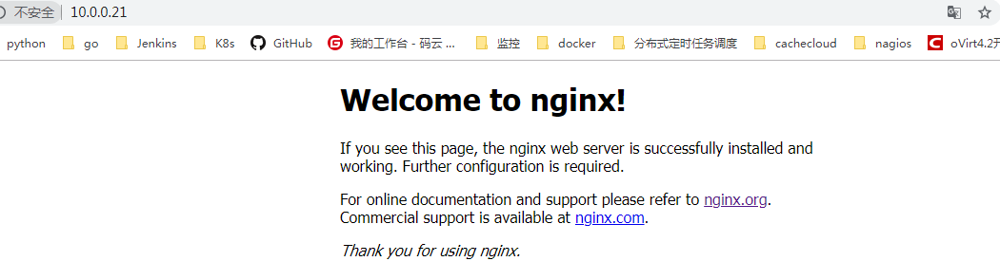
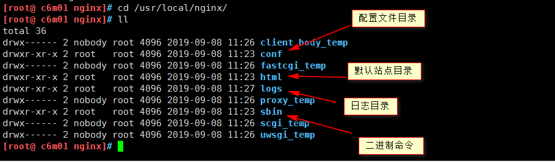
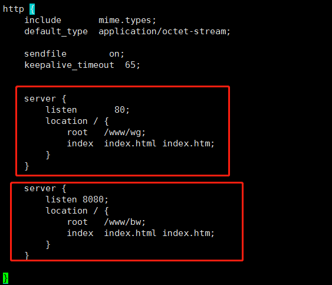

[TOC]


# 第九单元-Nginx


## 9.1 Nginx介绍

Nginx (engine x) 是一个轻量的，高性能的HTTP和反向代理服务器，也是一个IMAP/POP3/SMTP服务器。Nginx是由伊戈尔·赛索耶夫所研发，因它的稳定性、丰富的功能集、示例配置文件和低系统资源的消耗而闻名。

其特点是占有内存少，并发能力强， nginx的并发能力在同类型的网页服务器中表现较好，中国大陆使用nginx网站用户有：百度、京东、新浪、网易、腾讯、淘宝等。

在高连接并发的情况下，Nginx是Apache服务器不错的替代品。


**nginx和apache对比？？？**


## 9.2 编译安装nginx

### 9.2.1 环境介绍

系统：CentOS release 6.8 (Final)

内核：2.6.32-642.el6.x86_64

yum源：mirrors.aliyun.com

主机名：c6m01

IP地址：10.0.0.21

注意：安装前还原一下快照，保持系统的纯净。

### 9.2.2 安装依赖

```shell
[root@ c6m01 ~]# yum -y install gcc gcc-c++ pcre-devel openssl-devel wget
```

### 9.2.3 下载nginx包

```shell
[root@ c6m01 ~]# wget http://nginx.org/download/nginx-1.12.2.tar.gz
```

### 9.2.4 解压nginx包

```shell
[root@ c6m01 ~]# tar -zxvf nginx-1.12.2.tar.gz
```

### 9.2.5 切换目录

```shell
[root@ c6m01 ~]# cd nginx-1.12.2
```

### 9.2.6 配置和检测环境

```shell
[root@ c6m01 nginx-1.12.2]# ./configure --prefix=/usr/local/nginx
```

### 9.2.7 编译

```shell
[root@ c6m01 nginx-1.12.2]# make
```

### 9.2.8 编译安装

```shell
[root@ c6m01 nginx-1.12.2]# make install
```

### 9.2.9 做软链接

```shell
[root@ c6m01 nginx-1.12.2]# ln -sv /usr/local/nginx/sbin/nginx /usr/bin/nginx
```

### 9.2.10 启停及检查语法

```shell
[root@ c6m01 nginx-1.12.2]# nginx		#启动nginx

[root@ c6m01 nginx-1.12.2]# nginx -t		#检查语法
nginx: the configuration file /usr/local/nginx/conf/nginx.conf syntax is ok
nginx: configuration file /usr/local/nginx/conf/nginx.conf test is successful

[root@ c6m01 nginx-1.12.2]# ps -ef|grep nginx		#查看进程
root       4245      1  0 11:26 ?        00:00:00 nginx: master process nginx
nobody     4246   4245  0 11:26 ?        00:00:00 nginx: worker process
root       4250   1763  0 11:26 pts/3    00:00:00 grep --color=auto nginx

[root@ c6m01 nginx-1.12.2]# nginx -s stop		#停止nginx
[root@ c6m01 nginx-1.12.2]# ps -ef|grep nginx
root       4254   1763  0 11:27 pts/3    00:00:00 grep --color=auto nginx

[root@ c6m01 ~]# nginx -s reload		#当子配置文件发生变化，重新载入配置文件
```



## 9.3 目录结构和主要配置参数

**目录结构**



**主要配置参数**

```shell
[root@ c6m01 ~]# cat /usr/local/nginx/conf/nginx.conf

(1)user  nginx;  #配置运行nginx的用户
(2)worker_processes  2; #初始的子进程数量
(3)worker_connections  1024; #配置单个进程处理的最大请求连接数
(4)server{  #配置虚拟主机
(5)listen	#配置虚拟主机监听端口
(6)server_name #配置服务器域名
(7)location  匹配规则 { }   #配置匹配特定的url
(8)root   #配置网站根目录
(9)index  #配置虚拟主机的默认首页
(10)error_page  404              /404.html; #解释：当出现404的时候，要重定向到网站根目录下的404.html页面
}
```

**location匹配规则**

| =    | 开头表示精确匹配                                             |
| ---- | ------------------------------------------------------------ |
| ^~   | 开头表示 uri 以某个常规字符串开头，理解为匹配 url 路径即可。nginx 不对 url 做编码，因此请求为/static/20%/aa，可以被规则^~ /static/ /aa匹配到（注意是空格） |
| ~    | 开头表示区分大小写的正则匹配                                 |
| ~*   | 开头表示不区分大小写的正则匹配                               |
| /    | 通用匹配，任何请求都会匹配到                                 |


## 9.4 Nginx的虚拟主机

### 9.4.1 基于端口的虚拟主机

主配置文件/usr/local/nginx/conf/nginx.conf

```shell
server {
    listen       80;
    location / {
        root   /www/wg;
        index  index.html index.htm;
    }
}

server {
     listen 8080;
     location / {
         root   /www/bw;
         index  index.html index.htm;
     }
}
```




### 9.4.2 基于IP的虚拟主机

主配置文件/usr/local/nginx/conf/nginx.conf

```shell
server {
	listen 192.168.1.100:80; 
	location / {
	root /www/wg;
	index index.html;
	}
}


server {
	listen 192.168.1.110:80;
	location / {
	root /www/bw;
	index index.html;
	}
}
```


### 9.4.3 基于域名的虚拟主机

主配置文件/usr/local/nginx/conf/nginx.conf

```
server {
	listen 80;
	server_name www.wg.com;
	location / {
		root /www/wg;
	}
}

server {
	listen 80;
	server_name www.bw.com;
	location / {
		root /www/bw;
	}
}
```


## 9.5 访问认证配置

### 9.5.1 基于用户做访问控制

主配置文件/usr/local/nginx/conf/nginx.conf

```shell
server {
	listen 80; 
	server_name www.wg.com;
	location / {
		root /www/wg;
		index index.html index.htm;
		auth_basic  "Please input your name: ";	#访问控制
		auth_basic_user_file /usr/local/nginx/conf/nginxpasswd;
	}
} 


server { 
	listen 80;
	server_name www.rg.com;
	location / {
		root /www/bw;
		index index.html index.htm;
	}
}
```

生成认证文件：

```
useradd tom
htpasswd -c /usr/local/nginx/conf/nginxpasswd tom
```


### 9.5.2 基于IP的访问控制

```
server {
	listen 192.168.189.121:80;
	server_name www.wg.com;
	location / {
		root  /wg;
		index index.html;
		allow 192.168.189.1;  #allow允许某个ip地址或者网段访问
		deny all;		#deny 拒绝某个ip或者网段访问
		#备注：优先级自上而下，优先匹配上面的规则，其次是下面的规则
	}
}
```


