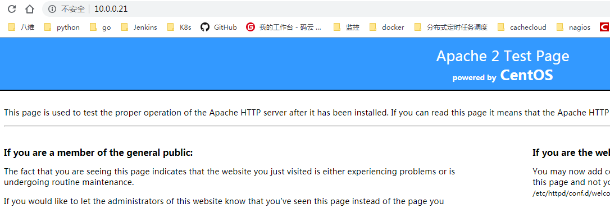
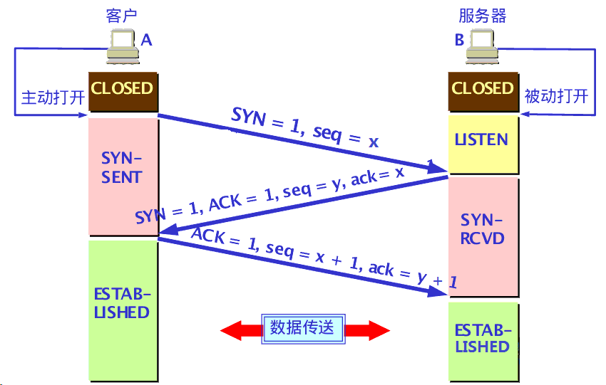
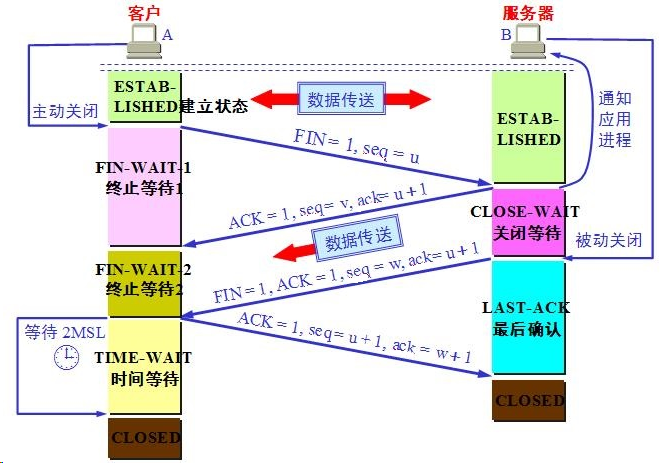

[TOC]


# 第五单元 Apache服务（一）

## 5.1 Web服务概述

WebService，顾名思义就是基于Web的服务。它使用HTTP方式，接收和响应外部系统的某种请求。从而实现远程调用.

**它如何工作？**

基础的 Web Services 平台是 XML + HTTP。

HTTP 协议是最常用的因特网协议。

XML 提供了一种可用于不同的平台和编程语言之间的语言。


### 5.1.1 WEB服务器默认端口

```
80
```


## 5.2 Apache安装配置

### 5.2.1 httpd简介

当今主流的开源Web服务器软件有`httpd(Apache),lighttpd,nginx,thttpd`等，而httpd是迄今为止使用量多的web服务器，据统计目前httpd的全球占有量是47%左右，虽然有所下降但是使用两仍然是最多的，统计web服务器使用率的网站是：`http://news.netcraft.com/httpd`。

**httpd工作的原理：**

httpd是Apache超文本传输协议（HTTP）服务器的主程序，被设计为一个独立运行的后台进程，它会建立一个处理请求的子进程或线程的池。

**httpd工作模型:**

```shell
高度模块化：DSO
MPM：Multipath Processing Module #多处理模块
prefork:一次一个进程响应一个请求
worker：一个进程生成多个线程，一个线程响应一个请求
event：基于事件驱动，一个进程响应多个请求  
```

### 5.2.2 安装Apache

软件包名和服务名都是：`httpd`

```shell
#安装
[root@ c6m01 pub]# yum -y install httpd		

#启动
[root@ c6m01 pub]# /etc/init.d/httpd start		
Starting httpd:
httpd: Could not reliably determine the server's fully qualified domain name, using 127.0.0.1 for ServerName
#以上问题需要编辑httpd.conf文件，搜索"#ServerName"，添加ServerName IP:80

#设置开机自启
[root@ c6m01 pub]# chkconfig httpd on		

#查看httpd进程
[root@ c6m01 pub]# ps -ef|grep httpd		

#查看httpd端口号
[root@ c6m01 pub]# ss -lntp|grep 80			
LISTEN     0      128                      :::80                      :::*      users:
```

### 5.2.3 httpd程序环境

| 文件/目录                  | 对应的功能   |
| -------------------------- | ------------ |
| /var/log/httpd/access.log  | 访问日志     |
| /var/log/httpd/error_log   | 错误日志     |
| /var/www/html/             | 站点目录     |
| /usr/lib64/httpd/modules/  | 模块文件路径 |
| /etc/httpd/conf/httpd.conf | 主配置文件   |
| /etc/httpd/conf.d/*.conf   | 辅助配置文件 |

### 5.2.4 常见配置及参数详解

```shell
vim /etc/httpd/conf/httpd.conf

ServerRoot "/etc/httpd"			#用于指定Apache运行的根目录
Listen 80						#监听80端口
MaxClients  256					#指定同时能访问服务器的客户机数量为256
DocumentRoot "/var/www/html"	#网页文件存放的目录
DirectoryIndex index.html index.html.var	#默认网站主页
Include conf.d/*.conf			#读取/etc/httpd/conf/conf.d/目录中所有以.conf结尾的文件
ServerName www.wg.com			#域名
ServerAdmin						#设置管理员的邮箱
Include conf.d/*.conf			#包含的子配置文件
User apache						#用户是apache
Group apache					#用户组是apache
Directory 						#认证授权和访问控制


##################################3
<IfModule prefork.c>     #当httpd服务使用的profork模型的时候：
 StartServers      10    #默认启动10个作业进程
 MinSpareServers    10    #空闲进程数不低于10个
 MaxSpareServers    20    #空闲进程数最大20个
 ServerLimit      256    #最多可以启动256个进程
 MaxClients       256    #最大并发客户端数为256个
 MaxRequestsPerChild 4000 #每个进程可以处理4000个请求，超过此数目进程被杀死并重新创建
</IfModule>


需要注意的是：ServerLimit最大值为20000个，并且：由于profork是单一线程的进程，所以每个进程在同一时间里仅能处理一个请求(也就是一个请求一个进程)，所以MaxClients的值要和ServerLimit一致。而且，profork的开销比较大，不过稳定性比较强。
```


## 5.3 客户端访问测试	

### 5.3.1 浏览器访问

httpd启动后，通过浏览器访问：http://10.0.0.21:80



​	

### 5.3.2 elinks命令

elinks指令是一个**纯文本格式**的浏览器，支持颜色、表格、鼠标、菜单操作。

此命令的适用范围：RedHat、RHEL、Ubuntu、CentOS、Fedora。

**1.安装**

```shell
yum -y install elinks
```

**2.以文本方式访问网站**

[root@localhost ~]# elinks http://10.0.0.21:80


### 5.3.3 ab 命令压力测试

 ApacheBench(即ab)通常用来做**网站性能压力测试**，是性能调优过程中必不可少的一环，ab命令会创建很多的并发访问线程，模拟多个访问者同时对某一URL地址进行访问。它的测试目标是基于URL的，因此，既可以用来测试Apache的负载压力，也可以测试nginx、lighthttp、tomcat、IIS等其它Web服务器的压力。

    ab命令对发出负载的计算机要求很低，既不会占用很高CPU，也不会占用很多内存，但却会给目标服务器造成巨大的负载，其原理类似CC攻击。自己测试使用也须注意，否则一次上太多的负载，可能造成目标服务器因资源耗完，严重时甚至导致死机。

ApacheBench参数说明

格式：ab [options] [http://]hostname[:port]/path
参数说明：

```
-n requests Number of requests to perform
//在测试会话中所执行的请求个数（本次测试总共要访问页面的次数）。默认时，仅执行一个请求。

-c concurrency Number of multiple requests to make
//一次产生的请求个数（并发数）。默认是一次一个。

-t timelimit Seconds to max. wait for responses
//测试所进行的最大秒数。其内部隐含值是-n 50000。它可以使对服务器的测试限制在一个固定的总时间以内。默认时，没有时间限制。

-p postfile File containing data to POST
//包含了需要POST的数据的文件，文件格式如“p1=1&p2=2”.使用方法是 -p 111.txt 。 （配合-T）

-T content-type Content-type header for POSTing
//POST数据所使用的Content-type头信息，如 -T “application/x-www-form-urlencoded” 。 （配合-p）

-v verbosity How much troubleshooting info to print
//设置显示信息的详细程度 – 4或更大值会显示头信息， 3或更大值可以显示响应代码(404, 200等), 2或更大值可以显示警告和其他信息。 -V 显示版本号并退出。

-w Print out results in HTML tables
//以HTML表的格式输出结果。默认时，它是白色背景的两列宽度的一张表。

-i Use HEAD instead of GET
// 执行HEAD请求，而不是GET。

-x attributes String to insert as table attributes //用来设置输出结果的表格的table属性
-y attributes String to insert as tr attributes //用来设置输出结果的表格的tr属性
-z attributes String to insert as td or th attributes //用来设置输出结果的表格的th属性

-C attribute Add cookie, eg. -C “c1=1234,c2=2,c3=3″ (repeatable)
//-C cookie-name=value 对请求附加一个Cookie:行。 其典型形式是name=value的一个参数对。此参数可以重复，用逗号分割。
提示：可以借助session实现原理传递 JSESSIONID参数， 实现保持会话的功能，如
-C ” c1=1234,c2=2,c3=3, JSESSIONID=FF056CD16DA9D71CB131C1D56F0319F8″ 。

-H attribute Add Arbitrary header line, eg. ‘Accept-Encoding: gzip’ Inserted after all normal header lines. (repeatable)

-A attribute Add Basic WWW Authentication, the attributes
are a colon separated username and password.

-P attribute Add Basic Proxy Authentication, the attributes
are a colon separated username and password.

//-P proxy-auth-username:password 对一个中转代理提供BASIC认证信任。用户名和密码由一个:隔开，并以base64编码形式发送。无论服务器是否需要(即, 是否发送了401认证需求代码)，此字符串都会被发送。

-X proxy:port Proxyserver and port number to use

-V Print version number and exit //打印版本号，然后退出

-k Use HTTP KeepAlive feature //使用http keepAlive 特性

-d Do not show percentiles served table.

-S Do not show confidence estimators and warnings.

-g filename Output collected data to gnuplot format file.

-e filename Output CSV file with percentages served

-h Display usage information (this message)
//-attributes 设置属性的字符串. 缺陷程序中有各种静态声明的固定长度的缓冲区。另外，对命令行参数、服务器的响应头和其他外部输入的解析也很简单，这可能会有不良后果。它没有完整地实现 HTTP/1.x; 仅接受某些’预想’的响应格式。 strstr(3)的频繁使用可能会带来性能问题，即你可能是在测试ab而不是服务器的性能。
```

参数很多，**一般我们用 -c 和 -n 参数就可以了**。例如:

```shell
[root@ c6m01 html]# echo 'hello world' >>/var/www/html/index.html		#手动创建一个html

[root@ c6m01 html]# ab -c 500 -n 1000 http://10.0.0.21:80/index.html	#测试
This is ApacheBench, Version 2.3 <$Revision: 655654 $>
Copyright 1996 Adam Twiss, Zeus Technology Ltd, http://www.zeustech.net/
Licensed to The Apache Software Foundation, http://www.apache.org/

Benchmarking 10.0.0.21 (be patient)
Completed 100 requests
Completed 200 requests
Completed 300 requests
Completed 400 requests
Completed 500 requests
Completed 600 requests
Completed 700 requests
Completed 800 requests
Completed 900 requests
Completed 1000 requests
Finished 1000 requests
```

### 5.3.4 pv uv 概念讲解

**PV(访问量)**： 即Page View, 即页面浏览量或点击量，用户每次刷新即被计算一次。

**UV(独立访客)**：即Unique Visitor,访问您网站的一台电脑客户端为一个访客。00:00-24:00内相同的客户端只被计算一次。

**扩展资料**
网站访问量的**衡量标准一个是独立IP（即UV）**，另一个是PV，常以日为标准，即日独立IP和日PV来计算。一台电脑上网即为一个独立IP。PV即Page View的缩写，即页面浏览量，一个独立IP可以产生多个PV，所以PV个数>=独立IP个数。
访问次数就相当于一个展览会的访问人次，某个参观者出入展馆10次的话，这10次都被记入访问次数中，相当于网络中的PV值。

独立访客数则相当于带身份证参观展览会的访问人数，每一个出示身份证参观展览的人，无论出入几次，都只计作一次独立访问。这里所说的“身份证”，在网络上就是访客的IP地址。


### 5.3.5 用户访问网站的完整流程

在浏览器输入想要访问的域名之后，浏览器会进行域名解析获得IP地址，在经过TCP的连接，实现数据的传输就会有两种报文，及请求报文和响应报文。最终才能实现通信。因此想要实现通信，就得先弄懂DNS的解析原理以及TCP连接通道的流程。

 

打开浏览器输入网址回车，到看到页面的过程
**理论内容：**
1、用户访问网站流程框架

2、DNS解析原理 

3、tcp/ip三次握手原理 

4、http协议原理（www服务的请求过程）请求报文细节！

5、大规模网站集群架构细节。

6、http协议原理（www服务的响应过程）响应报文细节！

7、tcp/ip四次挥手过程原理


**1. tcp/ip三次握手四次挥手原理**

**tcp/ip三次握手**




**tcp/ip四次挥手**




