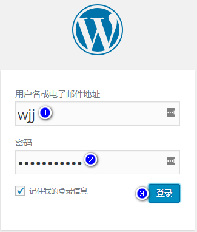

[TOC]


# 第八单元-源码搭建LAMP做博客项目(二)

## 8.1 centos下几种安装方式

### 8.1.1 yum安装

yum 仓库，网络yum源，资源比较丰富


### 8.1.2 rpm包安装

简单，快速，有依赖关系


### 8.1.3 源码包安装

安装步骤3步

安装所需要的编译工具gcc gcc-c++  cmake libtool ncurses-devel  perl glibc libxml2-devel libcurl-devel

1../configure  --prefix=绝对路径（指定安装的目录）  环境检测，Makefile 规则文件   

2.make		编译	  读取Makfile文件

3.make install  编译安装  

**源码包安装**

优点：

1.没有依赖关系

2.他可以跨平台

3.方便管理  

缺点：

1.安装比较麻烦

2.安装时间比较长


## 8.2 源码安装apache

**安装依赖**

```shell
yum -y install gcc gcc-c++
```


**编译安装**

```shell
cd到httpd源码包所在目录，解压源码包。

#解压源码包
tar -xvf httpd-2.2.9.tar.gz

#切换到httpd目录下
cd httpd-2.2.9

#让apache核心装载DSO,并指定安装目录为/usr/local/apache2
./configure --enable-so --prefix=/usr/local/apache2

#编译
make

#编译安装
make install

#启动apache
/usr/local/apache2/bin/apachectl start
/usr/local/apache2/bin/apachectl stop
```

**常用参数：**
--prefix=路径指定安装路径
--enable-so开启Apache加载扩展模块的功能

**Apache的工作目录/usr/local/apache2下面的主要目录**：
bin目录存放的是Apache的启动服务的脚本
conf目录存放的是Apache的配置文件
htdocs目录是Apache的默认网站根目录
logs目录存放的是Apaceh的访问日志和错误日志
modules目录存放的是Apache的相关模块文件


## 8.3 源码安装mysql

```shell
#安装依赖
yum install ncurses-devel libaio-devel cmake -y

tar -zvxf mysql-5.6.15.tar.gz
cd mysql-5.6.15

#执行环境检测并指定安装路径
cmake  -DCMAKE_INSTALL_PREFIX=/usr/local/mysql

#编译并编译安装
make && make install

#安装完毕之后生成配置文件
\cp /usr/local/mysql/support-files/my-default.cnf /etc/my.cnf

#新建mysql用户，不可登录操作系统
useradd -s /sbin/nologin mysql

#将所有mysql的相关文件所属组改为mysql用户
chown -R mysql.mysql  /usr/local/mysql

#初始化数据库
/usr/local/mysql/scripts/mysql_install_db --user=mysql --datadir=/usr/local/mysql/data --basedir=/usr/local/mysql

#生成mysql启动脚本，这样我们就可以使用service来启动服务
\cp /usr/local/mysql/support-files/mysql.server /etc/rc.d/init.d/mysqld

#并给启动脚本755权限
chmod 755 /etc/rc.d/init.d/mysqld

#为方便工作 做软链接
ln -sv /usr/local/mysql/bin/* /usr/local/sbin/

#启动mysql
service mysqld start

#修改数据库root账户密码
mysqladmin password 123456

#登录mysql测试
mysql -uroot -hlocalhost -p'123456'
```


## 8.4 源码安装php

1.安装依赖环境和库

```shell
yum -y install libjpeg-devel libpng-devel freetype-devel libxml2-devel libcurl-devel gcc gcc-c++ bzip2-devel openssl-devel
```


2.编译安装

```shell
进入解压目录里执行
tar zxf php-5.3.10.tar.gz
cd php-5.3.10

./configure --prefix=/usr/local/php \ #（指定安装路径） 
--with-apxs2=/usr/local/apache2/bin/apxs \ #（php和apache的连接） 
--with-gd --with-ttf \ #（连接freetype） 
--with-zlib-dir \ 
--with-jpeg-dir \
--with-png-dir \
--with-mysql=/usr/local/mysql #依次链接之前安装的各种软件

make
make install

#修改主配置文件名称/usr/local/php/etc/php.ini
cp php.ini-development   /usr/local/php/etc/php.ini 
```


## 8.5 配置Apache支持php动态网站

1.修改Apache配置文件：

```shell
vim /usr/local/apache2/conf/httpd.conf
#修改如下配置
DirectoryIndex index.php index.html    #支持php
AddType application/x-httpd-php .php   #支持php应用
```


2.重启apache

```
/usr/local/apache2/bin/apachectl -k restart 
```

3.编写php测试页面

```
rm -rf /usr/local/apache2/htdocs/*
vim /usr/local/apache2/htdocs/index.php
内容：
<?php
phpinfo();
?>
```


## 8.6 放置wordpress到站点目录

```shell
####配置wordpress####
#上传wordpress-4.9.4-zh_CN.zip并解压
unzip wordpress-4.9.4-zh_CN.zip
rm -rf /usr/local/apache2/htdocs/*
cp -a wordpress/* /usr/local/apache2/htdocs/
cd /usr/local/apache2/htdocs/
cp wp-config-sample.php wp-config.php
vim wp-config.php
// ** MySQL 设置 - 具体信息来自您正在使用的主机 ** //
/** WordPress数据库的名称 */
define('DB_NAME', 'wordpress');			#修改这里
 
/** MySQL数据库用户名 */
define('DB_USER', 'root');				#修改这里
 
/** MySQL数据库密码 */
define('DB_PASSWORD', '123456');		#修改这里为数据库密码
 
/** MySQL主机 */
define('DB_HOST', 'localhost');
```


然后浏览器访问：

http://10.0.0.21





