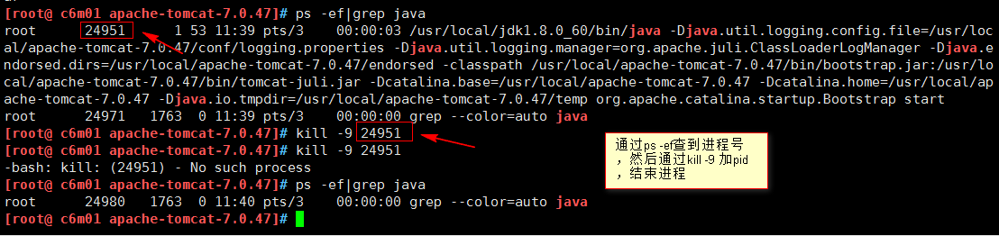
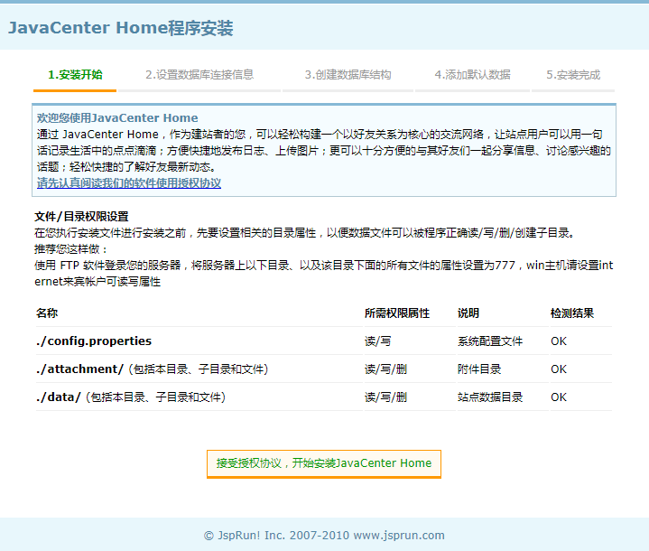
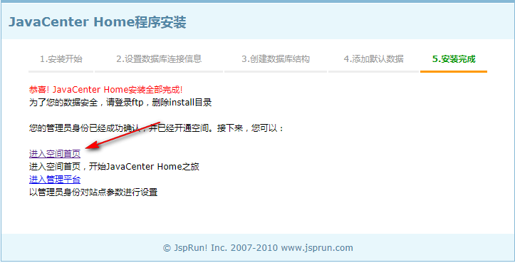

[TOC]


# 第十一单元-Tomcat


## 11.1 tomcat概述

### 11.1.1 什么是tomcat

Tomcat是Apache软件基金会（Apache Software Foundation）的Jakarta 项目中的一个核心项目，由Apache、Sun和其他一些公司及个人共同开发而成。

Tomcat服务器是一个免费的开放源代码的**Web应用服务器**，属于轻量级应用服务器，在中小型系统和并发访问用户不是很多的场合下被普遍使用，是开发和调试JSP程序的首选。

Tomcat和Nginx、Apache(httpd)、lighttpd等Web服务器一样，具有处理HTML页面的功能，另外它还是一个Servlet和JSP容器，独立的Servlet容器是Tomcat的默认模式。不过，Tomcat处理静态HTML的能力不如Nginx/Apache服务器。


### 11.1.2 tomcat默认支持网页格式

一般情况下，tomcat项目的默认页面为html、htm和jsp页面，但是我们的主页往往是动态的。


## 11.2 安装java运行环境

**1.上传jdk压缩包到服务器**


**2.解压jdk包到/usr/local/目录并修改属主属组**

```shell
tar -zxvf jdk-8u60-linux-x64.tar.gz -C /usr/local/
chown -R root.root /usr/local/jdk1.8.0_60
```


## 11.3 配置java环境变量

**1.添加到全局环境变量：**

```shell
vim /etc/profile

#添加以下几行
####java_env####
export JAVA_HOME=/usr/local/jdk1.8.0_60
export PATH=$JAVA_HOME/bin:$JAVA_HOME/jre/bin:$PATH
export CLASSPATH=.$CLASSPATH:$JAVA_HOME/lib:$JAVA_HOME/jre/lib:$JAVA_HOME/lib/tools.jar
```

**2.生效环境变量：**

```shell
source /etc/profile
```

**3.检查java是否安装成功：**

执行java -version，显示如下信息表示成功。

```shell
[root@ c6m01 jdk1.8.0_60]# java -version
java version "1.8.0_60"
Java(TM) SE Runtime Environment (build 1.8.0_60-b27)
Java HotSpot(TM) 64-Bit Server VM (build 25.60-b23, mixed mode)
```


## 11.4 tomcat安装

1.上传`apache-tomcat-7.0.47.tar.gz`到服务器


2.解压`apache-tomcat-7.0.47.tar.gz`到/opt目录

```
tar -zxvf apache-tomcat-7.0.47.tar.gz -C /usr/local/
```


## 11.5 tomcat配置详解

**（1）常用配置详解**

**目录结构及作用**

`cd /usr/local/apache-tomcat-7.0.47`到tomcat的目录可看到如下：

```
bin ：脚本文件目录。
conf：存放配置文件，最重要的是server.xml。
logs：存放日志文件。
lib ：仅对所有WEB APP可见，对TOMCAT不可见（使用Shared类加载器加载）。
temp：Tomcat运行时候存放临时文件用的。
webapps：web应用发布目录。
work：Tomcat把各种由jsp生成的servlet文件放在这个目录下。删除后，启动时会自动创建。
```


### 11.5.1 开启tomcat的命令

进入tomcat家目录，执行`./bin/startup.sh`

```
cd /usr/local/apache-tomcat-7.0.47
./bin/startup.sh
```


### 11.5.2 关闭tomcat的命令

**方法一：安全**

```
cd /usr/local/apache-tomcat-7.0.47
./bin/shutdown.sh
```


**方法二：简单粗暴-kill**

```shell
[root@ c6m01 apache-tomcat-7.0.47]# ps -ef|grep java	#查看进程，并定位到pid为25071
root      25071      1 70 09:18 pts/3    00:00:02 /usr/local/jdk1.8.0_60/bin/java -Djava.util.logging.config.file=/opt/apache-tomcat-7.0.47/conf/logging.properties -Djava.util.logging.manager=org.apache.juli.ClassLoaderLogManager -Djava.endorsed.dirs=/opt/apache-tomcat-7.0.47/endorsed -classpath /opt/apache-tomcat-7.0.47/bin/bootstrap.jar:/opt/apache-tomcat-7.0.47/bin/tomcat-juli.jar -Dcatalina.base=/opt/apache-tomcat-7.0.47 -Dcatalina.home=/opt/apache-tomcat-7.0.47 -Djava.io.tmpdir=/opt/apache-tomcat-7.0.47/temp org.apache.catalina.startup.Bootstrap start
root      25091   1767  0 09:19 pts/3    00:00:00 grep --color=auto java

[root@ c6m01 apache-tomcat-7.0.47]# kill -9 25071		#通过kill，强制结束进程

[root@ c6m01 apache-tomcat-7.0.47]# ps -ef|grep java
root      25093   1767  0 09:19 pts/3    00:00:00 grep --color=auto java
```




### 11.5.3 Tomcat 服务默认端口号

默认端口为8080

查看tomcat端口

```shell
[root@ c6m01 apache-tomcat-7.0.47]# ps -ef|grep java
root      25115      1 31 09:23 pts/3    00:00:02 /usr/local/jdk1.8.0_60/bin/java -Djava.util.logging.config.file=/opt/apache-tomcat-7.0.47/conf/logging.properties -Djava.util.logging.manager=org.apache.juli.ClassLoaderLogManager -Djava.endorsed.dirs=/opt/apache-tomcat-7.0.47/endorsed -classpath /opt/apache-tomcat-7.0.47/bin/bootstrap.jar:/opt/apache-tomcat-7.0.47/bin/tomcat-juli.jar -Dcatalina.base=/opt/apache-tomcat-7.0.47 -Dcatalina.home=/opt/apache-tomcat-7.0.47 -Djava.io.tmpdir=/opt/apache-tomcat-7.0.47/temp org.apache.catalina.startup.Bootstrap start
root      25135   1767  0 09:23 pts/3    00:00:00 grep --color=auto java


[root@ c6m01 apache-tomcat-7.0.47]# ss -lntp|grep 25115
LISTEN     0      1          ::ffff:127.0.0.1:8005                    :::*      users:(("java",25115,49))
LISTEN     0      100                      :::8009                    :::*      users:(("java",25115,47))
LISTEN     0      100                      :::8080                    :::*      users:(("java",25115,46))

```


**修改tomcat端口为8888**

```
cd /usr/local/apache-tomcat-7.0.47/conf
vim +70 server.xml
#修改如下
<Connector port="8888" protocol="HTTP/1.1"

```

**重启tomcat**

```
/usr/local/apache-tomcat-7.0.47/bin/shutdown.sh
/usr/local/apache-tomcat-7.0.47/bin/shutdown.sh
```


### 11.5.4 浏览器访问

http://10.0.0.21:8080/


### 11.5.5 默认首页

```
index.jsp
```


## 11.6 安装论坛

1.上传论坛安装包和数据库连接tomcat的jar包到服务器


2.安装数据库启动mysql

```shell
yum install mysql mysql-server -y
service mysqld start
```


3.将mysql连接tomcat的包解压

```
tar -zvxf mysql-connector-java-5.1.21.tar.gz
```

进入目录并复制

```
cd mysql-connector-java-5.1.21
cp mysql-connector-java-5.1.21-bin.jar /opt/tomcat01/lib/
```


4.解压论坛安装包

```
unzip JavaCenter_Home_Source_UTF8.zip
```

复制网站文件到tomcat01的网站根目录下

```shell
rm -rf /opt/tomcat01/webapps/*
mkdir -p /opt/tomcat01/webapps/ROOT/
cp -a JavaCenter_Home_2.0_Source_UTF8/source/WebRoot/* /opt/tomcat01/webapps/ROOT/
```


5.重启一下tomcat

```
/opt/tomcat01/bin/shutdown.sh
/opt/tomcat01/bin/startup.sh
```


6.浏览器访问

http://10.0.0.21:18080/install








