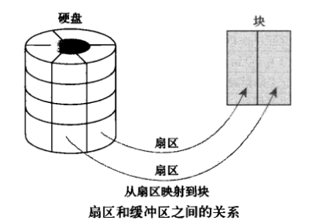

[TOC]


# 第十七单元-系统监控命令


## watch--监测一个命令的运行结果

在Linux下，watch是周期性的执行下个程序，并全屏显示执行结果。

**1．命令格式：**

```shell
watch[参数][命令]
```

**2．命令功能：**

可以将命令的输出结果输出到标准输出设备，多用于周期性执行命令/定时执行命令

**3．命令参数：**

```shell
-n或--interval  watch缺省每2秒运行一下程序，可以用-n或-interval来指定间隔的时间。

-d或--differences  用-d或--differences 选项watch 会高亮显示变化的区域。 而-d=cumulative选项会把变动过的地方(不管最近的那次有没有变动)都高亮显示出来。

-t 或-no-title  会关闭watch命令在顶部的时间间隔,命令，当前时间的输出。
```

**4．使用实例：**

**实例1：每隔一秒高亮显示网络链接数的变化情况**

```shell
watch -n 1 -d ss -ant
```

**实例2：3秒一次输出系统的平均负载**

```
watch -n 3 'cat /proc/loadavg'
```


## free--显示系统内存的使用情况

显示系统内存的使用情况，包括物理内存、交换内存(swap)和内核缓冲区内存。
显示系统内核使用的缓冲区,包括缓冲(buffer)和缓存(cache)等。

查看free参数

```shell
[root@localhost ~]# free --help

Usage:
 free [options]

Options:
 -b, --bytes         show output in bytes
 -k, --kilo          show output in kilobytes
 -m, --mega          show output in megabytes
 -g, --giga          show output in gigabytes
     --tera          show output in terabytes
 -h, --human         show human-readable output
     --si            use powers of 1000 not 1024
 -l, --lohi          show detailed low and high memory statistics
 -t, --total         show total for RAM + swap
 -s N, --seconds N   repeat printing every N seconds
 -c N, --count N     repeat printing N times, then exit
 -w, --wide          wide output
```

使用 -s 选项并指定间隔的秒数：


输出简介
下面先解释一下输出的内容：

```
Mem 	行(第二行)是内存的使用情况。
Swap 	行(第三行)是交换空间的使用情况。
total 	列显示系统总的可用物理内存和交换空间大小。
used 	列显示已经被使用的物理内存和交换空间。
free 	列显示还有多少物理内存和交换空间可用使用。
shared 	列显示被共享使用的物理内存大小。
buff/cache 	列显示被 buffer 和 cache 使用的物理内存大小。
available 	列显示还可以被应用程序使用的物理内存大小。
```

补冲：

**1.buff/cache**

先来提一个问题： buffer 和 cache 应该是两种类型的内存，但是 free 命令为什么会把它们放在一起呢？要回答这个问题需要我们做些准备工作。让我们先来搞清楚 buffer 与 cache 的含义。

**buffer** 在操作系统中指 buffer cache， 中文一般翻译为 "缓冲区"。要理解缓冲区，必须明确另外两个概念："扇区" 和 "块"。扇区是设备的最小寻址单元，也叫 "硬扇区" 或 "设备块"。块是操作系统中文件系统的最小寻址单元，也叫 "文件块" 或 "I/O 块"。每个块包含一个或多个扇区，但大小不能超过一个页面，所以一个页可以容纳一个或多个内存中的块。当一个块被调入内存时，它要存储在一个缓冲区中。每个缓冲区与一个块对应，它相当于是磁盘块在内存中的表示(下图来自互联网)：



注意，buffer cache 只有块的概念而没有文件的概念，它只是把磁盘上的块直接搬到内存中而不关心块中究竟存放的是什么格式的文件。

**cache** 在操作系统中指 page cache，中文一般翻译为 "页高速缓存"。页高速缓存是内核实现的磁盘缓存。它主要用来减少对磁盘的 I/O 操作。具体地讲，是通过把磁盘中的数据缓存到物理内存中，把对磁盘的访问变为对物理内存的访问。页高速缓存缓存的是内存页面。**缓存中的页来自对普通文件、块设备文件(这个指的就是 buffer cache 呀)和内存映射文件的读写**。
页高速缓存对普通文件的缓存我们可以这样理解：当内核要读一个文件(比如 /etc/hosts)时，它会先检查这个文件的数据是不是已经在页高速缓存中了。如果在，就放弃访问磁盘，直接从内存中读取。这个行为称为缓存命中。如果数据不在缓存中，就是未命中缓存，此时内核就要调度块 I/O 操作从磁盘去读取数据。然后内核将读来的数据放入页高速缓存中。这种缓存的目标是文件系统可以识别的文件(比如 /etc/hosts)。
页高速缓存对块设备文件的缓存就是我们在前面介绍的 buffer cahce。因为独立的磁盘块通过缓冲区也被存入了页高速缓存(缓冲区最终是由页高速缓存来承载的)。

到这里我们应该搞清楚了：无论是缓冲区还是页高速缓存，它们的实现方式都是一样的。缓冲区只不过是一种概念上比较特殊的页高速缓存罢了。
那么为什么 free 命令不直接称为 cache 而非要写成 buff/cache？ 这是因为缓冲区和页高速缓存的实现并非天生就是统一的。在 linux 内核 2.4 中才将它们统一。更早的内核中有两个独立的磁盘缓存：页高速缓存和缓冲区高速缓存。前者缓存页面，后者缓存缓冲区。当你知道了这些故事之后，输出中列的名称可能已经不再重要了。

**2.free 与 available**

在 free 命令的输出中，有一个 free 列，同时还有一个 available 列。这二者到底有何区别？
free 是真正尚未被使用的物理内存数量。至于 available 就比较有意思了，它是从应用程序的角度看到的可用内存数量。Linux 内核为了提升磁盘操作的性能，会消耗一部分内存去缓存磁盘数据，就是我们介绍的 buffer 和 cache。所以对于内核来说，buffer 和 cache 都属于已经被使用的内存。当应用程序需要内存时，如果没有足够的 free 内存可以用，内核就会从 buffer 和 cache 中回收内存来满足应用程序的请求。所以从应用程序的角度来说，**available  = free + buffer + cache**。请注意，这只是一个很理想的计算方式，实际中的数据往往有较大的误差。

**3.交换空间(swap space)**

swap space 是磁盘上的一块区域，可以是一个分区，也可以是一个文件。所以具体的实现可以是 swap 分区也可以是 swap 文件。当系统物理内存吃紧时，Linux 会将内存中不常访问的数据保存到 swap 上，这样系统就有更多的物理内存为各个进程服务，而当系统需要访问 swap 上存储的内容时，再将 swap 上的数据加载到内存中，这就是常说的换出和换入。交换空间可以在一定程度上缓解内存不足的情况，但是它需要读写磁盘数据，所以性能不是很高。

现在的机器一般都不太缺内存，如果系统默认还是使用了 swap 是不是会拖累系统的性能？

理论上是的，但实际上可能性并不是很大。并且内核提供了一个叫做 swappiness 的参数，用于配置需要将内存中不常用的数据移到 swap 中去的紧迫程度。这个参数的取值范围是 0～100，0 告诉内核尽可能的不要将内存数据移到 swap 中，也即只有在迫不得已的情况下才这么做，而 100 告诉内核只要有可能，尽量的将内存中不常访问的数据移到 swap 中。在 ubuntu 系统中，swappiness 的默认值是 60。如果我们觉着内存充足，可以在 /etc/sysctl.conf 文件中设置 swappiness：

```
vm.swappiness=10
```

如果系统的内存不足，则需要根据物理内存的大小来设置交换空间的大小。


## mpstat--查看特定CPU的信息

mpstat是 Multiprocessor Statistics的缩写，是实时系统监控工具。其报告与CPU的一些统计信息，这些信息存放在/proc/stat文件中。在多CPU系统里，其不但能查看所有CPU的平均状况信息，而且能够查看特定CPU的信息。

mpstat的语法如下：

```
mpstat [-P {|ALL}] [internal [count]]
```

参数 含义
-P {cpu l ALL} 表示监控哪个CPU， cpu在[0,cpu个数-1]中取值
internal 相邻的两次采样的间隔时间
count 采样的次数，count只能和delay一起使用

示例：

1.直接使用mpstat命令：

```
mpstat
```

当mpstat不带参数时，输出为从系统启动以来的平均值。


2.使用mpstat -P ALL 5 2命令

```
mpstat -P ALL 5 2
```

表示每5秒产生一个报告，总共产生2个。


**输出参数含义**

当没有参数时，mpstat则显示系统启动以后所有信息的平均值。有interval时，第一行的信息自系统启动以来的平均信息。从第二行开始，输出为前一个interval时间段的平均信息。

输出各参数含义：

```csharp
参数  释义  从/proc/stat获得数据
CPU 处理器ID   
%usr    在internal时间段里，用户态的CPU时间（%），不包含 nice值为负进程    usr/total*100
%nice   在internal时间段里，nice值为负进程的CPU时间（%）    nice/total*100
%sys    在internal时间段里，核心时间（%）   system/total*100
%iowait 在internal时间段里，硬盘IO等待时间（%）   iowait/total*100
%irq    在internal时间段里，硬中断时间（%）  irq/total*100
%soft   在internal时间段里，软中断时间（%）  softirq/total*100
%steal  显示虚拟机管理器在服务另一个虚拟处理器时虚拟CPU处在非自愿等待下花费时间的百分比   steal/total*100
%guest  显示运行虚拟处理器时CPU花费时间的百分比   guest/total*100
%gnice      gnice/total*100
%idle   在internal时间段里，CPU除去等待磁盘IO操作外的因为任何原因而空闲的时间闲置时间（%）    idle/total*100
```


## iostat--IO实时监控

iostat主要用于监控系统设备的IO负载情况，iostat首次运行时显示自系统启动开始的各项统计信息，之后运行iostat将显示自上次运行该命令以后的统计信息。用户可以通过指定统计的次数和时间来获得所需的统计信息。


**用法**：iostat [ 选项 ] [ <时间间隔> [ <次数> ]]

常用选项说明：

-c 仅显示CPU统计信息.与-d选项互斥.

-d 仅显示磁盘统计信息.与-c选项互斥.

-k 以K为单位显示每秒的磁盘请求数,默认单位块.

-p device | ALL
  与-x选项互斥,用于显示块设备及系统分区的统计信息.也可以在-p后指定一个设备名

-x:输出更详细的io设备统计信息

interval/count：每次输出间隔时间，count表示输出次数，不带count表示循环输出

说明：更多选项使用使用`man iostat`查看

**常用实例**

1、iostat，结果为从系统开机到当前执行时刻的统计信息


输出含义：

    avg-cpu: 总体cpu使用情况统计信息，对于多核cpu，这里为所有cpu的平均值。重点关注iowait值，表示CPU用于等待io请求的完成时间。
    
    Device: 各磁盘设备的IO统计信息。各列含义如下：
    Device: 以sdX形式显示的设备名称
    tps: 每秒进程下发的IO读、写请求数量
    KB_read/s: 每秒从驱动器读入的数据量，单位为K。
    KB_wrtn/s: 每秒从驱动器写入的数据量，单位为K。
    KB_read: 读入数据总量，单位为K。
    KB_wrtn: 写入数据总量，单位为K。

2、iostat -x -k -d 1 2。每隔1S输出磁盘IO的详细详细，总共采样2次。


以上各列的含义如下：

```
rrqm/s: 每秒对该设备的读请求被合并次数，文件系统会对读取同块(block)的请求进行合并
wrqm/s: 每秒对该设备的写请求被合并次数
r/s: 每秒完成的读次数
w/s: 每秒完成的写次数
rkB/s: 每秒读数据量(kB为单位)
wkB/s: 每秒写数据量(kB为单位)
avgrq-sz:平均每次IO操作的数据量(扇区数为单位)
avgqu-sz: 平均等待处理的IO请求队列长度
await: 平均每次IO请求等待时间(包括等待时间和处理时间，毫秒为单位)
svctm: 平均每次IO请求的处理时间(毫秒为单位)
%util: 采用周期内用于IO操作的时间比率，即IO队列非空的时间比率
```

 **重点关注参数**

1、iowait% 表示CPU等待IO时间占整个CPU周期的百分比，如果iowait值超过50%，或者明显大于%system、%user以及%idle，表示IO可能存在问题。

2、avgqu-sz 表示磁盘IO队列长度，即IO等待个数。

3、await 表示每次IO请求等待时间，包括等待时间和处理时间

4、svctm 表示每次IO请求处理的时间

5、%util 表示磁盘忙碌情况，一般该值超过80%表示该磁盘可能处于繁忙状态。


## netstat--显示网络连接情况

`netstat`命令用于显示与`IP、TCP、UDP和ICMP`协议相关的统计数据，一般用于检验本机各端口的网络连接情况。`netstat`是在内核中访问网络及相关信息的程序，它能提供`TCP连接，TCP和UDP`监听，进程内存管理的相关报告。

`netstat`参数虽然很多，但是常用的不多，主要是下面几个参数：

netstat -[atunlp]

```
-a ：all，表示列出所有的连接，服务监听，Socket资料
-t ：tcp，列出tcp协议的服务
-u ：udp，列出udp协议的服务
-n ：port number， 用端口号来显示
-l ：listening，列出当前监听服务
-p ：program，列出服务程序的PID
-i ：显示网卡列表
-r ：显示路由信息
-s ：显示网络统计
-e ：显示关于以太网的统计数据
```


1.列出所有端口 (包括监听和未监听的)

列出所有端口 netstat -a 

```
netstat -a | more
```

列出所有 tcp 端口 netstat -at 

```
netstat -at
```

列出所有 udp 端口 netstat -at 

```
netstat -au
```


2.列出所有处于监听状态的 Sockets

只显示监听端口

```
netstat -l
```

只列出所有监听 tcp 端口

```
netstat -lt
```

只列出所有监听 udp 端口

```
netstat -lu
```

只列出所有监听 UNIX 端口

```
netstat -lx
```

3.显示每个协议的统计信息

显示所有端口的统计信息 netstat -s 

```
netstat -s
```

显示 TCP 或 UDP 端口的统计信息 netstat -st 或 -su

```
netstat -st
netstat -su
```

4.在 netstat 输出中显示 PID 和进程名称 netstat -p 

netstat -p 可以与其它开关一起使用，就可以添加 “PID/进程名称” 到 netstat 输出中，这样 debugging 的时候可以很
方便的发现特定端口运行的程序。 

```
netstat -pt
```

5.在 netstat 输出中不显示主机，端口和用户名 (host, port or user) 
当你不想让主机，端口和用户名显示，使用 netstat -n。将会使用数字代替那些名称。 
同样可以加速输出，因为不用进行比对查询。 

```
netstat -an
```


## ip--网络配置管理的工具

`ip`是用来替代`ifconfig`进行`linux`系统网络配置管理的工具。但要强力的多，它有许多新功能。`ip` 命令完成很多 `ifconfig` 命令无法完成的任务。

`ip`命令属于`iproute`软件包。


**案例 1：检查网卡信息**
检查网卡的诸如 IP 地址，子网等网络信息，使用 ip addr show 命令：

```shell
[root@ localhost ~]#  ip addr show
或
[root@ localhost ~]# ip a s
```

如果你想查看某块网卡的信息，则命令为：

```shell
[root@ localhost ~]# ip a s ens33
```


**案例 2：启用/禁用网卡**

```shell
#启用网卡
[root@ localhost ~]# ip link set ens33 up

#禁用网卡
[root@ localhost ~]# ip link set ens33 down
```


**案例 3：为网卡分配 IP 地址以及其他网络信息**

要为网卡分配 IP 地址，我们使用下面命令：

```
[root@ localhost ~]# ip addr add 192.168.0.50/255.255.255.0 dev ens33
```

也可以使用 `ip` 命令来设置广播地址。默认是没有设置广播地址的，设置广播地址的命令为：

```
[root@ localhost ~]#  ip addr add broadcast 192.168.0.255 dev ens33
```

我们也可以使用下面命令来根据 IP 地址设置标准的广播地址：

```
[root@ localhost ~]#  ip addr add 192.168.0.10/24 brd + dev ens33
```

如上面例子所示，我们可以使用 `brd` 代替 `broadcast` 来设置广播地址。


**案例 4：删除网卡中配置的 IP 地址**

若想从网卡中删掉某个 IP，使用如下 `ip` 命令：

```
[root@ localhost ~]# ip addr del 192.168.0.10/24 dev ens33
```


**案例 5：为网卡添加别名（假设网卡名为 ens33）**

添加别名，即为网卡添加不止一个 IP，执行下面命令：

```
[root@ localhost ~]#  ip addr add 192.168.0.20/24 dev ens33 label ens33:1
```


**案例 6：检查路由/默认网关的信息**

查看路由信息会给我们显示数据包到达目的地的路由路径。要查看网络路由信息，执行下面命令：

```
[root@ localhost ~]# ip route show
```

在上面输出结果中，我们能够看到所有网卡上数据包的路由信息。我们也可以获取特定 IP 的路由信息，方法是：

```
[root@ localhost ~]# ip route get 192.168.0.1
```


**案例 7：添加静态路由**

我们也可以使用 IP 来修改数据包的默认路由。方法是使用 `ip route` 命令：

```
[root@ localhost ~]# ip route add default via 192.168.0.150/24
```

这样所有的网络数据包通过 `192.168.0.150` 来转发，而不是以前的默认路由了。若要修改某个网卡的默认路由，执行：

```
[root@ localhost ~]# ip route add 172.16.32.32 via 192.168.0.150/24 dev ens33
```


**案例 8：删除默认路由**

要删除之前设置的默认路由，打开终端然后运行：

```
[root@ localhost ~]# ip route del 192.168.0.150/24
```

**注意：** 用上面方法修改的默认路由只是临时有效的，在系统重启后所有的改动都会丢失。要永久修改路由，需要修改或创建 `route-ens33文件。将下面这行加入其中：

```
[root@ localhost ~]# vi /etc/sysconfig/network-scripts/route-ens33172.16.32.32 via 192.168.0.150/24 dev ens33
```


