[TOC]


# 第十六单元-zabbix


## 16.1 创建主机

### 16.1.1 创建主机前提及步骤

**新增一台服务器10.0.0.42（安装zabbix-agent）**

**1.配置zabbix源**

```shell
rpm -ivh https://mirrors.aliyun.com/zabbix/zabbix/3.5/rhel/7/x86_64/zabbix-release-3.5-1.el7.noarch.rpm
yum clean all
```

**2.安装zabbix-agent**

```shell
yum -y install zabbix-agent
```

**3.修改zabbix-agent配置并重启**

```shell
[root@localhost ~]# egrep -v '^$|^#' /etc/zabbix/zabbix_agentd.conf
PidFile=/var/run/zabbix/zabbix_agentd.pid
LogFile=/var/log/zabbix/zabbix_agentd.log
LogFileSize=0
Server=10.0.0.41		#修改此处为zabbix-server的ip
ServerActive=10.0.0.41	#修改此处为zabbix-server的ip
Hostname=apache			#自己定义，一般和主机名相同
Include=/etc/zabbix/zabbix_agentd.d/*.conf

systemctl enable zabbix-agent
systemctl restart zabbix-agent
```


**4.在zabbix-server服务端（10.0.0.41）测试，是否可以获取键值。**

(1) 安装zabbix-get工具

```
yum -y install zabbix-get
```

(2) 通过zabbix_get命令测试键值

```
zabbix_get -s 10.0.0.42 -p 10050 -k "system.cpu.load[all,avg15]"
```

有数值出现，表示zabbix-server监控端可以获取zabbix-agent被监控端的数据，即可通过web界面去添加新增的被监控主机。


**5.在zabbix的web界面添加主机**

configuration（配置）–>Hosts（主机）–>Create host（创建主机）

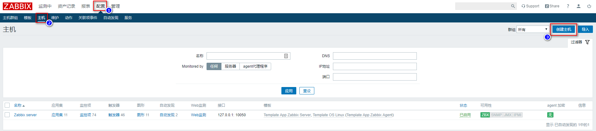


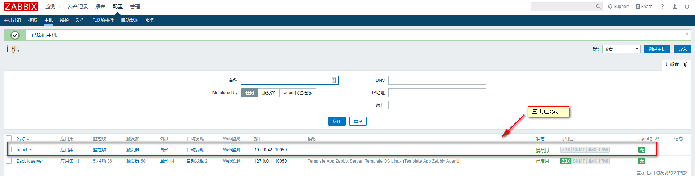


### 16.1.2 为主机链接监控模板


**链接监控模板Template OS Linux**

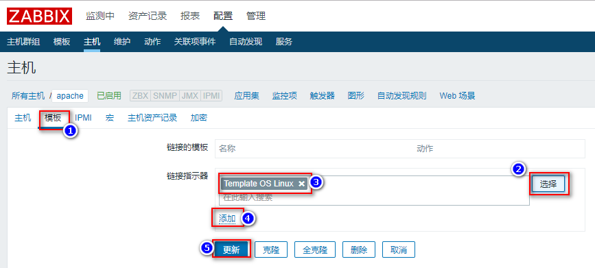

注意：此处一定要点添加后，进行更新，否则模板链接不上。

刷新浏览器，然后等待几十秒，即可看到可用性ZBX变为绿色。


### 16.1.3 为主机添加监控项


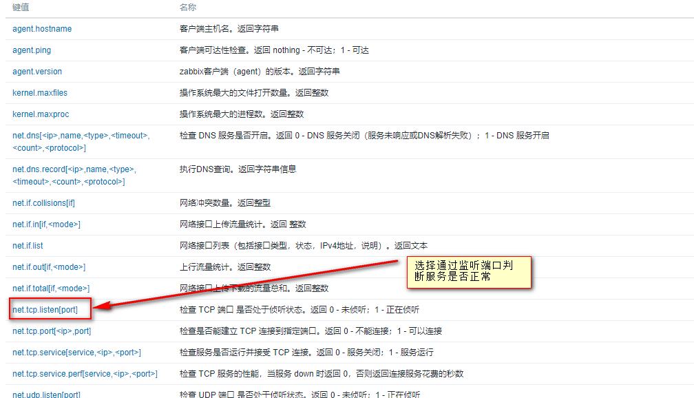


然后通过zabbix-get测试键值是否可以获取到数据，此操作在zabbix-server服务端进行。

```
zabbix_get -s 10.0.0.42 -k net.tcp.listen[80]
0
```

若返回值是1的话，说明Apache端口正在监听，也就是httpd服务是运行。
若返回值是0的话，说明Apache端口没有监听，也就是httpd服务是未运行。


### 16.1.4 为监控项添加触发器


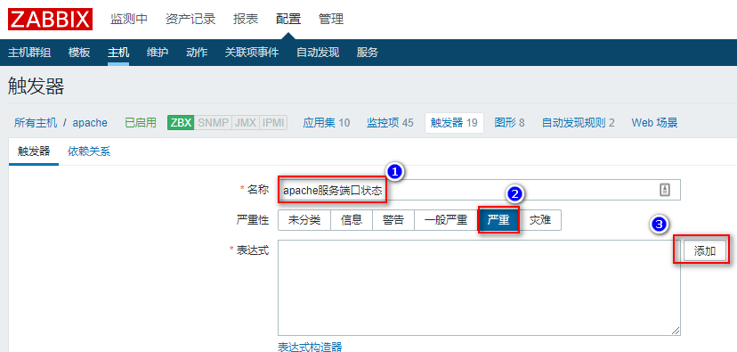


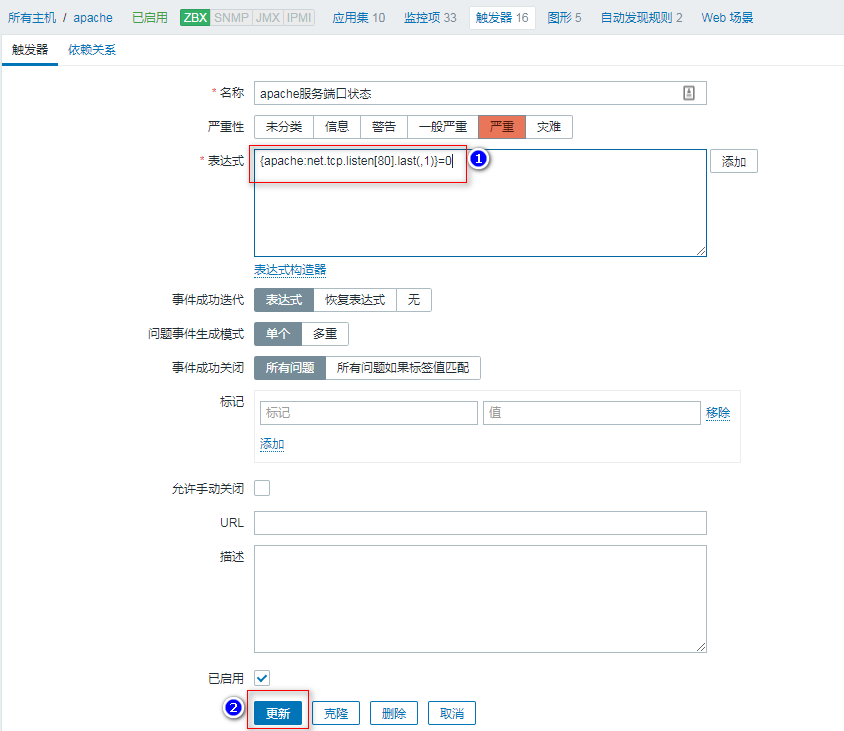


### 16.1.5 为监控项添加图形

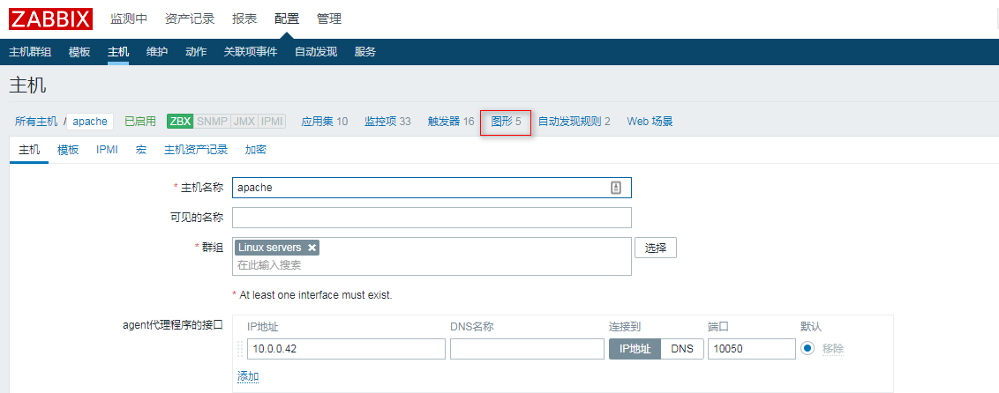


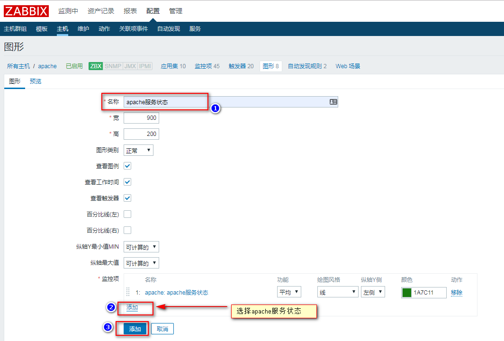


### 16.1.6 查看监控图形

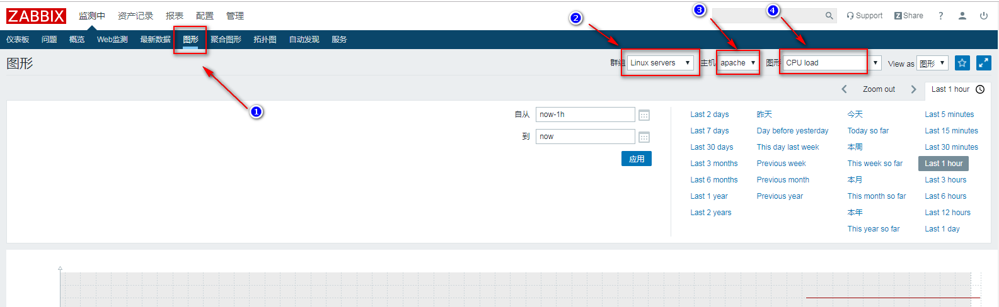


### 16.1.7 解决zabbix图形中文显示乱码

**1.中文乱码**

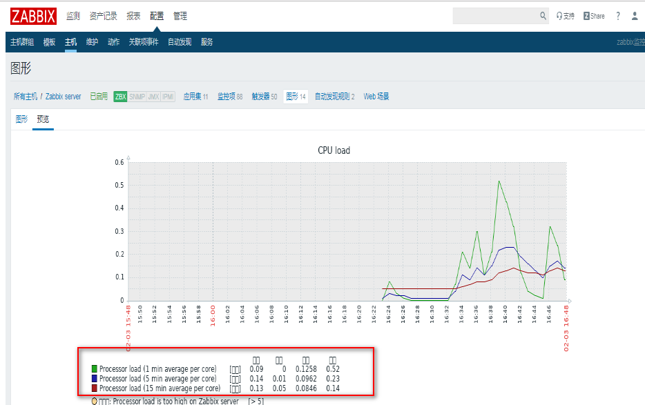


**2.将windows目录C:\Windows\Fonts\楷体 常规 拷贝到/usr/share/zabbix/fonts/下**

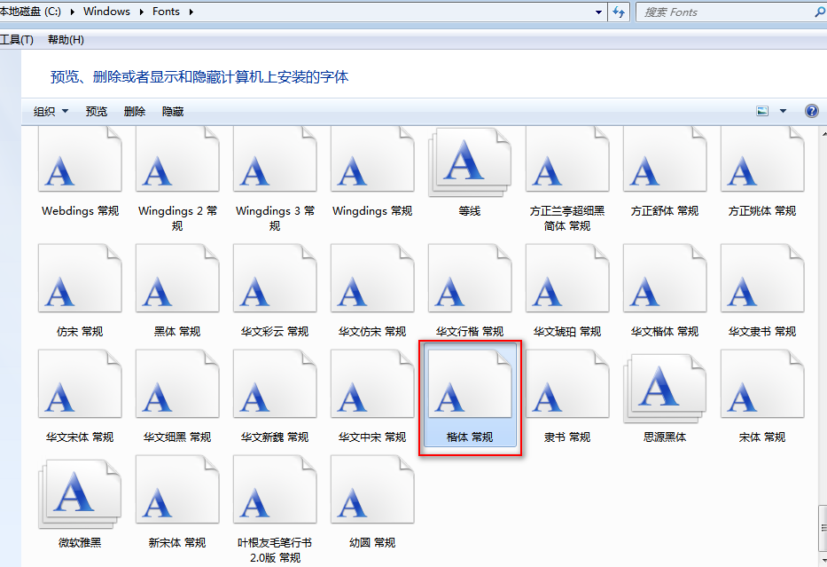


windows10系统，需要将上传的楷体常规字体SIMKAI.TTF，改名为小写simkai.ttf

```
mv SIMKAI.TTF simkai.ttf
```

**3.修改配置文件defines.inc.php**

```shell
vim /usr/share/zabbix/include/defines.inc.php

define('ZBX_GRAPH_FONT_NAME',           'simkai');   #修改此处为msyh
define('ZBX_FONT_NAME', 'simkai');		#修改此处为msyh
```

**4.刷新网页**


### 16.1.8 打开zabbix前端报警


## 16.2 监控apache端口

通过监控apache默认端口80，来判断服务是否正常。

创建监控项：

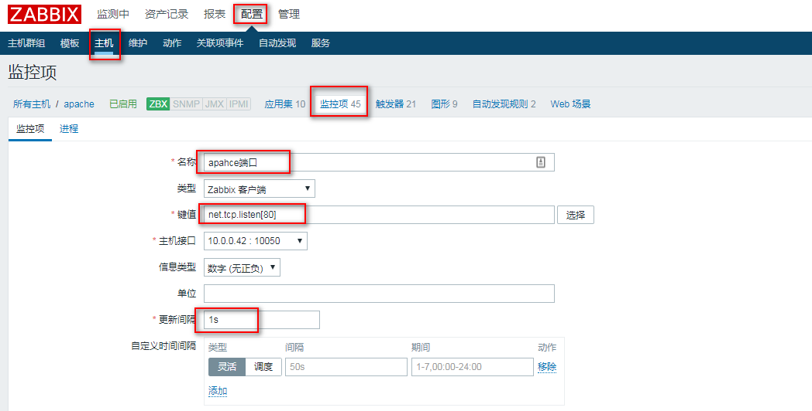

创建触发器：


创建监控项的图形：


## 16.3 监控网卡流量


## 16.4 配置邮件、微信报警

**注意：发送邮件微信报警的前提是能连外网。**


### 16.4.1 配置邮件报警（服务端配置）

**1．解压sendmail程序的压缩包，并复制到/usr/local/bin**

```
tar -zxvf sendEmail-v1.56.tar.gz
cp sendEmail-v1.56/sendEmail /usr/local/bin/
```

**2.上传sendEmail.sh到服务器并增加可执行权限**

```
cp sendEmail.sh /usr/lib/zabbix/alertscripts
chmod -R 777 /usr/lib/zabbix/alertscripts/sendEmail.sh
```

**3.编辑脚本，将绑定的邮箱地址和密码写上**

```
vim  /usr/lib/zabbix/alertscripts/sendEmail.sh
```

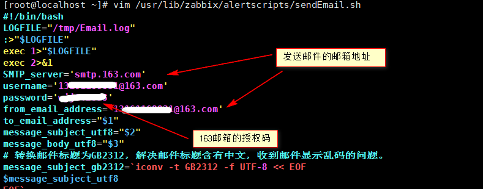

设置163邮箱授权码


**4.测试脚本**

```
sh /usr/lib/zabbix/alertscripts/sendEmail.sh  接收邮件的邮箱  标题 内容
```

去邮箱查看是否收到了邮件


**5. zabbix创建报警媒介**

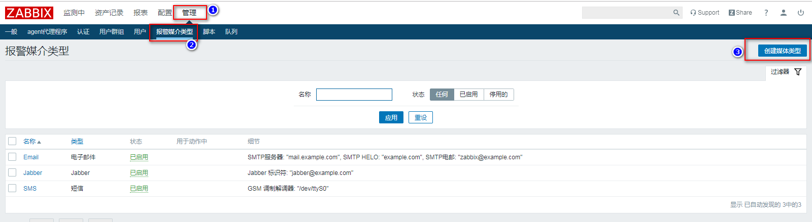


```
名称：sendmail

类型：脚本

脚本名称：sendEmail.sh

脚本参数：       //新增以下三个参数

{ALERT.SENDTO}

{ALERT.SUBJECT}

{ALERT.MESSAGE}
```


**关联报警用户和媒介**


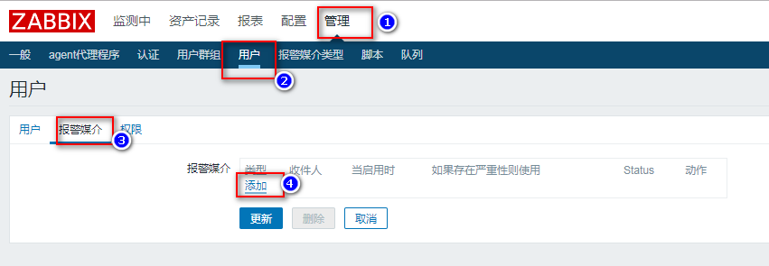


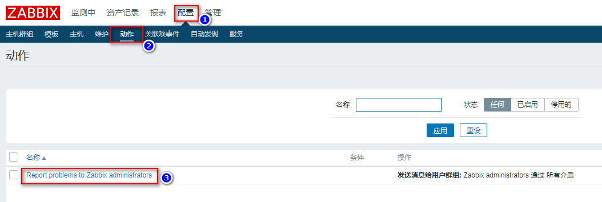


```
告警主机 : {HOST.NAME}
告警  IP   : {HOST.IP}
告警时间 : {EVENT.DATE}-{EVENT.TIME}
告警等级 : {TRIGGER.SEVERITY}
告警信息 : {TRIGGER.NAME}:{ITEM.VALUE}
事件  ID   : {EVENT.ID}
```


启用激活 


测试，监控一个apache服务把服务停掉，看看是否能够收到邮件

在报表菜单的动作日志下面可以查看邮件发送的状态

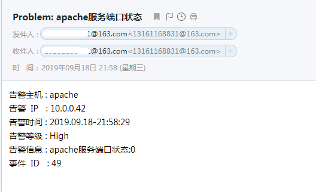


## 16.5 zabbix+grafana

grafana和zabbix-server安装在一台机器（10.0.0.41）

### 16.5.1 安装grafana

```
wget <https://dl.grafana.com/oss/release/grafana-6.3.5-1.x86_64.rpm> 
sudo yum -y localinstall grafana-6.3.5-1.x86_64.rpm 

systemctl daemon-reload
systemctl enable grafana-server
systemctl start grafana-server
```

### 16.5.2 安装grafana-zabbix插件

```bash
grafana-cli plugins install alexanderzobnin-zabbix-app
systemctl restart grafana-server
```

### 16.5.3 Web端访问3000端口

**1.http://10.0.0.41:3000**

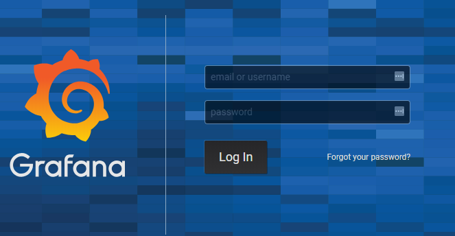


```
用户名：admin
密  码：admin 
```

**2.初次登陆需要修改登陆密码：**


**3.启用zabbix插件**

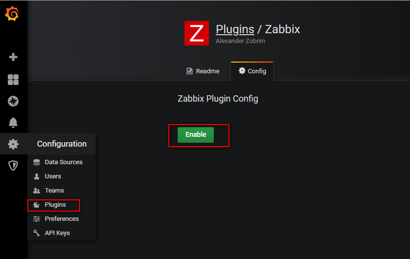


**4.点击配置，选择data sources 的zabbix APP进行配置http://10.0.0.41/zabbix/api_jsonrpc.php**


**5.去官网找合适的模板去导入**

https://grafana.com/grafana/dashboards


