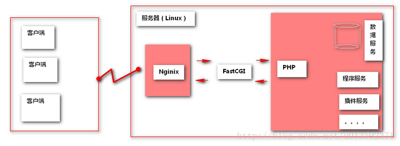

[TOC]


# 第十单元-lnmp


## 10.1 简介

LNMP代表的就是：Linux系统下Nginx+MySQL+PHP这种网站服务器架构。

​	Linux是一类Unix计算机操作系统的统称，是目前最流行的免费操作系统。代表版本有：debian、centos、ubuntu、fedora、gentoo等。
​	Nginx是一个高性能的HTTP和反向代理服务器，也是一个IMAP/POP3/SMTP代理服务器。
​	Mysql是一个小型关系型数据库管理系统。
​	PHP是一种在服务器端执行的嵌入HTML文档的脚本语言。
这四种软件均为免费开源软件，组合到一起，成为一个免费、高效、扩展性强的网站服务系统。




## 10.2 什么是Fast-CGI

　　Fast-CGI是一个可伸缩的、高速的在HTTP server和动态脚本语言间通信的接口。多数流行的HTTP server都支持Fast-CGI，包括Apache、Nginx和lighttpd等。同时，Fast-CGI也被许多脚本语言支持，其中就有PHP。 
　　Fast-CGI是从CGI发展改进而来的。传统CGI接口方式的主要缺点是性能很差，因为每次HTTP服务器遇到动态程序时都需要重新启动脚本解析器来执行解析，然后将结果返回给HTTP服务器。这在处理高并发访问时几乎是不可用的。另外传统的CGI接口方式安全性也很差，现在已经很少使用了。 
　　FastCGI接口方式采用C/S结构，可以将HTTP服务器和脚本解析服务器分开，同时在脚本解析服务器上启动一个或者多个脚本解析守护进程。当HTTP服务器每次遇到动态程序时，可以将其直接交付给Fast-CGI进程来执行，然后将得到的结果返回给浏览器。这种方式可以让HTTP服务器专一地处理静态请求或者将动态脚本服务器的结果返回给客户端，这在很大程度上提高了整个应用系统的性能。


## 10.3 安装php和mysql

```shell
yum 安装mysql和php
yum -y install  mysql mysql-server php php-mysql php-fpm
```


## 10.4 nginx和php的结合

源码安装nginx后，进行配置（可参考之前文档）

```shell
[root@ c6m01 ~]# vim /usr/local/nginx/conf/nginx.conf


server {
        listen 80;
        server_name www.bw.com;

        location / {
            root /www/bw;
            index  index.php index.html index.htm;
        }

        location ~ \.php$ {
               root          /www/bw;
               fastcgi_pass   127.0.0.1:9000;
               fastcgi_index  index.php;
               fastcgi_param  SCRIPT_FILENAME  $document_root$fastcgi_script_name;
               include       fastcgi_params;
        }
    }
```

重启nginx，让配置生效

```shell
/usr/local/nginx/sbin/nginx -s stop
/usr/local/nginx/sbin/nginx -s start
```


10.5 编写php测试页面测试

```shell
[root@ c6m01 ~]# cat /www/bw/index.php
<?php
phpinfo();
?>
```

**浏览器访问：**

http://10.0.0.21

会发现网站报错502状态


原因是没有启动php-fpm，现在启动php-fpm，重新测试。

```shell
[root@ c6m01 ~]# /etc/init.d/php-fpm start			#启动php-fpm
Starting php-fpm:                                          [  OK  ]
s
[root@ c6m01 ~]# chkconfig php-fpm on				#添加到开机自启动
```

访问：


## 10.5 在lnmp上搭建wordpress

#在lnmp上搭建wordpress
上传wordpress-4.9.4-zh_CN.zip到服务器

```shell
[root@ c6m01 ~]# unzip wordpress-4.9.4-zh_CN.zip
[root@ c6m01 ~]# rm -f /www/bw/*
[root@ c6m01 ~]# cp -a wordpress/* /www/bw/
```

#启动mysql

```shell
[root@ c6m01 ~]# /etc/init.d/mysqld start
```

#创建wordpress数据库

```shell
[root@ c6m01 ~]# mysql
mysql> create database wordpress;
```

#修改wordpress的wp-config.php配置文件

```shell
[root@ c6m01 bw]# cp wp-config-sample.php wp-config.php
[root@ c6m01 bw]# vim wp-config.php
// ** MySQL 设置 - 具体信息来自您正在使用的主机 ** //
/** WordPress数据库的名称 */
define('DB_NAME', 'wordpress');

/** MySQL数据库用户名 */
define('DB_USER', 'root');

/** MySQL数据库密码 */
define('DB_PASSWORD', '')；
```

#重启php-fpm


