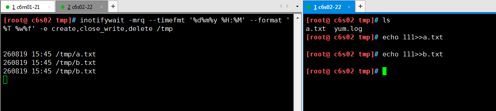

[TOC]


# Rysnc+Inotify实时同步


# 1.1 inotify介绍

# 1.2 inotify出现的原因

Rsync（remote sync）远程同步工具，通过rsync可以实现对远程服务器数据的增量备份同步，但rsync自身也有瓶颈，同步数据时，rsync采用核心算法对远程服务器的目标文件进行比对，只进行差异同步。我们可以想象一下，如果服务器的文件数量达到了百万甚至千万量级，那么文件对比将是非常耗时的。而且发生变化的往往是其中很少的一部分，这是非常低效的方式。inotify的出现，可以缓解rsync不足之处，取长补短。

**简介**
Inotify是一种强大的，细粒度的，异步的文件系统事件监控机制（软件），linux内核从2.6.13起，加入了Inotify支持，通过Inotify可以监控文件系统中添加，删除，修改，移动等各种事件，利用这个内核接口，第三方软件就可以监控文件系统下文件的各种变化情况，而inotify-tools正是实施这样监控的软件。还有国人周洋在金山公司开发的sersync。
Inotify实际是一种事件驱动机制，它为应用程序监控文件系统事件提供了实时响应事件的机制，而无须通过诸如cron等的轮询机制来获取事件。cron等机制不仅无法做到实时性，而且消耗大量系统资源。相比之下，inotify基于事件驱动，可以做到对事件处理的实时响应，也没有轮询造成的系统资源消耗，是非常自然的事件通知接口，也与自然世界的事件机制相符合。

inotify 功能的实现有几款软件

```
1）inotify-tools
2）sersync（金山周洋）
3）lsyncd
```

由于inotify软件是Linux系统2.6内核开始支持，以前版本不支持，所以，安装前需要检查当前系统是否支持安装inotify软件。

# 1.3 inotify部署安装

**（1）安装**

```shell
#检查当前系统是否支持
uname -r
2.6.32-642.el6.x86_64
#出现如下3个内容表示当前系统支持安装inotify软件
ls -l /proc/sys/fs/inotify
total 0
-rw-r--r-- 1 root root 0 May 11 20:25 max_queued_events
-rw-r--r-- 1 root root 0 May 11 20:25 max_user_instances
-rw-r--r-- 1 root root 0 May 11 20:25 max_user_watches

yum -y install inotify*

# inotifywait：在被监控的文件或目录上等待特定文件系统事件（open、close、delete等）发生，执行后处于阻塞状态，适合在shell脚本中使用； 重点掌握
# inotifywatch：收集被监视的文件系统使用度统计数据，指文件系统事件发生的次数统计
```

**（2）inotify限制文件及优化**

在/proc/sys/fs/inotify目录下有三个文件，对inotify机制有一定的限制：
max_user_watches：设置inotifywait或inotifywatch命令可以监视的文件数量（单进程）；
max_user_instances：设置每个用户可以运行的inotifywait或inotifywatch命令的进程数；
max_queued_events：设置inotify实例事件（event）队列可容纳的事件数量。

简单优化

```shell
echo "50000000" > /proc/sys/fs/inotify/max_user_watches
echo "50000000" >/proc/sys/fs/inotify/max_queued_events 
```

**（3）inotifywait重要参数**

```shell
inotifywait --help

-r|--recursive  # 递归查询目录
-q|--quiet      # 打印很少的信息，仅打印监控事件的信息
-m|--monitor    # 始终保持事件监控状态
-d|--daemon		# daemon模式
--exclude <pattern>		# 排除文件或目录，大小写敏感
--excludei <pattern>	# 排除文件或目录时，不区分大小写
--fromfile <file>	#从文件读取需要监视的文件或排除的文件，一个文件一行，排除的文件以@开头
-o|--outfile <file>	# 输出到文件
-s|--syslog			# 把错误放到日志中而不是标准输出
-q|--quiet			# 安静的
--format <fmt>		# 指定输出格式
             %w 表示发生事件的目录     重要
			 %f 表示发生事件的文件      重要
			 %e 表示发生的事件
			 %Xe 事件以“X”分隔
 			 %T 使用由–timefmt定义的时间格式
--timefmt <fmt>		# 指定时间输出格式
-t|--timeout <seconds>	# 设置超时时间
-e|--event <event1>		# 指定监视的事件，比如删除、增加和修改
```

示例一： **使用-m参数，始终监视开始**


示例二：

生产环境中监控create,close_write,delete事件，close_write相当于修改操作,命令行多个事件之间用 ' , ' 逗号隔开。

```shell
inotifywait -mrq --timefmt '%d%m%y %H:%M' --format '%T %w%f' -e create,close_write,delete /tmp
```




# 1.4 rsync+inotify实时同步

编写同步脚本

```shell
[root@ c6s02 ~]# vim inotify.sh
#!/bin/bash

Path=/data
backup_Server=10.0.0.21

/usr/bin/inotifywait -mrq --format '%w%f' -e create,close_write,delete $Path  | while read line
do
    if [ -f $line ];then
        rsync -az $line --delete rsync_backup@$backup_Server::backup --password-file=/etc/rsync.password
    else
        cd $Path &&\
        rsync -az ./ --delete rsync_backup@$backup_Server::backup --password-file=/etc/rsync.password
    fi
done

#放到后台监控
[root@ c6s02 ~]# nohup sh inotify.sh  &>/dev/null &
[1] 24514
[root@ c6s02 ~]# ps -ef|grep inotify
root      24514  24497  0 15:56 pts/1    00:00:00 sh inotify.sh
root      24515  24514  0 15:56 pts/1    00:00:00 /usr/bin/inotifywait -mrq --format %w%f -e create,close_write,delete /data
root      24516  24514  0 15:56 pts/1    00:00:00 sh inotify.sh
root      24518  24497  0 15:56 pts/1    00:00:00 grep --color=auto ino
```

**测试同步：**


> 注意：rsync的--delete参数，会将客户端的目录无差异同步到服务端，所以一定要注意数据的安全，慎用


既然有了inotify-tools，为什么还要开发sersync？

1）sersync通过配置文件来实现，使用方便；

2）真正的守护进程socket；

3）可以对失败文件定时重传（内置定时任务）；

4）第三方的http接口；

5）默认多线程同步。