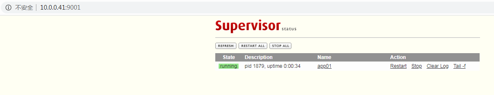
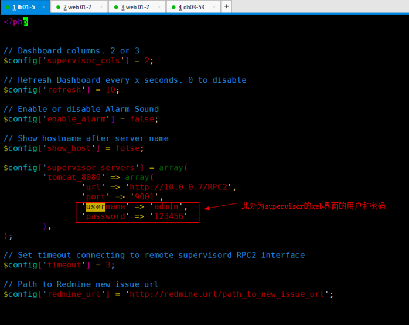
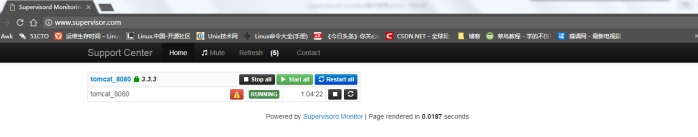

# Supervisor管理集群

# 第1章 Supervisor

## 1.1 简介

Supervisor（http://supervisord.org/）C/S架构的进程控制系统,是用Python开发的一个client/server服务，是Linux/Unix系统下的一个进程管理工具，基于linux操作系统的一款服务器管理工具，**不支持Windows系统**。

用以监控服务器的运行，发现问题能立即自动预警及自动重启等功能。

Supervisor类似于monit，monit和supervisor的一个比较大的差异是supervisor管理的进程必须由supervisor来启动，

monit可以管理已经在运行的程序；supervisor还要求管理的程序是非daemon程序，supervisord会帮你把它转daemon程序，因此如果用supervisor来管理nginx的话，必须在nginx的配置文件里添加一行设置daemon off让nginx以非daemon方式启动。

因为Supervisor是Python开发的，安装前先检查一下系统否安装了Python2.4以上版本。下面以CentOS7，Python2.7版本环境下，介绍Supervisor的安装与配置步聚：


## 1.2 应用场景

​	公司服务器众多，项目多以tomcat为主，而且服务器上tomcat节点比较多，此时通过脚本管理tomcat已经非常棘手，就需要一个统一的进程管理工具去统一管理项目。因此选用supervisor来管理。

**==注意：supervisor只能管理前台进程。==**


## 1.3 安装配置

**supervisor安装完成后会生成三个执行程序：**

- supervisord : supervisor的守护进程服务（用于接收进程管理命令）
- supervisorctl : 客户端（用于和守护进程通信，发送管理进程的指令）
- echo_supervisord_conf : 生成初始配置文件程序。

```bash
#安装supervisor
yum -y install supervisor

#设置开机自启
systemctl enable supervisord.service

#常用supervisorctl命令
supervisorctl status
supervisorctl stop tomcat
supervisorctl start tomcat
supervisorctl restart tomcat
supervisorctl reread
supervisorctl update
```

**通过supervisor管理tomcat**

**配置jdk环境:**

```bash
tar -zxvf jdk-8u60-linux-x64.tar.gz -C /usr/local/
chown -R root.root /usr/local/jdk1.8.0_60
cat>>/etc/profile<<\EOF
###jdk环境###
export JAVA_HOME=/usr/local/jdk1.8.0_60
export PATH=$JAVA_HOME/bin:$JAVA_HOME/jre/bin:$PATH
export CLASSPATH=.$CLASSPATH:$JAVA_HOME/lib:$JAVA_HOME/jre/lib:$JAVA_HOME/lib/tools.jar
EOF

source /etc/profile
java -version
```

**安装tomcat:**

```bash
tar -zxvf apache-tomcat-8.5.29.tar.gz
mkdir -p /opt/app01
cp -a apache-tomcat-8.5.29/* /opt/app01/
```

**supervisor主配置文件详解：**

```bash
[root@ c7-41 etc]# cat /etc/supervisord.conf
; Sample supervisor config file.

[unix_http_server]  		# 负责supervisorctl和supervisord主程序通讯的
file=/var/run/supervisor/supervisor.sock   ; (the path to the socket file)
;chmod=0700                 ; sockef file mode (default 0700)
;chown=nobody:nogroup       ; socket file uid:gid owner
;username=user              ; (default is no username (open server))
;password=123               ; (default is no password (open server))

;[inet_http_server]         # supervisor自带UI界面有关
;port=127.0.0.1:9001        ; (ip_address:port specifier, *:port for all iface)
;username=user              ; (default is no username (open server))
;password=123               ; (default is no password (open server))

[supervisord]				# supervisord主程序的配置
logfile=/var/log/supervisor/supervisord.log  ; (main log file;default $CWD/supervisord.log)
logfile_maxbytes=50MB       ; (max main logfile bytes b4 rotation;default 50MB)
logfile_backups=10          ; (num of main logfile rotation backups;default 10)
loglevel=info               ; (log level;default info; others: debug,warn,trace)
pidfile=/var/run/supervisord.pid ; (supervisord pidfile;default supervisord.pid)
nodaemon=false              ; (start in foreground if true;default false)
minfds=1024                 ; (min. avail startup file descriptors;default 1024)
minprocs=200                ; (min. avail process descriptors;default 200)
;umask=022                  ; (process file creation umask;default 022)
;user=chrism                 ; (default is current user, required if root)
;identifier=supervisor       ; (supervisord identifier, default is 'supervisor')
;directory=/tmp              ; (default is not to cd during start)
;nocleanup=true              ; (don't clean up tempfiles at start;default false)
;childlogdir=/tmp            ; ('AUTO' child log dir, default $TEMP)
;environment=KEY=value       ; (key value pairs to add to environment)
;strip_ansi=false            ; (strip ansi escape codes in logs; def. false)

; the below section must remain in the config file for RPC
; (supervisorctl/web interface) to work, additional interfaces may be
; added by defining them in separate rpcinterface: sections
[rpcinterface:supervisor]
supervisor.rpcinterface_factory = supervisor.rpcinterface:make_main_rpcinterface

[supervisorctl]				 # supervisorctl命令行（客户端）
serverurl=unix:///var/run/supervisor/supervisor.sock ; use a unix:// URL  for a unix socket
;serverurl=http://127.0.0.1:9001 ; use an http:// url to specify an inet socket
;username=chris              ; should be same as http_username if set
;password=123                ; should be same as http_password if set
;prompt=mysupervisor         ; cmd line prompt (default "supervisor")
;history_file=~/.sc_history  ; use readline history if available

; The below sample program section shows all possible program subsection values,
; create one or more 'real' program: sections to be able to control them under
; supervisor.

;[program:theprogramname]	   # supervisord管理的子项目配置
;command=/bin/cat              ; the program (relative uses PATH, can take args)
;process_name=%(program_name)s ; process_name expr (default %(program_name)s)
;numprocs=1                    ; number of processes copies to start (def 1)
;directory=/tmp                ; directory to cwd to before exec (def no cwd)
;umask=022                     ; umask for process (default None)
;priority=999                  ; the relative start priority (default 999)
;autostart=true                ; start at supervisord start (default: true)
;autorestart=true              ; retstart at unexpected quit (default: true)
;startsecs=10                  ; number of secs prog must stay running (def. 1)
;startretries=3                ; max # of serial start failures (default 3)
;exitcodes=0,2                 ; 'expected' exit codes for process (default 0,2)
;stopsignal=QUIT               ; signal used to kill process (default TERM)
;stopwaitsecs=10               ; max num secs to wait b4 SIGKILL (default 10)
;user=chrism                   ; setuid to this UNIX account to run the program
;redirect_stderr=true          ; redirect proc stderr to stdout (default false)
;stdout_logfile=/a/path        ; stdout log path, NONE for none; default AUTO
;stdout_logfile_maxbytes=1MB   ; max # logfile bytes b4 rotation (default 50MB)
;stdout_logfile_backups=10     ; # of stdout logfile backups (default 10)
;stdout_capture_maxbytes=1MB   ; number of bytes in 'capturemode' (default 0)
;stdout_events_enabled=false   ; emit events on stdout writes (default false)
;stderr_logfile=/a/path        ; stderr log path, NONE for none; default AUTO
;stderr_logfile_maxbytes=1MB   ; max # logfile bytes b4 rotation (default 50MB)
;stderr_logfile_backups=10     ; # of stderr logfile backups (default 10)
;stderr_capture_maxbytes=1MB   ; number of bytes in 'capturemode' (default 0)
;stderr_events_enabled=false   ; emit events on stderr writes (default false)
;environment=A=1,B=2           ; process environment additions (def no adds)
;serverurl=AUTO                ; override serverurl computation (childutils)

; The below sample eventlistener section shows all possible
; eventlistener subsection values, create one or more 'real'
; eventlistener: sections to be able to handle event notifications
; sent by supervisor.

;[eventlistener:theeventlistenername]
;command=/bin/eventlistener    ; the program (relative uses PATH, can take args)
;process_name=%(program_name)s ; process_name expr (default %(program_name)s)
;numprocs=1                    ; number of processes copies to start (def 1)
;events=EVENT                  ; event notif. types to subscribe to (req'd)
;buffer_size=10                ; event buffer queue size (default 10)
;directory=/tmp                ; directory to cwd to before exec (def no cwd)
;umask=022                     ; umask for process (default None)
;priority=-1                   ; the relative start priority (default -1)
;autostart=true                ; start at supervisord start (default: true)
;autorestart=unexpected        ; restart at unexpected quit (default: unexpected)
;startsecs=10                  ; number of secs prog must stay running (def. 1)
;startretries=3                ; max # of serial start failures (default 3)
;exitcodes=0,2                 ; 'expected' exit codes for process (default 0,2)
;stopsignal=QUIT               ; signal used to kill process (default TERM)
;stopwaitsecs=10               ; max num secs to wait b4 SIGKILL (default 10)
;user=chrism                   ; setuid to this UNIX account to run the program
;redirect_stderr=true          ; redirect proc stderr to stdout (default false)
;stdout_logfile=/a/path        ; stdout log path, NONE for none; default AUTO
;stdout_logfile_maxbytes=1MB   ; max # logfile bytes b4 rotation (default 50MB)
;stdout_logfile_backups=10     ; # of stdout logfile backups (default 10)
;stdout_events_enabled=false   ; emit events on stdout writes (default false)
;stderr_logfile=/a/path        ; stderr log path, NONE for none; default AUTO
;stderr_logfile_maxbytes=1MB   ; max # logfile bytes b4 rotation (default 50MB)
;stderr_logfile_backups        ; # of stderr logfile backups (default 10)
;stderr_events_enabled=false   ; emit events on stderr writes (default false)
;environment=A=1,B=2           ; process environment additions
;serverurl=AUTO                ; override serverurl computation (childutils)

; The below sample group section shows all possible group values,
; create one or more 'real' group: sections to create "heterogeneous"
; process groups.

;[group:thegroupname]
;programs=progname1,progname2  ; each refers to 'x' in [program:x] definitions
;priority=999                  ; the relative start priority (default 999)

; The [include] section can just contain the "files" setting.  This
; setting can list multiple files (separated by whitespace or
; newlines).  It can also contain wildcards.  The filenames are
; interpreted as relative to this file.  Included files *cannot*
; include files themselves.

[include]
files = supervisord.d/*.ini

```


**创建supervisor管理tomcat的子配置文件:**

```bash
vim /etc/supervisord.d/app01.ini
[program:app01]
command=/opt/app01/bin/catalina.sh run
environment=JAVA_HOME="/usr/local/jdk1.8.0_60",JAVA_BIN="/usr/local/jdk1.8.0_60/bin"
directory=/opt/app01/bin/
numprocs=1
user = root
autostart = true
autorestart=true
startsecs = 5
```


## 1.4 bash终端管理

命令行模式：

```bash
supervisorctl status
supervisorctl stop tomcat
supervisorctl start tomcat
supervisorctl restart tomcat
supervisorctl reread
supervisorctl update
```

交互模式：

```bash
[root@ c7-41 tmp]# supervisorctl
app01                            RUNNING   pid 3227, uptime 0:13:49

supervisor> help

default commands (type help <topic>):
=====================================
add    exit      open  reload  restart   start   tail
avail  fg        pid   remove  shutdown  status  update
clear  maintail  quit  reread  signal    stop    version

supervisor> status
app01                            RUNNING   pid 3227, uptime 0:14:40
supervisor> stop app01
app01: stopped
```


##  1.5 自带Web管理界面 



出于安全考虑，默认配置是没有开启web管理界面，需要修改supervisord.conf配置文件打开http访权限，将下面的配置：

```bash
;[inet_http_server]        ; inet (TCP) server disabled by default
;port=127.0.0.1:9001       ; (ip_address:port specifier, *:port for all iface)
;username=user              ; (default is no username (open server))
;password=123               ; (default is no password (open server))
```

修改成：

```bash
[inet_http_server]        ; inet (TCP) server disabled by default
port=10.0.0.41:9001         ; (ip_address:port specifier, *:port for all iface)
username=user              ; (default is no username (open server))
password=123               ; (default is no password (open server))
```

- port：绑定访问IP和端口，这里是绑定的是本地IP和9001端口
- username：登录管理后台的用户名
- password：登录管理后台的密码

**常见启动报错：**

```bash
[root@ sfaapp9 logs]# supervisorctl
dealer-update-38021-8055-99      FATAL     Exited too quickly (process log may have details)
[root@ sfaapp9 conf.d]# killall java
[root@ sfaapp9 conf.d]# ps -ef|grep sup
root     16928     1  0 22:21 ?        00:00:00 /usr/bin/python /usr/bin/supervisord -c /etc/supervisor/supervisord.conf
root     17109 15876  0 22:42 pts/3    00:00:00 grep sup
[root@ sfaapp9 conf.d]# kill -9 16928
[root@ sfaapp9 conf.d]# /etc/init.d/supervisord start
此报错，要关掉所有supervisor管理的进程和supervisor本身进程，然后重启启动supervisor。
```


# 第2章 supervisor-monitor多服务器管理工具


**2.1 安装 PHP**

注意: supervisor-monitor 需要搭建php环境

搭建php环境

```bash
[root@ lb01 ~]# 
yum install -y php-fpm
```

并加入开机自启动

```bash
chkconfig php-fpm on
```

启动php-fpm

```bash
/etc/init.d/php-fpm start
```

**2.2 安装 Supervisor-monitor**

```
[root@ lb01 ~]# 
cd /opt
git clone https://github.com/mlazarov/supervisord-monitor
cd /opt/supervisord-monitor/application/config
```

复制一份配置文件

```
cp supervisor.php.example supervisor.php
vim /opt/supervisord-monitor/application/config/supervisor.php
主要修改
$config['supervisor_servers'] = array(
        'tomcat_8080' => array(
                'url' => 'http://10.0.0.7/RPC2',
                'port' => '9001',
                'username' => 'admin',
                'password' => '123456'
        ),
); 

```




**2.3 nginx配置，使nginx支持php**

如果supervisor-monitor安装在代理服务器nginx上,需配置如下:

```bash
[root@ lb01 ext]# pwd
/application/nginx/conf/ext
[root@ lb01 ext]# vi supervisor.conf

server {
        listen       80;
        server_name  10.0.0.5 www.supervisor.com;
        root         /opt/supervisord-monitor/public_html;
        index        index.html index.htm index.php;

        access_log  logs/supervisor_access.log;
        error_log logs/supervisor_error.log error;

        if ($query_string ~* ".*('|--|union|insert|drop|truncate|update|from|grant|exec|where|select|and|or|count|chr|mid|like|iframe|script|alert|webscan|dbappsecurity|style|confirm|innerhtml|innertext|class).*")
           { return 500; }

        location / {
                auth_basic "input you user name and password";
                auth_basic_user_file   /application/nginx/conf/supervisor_passwd;
                try_files $uri $uri/ /index.php;
        }
         location ~ \.php$ {
        try_files $uri =404;

        include fastcgi.conf;
        fastcgi_pass 127.0.0.1:9000;
       }

    }
```

**nginx配置auth_basic 本机认证**

```bash
yum -y install httpd-tools
[root@ lb01 conf]# htpasswd -c /application/nginx/conf/supervisor_passwd wanjiaji
New password:123456
Re-type new password:123456
Adding password for user wanjiaji
[root@ lb01 conf]# cat /application/nginx/conf/supervisor_passwd
wanjiaji:SWs7bjYdd66xQ

chmod 400 /application/nginx/conf/supervisor_passwd
chown -R nginx.nginx  /application/nginx/conf/supervisor_passwd
```

配置完后,重启nginx


