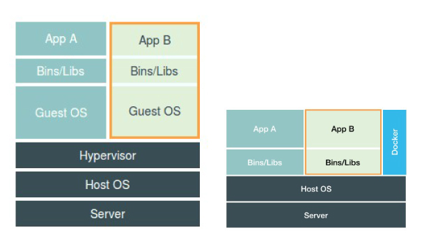

[TOC]

# Kubernetes(k8s)容器编排

# 第一章 Kubernetes概述

# 1.1 k8s介绍与特性

Kubernetes(k8s)是Google开源的容器集群管理系统（谷歌内部:Borg），它主要用于容器编排、资源调度、弹性伸缩启动容器和管理容器应用和回收容器。

k8s的目标是让部署容器化的应用简单并且高效，k8s提供了应用部署、规划、更新、维护的一种机制！

# 1. 容器及其三要素

## 1.1 容器是什么

容器的本质是一种特殊的进程。

在linux容器中有三个重要的概念：Namespace、Cgroups、rootfs。

Namespace 做隔离，让进程只能看到Namespace中的世界；

Cgroups       做限制，限制单个进程对系统资源的使用量。

rootfs           做文件系统，rootfs 只是一个操作系统所包含的文件、配置和目录，并不包括操作系统内核。

这样就实现了进程在我们所看到的一个与世隔绝的房间，这个房间就是Pass项目赖以生存的"沙盒"。

