[TOC]


# Linux运维面试精华

# 基础必会

## 什么是运维？什么是游戏运维？

1）运维是指大型组织已经建立好的网络软硬件的维护，就是要保证业务的上线与运作的正常，在他运转的过程中，对他进行维护，他集合了网络、系统、数据库、开发、安全、监控于一身的技术，运维又包括很多种，有DBA运维、网站运维、虚拟化运维、监控运维、游戏运维等等

2）游戏运维又有分工，分为开发运维、应用运维（业务运维）和系统运维

开发运维：是给应用运维开发运维工具和运维平台的
应用运维：是给业务上线、维护和做故障排除的，用开发运维开发出来的工具给业务上线、维护、做故障排查
系统运维：是给应用运维提供业务上的基础设施，比如：系统、网络、监控、硬件等等

总结：开发运维和系统运维给应用运维提供了“工具”和“基础设施”上的支撑

开发运维、应用运维和系统运维他们的工作是环环相扣的

## 在工作中，运维人员经常需要跟运营人员打交道，请问运营人员是做什么工作的？

游戏运营要做的一个事情除了协调工作以外，还需要与各平台沟通，做好开服的时间、开服数、用户导量、活动等计划

## 如果给你三百台服务器，如何对其进行管理？

管理3百台服务器的方式：

1）设定跳板机，使用统一账号登录，便于安全与登录的考量。

2）使用salt、ansiable、puppet进行系统的统一调度与配置的统一管理。

3）建立简单的服务器的系统、配置、应用的cmdb信息管理。便于查阅每台服务器上的各种信息记录。


## 你对运维工程师的理解和以及工作的认识

运维工程师在公司当中责任重大，需要保证时刻为公司及客户提供最高、最快、最稳定、最安全的服务。

运维工程师的一个小小的失误，很有可能会对公司及客户造成重大损失；因此运维工程师的工作需要严谨及富有创新精神。


## 服务器开不了机怎么办

A、造成服务器故障的原因可能有以下几点：

1.服务器电源有问题

2.服务器系统文件丢失，硬件问题，散热不良造成蓝屏和死机

3.服务器网络参数配置有误，物理链路原因等 

B、如何排查服务器故障的处理步骤如下：

 

## Linux系统中病毒怎么解决

1）最简单有效的方法就是重装系统

2）要查的话就是找到病毒文件然后删除
中毒之后一般机器cpu、内存使用率会比较高，机器向外发包等异常情况，排查方法简单介绍下，top 命令找到cpu使用率最高的进程，一般病毒文件命名都比较乱，可以用 ps aux 找到病毒文件位置，rm -f  命令删除病毒文件，检查计划任务、开机启动项和病毒文件目录有无其他可以文件等

3）由于即使删除病毒文件不排除有潜伏病毒，所以最好是把机器备份数据之后重装一下

## 发现病毒文件，删除后又自动创建怎么办

公司的内网某台linux服务器流量莫名其妙的剧增,用iftop查看有连接外网的情况
针对这种情况一般重点查看netstat连接的外网ip和端口。用lsof -p pid可以查看到具体是那些进程，哪些文件，经查勘发现/root下有相关的配置conf.n hhe两个可疑文件，rm -rf后不到一分钟就自动生成了，由此推断是某个母进程产生的这些文件。所以找到母进程就是找到罪魁祸首

查杀病毒最好断掉外网访问，还好是内网服务器，可以通过内网访问

断了内网，病毒就失去外联的能力，杀掉它就容易的多，怎么找到呢，找了半天也没有看到蛛丝马迹，没办法只有ps axu一个个排查，方法是查看可以的用户和和系统相似而又不是的冒牌货，果然，看到了如下进程可疑，看不到图片就是/usr/bin/.sshd，于是我杀掉所有.sshd相关的进程，然后直接删掉.sshd这个可执行文件，然后才删掉了文章开头提到的自动复活的文件

总结一下，遇到这种问题，如果不是太严重，尽量不要重装系统

一般就是先断外网，然后利用iftop,ps,netstat,chattr,lsof,pstree这些工具顺藤摸瓜
一般都能找到元凶。但是如果遇到诸如此类的问题
/boot/efi/EFI/redhat/grub.efi: Heuristics.Broken.Executable FOUND，个人觉得就要重装系统了


## 请列出你了解的web服务器负载架构

```
Nginx
Haproxy
Keepalived
LVS
```


## 文件删除的原理

**删除文件但是该文件还被应用程序的调用的情况：**

对于删除命令 rm 而言，实际就是减少磁盘引用计数 i_nlink。这里就会有一个问题，如果一个文件正在被某个进程调用，而用户却执行 rm 操作把文件删除了，那么会出现什么结果呢？当用户执行 rm 操作删除文件后，再执行ls 或者其他文件管理命令，无法再找到这个文件了，但是调用这个删除的文件的进程却在继续正常执行，依然能够从文件中正确的读取及写入内容。也就是说，还需要解除该进程的对该文件的调用才行。

 

**当文件没有被调用时，执行了 rm 操作删除文件后是否还可以找回被删的文件呢？**

rm 操作只是将文件的 i_nlink 减少了，或者说置 0 了，实际就是将文件名到 inode 的链接删除了，此时，并没有删除文件的实体即（block 数据块），此时，如果及时停止机器工作，数据是可以找回的；如果此时继续写入数据，那么当新数据就可能会被分配到被删除的数据的 block 数据块，此时，文件就会被真正的回收了。

 

**如何删除文件：**

1.硬链接数为 0 与这个文件有关的所有硬链接都被删除。（使用的是 rm 命令）

2.进程调用数为 0 没有人在使用这个文件。（使用的是 lsof）

没有被彻底删除-硬链接数为 0,进程调用数不为零

解答:文件删除（硬链接）但是这个文件还有进程在调用，这个文件还没有被完全删除。最总导致磁

盘空间满了。硬链接数为零，进程调用数不为零，导致磁盘空间满了。


## Linx 的运行级别

Linux 系统有 7 个运行级别(runlevel)

运行级别 0：系统停机状态，系统默认运行级别不能设为 0，否则不能正常启动

运行级别 1：单用户工作状态，root 权限，用于系统维护，禁止远程登陆

运行级别 2：多用户状态(没有 NFS)

运行级别 3：完全的多用户状态(有 NFS)，登陆后进入控制台命令行模式

运行级别 4：系统未使用，保留

运行级别 5：X11 控制台，登陆后进入图形 GUI 模式

运行级别 6：系统正常关闭并重启，默认运行级别不能设为 6，否则不能正常启动


## Linux 开机启动流程

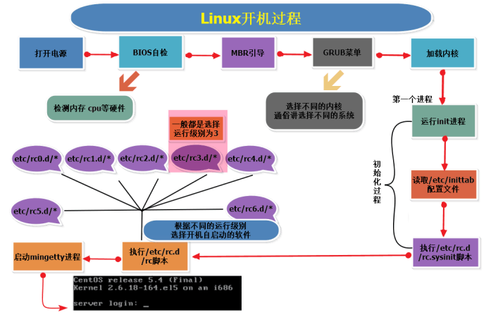

```
① 打开电源 
② Bios 各个硬件的检查（不同的声响代表不同的含义） 
③ 硬盘的 MBR 引导 
④ GRUB 菜单，也就是选择需要加载的内核（不同的内核也就是不同的操作系统） 
⑤ 加载内核 
⑥ 启动第一个进程 init 进程 
⑦ 读取/etc/inittab 配置文件 
⑧ 执行/etc/rc.d/rc.sysinit 脚本 
⑨ 执行/etc/rc.d/rc 脚本（根据不同的运行级别选择开机自启动的软件） 
⑩ 启动 mingetty 进程（进入系统的登录界面） 
```


## 负载均衡概念和实现

概念：

1）对用户的访问请求进行调度管理

2）对用户的访问请求进行压力分担

实现：

1）硬件实现负载

① F5 硬件设备

② A10 硬件设备

2）软件实现负载

① Nginx（7 层，1.9 之后支持 4 层负载）

② LVS（4 层）

③ HAproxy（4 层，7 层）


## raid0 raid1 raid5 raid10 三种工作模式的工作原理及特点

**RAID0**

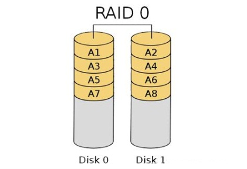

**定义：**

RAID 0又称为Stripe或Striping，它代表了所有RAID级别中最高的存储性能。RAID 0提高存储性能的原理是把连续的数据分散到多个磁盘上存取，这样，系统有数据请求就可以被多个磁盘并行的执行，每个磁盘执行属于它自己的那部分数据请求。这种数据上的并行操作可以充分利用总线的带宽，显著提高磁盘整体存取性能。

**工作原理：**

系统向三个磁盘组成的逻辑硬盘（RAID0 磁盘组）发出的I/O数据请求被转化为3项操作，其中的每一项操作都对应于一块物理硬盘。通过建立RAID 0，原先顺序的数据请求被分散到所有的三块硬盘中同时执行。从理论上讲，三块硬盘的并行操作使同一时间内磁盘读写速度提升了3倍。 但由于总线带宽等多种因素的影响，实际的提升速率肯定会低于理论值，但是，大量数据并行传输与串行传输比较，提速效果显著显然毋庸置疑。

**优缺点：**

读写性能是所有RAID级别中最高的。

RAID 0的缺点是不提供数据冗余，因此一旦用户数据损坏，损坏的数据将无法得到恢复。RAID0运行时只要其中任一块硬盘出现问题就会导致整个数据的故障。一般不建议企业用户单独使用。

**总结：**

磁盘空间使用率：100%，故成本最低。

读性能：N*单块磁盘的读性能

写性能：N*单块磁盘的写性能

冗余：无，任何一块磁盘损坏都将导致数据不可用。


**RAID1**

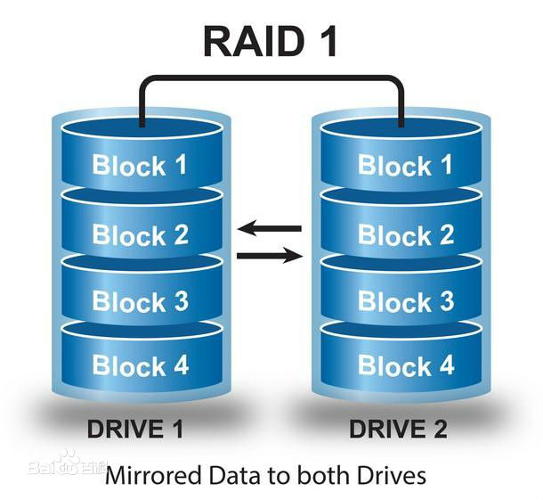

**定义：**

RAID 1通过磁盘数据镜像实现数据冗余，在成对的独立磁盘上产生互为备份的数据。当原始数据繁忙时，可直接从镜像拷贝中读取数据，因此RAID 1可以提高读取性能。RAID 1是磁盘阵列中单位成本最高的，但提供了很高的数据安全性和可用性。当一个磁盘失效时，系统可以自动切换到镜像磁盘上读写，而不需要重组失效的数据。

**工作原理：**

RAID1是将一个两块硬盘所构成RAID磁盘阵列，其容量仅等于一块硬盘的容量，因为另一块只是当作数据“镜像”。RAID1磁盘阵列显然是最可靠的一种阵列，因为它总是保持一份完整的数据备份。它的性能自然没有RAID0磁盘阵列那样好，但其数据读取确实较单一硬盘来的快，因为数据会从两块硬盘中较快的一块中读出。RAID1磁盘阵列的写入速度通常较慢，因为数据得分别写入两块硬盘中并做比较。RAID1磁盘阵列一般支持“热交换”，就是说阵列中硬盘的移除或替换可以在系统运行时进行，无须中断退出系统。RAID1磁盘阵列是十分安全的，不过也是较贵一种RAID磁盘阵列解决方案，因为两块硬盘仅能提供一块硬盘的容量。RAID1磁盘阵列主要用在数据安全性很高，而且要求能够快速恢复被破坏的数据的场合。

在这里，需要注意的是，读只能在一块磁盘上进行，并不会进行并行读取，性能取决于硬盘中较快的一块。写的话通常比单块磁盘要慢，虽然是并行写，即对两块磁盘的写入是同时进行的，但因为要比较两块硬盘中的数据，所以性能比单块磁盘慢。

**优缺点：**

RAID1通过硬盘数据镜像实现数据的冗余，保护数据安全，在两块盘上产生互为备份的数据，当原始数据繁忙时，可直接从镜像备份中读取数据，因此RAID1可以提供读取性能。
RAID1是硬盘中单位成本最高的，但提供了很高的数据安全性和可用性，当一个硬盘失效时，系统可以自动切换到镜像硬盘上读/写，并且不需要重组失效的数据。

**总结：**

磁盘空间使用率：50%，故成本最高。

读性能：只能在一个磁盘上读取，取决于磁盘中较快的那块盘

写性能：两块磁盘都要写入，虽然是并行写入，但因为要比对，故性能单块磁盘慢。

冗余：只要系统中任何一对镜像盘中有一块磁盘可以使用，甚至可以在一半数量的硬盘出现问题时系统都可以正常运行。


 **RAID 5** 

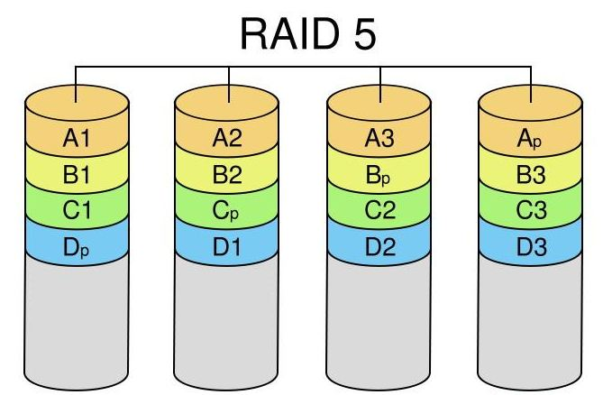

**定义：**

RAID 5是RAID 0和RAID 1的折中方案。RAID 5具有和RAID0相近似的数据读取速度，只是多了一个奇偶校验信息，写入数据的速度比对单个磁盘进行写入操作稍慢。同时由于多个数据对应一个奇偶校验信息，RAID5的磁盘空间利用率要比RAID 1高，存储成本相对较低，是目前运用较多的一种解决方案。

**工作原理：**

RAID5把数据和相对应的奇偶校验信息存储到组成RAID5的各个磁盘上，并且奇偶校验信息和相对应的数据分别存储于不同的磁盘上，其中任意N-1块磁盘上都存储完整的数据，也就是说有相当于一块磁盘容量的空间用于存储奇偶校验信息。因此当RAID5的一个磁盘发生损坏后，不会影响数据的完整性，从而保证了数据安全。当损坏的磁盘被替换后，RAID还会自动利用剩下奇偶校验信息去重建此磁盘上的数据，来保持RAID5的高可靠性。

做raid 5阵列所有磁盘容量必须一样大，当容量不同时，会以最小的容量为准。 最好硬盘转速一样，否则会影响性能，而且可用空间=磁盘数n-1，Raid 5 没有独立的奇偶校验盘，所有校验信息分散放在所有磁盘上， 只占用一个磁盘的容量。

**总结：**

磁盘空间利用率：(N-1)/N，即只浪费一块磁盘用于奇偶校验。

读性能：(n-1)*单块磁盘的读性能，接近RAID0的读性能。

写性能：比单块磁盘的写性能要差（这点不是很明白，不是可以并行写入么？）

冗余：只允许一块磁盘损坏。


**RAID10**

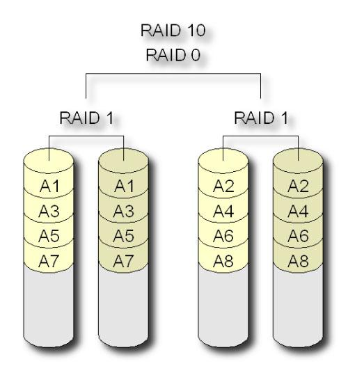

**定义：**

RAID10也被称为镜象阵列条带。象RAID0一样，数据跨磁盘抽取；象RAID1一样，每个磁盘都有一个镜象磁盘, 所以RAID 10的另一种会说法是 RAID 0+1。RAID10提供100%的数据冗余，支持更大的卷尺寸，但价格也相对较高。对大多数只要求具有冗余度而不必考虑价格的应用来说，RAID10提供最好的性能。使用RAID10，可以获得更好的可靠性，因为即使两个物理驱动器发生故障（每个阵列中一个），数据仍然可以得到保护。RAID10需要4 + 2*N 个磁盘驱动器（N >=0)， 而且只能使用其中一半(或更小, 如果磁盘大小不一)的磁盘用量, 例如 4 个 250G 的硬盘使用RAID10 阵列， 实际容量是 500G。

**实现原理：**

Raid10其实结构非常简单，首先创建2个独立的Raid1，然后将这两个独立的Raid1组成一个Raid0，当往这个逻辑Raid中写数据时，数据被有序的写入两个Raid1中。磁盘1和磁盘2组成一个Raid1，磁盘3和磁盘4又组成另外一个Raid1;这两个Raid1组成了一个新的Raid0。如写在硬盘1上的数据1、3、5、7，写在硬盘2中则为数据1、3、5、7，硬盘中的数据为0、2、4、6，硬盘4中的数据则为0、2、4、6，因此数据在这四个硬盘上组合成Raid10，且具有raid0和raid1两者的特性。
虽然Raid10方案造成了50%的磁盘浪费，但是它提供了200%的速度和单磁盘损坏的数据安全性，并且当同时损坏的磁盘不在同一Raid1中，就能保证数据安全性。假如磁盘中的某一块盘坏了，整个逻辑磁盘仍能正常工作的。
当我们需要恢复RAID10中损坏的磁盘时，只需要更换新的硬盘，按照RAID10的工作原理来进行数据恢复，恢复数据过程中系统仍能正常工作。原先的数据会同步恢复到更换的硬盘中。

**总结：**

磁盘空间利用率：50%。

读性能：N/2*单块硬盘的读性能

写性能：N/2*单块硬盘的写性能

冗余：只要一对镜像盘中有一块磁盘可以使用就没问题。


1. raid0：追求性能，不需要保证数据的安全 mysql slave 数据库从库（数据库的小弟），集群的节

点。

2. raid1：安全性，对性能要求不高，对数据安全性高（有冗余）成本比较高。

3. raid5：对于性能要求不高 用户并发比较小

4. raid10：价格贵、性能好、安全性高、一般是用于数据库的主库。

- 冗余从好到坏：RAID1 RAID10 RAID 5 RAID0

- 性能从好到坏：RAID0 RAID10 RAID5 RAID1

- 成本从低到高：RAID0 RAID5 RAID1 RAID10


## LVS、Nginx、HAproxy的去区别及优缺点

LVS：是基于四层的转发
HAproxy：是基于四层和七层的转发，是专业的代理服务器
Nginx：是WEB服务器，缓存服务器，又是反向代理服务器，可以做七层的转发

**区别**：LVS由于是基于四层的转发所以只能做端口的转发，而基于URL的、基于目录的这种转发LVS就做不了

**工作选择**：

HAproxy和Nginx由于可以做七层的转发，所以URL和目录的转发都可以做，在很大并发量的时候我们就要选择LVS，像中小型公司的话并发量没那么大，选择HAproxy或者Nginx足已。

**Nginx的优点是：**

1、工作在网络的7层之上，可以针对http应用做一些分流的策略，比如针对域名、目录结构，它的正则规则比HAProxy更为强大和灵活，这也是它目前广泛流行的主要原因之一，Nginx单凭这点可利用的场合就远多于LVS了。

2、Nginx对网络稳定性的依赖非常小，理论上能ping通就就能进行负载功能，这个也是它的优势之一，相反LVS对网络稳定性依赖比较大；

3、Nginx安装和配置比较简单，测试起来比较方便，

4、可以承担高负载压力且稳定，在硬件不差的情况下一般能支撑几万次的并发量，负载度比LVS相对小些。

5、Nginx可以通过端口检测到服务器内部的故障，比如根据服务器处理网页返回的状态码、超时等等，并且会把返回错误的请求重新提交到另一个节点，不过其中缺点就是不支持url来检测。比如用户正在上传一个文件，而处理该上传的节点刚好在上传过程中出现故障，Nginx会把上传切到另一台服务器重新处理，而LVS就直接断掉了，如果是上传一个很大的文件或者很重要的文件的话，用户可能会因此而不满。

6、Nginx不仅仅是一款优秀的负载均衡器/反向代理软件，它同时也是功能强大的Web应用服务器，可作为静态网页和图片服务器。还有Nginx社区非常活跃，第三方模块也很多

7、Nginx现在作为Web反向加速缓存越来越成熟了，速度比传统的Squid服务器更快，可考虑用其作为反向代理加速器

**Nginx的缺点是：**

1、Nginx仅能支持http、https和Email协议，这样就在适用范围上面小些，这个是它的缺点

2、对后端服务器的健康检查，只支持通过端口来检测，不支持通过url来检测；不支持Session的直接保持，但能通过ip_hash来解决


**LVS：使用Linux内核集群实现一个高性能、高可用的负载均衡服务器，它具有很好的可伸缩性（Scalability)、可靠性（Reliability)和可管理性（Manageability)**

**LVS的优点是**：

1、抗负载能力强、是工作在网络4层之上仅作分发之用，对内存和cpu资源消耗比较低

2、配置性比较低，这是一个缺点也是一个优点，因为没有可太多配置的东西，所以并不需要太多接触，大大减少了人为出错的几率

3、工作稳定，自身有完整的双机热备方案，如LVS+Keepalived，不过我们在项目实施中用得最多的还是LVS/DR+Keepalived

4、没有流量的产生，LVS只分发请求，而流量并不从它本身出去，这点保证了均衡器IO的性能不会收到大流量的影响。

5、应用范围较广，因为LVS工作在4层，所以它几乎可对所有应用做负载均衡，包括http、数据库、在线聊天室等

**LVS的缺点是：**

1、软件本身不支持正则表达式处理，不能做动静分离；而现在许多网站在这方面都有较强的需求，这个是Nginx/HAProxy+Keepalived的优势所在

2、如果是网站应用比较庞大的话，LVS/DR+Keepalived实施起来就比较复杂了，特别后面有Windows Server的机器的话，如果实施及配置还有维护过程就比较复杂了，相对而言，Nginx/HAProxy+Keepalived就简单多了。


**HAProxy的特点是：**

1、HAProxy也是支持虚拟主机的。

2、HAProxy的优点能够补充Nginx的一些缺点，比如支持Session的保持，Cookie的引导，同时支持通过获取指定的url来检测后端服务器的状态

3、HAProxy跟LVS类似，本身就只是一款负载均衡软件，单纯从效率上来讲HAProxy会比Nginx有更出色的负载均衡速度，在并发处理上也是优于Nginx的

4、HAProxy支持TCP协议的负载均衡转发，可以对MySQL读进行负载均衡，对后端的MySQL节点进行检测和负载均衡，大家可以用LVS+Keepalived对MySQL主从做负载均衡

5、HAProxy负载均衡策略非常多，HAProxy的负载均衡算法现在具体有如下8种：

①roundrobin，表示简单的轮询，这个不多说，这个是负载均衡基本都具备的；
② static-rr，表示根据权重，建议关注；
③leastconn，表示最少连接者先处理，建议关注；
④ source，表示根据请求源IP，这个跟Nginx的IP_hash机制类似
    我们用其作为解决session问题的一种方法，建议关注；
⑤ri，表示根据请求的URI；
⑥rl_param，表示根据请求的URl参数’balance url_param’ requires an URL parameter name；
⑦hdr(name)，表示根据HTTP请求头来锁定每一次HTTP请求；
⑧rdp-cookie(name)，表示根据据cookie(name)来锁定并哈希每一次TCP请求。


## Squid、Varinsh和Nginx有什么区别，工作中你怎么选择？

Squid、Varinsh和Nginx都是代理服务器

**什么是代理服务器：**

能当替用户去访问公网，并且能把访问到的数据缓存到服务器本地，等用户下次再访问相同的资源的时候，代理服务器直接从本地回应给用户，当本地没有的时候，我代替你去访问公网，我接收你的请求，我先在我自已的本地缓存找，如果我本地缓存有，我直接从我本地的缓存里回复你，如果我在我本地没有找到你要访问的缓存的数据，那么代理服务器就会代替你去访问公网

**区别：**

1）Nginx本来是反向代理/web服务器，用了插件可以做做这个副业但是本身不支持特性挺多，只能缓存静态文件

2）从这些功能上。varnish和squid是专业的cache服务，而nginx这些是第三方模块（proxy_cache）完成

3）varnish本身的技术上优势要高于squid，它采用了可视化页面缓存技术在内存的利用上，Varnish比Squid具有优势，性能要比Squid高。还有强大的通过Varnish管理端口，可以使用正则表达式快速、批量地清除部分缓存它是内存缓存，速度一流，但是内存缓存也限制了其容量，缓存页面和图片一般是挺好的

4）squid的优势在于完整的庞大的cache技术资料，和很多的应用生产环境

**工作中选择：**

要做cache服务的话，我们肯定是要选择专业的cache服务，优先选择squid或者varnish。

## Tomcat和Resin有什么区别，工作中你怎么选择？

区别：Tomcat用户数多，可参考文档多，Resin用户数少，可考虑文档少
最主要区别则是Tomcat是标准的java容器，不过性能方面比resin的要差一些
但稳定性和java程序的兼容性，应该是比resin的要好

工作中选择：现在大公司都是用resin，追求性能；而中小型公司都是用Tomcat，追求稳定和程序的兼容

## 什么是中间件？什么是jdk？

中间件介绍：

中间件是一种独立的系统软件或服务程序，分布式应用软件借助这种软件在不同的技术之间共享资源

中间件位于客户机/ 服务器的操作系统之上，管理计算机资源和网络通讯
是连接两个独立应用程序或独立系统的软件。相连接的系统，即使它们具有不同的接口

但通过中间件相互之间仍能交换信息。执行中间件的一个关键途径是信息传递，通过中间件，应用程序可以工作于多平台或OS环境。

jdk：jdk是Java的开发工具包，它是一种用于构建在 Java 平台上发布的应用程序、applet 和组件的开发环境


## 讲述一下Tomcat8005、8009、8080三个端口的含义？

8005==》 关闭时使用

8009==》 为AJP端口，即容器使用，如Apache能通过AJP协议访问Tomcat的8009端口

8080==》 一般应用使用

 

## 什么叫CDN？

1.即内容分发网络

2.其目的是通过在现有的Internet中增加一层新的网络架构，将网站的内容发布到最接近用户的网络边缘，使用户可就近取得所需的内容，提高用户访问网站的速度

 

## 什么叫网站灰度发布？

灰度发布是指在黑与白之间，能够平滑过渡的一种发布方式

AB test就是一种灰度发布方式，让一部用户继续用A，一部分用户开始用B，如果用户对B没有什么反对意见，那么逐步扩大范围，把所有用户都迁移到B上面来灰度发布可以保证整体系统的稳定，在初始灰度的时候就可以发现、调整问题，以保证其影响度


## RabbitMQ是什么？

RabbitMQ也就是消息队列中间件，消息中间件是在消息的传息过程中保存消息的容器
消息中间件再将消息从它的源中到它的目标中标时充当中间人的作用
队列的主要目的是提供路由并保证消息的传递；如果发送消息时接收者不可用
消息队列不会保留消息，直到可以成功地传递为止，当然，消息队列保存消息也是有期限地


## 讲述一下LVS三种模式的工作过程？

LVS 有三种负载均衡的模式，分别是VS/NAT（nat 模式） VS/DR(路由模式) VS/TUN（隧道模式）

**一、NAT模式（VS-NAT）**

**原理**：就是把客户端发来的数据包的IP头的目的地址，在负载均衡器上换成其中一台RS的IP地址
并发至此RS来处理,RS处理完后把数据交给负载均衡器,负载均衡器再把数据包原IP地址改为自己的IP
将目的地址改为客户端IP地址即可期间,无论是进来的流量,还是出去的流量,都必须经过负载均衡器
**优点**：集群中的物理服务器可以使用任何支持TCP/IP操作系统，只有负载均衡器需要一个合法的IP地址
**缺点**：扩展性有限。当服务器节点（普通PC服务器）增长过多时,负载均衡器将成为整个系统的瓶颈
因为所有的请求包和应答包的流向都经过负载均衡器。当服务器节点过多时
大量的数据包都交汇在负载均衡器那，速度就会变慢！

**二、IP隧道模式（VS-TUN）**

**原理**：首先要知道，互联网上的大多Internet服务的请求包很短小，而应答包通常很大
那么隧道模式就是，把客户端发来的数据包，封装一个新的IP头标记(仅目的IP)发给RS
RS收到后,先把数据包的头解开,还原数据包,处理后,直接返回给客户端,不需要再经过
负载均衡器。注意,由于RS需要对负载均衡器发过来的数据包进行还原,所以说必须支持
IPTUNNEL协议，所以,在RS的内核中,必须编译支持IPTUNNEL这个选项
**优点**：负载均衡器只负责将请求包分发给后端节点服务器，而RS将应答包直接发给用户
所以，减少了负载均衡器的大量数据流动，负载均衡器不再是系统的瓶颈，就能处理很巨大的请求量
这种方式，一台负载均衡器能够为很多RS进行分发。而且跑在公网上就能进行不同地域的分发。
**缺点**：隧道模式的RS节点需要合法IP，这种方式需要所有的服务器支持”IP Tunneling”
(IP Encapsulation)协议，服务器可能只局限在部分Linux系统上

**三、直接路由模式（VS-DR）**

**原理**：负载均衡器和RS都使用同一个IP对外服务但只有DR对ARP请求进行响应
所有RS对本身这个IP的ARP请求保持静默也就是说,网关会把对这个服务IP的请求全部定向给DR
而DR收到数据包后根据调度算法,找出对应的RS,把目的MAC地址改为RS的MAC（因为IP一致）
并将请求分发给这台RS这时RS收到这个数据包,处理完成之后，由于IP一致，可以直接将数据返给客户
则等于直接从客户端收到这个数据包无异,处理后直接返回给客户端
由于负载均衡器要对二层包头进行改换,所以负载均衡器和RS之间必须在一个广播域
也可以简单的理解为在同一台交换机上
**优点**：和TUN（隧道模式）一样，负载均衡器也只是分发请求，应答包通过单独的路由方法返回给客户端
与VS-TUN相比，VS-DR这种实现方式不需要隧道结构，因此可以使用大多数操作系统做为物理服务器。
**缺点**：（不能说缺点，只能说是不足）要求负载均衡器的网卡必须与物理网卡在一个物理段上。


## keepalive工作原理和如何做健康检查及脑裂

Keepalived 高可用服务对之间的故障切换转移，是通过 VRRP (Virtual Router Redundancy Protocol ,虚拟路

由器冗余协议）来实现的。

在 Keepalived 服务正常工作时，主 Master 节点会不断地向备节点发送（多播的方式）心跳消息 ICMP，用以告诉备 Backup 节点自己还活看，当主 Master 节点发生故障时，就无法发送心跳消息，备节点也就因此无法继续检测到来自主 Master 节点的心跳了，于是调用自身的接管程序，接管主 Master 节点的 IP 资源及服务。而当主 Master节点恢复时，备 Backup 节点又会释放主节点故障时自身接管的 IP 资源及服务，恢复到原来的备用角色。

 

**VRRP 介绍：**

VRRP ,全 称 Virtual Router Redundancy Protocol ,中文名为虚拟路由冗余协议 ，VRRP 的出现就是为了解决

静态踣甶的单点故障问题，VRRP 是通过一种竞选机制来将路由的任务交给某台 VRRP 路由器的。

 **出现脑裂的原因**：

一般来说，裂脑的发生，有以下几种原因：

高可用服务器对之间心跳线链路发生故障，导致无法正常通信。

因心跳线坏了（包括断了，老化）。

因网卡及相关驱动坏了，ip 配置及冲突问题（网卡直连）。

因心跳线间连接的设备故障（网卡及交换机）。

因仲裁的机器出问题（采用仲裁的方案）。

高可用服务器上开启了 iptables 防火墙阻挡了心跳消息传输。

高可用服务器上心跳网卡地址等信息配置不正确，导致发送心跳失败。

其他服务配置不当等原因，如心跳方式不同，心跳广插冲突、软件 Bug 等。

Keepalived 配置里 VRRP 实例如果 virtual_router_id 两端参数配置不一致也会导致裂脑问题发生。

 

**如何解决脑裂：**

① 同时使用串行电缆和以太网电缆连接，同时用两条心跳线路，这样一条线路坏了，另一个还是好的，依然能传

送心跳消息。

② 当检测到裂脑时强行关闭一个心跳节点（这个功能需特殊设备支持，如 Stonith、feyce）。相当于备节点接收

不到心跳消患，通过单独的线路发送关机命令关闭主节点的电源。

③ 做好对裂脑的监控报警（如邮件及手机短信等或值班）.在问题发生时人为第一时间介入仲裁，降低损失。

管理员可以通过手机回复对应数字或简单的字符串操作返回给服务器.让服务器根据指令自动处理相应故障这样解

决故障的时间更短。


**keepalived主要有三个模块**，分别是core、check和vrrp。core模块为keepalived的核心，负责主进程的启动、维护及全局配置文件的加载和解析。check负责健康检查，包括常见的各种检查方式，vrrp模块是来实现VRRP协议的

 

**Keepalived健康检查方式配置**

```
HTTP_GET|SSL_GET
HTTP_GET | SSL_GET
{
url {
path /# HTTP/SSL 检查的url可以是多个
digest  # HTTP/SSL 检查后的摘要信息用工具genhash生成
status_code 200# HTTP/SSL 检查返回的状态码
}
connect_port 80 # 连接端口
bindtoconnect_timeout 3 # 连接超时时间
nb_get_retry 3 # 重连次数
delay_before_retry 2 #连接间隔时间
}
```

 


## 删除/app/logs目录下7天以前的日志

```shell
find /app/logs -type f  -mtime +7 -name '*.log'|xargs rm -f
```


## 如何优化 Linux系统（可以不说太具体）？

```
不用root，添加普通用户，通过sudo授权管理
更改默认的远程连接SSH服务端口及禁止root用户远程连接
定时自动更新服务器时间
配置国内yum源
关闭selinux及iptables（iptables工作场景如果有外网IP一定要打开，高并发除外）
调整文件描述符的数量
精简开机启动服务（crond rsyslog network sshd）
内核参数优化（/etc/sysctl.conf）
更改字符集，支持中文，但建议还是用英文字符集，防止乱码
锁定关键系统文件
清空/etc/issue，去除系统及内核版本登录前的屏幕显示
```


## 取出 linux 中 eth0 的 IP 地址

```shell
cut方法1：ifconfig eth0|sed -n ‘2p’|cut -d “:” -f2|cut -d ” ” -f1192.168.20.130
awk方法2：ifconfig eth0|awk ‘NR==2’|awk -F “:” ‘{print $2}’|awk ‘{print $1}’192.168.20.130
awk多分隔符方法3：ifconfig eth0|awk ‘NR==2’|awk -F “[: ]+” ‘{print $4}’192.168.20.130
sed方法4：ifconfig eth0|sed -n ‘/inet addr/p’|sed -r ‘s#^.ddr:(.)Bc.*$##g’192.168.20.130
```


## 每晚12 点备份/var/www/html 目录下文件到/data 

```shell
$ cat a.sh
#!/bin/bash
cd /var/www/ && /bin/tar zcf /data/html-date +%m-%d%H.tar.gz html/

$ crontab –e
00 00 * * * /bin/sh /root/a.sh
```


## DNS 原理

相信大家可能知道 windows 或者 linux 系统层面的/etc/hosts 文件是：IP 地址与域名的对应关系。

我们一般访问网站的步骤：

打开网页-------输入网址 www.sb.com-----查看本地的 DNS 库是否存在该网站域名与对应 ip 地址的对应关系

接下来分为两种情况：

① 本地存在该网站域名相对应的 IP 地址，然后我们直接根据本地缓存的 DNS 进行解析，然后访问

该域名对应的 IP 地址，然后进行 TCP 的三次握手,进行与网站的连接，当然我们访问网站完毕之

后，我们又进行了四次挥手，然后断开连接。（后面详细解释 TCP 的三次握手与四次挥手） 

② 本地不存在该网站域名与 IP 地址的对应关系，然后我们本地的 DNS 系统，也就是 LDNS（简称

local DNS）；开始从 DNS 系统的根进行请求对 www.sb.com 域名的解析，并且针对 DNS 系统的

各个阶层进行查找，进行一级一级的查找，最终会找到 www.sb.com 这个域名，当然 DNS 系统里

这个域名的进行授权的 DNS 服务器正是我们企业购买的 DNS 服务器，反之，没有该域名相应的

解析授权的 DNS 服务器，也就表明该网站没有搭建成功。

 

总结： 

进行本地 DNS 查找以及授权 DNS 服务器的查找，获得 IP 地址，并且加载本地 DNS 的缓存 

进行建立 TCP 连接的过程（三次握手），发送 http 报文以及请求报文的细节，web 服务器的响应并且处理客户端的 

请求，关闭 TCP 连接（四次挥手）； 

 

## Linux常用快捷键操作

| 快捷键                 | 功能说明                                                     |
| ---------------------- | ------------------------------------------------------------ |
| 最有用快捷键           |                                                              |
| tab                    | 命令或路径等的补全键，Linux最有用快捷键*                     |
| 移动光标快捷键         |                                                              |
| Ctrl+a                 | 光标回到命令行首*                                            |
| Ctrl+e                 | 光标回到命令行尾*                                            |
| Ctrl+f                 | 光标向右移动一个字符（相当于方向键右键）                     |
| Ctrl+b                 | 光标向左移动一个字符（相当于方向键左键）                     |
| 剪切、粘贴、清除快捷键 |                                                              |
| Ctrl+Insert            | 复制命令行内容*                                              |
| Shift+Insert           | 粘贴命令行内容*                                              |
| Ctrl+k                 | 剪切（删除）光标处到行尾的字符*                              |
| Ctrl+u                 | 剪切（删除）光标处到行首的字符*                              |
| Ctrl+w                 | 剪切（删除）光标前的一个单词                                 |
| Ctrl+y                 | 粘贴Ctrl+u，Ctrl+k，Ctrl+w删除的文本                         |
| Ctrl+c                 | 中断终端正在执行的任务或者删除整行*                          |
| Ctrl+h                 | 删除光标所在处的前一个字符（相当于退格键）                   |
| 重复执行命令快捷键     |                                                              |
| Ctrl+d                 | 退出当前Shell命令行*                                         |
| Ctrl+r                 | 搜索命令行使用过的历史命令记录*                              |
| Ctrl+g                 | 从执行Ctrl+r的搜索历史命令模式退出                           |
| Esc+.(点)              | 获取上一条命令的最后的部分（空格分隔）*                      |
| 控制快捷键             |                                                              |
| Ctrl+l                 | 清除屏幕所有内容，并在屏幕最上面开始一个新行，等同clear命令* |
| Ctrl+s                 | 锁定终端，使之无法输入内容                                   |
| Ctrl+q                 | 解锁执行Ctrl+s的锁定状态                                     |
| Ctrl+z                 | 暂停执行在终端运行的任务*                                    |
| !号开头的快捷命令      |                                                              |
| !!                     | 执行上一条命令                                               |
| !pw                    | 执行最近以pw开头的命令*                                      |
| !pw:p                  | 仅打印最近pw开头的命令，但不执行                             |
| !num                   | 执行历史命令列表的第num(数字)条命令*                         |
| !$                     | 上一条命令的最后一个参数，相当于Esc+.(点)                    |
| ESC相关                |                                                              |
| Esc+.(点)              | 获取上一条命令的最后的部分（空格分隔）*                      |
| Esc+b                  | 移动到当前单词的开头                                         |
| Esc+f                  | 移动到当前单词的结尾                                         |
| Esc+t                  | 颠倒光标所在处及其相邻单词的位置                             |


## 统计nginx访问日志中前十的ip

```
awk '{print $1}' access.log| uniq -c | sort -rn | head -10
```


## tomcat 优化

安全优化
配置文件里面的指定的开启服务，关闭服务的端口。
① 关闭端口保护 8005 SHUTDOWN
② ajp 连接端口保护（阿帕奇与 java 直接连接的端口） 8009 注释
③ 禁用管理端（也就是网页的三个选项）
④ 降权启动 （降低用户权限启动，也就是以普通用户的身份去运行 tomcat）

性能优化
tomcat 性能取决于你的内存大小
提供四种办法：
① 上策：优化代码
② 中策：jvm 优化机制 垃圾回收机制 把不需要的内存回收
③ 优化 jvm--优化垃圾回收策略
④ 优化 catalina.sh 配置文件。

内存优化
Tomcat内存优化主要是对 tomcat 启动参数优化，我们可以在 tomcat 的启动脚本 catalina.sh 中设置 java_OPTS 参数。

并发优化
调整连接器connector的并发处理能力；在Tomcat 配置文件 server.xml 中的

缓存压缩优化
打开tomcat的压缩功能；tomcat的压缩优化就是将返回的html页面等内容经过压缩，压缩成gzip格式之后，发送给浏览器，浏览器在本地解压缩的过程。


## LVS负载均衡（LVS简介、三种工作模式、十种调度算法）

**一、LVS简介**

​       LVS（Linux Virtual Server）即Linux虚拟服务器，是由章文嵩博士主导的开源负载均衡项目，目前LVS已经被集成到Linux内核模块中。该项目在Linux内核中实现了基于IP的数据请求负载均衡调度方案，其体系结构如图1所示，终端互联网用户从外部访问公司的外部负载均衡服务器，终端用户的Web请求会发送给LVS调度器，调度器根据自己预设的算法决定将该请求发送给后端的某台Web服务器，比如，轮询算法可以将外部的请求平均分发给后端的所有服务器，终端用户访问LVS调度器虽然会被转发到后端真实的服务器，但如果真实服务器连接的是相同的存储，提供的服务也是相同的服务，最终用户不管是访问哪台真实服务器，得到的服务内容都是一样的，整个集群对用户而言都是透明的。最后根据LVS工作模式的不同，真实服务器会选择不同的方式将用户需要的数据发送到终端用户，LVS工作模式分为NAT模式、TUN模式、以及DR模式。

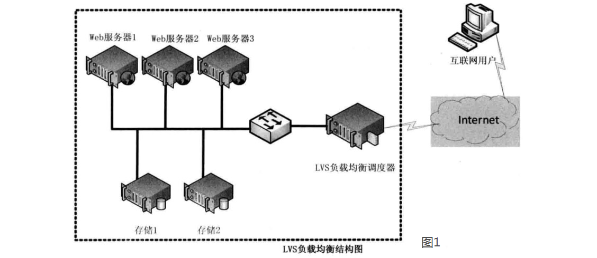


**二、三种工作模式的解析。**

**1、基于NAT的LVS模式负载均衡**

​      NAT（Network Address Translation）即网络地址转换，其作用是通过数据报头的修改，使得位于企业内部的私有IP地址可以访问外网，以及外部用用户可以访问位于公司内部的私有IP主机。VS/NAT工作模式拓扑结构如图2所示，LVS负载调度器可以使用两块网卡配置不同的IP地址，eth0设置为私钥IP与内部网络通过交换设备相互连接，eth1设备为外网IP与外部网络联通。

​       第一步，用户通过互联网DNS服务器解析到公司负载均衡设备上面的外网地址，相对于真实服务器而言，LVS外网IP又称VIP（Virtual IP Address），用户通过访问VIP，即可连接后端的真实服务器（Real Server），而这一切对用户而言都是透明的，用户以为自己访问的就是真实服务器，但他并不知道自己访问的VIP仅仅是一个调度器，也不清楚后端的真实服务器到底在哪里、有多少真实服务器。

   第二步，用户将请求发送至124.126.147.168，此时LVS将根据预设的算法选择后端的一台真实服务器（192.168.0.1~192.168.0.3），将数据请求包转发给真实服务器，并且在转发之前LVS会修改数据包中的目标地址以及目标端口，目标地址与目标端口将被修改为选出的真实服务器IP地址以及相应的端口。

​    第三步，真实的服务器将响应数据包返回给LVS调度器，调度器在得到响应的数据包后会将源地址和源端口修改为VIP及调度器相应的端口，修改完成后，由调度器将响应数据包发送回终端用户，另外，由于LVS调度器有一个连接Hash表，该表中会记录连接请求及转发信息，当同一个连接的下一个数据包发送给调度器时，从该Hash表中可以直接找到之前的连接记录，并根据记录信息选出相同的真实服务器及端口信息。

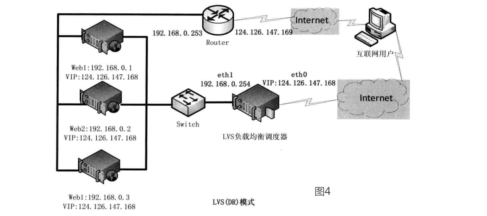


**2、基于TUN的LVS负载均衡**

​       在LVS（NAT）模式的集群环境中，由于所有的数据请求及响应的数据包都需要经过LVS调度器转发，如果后端服务器的数量大于10台，则调度器就会成为整个集群环境的瓶颈。我们知道，数据请求包往往远小于响应数据包的大小。因为响应数据包中包含有客户需要的具体数据，所以LVS（TUN）的思路就是将请求与响应数据分离，让调度器仅处理数据请求，而让真实服务器响应数据包直接返回给客户端。VS/TUN工作模式拓扑结构如图3所示。其中，IP隧道（IP tunning）是一种数据包封装技术，它可以将原始数据包封装并添加新的包头（内容包括新的源地址及端口、目标地址及端口），从而实现将一个目标为调度器的VIP地址的数据包封装，通过隧道转发给后端的真实服务器（Real Server），通过将客户端发往调度器的原始数据包封装，并在其基础上添加新的数据包头（修改目标地址为调度器选择出来的真实服务器的IP地址及对应端口），LVS（TUN）模式要求真实服务器可以直接与外部网络连接，真实服务器在收到请求数据包后直接给客户端主机响应数据。


**3、基于DR的LVS负载均衡**

​	在LVS（TUN）模式下，由于需要在LVS调度器与真实服务器之间创建隧道连接，这同样会增加服务器的负担。与LVS（TUN）类似，DR模式也叫直接路由模式，其体系结构如图4所示，该模式中LVS依然仅承担数据的入站请求以及根据算法选出合理的真实服务器，最终由后端真实服务器负责将响应数据包发送返回给客户端。与隧道模式不同的是，直接路由模式（DR模式）要求调度器与后端服务器必须在同一个局域网内，VIP地址需要在调度器与后端所有的服务器间共享，因为最终的真实服务器给客户端回应数据包时需要设置源IP为VIP地址，目标IP为客户端IP，这样客户端访问的是调度器的VIP地址，回应的源地址也依然是该VIP地址（真实服务器上的VIP），客户端是感觉不到后端服务器存在的。由于多台计算机都设置了同样一个VIP地址，所以在直接路由模式中要求调度器的VIP地址是对外可见的，客户端需要将请求数据包发送到调度器主机，而所有的真实服务器的VIP地址必须配置在Non-ARP的网络设备上，也就是该网络设备并不会向外广播自己的MAC及对应的IP地址，真实服务器的VIP对外界是不可见的，但真实服务器却可以接受目标地址VIP的网络请求，并在回应数据包时将源地址设置为该VIP地址。调度器根据算法在选出真实服务器后，在不修改数据报文的情况下，将数据帧的MAC地址修改为选出的真实服务器的MAC地址，通过交换机将该数据帧发给真实服务器。整个过程中，真实服务器的VIP不需要对外界可见。


**三、LVS负载均衡调度算法**

​      根据前面的介绍，我们了解了LVS的三种工作模式，但不管实际环境中采用的是哪种模式，调度算法进行调度的策略与算法都是LVS的核心技术，LVS在内核中主要实现了一下十种调度算法。

**1.轮询调度**

轮询调度（Round Robin 简称'RR'）算法就是按依次循环的方式将请求调度到不同的服务器上，该算法最大的特点就是实现简单。轮询算法假设所有的服务器处理请求的能力都一样的，调度器会将所有的请求平均分配给每个真实服务器。

**2.加权轮询调度**

加权轮询（Weight Round Robin 简称'WRR'）算法主要是对轮询算法的一种优化与补充，LVS会考虑每台服务器的性能，并给每台服务器添加一个权值，如果服务器A的权值为1，服务器B的权值为2，则调度器调度到服务器B的请求会是服务器A的两倍。权值越高的服务器，处理的请求越多。

**3.最小连接调度**

最小连接调度（Least Connections 简称'LC'）算法是把新的连接请求分配到当前连接数最小的服务器。最小连接调度是一种动态的调度算法，它通过服务器当前活跃的连接数来估计服务器的情况。调度器需要记录各个服务器已建立连接的数目，当一个请求被调度到某台服务器，其连接数加1；当连接中断或者超时，其连接数减1。

（集群系统的真实服务器具有相近的系统性能，采用最小连接调度算法可以比较好地均衡负载。)

**4.加权最小连接调度**

加权最少连接（Weight Least Connections 简称'WLC'）算法是最小连接调度的超集，各个服务器相应的权值表示其处理性能。服务器的缺省权值为1，系统管理员可以动态地设置服务器的权值。加权最小连接调度在调度新连接时尽可能使服务器的已建立连接数和其权值成比例。调度器可以自动问询真实服务器的负载情况，并动态地调整其权值。

**5.基于局部的最少连接**

基于局部的最少连接调度（Locality-Based Least Connections 简称'LBLC'）算法是针对请求报文的目标IP地址的 负载均衡调度，目前主要用于Cache集群系统，因为在Cache集群客户请求报文的目标IP地址是变化的。这里假设任何后端服务器都可以处理任一请求，算法的设计目标是在服务器的负载基本平衡情况下，将相同目标IP地址的请求调度到同一台服务器，来提高各台服务器的访问局部性和Cache命中率，从而提升整个集群系统的处理能力。LBLC调度算法先根据请求的目标IP地址找出该目标IP地址最近使用的服务器，若该服务器是可用的且没有超载，将请求发送到该服务器；若服务器不存在，或者该服务器超载且有服务器处于一半的工作负载，则使用'最少连接'的原则选出一个可用的服务器，将请求发送到服务器。

**6.带复制的基于局部性的最少连接**

带复制的基于局部性的最少连接（Locality-Based Least Connections with Replication  简称'LBLCR'）算法也是针对目标IP地址的负载均衡，目前主要用于Cache集群系统，它与LBLC算法不同之处是它要维护从一个目标IP地址到一组服务器的映射，而LBLC算法维护从一个目标IP地址到一台服务器的映射。按'最小连接'原则从该服务器组中选出一一台服务器，若服务器没有超载，将请求发送到该服务器；若服务器超载，则按'最小连接'原则从整个集群中选出一台服务器，将该服务器加入到这个服务器组中，将请求发送到该服务器。同时，当该服务器组有一段时间没有被修改，将最忙的服务器从服务器组中删除，以降低复制的程度。

**7.目标地址散列调度**

目标地址散列调度（Destination Hashing 简称'DH'）算法先根据请求的目标IP地址，作为散列键（Hash Key）从静态分配的散列表找出对应的服务器，若该服务器是可用的且并未超载，将请求发送到该服务器，否则返回空。

**8.源地址散列调度U**

源地址散列调度（Source Hashing  简称'SH'）算法先根据请求的源IP地址，作为散列键（Hash Key）从静态分配的散列表找出对应的服务器，若该服务器是可用的且并未超载，将请求发送到该服务器，否则返回空。它采用的散列函数与目标地址散列调度算法的相同，它的算法流程与目标地址散列调度算法的基本相似。

**9.最短的期望的延迟**

最短的期望的延迟调度（Shortest Expected Delay 简称'SED'）算法基于WLC算法。举个例子吧，ABC三台服务器的权重分别为1、2、3 。那么如果使用WLC算法的话一个新请求进入时它可能会分给ABC中的任意一个。使用SED算法后会进行一个运算

A：（1+1）/1=2   B：（1+2）/2=3/2   C：（1+3）/3=4/3   就把请求交给得出运算结果最小的服务器。

**10.最少队列调度**

最少队列调度（Never Queue 简称'NQ'）算法，无需队列。如果有realserver的连接数等于0就直接分配过去，不需要在进行SED运算。


## 进程和线程的区别 

进程有独立的地址空间，一个进程崩溃后，在保护模式下不会对其它进程产生影响。 
而线程只是进程中的不同执行路径。线程有自己的堆栈和局部变量，但线程之间没有单独的地址空间， 
一个线程死掉就等于整个进程死掉。 
所以多进程的程序要比多线程的程序健壮，但在进程切换时，耗费资源较大，效率要差一些


## RabbitMQ是什么

RabbitMQ也就是消息队列中间件，消息中间件是在消息的传息过程中保存消息的容器
消息中间件再将消息从它的源中到它的目标中标时充当中间人的作用
队列的主要目的是提供路由并保证消息的传递；如果发送消息时接收者不可用
消息队列不会保留消息，直到可以成功地传递为止，当然，消息队列保存消息也是有期限地


## 优化Linux系统

1. 不用root，添加普通用户，通过sudo授权管理

2. 更改默认的远程连接SSH服务端口及禁止root用户远程连接

3. 定时自动更新服务器时间

4. 配置国内yum源

5. 关闭selinux及iptables（iptables工作场景如果有外网IP一定要打开，高并发除外）

6. 调整文件描述符的数量

7. 精简开机启动服务（crond rsyslog network sshd）

8. 内核参数优化（/etc/sysctl.conf）

9. 更改字符集，支持中文，但建议还是用英文字符集，防止乱码

10. 锁定关键系统文件
11. 清空/etc/issue，去除系统及内核版本登录前的屏幕显示


## ELK介绍

**1.ELK分别表示什么？**

三个开源软件 elasticsearch logstash kibana

**2.elasticsearch的特点是什么**

elasticsearch，基于lucene开发，隐藏了复杂性，提供了简单易用的restful api接口，Java api 接口（以及其他语言的api接口）Elasticsearch是当前主流的分布式大数据存储和搜索引擎，可以为用户提供强大的全文本检索能力，广泛应用于日志检索，全站搜索等领域。Logstash作为Elasicsearch常用的实时数据采集引擎，可以采集来自不同数据源的数据，并对数据进行处理后输出到多种输出源，是Elastic Stack 的重要组成部分。

elasticsearch基本特点：

①：分布式的文档存储引擎

②：分布式的搜索引擎和分析引擎

③：分布式，支持PB级数据

**3.kibana的特点和作用是什么**

所有类型的数据集中处理

不同模式和格式数据的正常化

自定义日志格式的迅速扩展

为自定义数据源轻松添加插件

提供web页面进行可视化展示

**4.logstash的特点和作用是什么**

Logstash 能够动态地采集、转换和传输数据，不受格式或复杂度的影响。利用 Grok 从非结构化数据中派生出结构，从 IP 地址解码出地理坐标，匿名化或排除敏感字段，并简化整体处理过程。

Logstash 是开源的服务器端数据处理管道，能够同时 从多个来源采集数据、转换数据，然后将数据发送到您最喜欢的 “存储库” 中。（我们的存储库当然是 Elasticsearch。）

可伸缩性 可过滤 作用就是一款强大的数据处理，可实现数据传输，格式处理，格式化输出，还有强大的插件功能，常用于日志处理

**5.ELK能做什么？**

ELK组件在海量日志系统的运维中，可用于解决：

\- 分布式日志数据集中式查询和管理

\- 系统监控，包含系统硬件和应用各个组件的监控

\- 故障排查

\- 安全信息和事件管理

\- 报表功能

**6.ELK在你使用的过程中主要用来做什么？**

分析系统日志，访问日志，应用日志，分析数据

**7.elasticSearch 中的集群，节点，文档，类型和索引是什么**

集群：一个集群是由一个多个组成的集合，集群上的节点将会存储数据，并提供跨界点的所用和搜索过滤

节点：一个节点就是一个elasticsearch服务，可以是现存书数据，索引并且搜索的功能，和集群一样，每一个节点都有唯一的名称为标识

文档：elaticsearch是面向文档这意味着特可以存储关于整个对象或文档，然而它不仅仅是为存储，还会索

引每个文档的内容是指可以被搜索

索引：在elasticsearch中存储数据的行为较为索引

类型：文档属于一种类型而这类型存在于索引中，我们可以画一些简单的对比图来比传统关系数据库


## Redis和memcache的区别	

(1) Redis和Memcache都是将数据存放在内存中，都是内存数据库。不过memcache还可用于缓存其他东西，例如图片、视频等等。 

(2) Redis不仅仅支持简单的k/v类型的数据，同时还提供list，set，hash等数据结构的存储。

(3) 存储数据安全--memcache挂掉后，数据没了;redis可以定期保存到磁盘(持久化)

(4) redis目前官方只支持LINUX 上去运行

(5) Redis支持数据的备份，即master-slave模式的数据备份

(6) 个人总结一下，有持久化需求或者对数据结构和处理有高级要求的应用，选择redis，其他简单的key/value存储，选择memcache


## linux中的软硬链接

1.5.1 链接的概念

在Linux系统中，链接分为两种：一种为硬链接（Hard Link），另一种为软链接（Symbolic Link or Soft Link）。链接由ln命令创建，默认不带参数的情况下，执行ln命令创建的是硬链接，# ln -s命令创建的是软链接。创建命令如下：

硬链接：# ln  源文件  创建的目标文件

软链接：# ln  -s  源文件  创建的目标文件

 

1.5.2 硬链接

硬链接通过索引节点（inode）来进行链接。**在Linux文件系统中，多个文件名指向同一个索引节点（inode），这是被允许的，这种情况被称为文件的硬链接。硬链接的作用之一，就是允许一个文件拥有多个有效路径（多个入口），这样用户可以建立硬链接到重要的文件，防止“误删”源数据。**只要文件还存在一个以上的硬链接，删除其中的一个硬链接（删除了该文件的链接指向），不影响索引节点和其他的链接，即数据文件实体并未被删除。只有当最后一个链接被删除后，此时，如果有新的数据要存储到硬盘上，或系统通过类似fsck检查磁盘时，被删除文件的数据块及目录的链接才会被释放，空间被新的数据覆盖。**也就是说，在Linux系统中，**删除静态文件（没有进程调用，目录也是文件）的条件是与之相关的所有硬链接文件均被删除，文件才会被删除。

 

**对硬链接有如下限制：** 

不能对目录文件做硬链接。 

不能在不同的文件系统之间做硬链接。

就是说，链接文件和被链接文件必须位于同一个文件系统中。

 

1.5.3 软链接

软链接（Soft Link）也叫符号链接（Symbolic Link）。Linux系统里的软链接就相当于Windows里的快捷方式。软链接可以理解为一个文本文件，这个文件中包含有软链接指向另一源文件的位置信息内容。因此，通过软链接可以快速定位到软链接所指向的源文件实体。


## 网站访问慢的原因

1、服务器负载过大忙不过来，无法承担巨大的流量。

2、访问量过载

3、网站代码的繁琐

4、站点存在大量的JS调用

5、服务器出口带宽不够用。

6、服务器负载过大忙不过来，无法承担巨大的流量。

7、数据库的瓶颈，数据库文件过大，造成读取缓慢，没有建立索引，造成每次查询都对数据库进行全局查询。

8、没有设置CDN。

9、可能遭受到了分布式拒绝攻击即DDOS攻击或者中病毒木马。

10、死链接：死链接是指残留的网站中不存在的页面，即网站改变前的页面，改动后删除此页面，但是搜索引擎已经收录了，这样的页面称为死链接，用户通过死链接访问是会出现打不开的现象

11、站点图片大：网站都会有大量的图片，如果这些图片没有被优化，就会很大。会影响网站的打开速度

 

**怎么优化网站的打开速度**

解决办法：

1.查看线上服务器的负载情况，CPU负载，内存负载，网络带宽，查看是否已经过载。

2.查看网络连接情况，是否受到DDOS攻击，消耗尽带宽资源，造成无法提供服务。

3.查看MySQL数据库的日志文件，查看mysql慢查询日志，查看造成MySQL访问过慢的原因。

4.可以查看应用程序的日志，如Apache，nginx，PHP，Tomcat日志文件，找出报错原因，查看是否是代码问题。

5.精简代码

6.优化缓存

7.图片压缩


## zabbix分布式监控

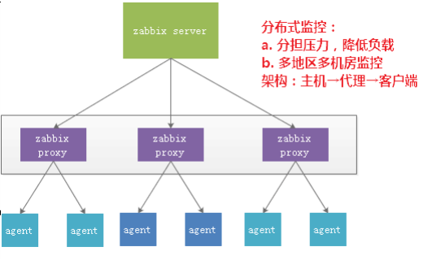

**思路：**

**Zabbix-agent 端======》zabbix-proxy======》zabbix-server 端**

**所以：**

**Zabbix-agent 的服务端的 ip 为 zabbix-proxy 的 IP 地址**

**Zabbix-proxy 的服务端的 ip 为 zabbix-server 的 IP 地址**

**zabbix有哪些监控方式，主动还是被动(主被动模式都是相对于zabbix-agent来说的)**

**主动**是zabbix-agent主动获取的主机监控项列表，并主动将监控项内需要检测的数据提交给zabbix-server或zabbix-proxy

**被动**是zabbix-server想zabbix-agent请求获取监控项的数据，zabbix-agent返回数据


## 动态网页与静态网页

所谓的动态网页，是指跟静态网页相对的一种网页编程技术。静态网页，随着html代码的生成，页面的内容和显示效果就基本上不会发生变化了——除非你修改页面代码。而动态网页则不然，页面代码虽然没有变，但是显示的内容却是可以随着时间、环境或者数据库操作的结果而发生改变的。
值得强调的是，不要将动态网页和页面内容是否有动感混为一谈。这里说的动态网页，与网页上的各种动画、滚动字幕等视觉上的动态效果没有直接关系，动态网页也可以是纯文字内容的，也可以是包含各种动画的内容，这些只是网页具体内容的表现形式，无论网页是否具有动态效果，只要是采用了动态网站技术生成的网页都可以称为动态网页。

总之，动态网页是基本的html语法规范与Java、VB、Vc等高级程序设计语言、数据库编程等多种技术的融合，以期实现对网站内容和风格的高效、动态和交互式的管理。因此，从这个意义上来讲，凡是结合了HTML以外的高级程序设计语言和数据库技术进行的网页编程技术生成的网页都是动态网页。

常用的4种动态网页技术asp，jsp，php，cgi等

**动态页面特征**

(1)一般以数据库技术为基础，可以大大降低网站维护的工作量；
(2)采用动态网页技术的网站可以实现更多的功能，如用户注册、用户登录、在线调查、用户管理、订单管理等等；
(3)动态网页实际上并不是独立存在于服务器上的网页文件，只有当用户请求时服务器才返回一个完整的网页；
(4)动态网页中的“?”对搜索引擎检索存在一定的问题，搜索引擎一般不可能从一个网站的数据库中访问全部网页，或者出于技术方面的考虑，搜索之中不去抓取网址中“?”后面的内容，因此采用动态网页的网站在进行搜索引擎推广时需要做一定的技术处理才能适应搜索引擎的要求。

**静态网页**

也就是以.htm、.html、.shtml、.xml等为后后缀的。在超文本标记语言格式的网页上，也可以出现各种动态的效果，如.GIF格式的动画、FLASH、滚动字母等，这些“动态效果”只是视觉上的，与下面将要介绍的动态网页是不同的概念。在网站设计中，纯粹超文本标记语言格式的网页通常被称为“静态网页”，早期的网站一般都是由静态网页制作的。 [

静态网页是相对于动态网页而言，是指没有后台数据库、不含程序和不可交互的网页。你编的是什么它显示的就是什么、不会有任何改变。静态网页相对更新起来比较麻烦，适用于一般更新较少的展示型网站。


## Linux的孤儿进程与僵尸进程(Unix系统编程)

**1、基本概念**

　　我们知道在unix/linux中，正常情况下，**子进程是通过父进程创建的，子进程在创建新的进程。子进程的结束和父进程的运行是一个异步过程,即父进程永远无法预测子进程 到底什么时候结束。** 当一个 进程完成它的工作终止之后，它的父进程需要调用wait()或者waitpid()系统调用取得子进程的终止状态。

　　**孤儿进程：**一个父进程退出，而它的一个或多个子进程还在运行，那么那些子进程将成为孤儿进程。孤儿进程将被init进程(进程号为1)所收养，并由init进程对它们完成状态收集工作。

　　**僵尸进程：**一个进程使用fork创建子进程，如果子进程退出，而父进程并没有调用wait或waitpid获取子进程的状态信息，那么子进程的进程描述符仍然保存在系统中。这种进程称之为僵死进程。

**2、问题及危害**

　　unix提供了一种机制可以保证只要父进程想知道子进程结束时的状态信息， 就可以得到。

这种机制就是: 在每个进程退出的时候,内核释放该进程所有的资源,包括打开的文件,占用的内存等。 但是仍然为其保留一定的信息(包括进程号the process ID,退出状态the termination status of the process,运行时间the amount of CPU time taken by the process等)。直到父进程通过wait / waitpid来取时才释放。 但这样就导致了问题，如果进程不调用wait / waitpid的话， 那么保留的那段信息就不会释放，其进程号就会一直被占用，但是**系统所能使用的进程号是有限的**，如果大量的产生僵死进程，将因为没有可用的进程号而导致系统不能产生新的进程. 此即为僵尸进程的危害，应当避免。

　　孤儿进程是没有父进程的进程，孤儿进程这个重任就落到了init进程身上，init进程就好像是一个民政局，专门负责处理孤儿进程的善后工作。每当出现一个孤儿进程的时候，内核就把孤 儿进程的父进程设置为init，而init进程会循环地wait()它的已经退出的子进程。这样，当一个孤儿进程凄凉地结束了其生命周期的时候，init进程就会代表党和政府出面处理它的一切善后工作。因此孤儿进程并不会有什么危害。

　　任何一个子进程(init除外)在exit()之后，并非马上就消失掉，而是留下一个称为僵尸进程(Zombie)的数据结构，等待父进程处理。这是每个 子进程在结束时都要经过的阶段。如果子进程在exit()之后，父进程没有来得及处理，这时用ps命令就能看到子进程的状态是“Z”。如果父进程能及时 处理，可能用ps命令就来不及看到子进程的僵尸状态，但这并不等于子进程不经过僵尸状态。  如果父进程在子进程结束之前退出，则子进程将由init接管。init将会以父进程的身份对僵尸状态的子进程进行处理。

**3、僵尸进程危害场景：**

　　例如有个进程，它定期的产生一个子进程，这个子进程需要做的事情很少，做完它该做的事情之后就退出了，因此这个子进程的生命周期很短，但是，父进程只管生成新的子进程，至于子进程 退出之后的事情，则一概不闻不问，这样，系统运行上一段时间之后，系统中就会存在很多的僵死进程，倘若用ps命令查看的话，就会看到很多状态为Z的进程。 严格地来说，僵死进程并不是问题的根源，罪魁祸首是产生出大量僵死进程的那个父进程。因此，当我们寻求如何消灭系统中大量的僵死进程时，答案就是把产生大 量僵死进程的那个元凶枪毙掉（也就是通过kill发送SIGTERM或者SIGKILL信号啦）。枪毙了元凶进程之后，它产生的僵死进程就变成了孤儿进 程，这些孤儿进程会被init进程接管，init进程会wait()这些孤儿进程，释放它们占用的系统进程表中的资源，这样，这些已经僵死的孤儿进程 就能瞑目而去了。

**4、孤儿进程和僵尸进程测试**

孤儿进程测试程序如下所示：

```c
vim test.c

#include <stdio.h>
#include <stdlib.h>
#include <errno.h>
#include <unistd.h>

int main()
{
    pid_t pid;
    //创建一个进程
    pid = fork();
    //创建失败
    if (pid < 0)
    {
        perror("fork error:");
        exit(1);
    }
    //子进程
    if (pid == 0)
    {
        printf("I am the child process.\n");
        //输出进程ID和父进程ID
        printf("pid: %d\tppid:%d\n",getpid(),getppid());
        printf("I will sleep five seconds.\n");
        //睡眠5s，保证父进程先退出
        sleep(5);
        printf("pid: %d\tppid:%d\n",getpid(),getppid());
        printf("child process is exited.\n");
    }
    //父进程
    else
    {
        printf("I am father process.\n");
        //父进程睡眠1s，保证子进程输出进程id
        sleep(1);
        printf("father process is  exited.\n");
    }
    return 0;
}
```

测试：

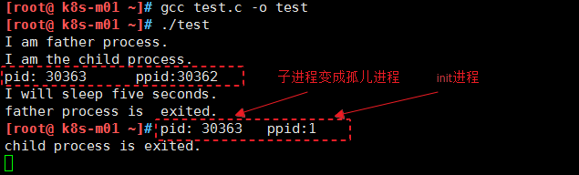

**僵尸进程测试程序如下所示：**

```c
vim test1.c

#include <stdio.h>
#include <unistd.h>
#include <errno.h>
#include <stdlib.h>

int main()
{
        pid_t pid;
        pid = fork();
        if (pid < 0)
        {
                perror("fork error:");
                exit(1);
        }
        else if (pid == 0)
        {
                printf("I am child process.I am exiting.\n");
                exit(0);
        }
        printf("I am father process.I will sleep two seconds\n");
        //等待子进程先退出
        sleep(2);
        //输出进程信息
        system("ps -o pid,ppid,state,tty,command");
        printf("father process is exiting.\n");
        return 0;
}
```

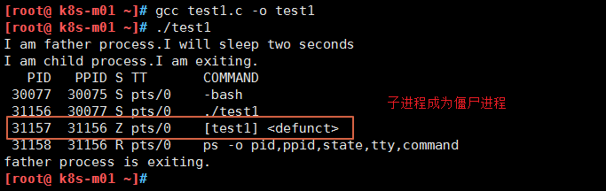


**5、僵尸进程解决办法**

**（1）通过信号机制**

　　子进程退出时向父进程发送SIGCHILD信号，父进程处理SIGCHILD信号。在信号处理函数中调用wait进行处理僵尸进程。

 **（2）fork两次**
　　《Unix 环境高级编程》8.6节说的非常详细。原理是将子进程成为孤儿进程，从而其的父进程变为init进程，通过init进程可以处理僵尸进程。测试程序如下所示： 

5、参考资料

《unix环境高级编程》第八章

http://www.rosoo.net/a/201109/15071.html

http://blog.chinaunix.net/uid-1829236-id-3166986.html

http://forkhope.diandian.com/post/2012-10-01/40040574200

http://blog.csdn.net/metasearch/article/details/2498853

http://blog.csdn.net/yuwenliang/article/details/6770750

摘自:http://www.cnblogs.com/Anker/p/3271773.html


## Linux下删除大量小文件效率对比

**首先建立50万个文件**

```shell
mkdir test && cd test 
for i in $(seq 1 500000);do echo text >>$i.txt;done
```

**1.  rm删除**

```shell
time rm -f *
zsh: sure you want to delete all the files in /home/hungerr/test [yn]? y
zsh: argument list too long: rm
rm -f *  3.63s user 0.29s system 98% cpu 3.985 total
由于文件数量过多，rm不起作用。
```

**2.  find删除**

```shell
time find ./ -type f -exec rm {} \;

find ./ -type f -exec rm {} \;  49.86s user 1032.13s system 41% cpu 43:19.17 total
大概43分钟,我的电脑。。。。。。边看视频边删的。
```

**3.  find with delete**

```shell
time find ./ -type f -delete

find ./ -type f -delete  0.43s user 11.21s system 2% cpu 9:13.38 total
用时9分钟。
```

**4.  rsync删除**

```shell
# 首先建立空文件夹
mkdir blanktest
time rsync -a --delete blanktest/ test/

rsync -a --delete blanktest/ test/  0.59s user 7.86s system 51% cpu 16.418 total
16s，很好很强大。
```

**5.  Python删除**

```python
import os
import timeit
def main():
    for pathname,dirnames,filenames in os.walk('/home/username/test'):
        for filename in filenames:
            file=os.path.join(pathname,filename)
            os.remove(file)
            
if __name__=='__main__':
t=timeit.Timer('main()','from __main__ import main')
print t.timeit(1)　　
1
2

$ python test.py
529.309022903
大概用时9分钟。
```

**6.  Perl删除**

```perl
time perl -e 'for(<*>){((stat)[9]<(unlink))}'

perl -e 'for(<*>){((stat)[9]<(unlink))}'  1.28s user 7.23s system 50% cpu 16.784 total
16s，这个应该最快了。
```

**7、结果：**

```shell
rm：文件数量太多，不可用
find with -exec 50万文件耗时43分钟
find with -delete 9分钟
Perl  16s
Python 9分钟
rsync with -delete  16s
```

结论：删除大量小文件rsync最快，最方便。


## cache 和 buffer的区别

　　**Cache：高速缓存**，是位于CPU与主内存间的一种容量较小但速度很高的存储器。由于CPU的速度远高于主内存，CPU直接从内存中存取数据要等待一定时间周期，Cache中保存着CPU刚用过或循环使用的一部分数据，当CPU再次使用该部分数据时可从Cache中直接调用,这样就减少了CPU的等待时间,提高了系统的效率。Cache又分为一级Cache(L1 Cache)和二级Cache(L2 Cache)，L1 Cache集成在CPU内部，L2 Cache早期一般是焊在主板上,现在也都集成在CPU内部，常见的容量有256KB或512KB L2 Cache。

　　**Buffer：缓冲区**，一个用于存储速度不同步的设备或优先级不同的设备之间传输数据的区域。通过缓冲区，可以使进程之间的相互等待变少，从而使从速度慢的设备读入数据时，速度快的设备的操作进程不发生间断。

cache是高速缓存，用于CPU和内存之间的缓冲；

buffer是I/O缓存，用于内存和硬盘的缓冲

缓存（cache）是把读取过的数据保存起来，重新读取时若命中（找到需要的数据）就不要去读硬盘了，若没有命中就读硬盘。其中的数据会根据读取频率进行组织，把最频繁读取的内容放在最容易找到的位置，把不再读的内容不断往后排，直至从中删除。

缓冲（buffers）是根据磁盘的读写设计的，把分散的写操作集中进行，减少磁盘碎片和硬盘的反复寻道，从而提高系统性能。linux有一个守护进程定期清空缓冲内容（即写如磁盘），也可以通过sync命令手动清空缓冲。

buffer：为了解决写磁盘的效率 cache：为了解决读磁盘的效率


## MBR和GPT分区的区别

Linux系统中有MBR和GPT两中分区机制，其中MBR的使用比较多，但是有限制。GPT是比MBR更新的一个分区机制。本文就来介绍一下Linux系统MBR和GPT分区的区别。

**MBR（Master Boot Record）**

　　主引导记录，是传统的分区机制，应用于绝大多数使用BIOS的PC设备

　　MBR支持32位和64位系统。

　　MBR支持分区数量有限。

　　MBR只支持不超过2T的硬盘，超过2T的硬盘将只能用2T空间（有第三方解决方法）。

**GPT（GUID Partition Table）**

　　全局唯一标识分区表，是一个较新的分区机制，解决了MBR很多缺点。

　　支持超过2T的磁盘（64位寻址空间）。fdisk最大只能建立2TB大小的分区，创建一个大于2TB的分区使用parted。

　　向后兼容MBR。

　　必须在支持uEFI的硬件上才能使用（Intel提出，用于取代BIOS）。

　　必须使用64位系统。

　　Mac、Linux系统都能支持GPT分区格式。

　　Windows 7/8 64bit、Windows Server 2

以上就是Linux系统MBR和GPT分区的区别，总得来说GPT比MBR更先进，但是MBR的兼容性比GPT要好。

GPT格式的磁盘相当于原来MBR磁盘中原来保留4个partition table的4*16个字节，只留第一个16个字节，类似于扩展分区，真正的partitiontable在512字节之后，GPT磁盘没有四个主分区的限制。


## 开机挂载mount /etc/fstab与/etc/rc.d/rc.local区别及详解


开机挂载mount etc/fstab与/etc/rc.d/rc.local差不多，差别就是如果你有程序依赖于NFS的话还是的放到fstab比较好。程序启动先加载/etc/fastab文件。

放fstab里面会在程序启动前加载上NFS文件系统，放到rc.local里往往造成程序启动加载时找不到路径

**一、/etc/fstab 参数详解及如何设置开机自动挂载**

某些时候当Linux系统下划分了新的分区后，需要将这些分区设置为开机自动挂载，否则，Linux是无法使用新建的分区的。 /etc/fstab 文件负责配置Linux开机时自动挂载的分区。

Windows的文件结构是多个并列的树状结构，最顶部的是不同的磁盘（分区），如：C，D，E，F等。

Linux的文件结构是单个的树状结构。最顶部的 为根目录，即/。在根目录下，分为多个子目录，包括/bin、/boot、/dev、/etc、/home、/lib、/media、/mnt、 /opt、/proc、/root、/sbin、/tmp、/usr和/var等。

磁盘Linux分区都必须挂载到目录树中的某个具体的目录上才能进行读写操作，而fstab正是负责这一配置。显然，根目录是所有Linux的文件和目录 所在的地方，需要挂载上一个磁盘分区。上面还提到，Linux分区交换也需要独立使用一个分区，因此，安装一个Linux至少需要两个分区。（事实上，只 使用一个分区安装Linux也是可能的，而且，如果电脑的物理内存足够大，交换分区并不是必须的）


**/etc/fstab文件详解**

一、/etc/fstab文件的作用

设置开机启动加载的文件

二、挂载的限制

　　1、根目录是必须挂载的，而且一定要先于其他mount point被挂载。因为目录都是由根目录衍生出来的。

　　2、挂载点必须是已经存在的目录。

　　3、挂载点的指定可以任意，但必须遵守必要的系统目录架构原则

　　4、所有挂载点在同一时间只能被挂载一次

　　5、所有分区在同一时间只能挂载一次

　　6、若进行卸载，必须将工作目录退出挂载点（及其子目录）之外。

三、/etc/fstab参数

 

```
[root@wanjiaji ~]# cat /etc/fstab 

# /etc/fstab
# Created by anaconda on Thu Mar  9 18:02:48 2017
# Accessible filesystems, by reference, are maintained under '/dev/disk'
# See man pages fstab(5), findfs(8), mount(8) and/or blkid(8) for more info

UUID=ca1a0a55-4f64-4237-8cfd-8e0f0273ee11    /        ext4    defaults     1 1
UUID=d32e6ee0-ce9b-473c-930b-65c53339f708   /boot       ext4    defaults     1 2
UUID=de634a2f-51c0-415c-83be-836f8126d167   swap       swap    defaults     0 0

tmpfs                    /dev/shm      tmpfs    defaults     0 0
devpts                   /dev/pts      devpts  gid=5,mode=620   0 0
sysfs                     /sys        sysfs   defaults     0 0
proc                     /proc        proc    defaults     0 0
```

***在文件中一共有六列。***

***第一列：Device：磁盘设备文件或者该设备的Label或者UUID***

　　1）查看分区的label和uuid

 　  Label就是分区的标签，挂载点就是标签的名字。可以通过查看分区的superblock中的信息找到UUID和Label name。

　　例如:我们要查看/dev/sda1这个设备的uuid和label name

```
[root@wanjiaji ~]# dumpe2fs -h /dev/sda1

dumpe2fs 1.35 (28-Feb-2004)
Filesystem volume name:  /boot  //这个就是Label name
Last mounted on:      <not available>
Filesystem UUID:      3b10fe13-def4-41b6-baae-9b4ef3b3616c   //UUID
Filesystem magic number:  0xEF53
Filesystem revision #:   1 (dynamic)
Filesystem features:    has_journal ext_attr resize_inode dir_index filetype needs_recovery sparse_super

Default mount options
```

简单查看

```shell
[root@wanjiaji ~]# blkid /dev/sda1

/dev/sda1: UUID="d32e6ee0-ce9b-473c-930b-65c53339f708" TYPE="ext4"
```

2）使用设备名和label及uuid作为标识的不同

    使用设备名称（/dev/sda)来挂载分区时是被固定死的，一旦磁盘的插槽顺序发生了变化，就会出现名称不对应的问题。因为这个名称是会改变的。

不过使用label挂载就不用担心插槽顺序方面的问题。不过要随时注意你的Label name。至于UUID，每个分区被格式化以后都会有一个UUID作为唯一的标识号。使用uuid挂载的话就不用担心会发生错乱的问题了。

***第二列：Mount point：设备的挂载点，就是你要挂载到哪个目录下。***

 ***第三列：filesystem：磁盘文件系统的格式，包括ext2、ext3、reiserfs、nfs、vfat等***

 

***第四列：文件系统的参数***

Async/sync   设置是否为同步方式运行，默认为async

auto/noauto   当下载mount -a 的命令时，此文件系统是否被主动挂载。默认为auto

rw/ro      是否以以只读或者读写模式挂载

exec/noexec   限制此文件系统内是否能够进行"执行"的操作

user/nouser    是否允许用户使用mount命令挂载

suid/nosuid    是否允许SUID的存在

Usrquota    启动文件系统支持磁盘配额模式

Grpquota    启动文件系统对群组磁盘配额模式的支持

Defaults    默认参数的设置

 

***第五列：是否备份***

命令作用：dump是一个用来作为备份的命令。通常这个参数的值为0或者1

0   不要做dump备份

1   每天进行dump的操作

2   不定期的进行dump操作

 

***第六列：是否检验扇区：开机的过程中，系统默认会以fsck检验我们系统是否为完整（clean）。***

0   不检验

1   最早检验（一般根目录会选择）

2  1级别检验完成之后进行检验

 


## swap交换分区和物理内存的关系

Linux系统的swap分区并不是等所有的物理内存都消耗完毕之后，才去使用swap分区的空间，什么时候使用是由swappiness参数值控制。

通过下面的方法可以查看swappiness参数的值：

```
[root@wanjiaji ~]# cat /proc/sys/vm/swappiness 
60
```

结果显示该值默认为60.

其中：

swappiness=0的时候，表示最大限度使用物理内存，然后才使用swap空间，

swappiness=100的时候，表示积极使用swap分区，并把内存上的数据及时的搬运到swap空间中。

现在服务器的内存动不动就是上百G，所以我们可以把这个参数值设置的低一些，让操作系统尽可能的使用物理内存，降低系统对swap的使用，从而提高系统的性能。

修改swappiness参数有临时修改和永久修改两种方法：

**临时修改：**

```shell
[root@rhce ~]# sysctl vm.swappiness=10
vm.swappiness = 10

[root@rhce ~]# cat /proc/sys/vm/swappiness
10
```

这里我们的修改已经生效，但是如果我们重启了系统，又会变成60.

**永久修改：**

```shell
vi /etc/sysctl.conf 文件里添加如下参数：

vm.swappiness=10
```

或者：

```shell
[root@rhce ~]# echo 'vm.swappiness=10'>> /etc/sysctl.conf
```

保存，重启，就生效了


## 系统常见英文报错中文翻译

1.command not found  命令没有找到

2.No such file or directory  没有这个文件或目录

3.Permission denied  权限不足

4.No space left on device  磁盘没有剩余空间

5.File exists  文件已经存在

6.Is a directory  这是1个目录

7.Not a directory  不是1个目录

8.Warning: Changing a readonly file  警告：改变一个只读文件

9.Found a swap file by the name ".1.swp" 发下了一个swap文件名字为1.swp
(vim编辑器碰到的意外关闭文件有缓存文件)

10.unrecognized option '--h'    不识别的选项，去查看帮助 

11.No route to host     没有路由到主机（防火墙没关）

12.connection refused     连接拒绝（防火墙没关或服务端口没开）

13.Access denied     访问拒绝（权限或者selinux）

运维新手英语烂到底，要学好linux域内，到底要不要先学好英语？
答案：不需要！


## 最常见的Linux发行版及目标用户

|       版本名称        |                             特点                             |                            用户                            |                           适用场景                           |
| :-------------------: | :----------------------------------------------------------: | :--------------------------------------------------------: | :----------------------------------------------------------: |
|        Debian         |                           极其稳定                           |        不适合新手用户，而是适合系统管理员和高级用户        |                      非常适合用于服务器                      |
|        Gentoo         | 安装和使用起来很困难；不过它被认为是最佳学习对象，可以进而了解Linux操作系统的内部运作原理 |           适合对Linux已经完全驾轻就熟的那些用户            |                                                              |
|        Ubuntu         |                    最受欢迎的免费操作系统                    |             新手用户肯定爱不释手的一款操作系统             | 侧重于它在这个市场的应用，在服务器、云计算、甚至一些运行Ubuntu Linux的移动设备上很常见 |
| Damn Vulnerable Linux |                    旨在训练管理员的实验室                    |                目的在于借机训练Linux管理员                 |                                                              |
|    红帽企业级Linux    | 提供了非常多的稳定版应用程序，缺点：把太多旧程序包打包起来，支持成本确实相当高 | 系统管理员的第一选择，它有众多的程序包，还有非常到位的支持 | 安全是关注的首要问题，那么红帽企业级Linux的确是款完美的发行版，它使用YUM程序包管理器 |
|        CentOS         |                                                              |                                                            | CentOS使用YUM来管理软件包。非常稳定的程序包；谁要是想在桌面端测试一下服务器的运作原理，都应该试试这款操作系统。Fedora |
|        Fedora         | Fedora就是红帽公司的一个测试平台；产品在成为企业级发行版之前，在该平台上进行开发和测试 |         想尝试最先进的技术，等不及程序的稳定版出来         |                                                              |
|      Kali Linux       | 是Debian的一款衍生版。Kali旨在用于渗透测试用于Debian的所有Binary软件包都可以安装到Kali Linux上，而Kali的魅力或威力就来自于此。 |                                                            |                                                              |
|      Arch Linux       |                                                              |      旨在从开发者的角度而不是从用户的角度做到力求简单      | 一款面向高手的发行版，让你可以了解Linux系统的每一个细枝末节。 |
|       OpenSuse        | 这款Linux发行版是免费的，并不供商业用途使用，仍然供个人使用使用，OpenSuse的真正竞争对手是红帽企业级Linux Yast来管理软件包 |                                                            |                                                              |


## 系统日志

日志文件的默认路径是：/var/log

下面是几个重要的日志文件的路径及其包含的信息：

/var/log/syslog：它和/etc/log/messages日志文件不同，它只记录警告信息，常常是系统出问题的信息。

/var/log/messages：包括整体系统信息，其中也包含系统启动期间的日志。此外，还包括mail，cron，daemon，kern和auth等内容。

/var/log/user.log：记录所有等级用户信息的日志。

/var/log/auth.log：包含系统授权信息，包括用户登录和使用的权限机制等。

/var/log/daemon.log：包含各种系统后台守护进程日志信息。

/var/log/kern.log：包含内核产生的日志，有助于在定制内核时解决问题。


## 一条命令计算1+2..+10,并用bc计算

```shell
方法一
echo `seq -s '+' 10`|bc = echo $((`seq -s '+' 10`))
方法二:
echo {1..10}|tr " " "+"|bc
```


## Systemd 入门教程：实战篇

 http://www.ruanyifeng.com/blog/2016/03/systemd-tutorial-part-two.html 

 https://www.cnblogs.com/klb561/p/9245657.html 

 所有可用的单元文件存放在 `/usr/lib/systemd/system/` 和 `/etc/systemd/system/` 目录（后者优先级更高）。 


## Cgroupfs 与 Systemd关系

 https://www.cnblogs.com/hongdada/p/9771857.html 

 https://blog.csdn.net/ahilll/article/details/82109008 

 https://segmentfault.com/a/1190000016355300 


## QPS、TPS、并发用户数、吞吐量关系

**1、QPS**

**QPS** `Queries Per Second` 是每秒查询率 ,是**一台服务器**每秒能够相应的查询次数，是对一个特定的查询服务器**在规定时间内**所处理流量多少的衡量标准, 即每秒的响应请求数，也即是最大吞吐能力。


**2、TPS**

**TPS** `Transactions Per Second` 也就是事务数/秒。一个事务是指一个客户机向服务器发送请求然后服务器做出反应的过程。客户机在发送请求时开始计时，收到服务器响应后结束计时，以此来计算使用的时间和完成的事务个数。


**3、QPS和TPS区别**

个人理解如下：

1、Tps即每秒处理事务数，包括了

- 用户请求服务器 
- 服务器自己的内部处理 
- 服务器返回给用户

这三个过程，每秒能够完成N个这三个过程，Tps也就是N；

2、Qps基本类似于Tps，但是不同的是，对于一个页面的一次访问，形成一个Tps；但一次页面请求，可能产生多次对服务器的请求，服务器对这些请求，就可计入“Qps”之中。

> 例如：访问一个页面会请求服务器3次，一次放，产生一个“T”，产生3个“Q”


**4、并发数**

并发数（并发度）：指系统同时能处理的请求数量，同样反应了系统的负载能力。这个数值可以分析机器1s内的访问日志数量来得到


**5、吐吞量**

吞吐量是指系统在单位时间内处理请求的数量，TPS、QPS都是吞吐量的常用量化指标。

**系统吞吐量要素**

一个系统的吞吐量（承压能力）与request（请求）对cpu的消耗，外部接口，IO等等紧密关联。

单个request 对cpu消耗越高，外部系统接口，IO影响速度越慢，系统吞吐能力越低，反之越高。

**重要参数**

QPS(TPS),并发数，响应时间

- QPS(TPS)：每秒钟request/事务 数量
- 并发数：系统同时处理的request/事务数
- 响应时间：一般取平均响应时间

**关系**

QPS(TPS)=并发数/平均响应时间

一个系统吞吐量通常有QPS(TPS),并发数两个因素决定，每套系统这个两个值都有一个相对极限值，在应用场景访问压力下，只要某一项达到系统最高值，系统吞吐量就上不去了，如果压力继续增大，系统的吞吐量反而会下降，原因是系统超负荷工作，上下文切换，内存等等其他消耗导致系统性能下降。

**6、PV**

**PV**（Page View）：页面访问量，即页面浏览量或点击量，用户每次刷新即被计算一次。可以统计服务一天的访问日志得到。 

**7、UV** 

**UV**（Unique Visitor）：独立访客，统计1天内访问某站点的用户数。可以统计服务一天的访问日志并根据用户的唯一标识去重得到。响应时间（RT）：响应时间是指系统对请求作出响应的时间，一般取平均响应时间。可以通过Nginx、Apache之类的Web Server得到。 

**8、DAU**

**DAU**(Daily Active User)，日活跃用户数量。常用于反映网站、互联网应用或网络游戏的运营情况。DAU通常统计一日（统计日）之内，登录或使用了某个产品的用户数（去除重复登录的用户），与UV概念相似  

**9、MAU**

**MAU**(Month Active User)：月活跃用户数量，指网站、app等去重后的月活跃用户数量

**10、系统吞吐量评估**

我们在做系统设计的时候就需要考虑CPU运算，IO，外部系统响应因素造成的影响以及对系统性能的初步预估。

而通常情况下，我们面对需求，我们评估出来的出来QPS，并发数之外，还有另外一个维度：日pv。

通过观察系统的访问日志发现，在用户量很大的情况下，各个时间周期内的同一时间段的访问流量几乎一样。比如工作日的每天早上。只要能拿到日流量图和QPS我们就可以推算日流量。

**通常的技术方法：**

1、找出系统的最高TPS和日PV，这两个要素有相对比较稳定的关系（除了放假、季节性因素影响之外）

2、通过压力测试或者经验预估，得出最高TPS，然后跟进1的关系，计算出系统最高的日吞吐量。B2B中文和淘宝面对的客户群不一样，这两个客户群的网络行为不应用，他们之间的TPS和PV关系比例也不一样。

**11、软件性能测试的基本概念和计算公式**

**软件做性能测试时需要关注哪些性能呢？**

首先，开发软件的目的是为了让用户使用，我们先站在用户的角度分析一下，用户需要关注哪些性能。

对于用户来说，当点击一个按钮、链接或发出一条指令开始，到系统把结果已用户感知的形式展现出来为止，这个过程所消耗的时间是用户对这个软件性能的直观印 象。也就是我们所说的响应时间，当相应时间较小时，用户体验是很好的，当然用户体验的响应时间包括个人主观因素和客观响应时间，在设计软件时，我们就需要 考虑到如何更好地结合这两部分达到用户最佳的体验。如：用户在大数据量查询时，我们可以将先提取出来的数据展示给用户，在用户看的过程中继续进行数据检 索，这时用户并不知道我们后台在做什么。

用户关注的是用户操作的相应时间。

其次，我们站在管理员的角度考虑需要关注的性能点。

1、 响应时间
2、 服务器资源使用情况是否合理
3、 应用服务器和数据库资源使用是否合理
4、 系统能否实现扩展
5、 系统最多支持多少用户访问、系统最大业务处理量是多少
6、 系统性能可能存在的瓶颈在哪里
7、 更换那些设备可以提高性能
8、 系统能否支持7×24小时的业务访问

再次，站在开发（设计）人员角度去考虑。

1、 架构设计是否合理
2、 数据库设计是否合理
3、 代码是否存在性能方面的问题
4、 系统中是否有不合理的内存使用方式
5、 系统中是否存在不合理的线程同步方式
6、 系统中是否存在不合理的资源竞争

## centos7进入单用户模式

当我们设置用户密码时，有可能会忘记，这时如何登陆呢，单用户模式就可以

首先我们进入开机界面，按e进行选择

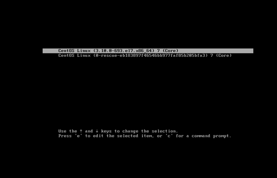

找到linux16这一行，


然后找到图中红线标注的该行，将ro修改为rw并在行尾添加 init=/bin/sh

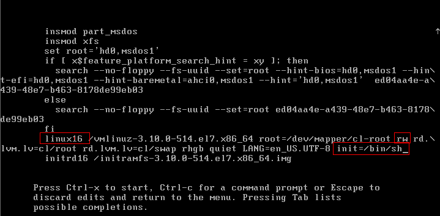

按住Ctrl+x执行

可以进入单用户模式

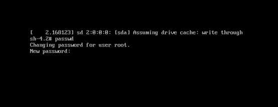

如图所示，我们还可以修改密码，默认修改root密码，也可以修改其他用户的密码passwd junjind

执行exec  /sbin/init 即可退出单用户模式

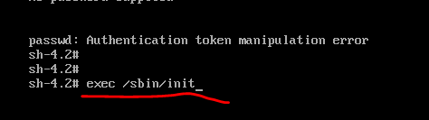


## Centos linux 最大文件数

**问题描述：**

在做linux服务器程序的时候，当流量上来，linux服务器的默认单进程的文件打开数肯定是不够的，一般非root用户进程默认只有1024个文件打开权限，所有对文件的操作，对网络的操作，在linux下都作为一个文件打开，所以在并发量大的时候，这个限制很快就达到了。一旦达到这个限制，应用程序就会报一个：too many open files的错误。解决这个问题就需要增大这个限制。

在Bash中有个ulimit命令，提供了对Shell及该Shell启动的进程的可用资源控制。主要包括打开文件描述符数量、用户的最大进程数量、coredump文件的大小等。

在CentOS5/6等版本中，资源限制的配置可以在/etc/security/limits.conf设置，针对root/user等各个用户或者*代表所有用户来设置。 当然，/etc/security/limits.d/中可以配置，系统是先加载limits.conf然后按照英文字母顺序加载limits.d目录下的配置文件，后加载配置覆盖之前的配置。


下面是我在网上找到的，而且也已经应用在实际服务器的运维上：

```bash
linux默认下open files 是1024，首先看下系统现有的设置

[root@lpmaster ~]# ulimit -a

core file size (blocks, -c) 0 ##设定core文件的最大值

data seg size (kbytes, -d) unlimited ##程序数据节区的最大值

scheduling priority (-e) 0 ##

file size (blocks, -f) unlimited ##shell所能建立的最大文件

pending signals (-i) 71680

max locked memory (kbytes, -l) 32 ##设置在内存中锁定进程的最大值.

max memory size (kbytes, -m) unlimited ##设置可以使用的常驻内存的最大值.

open files (-n) 1024 ##设置内核可以同时打开的文件描述符的最大值.单位:n

pipe size (512 bytes, -p) 8 ##设置管道缓冲区的最大值

POSIX message queues (bytes, -q) 819200

real-time priority (-r) 0

stack size (kbytes, -s) 10240 ##设置堆栈的最大值.单位:kbytes

cpu time (seconds, -t) unlimited ##设置CPU使用时间的最大上限.单位:seconds

max user processes (-u) 71680 ##用户最多可开启的程序数目。

virtual memory (kbytes, -v) unlimited ##指定可使用的虚拟内存上限，单位为KB。

file locks (-x) unlimited
参数介绍：
　-H 设置硬件资源限制.
　-S 设置软件资源限制.
　-a 显示当前所有的资源限制.
　-c size:设置core文件的最大值.单位:blocks
　-d size:设置数据段的最大值.单位:kbytes
　-f size:设置创建文件的最大值.单位:blocks
　-l size:设置在内存中锁定进程的最大值.单位:kbytes
　-m size:设置可以使用的常驻内存的最大值.单位:kbytes
  -n size:设置内核可以同时打开的文件描述符的最大值.单位:n
　-p size:设置管道缓冲区的最大值.单位:kbytes
　-s size:设置堆栈的最大值.单位:kbytes
　-t size:设置CPU使用时间的最大上限.单位:seconds
　-v size:设置虚拟内存的最大值.单位:kbytes


当看到open files 是1024，针对我的应用 是完全不够用的，现在进行修改

[root@lpmaster ~]# ulimit -n 65535 ##设置 open files 打开的文件数65535
[root@lpmaster ~]# ulimit -n #查看现在系统open files

65535

或者用另一种方法修改

vim 打开 /etc/security/limits.conf，增加：
　　* soft nofile 65535
　　* hard nofile 65535

这行设置了每个用户的默认打开文件数为2048。注意"nofile"项有两个可能的限制措施。就是项下的hard和soft。要使修改过得最大打开文件数生效，必须对这两种限制进行设定。 如果使用"-"字符设定, 则hard和soft设定会同时被设定。

硬限制表明soft限制中所能设定的最大值。 soft限制指的是当前系统生效的设置值。 hard限制值可以被普通用户降低。但是不能增加。 soft限制不能设置的比hard限制更高。 只有root用户才能够增加hard限制值。

在对open files 修改最大值是，也可以检查/proc/sys/fs/file-max文件来确认系统最大打开文件数的限制，另外还有一个，/proc/sys/fs/file-nr只读，可以看到整个系统目前使用的文件句柄数量

也可以一般在启动应用的时候先执行ulimit -HSn 65535，省得每个应用启动都要执行ulimit -HSn 65535

所以我一般写入到/etc/rc.local ,这样重启的时候默认设置
```


# 网络相关

## HTTP常识及常见状态码

**http 请求方法**

GET 客户端的=请求指定资源信息，服务器返回指定资源

HEAD 只请求响应报文中的 HTTP 首部

POST 将客户端的数据提交到服务器

PUT 用从客户端向服务器传送的数据取代指定文档的文档内容

DELETE 请求服务器删除 request-URI 所标识的资源

MOVE 请求服务器将指定的页面移动至另一个网络地址

 

**http 状态码**

http 状态码是用来表示 web 服务器响应 http 请求状态的数字代码（不同的数字代表不同的含义）

一般数字码分为：

100~199 用于客户端的相应的某些动作

200~299 用于表示成功（其中的 200 最常见）

300~399 用于已经移动的文件，并且常被包括在定位头信息中指定新的地址信息（301 永久跳转）

400~499 用于指出客户端的错误（403 禁止访问、404 页面找不到）

500~599 用于服务器内部的错误（500 服务器的内部错误、502 坏的网关、504 网关超时）

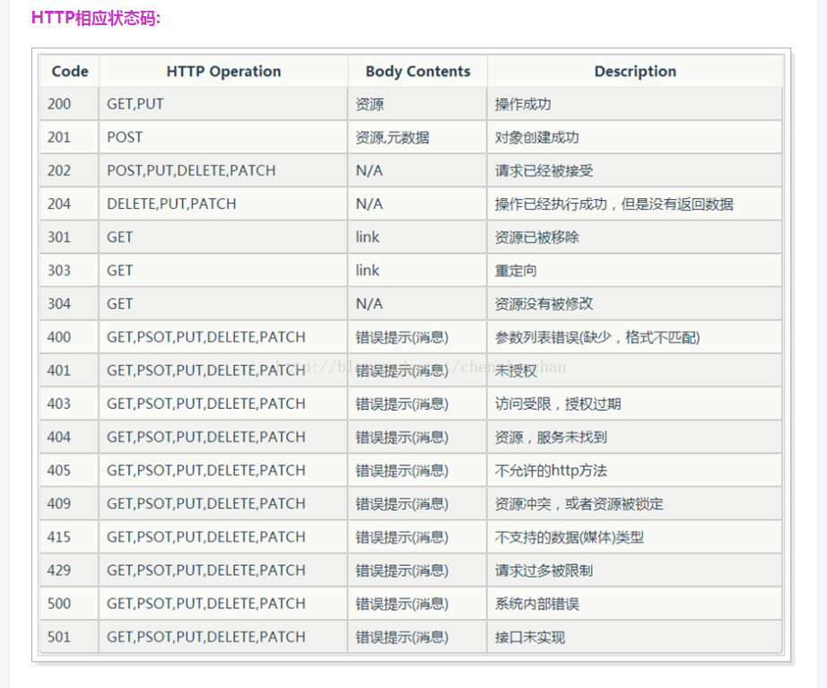


 

## TCP 的三次握手与四次挥手原理

 **三次握手**

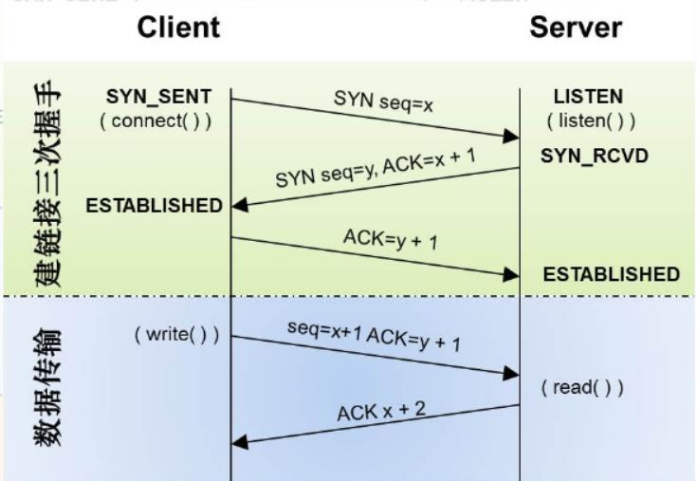

**CLOSED 关闭状态：** 

为建立建立连接之前的起始点，在连接超时或者连接关闭的时候进入此状态，但是这并不是一个真正的状态，而是

这个状态图的假想起点和终点（便于我们思考与理解）。

**LISTEN 监听状态：**

服务器 server 端等待连接的状态。服务器经过 socket，bind，listen 函数之后进入此状态，开始监听客户端发

过来的连接请求。此称为应用程序被动打开（等待客户端的连接请求）。

**SYN_SENT 状态：**

第一次握手发生阶段，客户端发起连接。客户端调用 connect，发送 SYN 给服务器端，然后客户端进入 SYN_SENT状态，等待服务端的确认（三次握手中的第二个报文）。如果服务器端不能连接，则客户端直接进入 CLOSED 状态。 

**SYN_RCVD 状态：**

第二次握手发生阶段，这里是服务器端接收到了客户端的 SYN 请求，此时服务端由 LISTEN 进入 SYN_RCVD 状态，同时服务器端回应一个 ACK，然后再发送一个 SYN 即 SYN+ACK 给客户端。

状态图中还描绘了这样一种情况，当客户端在发送 SYN 的同时也收到服务器端的 SYN 请求，即两个同时发起连接请求，那么客户端就会从 SYN_SENT 转换到 SYN_REVD 状态。

**ESTABLISHED 状态：**

第三次握手发生阶段，客户端接收到服务器端的 ACK 包（ACK，SYN）之后，也会发送一个 ACK 确认包，客户端进入 ESTABLISHED 状态，表明客户端这边已经准备好，但 TCP 需要两端都准备好才可以进行数据传输。服务器端收到客户端的 ACK 之后会从 SYN_RCVD 状态转移到 ESTABLISHED 状态，表明服务器端也准备好进行数据传输了。 

**总结：**

客户端和服务器端都变为 ESTABLISHED 状态，就可以进行数据的传输了；当然 ESTABLISHED 也可以说是一个数据传送状态。

**四次挥手**

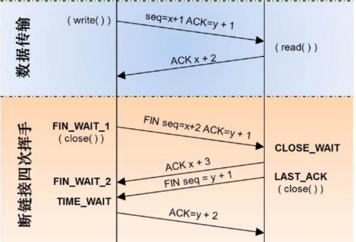

**FIN_WAIT_1 状态：**

第一次挥手 主动关闭的一方（执行主动关闭的一方既可以是客户端，也可以是服务器端，我们这里以客户端执行主动关闭为例子），终止连接时，发送 FIN 给对方，然后等待对方返回 ACK 。第一次挥手客户端就进入 fin_wait_1状态。

**CLOSE_WAIT 状态：**

接收到 FIN 之后，被动关闭的一方进入 close_wait 状态。进入该状态的具体动作是接收到客户端发来的 FIN，同时服务端对客户端发送 ACK。 CLOSE_WAIT 状态：可以理解为被动关闭的一方此时正在等待上层应用程序发出关闭连接指令。TCP 关闭是全双工过程，这里客户端执行了主动关闭，被动方服务器端接收到 FIN 后也需要调用 close 关闭，这个 CLOSE_WAIT 就是处于这个状态，等待关闭的请求方发送 FIN，发送了 FIN 则进入 LAST_ACK 状态。

**FIN_WAIT_2 状态：**

主动端（这里是客户端）先执行主动关闭发送 FIN，然后接收到被动方（这里是服务端）返回的 ACK 后进入此状态。

**LAST_ACK 状态：**

被动方（服务器端）发起关闭请求，发送 FIN 给对方，进入此状态，同时在接收到 ACK 时进入 CLOSED 状态。

**CLOSING 状态：**

两边同时发起关闭请求时（即主动方发送 FIN，等待被动方返回 ACK，同时被动方也发送了 FIN；主动方接收到了FIN 之后，发送 ACK 给被动方），主动方会由 FIN_WAIT_1 进入此状态，等待被动方返回 ACK。

**TIME_WAIT 状态：**

从状态变迁图会看到，四次挥手操作最后都会经过这样一个状态然后进入 CLOSED 状态。共有三个状态会进入该状态

**由 CLOSEING 状态进入：**

同时发起关闭情况下，当主动端接收到 ACK 后，进入此状态，实际上这里的同时是这样的情况：客户端发起关闭请求，发送 FIN 之后等待服务器端回应 ACK，但此时服务器端同时也发起关闭请求，也发送了 FIN，并且被客户端先于 ACK 接收到。

**由 FIN_WAIT_1 进入：**

发起关闭后，发送了 FIN，等待 ACK 的时候，正好被动方（服务器端）也发起关闭请求，发送了 FIN，这时客户端接收到了先前 ACK，也收到了对方的 FIN，然后发送 ACK（对对方 FIN 的回应），与 CLOSING 进入的状态不同的是接收到 FIN 和 ACK 的先后顺序。

**由 FIN_WAIT_2 进入：**

这是不同时的情况，主动方在完成自身发起的主动关闭请求后，接收到了对方发送过来的 FIN，然后回应 ACK。

## TCP 十一种状态转移总结

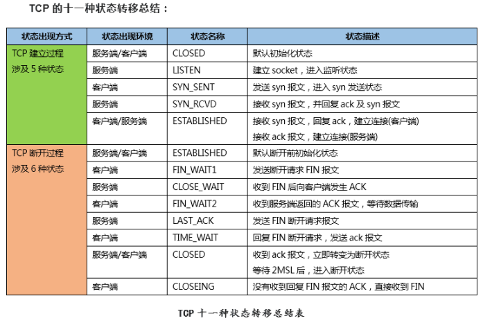

## TCP/IP的七层模型

应用层 (Application)：网络服务与最终用户的一个接口。
协议有：HTTP FTP TFTP SMTP SNMP DNS TELNET HTTPS POP3 DHCP

表示层（Presentation Layer）：数据的表示、安全、压缩。（在五层模型里面已经合并到了应用层）
格式有，JPEG、ASCll、DECOIC、加密格式等

会话层（Session Layer）：建立、管理、终止会话。（在五层模型里面已经合并到了应用层）
对应主机进程，指本地主机与远程主机正在进行的会话

传输层 (Transport)：定义传输数据的协议端口号，以及流控和差错校验。
协议有：TCP UDP，数据包一旦离开网卡即进入网络传输层

网络层 (Network)：进行逻辑地址寻址，实现不同网络之间的路径选择。
协议有：ICMP IGMP IP（IPV4 IPV6） ARP RARP

数据链路层 (Link)：建立逻辑连接、进行硬件地址寻址、差错校验等功能。（由底层网络定义协议）
将比特组合成字节进而组合成帧，用MAC地址访问介质，错误发现但不能纠正

物理层（Physical Layer）：是计算机网络OSI模型中最低的一层

物理层规定:为传输数据所需要的物理链路创建、维持、拆除
而提供具有机械的，电子的，功能的和规范的特性

简单的说，物理层确保原始的数据可在各种物理媒体上传输。局域网与广域网皆属第1、2层

物理层是OSI的第一层，它虽然处于最底层，却是整个开放系统的基础
物理层为设备之间的数据通信提供传输媒体及互连设备，为数据传输提供可靠的环境
如果您想要用尽量少的词来记住这个第一层，那就是“信号和介质”

 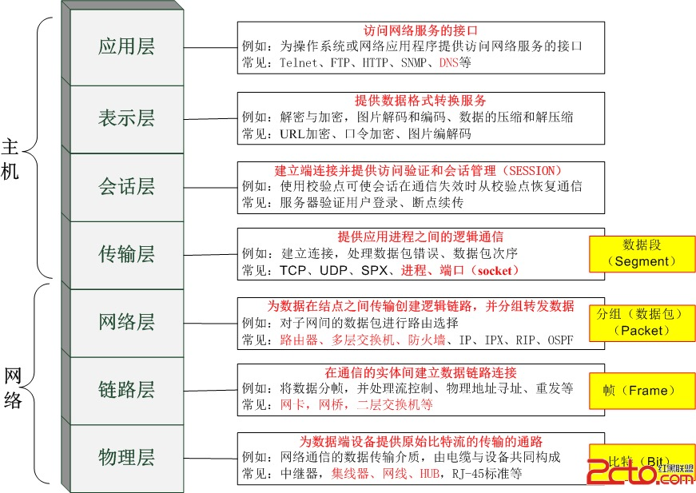


## 用tcpdump抓取主机192.168.1.1，端口80的数据，并将输出保存到tcpdump.log

```shell
tcpdump ‘host 192.168.1.1 and port 80’ > tcpdump.log
```

## 将IP 为192.168.2.1的80 端口的请求转发到8080

```shell
iptables -A PREROUTING -d 192.168.2.1 -p tcp -m tcp -dport 80 -j DNAT-to-destination 192.168.2.1:8080
```


## 用tcpdump嗅探80端口的访问看看谁最高

```shell
tcpdump -i eth0 -tnn dst port 80 -c 1000 | awk -F"." '{print $1.$2.$3.$4}'| sort | uniq -c | sort -nr |head -20
```


## 查看TCP连接的所有状态

```
netstat -n | awk '/^tcp/ {++S[$NF]} END {for(a in S) print a, S[a]}'
```

还有ulimit -n 查看linux系统打开最大的文件描述符，这里默认1024
不修改这里web服务器修改再大也没用，若要用就修改很几个办法，这里说其中一个：
修改/etc/security/limits.conf

- soft nofile 10240

- hard nofile 10240

  重启后生效


## TIME_WAIT过多或者CLOSE_WAIT过多的状态

**TIME_WAIT过多或者CLOSE_WAIT过多的状态**

**1 起因**

线上服务器nginx日志运行一段时间后，会报如下错误：

```
1024 worker_connections are not enough 
```

一般做法是修改worker_connections。 

但实际上：

该服务是用于时间比较短的连接里，并且一天最多才4000个请求。不可能会耗尽worker_connections。 

除非每次连接都没有释放对应的连接。 

```shell
shell>netstat -n | awk ‘/^tcp/ {++S[$NF]} END {for(a in S) print a, S[a]}’ CLOSE_WAIT 802 ESTABLISHED 106 

shell>lsof -n | grep “nginx对应的一个进程id” 
MvLogServ 31125 mv 111u IPv4 76653578 0t0 TCP 10.1.138.60:8996->10.1.138.60:51977 (CLOSE_WAIT) MvLogServ 31125 mv 112u IPv4 76659698 0t0 TCP 10.1.138.60:8996->10.1.138.60:52015 (CLOSE_WAIT) MvLogServ 31125 mv 113u IPv4 76662836 0t0 TCP 10.1.138.60:8996->10.1.138.60:52042 (CLOSE_WAIT) MvLogServ 31125 mv 114u IPv4 76663435 0t0 TCP 10.1.138.60:8996->10.1.138.60:52051 (CLOSE_WAIT) MvLogServ 31125 mv 115u IPv4 76682134 0t0 TCP 10.1.138.60:8996->10.1.138.60:52136 (CLOSE_WAIT) MvLogServ 31125 mv 116u IPv4 76685095 0t0 TCP 10.1.138.60:8996->10.1.138.60:52159 (CLOSE_WAIT) 
```

**TIME_WAIT：表示主动关闭，通过优化系统内核参数可容易解决。** 

**CLOSE_WAIT：表示被动关闭，需要从程序本身出发。** 

**ESTABLISHED：表示正在通信** 

则可知：nginx：CLOSE_WAIT过多的状态

**2 解决**

**2.1 TIME_WAIT 通过优化系统内核参数可容易解决**

TIME_WAIT大量产生很多通常都发生在实际应用环境中。 

TIME_WAIT产生的原因：在通讯过程中A主动关闭造成的， 在A发送了最后一个FIN包后，系统会等待 Double时间的MSL(Max Segment Lifetime)

【注：按不同的操作系统有不同时间】用于等待接受B发送过来的FIN_ACK和FIN， 

这段时间A的对应的socket的fd是不能够重新利用的， 

这样在大量的**短连接高并发服务**中，会出现TIME_WAIT过多的现象。

解决方案： 

调整TIME_WAIT超时时间 

```shell
vi /etc/sysctl.conf  

net.ipv4.tcp_syncookies = 1 
#开启SYN Cookies,当出现SYN等待队列溢出时，启用cookies来处理，可防范少量SYN攻击，默认为0，表示关闭  

net.ipv4.tcp_tw_reuse = 1 
#允许将TIME-WAIT sockets重新用于新的TCP连接，默认为0，表示关闭

net.ipv4.tcp_tw_recycle = 1 
#表示开启TCP连接中TIME-WAIT sockets的快速回收，默认为0，表示关闭 #表示如果套接字由本端要求关闭。 #这个参数决定了它保持在FIN-WAIT-2状态的时间 
```

生效配置

```
/sbin/sysctl -p 
```


**2.2 CLOSE_WAIT 需要从程序本身出发**

**CLOSE_WAIT产生的原因是客户端B主动关闭， 服务器A收到FIN包，应用层却没有做出关闭操作引起的。** 

CLOSE_WAIT在Nginx上面的产生原因还是因为Nagle’s算法加Nginx本身EPOLL的ET触发模式导致。

ET出发模式在数据就绪的时候会触发一次回调操作，Nagle’s算法会累积TCP包，如果最后的数据包和FIN包被Nagle’s算法合并，会导致EPOLL的ET模式只触发一次。 

然而在应用层的SOCKET是读取返回0才代表链接关闭， 而读取这次合并的数据包时是不返回0的， 然后SOCKET以后都不会触发事件， 所以导致应用层没有关闭SOCKET， 从而产生大量的CLOSE_WAIT状态链接。 

关闭TCP_NODELAY，在Nginx配置中加上tcp_nodelay on; 

**3 总结**

- TIME_WAIT状态可以通过优化服务器参数得到解决。 

因为发生TIME_WAIT的情况是服务器自身可控的， 要么就是对方连接的异常，要么就是自己没有迅速回收资源， 总之不是由于自己程序错误导致的。

- CLOSE_WAIT需要通过程序本身。 

如果一直保持在CLOSE_WAIT状态，那么只有一种情况，就是在对方关闭连接之后服务器程序自己没有进一步发出ack信号。 

即在对方连接关闭之后，程序里没有检测到，或者程序没有关闭连接，于是这个资源就一直被程序占着。 

服务器对于程序抢占的资源没有主动回收的功能。只能修改程序本身。 


## DDOS介绍与防护

网站被DDOS也成为站长最头疼的事。在没有硬防的情况下,寻找软件代替是最直接的方法,比如用 iptables,但是iptables不能在自动屏蔽,只能手动屏蔽。

**一、什么是DDOS攻击？**

DDoS也就是分布式拒绝服务攻击。它使用与普通的拒绝服务攻击同样的方法,但是发起攻击的源是多个。通常攻击者使用下载的工具渗透无保护的主机,当获得该主机的适当的访问权限后,攻击者在主机中安装软件的服务或进程（以下简侈怔理）。这些代理保持睡眠状态,直到从它们的主控端得到指令,对指定的目标发起拒绝服务攻击。

**二、如何确认自己受到DDOS攻击？**

在系统上执行：

```shell
netstat -ntu | awk '{print $5}' | cut -d: -f1 | sort | uniq -c | sort -n
```

执行后,将会显示服务器上所有的每个IP多少个连接数。

以下是我自己用VPS测试的结果：

```shell
li88-99:~# netstat -ntu|awk '{print $5}' | cut -d: -f1 | sort | uniq -c | sort -n

1 114.226.9.132
1 174.129.237.157
1 58.60.118.142
1 Address
1 servers)
2 118.26.131.78
3 123.125.1.202
3 220.248.43.119
4 117.36.231.253
4 119.162.46.124
6 219.140.232.128
8 220.181.61.31

2311 67.215.242.196
```

每个IP几个、十几个或几十个连接数都还算比较正常,如果像上面成百上千肯定就不正常了。

**三、防范DDOS攻击的方法**

1.1 常规的一些防御方法

　　到目前为止,进行DDoS攻击的防御还是比较困难的。首先,这种攻击的特点是它利用了TCP/IP协议的漏洞,除非你不用TCP/IP,才有可能完全抵御住DDoS攻击。不过这不等于我们就没有办法阻挡DDoS攻击,我们可以尽力来减少DDoS的攻击。

下面就是一些防御方法:

- 确保服务器的系统文件是最新的版本,并及时更新系统补丁。
- 关闭不必要的服务。
- 限制同时打开的SYN半连接数目,缩短SYN半连接的time out 时间,限制SYN/ICMP流量

SYN攻击是利用TCP/IP协议3次握手的原理,发送大量的建立连接的网络包,但不实际建立连接,最终导致被攻击服务器的网络队列被占满,无法被正常用户访问。

Linux内核提供了若干SYN相关设置,使用命令：

```
sysctl -a | grep syn
```

看到：

```shell
net.ipv4.tcp_max_syn_backlog = 1024
net.ipv4.tcp_syncookies = 0
net.ipv4.tcp_synack_retries = 5
net.ipv4.tcp_syn_retries = 5
tcp_max_syn_backlog
```

调整上述设置的方法是：

增加SYN队列长度到2048：

```shell
sysctl -w net.ipv4.tcp_max_syn_backlog=2048
```

打开SYN COOKIE功能：

```shell
sysctl -w net.ipv4.tcp_syncookies=1
```

降低重试次数：

```shell
sysctl -w net.ipv4.tcp_synack_retries=3
sysctl -w net.ipv4.tcp_syn_retries=3
```

为了系统重启动时保持上述配置,可将上述命令加入到/etc/rc.d/rc.local文件中或者直接修改内核参数。

- 正确设置防火墙，禁止对主机的非开放服务的访问，限制特定IP地址的访问，启用防火墙的防DDoS的属性

- 认真检查网络设备和服务器系统的日志。只要日志出现漏洞或是时间变更,那这台机器就可能遭到了攻击。

- 限制在防火墙外与网络文件共享。这样会给黑客截取系统文件的机会,主机的信息暴露给黑客,无疑是给了对方入侵的机会。

- 充分利用网络设备保护网络资源

- 用足够的机器承受黑客攻击

- 检查访问者的来源


# NGINX相关

## 1、nginx和Apache的特点

**Apache 软件特点**

(1) Apache2.2 版本非常稳定强大，Apache2.4 版本性能更强

(2) Prefork 模式取消了进程创建开销，性能很高

(3) 处理动态业务数据时，因关联到后端的引擎和数据库，瓶颈不在 Apache 上

(4) 高并发时消耗系统资源相对多一些

(5) 基于传统的 select 模型，高并发能力有限

(6) 支持扩展库，可通过 DSO、apxs 方法编译安装额外的插件功能，不需要重新编译 Apache

(7) 功能多，更稳定，更安全，插件也多

(8) 市场份额在逐渐递减

 

**nginx 软件的特点**

支持高并发：能支持几万并发连接（特别是静态小文件业务环境）

资源消耗少：在 3 万并发连接下，开启 10 个 Nginx 线程消耗的内存不到 200MB、进程占用系统资源比较低

不支持类似 Apache 的 DSO 模式，扩展库必须编译进主程序（缺点）

支持 web、反向 proxy、cache 三大重点功能，并且都很优秀

可以做 HTTP 反向代理及加速缓存、即负载均衡功能（4 层以及 7 层），内置对 RS(real server)节点服务器健康检

查功能，这相当于专业的 Haproxy 软件或 LVS(4 层)的功能

具备 Squid 等专业缓存软件等的缓存功能（memcache/redis）

支持异步网络 I/O 事件模型 epoll (Linux 2.6+)

 

**nginx 总体性能为什么比 Apache 高**

Nginx 使用最新的 epoll(Linux2.6 内核)和 Kqueue(freebsd)异步网络 1O 模型

Apache 使用的是传统的 select 模型。

目前 Linux 下能够承受高并发访问的 Squid、Memcached 软件采用的都是 epoll 模型

 

**Apache select 和 nginx epoll 的技术对比**

| **指标**     | **select**                                                   | **epoll**                        |
| ------------ | ------------------------------------------------------------ | -------------------------------- |
| 性能         | 随着连接数的增加性能急剧下降，处理成千上万连接数性能很差     | 随着连接数的增加性能基本上没有下 |
| 连接数       | 连接数有限制，处理的最大连接数不 超过 1024，如果要处理的连接数超 过1024个，则需要修改FD_SETSIZE 宏，并重新编译 | 连接数无限制                     |
| 内在处理机制 | 线性轮询                                                     | 回调 callback                    |
| 开发复杂性低 | 低                                                           | 中                               |

 

**nginx 软件有哪些应用**

1）作为 Web 服务软件

2）反向代理或负载均衡服务

3）前端业务数据缓存服务（扩展 redis 缓存知识后）

 

 

**不同的业务选择的软件**

**静态业务**

若是高并发场景，尽量采用 Nginx 或 Lighttpd,二者首选 Nginx。

 

**动态业务**

理论上采用 Nginx 和 Apache 均可，建议选择 Nginx,为了避免相同业务的服务软件多样化，增加额外维护成本。动态业务可以由 Nginx 兼做前端代理，再根据页面元素的类型或目录，转发到后端相应的服务器处理进程。

 

**既有动态业务又有静态业务**

采用 Nginx

 

## 2、nginx日志管理与切割

**1、nginx日志管理**

**nginx日志描述**

通过访问日志，你可以得到用户地域来源、跳转来源、使用终端、某个URL访问量等相关信息；通过错误日志，你可以得到系统某个服务或server的性能瓶颈等。因此，将日志好好利用，你可以得到很多有价值的信息。

**Nginx日志格式**

打开nginx.conf配置文件：`vim /usr/local/nginx/conf/nginx.conf`

日志部分内容：

```
#access_log  logs/access.log  main;
```

日志生成的到Nginx根目录logs/access.log文件，默认使用“main”日志格式，也可以自定义格式。

**默认“main”日志格式：**

```json
log_format  main  '$remote_addr - $remote_user [$time_local] "$request" '

                    '$status $body_bytes_sent "$http_referer" '

                    '"$http_user_agent" "$http_x_forwarded_for"';
```

参数明细表：

| $remote_addr          | 客户端的ip地址(代理服务器，显示代理服务ip)           |
| --------------------- | ---------------------------------------------------- |
| $remote_user          | 用于记录远程客户端的用户名称（一般为“-”）            |
| $time_local           | 用于记录访问时间和时区                               |
| $request              | 用于记录请求的url以及请求方法                        |
| $status               | 响应状态码，例如：200成功、404页面找不到等。         |
| $body_bytes_sent      | 给客户端发送的文件主体内容字节数                     |
| $http_user_agent      | 用户所使用的代理（一般为浏览器）                     |
| $http_x_forwarded_for | 可以记录客户端IP，通过代理服务器来记录客户端的ip地址 |
| $http_referer         | 可以记录用户是从哪个链接访问过来的                   |

> 注意：php，tomcat等后端服务获取的客户端ip等就是通过nginx传过来的


**2.nginx日志切割**

可以结合shell脚本实现，也可以使用日志切割工具（cronolog，）。

```shell
#!/bin/bash
s_log="/usr/local/nginx/logs/access.log"
d_log="/data/backup/nginx-$(date +%F).log"
d_log_dir="/data/backup"

#判断备份目录是否存在，不存在则创建
if [ ! -d "$d_log_dir" ];then
       mkdir -p "$d_log_dir"
fi

#判断原日志文件是否存在，存在则移动并改名
if [ -f "$s_log" ];then
        mv "$s_log" "$d_log"
fi

#以下两条命令任选其一：
#kill -USR1 `cat /usr/local/nginx/logs/nginx.pid`
/usr/local/nginx/sbin/nginx -s reopen
```

**创建crontab设置作业**

\#设置日志文件存放目录crontab -e

```shell
*/1 * * * *  /bin/bash /usr/local/nginx/nginx_log.sh
```

**nginx -s reopen**

执行完上述命令后，日志目录中自动生成了一个新的"access.log"文件，
再次访问nginx，会发现新生成的日志已经写入到了新生成的"access.log"文件中了。

**原理解析：**

发送信号，其实是执行：

```bash
kill -USR1 `cat /usrlocal/nginx/logs/nginx.pid`
```


## 3、nginx 管理常用的几个信号

**master进程接收的信号:**

| 信号名   | 含义                                   | 对应nginx命令行 |
| :------- | :------------------------------------- | :-------------- |
| TERM,INT | 终止进程                               | stop            |
| QUIT     | 完成请求链接,优雅的终止进程            | quit            |
| HUP      | 平滑重启，重新加载配置文件             | reload          |
| USR1     | 重新打开日志文件，在切割日志时用途较大 | reopen          |
| USR2     | 平滑升级,热部署使用                    | 无              |
| WINCH    | 平滑关闭进程,热部署使用                | 无              |

**worker接收的信号**

| 信号名   | 含义                        | 对应nginx命令行 |
| :------- | :-------------------------- | :-------------- |
| TERM,INT | 终止进程                    | stop            |
| QUIT     | 完成请求链接,优雅的终止进程 | quit            |
| WINCH    | 平滑关闭进程,热部署使用     | 无              |

**例子:**

为了更加直观,我们将nginx.conf worker进程改为1

```javascript
worker_processes  1;
```

**更改后,我们重新加载配置文件,可使用**

```javascript
nginx -s reload
```

> 或者可以使用 kill -HUP pid，pid需要你去查看nginx master进程pid获取. 此命令针对worker进程无效

**重新生成日志文件**

```javascript
 nginx -s reopen
 或者
 # kill -USR1 1144
```

**停掉子进程**

```shell
kill -TERM 1376
```


## 4、nginx 常用命令

```
nginx -s quit //优雅停止nginx，有连接时会等连接请求完成再杀死worker进程
nginx -s stop //快速关闭Nginx，可能不保存相关信息，并迅速终止web服务
nginx -s reload //优雅重启，并重新载入配置文件nginx.conf
nginx -s reopen //重新打开日志文件，一般用于切割日志
nginx -v //查看版本
nginx -t //检查nginx的配置文件
nginx -h //查看帮助信息
nginx -V //详细版本信息，包括编译参数
nginx -c filename //指定配置文件
```


## 5、nginx 跨域

直接请求nginx也是会报跨域错误的这里设置允许跨域;如果代理地址已经允许跨域则不需要这些, 否则报错(虽然这样nginx跨域就没意义了)

```shell
add_header Access-Control-Allow-Origin *;
add_header Access-Control-Allow-Headers X-Requested-With;
add_header Access-Control-Allow-Methods GET,POST,OPTIONS;
```


## 6、nginx 的 location 说明

location 表示位置的概念，类似于 if，即满足什么条件，就做什么

Nginx的location语法 

```
location [=|~|~*|^~] /uri/ { … }

=         严格匹配。如果请求匹配这个location，那么将停止搜索并立即处理此请求
~         区分大小写匹配(可用正则表达式)
~*        不区分大小写匹配(可用正则表达式)
!~        区分大小写不匹配
!~*       不区分大小写不匹配
^~        如果把这个前缀用于一个常规字符串,那么告诉nginx 如果路径匹配那么不测试正则表达式
```

 

示例1：

```
location  / { }
```

匹配任意请求

 

示例2：

```
location ~* .(gif|jpg|jpeg)$ ｛
	rewrite .(gif|jpg|jpeg)$ /logo.png;
｝
```

不区分大小写匹配任何以gif、jpg、jpeg结尾的请求，并将该请求重定向到 /logo.png请求

 

示例3：

```
location ~ ^.+\.txt$ {
	root /usr/local/nginx/html/;
}
```

区分大小写匹配以.txt结尾的请求，并设置此location的路径是/usr/local/nginx/html/。也就是以.txt结尾的请求将访问/usr/local/nginx/html/ 路径下的txt文件


## 7、nginx的alias与root的区别

root    实际访问文件路径会拼接URL中的路径
alias   实际访问文件路径不会拼接URL中的路径
示例如下：

```
location ^~ /sta/ {  
   alias /usr/local/nginx/html/static/;  
}
```

请求：http://test.com/sta/sta1.html
实际访问：/usr/local/nginx/html/static/sta1.html 文件

```
location ^~ /tea/ {  
   root /usr/local/nginx/html/;  
}
```

请求：http://test.com/tea/tea1.html
实际访问：/usr/local/nginx/html/tea/tea1.html 文件


## 8、nginx用户访问控制与认证模块

用户访问控制与认证模块ngx_http_access_module、ngx_http_auth_basic_module

**一、用户访问控制模块ngx_http_access_module**

如果在Nginx中想控制某个路径无法让指定用户访问（限制IP访问），需要使用到的模块是ngx_http_access_module。说模块名可能不熟悉，但是说到allow和deny就一定知道是干什么的了。这个模块是默认就会安装的，除非在编译时加上了--without-http_access_module。下面是ngx_http_access_module的配置语法示例：

```
location / {
	deny  192.168.1.120;
	allow 192.168.1.0/24;
	allow 10.1.1.0/16;
	deny  all;
}
```


Nginx和iptables的匹配规则一样，从上往下进行匹配，只要遇到符合条件的规则就不再继续往下匹配。如上例子中首先禁止192.168.1.120这个IP的访问，然后允许了另外2个网段的IP访问，最后不符合匹配条件的IP全部禁止访问。在实际工作中只要记住想禁止哪个IP访问就deny掉对应的IP，想允许则加上allow ip，想禁止或者允许所有的IP访问就使用allow all或者deny all。

**二、用户认证模块ngx_http_auth_basic_module**

Nginx进行用户名密码验证的话是通过ngx_http_auth_basic_module模块实现，该模块可作用范围http，server，location，limit_except，语法如下：

```
location / {
    auth_basic           "Please input your name";
    auth_basic_user_file /etc/nginx/htpasswd;
}
```


## 9、nginx的upstream模块和负载调度算法


**upstream模块相关说明**
1、upstream模块应放于nginx.conf配置的http{}标签内
2、upstream模块默认算法是wrr (权重轮询 weighted round-robin)


**一、分配方式**
Nginx的upstream支持5种分配方式，下面将会详细介绍，其中前三种为Nginx原生支持的分配方式，后两种为第三方支持的分配方式。

1、rr轮询（默认调度算法，静态调度算法）
轮询是upstream的默认分配方式，即每个请求按照时间顺序轮流分配到不同的后端服务器，如果某个后端服务器down掉后，能自动剔除。

```shell
upstream backend {
    server 192.168.1.101:8888;
    server 192.168.1.102:8888;
    server 192.168.1.103:8888;
}
```

2、wrr（权重轮询，静态调度算法）
轮询的加强版，即可以指定轮询比率，weight和访问几率成正比，主要应用于后端服务器异质的场景下。

```shell
upstream backend {
    server 192.168.1.101 weight=1;
    server 192.168.1.102 weight=2;
    server 192.168.1.103 weight=3;
}
```

3、ip_hash（静态调度算法）
每个请求按照访问ip（即Nginx的前置服务器或者客户端IP）的hash结果分配，这样每个访客会固定访问一个后端服务器，可以解决session一致问题。

```shell
upstream backend {
    ip_hash;
    server 192.168.1.101:7777;
    server 192.168.1.102:8888;
	server 192.168.1.103:9999;
}
```

注意：
1、当负载调度算法为ip_hash时，后端服务器在负载均衡调度中的状态不能是weight和backup。
2、导致负载不均衡。


4、fair（动态调度算法）
fair顾名思义，公平地按照后端服务器的响应时间（rt）来分配请求，响应时间短即rt小的后端服务器优先分配请求。如果需要使用这种调度算法，必须下载Nginx的upstr_fair模块。

```shell
upstream backend {
    server 192.168.1.101;
	server 192.168.1.102;
    server 192.168.1.103;
    fair;
}
```

5、url_hash，目前用consistent_hash替代url_hash
与ip_hash类似，但是按照访问url的hash结果来分配请求，使得每个url定向到同一个后端服务器，主要应用于后端服务器为缓存时的场景下。

```shell
upstream backend {
    server 192.168.1.101;
    server 192.168.1.102;
    server 192.168.1.103;
    hash $request_uri;
    hash_method crc32;
}
```

 

其中，hash_method为使用的hash算法，需要注意的是：此时，server语句中不能加weight等参数。

提示：url_hash用途cache服务业务，memcached，squid，varnish。特点：每个rs都是不同的。


6、least_connleast_conn最小连接数算法

会根据后端节点的连接数来决定分配情况，哪个机器连接数少就分发。


## 10、常用的Nginx模块，用来做什么

```
rewrite模块，实现重写功能
access模块：来源控制
ssl模块：安全加密
ngx_http_gzip_module：网络传输压缩模块
ngx_http_proxy_module ：模块实现代理
ngx_http_upstream_module ：模块实现定义后端服务器列表
ngx_cache_purge ：实现缓存清除功能
```


# SHELL相关

## 1、Bash技巧：介绍 $0、$1、$2、$#、$@、$*、$? 的含义

在编写 Linux bash shell 脚本时，经常会用到 $0、$1、$2、$#、$@、$*、$? 等参数，下面具体说明这些参数的含义。

假设执行 **./test.sh a b c** 这样一个命令，则可以使用下面的参数来获取一些值：

- **$0** 对应 "**./test.sh**" 这个值。如果执行的是 ./work/test.sh， 则对应 ./work/test.sh 这个值，而不是只返回文件名本身的部分。
- **$1** 会获取到 a，即 $1 对应传给**脚本的第一个参数**。
- **$2** 会获取到 b，即 $2 对应传给**脚本的第二个参数**。
- **$3** 会获取到 c，即 $3 对应传给**脚本的第三个参数**。$4、$5 等参数的含义依此类推。
- **$#** 会获取到 3，对应传入**脚本的参数个数**，统计的参数不包括 $0。
- **$@** 会获取到 "a" "b" "c"，也就是**所有参数的列表**，不包括 $0。
- **$\*** 也会获取到 "a" "b" "c"， 其值**和 $@ 相同**。但 **$*** 和 **$@** 加上双引号有所不同。"$*" 把所有参数合并成一个字符串，而 "$@" 会得到一个字符串参数数组。
- **$?** 可以获取到执行 ./test.sh a b c 命令后的返回值。在执行一个前台命令后，可以立即用 $? 获取到该命令的返回值。该命令可以是系统自身的命令，可以是 shell 脚本，也可以是自定义的 bash 函数。0值为执行成功；非0值为执行失败。

| 变量 | 含义                                                         |
| ---- | ------------------------------------------------------------ |
| $0   | 当前脚本的文件名                                             |
| $n   | 传递给脚本或函数的参数。n 是一个数字，表示第几个参数。例如，第一个参数是$1，第二个参数是$2。 |
| $#   | 传递给脚本或函数的参数个数（不包含$0）。                     |
| $*   | 传递给脚本或函数的所有参数（"$*"会把所有参数当成一个字符串）。 |
| $@   | 传递给脚本或函数的所有参数。被双引号(" ")包含时，与 $* 稍有不同，下面将会讲到。（"$@"会把所有单数当成一个数组。） |
| $?   | 上个命令的退出状态，或函数的返回值。                         |
| $$   | 当前Shell进程ID。对于 Shell 脚本，就是这些脚本所在的进程ID。 |

通过脚本记忆特殊变量：

```shell
[root@ k8s-m01 ~]# cat test.sh
#!/bin/bash

echo "$0"
echo "$1"
echo "$2"
echo "$3"
echo "$#"
echo "$@"
echo "$*"
echo "$?"
[root@ k8s-m01 ~]# sh test.sh a b c
test.sh
a
b
c
3
a b c
a b c
0
```


下面举例说明 "$*" 和 "$@" 的差异。假设有一个 testparams.sh 脚本，内容如下：

```shell
[root@ k8s-m01 ~]# cat test.sh
#!/bin/bash

for i in "$*"
do
  echo '字符串:' $i
done

echo '----分割符----'

for i in "$@"
do
  echo '数组:' $i
done
[root@ k8s-m01 ~]# sh test.sh a b c
字符串: a b c
----分割符----
数组: a
数组: b
数组: c

```

可以看到，"$*" 只产生一个字符串，for 循环只遍历一次。
而 "$@" 产生了多个字符串，for 循环遍历多次，是一个字符串参数数组。

**注意**：如果传入的参数多于 9 个，则不能使用 $10 来引用第 10 个参数，而是要用 ${10} 来引用。即，需要用大括号{}把大于 9 的数字括起来。

例如，${10} 表示获取第 10 个参数的值，写为 $10 获取不到第 10 个参数的值。实际上，$10 相当于 ${1}0，也就是先获取 $1 的值，后面再跟上 0，如果 $1 的值是 "first"，则 $10 的值是 "first0"。


## **2、shell 中$() ，${}，$[] $(())，[ ] (( )) [[ ]]作用与区别**


**1.$()**

在 bash shell 中，$( ) 与 ` (反引号) 都是用来做命令替换用(commandsubstitution)的。 

例如 version=$(uname -r)和version= \uname -r都可以是version得到内核的版本号 

各自的优缺点： 

1. ` 基本上可用在全部的 unix shell 中使用，若写成 shell script ，其移植性比较高。但反单引号容易打错或看错。 

2. $()并不是所有shell都支持。

**2.${ } ：变量替换**

${}用于变量替换。一般情况下，$var 与${var} 并没有啥不一样。但是用 ${ } 会比较精确的界定变量名称的范围。比如

$A=B  $ echo $AB  

原本是打算先将 A的结果替换出来，然后再补一个B字母于其后，但在命令行上，真正的结果却是只会提换变量名称为AB的值出来…若使用$就没问题了：$echoA的结果替换出来，然后再补一个B字母于其后，但在命令行上，真正的结果却是只会提换变量名称为AB的值出来…若使用$就没问题了： $echo{A}B  BB 

${ }的功能远不止于此，详见下表。


**3.$ [] $ (()) :**

它们是一样的，都是进行数学运算的。支持+ - * / %：分别为 “加、减、乘、除、取模”。但是注意，bash只能作整数运算，对于浮点数是当作字符串处理的。

例：

```
$ a=5; b=7; c=2 $ echo $(( a+b*c )) 19 $ echo $(( (a+b)/c )) 6 $ echo $(( (a*b)%c)) 1 
```

在 $(( )) 中的变量名称，可于其前面加 $ 符号来替换，也可以不用，如：

$(( $a + $b * $c)) 也可得到 19 的结果 

此外，$(( )) 还可作不同进位(如二进制、八进位、十六进制)作运算呢，只是，输出结果皆为十进制而已：

echo $((16#2a)) 结果为 42 (16进位转十进制) 

**4.[ ]**

即为test命令的另一种形式。 

但要注意许多： 

1.你必须在左括号的右侧和右括号的左侧各加一个空格，否则会报错。 

2.test命令使用标准的数学比较符号来表示字符串的比较，而用文本符号来表示数值的比较。很多人会记反了。使用反了，shell可能得不到正确的结果。 

3.大于符号或小于符号必须要转义，否则会被理解成重定向。

**5.(( ))及[[ ]]**

它们分别是[ ]的针对数学比较表达式和字符串表达式的加强版。 

其中(( ))，不需要再将表达式里面的大小于符号转义，除了可以使用标准的数学运算符外，还增加了以下符号：！


## **3、shell脚本8种字符串截取方法总结**

Linux 的字符串截取很有用。有八种方法。

假设有变量 var=http://www.aaa.com/123.htm.

**1. # 号截取，删除左边字符，保留右边字符。**

echo ${var#*//}

其中 var 是变量名，# 号是运算符，*// 表示从左边开始删除第一个 // 号及左边的所有字符

即删除 http://

结果是 ：[www.aaa.com/123.htm](http://www.aaa.com/123.htm)

**2. ## 号截取，删除左边字符，保留右边字符。**

echo ${var##*/}

\##*/ 表示从左边开始删除最后（最右边）一个 / 号及左边的所有字符

即删除 http://www.aaa.com/

结果是 123.htm

**3. %号截取，删除右边字符，保留左边字符**

echo ${var%/*}

%/* 表示从右边开始，删除第一个 / 号及右边的字符

结果是：http://www.aaa.com

**4. %% 号截取，删除右边字符，保留左边字符**

echo ${var%%/*}

%%/* 表示从右边开始，删除最后（最左边）一个 / 号及右边的字符

结果是：http:

**5. 从左边第几个字符开始，及字符的个数**

echo ${var:0:5}

其中的 0 表示左边第一个字符开始，5 表示字符的总个数。

结果是：http:

**6. 从左边第几个字符开始，一直到结束。**

echo ${var:7}

其中的 7 表示左边第8个字符开始，一直到结束。

结果是 ：[www.aaa.com/123.htm](http://www.aaa.com/123.htm)

**7. 从右边第几个字符开始，及字符的个数**

echo ${var:0-7:3}

其中的 0-7 表示右边算起第七个字符开始，3 表示字符的个数。

结果是：123

**8. 从右边第几个字符开始，一直到结束。**

echo ${var:0-7}

表示从右边第七个字符开始，一直到结束。

结果是：123.htm

注：（左边的第一个字符是用 0 表示，右边的第一个字符用 0-1 表示）


## 4、shell数组和字典

**定义字典**

```shell
#!/bin/bash
echo "shell定义字典"
#必须先声明
declare -A dic
dic=([key1]="value1" [key2]="value2" [key3]="value3")
 
#打印指定key的value
echo ${dic["key1"]}
#打印所有key值
echo ${!dic[*]}
#打印所有value
echo ${dic[*]}
 
#遍历key值
for key in $(echo ${!dic[*]})
do
   echo "$key : ${dic[$key]}"
done
```

**定义数组**

```shell
#!/bin/bash
echo "shell定义数组"
#数组
list=("value1" "value2" "value3")
#打印指定下标
echo ${list[1]}
#打印所有下标
echo ${!list[*]}
#打印数组值
echo ${list[*]}
#数组增加一个元素
list=("${list[@]}" "value3")
```

​	


## 5、shell脚本--递归函数之Fork炸弹

Jaromil 在 2002 年设计了最为精简的一个Linux Fork炸弹，整个代码只有13个字符，在 shell 中运行后几秒后系统就会宕机：

```
:(){ :|:& };:
```

这样看起来不是很好理解，我们可以更改下格式：

```shell
:()
{
    :|:&
}
:
```

更好理解一点的话就是这样:

```shell
bomb()
{
    bomb|bomb&
};
bomb
```

因为shell中函数可以省略function关键字，所以上面的十三个字符是功能是定义一个函数与调用这个函数，函数的名称为:，主要的核心代码是:|:&，可以看出这是一个函数本身的递归调用，通过&实现在后台开启新进程运行，通过管道实现进程呈几何形式增长，最后再通过:来调用函数引爆炸弹。因此，几秒钟系统就会因为处理不过来太多的进程而死机，解决的唯一办法就是重启。

fork炸弹危害

Fork炸弹带来的后果就是耗尽服务器资源，使服务器不能正常的对外提供服务，也就是常说的DoS(Denial of Service)。与传统1v1、通过不断向服务器发送请求造成服务器崩溃不同，Fork炸弹有种坐山观虎斗，不费一兵一卒斩敌人于马下的感觉。更吓人的是这个函数是不需要root权限就可以运行的。


预防方式
当然，Fork炸弹没有那么可怕，用其它语言也可以分分钟写出来一个，例如，python版：

```python
import os
     while True: 
     os.fork()
```


Fork炸弹的本质无非就是靠创建进程来抢占系统资源，在Linux中，我们可以通过ulimit命令来限制用户的某些行为，运行ulimit -a可以查看我们能做哪些限制：

```shell
ubuntu@10-10-57-151:~$ ulimit -a
core file size          (blocks, -c) 0
data seg size           (kbytes, -d) unlimited
scheduling priority             (-e) 0
file size               (blocks, -f) unlimited
pending signals                 (-i) 7782
max locked memory       (kbytes, -l) 64
max memory size         (kbytes, -m) unlimited
open files                      (-n) 1024
pipe size            (512 bytes, -p) 8
POSIX message queues     (bytes, -q) 819200
real-time priority              (-r) 0
stack size              (kbytes, -s) 8192
cpu time               (seconds, -t) unlimited
max user processes              (-u) 7782
virtual memory          (kbytes, -v) unlimited
file locks                      (-x) unlimited
```

可以看到，-u参数可以限制用户创建进程数，因此，我们可以使用ulimit -u 20来允许用户最多创建20个进程。这样就可以预防bomb炸弹。但这样是不彻底的，关闭终端后这个命令就失效了。我们可以通过修改/etc/security/limits.conf文件来进行更深层次的预防，在文件里添加如下一行（ubuntu需更换为你的用户名）：

ubuntu - nproc 2

这个时候我们再次运行炸弹就不会报内存不足了，而是提示-bash: fork: retry: No child processes，说明Linux限制了炸弹创建进程。


## 6、shell脚本--多进程并发

**1.实现多进程：利用&元字符和wait关键字**

**单进程脚本：**

```shell
#!/bin/bash

start=`date +%s`
for i in `seq 4`
do
        echo $i;sleep 2
done

end=`date +%s`
echo "time: `expr $end - $start`"

[root@ localhost ~]# sh test.sh
1
2
3
4
time: 8
```

很明显是8s

这种不占处理器却有很耗时的进程，我们可以通过一种后台运行的方式
来达到节约时间的目的。看如下改进：

**多进程：**

```shell
#!/bin/bash

start=`date +%s`
for i in `seq 4`
do
	{
	echo $i;sleep 2
	}&
done
wait

end=`date +%s`
echo "time: `expr $end - $start`"

[root@ localhost ~]# sh test.sh
3
4
1
2
time: 2
```

用“{}”将主执行程序变为一个块，用&放入后台，四次执行全部放入后台后，我们需要用一个wait指令，等待所有后台进程执行结束，不然系统是不会等待的，直接继续执行后续指令，直到整个程序结束。
以上实验虽然达到了多线程并发的目的，但有一个缺陷，不能控制运行在后台的进程数。

用“{}”将主执行程序变为一个块，用&放入后台，四次执行全部放入后台后，我们需要用一个wait指令，等待所有后台进程执行结束，不然系统是不会等待的，直接继续执行后续指令，直到整个程序结束。
以上实验虽然达到了多线程并发的目的，但有一个缺陷，不能控制运行在后台的进程数。

**2.控制多进程: 管道 和文件操作符**

无名管道： 我们经常使用的 例如： cat text | grep "abc"
           那个“|”就是管道，只不过是无名的，可以直接作为两个进程的数据通道

有名管道： mkfilo  可以创建一个管道文件 ，例如： mkfifo fifo_file

管道有一个特点，如果管道中没有数据，那么取管道数据的操作就会停滞，直到管道内进入数据，然后读出后才会终止这一操作，同理，写入管道的操作如果没有读取操作，这一个动作也会停滞。

```shell
[root@ localhost ~]# mkfifo fifo_file
[root@ localhost ~]# echo "aaaaa" >fifo_file
```

当我们试图用echo想管道文件中写入数据时，由于没有任何进程在对它做读取操作，所以它会一直停留在那里等待读取操作，此时我们在另一终端上用cat指令做读取操作

```shell
[root@ localhost ~]# cat fifo_file
aaaaa
```


## 7、编写shell 脚本将/usr/local/test 目录下大于100K 的文件转移到/tmp目录下

```
find /usr/local/test -type f -size +100k -exec mv {} /tmp/
```

或

```shell
#!/bin/bash
filelist=$(ls  /usr/local/test -l | grep "^-" | awk '{print $9}')
filepath="/usr/local/test"
for file in $filelist
do
	filesize=$(du -s $filepath$file |awk '{print $1}') 
	if [ $filesize -gt 100]
		then
			mv $filepath$file /tmp/
	fi
done
```


## 8、linux中的sh、dash、bash的区别（了解）

**一、常见shell类型**

**1. Bourne shell (sh)**

UNIX 最初使用，且在每种 UNIX 上都可以使用。在 shell 编程方面相当优秀，但在处理与用户的交互方面做得不如其他几种shell。

**2. C shell (csh)**

csh, the C shell, is a command interpreter with a syntax similar to the C programming language.一个语法上接近于C语言的shell。

**3. Korn shell (ksh)**

完全向上兼容 Bourne shell 并包含了 C shell 的很多特性。

**4. Bourne Again shell (bash)**

因为Linux 操作系统缺省的 shell。即 bash 是 Bourne shell 的扩展，与 Bourne shell 完全向后兼容。在 Bourne shell 的基础上增加、增强了很多特性。可以提供如命令补全、命令编辑和命令历史表等功能。包含了很多 C shell 和 Korn shell 中的优点，有灵活和强大的编程接口，同时又有很友好的用户界面。

**5. Debian Almquist Shell(dash)**

原来bash是GNU/Linux 操作系统中的 /bin/sh 的符号连接，但由于bash过于复杂，有人把 bash 从 NetBSD 移植到 Linux 并更名为 dash，且/bin/sh符号连接到dash。Dash Shell 比 Bash Shell 小的多（ubuntu16.04上，bash大概1M，dash只有150K），符合POSIX标准。Ubuntu 6.10开始默认是Dash。

**二、规范和建议**

标记为 “#!/bin/sh” 的脚本不应使用任何 POSIX 没有规定的特性 (如 let 等命令, 但 “#!/bin/bash” 可以)。bash支持的写法比dash（ubuntu中的sh）多很多。想要支持 sh xx.sh 运行的，必须遵照 POSIX 规范去写。**想要脚本写法多样化，不需要考虑效率的，可以将文件头定义为 #!/bin/bash , 而且不要使用 sh xx.sh 这种运行方式**

**三、bash和dash区别**

语法上的主要的区别有:

**1. 定义函数**

bash: function在bash中为关键字

dash: dash中没有function这个关键字

**2. select var in list; do command; done**

bash:支持

dash:不支持, 替代方法:采用while+read+case来实现

**3. echo {0..10}**

bash:支持{n..m}展开

dash:不支持，替代方法, 采用seq外部命令

**4. here string**

bash:支持here string

dash:不支持, 替代方法:可采用here documents

**5. >&word重定向标准输出和标准错误**

bash: 当word为非数字时，>&word变成重定向标准错误和标准输出到文件word

dash: >&word, word不支持非数字, 替代方法: >word 2>&1; 常见用法 >/dev/null 2>&1

**6. 数组**

bash: 支持数组, bash4支持关联数组

dash: 不支持数组，替代方法, 采用变量名+序号来实现类似的效果

**7. 子字符串扩展**

bash: 支持parameter:offset:length,parameter:offset:length,{parameter:offset}

dash: 不支持， 替代方法:采用expr或cut外部命令代替

**8. 大小写转换**

bash: 支持parameterpattern,parameterpattern,{parameter^^pattern},parameter,pattern,parameter,pattern,{parameter,,pattern}

dash: 不支持，替代方法:采用tr/sed/awk等外部命令转换

**9. 进程替换<(command), >(command)**

bash: 支持进程替换

dash: 不支持, 替代方法, 通过临时文件中转

**10. [ string1 = string2 ] 和 [ string1 == string2 ]**

bash: 支持两者

dash: 只支持=

**11. [[ 加强版test**

bash: 支持[[ ]], 可实现正则匹配等强大功能

dash: 不支持[[ ]], 替代方法，采用外部命令

**12. for (( expr1 ; expr2 ; expr3 )) ; do list ; done**

bash: 支持C语言格式的for循环

dash: 不支持该格式的for, 替代方法，用while+((expression))实现13.let命令和((expression))bash:有内置命令let,也支持((expression))方式dash:不支持，替代方法，采用((expression))实现13.let命令和((expression))bash:有内置命令let,也支持((expression))方式dash:不支持，替代方法，采用((expression))或者外部命令做计算

**14. $((expression))**

bash: 支持id++,id–,++id,–id这样到表达式

dash: 不支持++,–, 替代方法:id+=1,id-=1, id=id+1,id=id-1

**15. 其它常用命令**

bash: 支持 echo -e, 支持 declare

dash: 不支持。


## 35、脚本判断192.168.1.0/24网络，当前在线的IP

> 注意：此脚本中涉及到了wait关键字和&符号，实现shell脚本多进程执行

```shell
for ip in seq 1 255
do
{
	ping -c 1 192.168.1.$ip > /dev/null 2>&1
	if [ $? -eq 0 ]; then
		echo 192.168.1.$ip UP
	else
		echo 192.168.1.$ip DOWN
	fi
}&
done
wait
```


## cat 多行写入文件防止变量替换

问题描述：对多个变量及多行输出到文件，存在变量自动替换，当使用cat<<EOF不想对内容进行变量替换、命令替换、参数展开等

问题解决：转义特殊字符如 $ ，``(反引号)等

一、对 $，``(反引号)等通过\ 进行转义

```shell
cat >> a.sh << EOF
echo \`hostname\`
echo \$HOME
EOF
```

 二、在分界符EOF前添加反斜杠\，或者用单引号、双引号括起来

```shell
cat >> a.sh << \EOF
echo `hostname`
echo $HOME
EOF

cat >> a.sh << "EOF"
echo `hostname`
echo $HOME
EOF

cat >> a.sh << 'EOF'
echo `hostname`
echo $HOME
EOF
```


## systemctl命令

systemctl在enable、disable、mask子命令里面增加了--now选项，可以激活同时启动服务，激活同时停止服务等。

```shell
立刻启动单元： systemctl start

立刻停止单元： systemctl stop

重启单元：systemctl restart

重新加载配置：systemctl reload

输出单元运行的状态：systemctl status

检测单元是否为自动启动：systemctl is-enabled

设置为开机自动激活单元：systemctl enable

设置为开机自动激活单元并现在立刻启动：systemctl enable --now

取消开机自动激活单元：systemctl disable

禁用一个单元：systemctl mask

取消禁用一个单元：systemctl unmask

显示单元的手册页（前提是由unit提供）：systemctl help

重新载入整个systemd的系统配置并扫描unit文件的变动：systemctl daemon-reload
```


# MYSQL相关

## 1、mysql主从同步原理

mysql 主从复制用途
实时灾备，用于故障切换
读写分离，提供查询服务
备份，避免影响业务

主从部署必要条件
主库开启 binlog 日志（设置 log-bin 参数）
主从 server-id 不同
从库服务器能连通主库

主从复制原理图：

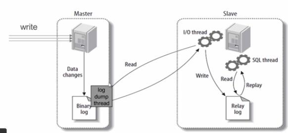

**该架构存在的问题：**

主库的宕机可能存在数据的丢失；当然从库也可能宕机，我们可以部署双从；

从库只有一个 SQL 线程，当用户的操作过多时，主库生成大量的 bin-log 二进制日志，从库可能忙不过来；

 

**数据库高可用介绍：**

我们使用的是 MHA 软件。

MHA 可以运行在每台 MySQL 服务器上，MHA 会定时探测集群中的 master 节点，当 master 出现故障时，它可以自动将最新数据的 slave 提升为新的 master，然后将所有其他的 slave 重新指向新的 master。整个故障转移过程对应用程序完全透明。

 

**MHA 的缺点：**

在 MHA 自动故障切换过程中，MHA 试图从宕机的主服务器上保存二进制日志，最大程度的保证数据的不丢失，但这并不总是可行的。例如，如果主服务器硬件故障或无法通过 ssh 访问，MHA 没法保存二进制日志，只进行故障转移而丢失了最新的数据。


## 2、mysql数据备份工具

mysqldump工具，mysqldump是mysql自带的备份工具，目录在bin目录下面：/usr/local/mysql/bin/mysqldump，支持基于innodb的热备份，但是由于是逻辑备份，所以速度不是很快，适合备份数据比较小的场景，Mysqldump完全备份+二进制日志可以实现基于时间点的恢复。

**基于LVM快照备份**

在物理备份中，有基于文件系统的物理备份（LVM的快照），也可以直接用tar之类的命令对整个数据库目录
进行打包备份，但是这些只能进行泠备份，不同的存储引擎备份的也不一样，myisam自动备份到表级别
而innodb不开启独立表空间的话只能备份整个数据库。

**tar包备份**

percona提供的xtrabackup工具，支持innodb的物理热备份，支持完全备份，增量备份，而且速度非常快，支持innodb存储引起的数据在不同，数据库之间迁移，支持复制模式下的从机备份恢复备份恢复，为了让xtrabackup支持更多的功能扩展，可以设立独立表空间，打开 innodb_file_per_table功能，启用之后可以支持单独的表备份


## 3、mysql的innodb如何定位锁问题，mysql如何减少主从复制延迟？

mysql的innodb如何定位锁问题:
在使用 show engine innodb status检查引擎状态时，发现了死锁问题
在5.5中，information_schema 库中增加了三个关于锁的表（MEMORY引擎）
innodb_trx         ## 当前运行的所有事务
innodb_locks     ## 当前出现的锁
innodb_lock_waits  ## 锁等待的对应关系

**mysql如何减少主从复制延迟:**

如果延迟比较大，就先确认以下几个因素：

1.从库硬件比主库差，导致复制延迟

2.主从复制单线程，如果主库写并发太大，来不及传送到从库就会导致延迟。

3.更高版本的mysql可以支持多线程复制

4.慢SQL语句过多

5.网络延迟

6.master负载，主库读写压力大，导致复制延迟，架构的前端要加buffer及缓存层

7.slave负载，一般的做法是，使用多台slave来分摊读请求，再从这些slave中取一台专用的服务器，只作为备份用，不进行其他任何操作.另外， 2个可以减少延迟的参数:–slave-net-timeout=seconds 单位为秒 默认设置为 3600秒

参数含义：当slave从主数据库读取log数据失败后，等待多久重新建立连接并获取数据

–master-connect-retry=seconds 单位为秒 默认设置为 60秒

参数含义：当重新建立主从连接时，如果连接建立失败，间隔多久后重试

通常配置以上2个参数可以减少网络问题导致的主从数据同步延迟

**MySQL数据库主从同步延迟解决方案**

最简单的减少slave同步延时的方案就是在架构上做优化，尽量让主库的DDL快速执行，还有就是主库是写（读写分离），对数据安全性较高，比如sync_binlog=1，innodb_flush_log_at_trx_commit= 1 之类的设置，而slave则不需要这么高的数据安全，完全可以讲sync_binlog设置为0或者关闭binlog，innodb_flushlog也可以设置为0来提高sql的执行效率。另外就是使用比主库更好的硬件设备作为slave

## 4、如何重置mysql root密码？

一、 在已知MYSQL数据库的ROOT用户密码的情况下，修改密码的方法：

1、 在SHELL环境下，使用mysqladmin命令设置：

```
mysqladmin –u root –p password “新密码”   回车后要求输入旧密码
```

2、 在mysql>环境中,使用update命令，直接更新mysql库user表的数据：

```
Update  mysql.user  set  password=password(‘新密码’)  where  user=’root’;
flush   privileges;
```


​      注意：mysql语句要以分号”；”结束

3、 在mysql>环境中，使用grant命令，修改root用户的授权权限。

```
grant  all  on  *.*  to   root@’localhost’  identified  by  ‘新密码’；
```

二、 如查忘记了mysql数据库的ROOT用户的密码，又如何做呢？方法如下：

1、 关闭当前运行的mysqld服务程序：service  mysqld  stop（要先将mysqld添加为系统服务）
2、 使用mysqld_safe脚本以安全模式（不加载授权表）启动mysqld 服务

```
 /usr/local/mysql/bin/mysqld_safe  –skip-grant-table  &
```

3、 使用空密码的root用户登录数据库，重新设置ROOT用户的密码

```
＃mysql  -u   root
Mysql> Update  mysql.user  set  password=password(‘新密码’)  where  user=’root’;
Mysql> flush   privileges;
```


# **面试技巧篇**

\1. 公司是做什么业务的

答：贯通云网快递平台网页版。集合了国内七大现有快递公司的业务终端，并在陆续扩展中。集中了在线填写，预约发件；智能跟踪，智能查询，快件信息管理等优点！

指尖快递APP---基于线上平台数据，建立快递代办点业务体系。

\2. 2.公司有多少服务器

答：80台

\3. 你负责多少台

答：我主要负责网页端的40台

\4. 每台服务器都跑的啥

答：6台web，两台redis，6台数据库，还有nginx，tomcat，LVS负载+keepalived高可用什么的，剩下的都是平时测试用的。

\5. 公司规模多大

答：中小型企业。

\6. 公司有个运维

答：2个，我负载web端，另一个负责APP端。

\7. 你的汇报对象是谁

答：我们老大

\8. 你们公司用的什么语言

答：开发用的是JAVA

\9. 你们的开发有多少人

答：开发是3个

\10. 运维怎么分工的

答：也没啥分工，一起干

\11. 你的期望薪资是多少

答：因为上家公司给的是13K，所以 不低于13吧

\12. 你平时出差多吗

答：出差不多，因为公司业务主要都在线上。说实话我还是挺想出去走走的。

\13. 你们学校是统招还是非统招

答：统招的。

\14. 你们学校是全日制的吗

答：是全日制的

\15. 你离职原因是啥

答：因为学历问题，公司要给我做降薪处理，有点接受不了

\16. 你觉得你的优点和缺点是啥

答：优点：沟通能力强，团队协作能力强，乐于助人，喜欢学习。

​    缺点：长得丑算吗？

\17. 你工作之余有什么爱好  

答：看一些技术方面的书，研究一些新的技术。

\18. 你最近有学习过哪些新技术

答：python

19.你住的地方，离公司有多远

公司在哪里，我就住哪里

20.你们公司哪年成立的

答：2014年5月成立的。

21.每台服务器都跑的啥 答：6台web，两台redis，6台数据库，还有nginx，tomcat，LVS负载+keepalived高可用什么的，剩下的都是平时测试用的

22.你们公司服务器都是什么型号

答：戴尔R710  R720 

23机房温度是多少

15--22

24.你对加班怎么看的

答：我觉得IT行业加班很正常啊，如果我有幸进入公司的话，我会主动去加班，尽快熟悉公司业务，能早点上手工作。

 

25.到公司需要多长时间？

不堵车的时候半个小时左右，当然我更喜欢住的公司近一点，如果有幸来公司入职，我肯定会在附近找一个住的地方

27.如果你跟领导的意见不一样，你会如何做

答：那就要看是什么方面的了，如果是技术方面的话，我觉得我会跟领导私下再去沟通一下，跟领导阐明我的观点和理由，剩下的就看领导的决定了。

 

28.每天你作为运维每天工作都干嘛？

  看流量，看报警，搭环境，改配置，处理开发人员的需求， 下午上线，  做项目（权限管理，集中分治，跳板机） 内网的活，网络上不了网有时候也负责。

近一年主要做的是做运维规范，服务器维护升级规范，文档规范，服务器权限规范等等，都是我写好，让老大审批，然后就有分歧的地方再商讨。

这段时间因为要离职了，所以交接内容我也在整理文档，在面试新员工方面我也参与

 

29.列举你所知道的攻击手段，以及针对性的安全措施？

Ddos攻击、暴力破解密码

Ddos攻击防范：

1.对网站进行Ddos压力测试，选择安全的机房，对架构优化尽量多方cache

2.使用Ddosdeflate工具进行检测，如果访问量超过某值，对访问的IP进行禁封

暴力破解密码防范：使用fail2ban工具进行检测，如果输入密码次数超过定义的次数，对访问的IP进行禁封

 

**30.你们是怎么处理报警的？**

我们都是按照报警返回来的信息来进行处理，例如服务的运行状态出现意外

我们也会对他进行一个分级：一级就是通过邮箱报警一些简单地事故一般都是初级运维来处理，二级就是通过微信报警来通知我们，三级的话就是电话报警是直接打给我们老大，我们老大进行处理

\31. 公司代码上线是怎么做的，发布周期是多长时间，一般什么时候上线 

答： 最初始的代码上线

dev: 开发服务版本库 bate 测试服务版本库， online线上服务版本库 测试通过后，再客户端选2000到3000个用户强制弹窗，让其更新版本。进行灰度发布。 有bug修复后再走一遍流程。 所谓的灰度发布： 根据自己的配置，将部分用户的流量导到新系统来验证新功能的修改，一旦出现问题可以马上修复。 一周上线一次，周四上线，有问题就回滚，周五继续上线

\32. 什么是灰度发布，什么是灰度测试 答： 所谓的灰度发布： 根据自己的配置，将部分用户的流量导到新系统来验证新功能的修改，一旦出现问题可以马上修复

33.代码如何回滚，用jenkins如何实现 

答：发布：jenkins配置好代码路径（SVN或GIT），然后拉代码，打tag。需要编译就编译，编译之后推送到发布服务器（jenkins里面可以调脚本），然后从分发服务器往下分发到业务服务器上。发布：jenkins配置好代码路径（SVN或GIT），然后拉代码，打tag。需要编译就编译，编译之后推送到发布服务器（jenkins里面可以调脚本），然后从分发服务器往下分发到业务服务器上。 回滚：按照版本号到发布服务器找到对应的版本推送

34.上线前开发给你的包是什么包 答：jar war

35.svn与git相比有什么区别？ 

1）git 只关心文件数据的整体是否发生改变，而svn关心 的是内容是否改变 

2）git的绝大多数操作只需要访问本地的文件和资源，不用联网查看所有的历史版本记录，而svn需要联网 

3） svn断网后无法commit代码，而git可以先commit到本地仓库 

4）git克隆一个完整项目非常快，而svn非常慢 范例一： 我们公司用的是SVN，但我私下里也学习了下git,个人感觉，SVN更好上手，但是论功能强大的化还是git好一些，比如同样是克隆一个完整项目，git就比svn快，而且有时候，一旦断网git可以commit到本地仓库，但是SVN就没法commit . 

36.代码上线时运维需要做的事情？ 

答：配合开发搭建测试环境，调试，测试代码 采购阿里云服务器，安装系统，配置服务 部署上线过程中发现bug，与开发沟通，前端沟通，开发解决完继续上线 出现问题，回滚（需要提前确定好回滚机制） 备份恢复： 

37.备份分为哪几种？ 

答：完全备份 增量备份 文件备份 

38.全量用什么工具，增量用什么工具 

答：全量：XtraBackup 增量：mysqldump 1.写脚本每天晚上0点，定时将B服务器数据备份到A，并把备份结果发给运维
