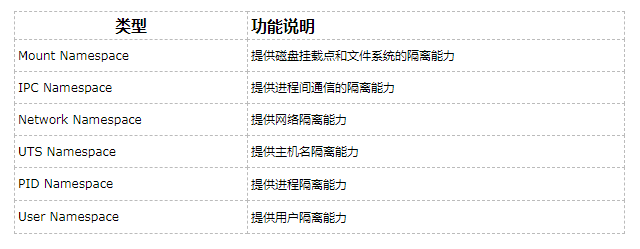

[TOC]

# k8s架构及服务详解

# 1. 容器及其三要素

## 1.1 容器是什么

容器的本质是一种特殊的进程。

在linux容器中有三个重要的概念：Namespace、Cgroups、rootfs。

Namespace 做隔离，让进程只能看到Namespace中的世界；

Cgroups       做限制，限制单个进程对系统资源的使用量。

rootfs           做文件系统，rootfs 只是一个操作系统所包含的文件、配置和目录，并不包括操作系统内核。

这样就实现了进程在我们所看到的一个与世隔绝的房间，这个房间就是Pass项目赖以生存的"沙盒"。

## 1.2.Namespace

进入容器后，ps命令看到的容器的应用进程都是1号进程，这个其实是pid  namespace导致，他其实就是个障眼法，

让你看到的是类似于一个新的虚拟机新环境，其实是不一样的，容器就是一个运行的进程，而容器中的其他进程则是pid为1的子进程。

除了刚刚pid namespace，还有其它的namespace如下：

容器是怎么新建namespace的？

docker创建容器，其实就是linux系统的一次fork的调用，

在进行fork调用时，会传入一些flag参数，这个参数可以控制对linux内核调用新的namespace。

## 1.3.rootfs

挂载在容器根目录上、用来为容器进程提供隔离后执行环境的文件系统，就是所谓的“容器镜像”。它还有一个更为专业的名字，叫作：rootfs（根文件系统）。

容器的rootfs由三部分组成，1：只读层、2：可读写层、3：init层

1.只读层:都以增量的方式分别包含了  操作系统的一部分。

2.可读写：就是专门用来存放你修改 rootfs 后产生的增量，无论是增、删、改，都发生在这里。而当我们使用完了这个被修改过的容器之后，还可以使用 docker commit 和 push 指令，保存这个被修改过的可读写层，并上传到 Docker Hub 上，供其他人使用；而与此同时，原先的只读层里的内容则不会有任何变化。这，就是增量 rootfs 的好处。

3.Init 层：是 Docker 项目单独生成的一个内部层，专门用来存放 /etc/hosts、/etc/resolv.conf 等信息。

