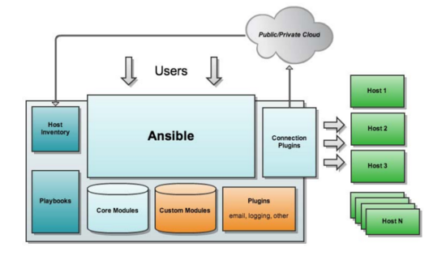

[TOC]


# Ansible自动化工具

​	ansible是一款无需在被管理主机上安装客户端，基于SSH对多台目标主机进行同时操作的轻量级的管理软件，借助各个内部的功能模块，实现了批量系统配置、批量程序部署、批量运行命令等功能。本篇就介绍一些关于ansible的基础配置相关的内容。

# 1.1 ansible的简介

ansible是新出现的自动化运维工具，基于Python开发，集合了众多运维工具（puppet、cfengine、chef、func、fabric）的优点，实现了批量系统配置、批量程序部署、批量运行命令等功能。
ansible是基于模块工作的，本身没有批量部署的能力。真正具有批量部署的是ansible所运行的模块，ansible只是提供一种框架。主要包括：
(1)、连接插件connection plugins：负责和被监控端实现通信；
(2)、host inventory：指定操作的主机，是一个配置文件里面定义监控的主机；
(3)、各种模块核心模块、command模块、自定义模块；
(4)、借助于插件完成记录日志邮件等功能；
(5)、playbook：剧本执行多个任务时，非必需可以让节点一次性运行多个任务

## 1.1.1 ansible的软件结构



```
Host Inventory：主机清单，也就是被管理的主机列表
Playbooks：ansible的剧本，可想象为将多个任务放置在一起，一块执行
Core Modules：ansible的核心模块
Custom Modules：自定义模块
Connection Plugins：连接插件，用于与被管控主机之间基于SSH建立连接关系
Plugins：其他插件，包括记录日志等
```


## 1.1.2 ansible的特性

- 模块化：调用特定的模块，完成特定任务
- 基于python语言实现，由Paramiko(完成基于ssh的连接)，PyYAML(对YAML文件的支持)，jinja2(python的模板库)三个关键的模块
- 部署简单：是没有客户端的
- 支持自定义模块，使用任意编程语言
- 支持强大的playbook
- 具有幂等性：一个操作在一个主机上执行一遍和执行N遍的结果是一样的


# 2.1 ansible的基础应用

## 2.1.1 安装

在EPEL源中，有包含ansible的软件包安装只需要配置好EPEL的yum源，yum安装即可

```shell
yum -y install ansible
rpm -qa ansible   检查安装是否成功
```

ansible被管控主机的定义


# 3.1 ansible常用模块介绍

# 4.1 playbook基础应用介绍

# 5.1 playbook中handlers(触发器)

# 6.1 playbook中tags(标签)

# 7.1 playbook中variables(变量)

# 8.1 playbook中templates(模板)

# 9.1 playbook中条件判断机制

# 10.1 playbook中的循环(迭代)机制的介绍

# 11.1 ansible的roles(角色)功能的介绍

# 实战一：keepalived+nginx

# 实战二：实战一的基础上在nginx后端提供httpd+php+php-mysql

# 实战三：在此前实验基础上配置mysql服务