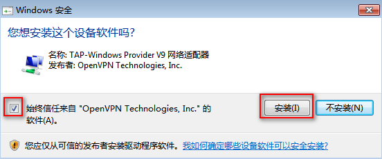
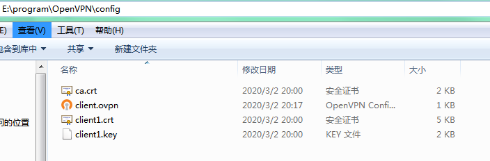
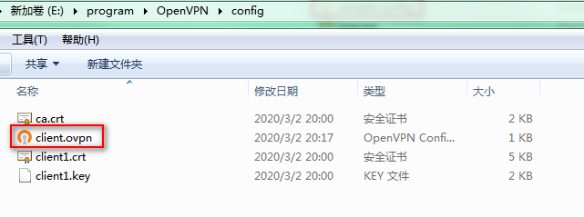
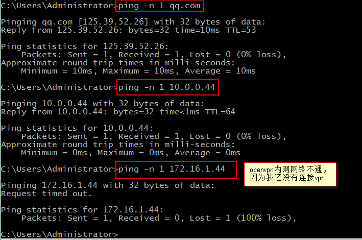
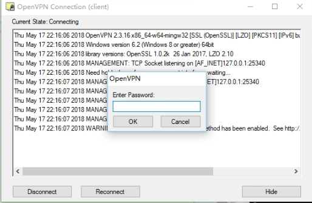
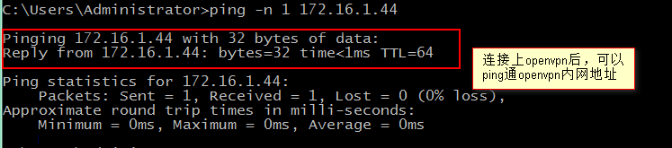
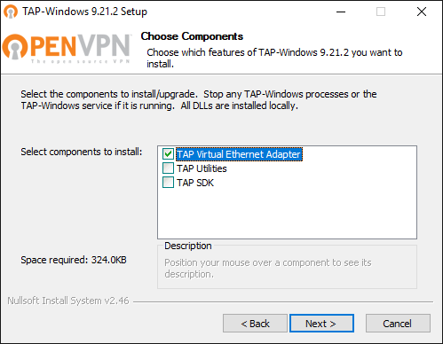
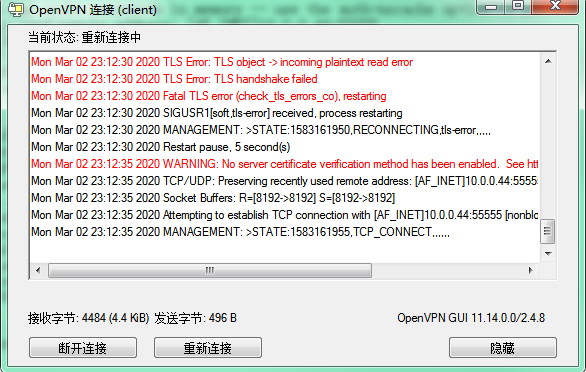

[TOC]


# CentOS7部署OpenVPN

# 1.1 VPN介绍

VPN（全称Virtual Private Network），直译就是虚拟专用网络，是提供给企业之间或者个人与公司之间安全数据传输的隧道，可以对网络加密，使得其安全性能提升，OpenVPN无疑是Linux下开源VPN的先锋，提供了良好的性能和友好的用户GUI。

（1）依靠ISP和其他的NSP，在公共网络中建立专用的数据通信网络的技术，可以为企业之间或个人与企业之间提供安全的数据传输隧道服务

（2）在VPN中任意两点之间的连接并没有传统专网所需的端到端的物理链路，而是利用公共网络资源动态组成的，可以理解为通过私有的隧道技术在公共数据网络上模拟出来和专用有同样功能的点到点的专线技术

（3）所谓虚拟是指不需要去拉实际的长途物理线路，而是借用了公共的Internet网络实现。

（4）类似VPN隧道：SSH，LVS，TUN（IPIP），PPTP，IPsec，OpenVPN


## 1.1.1 Openvpn工作原理

openvpn通过使用公开密钥（非对称密钥，加密解密使用不同的key，一个称为Publice key，另外一个是Private key）对数据进行加密的。这种方式称为TLS加密。

openvpn使用TLS加密的工作过程是，首先VPN Sevrver端和VPN Client端要有相同的CA证书，双方通过交换证书验证双方的合法性，用于决定是否建立VPN连接。

然后使用对方的CA证书，把自己目前使用的数据加密方法加密后发送给对方，由于使用的是对方CA证书加密，所以只有对方CA证书对应的Private key才能解密该数据，这样就保证了此密钥的安全性，并且此密钥是定期改变的，对于窃听者来说，可能还没有破解出此密钥，VPN通信双方可能就已经更换密钥了。


## 1.1.2 企业应用分类

（1）远程访问VPN服务

​	员工个人电脑通过远程拨号到企业办公网络，如公司的OA系统

​	运维人员远程拨号到IDC机房，远程维护服务器

（2）企业内部网络之间VPN服务

​	公司分支机构的局域网和总公司的LAN之间的VPN连接，如各大超市之间的业务结算等

（3）互联网公司多IDC机房之间VPN服务

​	不同机房之间业务管理和业务访问，数据流动

（4）企业外部VPN服务

​	在供应商，合作伙伴的LAN和本公司的LAN之间建立VPN服务

（5）访问国外的网站

​	翻墙业务应用


## 1.1.3 常见隧道协议介绍

（1）PPTP：点对点隧道协议，默认端口号1723，工作在第二层，PPTP使用TCP协议，适合在没有防火墙限制的网络中使用，比较适合远程的企业用户拨号到楪祈内部进行办公等应用

（2）L2TP

（3）IPSEC

（4）SSL VPN----Open VPN


## 1.1.4 实现VPN的常见开源产品

（1）PPTP VPN最大优势Windows原生支持，不需要安装客户端；缺点是很多小区及网络设备不支持pptp导致无法访问，开源软件pptp

（2）SSL VPN 典型Open VPN，不但适合用于pptp的场景，还适合对企业异地两地总分公司之间的VPN不间断按需连接，切断需要安装客户端

（3）IPSEC VPN适合针对企业异地两地总分公司或多个IDC机房之间的VPN不间断按需连接，并且在部署使用上更简单方便，开源产品openswan小结：

易用性：PPTP > L2TP > Open VPN

速度：PPTP > Open VPN UDP > L2TP > Open VPN TCP 

安全性：Open VPN > L2TP > PPTP

稳定性：Open VPN > L2TP > PPTP

网络适用性：Open VPN > PPTP > L2TP 


# 1.2 安装部署

## 1.2.1 环境介绍

本次实验环境采用TUN模式Remote Access VPN，openvpn服务器共两张网卡，以下为vmware虚机信息

| 主机名  | 系统           | 配置  | 外网ip    | 内网ip      |
| ------- | -------------- | ----- | --------- | ----------- |
| openvpn | CentOS7.3.1611 | 1核1G | 10.0.0.44 | 172.16.1.44 |

## 1.2.2 安装openvpn

```shell
[root@ openvpn ~]# yum -y install epel-re*
[root@ openvpn ~]# yum install -y openvpn
[root@ openvpn ~]# rpm -qa|grep openvpn|cut -c 1-13
openvpn-2.4.8
```

## 1.2.3 安装open-rsa

```shell
[root@ openvpn ~]# wget https://github.com/OpenVPN/easy-rsa/archive/master.zip
[root@ openvpn ~]# unzip master.zip
[root@ openvpn ~]# mv easy-rsa-master/ easy-rsa
[root@ openvpn ~]# cp -R easy-rsa/ /etc/openvpn/
[root@ openvpn ~]# ls /etc/openvpn/
client  easy-rsa  server
```

## 1.2.4 配置vars文件

```shell
[root@ openvpn ~]# cd /etc/openvpn/easy-rsa/easyrsa3/
[root@ openvpn easyrsa3]# cp vars.example vars
[root@ openvpn easyrsa3]# cat >>vars<<EOF
set_var EASYRSA_REQ_COUNTRY     "CN"
set_var EASYRSA_REQ_PROVINCE    "BJ"
set_var EASYRSA_REQ_CITY        "Beijing"
set_var EASYRSA_REQ_ORG         "Benet"
set_var EASYRSA_REQ_EMAIL       "602616568@qq.com"
set_var EASYRSA_REQ_OU          "dynamic"
EOF
```

# 1.3 创建server证书

<!--注意：以下创建证书内容，凡是带#注释的都需要留意。-->

## 1.3.1 初始化目录

```shell
[root@ openvpn easyrsa3]# ./easyrsa init-pki

Note: using Easy-RSA configuration from: /etc/openvpn/easy-rsa/easyrsa3/vars

init-pki complete; you may now create a CA or requests.
Your newly created PKI dir is: /etc/openvpn/easy-rsa/easyrsa3/pki
```


## 1.3.2 创建CA证书

```shell
[root@ openvpn easyrsa3]# ./easyrsa build-ca

Note: using Easy-RSA configuration from: /etc/openvpn/easy-rsa/easyrsa3/vars
Using SSL: openssl OpenSSL 1.0.2k-fips  26 Jan 2017

Enter New CA Key Passphrase:123456		#CA密码
Re-Enter New CA Key Passphrase:123456   #重复一边
Generating RSA private key, 2048 bit long modulus
.........................+++
.............................+++
e is 65537 (0x10001)
You are about to be asked to enter information that will be incorporated
into your certificate request.
What you are about to enter is what is called a Distinguished Name or a DN.
There are quite a few fields but you can leave some blank
For some fields there will be a default value,
If you enter '.', the field will be left blank.
-----
Common Name (eg: your user, host, or server name) [Easy-RSA CA]:dynamic  #CA名字

CA creation complete and you may now import and sign cert requests.
Your new CA certificate file for publishing is at:
/etc/openvpn/easy-rsa/easyrsa3/pki/ca.crt
```


## 1.3.3 创建服务器端证书

```shell
[root@ openvpn easyrsa3]# ./easyrsa gen-req server nopass

Note: using Easy-RSA configuration from: /etc/openvpn/easy-rsa/easyrsa3/vars
Using SSL: openssl OpenSSL 1.0.2k-fips  26 Jan 2017
Generating a 2048 bit RSA private key
...............................................+++
.............+++
writing new private key to '/etc/openvpn/easy-rsa/easyrsa3/pki/easy-rsa-3192.fYG5Hw/tmp.aJ1YQg'
-----
You are about to be asked to enter information that will be incorporated
into your certificate request.
What you are about to enter is what is called a Distinguished Name or a DN.
There are quite a few fields but you can leave some blank
For some fields there will be a default value,
If you enter '.', the field will be left blank.
-----
Common Name (eg: your user, host, or server name) [server]:dynamic-server  #为server起名

Keypair and certificate request completed. Your files are:
req: /etc/openvpn/easy-rsa/easyrsa3/pki/reqs/server.req
key: /etc/openvpn/easy-rsa/easyrsa3/pki/private/server.key

```

## 1.3.4 签约服务端证书

```shell
[root@ openvpn easyrsa3]# ./easyrsa sign server server

Note: using Easy-RSA configuration from: /etc/openvpn/easy-rsa/easyrsa3/vars
Using SSL: openssl OpenSSL 1.0.2k-fips  26 Jan 2017


You are about to sign the following certificate.
Please check over the details shown below for accuracy. Note that this request
has not been cryptographically verified. Please be sure it came from a trusted
source or that you have verified the request checksum with the sender.

Request subject, to be signed as a server certificate for 825 days:

subject=
    commonName                = dynamic-server


Type the word 'yes' to continue, or any other input to abort.
  Confirm request details: yes  #输入yes
Using configuration from /etc/openvpn/easy-rsa/easyrsa3/pki/easy-rsa-3218.qreoir/tmp.8dafCM
Enter pass phrase for /etc/openvpn/easy-rsa/easyrsa3/pki/private/ca.key:123456  #输入之前CA密码
Check that the request matches the signature
Signature ok
The Subject's Distinguished Name is as follows
commonName            :ASN.1 12:'dynamic-server'
Certificate is to be certified until Jun  5 13:49:50 2022 GMT (825 days)

Write out database with 1 new entries
Data Base Updated

Certificate created at: /etc/openvpn/easy-rsa/easyrsa3/pki/issued/server.crt
```

## 1.3.5 创建数据穿越密钥

```shell
[root@ openvpn easyrsa3]# ./easyrsa gen-dh

Note: using Easy-RSA configuration from: /etc/openvpn/easy-rsa/easyrsa3/vars
Using SSL: openssl OpenSSL 1.0.2k-fips  26 Jan 2017
Generating DH parameters, 2048 bit long safe prime, generator 2
This is going to take a long time
..........................................................................++*++*

DH parameters of size 2048 created at /etc/openvpn/easy-rsa/easyrsa3/pki/dh.pem

#这里需要等一会
```


# 1.4 创建client证书

## 1.4.1 初始化目录

```shell
[root@ openvpn easyrsa3]# cd /etc/openvpn/client/
[root@ openvpn client]# cp -R /root/easy-rsa/ client
[root@ openvpn client]#  cd client/easyrsa3/
[root@ openvpn easyrsa3]# ls
easyrsa  openssl-easyrsa.cnf  vars.example  x509-types
[root@ openvpn easyrsa3]#  ./easyrsa init-pki

init-pki complete; you may now create a CA or requests.
Your newly created PKI dir is: /etc/openvpn/client/client/easyrsa3/pki

```

## 1.4.2 创建客户端CA证书

```shell
[root@ openvpn easyrsa3]# ./easyrsa build-ca
Using SSL: openssl OpenSSL 1.0.2k-fips  26 Jan 2017

Enter New CA Key Passphrase:123456  #输入客户端CA密码
Re-Enter New CA Key Passphrase:123456  #再次输入客户端CA密码
Generating RSA private key, 2048 bit long modulus
......................+++
..........+++
e is 65537 (0x10001)
You are about to be asked to enter information that will be incorporated
into your certificate request.
What you are about to enter is what is called a Distinguished Name or a DN.
There are quite a few fields but you can leave some blank
For some fields there will be a default value,
If you enter '.', the field will be left blank.
-----
Common Name (eg: your user, host, or server name) [Easy-RSA CA]:dynamic  #客户端名称

CA creation complete and you may now import and sign cert requests.
Your new CA certificate file for publishing is at:
/etc/openvpn/client/client/easyrsa3/pki/ca.crt

```

## 1.4.3 创建客户端证书

```shell
[root@ openvpn easyrsa3]# ./easyrsa gen-req client1
Using SSL: openssl OpenSSL 1.0.2k-fips  26 Jan 2017
Generating a 2048 bit RSA private key
............................+++
.........................+++
writing new private key to '/etc/openvpn/client/client/easyrsa3/pki/easy-rsa-3382.Ms5ceP/tmp.MIix7I'
Enter PEM pass phrase:123456  #输入客户端CA密码，也是将来登录VPN客户密码！
Verifying - Enter PEM pass phrase:123456  #再来一次
-----
You are about to be asked to enter information that will be incorporated
into your certificate request.
What you are about to enter is what is called a Distinguished Name or a DN.
There are quite a few fields but you can leave some blank
For some fields there will be a default value,
If you enter '.', the field will be left blank.
-----
Common Name (eg: your user, host, or server name) [client1]:dynamic-client1  #起名字

Keypair and certificate request completed. Your files are:
req: /etc/openvpn/client/client/easyrsa3/pki/reqs/client1.req
key: /etc/openvpn/client/client/easyrsa3/pki/private/client1.key

```

## 1.4.4 导入客户端证书

```shell
[root@ openvpn easyrsa3]# cd /etc/openvpn/easy-rsa/easyrsa3/
[root@ openvpn easyrsa3]# ./easyrsa import-req /etc/openvpn/client/client/easyrsa3/pki/reqs/client1.req client1

Note: using Easy-RSA configuration from: /etc/openvpn/easy-rsa/easyrsa3/vars
Using SSL: openssl OpenSSL 1.0.2k-fips  26 Jan 2017

The request has been successfully imported with a short name of: client1
You may now use this name to perform signing operations on this request.


```

## 1.4.5 签约客户端证书

```shell
[root@ openvpn easyrsa3]# ./easyrsa sign client client1

Note: using Easy-RSA configuration from: /etc/openvpn/easy-rsa/easyrsa3/vars
Using SSL: openssl OpenSSL 1.0.2k-fips  26 Jan 2017


You are about to sign the following certificate.
Please check over the details shown below for accuracy. Note that this request
has not been cryptographically verified. Please be sure it came from a trusted
source or that you have verified the request checksum with the sender.

Request subject, to be signed as a client certificate for 825 days:

subject=
    commonName                = dynamic-client1


Type the word 'yes' to continue, or any other input to abort.
  Confirm request details: yes  #输入yes
Using configuration from /etc/openvpn/easy-rsa/easyrsa3/pki/easy-rsa-3476.jb2Uvu/tmp.8njESx
Enter pass phrase for /etc/openvpn/easy-rsa/easyrsa3/pki/private/ca.key:123456  #输入登录密码
Check that the request matches the signature
Signature ok
The Subject's Distinguished Name is as follows
commonName            :ASN.1 12:'dynamic-client1'
Certificate is to be certified until Jun  5 14:14:32 2022 GMT (825 days)

Write out database with 1 new entries
Data Base Updated

Certificate created at: /etc/openvpn/easy-rsa/easyrsa3/pki/issued/client1.crt

```


# 1.5 配置openvpn

## 1.5.1 拷贝证书文件

```shell
[root@ openvpn easyrsa3]# cd /etc/openvpn/easy-rsa/easyrsa3/pki/
[root@ openvpn pki]# cp ca.crt /etc/openvpn/server/
[root@ openvpn pki]# cp private/server.key /etc/openvpn/server/
[root@ openvpn pki]# cp issued/server.crt /etc/openvpn/server/
[root@ openvpn pki]# cp dh.pem /etc/openvpn/server/
[root@ openvpn pki]# cp ca.crt /etc/openvpn/client/
[root@ openvpn pki]# cp issued/client1.crt /etc/openvpn/client/
[root@ openvpn pki]# cp /etc/openvpn/client/client/easyrsa3/pki/private/client1.key /etc/openvpn/client/

[root@ openvpn pki]# ls /etc/openvpn/server
ca.crt  dh.pem  server.crt  server.key
[root@ openvpn pki]# ls /etc/openvpn/client/
ca.crt  client  client1.crt  client1.key
```

## 1.5.2 配置server.conf

超链接配置文件 [server.conf](assets\server.conf) 

```shell
[root@ openvpn pki]# cp /usr/share/doc/openvpn-2.4.8/sample/sample-config-files/server.conf /etc/openvpn
[root@ openvpn pki]# cd /etc/openvpn
[root@ openvpn openvpn]# cp server.conf server.conf.bak
[root@ openvpn openvpn]# egrep -v "^#|^;|^$" server.conf.bak > server.conf

[root@ openvpn openvpn]# vim server.conf
local 0.0.0.0	 # 填自己openvpn服务器的 IP，默认侦听服务器上的所有ip
port 55555		 # 侦听端口，默认1194
proto tcp		 # 端口协议，默认udp，也可以开启tcp方便映射转发。
dev tun			 # 默认创建一个路由IP隧道
ca /etc/openvpn/server/ca.crt			# 根证书
cert /etc/openvpn/server/server.crt		# 证书
key /etc/openvpn/server/server.key		# 私钥文件/重要保密
dh /etc/openvpn/server/dh.pem
server 10.8.0.0 255.255.255.0		# 设置服务器端模式，并提供一个VPN子网，以便于从中为客户端分配IP地址。
push "route 172.16.1.0 255.255.255.0"	# 推送路由信息到客户端，以允许客户端能够连接到服务器背后的其他私有子网。(简而言之，就是允许客户端访问VPN服务器自身所在的其他局域网)
ifconfig-pool-persist ipp.txt		# 指定用于记录客户端和虚拟IP地址的关联关系的文件。当重启OpenVPN时，再次连接的客户端将分配到与上一次分配相同的虚拟IP地址
keepalive 10 120 # keepalive指令将导致类似于ping命令被来回发送，以便于服务器端和客户端知道对方何时被关闭
persist-key
persist-tun
status openvpn-status.log		# 状态日志
verb 3		#日志级别0-9，等级越高，记录越多
comp-lzo	# 在VPN连接上启用压缩。如果你在此处启用了该指令，那么也应该在每个客户端配置文件中启用它
max-clients 100		#默认最大客户端连接100，为安全可限到1或2。持久化选项可以尽量避免访问那些在重启之后由于用户权限降低而无法访问的某些资源。
client-to-client	#允许客户端之间互通
log /var/log/openvpn.log
```

还有许多详细配置，可查看官网说明。

## 1.5.3 配置firewalld转发并启动openvpn

```shell
[root@ openvpn openvpn]# systemctl stop firewalld
[root@ openvpn openvpn]# echo "net.ipv4.ip_forward = 1" >> /etc/sysctl.d/99-sysctl.conf
[root@ openvpn openvpn]# sysctl -p
net.ipv4.ip_forward = 1
[root@ openvpn openvpn]# openvpn --daemon --config /etc/openvpn/server.conf
[root@ openvpn openvpn]# echo "openvpn --daemon --config /etc/openvpn/server.conf">>/etc/rc.d/rc.local
[root@ openvpn openvpn]# ps -ef | grep openvpn
[root@ openvpn openvpn]# ss -anpt| grep 55555
```


# 1.6 客户端配置

## 1.6.1 客户端安装

<https://openvpn.net/community-downloads/>

<https://www.techspot.com/downloads/5182-openvpn.html>

最好下载与服务端版本一致的客户端。




## 1.6.2 客户端证书下载

```
[root@ openvpn openvpn]# cd /etc/openvpn/client/
[root@ openvpn client]#  sz ca.crt client1.crt client1.key
#sz到openvpn客户端软件的config目录下
```

**拷贝sample-config中client.ovpn到config目录**


**config目录下内容**



## 1.6.3 配置client.ovpn



```shell
client
dev tun
proto tcp
remote 10.0.0.44 55555	#修改成openvpn服务器的ip和openvpn的端口
resolv-retry infinite
nobind
persist-key
persist-tun
ca ca.crt
cert client1.crt
key client1.key
comp-lzo
verb 3
```


## 1.6.4 客户端连接测试

**未连接状态**





**连接状态**

连接vpn，输入客户端证书密码：123456







# 附文：

## easy-rsa2.0生成证书

```shell
wget https://codeload.github.com/OpenVPN/easy-rsa-old/zip/master
unzip easy-rsa-old-master.zip
cd easy-rsa-old-master/easy-rsa/2.0  #修改目录下的vars文件
ln -s openssl-1.0.0.cnf openssl.cnf
#可修改vars文件中定义的变量用于生成证书的基本信息。下面生成CA证书：
source vars
./clean-all
./build-ca
#因为已经在var中填写了证书的基本信息，所以一路回车即可。生成证书如下：
ls keys/
ca.crt  ca.key  index.txt  serial

#生成服务器端秘钥：
./build-key-server server
Common Name (eg, your name or your server's hostname) [server]:
A challenge password []:1234

ls keys
01.pem  ca.crt  ca.key  index.txt  index.txt.attr  index.txt.old  serial  serial.old  server.crt  server.csr  server.key

#生成客户端证书：
./build-key client
Common Name (eg, your name or your server's hostname) [client]:
A challenge password []:1234
#Common Name用于区分客户端，不同的客户端应该有不同的名称。

#Generating DH parameters：
./build-dh

ls keys/
01.pem  02.pem  ca.crt  ca.key  client.crt  client.csr  client.key  dh2048.pem  index.txt  index.txt.attr  index.txt.attr.old  index.txt.old  serial  serial.old  server.crt  server.csr  server.key

#编译安装OpenVPN：
wget https://swupdate.openvpn.org/community/releases/openvpn-2.4.4.tar.gz
tar -zxvf openvpn-2.4.4.tar.gz
cd openvpn-2.4.4
./configure --prefix=/usr/local/openvpn
make
make install

#配置OpenVPN
mkdir -p /etc/openvpn
mkdir -p /etc/openvpn/pki
生成tls-auth key并将其拷贝到证书目录中：

/us/local/openvpn/sbin/openvpn --genkey --secret ta.key
mv ta.key /etc/openvpn/pki
将签名生成的CA证书秘钥和服务端证书秘钥拷贝到证书目录中：

cp ca.key ca.crt server.crt server.key dh2048.pem /etc/openvpn/pki/

ls /etc/openvpn/pki/
ca.crt  ca.key  dh2048.pem  server.crt  server.key
将OpenVPN源码下的配置文件sample/sample-config-files/server.conf拷贝到/etc/openvpn目录。

编辑服务端配置文件/etc/openvpn/server.conf：
local 192.168.1.2 # 服务端IP
port 1194
proto tcp
dev tun
ca /etc/openvpn/pki/ca.crt
cert /etc/openvpn/pki/server.crt
key /etc/openvpn/pki/server.key
dh /etc/openvpn/pki/dh2048.pem
server 10.8.0.0 255.255.255.0 # 分配给客户端的虚拟局域网段
ifconfig-pool-persist ipp.txt
# 推送路由和DNS到客户端
push "route 192.168.1.0 255.255.255.0"
push "redirect-gateway def1 bypass-dhcp"
push "dhcp-option DNS 192.168.1.1"
push "dhcp-option DNS 8.8.8.8"
client-to-client
keepalive 10 120
tls-auth /etc/openvpn/pki/ta.key 0
cipher AES-256-CBC
comp-lzo
max-clients 10
user nobody
group nobody
persist-key
persist-tun
status /var/log/openvpn-status.log
log  /var/log/openvpn.log
log-append  /var/log/openvpn.log
verb 3
```


## 客户端连接报错

### **1.OpenVPN: All TAP-Windows adapters on this system are currently in use**

> 摘自：<https://jochen.kirstaetter.name/openvpn-on-windows-all-tap-windows-adapters-on-this-system-are-currently-in-use/>

**Get the TAP-Windows driver**

Check whether you have the full installation of OpenVPN software. If yes, you might like to skip this the following steps and directly move on to add another TAP adapter to your Windows system.

Otherwise, please navigate to the [Community Downloads](https://openvpn.net/index.php/download/community-downloads.html) of OpenVPN and either get the latest OpenVPN package, or if you think that this might be an issue, scroll down a little bit on same page and get Tap-windows package for your system. After the download is complete, run the installation routine and make sure to select *TAP Virtual Ethernet Adapter* like so:





### 2.证书报错




