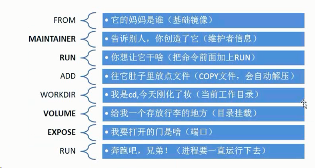

[TOC]


# Docker入门

# Docker 简介

## 什么是 Docker

Docker 最初是 dotCloud 公司创始人 Solomon Hykes 在法国期间发起的一个公司内部项目，它是基于 dotCloud 公司多年云服务技术的一次革新，并于 2013 年 3 月以 Apache 2.0 授权协议开源，主要项目代码在 GitHub 上进行维护。Docker 项目后来还加入了 Linux 基金会，并成立推动 开放容器联盟（OCI）。

Docker 自开源后受到广泛的关注和讨论，至今其 GitHub 项目 已经超过 5 万 4 千个星标和一万多个 fork。甚至由于 Docker 项目的火爆，在 2013 年底，dotCloud 公司决定改名为 Docker。Docker 最初是在 Ubuntu 12.04 上开发实现的；Red Hat 则从 RHEL 6.5 开始对 Docker 进行支持；Google 也在其 PaaS 产品中广泛应用 Docker。

Docker 使用 Google 公司推出的 Go 语言 进行开发实现，基于 Linux 内核的 cgroup，namespace，以及 AUFS 类的 Union FS 等技术，对进程进行封装隔离，属于 操作系统层面的虚拟化技术。由于隔离的进程独立于宿主和其它的隔离的进程，因此也称其为容器。最初实现是基于 LXC，从 0.7 版本以后开始去除 LXC，转而使用自行开发的 libcontainer，从 1.11 开始，则进一步演进为使用 runC 和 containerd。


> runc 是一个 Linux 命令行工具，用于根据 OCI容器运行时规范 创建和运行容器。

> containerd 是一个守护程序，它管理容器生命周期，提供了在一个节点上执行容器和管理镜像的最小功能集。

​	


## Docker与传统虚拟机的区别

​	Docker 在容器的基础上，进行了进一步的封装，从文件系统、网络互联到进程隔离等等，极大的简化了容器的创建和维护。使得 Docker 技术比虚拟机技术更为轻便、快捷。

​	容器与虚拟机有着类似的资源隔离和分配的优点，但拥有不同的架构方法，容器架构更加便携，高效。

| 特性       | 虚拟机的架构 | 容器的架构     |
| ---------- | ------------ | -------------- |
| 启动       | 分钟级       | 秒级           |
| 性能       | 弱于原生     | 接近原生       |
| 硬盘使用   | 一般为GB     | 一般为MB       |
| 系统支持量 | 一般几十个   | 单机上千个容器 |

​	传统虚拟化是在硬件层面实现虚拟化，需要有额外的虚拟机管理应用和虚拟机操作系统层，而Docker容器是在操作系统层面实现虚拟化，应用进程直接运行于宿主的内核，容器内没有自己的内核，而且也没有进行硬件虚拟，直接复用本地主机操作系统，更加轻量级。

​	**虚拟机的架构**： 每个虚拟机都包括应用程序、必要的二进制文件和库以及一个完整的客户操作系统(Guest OS)，尽管它们被分离，它们共享并利用主机的硬件资源，将近需要十几个 GB 的大小。

​	**容器的架构：** 容器包括应用程序及其所有的依赖，但与其他容器共享内核。它们以独立的用户空间进程形式运行在主机操作系统上。他们也不依赖于任何特定的基础设施，Docker 容器可以运行在任何计算机上，任何基础设施和任何云上。


## 基本概念

Docker 包括三个基本概念

- 镜像（Image）
- 容器（Container）
- 仓库（Repository）
  理解了这三个概念，就理解了 Docker 的整个生命周期。


# 安装Docker

## 安装 Docker CE

> 注意：切勿在没有配置 Docker YUM 源的情况下直接使用 yum 命令安装 Docker.

**卸载旧版本**
旧版本的 Docker 称为 docker 或者 docker-engine，使用以下命令卸载旧版本：

```shell
sudo yum remove docker \
docker-client \
docker-client-latest \
docker-common \
docker-latest \
docker-latest-logrotate \
docker-logrotate \
docker-selinux \
docker-engine-selinux \
docker-engine
```

鉴于国内网络问题，强烈建议使用国内源。

**修改yum源为阿里云**

```shell
yum install -y wget 
wget -O /etc/yum.repos.d/CentOS-Base.repo http://mirrors.aliyun.com/repo/Centos-7.repo
wget -O /etc/yum.repos.d/epel.repo http://mirrors.aliyun.com/repo/epel-7.repo
yum clean all
yum makecache

yum -y install gcc gcc-c++  cmake curl  nmap  lrzsz unzip zip ntpdate telnet vim tree bash-completion iptables-services ntp dos2unix lsof net-tools sysstat
```

**安装依赖包**

```shell
sudo yum install -y yum-utils device-mapper-persistent-data lvm2
#安装所需的软件包 yum-utils提供了yum-config-manager实用程序， device-mapper-persistent-data和lvm2是devicemapper存储驱动程序所必需的。
```

**添加Docker软件源**

```shell
wget -O /etc/yum.repos.d/docker-ce.repo  https://mirrors.aliyun.com/docker-ce/linux/centos/docker-ce.repo
或者
#sudo yum-config-manager --add-repo https://mirrors.ustc.edu.cn/docker-ce/linux/centos/docker-ce.repo
```

**关闭测试版本list（只显示稳定版）**

```shell
sudo yum-config-manager --enable docker-ce-edge	
```

**NO.1 直接安装Docker CE （will always install the highest  possible version，可能不符合你的需求）**

```shell
yum install docker-ce -y
```

**NO.2 指定版本安装**

```shell
yum list docker-ce --showduplicates|sort -r  
yum install docker-ce-18.06.3.ce -y
```

**启动 Docker CE**

```shell
sudo systemctl enable docker
sudo systemctl start docker
```

**建立 docker 用户组**

默认情况下，docker 命令会使用 Unix socket 与 Docker 引擎通讯。而只有 root 用户和 docker 组的用户才可以访问 Docker 引擎的 Unix socket。出于安全考虑，一般 Linux 系统上不会直接使用 root 用户。因此，更好地做法是将需要使用 docker 的用户加入 docker 用户组。

建立 docker 组：

```shell
sudo groupadd docker
```

将当前用户加入 docker 组：s

```shell
sudo usermod -aG docker $USER
```

退出当前终端并重新登录，进行如下测试。

**测试**

```
docker run hello-world
docker version
```

**卸载**

```
yum remove -y docker-ce
rm -rf /var/lib/docker
```

**添加内核参数**

如果在 CentOS 使用 Docker CE 看到下面的这些警告信息：

```
WARNING: bridge-nf-call-iptables is disabled
WARNING: bridge-nf-call-ip6tables is disabled
```

请添加内核配置参数以启用这些功能。

```
sudo tee -a /etc/sysctl.conf <<-EOF
net.bridge.bridge-nf-call-ip6tables = 1
net.bridge.bridge-nf-call-iptables = 1
EOF
sudo sysctl -p
```


## 使用脚本自动安装

在**测试**或**开发环境**中 Docker 官方为了简化安装流程，提供了一套便捷的安装脚本，CentOS 系统上可以使用这套脚本安装，另外可以通过 --mirror 选项使用国内源进行安装：

```
curl -fsSL get.docker.com -o get-docker.sh
sudo sh get-docker.sh --mirror Aliyun
sudo sh get-docker.sh --mirror AzureChinaCloud
```

执行这个命令后，脚本就会自动的将一切准备工作做好，并且把 Docker CE 的稳定(stable)版本安装在系统中。

## 开启实验特性

一些 docker 命令或功能仅当 **实验特性** 开启时才能使用，请按照以下方法进行设置。

**开启 Docker CLI 的实验特性**

编辑 `~/.docker/config.json` 文件，新增如下条目

```json
{
  "experimental": "enabled"
}
```

或者通过设置环境变量的方式：

**Linux/macOS**

```bash
$ export DOCKER_CLI_EXPERIMENTAL=enabled
```

**开启 Dockerd 的实验特性**

编辑 `/etc/docker/daemon.json`，新增如下条目

```json
{
  "experimental": true
}
```


# 使用 Docker 镜像

镜像是 Docker 的三大组件之一。

Docker 运行容器前需要本地存在对应的镜像，如果本地不存在该镜像，Docker 会从镜像仓库下载该镜像。

## 镜像加速器

国内从 Docker Hub 拉取镜像有时会遇到困难，此时可以配置镜像加速器。国内很多云服务商都提供了国内加速器服务，例如：

- [Azure 中国镜像 `https://dockerhub.azk8s.cn`](https://github.com/Azure/container-service-for-azure-china/blob/master/aks/README.md#22-container-registry-proxy)
- [阿里云加速器(需登录账号获取)](https://cr.console.aliyun.com/cn-hangzhou/mirrors)
- [网易云加速器 `https://hub-mirror.c.163.com`](https://www.163yun.com/help/documents/56918246390157312)

> 由于镜像服务可能出现宕机，建议同时配置多个镜像。

**Ubuntu 16.04+、Debian 8+、CentOS 7**

对于使用 [systemd](https://www.freedesktop.org/wiki/Software/systemd/) 的系统，请在 `/etc/docker/daemon.json` 中写入如下内容（如果文件不存在请新建该文件）

```json
cat >/etc/docker/daemon.json<<EOF
{
  "registry-mirrors": [
    "https://dockerhub.azk8s.cn",
    "https://hub-mirror.c.163.com"
  ]
}
EOF

#阿里云
sudo tee /etc/docker/daemon.json <<-'EOF'
{
  "registry-mirrors": ["https://490smrwk.mirror.aliyuncs.com"]
}
EOF
```

> 注意，一定要保证该文件符合 json 规范，否则 Docker 将不能启动。

之后重新启动服务。

```bash
sudo systemctl daemon-reload
sudo systemctl restart docker
```

> 注意：如果您之前查看旧教程，修改了 `docker.service` 文件内容，请去掉您添加的内容（`--registry-mirror=https://dockerhub.azk8s.cn`）。


**检查加速器是否生效**

执行 `docker info`，如果从结果中看到了如下内容，说明配置成功。

```shell
[root@ localhost ~]# docker info|tail -5
Registry Mirrors:
 https://dockerhub.azk8s.cn/
 https://hub-mirror.c.163.com/
Live Restore Enabled: false
```


## 获取镜像

Docker Hub 上有大量的高质量的镜像可以用。

从 Docker 镜像仓库获取镜像的命令是 docker pull。其命令格式为：

```shell
docker pull [选项] [Docker Registry 地址[:端口号]/]仓库名[:标签]
```

具体的选项可以通过 `docker pull --help `命令看到。

镜像名称的格式:

Docker 镜像仓库地址：地址的格式一般是 <域名/IP>[:端口号]。默认地址是 Docker Hub。
仓库名：如之前所说，这里的仓库名是两段式名称，即 <用户名>/<软件名>。对于 Docker Hub，如果不给出用户名，则默认为 library，也就是官方镜像。

举例：

```
docker pull centos:7
```

上面的命令中没有给出 Docker 镜像仓库地址，因此将会从 Docker Hub 获取镜像。而镜像名称是` centos:7`，因此将会获取官方镜像 `library/centos` 仓库中标签为` 7 `的镜像。


## 列出镜像

列出已经下载下来的镜像，可以使用 `docker image ls`或`docker images` 命令。

```shell
[root@ localhost ~]# docker image ls
REPOSITORY          TAG                 IMAGE ID            CREATED             SIZE
centos              7                   5e35e350aded        3 months ago        203MB
hello-world         latest              fce289e99eb9        13 months ago       1.84kB
[root@ localhost ~]# docker images
REPOSITORY          TAG                 IMAGE ID            CREATED             SIZE
centos              7                   5e35e350aded        3 months ago        203MB
hello-world         latest              fce289e99eb9        13 months ago       1.84kB
```

列表包含了 `仓库名`、`标签`、`镜像 ID`、`创建时间` 以及 `所占用的空间`。

**镜像体积**

```shell
[root@ localhost ~]# docker system df
TYPE                TOTAL               ACTIVE              SIZE                RECLAIMABLE
Images              2                   1                   203MB               203MB (99%)
Containers          1                   0                   0B                  0B
Local Volumes       0                   0                   0B                  0B
Build Cache         0                   0                   0B                  0B
```


## 镜像制作


**1.概述**

创建Docker镜像的方式有三种

- docker commit命令：由容器生成镜像；
- Dockerfile文件+docker build命令；
- 从本地文件系统导入：OpenVZ的模板。


**2.Dockerfile文件总结**

Dockerfile 由一行行命令语句组成，并且支持以 # 开头的注释行。

一般地，Dockerfile 分为四部分：基础镜像信息、维护者信息、镜像操作指令和容器启动时执行指令。

| 四部分             | 指令                     |
| ------------------ | ------------------------ |
| 基础镜像信息       | FROM                     |
| 维护者信息         | MAINTAINER               |
| 镜像操作指令       | RUN、COPY、ADD、EXPOSE等 |
| 容器启动时执行指令 | CMD、ENTRYPOINT          |

Dockerfile文件的第一条指令必须是FROM，其后可以是各种镜像的操作指令，最后是CMD或ENTRYPOINT指定容器启动时执行的命令。


**3. Dockerfile中各个指令的介绍**

```shell
FROM
格式为 FROM <image>或FROM <image>:<tag>。
第一条指令必须为 FROM 指令。并且，如果在同一个Dockerfile中创建多个镜像时，可以使用多个 FROM 指令（每个镜像一次）。

MAINTAINER
格式为 MAINTAINER <name>，指定维护者信息。

RUN
格式为 RUN <command> 或 RUN ["executable", "param1", "param2"]。
前者将在 shell 终端中运行命令，即 /bin/sh -c；后者则使用 exec 执行。指定使用其它终端可以通过第二种方式实现，例如 RUN ["/bin/bash", "-c", "echo hello"]。
每条 RUN 指令将在当前镜像基础上执行指定命令，并提交为新的镜像。当命令较长时可以使用 \ 来换行。

CMD
支持三种格式
    CMD ["executable","param1","param2"] 使用 exec 执行，推荐方式；
    CMD command param1 param2 在 /bin/sh 中执行，提供给需要交互的应用；
    CMD ["param1","param2"] 提供给 ENTRYPOINT 的默认参数；
指定启动容器时执行的命令，每个 Dockerfile 只能有一条 CMD 命令。如果指定了多条命令，只有最后一条会被执行。
如果用户启动容器时候指定了运行的命令，则会覆盖掉 CMD 指定的命令。

EXPOSE
格式为 EXPOSE <port> [<port>...]。
告诉 Docker 服务端容器暴露的端口号，供互联系统使用。在启动容器时需要通过 -P，Docker 主机会自动分配一个端口转发到指定的端口。

ENV
格式为 ENV <key> <value>。 指定一个环境变量，会被后续 RUN 指令使用，并在容器运行时保持。
例如
ENV PG_MAJOR 9.3
ENV PG_VERSION 9.3.4
RUN curl -SL http://example.com/postgres-$PG_VERSION.tar.xz | tar -xJC /usr/src/postgress && …
ENV PATH /usr/local/postgres-$PG_MAJOR/bin:$PATH

ADD
格式为 ADD <src> <dest>。
该命令将复制指定的 <src> 到容器中的 <dest>。 其中 <src> 可以是Dockerfile所在目录的一个相对路径；也可以是一个 URL；还可以是一个 tar 文件（自动解压为目录）。

COPY
格式为 COPY <src> <dest>。
复制本地主机的 <src>（为 Dockerfile 所在目录的相对路径）到容器中的 <dest>。
当使用本地目录为源目录时，推荐使用 COPY。

ENTRYPOINT
两种格式：
    ENTRYPOINT ["executable", "param1", "param2"]
    ENTRYPOINT command param1 param2（shell中执行）。

配置容器启动后执行的命令，并且不可被 docker run 提供的参数覆盖。
每个 Dockerfile 中只能有一个 ENTRYPOINT，当指定多个时，只有最后一个起效。

VOLUME
格式为 VOLUME ["/data"]。
创建一个可以从本地主机或其他容器挂载的挂载点，一般用来存放数据库和需要保持的数据等。

USER
格式为 USER daemon。
指定运行容器时的用户名或 UID，后续的 RUN 也会使用指定用户。
当服务不需要管理员权限时，可以通过该命令指定运行用户。并且可以在之前创建所需要的用户，例如：RUN groupadd -r postgres && useradd -r -g postgres postgres。要临时获取管理员权限可以使用 gosu，而不推荐 sudo。

WORKDIR
定义工作目录，如果容器中没有此目录，会自动创建,为后续的 RUN、CMD、ENTRYPOINT 指令配置工作目录。也有cd的作用
可以使用多个 WORKDIR 指令，后续命令如果参数是相对路径，则会基于之前命令指定的路径。例如

WORKDIR /a
WORKDIR b
WORKDIR c
RUN pwd
则最终路径为 /a/b/c。

ONBUILD
格式为 ONBUILD [INSTRUCTION]。
配置当所创建的镜像作为其它新创建镜像的基础镜像时，所执行的操作指令。
例如，Dockerfile 使用如下的内容创建了镜像 image-A。

[...]

ONBUILD ADD . /app/src

ONBUILD RUN /usr/local/bin/python-build --dir /app/src

[...]

如果基于 image-A 创建新的镜像时，新的Dockerfile中使用 FROM image-A指定基础镜像时，会自动执行 ONBUILD 指令内容，等价于在后面添加了两条指令。

FROM image-A #Automatically run the followingADD . /app/srcRUN /usr/local/bin/python-build --dir /app/src

使用 ONBUILD 指令的镜像，推荐在标签中注明，例如 ruby:1.9-onbuild。
```



**4. 编写dockerfile**

```shell
[root@ CentOS7-200 ~]# cat Dockerfile
FROM centos:6.8

MAINTAINER 18535756726@163.com

ADD nginx-1.10.3.tar.gz /opt

RUN yum -y install openssl openssl-devel pcre pcre-devel wget gcc gcc-c++ make
RUN useradd -s /sbin/nologin -M nginx

WORKDIR /opt/nginx-1.10.3

RUN ./configure  --prefix=/opt/nginx --user=nginx --group=nginx --with-http_stub_status_module  --with-http_ssl_module --with-http_realip_module && make && make install

ENV PATH /opt/nginx/sbin:$PATH
EXPOSE 80
CMD /bin/sh -c 'nginx -g "daemon off;"'
```

（注意Dockerfile的D需要大写）

**5. 构建镜像**

```shell
[root@ CentOS7-200 ~]# ll
total 900
-rw-------. 1 root root   1893 Jul  9  2017 anaconda-ks.cfg
-rw-r--r--  1 root root    445 Apr 17 23:11 Dockerfile
-rw-r--r--  1 root root 911509 Sep 27  2017 nginx-1.10.3.tar.gz
[root@ CentOS7-200 ~]# docker build -t centos6.8-nginx:v1 .
[root@ CentOS7-200 ~]# docker images
REPOSITORY          TAG                 IMAGE ID            CREATED             SIZE
centos6.8-nginx     v1                  38bdb3270647        24 minutes ago      497MB
centos              6.8                 6704d778b3ba        5 months ago        195MB
```

**6. 启动构建好的镜像**

```
docker run -d -p 18080:80 centos6.8-nginx:v1
```

**ENTRYPOINT 和 CMD的区别**

```shell
[root@ CentOS7-200 ~]# cat Dockerfile
FROM centos:6.8

MAINTAINER 18535756726@163.com

ADD nginx-1.10.3.tar.gz /opt

RUN yum -y install openssl openssl-devel pcre pcre-devel wget gcc gcc-c++ make
RUN useradd -s /sbin/nologin -M nginx

WORKDIR /opt/nginx-1.10.3

RUN ./configure  --prefix=/opt/nginx --user=nginx --group=nginx --with-http_stub_status_module  --with-http_ssl_module --with-http_realip_module && make && make install

ENV PATH /opt/nginx/sbin:$PATH
EXPOSE 80
ENTRYPOINT ["nginx"]
CMD ["-g","daemon off;"]
```

当ENTRYPOINT和CMD连用时，CMD的命令是ENTRYPOINT命令的参数，两者连用相当于nginx -g "daemon off;"

而当一起连用的时候命令格式最好一致（这里选择的都是json格式的是成功的，如果都是sh模式可以试一下）

**启动镜像直接变成**

```shell
docker run -d -p 18080:80 centos6.8-nginx:v1
```


# Compose服务编排

Compose是Docker的服务编排工具，主要用来构建基于Docker的复杂应用，Compose 通过一个配置文件来管理多个Docker容器，非常适合组合使用多个容器进行开发的场景。
说明：Compose是Fig的升级版，Fig已经不再维护。Compose向下兼容Fig，所有fig.yml只需要更名为docker-compose.yml即可被Compose使用。
服务编排工具使得Docker应用管理更为方便快捷。 Compose网站：https://docs.docker.com/compose/

## 安装Compose

**方法一：**

```
curl -L https://github.com/docker/compose/releases/download/1.8.1/docker-compose-`uname -s`-`uname -m` > /usr/local/bin/docker-compose
chmod +x /usr/local/bin/docker-compose
```

Linux下等效于

```
curl -L https://github.com/docker/compose/releases/download/1.8.1/docker-compose-Linux-x86_64 > /usr/local/bin/docker-compose; chmod +x /usr/local/bin/docker-compose
```

**方法二：使用pip安装，版本可能比较旧**

```
yum install python-pip python-dev
pip install docker-compose
```

**方法三：作为容器安装**

```
sudo curl -L https://github.com/docker/compose/releases/download/1.20.1/docker-compose-$(uname -s)-$(uname -m) -o /usr/local/bin/docker-compose
chmod +x /usr/local/bin/docker-compose
```

**方法四：离线安装**

下载[docker-compose-Linux-x86_64](https://github.com/docker/compose/releases/download/1.8.1/docker-compose-Linux-x86_64)，然后重新命名添加可执行权限即可：

```
mv docker-compose-Linux-x86_64 /usr/local/bin/docker-compose;
chmod +x /usr/local/bin/docker-compose
```

安装完成后可以查看版本：

```
docker-compose --version
```

**升级**
如果你使用的是 Compose 1.2或者早期版本，当你升级完成后，你需要删除或者迁移你现有的容器。这是因为，1.3版本， Composer 使用 Docker 标签来对容器进行检测，所以它们需要重新创建索引标记。
**卸载**

```
rm /usr/local/bin/docker-compose
```

卸载使用pip安装的compose

```
pip uninstall docker-compose
```

Compose区分Version 1和Version 2（Compose 1.6.0+，Docker Engine 1.10.0+）。Version 2支持更多的指令。Version 1没有声明版本默认是"version 1"。Version 1将来会被弃用。版本1指的是忽略version关键字的版本；版本2必须在行首添加version: '2'。

## 入门示例

一般步骤

- 定义Dockerfile，方便迁移到任何地方
- 编写docker-compose.yml文件
- 运行docker-compose up启动服务

**示例**
准备工作：提前下载好镜像：

```
docker pull mysql
docker pull wordpress
```

需要新建一个空白目录，例如wptest。新建一个docker-compose.yml

```
version: '2'
services:
    web: 
      image: wordpress:latest 
      links: 
        - db
      ports: 
        - "8002:80"
      environment:
        WORDPRESS_DB_HOST: db:3306
        WORDPRESS_DB_PASSWORD: 123456
    db: 
      image: mysql 
      environment: 
        - MYSQL_ROOT_PASSWORD=123456
以上命令的意思是新建db和wordpress容器。等同于：
docker run --name db -e MYSQL_ROOT_PASSWORD=123456 -d mysql
docker run --name some-wordpress --link db:mysql -p 8002:80 -d wordpress
```

注意:如果你是直接从fig迁移过来的，且web里links是- db:mysql，这里会提示没有给wordpress设置环境变量，这里需要添加环境变量WORDPRESS_DB_HOST和WORDPRESS_DB_PASSWORD。

前台运行：

```shell
# docker-compose up
Creating wptest_db_1...
Creating wptest_wordpress_1...
Attaching to wptest_db_1, wptest_wordpress_1
wordpress_1 | Complete! WordPress has been successfully copied to /var/www/html
```

就成功了。浏览器访问 [http://localhost:8002（或](http://localhost:8002%EF%BC%88%E6%88%96/) [http://host-ip:8002）即可](http://host-ip:8002%EF%BC%89%E5%8D%B3%E5%8F%AF/)。

后台运行:

```
docker-compose up -d
```

重新启动服务：

```
docker-compose restart
```


## docker-compose.yml参考

每个`docker-compose.yml`必须定义image或者build中的一个，其它的是可选的。

**image**

指定镜像tag或者ID。示例：

```yml
image: redis
image: ubuntu:14.04
image: tutum/influxdb
image: example-registry.com:4000/postgresql
image: a4bc65fd
```

注意，在version 1里同时使用image和build是不允许的，version 2则可以，如果同时指定了两者，会将build出来的镜像打上名为image标签。

**build**

用来指定一个包含Dockerfile文件的路径。一般是当前目录.。Fig将build并生成一个随机命名的镜像。
注意，在version 1里bulid仅支持值为字符串。version 2里支持对象格式。

```yml
build: ./dir

build:
  context: ./dir
  dockerfile: Dockerfile-alternate
  args:
    buildno: 1
```

context为路径，dockerfile为需要替换默认docker-compose的文件名，args为构建(build)过程中的环境变量，用于替换Dockerfile里定义的ARG参数，容器中不可用。示例：

```yml
Dockerfile:
ARG buildno
ARG password

RUN echo "Build number: $buildno"
RUN script-requiring-password.sh "$password"
docker-compose.yml:
build:
  context: .
  args:
    buildno: 1
    password: secret

build:
  context: .
  args:
    - buildno=1
    - password=secret
```

**command**

用来覆盖缺省命令。示例：

```
command: bundle exec thin -p 3000
```

command也支持数组形式：

```
command: [bundle, exec, thin, -p, 3000]
```

**links**

用于链接另一容器服务，如需要使用到另一容器的mysql服务。可以给出服务名和别名；也可以仅给出服务名，这样别名将和服务名相同。同docker run --link。示例：

```yml
links:
 - db
 - db:mysql
 - redis
```

使用了别名将自动会在容器的/etc/hosts文件里创建相应记录：

```yml
172.17.2.186  db
172.17.2.186  mysql
172.17.2.187  redis
```

所以我们在容器里就可以直接使用别名作为服务的主机名。

**ports**

用于暴露端口。同docker run -p。示例：

```yml
ports:
 - "3000"
 - "8000:8000"
 - "49100:22"
 - "127.0.0.1:8001:8001"
```

**expose**

expose提供container之间的端口访问，不会暴露给主机使用。同docker run --expose。

```yml
expose:
 - "3000"
 - "8000"
```

**volumes**

挂载数据卷。同docker run -v。示例：

```
volumes:
 - /var/lib/mysql
 - cache/:/tmp/cache
 - ~/configs:/etc/configs/:ro
```

**volumes_from**

挂载数据卷容器，挂载是容器。同docker run --volumes-from。示例：

```
volumes_from:
 - service_name
 - service_name:ro
 - container:container_name
 - container:container_name:rw
```

`container:container_name`格式仅支持version 2。

**environment**

添加环境变量。同docker run -e。可以是数组或者字典格式：

```yml
environment:
  RACK_ENV: development
  SESSION_SECRET:

environment:
  - RACK_ENV=development
  - SESSION_SECRET
```

**depends_on**

用于指定服务依赖，一般是mysql、redis等。指定了依赖，将会优先于服务创建并启动依赖。links也可以指定依赖。

**external_links**

链接搭配docker-compose.yml文件或者Compose之外定义的服务，通常是提供共享或公共服务。格式与links相似：

```yml
xternal_links:
 - redis_1
 - project_db_1:mysql
 - project_db_1:postgresql
```

注意，external_links链接的服务与当前服务必须是同一个网络环境。

**extra_hosts**

添加主机名映射。

```yml
extra_hosts:
 - "somehost:162.242.195.82"
 - "otherhost:50.31.209.229"
```

将会在/etc/hosts创建记录：

```
162.242.195.82  somehost
50.31.209.229   otherhost
```

**extends**

继承自当前yml文件或者其它文件中定义的服务，可以选择性的覆盖原有配置。

```yml
extends:
  file: common.yml
  service: webapp
```

service必须有，file可选。service是需要继承的服务，例如web、database。

**net**
设置网络模式。同docker的--net参数。

```yml
net: "bridge"
net: "none"
net: "container:[name or id]"
net: "host"
```

**dns**

自定义dns服务器。

```
dns: 8.8.8.8
dns:
  - 8.8.8.8
  - 9.9.9.9
```

cpu_shares, cpu_quota, cpuset, domainname, hostname, ipc, mac_address, mem_limit, memswap_limit, privileged, read_only, restart, shm_size, stdin_open, tty, user, working_dir

这些命令都是单个值，含义请参考docker run。

```yml
cpu_shares: 73
cpu_quota: 50000
cpuset: 0,1

user: postgresql
working_dir: /code

domainname: foo.com
hostname: foo
ipc: host
mac_address: 02:42:ac:11:65:43

mem_limit: 1000000000
mem_limit: 128M
memswap_limit: 2000000000
privileged: true

restart: always

read_only: true
shm_size: 64M
stdin_open: true
tty: true
```

批处理脚本
```
关闭所有正在运行容器
docker ps | awk  '{print $1}' | xargs docker stop

删除所有容器应用
docker ps -a | awk  '{print $1}' | xargs docker rm
或者
docker rm $(docker ps -a -q)
```

参考：
1、Overview of Docker Compose - Docker
https://docs.docker.com/compose/overview/
2、library/mysql - Docker Hub
https://hub.docker.com/_/mysql/
3、library/wordpress - Docker Hub
https://hub.docker.com/_/wordpress/


# Docker常用命令

## 容器生命周期管理

### run

```
docker run ：创建一个新的容器并运行一个命令
```

语法

```
docker run [OPTIONS] IMAGE [COMMAND] [ARG...]
OPTIONS说明：
Usage: docker run [OPTIONS] IMAGE [COMMAND] [ARG...]    
  
  -d, --detach=false         指定容器运行于前台还是后台，默认为false     
  -i, --interactive=false   打开STDIN，用于控制台交互    
  -t, --tty=false            分配tty设备，该可以支持终端登录，默认为false    
  -u, --user=""              指定容器的用户    
  -a, --attach=[]            登录容器（必须是以docker run -d启动的容器）  
  -w, --workdir=""           指定容器的工作目录   
  -c, --cpu-shares=0        设置容器CPU权重，在CPU共享场景使用    
  -e, --env=[]               指定环境变量，容器中可以使用该环境变量    
  -m, --memory=""            指定容器的内存上限    
  -P, --publish-all=false    指定容器暴露的端口    
  -p, --publish=[]           指定容器暴露的端口   
  -h, --hostname=""          指定容器的主机名    
  -v, --volume=[]            给容器挂载存储卷，挂载到容器的某个目录    
  --volumes-from=[]          给容器挂载其他容器上的卷，挂载到容器的某个目录  
  --cap-add=[]               添加权限，权限清单详见：http://linux.die.net/man/7/capabilities    
  --cap-drop=[]              删除权限，权限清单详见：http://linux.die.net/man/7/capabilities    
  --cidfile=""               运行容器后，在指定文件中写入容器PID值，一种典型的监控系统用法    
  --cpuset=""                设置容器可以使用哪些CPU，此参数可以用来容器独占CPU    
  --device=[]                添加主机设备给容器，相当于设备直通    
  --dns=[]                   指定容器的dns服务器    
  --dns-search=[]            指定容器的dns搜索域名，写入到容器的/etc/resolv.conf文件    
  --entrypoint=""            覆盖image的入口点    
  --env-file=[]              指定环境变量文件，文件格式为每行一个环境变量    
  --expose=[]                指定容器暴露的端口，即修改镜像的暴露端口    
  --link=[]                  指定容器间的关联，使用其他容器的IP、env等信息    
  --lxc-conf=[]              指定容器的配置文件，只有在指定--exec-driver=lxc时使用    
  --name=""                  指定容器名字，后续可以通过名字进行容器管理，links特性需要使用名字    
  --net="bridge"             容器网络设置:  
                                bridge 使用docker daemon指定的网桥       
                                host    //容器使用主机的网络    
                                container:NAME_or_ID  >//使用其他容器的网路，共享IP和PORT等网络资源    
                                none 容器使用自己的网络（类似--net=bridge），但是不进行配置   
  --privileged=false         指定容器是否为特权容器，特权容器拥有所有的capabilities    
  --restart="no"             指定容器停止后的重启策略:  
                                no：容器退出时不重启    
                                on-failure：容器故障退出（返回值非零）时重启   
                                always：容器退出时总是重启    
  --rm=false                 指定容器停止后自动删除容器(不支持以docker run -d启动的容器)    
  --sig-proxy=true           设置由代理接受并处理信号，但是SIGCHLD、SIGSTOP和SIGKILL不能被代理 
```

> 实例
> 使用docker镜像nginx:latest以后台模式启动一个容器,并将容器命名为mynginx。

```
docker run --name mynginx -d nginx:latest
```

使用镜像nginx:latest以后台模式启动一个容器,并将容器的80端口映射到主机随机端口。

```
docker run -P -d nginx:latest
```

使用镜像nginx:latest以后台模式启动一个容器,将容器的80端口映射到主机的80端口,主机的目录/data映射到容器的/data。

```
docker run -p 80:80 -v /data:/data -d nginx:latest
```

使用镜像nginx:latest以交互模式启动一个容器,在容器内执行/bin/bash命令。

```
runoob@runoob:~$ docker run -it nginx:latest /bin/bash
root@b8573233d675:/#
```

### start/stop/restart

```
docker start :启动一个或多少已经被停止的容器
docker stop :停止一个运行中的容器
docker restart :重启容器
```

语法

```
docker start [OPTIONS] CONTAINER [CONTAINER...]
docker stop [OPTIONS] CONTAINER [CONTAINER...]
docker restart [OPTIONS] CONTAINER [CONTAINER...]
```

实例

```
启动已被停止的容器myrunoob
docker start myrunoob
停止运行中的容器myrunoob
docker stop myrunoob
重启容器myrunoob
docker restart myrunoob
```

### kill

```
docker kill :杀掉一个运行中的容器。
```

语法

```
docker kill [OPTIONS] CONTAINER [CONTAINER...]
```

OPTIONS说明：
-s :向容器发送一个信号
实例
杀掉运行中的容器mynginx

```
runoob@runoob:~$ docker kill -s KILL mynginx
```

### rm

```
docker rm ：删除一个或多少容器
```

语法

```
docker rm [OPTIONS] CONTAINER [CONTAINER...]
OPTIONS说明：
-f :通过SIGKILL信号强制删除一个运行中的容器
-l :移除容器间的网络连接，而非容器本身
-v :-v 删除与容器关联的卷
```

实例

```
强制删除容器db01、db02
docker rm -f db01、db02
移除容器nginx01对容器db01的连接，连接名db
docker rm -l db 
删除容器nginx01,并删除容器挂载的数据卷
docker rm -v nginx01
```

### pause/unpause

```
docker pause :暂停容器中所有的进程。
docker unpause :恢复容器中所有的进程。
```

语法

```
docker pause [OPTIONS] CONTAINER [CONTAINER...]
docker unpause [OPTIONS] CONTAINER [CONTAINER...]
```

实例

```
暂停数据库容器db01提供服务。
docker pause db01
恢复数据库容器db01提供服务。
docker unpause db01
```

### create

```
docker create ：创建一个新的容器但不启动它
```

用法同 docker run
语法

```
docker create [OPTIONS] IMAGE [COMMAND] [ARG...]
```

语法同 docker run

> 实例

```
使用docker镜像nginx:latest创建一个容器,并将容器命名为myrunoob
runoob@runoob:~$ docker create  --name myrunoob  nginx:latest
```

### exec

```
docker exec ：在运行的容器中执行命令
```

语法

```
docker exec [OPTIONS] CONTAINER COMMAND [ARG...]
```

OPTIONS说明：

```
-d :分离模式: 在后台运行
-i :即使没有附加也保持STDIN 打开
-t :分配一个伪终端
```

实例

```
在容器mynginx中以交互模式执行容器内/root/runoob.sh脚本
runoob@runoob:~$ docker exec -it mynginx /bin/sh /root/runoob.sh
http://www.runoob.com/
在容器mynginx中开启一个交互模式的终端
runoob@runoob:~$ docker exec -i -t  mynginx /bin/bash
root@b1a0703e41e7:/#

```

## 容器操作

### ps

```
docker ps : 列出容器
```

语法

```
docker ps [OPTIONS]
```

OPTIONS说明：

```
-a :显示所有的容器，包括未运行的。
-f :根据条件过滤显示的内容。
--format :指定返回值的模板文件。
-l :显示最近创建的容器。
-n :列出最近创建的n个容器。
--no-trunc :不截断输出。
-q :静默模式，只显示容器编号。
-s :显示总的文件大小。
```

实例

```
列出所有在运行的容器信息。
runoob@runoob:~$ docker ps
CONTAINER ID   IMAGE           COMMAND                   PORTS        NAMES
09b93464c2f7   nginx:latest   "nginx -g 'daemon off"  80/tcp, 443/tcp myrunoob
96f7f14e99ab   mysql:5.6      "docker-entrypoint.sh" 0.0.0.0:3306->3306/tcp   mymysql
列出最近创建的5个容器信息。
runoob@runoob:~$ docker ps -n 5
CONTAINER ID        IMAGE               COMMAND                   CREATED           
09b93464c2f7        nginx:latest        "nginx -g 'daemon off"    2 days ago   ...     
b8573233d675        nginx:latest        "/bin/bash"               2 days ago   ...     
b1a0703e41e7        nginx:latest        "nginx -g 'daemon off"    2 days ago   ...    
f46fb1dec520        5c6e1090e771        "/bin/sh -c 'set -x \t"   2 days ago   ...   
a63b4a5597de        860c279d2fec        "bash"                    2 days ago   ...
列出所有创建的容器ID。
runoob@runoob:~$ docker ps -a -q
09b93464c2f7
```

### inspect

```
docker inspect : 获取容器/镜像的元数据。
```

语法

```
docker inspect [OPTIONS] NAME|ID [NAME|ID...]
```

OPTIONS说明：

```
-f :指定返回值的模板文件。
-s :显示总的文件大小。
--type :为指定类型返回JSON。
```

> 实例

```
获取镜像mysql:5.6的元信息。
runoob@runoob:~$ docker inspect mysql:5.6
[
    {
        "Id": "sha256:2c0964ec182ae9a045f866bbc2553087f6e42bfc16074a74fb820af235f070ec",
        "RepoTags": [
            "mysql:5.6"
        ],
        "RepoDigests": [],
        "Parent": "",
        "Comment": "",
        "Created": "2016-05-24T04:01:41.168371815Z",
        "Container": "e0924bc460ff97787f34610115e9363e6363b30b8efa406e28eb495ab199ca54",
        "ContainerConfig": {
            "Hostname": "b0cf605c7757",
            "Domainname": "",
            "User": "",
            "AttachStdin": false,
            "AttachStdout": false,
            "AttachStderr": false,
            "ExposedPorts": {
                "3306/tcp": {}
            },
...
获取正在运行的容器mymysql的 IP。
runoob@runoob:~$ docker inspect --format='{{range .NetworkSettings.Networks}}{{.IPAddress}}{{end}}' mymysql
172.17.0.3
```

### top

```
docker top :查看容器中运行的进程信息，支持 ps 命令参数。
```

语法

```
docker top [OPTIONS] CONTAINER [ps OPTIONS]
```

容器运行时不一定有/bin/bash终端来交互执行top命令，而且容器还不一定有top命令，可以使用docker top来实现查看container中正在运行的进程。

> 实例

```
查看容器mymysql的进程信息。
runoob@runoob:~/mysql$ docker top mymysql
UID    PID    PPID    C      STIME   TTY  TIME       CMD
999    40347  40331   18     00:58   ?    00:00:02   mysqld
查看所有运行容器的进程信息。
for i in  `docker ps |grep Up|awk '{print $1}'`;do echo \ &&docker top $i; done
```

### attach

```
docker attach :连接到正在运行中的容器。

```

语法

```
docker attach [OPTIONS] CONTAINER
```

要attach上去的容器必须正在运行，可以同时连接上同一个container来共享屏幕（与screen命令的attach类似）。
官方文档中说attach后可以通过CTRL-C来detach，但实际上经过我的测试，如果container当前在运行bash，CTRL-C自然是当前行的输入，没有退出；如果container当前正在前台运行进程，如输出nginx的access.log日志，CTRL-C不仅会导致退出容器，而且还stop了。这不是我们想要的，detach的意思按理应该是脱离容器终端，但容器依然运行。好在attach是可以带上--sig-proxy=false来确保CTRL-D或CTRL-C不会关闭容器。

> 实例

```
容器mynginx将访问日志指到标准输出，连接到容器查看访问信息。
runoob@runoob:~$ docker attach --sig-proxy=false mynginx
192.168.239.1 - - [10/Jul/2016:16:54:26 +0000] "GET / HTTP/1.1" 304 0 "-" "Mozilla/5.0 (Windows NT 
```

### events

```
docker events : 从服务器获取实时事件
```

语法

```
docker events [OPTIONS]
```

OPTIONS说明：

```
-f ：根据条件过滤事件；
--since ：从指定的时间戳后显示所有事件;
--until ：流水时间显示到指定的时间为止；
```

实例

```
显示docker 2016年7月1日后的所有事件。
runoob@runoob:~/mysql$ docker events  --since="1467302400"
2016-07-08T19:44:54.501277677+08:00 network connect 66f958fd13dc4314ad20034e576d5c5eba72e0849dcc38ad9e8436314a4149d4 

显示docker 镜像为mysql:5.6 2016年7月1日后的相关事件。
runoob@runoob:~/mysql$ docker events -f "image"="mysql:5.6" --since="1467302400" 
2016-07-11T00:38:53.975174837+08:00 container start 
如果指定的时间是到秒级的，需要将时间转成时间戳。如果时间为日期的话，可以直接使用，如--since="2016-07-01"。
```

### logs

```
docker logs : 获取容器的日志
```

语法

```
docker logs [OPTIONS] CONTAINER
OPTIONS说明：
-f : 跟踪日志输出
--since :显示某个开始时间的所有日志
-t : 显示时间戳
--tail :仅列出最新N条容器日志
```

实例

```
跟踪查看容器mynginx的日志输出。
runoob@runoob:~$ docker logs -f mynginx
查看容器mynginx从2016年7月1日后的最新10条日志。
docker logs --since="2016-07-01" --tail=10 mynginx
```

### wait

```
docker wait : 阻塞运行直到容器停止，然后打印出它的退出代码。
```

语法

```
docker wait [OPTIONS] CONTAINER [CONTAINER...]
```

实例

```
docker wait CONTAINER
```

### export

```
docker export :将文件系统作为一个tar归档文件导出到STDOUT。
```

语法

```
docker export [OPTIONS] CONTAINER
```

OPTIONS说明：
-o :将输入内容写到文件。
实例

```
将id为a404c6c174a2的容器按日期保存为tar文件。
runoob@runoob:~$ docker export -o mysql-`date +%Y%m%d`.tar a404c6c174a2
runoob@runoob:~$ ls mysql-`date +%Y%m%d`.tar
mysql-20160711.tar
```

### port

```
docker port :列出指定的容器的端口映射，或者查找将PRIVATE_PORT NAT到面向公众的端口。
```

语法

```
docker port [OPTIONS] CONTAINER [PRIVATE_PORT[/PROTO]]
```

实例

```
查看容器mynginx的端口映射情况。
runoob@runoob:~$ docker port mymysql
3306/tcp -> 0.0.0.0:3306
```

## 容器rootfs命令

### commit

```
docker commit :从容器创建一个新的镜像。
```

语法

```
docker commit [OPTIONS] CONTAINER [REPOSITORY[:TAG]]
```

OPTIONS说明：

```
-a :提交的镜像作者；
-c :使用Dockerfile指令来创建镜像；
-m :提交时的说明文字；
-p :在commit时，将容器暂停。
```

实例

```
将容器a404c6c174a2 保存为新的镜像,并添加提交人信息和说明信息。
runoob@runoob:~$ docker commit -a "runoob.com" -m "my apache" a404c6c174a2  mymysql:v1 
sha256:37af1236adef1544e8886be23010b66577647a40bc02c0885a6600b33ee28057
runoob@runoob:~$ docker images mymysql:v1
```

### cp

```
docker cp :用于容器与主机之间的数据拷贝。
```

语法

```
docker cp [OPTIONS] CONTAINER:SRC_PATH DEST_PATH|-
docker cp [OPTIONS] SRC_PATH|- CONTAINER:DEST_PATH
```

OPTIONS说明：
-L :保持源目标中的链接
实例

```
将主机/www/runoob目录拷贝到容器96f7f14e99ab的/www目录下。
docker cp /www/runoob 96f7f14e99ab:/www/
将主机/www/runoob目录拷贝到容器96f7f14e99ab中，目录重命名为www。
docker cp /www/runoob 96f7f14e99ab:/www
将容器96f7f14e99ab的/www目录拷贝到主机的/tmp目录中。
docker cp  96f7f14e99ab:/www /tmp/
```

### diff

```
docker diff : 检查容器里文件结构的更改。
```

语法

```
docker diff [OPTIONS] CONTAINER
```

实例

```
查看容器mymysql的文件结构更改。
runoob@runoob:~$ docker diff mymysql
```

## 镜像仓库

### login

docker login : 登陆到一个Docker镜像仓库，如果未指定镜像仓库地址，默认为官方仓库 Docker Hub
docker logout : 登出一个Docker镜像仓库，如果未指定镜像仓库地址，默认为官方仓库 Docker Hub
语法

```
docker login [OPTIONS] [SERVER]
docker logout [OPTIONS] [SERVER]
OPTIONS说明：
-u :登陆的用户名
-p :登陆的密码
```

实例

```
登陆到Docker Hub
docker login -u 用户名 -p 密码
登出Docker Hub
docker logout
```

### pull

```
docker pull : 从镜像仓库中拉取或者更新指定镜像
```

语法

```
docker pull [OPTIONS] NAME[:TAG|@DIGEST]
```

OPTIONS说明：
-a :拉取所有 tagged 镜像
--disable-content-trust :忽略镜像的校验,默认开启
实例

```
从Docker Hub下载java最新版镜像。
docker pull java
从Docker Hub下载REPOSITORY为java的所有镜像。
docker pull -a java
```

### push

```
docker push : 将本地的镜像上传到镜像仓库,要先登陆到镜像仓库
```

语法

```
docker push [OPTIONS] NAME[:TAG]
```

OPTIONS说明：
--disable-content-trust :忽略镜像的校验,默认开启
实例

```
上传本地镜像myapache:v1到镜像仓库中。
docker push myapache:v1
```

### search

```
docker search : 从Docker Hub查找镜像
```

语法

```
docker search [OPTIONS] TERM
```

OPTIONS说明：

```
--automated :只列出 automated build类型的镜像；
--no-trunc :显示完整的镜像描述；
-s :列出收藏数不小于指定值的镜像。
```

实例

```
从Docker Hub查找所有镜像名包含java，并且收藏数大于10的镜像
runoob@runoob:~$ docker search -s 10 java
```

## 本地镜像管理

### images

```
docker images : 列出本地镜像。
```

语法

```
docker images [OPTIONS] [REPOSITORY[:TAG]]
```

OPTIONS说明：

```
-a :列出本地所有的镜像（含中间映像层，默认情况下，过滤掉中间映像层）；
--digests :显示镜像的摘要信息；
-f :显示满足条件的镜像；
--format :指定返回值的模板文件；
--no-trunc :显示完整的镜像信息；
-q :只显示镜像ID。
```

实例

```
查看本地镜像列表。
runoob@runoob:~$ docker images
列出本地镜像中REPOSITORY为ubuntu的镜像列表。
root@runoob:~# docker images  ubuntu
```

### rmi

```
docker rmi : 删除本地一个或多少镜像。
```

语法

```
docker rmi [OPTIONS] IMAGE [IMAGE...]
```

OPTIONS说明：

```
-f :强制删除；
--no-prune :不移除该镜像的过程镜像，默认移除；
```

实例

```
强制删除本地镜像runoob/ubuntu:v4。
root@runoob:~# docker rmi -f runoob/ubuntu:v
```

### tag

```
docker tag : 标记本地镜像，将其归入某一仓库。
```

语法

```
docker tag [OPTIONS] IMAGE[:TAG] [REGISTRYHOST/][USERNAME/]NAME[:TAG]
```

实例

```
将镜像ubuntu:15.10标记为 runoob/ubuntu:v3 镜像。
root@runoob:~# docker tag ubuntu:15.10 runoob/ubuntu:v3
root@runoob:~# docker images   runoob/ubuntu:v3
```

### build

```
docker build : 使用Dockerfile创建镜像。
```

语法

```
docker build [OPTIONS] PATH | URL | -
```

OPTIONS说明：

```
--build-arg=[] :设置镜像创建时的变量；
--cpu-shares :设置 cpu 使用权重；
--cpu-period :限制 CPU CFS周期；
--cpu-quota :限制 CPU CFS配额；
--cpuset-cpus :指定使用的CPU id；
--cpuset-mems :指定使用的内存 id；
--disable-content-trust :忽略校验，默认开启；
-f :指定要使用的Dockerfile路径；
--force-rm :设置镜像过程中删除中间容器；
--isolation :使用容器隔离技术；
--label=[] :设置镜像使用的元数据；
-m :设置内存最大值；
--memory-swap :设置Swap的最大值为内存+swap，"-1"表示不限swap；
--no-cache :创建镜像的过程不使用缓存；
--pull :尝试去更新镜像的新版本；
-q :安静模式，成功后只输出镜像ID；
--rm :设置镜像成功后删除中间容器；
--shm-size :设置/dev/shm的大小，默认值是64M；
--ulimit :Ulimit配置。
```

实例

```
使用当前目录的Dockerfile创建镜像。
docker build -t runoob/ubuntu:v1 . 
使用URL github.com/creack/docker-firefox 的 Dockerfile 创建镜像。
docker build github.com/creack/docker-firefox
```

### history

```
docker history : 查看指定镜像的创建历史。
```

语法

```
docker history [OPTIONS] IMAGE
```

OPTIONS说明：

```
-H :以可读的格式打印镜像大小和日期，默认为true；
--no-trunc :显示完整的提交记录；
-q :仅列出提交记录ID。
```

实例

```
查看本地镜像runoob/ubuntu:v3的创建历史。
root@runoob:~# docker history runoob/ubuntu:v3
```

### save

```
docker save : 将指定镜像保存成 tar 归档文件。
```

语法

```
docker save [OPTIONS] IMAGE [IMAGE...]
```

OPTIONS说明：
-o :输出到的文件。
实例

```
将镜像runoob/ubuntu:v3 生成my_ubuntu_v3.tar文档
runoob@runoob:~$ docker save -o my_ubuntu_v3.tar runoob/ubuntu:v3
runoob@runoob:~$ ll my_ubuntu_v3.tar
-rw------- 1 runoob runoob 142102016 Jul 11 01:37 my_ubuntu_v3.ta
```

### import

```
docker import : 从归档文件中创建镜像。
```

语法

```
docker import [OPTIONS] file|URL|- [REPOSITORY[:TAG]]
```

OPTIONS说明：
-c :应用docker 指令创建镜像；
-m :提交时的说明文字；
实例

```
从镜像归档文件my_ubuntu_v3.tar创建镜像，命名为runoob/ubuntu:v4
runoob@runoob:~$ docker import  my_ubuntu_v3.tar runoob/ubuntu:v4  
runoob@runoob:~$ docker images runoob/ubuntu:v4
```

### info|version

info

```
docker info : 显示 Docker 系统信息，包括镜像和容器数。。
```

语法

```
docker info [OPTIONS]
```

实例

查看docker系统信息。
$ docker info

version

```
docker version :显示 Docker 版本信息。

```

语法

```
docker version [OPTIONS]
```

OPTIONS说明：

```
-f :指定返回值的模板文件。
```

实例

显示 Docker 版本信息。
$ docker version


