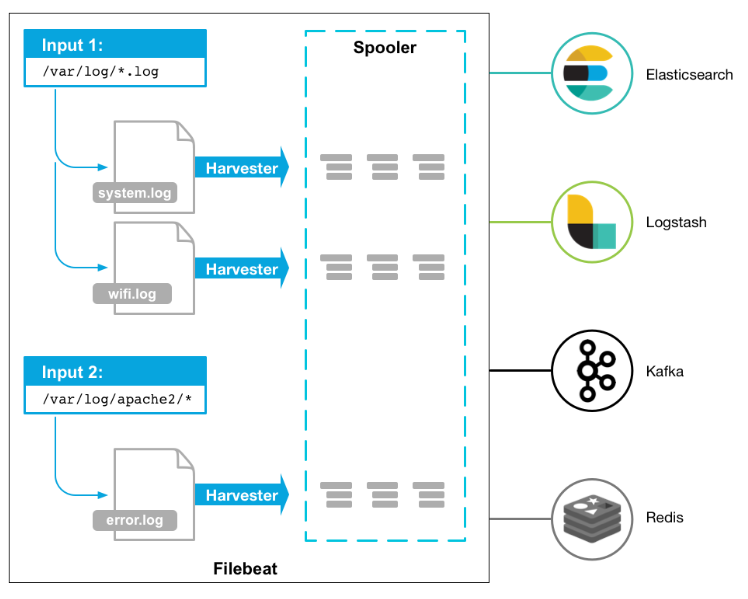

[TOC]


# ELK+Kafka构建海量日志分析平台

​	为什么要做日志分析平台，随着业务量的增大，单个日志文件大小达到几个GB，这时候，我们发现用系统自带的工具，cat/grep/awk/tail越来越显得力不从心，除了操作系统日志，还有应用系统日志，分布在各个服务器上，分析工作异常繁琐。所以为了解决现状，接下来我们将构建这个日志分析平台，具体内容如上：


## 架构图解


## 架构解读

第一层：数据采集层
LOGS层:业务应用服务器集群，使用filebeat对应用服务器的日志进行采集。

第二层：数据缓冲层
zookeeper+kafka层:日志采集客户端采集来的数据，转存到kafka+zookeeper集群中,做一个消息队列，让数据有一定的缓冲

第三层：数据转发层
logstash层:这个单独的Logstash节点会实时去kafka broker集群拉数据，转发至ES DataNode。

第四层：数据持久化存储层
ES层：会把收到的数据，写磁盘，建索引库。

第五层：数据检索、展示层
Kibana层： 主要协调ES集群，处理数据检索请求，数据展示。


## 环境及优化

|   主机名   |    ip     | 配置 |      软件       | 备注 |
| :--------: | :-------: | :--: | :-------------: | :--: |
|   nginx    |           |      | nginx，filebeat |      |
|  kafka01   | 10.0.0.40 |      | kafka+zookeeper |      |
|  kafka02   | 10.0.0.41 |      | kafka+zookeeper |      |
|  kafka03   | 10.0.0.42 |      | kafka+zookeeper |      |
| logstash01 | 10.0.0.43 |      |    logstash     |      |
| logstash02 |           |      |    logstash     |      |
|    es01    |           |      |  Elasticsearch  |      |
|    es02    |           |      |  Elasticsearch  |      |
|    es03    |           |      |  Elasticsearch  |      |


1.1.4配置hosts


1.1.6关闭防火墙和selinux

```
systemctl stop firewalld
systemctl disable firewalld

setenforce 0
sed -i  '/^SELINUX/s#enforcing#disabled#g' /etc/selinux/config
```


```
sed -i 's#4096#65535#g'   /etc/security/limits.d/20-nproc.conf
grep "*       -       nofile       65535" /etc/security/limits.conf >/dev/null 2>&1
if [ $? -ne 0 ]
then
echo '*       -       nofile       65535' >>/etc/security/limits.conf
echo '* soft nproc 65535' >>/etc/security/limits.conf
echo '* hard nproc 65535' >>/etc/security/limits.conf
echo '* soft nofile 65535' >>/etc/security/limits.conf
echo '* hard nofile 65535' >>/etc/security/limits.conf
echo "ulimit -SHn 65535" >> /etc/profile
echo "ulimit -SHn 65535" >> /etc/rc.local
echo "* soft memlock 262144" >>/etc/security/limits.conf
echo "* hard memlock 262144" >>/etc/security/limits.conf
ulimit -HSn 65535
```


## Zookeeper+Kafka消息队列


wget http://mirrors.cnnic.cn/apache/zookeeper/zookeeper-3.4.14/zookeeper-3.4.14.tar.gz

wget http://mirrors.tuna.tsinghua.edu.cn/apache/kafka/2.2.0/kafka_2.11-2.2.0.tgz


## filebeat轻量传送程序

​	Filebeat是用于转发和集中日志数据的轻量级传送程序。作为服务器上的代理安装，Filebeat监视您指定的日志文件或位置，收集日志事件，并将它们转发到Elasticsearch或 Logstash进行索引。

工作方式：




安装：

```
curl -L -O https://artifacts.elastic.co/downloads/beats/filebeat/filebeat-6.8.5-x86_64.rpm
sudo rpm -vi filebeat-6.8.5-x86_64.rpm
```


## logstash

简介：

Logstash是具有实时流水线功能的开源数据收集引擎。


要求：

Logstash需要Java 8或Java11。请使用 [正式的Oracle发行版]或开源发行版，例如[OpenJDK]。


```
rpm --import https://artifacts.elastic.co/GPG-KEY-elasticsearch

cat >/etc/yum.repos.d/logstash.repo<<EOF
[logstash-6.x]
name=Elastic repository for 6.x packages
baseurl=https://artifacts.elastic.co/packages/6.x/yum
gpgcheck=1
gpgkey=https://artifacts.elastic.co/GPG-KEY-elasticsearch
enabled=1
autorefresh=1
type=rpm-md
EOF

yum -y install logstash
systemctl daemon-reload
systemctl enable logstash.service
systemctl start logstash.service
```


## elasticsearch

```
cat >/etc/yum.repos.d/elasticsearch.repo<<EOF
[elasticsearch-6.x]
name=Elasticsearch repository for 6.x packages
baseurl=https://artifacts.elastic.co/packages/6.x/yum
gpgcheck=1
gpgkey=https://artifacts.elastic.co/GPG-KEY-elasticsearch
enabled=1
autorefresh=1
type=rpm-md
EOF

yum -y install elasticsearch
systemctl daemon-reload
systemctl enable elasticsearch.service
systemctl start elasticsearch.service
```


## kibana

```
cat >/etc/yum.repos.d/kibana.repo<<EOF
[kibana-6.x]
name=Kibana repository for 6.x packages
baseurl=https://artifacts.elastic.co/packages/6.x/yum
gpgcheck=1
gpgkey=https://artifacts.elastic.co/GPG-KEY-elasticsearch
enabled=1
autorefresh=1
type=rpm-md
EOF

yum -y install kibana
systemctl daemon-reload
systemctl enable kibana.service
systemctl start kibana.service
```


一.实验目的：

1.强大的搜索功能，elasticsearch可以以分布式搜索的方式快速检索，而且支持DSL的语法来进行搜索，简单的说，就是通过类似配置的语言，快速筛选数据。

2.完美的展示功能，可以展示非常详细的图表信息，而且可以定制展示内容，将数据可视化发挥的淋漓尽致。

3.分布式功能，能够解决大型集群运维工作很多问题，包括监控、预警、日志收集解析等。


二.实验逻辑思路：

1.使用Filebeat这个工具安装到客户端。

2.接收到的日志文件推送给Kafka上存储。

3.Zookeeper来协调管理Kafka日志队列最终推送给Logstash集群处理。

3.Logstash集群处理过的日志文集推送给Easticsearch集群来处理日志文件。

4.Easticsearch集群处理过后把信息推送给Kibana。

5.Kibana通过图片、图形、网页形式呈现给用户。


