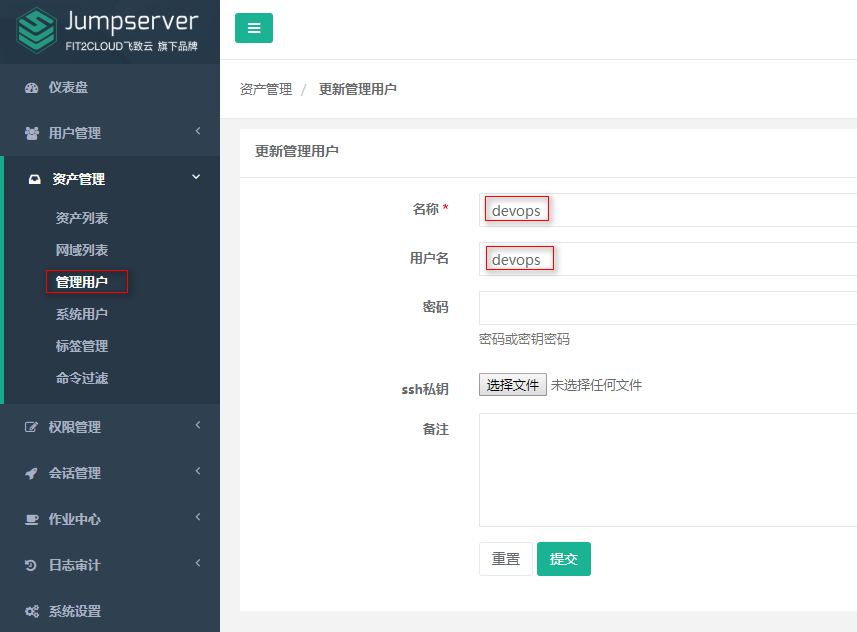
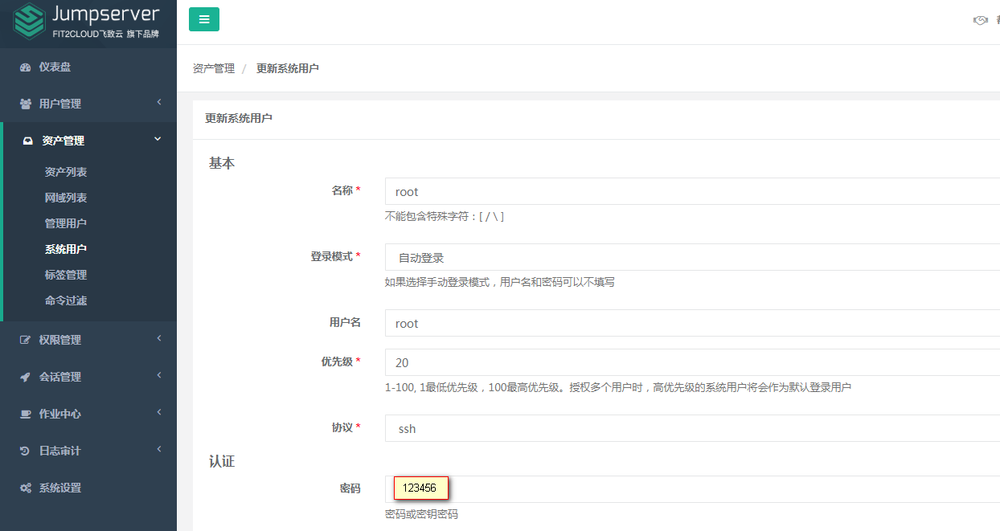
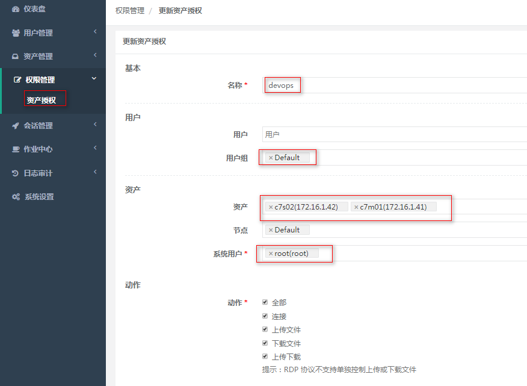
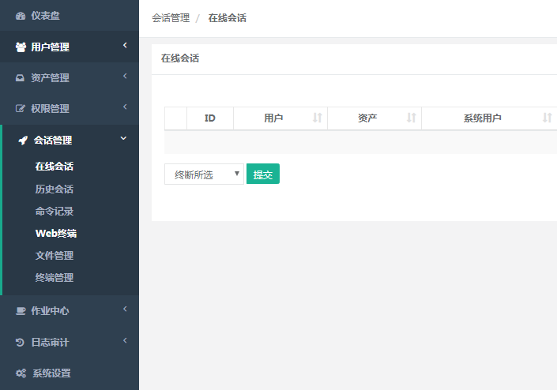
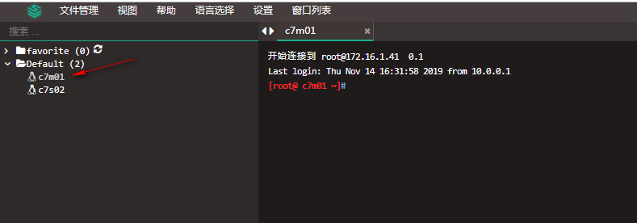
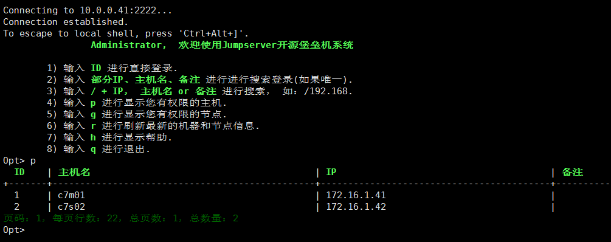

[TOC]


# Jumpserver堡垒机


# 1.1 jumpserver介绍

Jumpserver 是全球首款完全开源的堡垒机, 使用 GNU GPL v2.0 开源协议, 是符合 4A 的专业运维审计系统。

Jumpserver 使用 Python / Django 进行开发, 遵循 Web 2.0 规范, 配备了业界领先的 Web Terminal 解决方案, 交互界面美观、用户体验好。

Jumpserver 采纳分布式架构, 支持多机房跨区域部署, 中心节点提供 API, 各机房部署登录节点, 可横向扩展、无并发访问限制。

Jumpserver 现已支持管理 SSH、 Telnet、 RDP、 VNC 协议资产。

官方文档：https://docs.jumpserver.org/zh/master/index.html


# 1.2 极速安装--适合测试

生产环境建议使用 1.4.8 版本

说明
全新安装的 Centos7 系统
保持服务器网络畅通

开始安装
以下命令均在一个终端里面执行

```shell
echo -e "\033[31m 1. 防火墙 Selinux 设置 \033[0m" \
  && if [ "$(systemctl status firewalld | grep running)" != "" ]; then firewall-cmd --zone=public --add-port=80/tcp --permanent; firewall-cmd --zone=public --add-port=2222/tcp --permanent; firewall-cmd --permanent --add-rich-rule="rule family="ipv4" source address="172.17.0.0/16" port protocol="tcp" port="8080" accept"; firewall-cmd --reload; fi \
  && if [ "$(getenforce)" != "Disabled" ]; then setsebool -P httpd_can_network_connect 1; fi
```


```shell
 echo -e "\033[31m 2. 部署环境 \033[0m" \
  && yum update -y \
  && ln -sf /usr/share/zoneinfo/Asia/Shanghai /etc/localtime \
  && yum -y install kde-l10n-Chinese \
  && localedef -c -f UTF-8 -i zh_CN zh_CN.UTF-8 \
  && export LC_ALL=zh_CN.UTF-8 \
  && echo 'LANG="zh_CN.UTF-8"' > /etc/locale.conf \
  && yum -y install wget gcc epel-release git \
  && yum install -y yum-utils device-mapper-persistent-data lvm2 \
  && yum-config-manager --add-repo http://mirrors.aliyun.com/docker-ce/linux/centos/docker-ce.repo \
  && yum makecache fast \
  && rpm --import https://mirrors.aliyun.com/docker-ce/linux/centos/gpg \
  && echo -e "[nginx-stable]\nname=nginx stable repo\nbaseurl=http://nginx.org/packages/centos/\$releasever/\$basearch/\ngpgcheck=1\nenabled=1\ngpgkey=https://nginx.org/keys/nginx_signing.key" > /etc/yum.repos.d/nginx.repo \
  && rpm --import https://nginx.org/keys/nginx_signing.key \
  && yum -y install redis mariadb mariadb-devel mariadb-server MariaDB-shared nginx docker-ce \
  && systemctl enable redis mariadb nginx docker \
  && systemctl start redis mariadb \
  && yum -y install python36 python36-devel \
  && python3.6 -m venv /opt/py3
```


```shell
echo -e "\033[31m 3. 下载组件 \033[0m" \
  && cd /opt \
  && if [ ! -d "/opt/jumpserver" ]; then git clone --depth=1 https://github.com/jumpserver/jumpserver.git; fi \
  && if [ ! -f "/opt/luna.tar.gz" ]; then wget https://demo.jumpserver.org/download/luna/1.5.4/luna.tar.gz; tar xf luna.tar.gz; chown -R root:root luna; fi \
  && yum -y install $(cat /opt/jumpserver/requirements/rpm_requirements.txt) \
  && echo -e "[easy_install]\nindex_url = https://mirrors.aliyun.com/pypi/simple/" > ~/.pydistutils.cfg \
  && source /opt/py3/bin/activate \
  && pip install --upgrade pip setuptools -i https://mirrors.aliyun.com/pypi/simple/ \
  && pip install -r /opt/jumpserver/requirements/requirements.txt -i https://mirrors.aliyun.com/pypi/simple/ \
  && curl -sSL https://get.daocloud.io/daotools/set_mirror.sh | sh -s http://f1361db2.m.daocloud.io \
  && systemctl restart docker \
  && docker pull jumpserver/jms_koko:1.5.4 \
  && docker pull jumpserver/jms_guacamole:1.5.4 \
  && rm -rf /etc/nginx/conf.d/default.conf \
  && wget -O /etc/nginx/conf.d/jumpserver.conf https://demo.jumpserver.org/download/nginx/conf.d/jumpserver.conf
```


```shell
echo -e "\033[31m 4. 处理配置文件 \033[0m" \
  && source ~/.bashrc \
  && if [ "$DB_PASSWORD" = "" ]; then DB_PASSWORD=`cat /dev/urandom | tr -dc A-Za-z0-9 | head -c 24`; fi \
  && if [ "$SECRET_KEY" = "" ]; then SECRET_KEY=`cat /dev/urandom | tr -dc A-Za-z0-9 | head -c 50`; echo "SECRET_KEY=$SECRET_KEY" >> ~/.bashrc; fi \
  && if [ "$BOOTSTRAP_TOKEN" = "" ]; then BOOTSTRAP_TOKEN=`cat /dev/urandom | tr -dc A-Za-z0-9 | head -c 16`; echo "BOOTSTRAP_TOKEN=$BOOTSTRAP_TOKEN" >> ~/.bashrc; fi \
  && if [ "$Server_IP" = "" ]; then Server_IP=`ip addr | grep 'state UP' -A2 | grep inet | egrep -v '(127.0.0.1|inet6|docker)' | awk '{print $2}' | tr -d "addr:" | head -n 1 | cut -d / -f1`; fi \
  && if [ ! -d "/var/lib/mysql/jumpserver" ]; then mysql -uroot -e "create database jumpserver default charset 'utf8';grant all on jumpserver.* to 'jumpserver'@'127.0.0.1' identified by '$DB_PASSWORD';flush privileges;"; fi \
  && if [ ! -f "/opt/jumpserver/config.yml" ]; then cp /opt/jumpserver/config_example.yml /opt/jumpserver/config.yml; sed -i "s/SECRET_KEY:/SECRET_KEY: $SECRET_KEY/g" /opt/jumpserver/config.yml; sed -i "s/BOOTSTRAP_TOKEN:/BOOTSTRAP_TOKEN: $BOOTSTRAP_TOKEN/g" /opt/jumpserver/config.yml; sed -i "s/# DEBUG: true/DEBUG: false/g" /opt/jumpserver/config.yml; sed -i "s/# LOG_LEVEL: DEBUG/LOG_LEVEL: ERROR/g" /opt/jumpserver/config.yml; sed -i "s/# SESSION_EXPIRE_AT_BROWSER_CLOSE: false/SESSION_EXPIRE_AT_BROWSER_CLOSE: true/g" /opt/jumpserver/config.yml; sed -i "s/DB_PASSWORD: /DB_PASSWORD: $DB_PASSWORD/g" /opt/jumpserver/config.yml; fi
```


```shell
echo -e "\033[31m 5. 启动 Jumpserver \033[0m" \
  && systemctl start nginx \
  && cd /opt/jumpserver \
  && ./jms start -d \
  && docker run --name jms_koko -d -p 2222:2222 -p 127.0.0.1:5000:5000 -e CORE_HOST=http://$Server_IP:8080 -e BOOTSTRAP_TOKEN=$BOOTSTRAP_TOKEN --restart=always jumpserver/jms_koko:1.5.4 \
  && docker run --name jms_guacamole -d -p 127.0.0.1:8081:8080 -e JUMPSERVER_SERVER=http://$Server_IP:8080 -e BOOTSTRAP_TOKEN=$BOOTSTRAP_TOKEN --restart=always jumpserver/jms_guacamole:1.5.4 \
  && echo -e "\033[31m 你的数据库密码是 $DB_PASSWORD \033[0m" \
  && echo -e "\033[31m 你的SECRET_KEY是 $SECRET_KEY \033[0m" \
  && echo -e "\033[31m 你的BOOTSTRAP_TOKEN是 $BOOTSTRAP_TOKEN \033[0m" \
  && echo -e "\033[31m 你的服务器IP是 $Server_IP \033[0m" \
  && echo -e "\033[31m 请打开浏览器访问 http://$Server_IP 用户名:admin 密码:admin \033[0m"
```


```shell
echo -e "\033[31m 6. 配置自启 \033[0m" \
  && if [ ! -f "/usr/lib/systemd/system/jms.service" ]; then wget -O /usr/lib/systemd/system/jms.service https://demo.jumpserver.org/download/shell/centos/jms.service; chmod 755 /usr/lib/systemd/system/jms.service; systemctl enable jms; fi
```


# 1.3 CentOS 7 安装--适合生产环境

**1、环境**

```bash
系统: CentOS 7
IP: 10.0.0.41
目录: /opt
数据库: mariadb
代理: nginx

# 防火墙 与 selinux 设置说明, 如果已经关闭了 防火墙 和 Selinux 的用户请跳过设置
systemctl start firewalld
# nginx 端口
firewall-cmd --zone=public --add-port=80/tcp --permanent
# 用户SSH登录端口 koko
firewall-cmd --zone=public --add-port=2222/tcp --permanent
# --permanent  永久生效, 没有此参数重启后失效

# 重新载入规则
firewall-cmd --reload

setenforce 0
sed -i "s/SELINUX=enforcing/SELINUX=disabled/g" /etc/selinux/config
```

**2、安装依赖包**

```bash
yum -y install wget gcc epel-release git
```

**3、安装 Redis, JumpServer 使用 Redis 做 cache 和 celery broke**

```bash
yum -y install redis
systemctl enable redis
systemctl start redis
```

**4、安装 MySQL, 如果不使用 Mysql 可以跳过相关 Mysql 安装和配置, 支持sqlite3, mysql, postgres等**

```bash
#cat >/etc/yum.repos.d/mariadb.repo<<EOF
#[mariadb]
#name = MariaDB
#baseurl = http://yum.mariadb.org/10.3/centos7-amd64
#gpgkey=https://yum.mariadb.org/RPM-GPG-KEY-MariaDB
#gpgcheck=1
#EOF

yum clear all
yum makecache
yum -y install mariadb mariadb-devel mariadb-server MariaDB-shared
systemctl enable mariadb
systemctl start mariadb
```

**5、创建数据库 JumpServer 并授权**

```sql
DB_PASSWORD=`cat /dev/urandom | tr -dc A-Za-z0-9 | head -c 24`
echo -e "\033[31m 你的数据库密码是 $DB_PASSWORD \033[0m"
mysql -uroot -e "create database jumpserver default charset 'utf8' collate 'utf8_bin';grant all on jumpserver.* to 'jumpserver'@'127.0.0.1' identified by '$DB_PASSWORD'; flush privileges;"
```

**6、安装 Nginx, 用作代理服务器整合 JumpServer 与各个组件**

```bash
yum -y install nginx
systemctl enable nginx
```

**7、安装 Python3.6**

```bash
yum -y install python36 python36-devel
```

**8、配置并载入 Python3 虚拟环境**

```bash
cd /opt
# py3 为虚拟环境名称, 可自定义$ 
python3.6 -m venv py3
source /opt/py3/bin/activate
# 退出虚拟环境可以使用 deactivate 命令
# 看到下面的提示符代表成功, 以后运行 JumpServer 都要先运行以上 source 命令, 载入环境后默认以下所有命令均在该虚拟环境中运行
(py3) [root@localhost py3]
```

**9、下载 JumpServer**

```
cd /opt/
git clone --depth=1 https://github.com/jumpserver/jumpserver.git
```

**10、安装依赖 RPM 包**

```bash

yum -y install $(cat /opt/jumpserver/requirements/rpm_requirements.txt)
```

**11、安装 Python 库依赖**

```bash
pip install wheel -i https://mirrors.aliyun.com/pypi/simple/
pip install --upgrade pip setuptools -i https://mirrors.aliyun.com/pypi/simple/
pip install -r /opt/jumpserver/requirements/requirements.txt -i https://mirrors.aliyun.com/pypi/simple/
```

>  [pip 20.0.2文档](https://pip.pypa.io/en/stable/)  https://pip.pypa.io/en/stable/user_guide/#config-file 

pip是一个很好用的第三方库安装方式，但是默认的源没法连接，就算有时候可以成功率也很低，所以换成国内镜像源比较方便。

**将pip源更换到国内镜像**

用pip管理工具安装库文件时，默认使用国外的源文件，因此在国内的下载速度会比较慢，可能只有50KB/s。幸好，国内的一些顶级科研机构已经给我们准备好了各种镜像，下载速度可达2MB/s。

**临时方法**

```bash
阿里云 https://mirrors.aliyun.com/pypi/simple/
中国科技大学 https://pypi.mirrors.ustc.edu.cn/simple/
豆瓣(douban) https://pypi.douban.com/simple/ 
清华大学 https://pypi.tuna.tsinghua.edu.cn/simple/
中国科学技术大学 http://pypi.mirrors.ustc.edu.cn/simple/
华中理工大学：http://pypi.hustunique.com/
山东理工大学：http://pypi.sdutlinux.org/
```

使用时直接 -i 加 url 即可如下安装：

```bash
pip install jupyter -i https://pypi.tuna.tsinghua.edu.cn/simple
```


**12、修改 JumpServer 配置文件**

```bash
cd /opt/jumpserver
\cp config_example.yml config.yml

# 生成随机SECRET_KEY
SECRET_KEY=`cat /dev/urandom | tr -dc A-Za-z0-9 | head -c 50`
echo "SECRET_KEY=$SECRET_KEY" >> ~/.bashrc
# 生成随机BOOTSTRAP_TOKEN
BOOTSTRAP_TOKEN=`cat /dev/urandom | tr -dc A-Za-z0-9 | head -c 16`
echo "BOOTSTRAP_TOKEN=$BOOTSTRAP_TOKEN" >> ~/.bashrc

sed -i "s/SECRET_KEY:/SECRET_KEY: $SECRET_KEY/g" /opt/jumpserver/config.yml
sed -i "s/BOOTSTRAP_TOKEN:/BOOTSTRAP_TOKEN: $BOOTSTRAP_TOKEN/g" /opt/jumpserver/config.yml
sed -i "s/# DEBUG: true/DEBUG: false/g" /opt/jumpserver/config.yml
sed -i "s/# LOG_LEVEL: DEBUG/LOG_LEVEL: ERROR/g" /opt/jumpserver/config.yml
sed -i "s/# SESSION_EXPIRE_AT_BROWSER_CLOSE: false/SESSION_EXPIRE_AT_BROWSER_CLOSE: true/g" /opt/jumpserver/config.yml
sed -i "s/DB_PASSWORD: /DB_PASSWORD: $DB_PASSWORD/g" /opt/jumpserver/config.yml

echo -e "\033[31m 你的SECRET_KEY是 $SECRET_KEY \033[0m"
echo -e "\033[31m 你的BOOTSTRAP_TOKEN是 $BOOTSTRAP_TOKEN \033[0m"
```

确保配置文件没问题：

```yml
(py3) [root@ c7-41 jumpserver]# cat /opt/jumpserver/config.yml
# SECURITY WARNING: keep the secret key used in production secret!
# 加密秘钥 生产环境中请修改为随机字符串，请勿外泄, 可使用命令生成
# $ cat /dev/urandom | tr -dc A-Za-z0-9 | head -c 49;echo
SECRET_KEY: Ro0i3kEqjXz6qwGDnXByGPujWwgC3gEY2Cai4l3rHdP4OIXWu6

# SECURITY WARNING: keep the bootstrap token used in production secret!
# 预共享Token coco和guacamole用来注册服务账号，不在使用原来的注册接受机制
BOOTSTRAP_TOKEN: 1sjJ3diFo1VecbTp

# Development env open this, when error occur display the full process track, Production disable it
# DEBUG 模式 开启DEBUG后遇到错误时可以看到更多日志
DEBUG: false

# DEBUG, INFO, WARNING, ERROR, CRITICAL can set. See https://docs.djangoproject.com/en/1.10/topics/logging/
# 日志级别
LOG_LEVEL: ERROR
# LOG_DIR:

# Session expiration setting, Default 24 hour, Also set expired on on browser close
# 浏览器Session过期时间，默认24小时, 也可以设置浏览器关闭则过期
# SESSION_COOKIE_AGE: 86400
SESSION_EXPIRE_AT_BROWSER_CLOSE: true

# Database setting, Support sqlite3, mysql, postgres ....
# 数据库设置
# See https://docs.djangoproject.com/en/1.10/ref/settings/#databases

# SQLite setting:
# 使用单文件sqlite数据库
# DB_ENGINE: sqlite3
# DB_NAME:

# MySQL or postgres setting like:
# 使用Mysql作为数据库
DB_ENGINE: mysql
DB_HOST: 127.0.0.1
DB_PORT: 3306
DB_USER: jumpserver
DB_PASSWORD: proPRiTlR7cH62Ays25KwaoZ
DB_NAME: jumpserver

# When Django start it will bind this host and port
# ./manage.py runserver 127.0.0.1:8080
# 运行时绑定端口
HTTP_BIND_HOST: 0.0.0.0
HTTP_LISTEN_PORT: 8080
WS_LISTEN_PORT: 8070

# Use Redis as broker for celery and web socket
# Redis配置
REDIS_HOST: 127.0.0.1
REDIS_PORT: 6379
# REDIS_PASSWORD:
# REDIS_DB_CELERY: 3
# REDIS_DB_CACHE: 4

# Use OpenID authorization
# 使用OpenID 来进行认证设置
# BASE_SITE_URL: http://localhost:8080
# AUTH_OPENID: false  # True or False
# AUTH_OPENID_SERVER_URL: https://openid-auth-server.com/
# AUTH_OPENID_REALM_NAME: realm-name
# AUTH_OPENID_CLIENT_ID: client-id
# AUTH_OPENID_CLIENT_SECRET: client-secret
# AUTH_OPENID_IGNORE_SSL_VERIFICATION: True
# AUTH_OPENID_SHARE_SESSION: True

# Use Radius authorization
# 使用Radius来认证
# AUTH_RADIUS: false
# RADIUS_SERVER: localhost
# RADIUS_PORT: 1812
# RADIUS_SECRET:

# CAS 配置
# AUTH_CAS': False,
# CAS_SERVER_URL': "http://host/cas/",
# CAS_ROOT_PROXIED_AS': 'http://jumpserver-host:port',
# CAS_LOGOUT_COMPLETELY': True,
# CAS_VERSION': 3,

# LDAP/AD settings
# LDAP 搜索分页数量
# AUTH_LDAP_SEARCH_PAGED_SIZE: 1000
#
# 定时同步用户
# 启用 / 禁用
# AUTH_LDAP_SYNC_IS_PERIODIC: True
# 同步间隔 (单位: 时) (优先）
# AUTH_LDAP_SYNC_INTERVAL: 12
# Crontab 表达式
# AUTH_LDAP_SYNC_CRONTAB: * 6 * * *
#
# LDAP 用户登录时仅允许在用户列表中的用户执行 LDAP Server 认证
# AUTH_LDAP_USER_LOGIN_ONLY_IN_USERS: False
#
# LDAP 认证时如果日志中出现以下信息将参数设置为 0 (详情参见：https://www.python-ldap.org/en/latest/faq.html)
# In order to perform this operation a successful bind must be completed on the connection
# AUTH_LDAP_OPTIONS_OPT_REFERRALS: -1

# OTP settings
# OTP/MFA 配置
# OTP_VALID_WINDOW: 0
# OTP_ISSUER_NAME: Jumpserver

# Perm show single asset to ungrouped node
# 是否把未授权节点资产放入到 未分组 节点中
# PERM_SINGLE_ASSET_TO_UNGROUP_NODE: false
#
# 启用定时任务
# PERIOD_TASK_ENABLE: True
#
# 启用二次复合认证配置
# LOGIN_CONFIRM_ENABLE: False
#
# Windows 登录跳过手动输入密码
# WINDOWS_SKIP_ALL_MANUAL_PASSWORD: False

```


**13、运行 JumpServer**

```bash
# 后台运行使用 -d 参数./jms start -d
# 新版本更新了运行脚本, 使用方式./jms start|stop|status all  后台运行请添加 -d 参数
# cd /opt/jumpserver
# ./jms start -d

wget -O /usr/lib/systemd/system/jms.service https://demo.jumpserver.org/download/shell/centos/jms.service
chmod 755 /usr/lib/systemd/system/jms.service
systemctl daemon-reload
systemctl enable jms
systemctl start jms
```


**14、安装 docker 部署 koko 与 guacamole**

```
yum install -y yum-utils device-mapper-persistent-data lvm2
yum-config-manager --add-repo http://mirrors.aliyun.com/docker-ce/linux/centos/docker-ce.repo
yum makecache fast
rpm --import https://mirrors.aliyun.com/docker-ce/linux/centos/gpg
yum -y install docker-ce
systemctl enable docker
mkdir /etc/docker
wget -O /etc/docker/daemon.json http://demo.jumpserver.org/download/docker/daemon.json
systemctl restart docker

```

允许容器ip 访问宿主 8080 端口, (容器的 ip 可以进入容器查看)

```bash
firewall-cmd --permanent --add-rich-rule="rule family="ipv4" source address="172.17.0.0/16" port protocol="tcp" port="8080" accept"
firewall-cmd --reload

# 172.17.0.x 是docker容器默认的IP池, 这里偷懒直接授权ip段了, 可以根据实际情况单独授权IP
```

获取当前服务器 IP

```
Server_IP=`ip addr | grep 'state UP' -A2 | grep inet | egrep -v '(127.0.0.1|inet6|docker)' | awk '{print $2}' | tr -d "addr:" | head -n 1 | cut -d / -f1`
echo -e "\033[31m 你的服务器IP是 $Server_IP \033[0m"
```

运行koko 与 guacamole

由于网络问题；可以手动导入镜像。

```bash
# http://<Jumpserver_url> 指向 jumpserver 的服务端口, 如 http://192.168.244.144:8080
# BOOTSTRAP_TOKEN 为 Jumpserver/config.yml 里面的 BOOTSTRAP_TOKEN

docker run --name jms_koko -d -p 2222:2222 -p 127.0.0.1:5000:5000 -e CORE_HOST=http://$Server_IP:8080 -e BOOTSTRAP_TOKEN=$BOOTSTRAP_TOKEN -e LOG_LEVEL=ERROR --restart=always jumpserver/jms_koko:1.5.8

docker run --name jms_guacamole -d -p 127.0.0.1:8081:8080 -e JUMPSERVER_SERVER=http://$Server_IP:8080 -e BOOTSTRAP_TOKEN=$BOOTSTRAP_TOKEN -e GUACAMOLE_LOG_LEVEL=ERROR --restart=always jumpserver/jms_guacamole:1.5.8
```

**15、安装 Web Terminal 前端: Luna  需要 Nginx 来运行访问 访问(https://github.com/jumpserver/luna/releases)下载对应版本的 release 包, 直接解压, 不需要编译**

```
cd /opt
wget https://github.com/jumpserver/luna/releases/download/1.5.8/luna.tar.gz

# 如果网络有问题导致下载无法完成可以使用下面地址
wget https://demo.jumpserver.org/download/luna/1.5.8/luna.tar.gz
tar xf luna.tar.gz
chown -R root:root luna
```

**16、配置 Nginx 整合各组件**

```bash
rm -rf /etc/nginx/conf.d/default.conf

#精简主配置文件
cat >/etc/nginx/nginx.conf<<EOF
user nginx;
worker_processes auto;
error_log /var/log/nginx/error.log;
pid /run/nginx.pid;

include /usr/share/nginx/modules/*.conf;

events {
    worker_connections 65535;
}

http {
    log_format  main  '$remote_addr - $remote_user [$time_local] "$request" '
                      '$status $body_bytes_sent "$http_referer" '
                      '"$http_user_agent" "$http_x_forwarded_for"';

    access_log  /var/log/nginx/access.log  main;

    sendfile            on;
    tcp_nopush          on;
    tcp_nodelay         on;
    keepalive_timeout   120;
    types_hash_max_size 2048;

    include             /etc/nginx/mime.types;
    default_type        application/octet-stream;

    include /etc/nginx/conf.d/*.conf;
}
EOF

cat >/etc/nginx/conf.d/jumpserver.conf<<\EOF
server {
    listen 80;
    server_name 10.0.0.41;

    client_max_body_size 100m;  # 录像及文件上传大小限制

    location /luna/ {
        try_files $uri / /index.html;
        alias /opt/luna/;  # luna 路径, 如果修改安装目录, 此处需要修改
    }

    location /media/ {
        add_header Content-Encoding gzip;
        root /opt/jumpserver/data/;  # 录像位置, 如果修改安装目录, 此处需要修改
    }

    location /static/ {
        root /opt/jumpserver/data/;  # 静态资源, 如果修改安装目录, 此处需要修改
    }

    location /koko/ {
        proxy_pass       http://localhost:5000;
        proxy_buffering off;
        proxy_http_version 1.1;
        proxy_set_header Upgrade $http_upgrade;
        proxy_set_header Connection "upgrade";
        proxy_set_header X-Real-IP $remote_addr;
        proxy_set_header Host $host;
        proxy_set_header X-Forwarded-For $proxy_add_x_forwarded_for;
        access_log off;
    }

    location /guacamole/ {
        proxy_pass       http://localhost:8081/;
        proxy_buffering off;
        proxy_http_version 1.1;
        proxy_set_header Upgrade $http_upgrade;
        proxy_set_header Connection $http_connection;
        proxy_set_header X-Real-IP $remote_addr;
        proxy_set_header Host $host;
        proxy_set_header X-Forwarded-For $proxy_add_x_forwarded_for;
        access_log off;
    }

    location /ws/ {
        proxy_pass http://localhost:8070;
        proxy_http_version 1.1;
        proxy_buffering off;
        proxy_set_header Upgrade $http_upgrade;
        proxy_set_header Connection "upgrade";
        proxy_set_header X-Real-IP $remote_addr;
        proxy_set_header Host $host;
        proxy_set_header X-Forwarded-For $proxy_add_x_forwarded_for;
        access_log off;
    }

    location / {
        proxy_pass http://localhost:8080;
        proxy_set_header X-Real-IP $remote_addr;
        proxy_set_header Host $host;
        proxy_set_header X-Forwarded-For $proxy_add_x_forwarded_for;
        access_log off;
    }
}
EOF
```

运行 Nginx

```bash
nginx -t
sed -i 's/KillMode/#KillMode/g' /usr/lib/systemd/system/nginx.service
systemctl daemon-reload
systemctl start nginx
```

**17、测试连接jumpserver**

```bash
# 访问 http://10.0.0.41 (注意 没有 :8080 通过 nginx 代理端口进行访问)
# 默认账号: admin 密码: admin  到会话管理-终端管理 接受 koko Guacamole 等应用的注册
# 测试连接
$ ssh -p2222 admin@10.0.0.41
$ sftp -P2222 admin@10.0.0.41
  密码: admin

# 如果是用在 Windows 下, Xshell Terminal 登录语法如下
$ ssh admin@10.0.0.41 2222
$ sftp admin@10.0.0.41 2222
  密码: admin
  如果能登陆代表部署成功

# sftp默认上传的位置在资产的 /tmp 目录下
# windows拖拽上传的位置在资产的 Guacamole RDP上的 G 目录下
```


# 1.4 web页面操作

## 1.4.1 登录

用户和密码都是admin

访问：http://10.0.0.41


## 1.4.2 创建管理用户




## 1.4.3 创建系统用户




## 1.4.4 创建资产列表


## 1.4.5 资产授权




## 1.4.6 web终端连接服务器






# 1.5 xshell连接jumpserver管理服务器

创建xshell会话


用户和密码都是：admin

