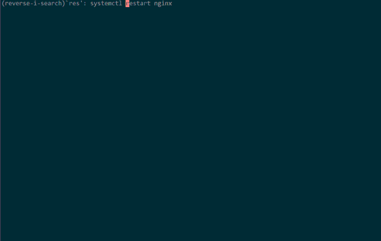
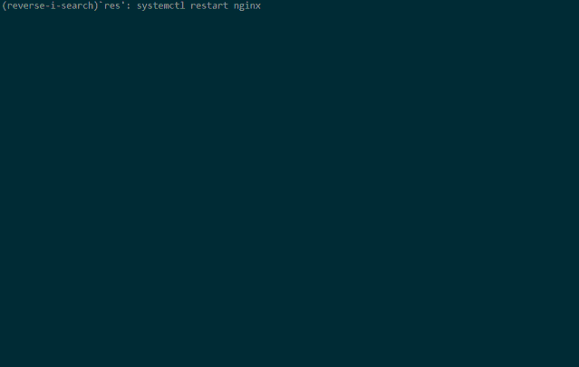
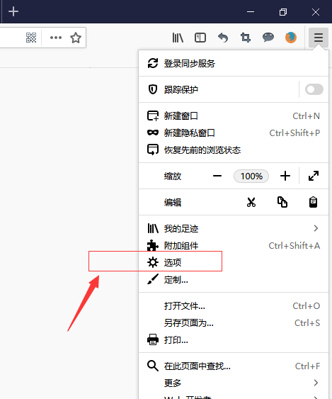
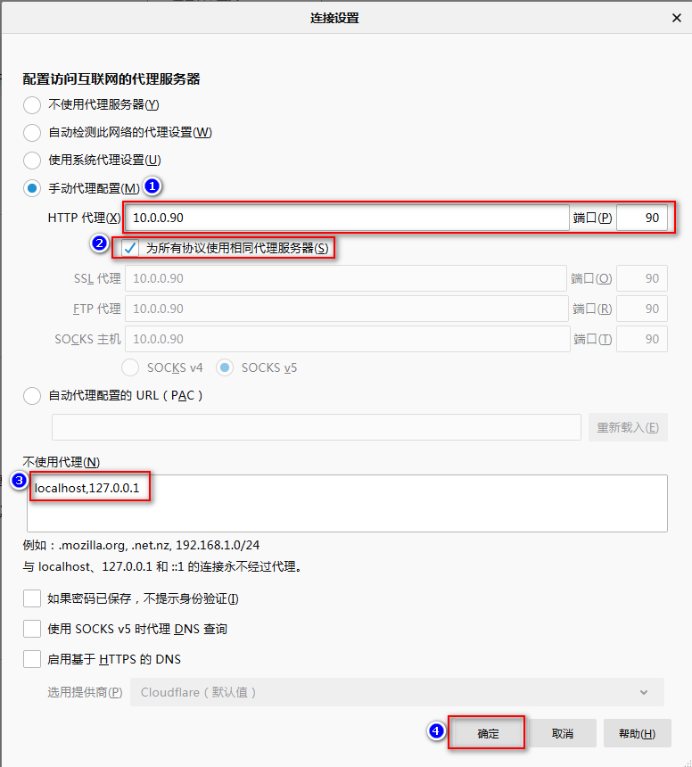
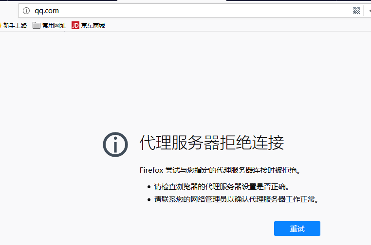
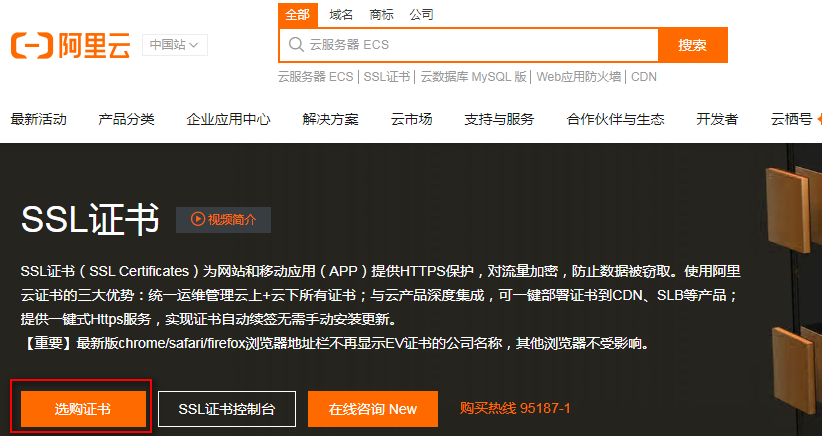
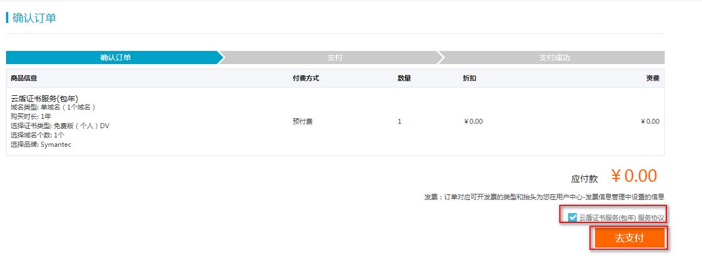
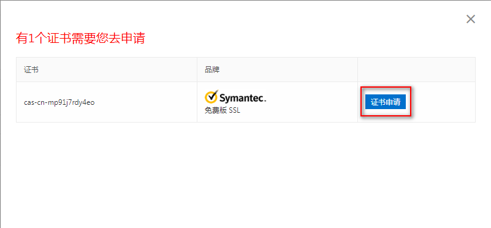
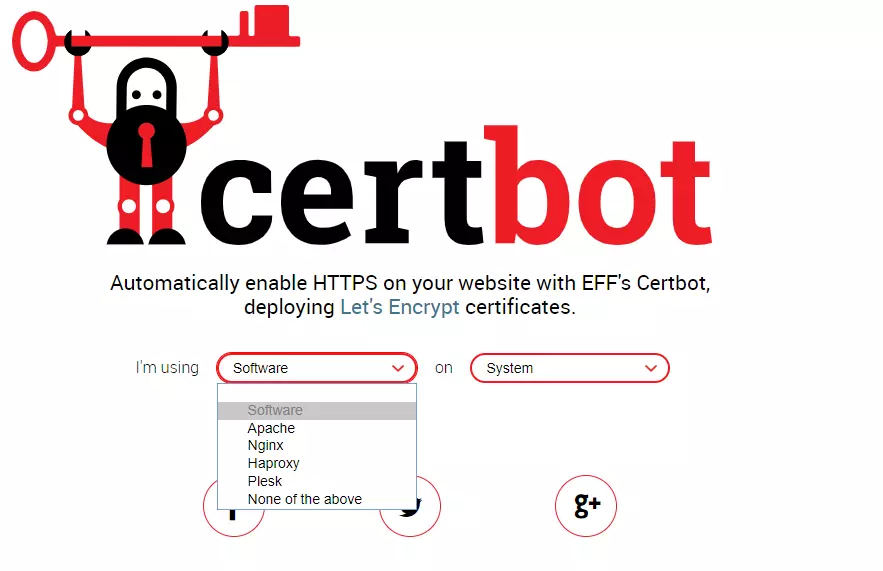

[TOC]


# Nginx系列

[TOC]


## nginx多策略流量分发

**1、场景描述** 

在实际生产环境中，流量分发有很多情况，下面主要讲讲以下两种流量分发场景：

1. 新版本上线，为了保证新版本稳定性，需要用线上的流量的引入，对新版本进行真实流量测试。如果新版本上线有问题，为降低影响范围，我们对流量的引入应该为从小到大的策略。
2. 现如今是移动端的时代，而移动端和pc端的设备的不同，需要对移动端和pc的流量进行不同的处理，同时可以针对两种设备的不同需求可以单独升级，可控性强，且架构灵活。

**2、nginx策略配置**

针对以上两种场景，nginx做为强大的web服务器，通过简单的配置来就可以满足我们的需求，下面我们就开始实战：

```
nginx version: nginx/1.16.1os version: centos 7
```

完成以上需求，主要依赖于nginx的两个模块：

1. ngx_http_split_clients_module 文档参考地址: http://nginx.org/en/docs/http/ngx_http_split_clients_module.html
2. ngx_http_map_module 文档参考地址：http://nginx.org/en/docs/http/ngx_http_map_module.html

**3、流量按比例分配[ngx_http_split_clients_module]**

按比例分配流量，通过ngx_http_split_clients_module模块实现，该模块可通过客户端的某些属性对客户端通过hash算法按比例分配，这些属性包括客户端ip等，通过hash函数，将不同客户端ip进行比例分配，从而可以将部分流量引入新版本服务中，下面看一下具体配置：

```nginx
user nobody;
worker_processes auto;
error_log /var/log/nginx/error.log;
pid /run/nginx.pid;

events {
    worker_connections 1024;
}

http {
    log_format  main  '$remote_addr - $remote_user [$time_local] "$request" '
                      '$status $body_bytes_sent "$http_referer" '
                      '"$http_user_agent" "$http_x_forwarded_for"';
user nobody;
worker_processes auto;
error_log /var/log/nginx/error.log;
pid /run/nginx.pid;

events {
    worker_connections 1024;
}

http {
    log_format  main  '$remote_addr - $remote_user [$time_local] "$request" '
                      '$status $body_bytes_sent "$http_referer" '
                      '"$http_user_agent" "$http_x_forwarded_for"';

    access_log  /var/log/nginx/access.log  main;

    include             /etc/nginx/mime.types;
    default_type        application/octet-stream;

    # 根据内置变量变量${remote_addr}进行1:1分发，并将v1和v2的值赋予$version变量
    split_clients "${remote_addr}AAA" $version {
                   50%               v1;
                   *                 v2;
    }
    
    # v1版本服务
    server {
          listen 8081;
          location  / {
              return 200 "v1\n";
          }
    }
    # v2版本服务
    server {
          listen 8082;
          location  / {
              return 200 "v2\n";
          }
    }

    server {
        listen 80;
        location / {
            proxy_pass http://127.0.0.1/$version;
        }
        # v2版本转发
        location  /v2 {
            proxy_pass http://127.0.0.1:8082/;
        }
        # v1版本转发
        location  /v1 {
            proxy_pass http://127.0.0.1:8081/;
        }
    }
}
```

在配置中，我们利用`split_clients`指令对`$remote_addr`变量进行hash运算，并按1:1比例随机地将`$version`的值赋予v1和v2，*表示剩余的比例，即1-50%，这样就可以通过`$version`的值进行流量分配，具体可看nginx配置，已有注释。可以看到在版本转发时，在`proxy_pass`转发路径最后加了/，是为了把版本路径(v1|v2)去掉，然后再进行转发，可以保持原有的请求uri路径不变，此处算是一个小技巧。

实际效果：



**4、移动端和pc端流量分配[ngx_http_map_module]**
ngx_http_map_module模块可通过客户端属性按一定规则匹配映射为新的变量，我们可以对客户端的ua进行正则匹配来区分流量，从而进行流量分发，下面是nginx配置文件示例：

```nginx
user nobody;
worker_processes auto;
error_log /var/log/nginx/error.log;
pid /run/nginx.pid;

events {
    worker_connections 1024;
}

http {
    log_format  main  '$remote_addr - $remote_user [$time_local] "$request" '
                      '$status $body_bytes_sent "$http_referer" '
                      '"$http_user_agent" "$http_x_forwarded_for"';

    access_log  /var/log/nginx/access.log  main;

    include             /etc/nginx/mime.types;
    default_type        application/octet-stream;


    map "${http_user_agent}" $uatype {
           default           nomobile;
           "~*mobile"        mobile;
    }
    
    # pc端服务
    server {
          listen 8082;
          location  / {
              return 200 "nomobile\n";
          }
    }
    
    # 移动端服务
    server {
          listen 8081;
          location  / {
              return 200 "mobile\n";
          }
    }

    server {
        listen 80;
        location / {
            proxy_pass http://127.0.0.1/$uatype;
        }
        # pc端版本转发
        location  /nomobile {
            proxy_pass http://127.0.0.1:8082/;
        }
        # 移动端版本转发
        location  /mobile {
            proxy_pass http://127.0.0.1:8081/;
        }
    }
}
```

在nginx配置中，我们可以看到使用map指令，对客户端的ua进行正则匹配，一旦匹配成功，$uatype将被分配为mobile，并根据此变量的值进行转发，剩下未匹配的由default 指定，此时$uatype为nomobile，从而转发到pc端服务，同时在转发到后端时，同样在proxy_pass后加/，也是为了去掉nomobile和mobile前缀。在使用map的正则匹配时，代表区分大小写的匹配，*则为不区分大小写。

实际效果：



**5、总结**
以上只是列举典型的流量分发方式，我们可以根据$http_name或者$arg_name来定制化需求，$http_name获取自定义头部，$arg_name获取自定义uri参数，这就给予我们更多的可能，比如我们可以再用户登录后，添加自定义头部，使用自定义头部，map指令进行流量拆分，更多的用途需要我们自行发挥想象进行探索。


## 正向代理

> 注意：Nginx本身不支持HTTPS正向代理，需要安装ngx_http_proxy_connect_module模块后才可以支持HTTPS正向代理，否则会遇到HTTP 400错误。

参考文档：

- <https://github.com/chobits/ngx_http_proxy_connect_module>

**1、安装Nginx和模块**

```
yum -y install make zlib zlib-devel gcc-c++ libtool  openssl openssl-devel  wget pcre pcre-devel git
git clone https://github.com/chobits/ngx_http_proxy_connect_module.git
wget http://nginx.org/download/nginx-1.14.2.tar.gz
tar -xzvf nginx-1.14.2.tar.gz
cd nginx-1.14.2/
patch -p1 <../ngx_http_proxy_connect_module/patch/proxy_connect_1014.patch
./configure  --with-http_stub_status_module --with-http_ssl_module --add-module=../ngx_http_proxy_connect_module
make && make install
```

**2、虚拟主机配置**

```
[root@ docker ~]# mkdir -p /usr/local/nginx/conf/conf.d/

[root@ docker ~]# vim /usr/local/nginx/conf/nginx.conf
user  nobody;
worker_processes  1;
events {
	worker_connections  1024;
}
http {
	include       mime.types;
	default_type  application/octet-stream;
	sendfile        on;
	keepalive_timeout  65;
	include /usr/local/nginx/conf/conf.d/*.conf;

}

[root@ docker ~]# vim /usr/local/nginx/conf/conf.d/test.conf
server {
        listen 90;
        server_name 10.0.0.90;
        resolver 223.5.5.5;
        proxy_connect;
        proxy_connect_allow            443 563;
        proxy_connect_connect_timeout  10s;
        proxy_connect_read_timeout     10s;
        proxy_connect_send_timeout     10s;
location / {
        proxy_pass http://$host;
        proxy_set_header Host $host;
        }
}
```

**3、客户端配置** 

**全局的代理设置：** 

```shell
vim /etc/profile
##代理
export http_proxy=http://10.0.0.90:90
export https_proxy=http://10.0.0.90:90
export ftp_proxy=http://10.0.0.90:90
```

**yum的代理设置：** 

```shell
vim /etc/yum.conf 
proxy=http://http://10.0.0.90:90
```

**wget的代理设置：** 

```shell
vim /etc/wgetrc 
http_proxy=hhttp://10.0.0.90:90
ftp_proxy=http://10.0.0.90:90
```

**4、测试代理**

**方法一：** 

访问HTTP网站，可以直接这样的方式:

```shell
curl ‐I ‐‐proxy 10.0.0.90:90 http://www.baidu.com
curl ‐I ‐‐proxy 10.0.0.90:90 https://www.baidu.com
```

**方法二：** 

**使用浏览器访问** 

这里使用的是firefox浏览器






**如何确定访问是不是走的代理那？** 

可以在浏览器上设置好代理后，然后将你代理的nginx关掉，然后重新打开一个网页，会发现测试不可以访问网站了！！




## 配置HTTPS

什么是https？

HTTP：是互联网上应用最为广泛的一种网络协议，是一个客户端和服务器端请求和应答的标准（TCP），用于从WWW服务器传输超文本到本地浏览器的传输协议，它可以使浏览器更加高效，使网络传输减少。

HTTPS：全称：Hyper Text Transfer Protocol over Secure Socket Layer，则是以安全为目标的HTTP通道，简单讲是HTTP的安全版，即HTTP下加入SSL层，HTTPS的安全基础是SSL，因此加密的详细内容就需要SSL。

HTTPS协议的主要作用可以分为两种：一种是建立一个信息安全通道，来保证数据传输的安全；另一种就是确认网站的真实性。

**1.配置过程**

首先需要申请一个证书，可以申请一个免费的。

**2.证书申请方式**

**阿里云申请**

可以使用腾讯云/阿里云，云产品-》域名与网站-》SSL证书管理










然后选免费版的，一般免费版有效期是一年，然后填各种信息，提交审核就好了，审核很快的，一个小时工作时间左右吧

审核成功后就可以在证书列表里下载证书了，下载出来是一个压缩包，里面有各种版本的证书：Apache、IIS、Nginx、


**Certbot申请**

官网：<https://certbot.eff.org/>

Let’s Encrypt提供了免费的证书申请服务，同时也提供了官方客户端 Certbot，打开首页，就可以得到官方的安装教程。官方教程给出了四种常用服务器和不同的Linux、Unix的安装使用方案，可以说是十分的贴心了。




**openssl自签证书**

**3.自签证书测试**

**安装nginx**

```shell
yum -y install make zlib zlib-devel gcc-c++ libtool  openssl openssl-devel  wget pcre pcre-devel
wget http://nginx.org/download/nginx-1.14.2.tar.gz
tar -zxvf nginx-1.14.2.tar.gz
cd nginx-1.14.2
./configure --with-http_stub_status_module --with-http_ssl_module
make
make install
```

**检查Nginx的SSL模块**

```shell
$ /usr/local/nginx/sbin/nginx -V
nginx version: nginx/1.14.2
built by gcc 4.8.5 20150623 (Red Hat 4.8.5-39) (GCC)
built with OpenSSL 1.0.2k-fips  26 Jan 2017
TLS SNI support enabled
configure arguments: --with-http_stub_status_module --with-http_ssl_module
```

**准备私钥和证书**

创建私钥

```shell
$ cd /usr/local/nginx
$ mkdir -p ssl
$ cd ssl/
$ openssl genrsa -des3 -out server.key 1024
Enter pass phrase for server.key:123456
Verifying - Enter pass phrase for server.key:123456
$  ll
-rw-r--r-- 1 root root 963 2020-02-26 02:43 server.key
```

签发证书

```shell
$ openssl req -new -key server.key -out server.csr
Enter pass phrase for server.key: 123456
# 然后一路会回车
Country Name (2 letter code) [XX]:
State or Province Name (full name) []:
Locality Name (eg, city) [Default City]:
Organization Name (eg, company) [Default Company Ltd]:
Organizational Unit Name (eg, section) []:
Common Name (eg, your name or your server's hostname) []:
Email Address []:

A challenge password []:回车
An optional company name []:回车

```

删除私钥口令

```
$ cd /etc/nginx/ssl
$ cp server.key server.key.ori
$ openssl rsa -in server.key.ori -out server.key
Enter pass phrase for server.key.ori:123456
```

生成使用签名请求证书和私钥生成自签证书

```shell
$ openssl x509 -req -days 365 -in server.csr -signkey server.key -out server.crt
```

**4.开启Nginx SSL**

```shell
# 创建虚拟主机子目录
mkdir -p /usr/local/nginx/conf/conf.d

# 精简主配置文件

cat >/usr/local/nginx/conf/nginx.conf<<EOF
user  nobody;
worker_processes  1;
events {
	worker_connections  1024;
}
http {
	include       mime.types;
	default_type  application/octet-stream;
	sendfile        on;
	keepalive_timeout  65;
	include conf.d/*.conf;

}
EOF

# 启动nginx，并查看进程
/usr/local/nginx/sbin/nginx


# 创建虚拟主机子配置文件
cat >/usr/local/nginx/conf/conf.d/hack.conf<<EOF
server {
    listen       443 ssl;
    server_name  www.hack.com;

    ssl_certificate /usr/local/nginx/ssl/server.crt;
    ssl_certificate_key /usr/local/nginx/ssl/server.key;

    # Load configuration files for the default server block.

    location / {
    #定义站点目录
        root   /usr/local/nginx/html;
    }

    error_page 404 /404.html;
        location = /40x.html {
    }

    error_page 500 502 503 504 /50x.html;
        location = /50x.html {
    }
}
EOF

# 重新加载配置文件
/usr/local/nginx/sbin/nginx -t
/usr/local/nginx/sbin/nginx -s reload
```

绑定windows的hosts：

```
10.0.0.41 www.hack.com
```

上传 [hack.html](assets\hack.html) 到/usr/local/nginx/html目录。

然后谷歌浏览器访问：https://www.hack.com/hack.html


此时，你会发现，http://www.hack.com/hack.html，浏览器访问不了了，需要进行rewrite跳转。

**5.rewrite跳转**

以上配置有个不好的地方，如果用户忘了使用https或者443端口，那么网站将无法访问，因此需要将80端口的访问转到443端口并使用ssl加密访问。只需要增加一个server段，使用301永久重定向。

```shell
cat >/usr/local/nginx/conf/conf.d/hack.conf<<EOF
server {
    listen 80;
    server_name www.hack.com;
    rewrite ^(.*) https://$server_name$1 permanent;
}

server {
    listen       443 ssl;
    server_name  www.hack.com;

    ssl_certificate /usr/local/nginx/ssl/server.crt;
    ssl_certificate_key /usr/local/nginx/ssl/server.key;

    # Load configuration files for the default server block.

    location / {
    #定义站点目录
        root   /usr/local/nginx/html;
    }

    error_page 404 /404.html;
        location = /40x.html {
    }

    error_page 500 502 503 504 /50x.html;
        location = /50x.html {
    }
}
EOF

# 重新加载配置文件
/usr/local/nginx/sbin/nginx -t
/usr/local/nginx/sbin/nginx -s reload
```

这时，浏览器访问 http://www.hack.com/hack.html，nginx会将请求跳转到 https://www.hack.com/hack.html，详细可以查看nginx日志。


