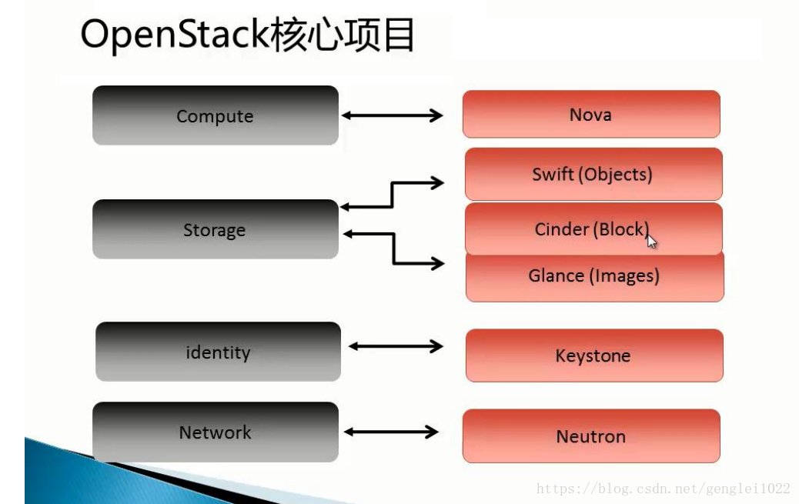

[TOC]

# OpenStack的基本概念与架构图

​	OpenStack的（又名O〜S）是一个自由和开放源码 软件平台为云计算，主要是部署基础架构即服务（IaaS的），因此虚拟服务器和其他资源提供给客户。[2]软件平台由相互关联的组件组成，这些组件控制整个数据中心内处理，存储和网络资源的各种多供应商硬件池。用户可以通过基于Web的仪表板，命令行工具或RESTful Web服务进行管理。

​	OpenStack于2010年开始作为Rackspace Hosting和NASA的联合项目。截至2016年，它由OpenStack Foundation管理，OpenStack Foundation是一家于2012年9月成立的非营利性公司实体 ，旨在推广OpenStack软件及其社区。 超过500家公司加入了该项目。

| 服务                    | 项目名称       | 方法描述                                                     |
| ----------------------- | -------------- | ------------------------------------------------------------ |
| Dashboard               | **Horizon**    | 提供了一个基于web的自服务门户，与OpenStack底层服务交互，诸如启动一个实例，分配IP地址以及配置访问控制 |
| Compute                 | **Nova**       | 在OpenStack环境中计算实例的生命周期管理。按需响应包括生成、调度、回收虚拟机等操作。 |
| Networking              | **Neutron**    | 确保为其它OpenStack服务提供网络连接即服务 “Quantum”–>Neutron |
| Identity Management     | **Keystone**   | 为其他OpenStack服务提供认证和授权服务，为所有的OpenStack服务提供一个端点目录。 |
| Object Storage          | **Swift**      | 通过一个 RESTful,基于HTTP的应用程序接口存储和任意检索的非结构化数据对象。它拥有高容错机制，基于数据复制和可扩展架构。它的实现并像是一个文件服务器需要挂载目录。在此种方式下，它写入对象和文件到多个硬盘中，以确保数据是在集群内跨服务器的多份复制 |
| Block Storage           | **Cinder**     | 为运行实例而提供的持久性块存储。它的可插拔驱动架构的功能有助于创建和管理块存储设备 |
| Image Service           | **Glance**     | 存储和检索虚拟机磁盘镜像，OpenStack计算会在实例部署时使用此服务。 |
| Telemetry               | **Ceilometer** | 为OpenStack云的计费、基准、扩展性以及统计等目的提供监测和计量。 |
| Database Service        | **Trove**      | 提供管理数据库即服务配置关系和非关系数据库引擎节点的Trove相关，同时提供Trove在Horizon中的管理面板 |
| Bare Metal Provisioning | **Ironic**     | 提供裸金属管理服务，Nova Baremetal驱动程序                   |
| Orchestration           | **Heat**       | 提供了基于模板来实现云环境中资源的初始化，依赖关系处理，部署等基本操作，也可以解决自动收缩,负载均衡等高级特性。 |
| Data Processing Service | **Sahara**     | 使用用户能够在Openstack平台上便于创建和管理Hadoop以及其他计算框架集群。 |

整个OpenStack是由控制节点，计算节点，网络节点，存储节点四大部分组成。（这四个节点也可以安装在一台机器上，单机部署）其中：

控制节点：负责对其余节点的控制，包含虚拟机建立，迁移，网络分配，存储分配等等
计算节点：负责虚拟机运行
网络节点负责对外网络与内网络之间的通信
存储节点负责对虚拟机的额外存储管理

**keystone**
     这是提供身份认证和授权的组件。任何系统，身份认证和授权，其实都比较复杂。尤其Openstack 那么庞大的项目，每个组件都需要使用统一认证和授权。
     目前keystone 要做的东西其实还是很多。没法基于角色的授权，web管理用户等。

**Nova OpenStackCompute**
     Nova是最核心的，可以说是一套虚拟化管理程序，因为nova可以创建、删除虚拟机、重启虚拟机等，openstack的之所以能够搭建云平台，也是因为它能够创建虚拟机，其它的组件，比如Neutron则是为了让虚拟机之间、虚拟机与外网之间能够互通，Cinder则是为了增加虚拟机的存储空间。可见nova在openstack中作用是非常大的。

**Dashboard**
     (代号为“Horizon”) 为所有OpenStack的服务提供了一个模块化的web-based用户界面。使用这个Web GUI，可以在云上完成大多数的操作，如启动实例，分配IP地址，设置访问控制等。

**Glance**
     这是镜像管理。
     目前Glance的镜像存储，支持本地存储，NFS，swift，sheepdog和Ceph，基本是够用了。
     目前Glance的最大需求就是多个数据中心的镜像管理，如何复制，不过这个功能已经基本实现。还有就是租户私有的**image**

​	管理，这些目前功能都已经实现。

**Neutron**
     这是网络管理的组件，也是重头戏，Openstack的未来，基本都要靠quantum。网络相关的内容，都会交给Quantum。不过Quantum的开发进度不是太如人意。Flosom规划实现功能，到Grizzly才实现。未来nova network的代码清理，估计到H版本都不见得可以实现。Quantum 后端可以是商业产品或者开源。开源产品支持Openvswitch，和linux bridge。网络设备厂商都在积极参与，让他们的产品支持Quantum。
     网络组件nova-network的发展经历了nova-network->Quantum->Neutron，Openstack在2010年正式发布它的第一个版本Austin的时候，nova-network作为它的核心组件被包含其中，网络由nova-network来承担，后来逐渐分离出来，改名为Quantum. Quantum是随Openstack的Folsom版本正式发布的，其实它已经作为试用组件包含在之前的Essex版本中。在Grizzly里功能得到了增强。
**Neutron**
     因为商标侵权原因，Openstack在Havana版本将Quantum更名为Neutron，所以Neutron并不是什么新东西。在Havana版里，Neutron也只增加和增强了少数功能

**Cinder**
     这是存储管理的组件。Cinder存储管理主要是指虚拟机的存储管理

**Swift**
     这是对象存储的组件。对于大部分用户来说，swift不是必须的。你只有存储数量到一定级别，而且是非结构化数据才有这样的需求。很多人都问一个相同的问题：是否可以把虚拟机的存储放在swift上。简单回答：不行。你需要搞明白对象存储是干啥，擅长那些地方，那些是不行的。
swift是Openstack所有组件了最成熟的,可以在线升级版本,各种版本可以混合在一起,也就是说,1.75版本的swift可以和1.48的在一个群集里.这个是很难得的.

**Ceilometer**
     提供用量统计服务，通过它可以方便地实现 OpenStack 计费功能。
**Heat**
     整合了 OpenStack 中的众多组件，类似 AWS 的 CloudFormation，让用户能够通过模板来管理资源
