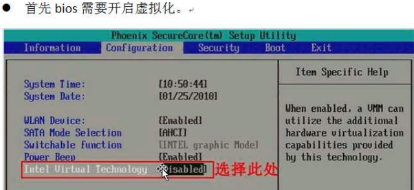
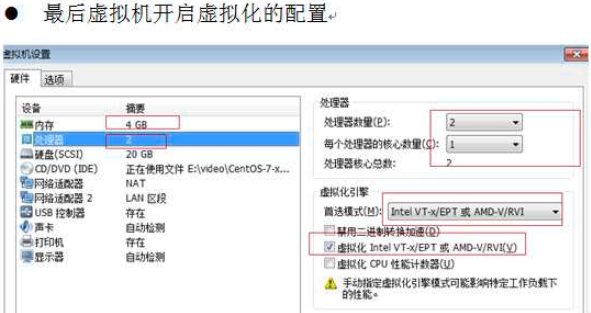
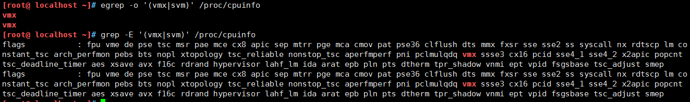
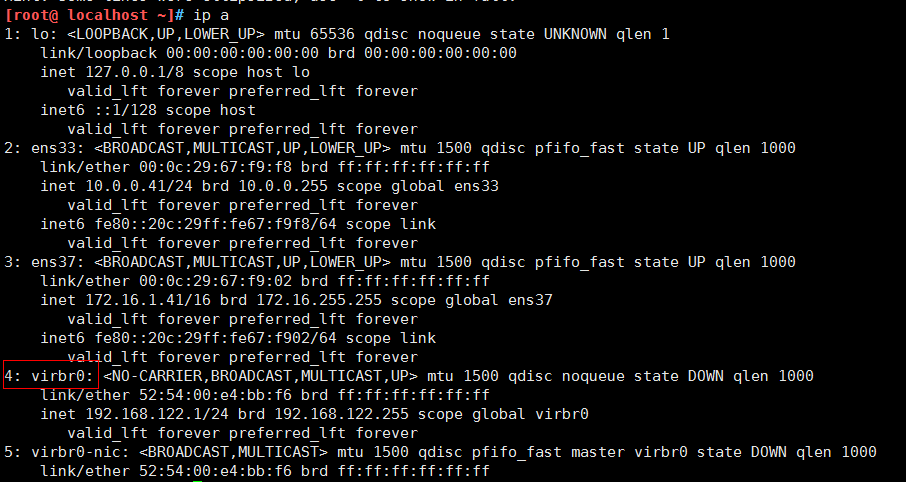
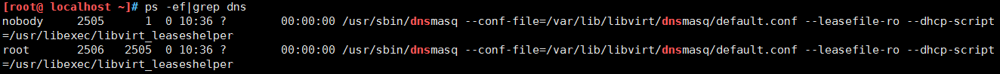
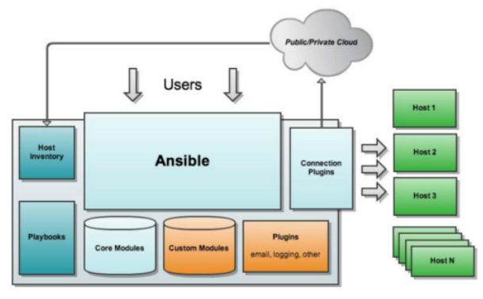

[TOC]


# 实训二


# 项目一

# 1.1 Kvm虚拟化实战

## 1.1.1 简介

​	Kernel-based Virtual Machine的简称，是一个开源的系统虚拟化模块，自Linux 2.6.20之后集成在Linux的各个主要发行版本中。它使用Linux自身的调度器进行管理，所以相对于Xen，其核心源码很少。KVM目前已成为学术界的主流VMM之一。

​	KVM的虚拟化需要硬件支持（如Intel VT技术或者AMD V技术)。是基于硬件的完全虚拟化。而Xen早期则是基于软件模拟的Para-Virtualization，新版本则是基于硬件支持的完全虚拟化。但Xen本身有自己的进程调度器，存储管理模块等，所以代码较为庞大。广为流传的商业系统虚拟化软件VMware ESX系列是基于软件模拟的Full-Virtualization。


​	因为对进程管理比较麻烦,RedHat发布了一个开源项目libvirt。libvirt有命令行工具也有API，可以通过图形化界面，完成对虚拟机的管理。大多数管理平台通过libvirt来完成对KVM虚拟机的管理；比如Openstack、Cloudstack、OpenNebula等。

## 1.1.2 虚拟化概念

**1.软件模拟**

优点：能够模拟任何硬件，包括不存在的

缺点：功能非常低效，一般用于研究，生产环境不同。

代表：QEM

**2.虚拟化层翻译**

2.1 软件全虚拟化----VMware

2.2 半虚拟化----改动虚拟机的内核（linux）xen（被淘汰）

2.3 硬件支持的全虚拟化----KVM

**3.容器虚拟化 docker**

**4.虚拟化分类**

1.硬件虚拟化 硬件虚拟化代表：KVM 

2.软件虚拟化 软件虚拟化代表：Qemu

提示：硬件虚拟化是需要CPU支持，如果CPU不支持将无法创建KVM虚拟机。Qemu和KVM的最大区别就是，如果一台物理机内存直接4G，创建一个vm虚拟机分配内存分4G，在创建一个还可以分4G。支持超配，但是qemu不支持


## 1.1.3 QEMU与KVM

QUME十一个开源项目，实际就是一台硬件模拟器，可以模拟许多硬件，包括X86架构处理器、AMD64架构处理器等。

QEMU的优点是因为是纯软件模拟，所以可以在支持的平台模拟支持的设备。缺点是因为纯软件模拟，所以非常慢。

KVM只是一个内核模块，只能提供CPU和内存；所以还需要QEMU模拟IO设备；如磁盘、网卡等。


## 1.1.4 Libvirt与KVM

Libvirt是一套开源的虚拟化管理工具，主要由3部分组成。

- 一套API的lib库，支持主流的编程语言，包括C、Python、Ruby等
- Libvirt服务
- 命令行工具virsh
- Libvirt可以实现对虚拟机的管理，比如虚拟机的创建、启动、关闭、暂停、恢复、迁移、销毁，以及对虚拟网卡、硬盘、CPU、内存等多种设备的热添加。


# 1.2 KVM安装

## 1.2.1 环境准备

**1.硬件环境**





虚拟化Intel使用的是intel VT-X AMD使用的是AMD-V

创建虚拟机步骤

1.准备虚拟机硬盘

2.需要系统iso镜像

3.需要安装一个vnc的客户端来连接


**2.系统环境**

```shell
[root@ localhost ~]# cat /etc/redhat-release
CentOS Linux release 7.3.1611 (Core)
[root@ localhost ~]# uname -r
3.10.0-514.el7.x86_64
[root@ localhost ~]# getenforce
Disabled
[root@ localhost ~]# systemctl stop firewalld.service

```

- 检查CPU是否支持虚拟化

```
vmx       ##(for Intel CPU)
svm       ##（for AMD CPU）
```

**KVM其实已经在Centos7内置到系统内核，无需安装。**


- 检查CPU是否支持虚拟化

```
egrep -o '(vmx|svm)' /proc/cpuinfo
grep -E '(vmx|svm)' /proc/cpuinfo
```



在linux平台下，我们可以通过dmesg |grep kvm命令来查看。
如果CPU没有开启虚拟化的话，显示如下：


## 1.2.2 安装kvm用户态模块

```shell
[root@ localhost ~]# yum list|grep kvm
libvirt-daemon-kvm.x86_64               4.5.0-23.el7_7.1               updates
oci-kvm-hook.x86_64                     0.3-1.el7                      epel
qemu-kvm.x86_64                         10:1.5.3-167.el7_7.1           updates
qemu-kvm-common.x86_64                  10:1.5.3-167.el7_7.1           updates
qemu-kvm-tools.x86_64                   10:1.5.3-167.el7_7.1           updates
[root@ localhost ~]# yum install qemu-kvm qemu-kvm-tools libvirt -y

# libvirt 用来管理kvm
# kvm属于内核态，不需要安装。但是需要一些类似于依赖的
```


## 1.2.3 启动libvirt

```shell
systemctl start libvirtd.service
systemctl enable libvirtd.service
```

启动之后我们可以使用`ip a`进行查看，libvirtd已经为我们安装了一个桥接网卡:



libvirtd为我们启动了一个dnsmasqp，这个主要是用来dhcp连接的，这个工具会给我们的虚拟机分配

```
ps -ef|grep dns
```




# 1.3 创建虚拟机

## 1.3.1查看磁盘空间大小 

最好是20G以上


## 1.3.2上传镜像 

提示：如果使用rz上传镜像可能会出现错误，所以我们使用dd命令，复制系统的镜像。只需要挂载上光盘即可。

```shell
cd /opt
rz #上传centos7镜像
dd if=/dev/cdrom of=/opt/CentOS-7-x86_64-Minimal-1810.iso
```


## 1.3.3 创建磁盘 

提示： qemu-img软件包是我们安装qemu-kvm-tools 依赖给安装上的

```
[root@ localhost ~]#  qemu-img create -f qcow2 /opt/CentOS-7.3-x86_64.qcow2 6G
```

-f 制定虚拟机格式
/opt/Centos  存放路径
6G 代表镜像大小

**磁盘格式介绍**

raw----裸磁盘不支持快照

qcow2----支持快照。Openstack使用的方式推荐使用这个。注意：关闭虚拟机后操作。

区别：
全镜像格式（典型代表raw），特点：设置多大就是多大，写入速度快，方便转换其他格式，性能最优，但是占用空间大。
稀疏格式（典型代表qcow2）,其特点：支持压缩、快照、镜像，更小的存储空间（即用多少占多少）
qcow2 数据的基本组成单元是cluster 
raw性能比qcow2快
raw创建多大磁盘，就占用多大空间直接分配，qcow2动态的用多大占用多大空间。


# 1.4 安装虚拟机

 	virt-install是一个命令行工具，它能够为KVM、Xen或其它支持libvrit API的hypervisor创建虚拟机并完成GuestOS安装；此外，它能够基于串行控制台、VNC或SDL支持文本或图形安装界面。安装过程可以使用本地的安装介质如CDROM，也可以通过网络方式如NFS、HTTP或FTP服务实现。对于通过网络安装的方式，virt-install可以自动加载必要的文件以启动安装过程而无须额外提供引导工具。当然，virt-install也支持PXE方式的安装过程，也能够直接使用现有的磁盘映像直接启动安装过程。  

```shell
[root@ localhost ~]# yum install -y virt-install

[root@ localhost ~]# virt-install --virt-type=kvm --name=c73 --vcpus=1 -r 1024 --cdrom=/opt/CentOS-7-x86_64-Minimal-1810.iso --network network=default --graphics vnc,listen=0.0.0.0 --noautoconsole --os-type=linux --os-variant=rhel7 --disk path=/opt/CentOS-7.3-x86_64.qcow2,size=6,format=qcow

默认连接端口是从5900开始的
[root@ localhost opt]# virsh list --all
 Id    Name                           State
----------------------------------------------------
 1     c73                            running


[root@ localhost ~]# netstat -lntup|grep 5900
tcp        0      0 0.0.0.0:5900            0.0.0.0:*               LISTEN      2699/qemu-kvm

#开启kvm虚机
[root@ localhost opt]# virsh start c74
Domain c74 started

[root@ localhost opt]# virsh list --all
 Id    Name                           State
----------------------------------------------------
 1     c73                            running
```

virt-install常用参数：

```
1. -n --name= 客户端虚拟机名称
2.-r --ram= 客户端虚拟机分配的内存
3.-u --uuid= 客户端UUID 默认不写时，系统会自动生成
4.--vcpus= 客户端的vcpu个数
5.-v --hvm 全虚拟化
6.-p --paravirt 半虚拟化
7.-l --location=localdir 安装源，有本地、nfs、http、ftp几种，多用于ks网络安装
8.--vnc 使用vnc ，另有--vnclient＝监听的IP  --vncport ＝VNC监听的端口
9.-c --cdrom= 光驱 安装途径
10.--disk= 使用不同选项作为磁盘使用安装介质
11.-w NETWORK, --network=NETWORK 连接客户机到主机网络 
12.-s --file-size= 使用磁盘映像的大小 单位为GB
13.-f --file= 作为磁盘映像使用的文件
14.--cpuset=设置哪个物理CPU能够被虚拟机使用
15.--os-type=OS_TYPE 针对一类操作系统优化虚拟机配置（例如：‘linux’，‘windows’）
16.--os-variant=OS_VARIANT 针对特定操作系统变体（例如’rhel6’, ’winxp’,'win2k3'）进一步优化虚拟机配置
17.--host-device=HOSTDEV 附加一个物理主机设备到客户机。HOSTDEV是随着libvirt使用的一个节点设备名（具体设备如’virsh nodedev-list’的显示的结果）
18.--accelerate KVM或KQEMU内核加速,这个选项是推荐最好加上。如果KVM和KQEMU都支持，KVM加速器优先使用。
19.-x EXTRA, --extra-args=EXTRA 当执行从"--location"选项指定位置的客户机安装时，附加内核命令行参数到安装程序
--nographics "virt-install" 将默认使用--vnc选项，使用nographics指定没有控制台被分配给客户机
```


2. ### 5VNC连接创建好的虚拟机并安装系统


然后开始安装系统。


# 项目二

# 2.1 ansible批量管理工具

## 2.1.1 简介

ansible是新出现的自动化运维工具，基于Python开发，集合了众多运维工具（puppet、cfengine、chef、func、fabric）的优点，实现了批量系统配置、批量程序部署、批量运行命令等功能。

ansible是基于模块工作的，本身没有批量部署的能力。真正具有批量部署的是ansible所运行的模块，ansible只是提供一种框架。主要包括：

(1)、连接插件connection plugins：负责和被监控端实现通信；

(2)、host inventory：指定操作的主机，是一个配置文件里面定义监控的主机；

(3)、各种模块核心模块、command模块、自定义模块；

(4)、借助于插件完成记录日志邮件等功能；

(5)、playbook：剧本执行多个任务时，非必需可以让节点一次性运行多个任务


## 2.1.2 ansible的软件结构



```
Host Inventory：主机清单，也就是被管理的主机列表
Playbooks：ansible的剧本，可想象为将多个任务放置在一起，一块执行
Core Modules：ansible的核心模块
Custom Modules：自定义模块
Connection Plugins：连接插件，用于与被管控主机之间基于SSH建立连接关系
Plugins：其他插件，包括记录日志等
```


## 2.1.3 ansible的特性

<1> 模块化：调用特定的模块，完成特定任务
<2> 基于python语言实现，由Paramiko(完成基于ssh的连接)，PyYAML(对YAML文件的支持)，jinja2(python的模板库)三个关键的模块
<3> 部署简单：是没有客户端的
<4> 支持自定义模块，使用任意编程语言
<5> 支持强大的playbook
<6> 具有幂等性：一个操作在一个主机上执行一遍和执行N遍的结果是一样的


# 2.1 ansible的基础应用

**1.ansible管理端的安装**

在EPEL源中，有包含ansible的软件包安装只需要配置好EPEL的yum源，yum安装即可

```shell
yum -y install ansible
```


**2.ansible被管控主机的定义**
对希望被管控的主机的定义需要实现在ansible管理端的针对被管理主机的配置文件(/etc/ansible/hosts)中进行定义


Git版本管理


Openstack云计算


Docker容器微服务实战

