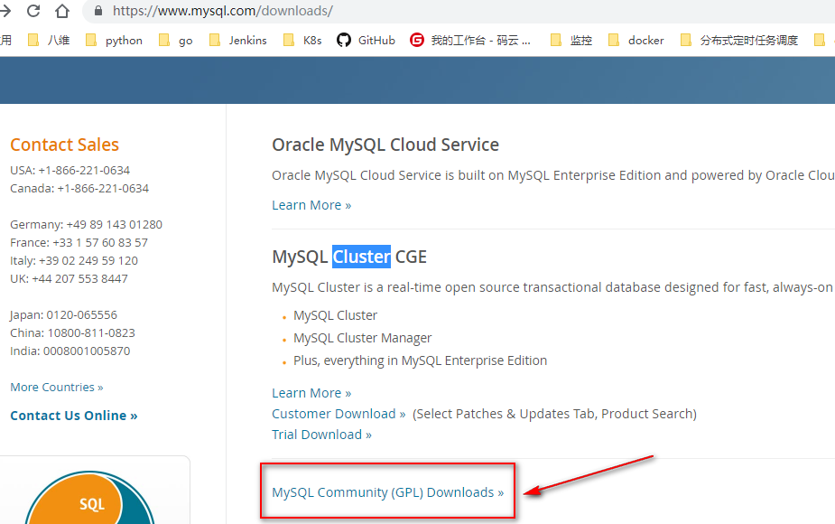
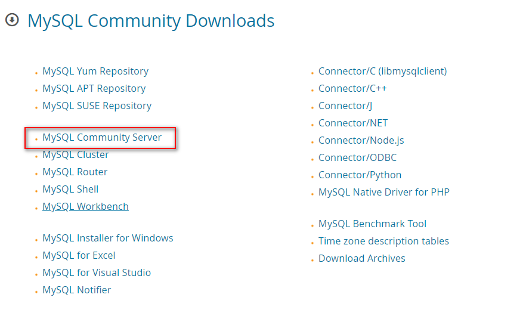
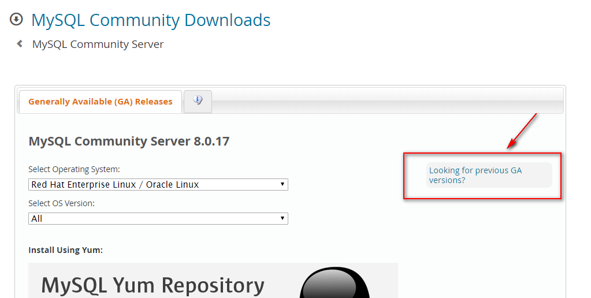
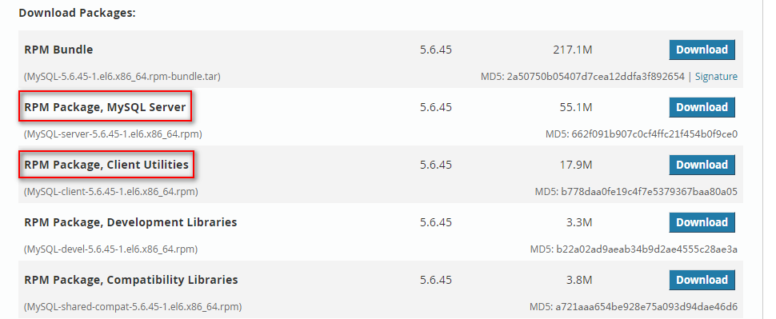

[TOC]


# 第一单元-数据库概述	


## 1.1 数据库简介

### 1.1.1 什么是数据库 

DB的全称是data base，即数据库的意思。数据库实际上就是一个文件集合，是一个存储数据的仓库，本质就是一个文件系统，数据库是按照特定的格式把数据存储起来，用户可以对存储的数据进行增删改查操作。


### 1.1.2 数据库的分类

**关系型数据库：** 

经过数学理论验证可以保存现实生活中的各种关系数据， 数据库中存储数据以表为单位；

**非关系型数据库：**

通常用来解决某些特定的需求如：数据缓存，高并发访问。 存储数据的形式有多种，举例：Redis数据库：通过键值对的形式存储数据。


### 1.1.3 关系型数据库

**主流关系型数据库简介**

**MySQL：** 08年被sun公司收购09年sun被oracle收购，开源免费，到oracle发布了5.0版本（使用了oracle核心技术 性能提高30%），因为Oracle数据库地位受到威胁，计划把mysql闭源，原mysql作者们不干了，原程序员出去单干。

**MariaDB数据库**：名字是因为作者女儿叫Maria ，市场排名第一；

**Oracle**：闭源、最贵、性能最高，市场排名第二；

**SQLServer**：微软公司的产品，市场排名第三，主要应用在.net(C#)开发的网站中；

**DB2**：IBM公司有做网站的完整解决方案（操作系统，we服务器（如tomcat），数据库等）主要应用在银行等国有大型企业中；

**sqlite**：轻量级数据库，只有几十k，一般应用在嵌入式和移动设备中；


### 1.1.4 MYSQL、ORACLE、SQL SERVER功能和应用场合

mysql主要用于大型门户，例如搜狗、新浪等，它主要的优势就是开放源代码，因为开放源代码这个数据库是免费的，它现在是甲骨文公司的产品。

oracle主要用于银行、铁路、飞机场等。该数据库功能强大，软件费用高。也是甲骨文公司的产品。

sql server是微软公司的产品，主要应用于大中型企业，如联想、方正等。


### 1.1.5 数据库服务器、数据库、表与记录的关系

所谓安装数据库服务器，只是在机器上装了一个数据库管理程序，这个管理程序可以管理多个数据库，一般开发人员会针对每一个应用创建一个数据库。为保存应用中实体的数据，一般会在数据库创建多个表，以保存程序中实体的数据。数据库服务器、数据库和表的关系如图所示：


**问题：**

[单选] 数据库服务器、数据库和表的关系，正确的说法是（）。
A . 一个数据库服务器只能管理一个数据库，一个数据库只能包含一个表
B . 一个数据库服务器可以管理多个数据库，一个数据库只能包含一个表
C . 一个数据库服务器可以管理多个数据库，一个数据库可以包含多个表
D . 一个数据库服务器只能管理一个数据库，一个数据库可以包含多个表

参考答案： C


### 1.1.6 掌握数据库存储引擎种类

MySQL常见的三种存储引擎为InnoDB、MyISAM和MEMORY。其区别体现在事务安全、存储限制、空间使用、内存使用、插入数据的速度和对外键的支持。具体如下：


1、事务安全：

InnoDB支持事务安全，MyISAM和MEMORY两个不支持。

2、存储限制：

InnoDB有64TB的存储限制，MyISAM和MEMORY要是具体情况而定。

3、空间使用：

InnoDB对空间使用程度较高，MyISAM和MEMORY对空间使用程度较低。

4、内存使用：

InnoDB和MEMORY对内存使用程度较高，MyISAM对内存使用程度较低。

5、插入数据的速度：

InnoDB插入数据的速度较低，MyISAM和MEMORY插入数据的速度较高。

6、对外键的支持：

InnoDB对外键支持情况较好，MyISAM和MEMORY两个不支持外键。


**三种引擎特点如下：**

**1、InnoDB存储引擎**

InnoDB是事务型数据库的首选引擎，支持事务安全表（ACID），其它存储引擎都是非事务安全表，支持行锁定和外键，MySQL5.5以后默认使用InnoDB存储引擎。

InnoDB特点： 支持事务处理，支持外键，支持崩溃修复能力和并发控制。如果需要对事务的完整性要求比较高（比如银行），要求实现并发控制（比如售票），那选择InnoDB有很大的优势。

如果需要频繁的更新、删除操作的数据库，也可以选择InnoDB，因为支持事务的提交（commit）和回滚（rollback）。

```shell
用法：engine=innodb default charset=utf-8;
```


**2、MyISAM存储引擎** 

MyISAM基于ISAM存储引擎，并对其进行扩展。它是在Web、数据仓储和其他应用环境下最常使用的存储引擎之一。MyISAM拥有较高的插入、查询速度，**但不支持事务，不支持外键**。

MyISAM特点： 插入数据快，空间和内存使用比较低。**如果表主要是用于插入新记录和读出记录，那么选择MyISAM能实现处理高效率**。如果应用的完整性、并发性要求比较低，也可以使用。

```shell
用法： engine=myisam default charset=utf-8;
```


**3、MEMORY存储引擎** 

MEMORY存储引擎将表中的数据存储到内存中，为查询和引用其他表数据提供快速访问。

MEMORY特点： 所有的数据都在内存中，数据的处理速度快，但是安全性不高。如果需要很快的读写速度，对数据的安全性要求较低，可以选择MEMOEY。

它对表的大小有要求，不能建立太大的表。所以，这类数据库只使用在相对较小的数据库表。

```shell
用法：engine=memory;
```


**扩展资料：**

mysql其余不太常见的存储引擎如下：

1、BDB： 源自Berkeley DB，事务型数据库的另一种选择，支持COMMIT和ROLLBACK等其他事务特性

2、Merge ：将一定数量的MyISAM表联合而成一个整体，在超大规模数据存储时很有用

3、Archive ：非常适合存储大量的独立的，作为历史记录的数据。因为它们不经常被读取。Archive拥有高效的插入速度，但其对查询的支持相对较差

4、Federated： 将不同的Mysql服务器联合起来，逻辑上组成一个完整的数据库。非常适合分布式应用

5、Cluster/NDB ：高冗余的存储引擎，用多台数据机器联合提供服务以提高整体性能和安全性。适合数据量大，安全和性能要求高的应用

6、CSV： 逻辑上由逗号分割数据的存储引擎。它会在数据库子目录里为每个数据表创建一个.CSV文件。这是一种普通文本文件，每个数据行占用一个文本行。CSV存储引擎不支持索引。

7、BlackHole ：黑洞引擎，写入的任何数据都会消失，一般用于记录binlog做复制的中继


## 1.2 Linux平台下安装与配置mysql


### 1.2.1 rpm安装

数据库包下载：
https://www.mysql.com/downloads/

Linux平台上推荐使用RPM包来安装Mysql,MySQL 提供了以下RPM包的下载地址：
MySQL-MySQL服务器。你需要该选项，除非你只想连接运行在另一台机器上的MySQL服务器。
MySQL-client - MySQL 客户端程序，用于连接并操作Mysql服务器。
MySQL-devel - 库和包含文件，如果你想要编译其它MySQL客户端，例如Perl模块，则需要安装该RPM包。
MySQL-shared - 该软件包包含某些语言和应用程序需要动态装载的共享库(libmysqlclient.so*)，使用MySQL。
MySQL-bench - MySQL数据库服务器的基准和性能测试工具。

在GPL开原协议的社区开源版里边下载



我们用mysql community server里边的









**rpm安装mysql**

```shell
yum -y remove mysql
安装mysql-server
rpm -ivh MySQL-server-5.6.45-1.el6.x86_64.rpm
/etc/init.d/mysql start

查看进程和端口
ps -ef|grep mysql
ss -lntp|grep mysql

查看mysql登录密码
cat /root/.mysql_secret

安装mysql-client
rpm -ivh MySQL-client-5.6.45-1.el6.x86_64.rpm

登录mysql
mysql -uroot -hlocalhost -pMwOYx9dk3_owUrZH
```

启动报错：

```
ERROR! The server quit without updating PID file (/var/lib/mysql/localhost.localdomain.pid).
```

查看mysql的启动日志：

[ERROR] InnoDB: auto-extending data file ./ibdata1 is of a different size 640 pages (rounded down to MB) than specified in the .cnf file: initial 768 pages, max 0 (relevant if non-zero) pages!

解决方法：

执行删除命令：rm -rf /var/lib/mysql/ib*

删除：ibdata1、ib_logfile0、ib_logfile1文件

重新启动：/etc/init.d/mysql restart


### 1.2.2 源码包编译参数与安装

注意： 一定要删除原系统下所有和mysql相关的文件，保证安装mysql时系统的纯净。

```shell
yum -y remove mysql*
#1.下载源码包
wget --no-check-certificate http://dev.mysql.com/get/Downloads/MySQL-5.6/mysql-5.6.45.tar.gz

#2.安装依赖
yum -y install ncurses-devel libaio-devel cmake

#3.设置用户
useradd -s /sbin/nologin -M mysql
id mysql

#4.解压并检查编译环境
tar -zxvf mysql-5.6.45.tar.gz
cd mysql-5.6.45

cmake . -DCMAKE_INSTALL_PREFIX=/usr/local/mysql \
-DMYSQL_DATADIR=/usr/local/mysql/data \
-DMYSQL_UNIX_ADDR=/usr/local/mysql/mysql.sock \
-DMYSQL_USER=mysql \
-DMYSQL_TCP_PORT=3306 \
-DDEFAULT_CHARSET=utf8 \
-DDEFAULT_COLLATION=utf8_general_ci \
-DWITH_EXTRA_CHARSETS=all \
-DWITH_INNOBASE_STORAGE_ENGINE=1 \
-DWITH_FEDERATED_STORAGE_ENGINE=1 \
-DWITH_BLACKHOLE_STORAGE_ENGINE=1 \
-DWITHOUT_EXAMPLE_STORAGE_ENGINE=1 \
-DWITH_ZLIB=bundled \
-DWITH_SSL=bundled \
-DENABLED_LOCAL_INFILE=1 \
-DWITH_EMBEDDED_SERVER=1 \
-DENABLE_DOWNLOADS=1 \
-DWITH_DEBUG=0

#5.编译并安装
make && make install

#6.初始化及配置数据库
cd /usr/local/mysql/
\cp support-files/my-default.cnf /etc/my.cnf

/usr/local/mysql/scripts/mysql_install_db --basedir=/usr/local/mysql/ --datadir=/usr/local/mysql/data --user=mysql

#7.设置mysql登录密码
/usr/local/mysql/bin/mysqladmin -u root password '123456'

#8.设置mysql工作目录属主属组
chown -R mysql.mysql /usr/local/mysql/

#9.配置启动脚本管理mysql
cd /usr/local/mysql/
cp support-files/mysql.server /etc/init.d/mysqld
chmod 700 /etc/init.d/mysqld
chkconfig mysqld on
/etc/init.d/mysqld start
```

常用编译参数说明：

| 编译参数                                      | 说明                                                         |
| :-------------------------------------------- | ------------------------------------------------------------ |
| -DCMAKE_INSTALL_PREFIX=/usr/local/mysql       | 设定mysql安装目录==mysqlg工作目录                            |
| -DMYSQL_DATADIR=/usr/local/mysql/data         | 设定mysql数据文件目录                                        |
| -DMYSQL_UNIX_ADDR=/usr/local/mysql/mysql.sock | 设定mysql.sock路径                                           |
| -DDEFAULT_CHARSET=utf8                        | 设定默认的字符集为utf8                                       |
| -DDEFAULT_COLLATION=utf8_general_ci           | 设定默认排序规则                                             |
| -DWITH_EXTRA_CHARSETS=all                     | 启用额外的字符集                                             |
| -DENABLED_LOCAL_INFILE=ON                     | 启用本地数据导入支持                                         |
| -DWITH_INNOBASE_STORAGE_ENGINE=1              | 启用某个引擎的支持  -DWITH_<ENGIEN>_STORAGE_ENGINE=1;禁用某个引擎的支持   -DWITHOUT_<ENGIEN>_STORAGE_ENGINE=0 |
| -DWITH_FEDERATED_STORAGE_ENGINE=1             |                                                              |
| -DWITH_BLACKHOLE_STORAGE_ENGINE=1             |                                                              |
| -DWITHOUT_EXAMPLE_STORAGE_ENGINE=1            |                                                              |
| -DWITH_SSL=bundled                            | 启用ssl库支持（安全套接层）                                  |
| -DWITH_ZLIB=bundled                           | 启用zlib库支持                                               |
| -DWITH_EMBEDDED_SERVER=1                      | 编入嵌入式服务器支持                                         |
| -DWITH_DEBUG=0                                | 禁用debug模式（默认禁用）                                    |
| -DMYSQL_TCP_PORT=3306                         | 指定TCP端口为3306                                            |

更多内容可以参考官方MySQL 5.6的cmake编译参数

- **http://dev.mysql.com/doc/refman/5.6/en/source-configuration-options.html**


## 1.3 mysql数据库的管理

### 1.3.1 登陆mysql数据库

**mysql命令的介绍：**

mysql通常用于登陆mysql服务器，然后执行操作，其实mysql也提供了非交互式执行mysql命令的参数，同时mysql命令也是数据恢复非常重要的工具。


**mysql命令的常见用法：**

连接本机mysql

```
mysql -uroot -p密码
```

连接远程主机mysql

```
mysql  -h远程主机ip -uroot -p密码
```

退出MYSQL命令

```
exit或\q 回车
```

非交互式执行mysql语句

```
mysql -uroot -p123456 s-e "show databases;"
```


### 1.3.2 掌握mysql数据库中库的常见操作

**创建数据库：**

a) 直接创建数据库：  create database 数据库名；

```shell
例子：create database wg；

创建wg数据库并设置字符集为utf8
create database wg default CHARACTER SET utf8 COLLATE utf8_general_ci;
```

b) 如果不存在则创建数据库: create database if not  exists 数据库名；

```shell
例子：create  database if not exists wg；
```


**删除数据库：**

a) 直接删除数据库的方法：  drop database 数据库名；

```shell
例子：drop  database wg；
```

b) 如果存在则删除数据库的方法: drop database if exists 数据库名；

```shell
例子：drop database if exists wg；
```


**进入数据库：**

```
use wg;
```

**查看当前所在的库：**

```
select database();
```

**显示所有数据库：**

```
show databases;
show databases like '%old%';  显示包含old字符的数据库
show create database 库名\G  查看已建库的完整语句
```


### 1.3.3 掌握mysql数据库存储引擎

a) 掌握存储引擎：存储引擎就是指表的类型。数据库的存储引擎决定了表在计算机中的存储方式。

b) 了解mysql支持的存储引擎包括：MyISAM、MEMORY、InnoDB、ARCHIVE、MRG_MYISAM等。

其中，InnoDB为默认存储引擎。最长使用的两种存储引擎是MyISAM和InnoDB。


### 1.3.4 掌握mysql数据库中表的字段类型


### 1.3.5 灵活运用mysql数据库中表的约束

为了防止往数据表中插入错误的数据，在MySQL中，定义了一些维护数据库完整性的规则，即表的约束。

常见的表的约束：

