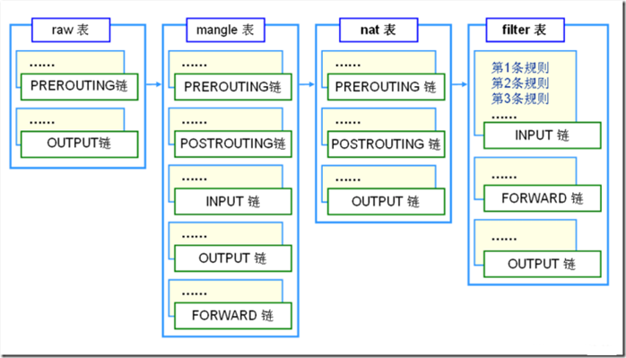

[TOC]


# 第二十单元-iptables防火墙


## 20.1 防火墙概念

​	所谓防火墙指的是一个由软件和硬件设备组合而成、在内部网和外部网之间、专用网与公共网之间的界面上构造的保护屏障.是一种获取安全性方法的形象说法，它是一种计算机硬件和软件的结合，使Internet与Intranet之间建立起一个安全网关（Security Gateway），从而保护内部网免受非法用户的侵入，**防火墙主要由服务访问规则、验证工具、包过滤和应用网关4个部分组成**，**防火墙就是一个位于计算机和它所连接的网络之间的软件或硬件**。该计算机流入流出的所有网络通信和数据包均要经过此防火墙。

​	在网络中，所谓“防火墙”，是指一种将内部网和公众访问网（如Internet）分开的方法，它实际上是一种隔离技术。防火墙是在两个网络通讯时执行的一种访问控制尺度，它能允许你“同意”的人和数据进入你的网络，同时将你“不同意”的人和数据拒之门外，最大限度地阻止网络中的黑客来访问你的网络。换句话说，如果不通过防火墙，公司内部的人就无法访问Internet，Internet上的人也无法和公司内部的人进行通信。


### 20.1.1 软件防火墙

​	软件防火墙单独使用软件系统来完成防火墙功能，将软件部署在系统主机上，其安全性较硬件防火墙差，同时占用系统资源，在一定程度上影响系统性能。其一般用于单机系统或是极少数的个人计算机，很少用于计算机网络中。


### 20.1.2 硬件防火墙

把软件防火墙嵌入在硬件中，一般的软件安全厂商所提供的硬件防火墙便是在硬件服务器厂商定制硬件，然后再把linux系统与自己的软件系统嵌入，也就是说硬件防火墙是指把防火墙程序做到芯片里面，由硬件执行这些功能，能减少CPU的负担，使路由更稳定。


## 20.1 iptables防火墙简介

​	iptables是unix/linux自带的一款优秀的开放源代码的完全自由的**基于包过滤**的防火墙工具，它的功能十分强大，使用灵活，可以对**流入和流出服务器的数据包进行控制**。

​	iptables是linux2.4及2.6内核集成的服务。iptables主要工作在OSI七层的二（数据层），三（网络层），四层（传输层），如果重新编译内核，iptables也可以支持七层（应用层）的控制。


## 20.2 iptables企业应用场景

1.主机防火墙（filter表的INPUT链）。

2.网关（共享上网）（nat表的POSTROUTING链）。

3.端口及IP（一对一）映射（nat表的POSTROUTING链）。


## 20.3 iptables中表（tables）和链（chains）

​	iptables采用“表”和“链”的分层结构。在REHL4中是三张表五个链。现在REHL5成了四张表五个链了，不过多出来的那个表用的也不太多，所以基本还是和以前一样。下面罗列一下这四张表和五个链。注意一定要明白这些表和链的关系及作用。




**规则表：**

1.filter表——三个链：INPUT、FORWARD、OUTPUT

作用：过滤数据包  内核模块：iptables_filter.

2.Nat表——三个链：PREROUTING、POSTROUTING、OUTPUT

作用：用于网络地址转换（IP、端口） 内核模块：iptable_nat

3.Mangle表——五个链：PREROUTING、POSTROUTING、INPUT、OUTPUT、FORWARD

作用：修改数据包的服务类型、TTL、并且可以配置路由实现QOS内核模块：iptable_mangle(别看这个表这么麻烦，咱们设置策略时几乎都不会用到它)

4.Raw表——两个链：OUTPUT、PREROUTING

作用：决定数据包是否被状态跟踪机制处理  内核模块：iptable_raw

(这个是REHL4没有的，不过不用怕，用的不多)

 

**规则链：**

1.INPUT——进来的数据包应用此规则链中的策略

2.OUTPUT——外出的数据包应用此规则链中的策略

3.FORWARD——转发数据包时应用此规则链中的策略

4.PREROUTING——对数据包作路由选择前应用此链中的规则

（记住！所有的数据包进来的时侯都先由这个链处理）

5.POSTROUTING——对数据包作路由选择后应用此链中的规则

（所有的数据包出来的时侯都先由这个链处理）

 

**规则表之间的优先顺序：**

```shell
Raw——mangle——nat——filter
```


## 20.4 iptables基本语法详解

### 20.4.1 格式

```shell
iptables [-t table] COMMAND chain CRETIRIA -j ACTION

iptables   [-t 表名]   命令选项  ［链名］［条件匹配］ ［-j 目标动作或跳转］
```

### 20.4.2 说明

表名、链名      用于指定 iptables命令所操作的表和链，

命令选项        用于指定管理iptables规则的方式（比如：插入、增加、删除、查看等）；

条件匹配        用于指定对符合什么样 条件的数据包进行处理；

目标动作或跳转  用于指定数据包的处理方式（比如允许通过、拒绝、丢弃、跳转（Jump）给其它链处理。


### 20.4.3 iptables命令的选项

```
-A  在指定链的末尾添加（append）一条新的规则
-D  删除（delete）指定链中的某一条规则，可以按规则序号和内容删除
-I  在指定链中插入（insert）一条新的规则，默认在第一行添加
-R  修改、替换（replace）指定链中的某一条规则，可以按规则序号和内容替换
-L  列出（list）指定链中所有的规则进行查看
-E  重命名用户定义的链，不改变链本身
-F  清空（flush）
-N  新建（new-chain）一条用户自己定义的规则链
-X  删除指定表中用户自定义的规则链（delete-chain）
-P  设置指定链的默认策略（policy）
-Z 将所有表的所有链的字节和数据包计数器清零
-n  使用数字形式（numeric）显示输出结果
-v  查看规则表详细信息（verbose）的信息
```

iptables常用命令示例

1.命令 -A, --append

```shell
iptables -A INPUT -p tcp --dport 80 -j ACCEPT
```

说明 ：新增规则到INPUT规则链中，规则时接到所有目的端口为80的数据包的流入连接，该规则将会成为规则链中的最后一条规则。

2.命令 -D, --delete

```shell
iptables -D INPUT -p tcp --dport 80 -j ACCEPT

或

iptables -D INPUT 1
```

说明： 从INPUT规则链中删除上面建立的规则，可输入完整规则，或直接指定规则编号加以删除。

3.命令 -R, --replace

```shell
iptables -R INPUT 1 -s 192.168.0.1 -j DROP
```

说明 取代现行第一条规则，规则被取代后并不会改变顺序。

4.命令 -I, --insert

```shell
iptables -I INPUT 1 -p tcp --dport 80 -j ACCEPT
```

说明： 在第一条规则前插入一条规则，原本该位置上的规则将会往后移动一个顺位。

5.命令 -L, --list

```shell
iptables -L INPUT
```

说明：列出INPUT规则链中的所有规则。

6.命令 -F, --flush

```shell
iptables -F INPUT
```

说明： 删除INPUT规则链中的所有规则。

7.命令 -Z, --zeroLINUX教程  centos教程

```shell
iptables -Z INPUT
```

说明 将INPUT链中的数据包计数器归零。它是计算同一数据包出现次数，过滤阻断式攻击不可少的工具。

8.命令 -N, --new-chain

```shell
iptables -N denied
```

说明： 定义新的规则链。

9.命令 -X, --delete-chain

```shell
iptables -X denied
```

说明： 删除某个规则链。

10.命令 -P, --policy

```shell
iptables -P INPUT DROP
```

说明 ：定义默认的过滤策略。 数据包没有找到符合的策略，则根据此预设方式处理。

11.命令 -E, --rename-chain

```shell
iptables -E denied disallowed
```

说明： 修改某自订规则链的名称。


### 20.4.4 iptables常用封包参数

1.参数 -p, --protocol

```shell
iptables -A INPUT -p tcp
```

说明：比对通讯协议类型是否相符，可以使用 ! 运算子进行反向比对，例如：-p ! tcp ，意思是指除 tcp 以外的其它类型，包含udp、icmp ...等。如果要比对所有类型，则可以使用 all 关键词，例如：-p all。

2.参数 -s, --src, --source

```shell
iptables -A INPUT -s 192.168.1.100
```

说明：用来比对数据包的来源IP，可以比对单机或网络，比对网络时请用数字来表示屏蔽，例如：-s 192.168.0.0/24，比对 IP 时可以使用!运算子进行反向比对，例如：-s ! 192.168.0.0/24。

3.参数 -d, --dst, --destination

```shell
iptables -A INPUT -d 192.168.1.100
```

说明：用来比对封包的目的地 IP，设定方式同上。

4.参数 -i, --in-interface

```shell
iptables -A INPUT -i  lo
```

说明:用来比对数据包是从哪个网卡进入，可以使用通配字符 + 来做大范围比对，如：-i eth+ 表示所有的 ethernet 网卡，也可以使用 ! 运算子进行反向比对，如：-i ! eth0。这里lo指本地换回接口。

5.参数 -o, --out-interface

```shell
iptables -A FORWARD -o eth0
```

说明：用来比对数据包要从哪个网卡流出，设定方式同上。

6.参数 --sport, --source-port

```shell
iptables -A INPUT -p tcp --sport 22
```

说明：用来比对数据的包的来源端口号，可以比对单一端口，或是一个范围，例如：--sport 22:80，表示从 22 到 80 端口之间都算是符合件，如果要比对不连续的多个端口，则必须使用 --multiport 参数，详见后文。比对端口号时，可以使用 ! 运算子进行反向比对。

7.参数 --dport, --destination-port

```shell
iptables -A INPUT -p tcp --dport 22
```

说明 用来比对封包的目的地端口号，设定方式同上。

8.参数 --tcp-flags

```
iptables -p tcp --tcp-flags SYN,FIN,ACK SYN
```

说明：比对 TCP 封包的状态标志号，参数分为两个部分，第一个部分列举出想比对的标志号，第二部分则列举前述标志号中哪些有被设，未被列举的标志号必须是空的。TCP 状态标志号包括：SYN（同步）、ACK（应答）、FIN（结束）、RST（重设）、URG（紧急）PSH（强迫推送） 等均可使用于参数中，除此之外还可以使用关键词 ALL 和 NONE 进行比对。比对标志号时，可以使用 ! 运算子行反向比对。

9.参数 --syn

```shell
iptables -p tcp --syn
```

说明：用来比对是否为要求联机之TCP 封包，与 iptables -p tcp --tcp-flags SYN,FIN,ACK SYN 的作用完全相同，如果使用 !运算子，可用来比对非要求联机封包。

10.参数 -m multiport --source-port

```shell
iptables -A INPUT -p tcp -m multiport --source-port 22,53,80,110 -j ACCEPT
```

说明 用来比对不连续的多个来源端口号，一次最多可以比对 15 个端口，可以使用 ! 运算子进行反向比对。

11.参数 -m multiport --destination-port

```shell
iptables -A INPUT -p tcp -m multiport --destination-port 22,53,80,110 -j ACCEPT
```

说明：用来比对不连续的多个目的地端口号，设定方式同上。

12.参数 -m multiport --port

```shell
iptables -A INPUT -p tcp -m multiport --port 22,53,80,110 -j ACCEPT
```

说明：这个参数比较特殊，用来比对来源端口号和目的端口号相同的数据包，设定方式同上。注意：在本范例中，如果来源端口号为 80，目的地端口号为 110，这种数据包并不算符合条件。

13、参数 --icmp-type

```shell
iptables -A INPUT -p icmp --icmp-type 8 -j DROP
```

说明：用来比对 ICMP 的类型编号，可以使用代码或数字编号来进行比对。请打 iptables -p icmp --help 来查看有哪些代码可用。这里是指禁止ping如，但是可以从该主机ping出。

14.参数 -m limit --limit

```shell
iptables -A INPUT -m limit --limit 3/hour
```

说明：用来比对某段时间内数据包的平均流量，上面的例子是用来比对：每小时平均流量是否超过一次3个数据包。 除了每小时平均次外，也可以每秒钟、每分钟或每天平均一次，默认值为每小时平均一次，参数如后： /second、 /minute、/day。 除了进行数据包数量的比对外，设定这个参数也会在条件达成时，暂停数据包的比对动作，以避免因洪水攻击法，导致服务被阻断。

15.参数 --limit-burst

```shell
iptables -A INPUT -m limit --limit-burst 5
```

说明：用来比对瞬间大量封包的数量，上面的例子是用来比对一次同时涌入的封包是否超过 5 个（这是默认值），超过此上限的封将被直接丢弃。使用效果同上。

16.参数 -m mac --mac-source

```shell
iptables -A INPUT -m mac --mac-source 00:00:00:00:00:01 -j ACCEPT
```

说明：用来比对数据包来源网络接口的硬件地址，这个参数不能用在 OUTPUT 和 Postrouting 规则链上，这是因为封包要送出到网后，才能由网卡驱动程序透过 ARP 通讯协议查出目的地的 MAC 地址，所以 iptables 在进行封包比对时，并不知道封包会送到个网络接口去。linux基础

17.参数 --mark

```shell
iptables -t mangle -A INPUT -m mark --mark 1
```

说明：用来比对封包是否被表示某个号码，当封包被比对成功时，我们可以透过 MARK 处理动作，将该封包标示一个号码，号码最不可以超过 4294967296。linux基础

18.参数 -m owner --uid-owner

```shell
iptables -A OUTPUT -m owner --uid-owner 500
```

说明：用来比对来自本机的封包，是否为某特定使用者所产生的，这样可以避免服务器使用 root 或其它身分将敏感数据传送出，可以降低系统被骇的损失。可惜这个功能无法比对出来自其它主机的封包。

19.参数 -m owner --gid-owner

```shell
iptables -A OUTPUT -m owner --gid-owner 0
```

说明：用来比对来自本机的数据包，是否为某特定使用者群组所产生的，使用时机同上。

20.参数 -m owner --pid-owner

```shell
iptables -A OUTPUT -m owner --pid-owner 78
```

说明：用来比对来自本机的数据包，是否为某特定行程所产生的，使用时机同上。

21.参数 -m owner --sid-owner

```shell
iptables -A OUTPUT -m owner --sid-owner 100
```

说明： 用来比对来自本机的数据包，是否为某特定联机（Session ID）的响应封包，使用时机同上。

22.参数 -m state --state

```shell
iptables -A INPUT -m state --state RELATED,ESTABLISHED -j ACCEPT
```

说明 用来比对联机状态，联机状态共有四种：INVALID、ESTABLISHED、NEW 和 RELATED。

23.iptables -L -n -v  可以查看计数器

INVALID 表示该数据包的联机编号（Session ID）无法辨识或编号不正确。ESTABLISHED 表示该数据包属于某个已经建立的联机。NEW 表示该数据包想要起始一个联机（重设联机或将联机重导向）。RELATED 表示该数据包是属于某个已经建立的联机，所建立的新联机。例如：FTP-DATA 联机必定是源自某个 FTP 联机。


### 20.4.5 iptabes常用的处理动作

-j 参数用来指定要进行的处理动作，常用的处理动作包括：**ACCEPT、REJECT、DROP、REDIRECT、MASQUERADE、LOG、DNAT、SNAT、MIRROR、QUEUE、RETURN、MARK**。

**分别说明如下：**

**ACCEPT** 将数据包放行，进行完此处理动作后，将不再 比对其它规则，直接跳往下一个规则链（natostrouting）。

**REJECT** 拦阻该数据包，并传送数据包通知对方，可以传送的数据包有几个选择：ICMP port-unreachable、ICMP echo-reply 或是tcp-reset（这个数据包会要求对方关闭联机），进行完此处理动作后，将不再比对其它规则，直接 中断过滤程序。 

范例如下：

```shell
iptables -A FORWARD -p TCP --dport 22 -j REJECT --reject-with tcp-reset
```

**DROP** 丢弃包不予处理，进行完此处理动作后，将不再比对其它规则，直接中断过滤程序。

**REDIRECT** 将包重新导向到另一个端口（PNAT），进行完此处理动作后，将会继续比对其它规则。 这个功能可以用来实作通透式porxy 或用来保护 web 服务器。

例如：

```shell
iptables -t nat -A PREROUTING -p tcp --dport 80 -j REDIRECT --to-ports 8080
```

**MASQUERADE** 改写数据包来源 IP为防火墙 NIC IP，可以指定 port 对应的范围，进行完此处理动作后，直接跳往下一个规则（mangleostrouting）。这个功能与 SNAT 略有不同，当进行 IP 伪装时，不需指定要伪装成哪个 IP，IP 会从网卡直接读取，当使用拨号连接时，IP 通常是由 ISP 公司的 DHCP 服务器指派的，这个时候 MASQUERADE 特别有用。范例如下：linux基础

```shell
iptables -t nat -A POSTROUTING -p TCP -j MASQUERADE --to-ports 1024-31000
```

**LOG** 将封包相关讯息纪录在 /var/log 中，详细位置请查阅 /etc/syslog.conf 配置文件，进行完此处理动作后，将会继续比对其规则。例如：

```shell
iptables -A INPUT -p tcp -j LOG --log-prefix "INPUT packets"
```

**SNAT** 改写封包来源 IP 为某特定 IP 或 IP 范围，可以指定 port 对应的范围，进行完此处理动作后，将直接跳往下一个规则（mangleostrouting）。范例如下：

```shell
iptables -t nat -A POSTROUTING -p tcp-o eth0 -j SNAT --to-source 194.236.50.155-194.236.50.160:1024-32000
```

**DNAT** 改写封包目的地 IP 为某特定 IP 或 IP 范围，可以指定 port 对应的范围，进行完此处理动作后，将会直接跳往下一个规炼（filter:input 或 filter:forward）。范例如下：

```shell
iptables -t nat -A PREROUTING -p tcp -d 15.45.23.67 --dport 80 -j DNAT --to-destination
192.168.1.1-192.168.1.10:80-100
```

**MIRROR** 镜像数据包，也就是将来源 IP 与目的地 IP 对调后，将数据包送回，进行完此处理动作后，将会中断过滤程序。

**QUEUE** 中断过滤程序，将数据包放入队列，交给其它程序处理。透过自行开发的处理程序，可以进行其它应用，例如：计算联机费.......等。

**RETURN** 结束在目前规则链中的过滤程序，返回主规则链继续过滤，如果把自订规则链看成是一个子程序，那么这个动作，就相当提早结束子程序并返回到主程序中。

**MARK** 将数据包标上某个代号，以便提供作为后续过滤的条件判断依据，进行完此处理动作后，将会继续比对其它规则。范例如下：

```shell
iptables -t mangle -A PREROUTING -p tcp --dport 22 -j MARK --set-mark 2
```


### 20.4.6 防火墙处理数据包的四种方式

1. ACCEPT 允许数据包通过
2. DROP 直接丢弃数据包，不给任何回应信息
3. REJECT 拒绝数据包通过，必要时会给数据发送端一个响应的信息。
4. LOG在/var/log/messages文件中记录日志信息，然后将数据包传递给下一条规则


## 20.5 iptables启停和规则操作

### 20.5.1 iptables启停

```shell
/etc/init.d/iptables start|stop

chkconfig iptables off|on
```


### 20.5.2 iptables规则操作

**1.iptables规则查看**

```shell
[root@ c6m01 scripts]# iptables -nL
Chain INPUT (policy ACCEPT)
target     prot opt source               destination
ACCEPT     all  --  0.0.0.0/0            0.0.0.0/0           state RELATED,ESTABLISHED
ACCEPT     icmp --  0.0.0.0/0            0.0.0.0/0
ACCEPT     all  --  0.0.0.0/0            0.0.0.0/0
ACCEPT     tcp  --  0.0.0.0/0            0.0.0.0/0           state NEW tcp dpt:22
REJECT     all  --  0.0.0.0/0            0.0.0.0/0           reject-with icmp-host-prohibited

Chain FORWARD (policy ACCEPT)
target     prot opt source               destination
REJECT     all  --  0.0.0.0/0            0.0.0.0/0           reject-with icmp-host-prohibited

Chain OUTPUT (policy ACCEPT)
target     prot opt source               destination
```


**2.iptables规则清空**

在配置iptables之前，你通常需要用iptables –list命令或者iptables-save命令查看有无现存规则，因为有时需要删除现有的iptables规则：

```shell
iptables –flush 
```

或者 

```shell
iptables -F
```

这两条命令是等效的。但是并非执行后就万事大吉了。你仍然需要检查规则是不是真的清空了，因为有的linux发行版上这个命令不会清除NAT表中的规则，此时只能手动清除：

```shell
iptables -t NAT -F
```


**3.iptables规则永久生效**

**方法一：**

```shell
iptables-save > /etc/sysconfig/iptables
或者
/etc/init.d/iptables save
```

它能把规则自动保存在/etc/sysconfig/iptables中。当计算机启动时，rc.d下的脚本将用命令iptables-restore调用这个文件，从而就自动恢复了规则。

**方法二：手动修改iptables配置文件**

```
vim /etc/sysconfig/iptables
```

创建iptables文件，然后调用重启指令使其生效。


## 20.6 iptables常用的策略

1.拒绝进入防火墙的所有ICMP协议数据包

```shell
iptables -I INPUT -p icmp -j REJECT
```

2.允许防火墙转发除ICMP协议以外的所有数据包

```shell
iptables -A FORWARD -p ! icmp -j ACCEPT
```

说明：使用“！”可以将条件取反。

3.拒绝转发来自192.168.1.10主机的数据，允许转发来自192.168.0.0/24网段的数据

```shell
iptables -A FORWARD -s 192.168.1.11 -j REJECT
iptables -A FORWARD -s 192.168.0.0/24 -j ACCEPT
```

说明：注意要把拒绝的放在前面不然就不起作用了啊。

4.丢弃从外网接口（eth1）进入防火墙本机的源地址为私网地址的数据包

```shell
iptables -A INPUT -i eth1 -s 192.168.0.0/16 -j DROP
iptables -A INPUT -i eth1 -s 172.16.0.0/12 -j DROP
iptables -A INPUT -i eth1 -s 10.0.0.0/8 -j DROP
```

5.封堵网段（192.168.1.0/24），两小时后解封。

```shell
iptables -I INPUT -s 10.20.30.0/24 -j DROP

iptables -I FORWARD -s 10.20.30.0/24 -j DROP

at now 2 hours 
at> iptables -D INPUT 1 
at> iptables -D FORWARD 1
```

说明：这个策略咱们借助crond计划任务来完成，就再好不过了。

```shell
[1]   Stopped     at now 2 hours
```

6.只允许管理员从202.13.0.0/16网段使用SSH远程登录防火墙主机。

```shell
iptables -A INPUT -p tcp --dport 22 -s 202.13.0.0/16 -j ACCEPT
iptables -A INPUT -p tcp --dport 22 -j DROP
```

说明：这个用法比较适合对设备进行远程管理时使用，比如位于分公司中的SQL服务器需要被总公司的管理员管理时。

7、允许本机开放从TCP端口20-1024提供的应用服务。

```shell
iptables -A INPUT -p tcp --dport 20:1024 -j ACCEPT
iptables -A OUTPUT -p tcp --sport 20:1024 -j ACCEPT
```

8.允许转发来自192.168.0.0/24局域网段的DNS解析请求数据包。

```shell
iptables -A FORWARD -s 192.168.0.0/24 -p udp --dport 53 -j ACCEPT
iptables -A FORWARD -d 192.168.0.0/24 -p udp --sport 53 -j ACCEPT
```

9.禁止其他主机ping防火墙主机，但是允许从防火墙上ping其他主机

```shell
iptables -I INPUT -p icmp --icmp-type Echo-Request -j DROP
iptables -I INPUT -p icmp --icmp-type Echo-Reply -j ACCEPT
iptables -I INPUT -p icmp --icmp-type destination-Unreachable -j ACCEPT
```

10.禁止转发来自MAC地址为00：0C：29：27：55：3F的和主机的数据包

```shell
iptables -A FORWARD -m mac --mac-source 00:0c:29:27:55:3F -j DROP
```

说明：iptables中使用“-m 模块关键字”的形式调用显示匹配。咱们这里用“-m mac –mac-source”来表示数据包的源MAC地址。

11.允许防火墙本机对外开放TCP端口20、21、25、110以及被动模式FTP端口1250-1280

```shell
iptables -A INPUT -p tcp -m multiport --dport 20,21,25,110,1250:1280 -j ACCEPT
```

说明：这里用“-m multiport –dport”来指定目的端口及范围

12.禁止转发源IP地址为192.168.1.20-192.168.1.99的TCP数据包。

```shell
iptables -A FORWARD -p tcp -m iprange --src-range 192.168.1.20-192.168.1.99 -j DROP
```

说明：此处用“-m –iprange –src-range”指定IP范围。

13.禁止转发与正常TCP连接无关的非—syn请求数据包。

```shell
iptables -A FORWARD -m state --state NEW -p tcp ! --syn -j DROP
```

说明：“-m state”表示数据包的连接状态，“NEW”表示与任何连接无关的，新的嘛！

14.拒绝访问防火墙的新数据包，但允许响应连接或与已有连接相关的数据包

```shell
iptables -A INPUT -p tcp -m state --state NEW -j DROP
iptables -A INPUT -p tcp -m state --state ESTABLISHED,RELATED -j ACCEPT
```

说明：“ESTABLISHED”表示已经响应请求或者已经建立连接的数据包，“RELATED”表示与已建立的连接有相关性的，比如FTP数据连接等。

15.只开放本机的web服务（80）、FTP(20、21、20450-20480)，放行外部主机发往服务器其它端口的应答数据包，将其他入站数据包均予以丢弃处理。

```shell
iptables -I INPUT -p tcp -m multiport --dport 20,21,80 -j ACCEPT
iptables -I INPUT -p tcp --dport 20450:20480 -j ACCEPT
iptables -I INPUT -p tcp -m state --state ESTABLISHED -j ACCEPT
iptables -P INPUT DROP
```


