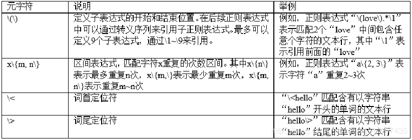
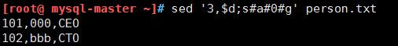

[TOC]


# 第十单元-正则表达式


## 10.1 正则表达式  

正则表达式是用于描述字符排列和匹配模式的一种语法规则。它主要用于字符串的模式分割、匹配、查找及替换操作。

① 正则表达式就是为了处理大量的文字|文本|字符串而定义的一套规则和方法.
② 通过定义这些特殊符号的辅助,系统管理员就可以快速过滤,替换和输出需要的字符串.
③ linux正则表达式一般以行为处理单位.


创建练习环境：

```shell
[root@ mysql-master ~]# vim test.txt
I love linux.

I like badminton ball ,billiard ball and chinese chess!
my blog is http://blog.51cto.com
our site is http://www.aaa.org
my qq num is 49000448.

ABVGSRGDRH

not 4900000448.
my god!
```


### 10.1.1 基础正则表达式

基本正则表达式（Basic Regular Expression，BRE），又称为标准正则表达式，是最早制订的正则表达式规范，仅支持最基本的元字符集。基本正则表达式是POSIX规范制订的两种正则表达式语法标准之一，另外一种语法标准称为扩展正则表达式，将在随后介绍。


**基本正则表达式元字符**

```shell
1）^word	搜索以word开头的；
2）word$	搜索以word结尾的；
3）^$	表示空行；
4）.		表示任意一个字符，字母、数字、特殊符号都匹配，不包括“空行”但包括空格；
5）\		转义符，比如“\.”就表示点“.”本身，让有特殊意义的字符，脱掉马甲，还原原型；
6）*		表示重复前面0个或多个的一个字符；
7）.*		匹配所有的字符，包括空行。^.*以任意多个字符开头，.*$以任意多个字符结尾；
8）[abc]		匹配字符集合里的任意一个字符，不是匹配一个单词；
9）[^abc]	匹配不包含^后任意一个字符的内容，匹配的是一个字符，而不是不匹配一个单词；
10）a\{n,m\}  重复n到m次前一个字符。如果用egrep可以去掉“\”斜线;
a\{n,\}    	  重复至少n次，前一个重复的字符。如果用egrep/sed -r可以去掉斜线；
a\{n\}    	重复n次，前一个重复的字符。如果用egrep/sed -r可以去掉斜线；
a\{,m\}   	最多m次。??这个需要验证??

注意：egrep或sed -r过滤一般特殊字符可以不转义。
```


**1．行首定位符 ^**
是正则表达式中的定位符之一，用来匹配行首的字符，表示行首的字符是“^”后面的那个字符。正则表达式中的定位符的作用与其他的元字符不同，它们不是用来匹配具体的文本，而是匹配某个具体的位置，例如行首定位符“^”就是用来匹配文本行的开头的字符的。

```shell
#过滤出test.txt文件中，以I开头的
[root@ mysql-master ~]# grep '^I' test.txt
I love linux.
I like badminton ball ,billiard ball and chinese chess!
```


**2．行尾定位符 \$**
与行首定位符的作用恰恰相反，行尾定位符的作用是用来定位文本行的末尾的。从语法上讲，行尾定位符的位置也与行首定位符相反，行首定位符位于所作用的字符之前，而行尾定位符位于所作用的字符之后。"^$" 匹配空行.

```shell
#过滤出test.txt文件中，以！结尾的
[root@ mysql-master ~]# grep '!$' test.txt
I like badminton ball ,billiard ball and chinese chess!
my god!
```


**3．单个字符匹配 .**
圆点“.”用来匹配任意单个字符，包括空格，但是不包括换行符“\n”。当用户使用“.”符号后，意味着该位置一定有一个字符，无论它是什么字符。

```
ls /etc | grep "conf."
```


**4．限定符\***
星号 \* 是正则表达式中的限定符之一。限定符本身不代表任何字符，它是用来指定其前面的一个字符必须要重复出现多少次才能满足匹配。

```
#查找/etc目录下的,以.conf结尾的所有文件
find /etc/ -type f -name '*.conf'
```


**5．字符集匹配 [ ]**
方括号“[ ]”的功能比较特殊，它是用来指定一个字符集合的，其基本语法为：

```
[abc]
```

```shell
#筛选所有以字符r开头，并且紧跟着1个字符c的文本行
ls /etc |grep "^rc"

#筛选所有以字符r开头，紧跟着1个字符为c，下面1个字符为单个数字的文本行
ls /etc | grep "^rc[0-9]"

#过滤出test.txt文件中，包含0-9任意数字的行
[root@ mysql-master ~]# grep [0-9] test.txt
my blog is http://blog.51cto.com
my qq num is 49000448.
not 4900000448.

#过滤出test.txt文件中，包含0-9和a-z任意字符的行
[root@ mysql-master ~]# grep [0-9a-z] test.txt
I love linux.
I like badminton ball ,billiard ball and chinese chess!
my blog is http://blog.51cto.com
our site is http://www.aaa.org
my qq num is 49000448.
not 4900000448.
my god!
```

正则表达式的字符集通常使用方括号表达式表示，例如：

```
[cC]hina
[^hello]
[a-zA-Z]
[0-9]
```


**6．字符集不匹配 [^]**

前面已经介绍过行首定位符“^”和字符集匹配符“[ ]”。但是如果将这2个符号结合起来，则其意义会发生变化。符号“[^]”表示不匹配其中列出的任意字符，其语法如下：

```
[^abc]
```

其中a、b和c表示任意的单个字符。`[^]`符号的用法与符号`[ ]`的用法相同，不再举例说明。
除了前面介绍的6个元字符之外，在基本正则表达式中还定义了其他的一些元字符。这些元字符使用较少，语法较繁琐，且在扩展正则表达式和PERL正则表达式中都有替代的元字符，所以不再详细说明。表中列出了基本正则表达式的其他的元字符。




**7.反斜杠字符**

\ 转义(escapes) 一个特殊的字符,使这个字符表示原来字面上的意思.
\$ 表示了原来的字面意思”$”,而不是在正则表达式中表达的匹配行尾的意思.

如果目标字符串中包含了正则和扩展正则的元字符，例如：?  +  {}  |  ()  .  *  $ []等元字符，都需要使用反斜杠\


**8.转义(escape)“尖角号”\<…\>**
用于表示单词的边界. 尖角号必须被转义,因为不这样做的话它们就表示单纯的字面意思而已."\<the\>" 匹配单词"the",但不匹配"them", “there”, “other”, 等等


### 10.1.2 扩展正则表达式

扩展正则表达式（Extended Regular Expression，ERE）支持比基本正则表达式更多的元字符，但是扩展正则表达式对有些基本正则表达式所支持的元字符并不支持。上文中介绍的元字符“^”、“$”、“.”、“*”、“[]”以及“[^]”这6个元字符在扩展正则表达式都得到了支持，并且其意义和用法都完全相同，不再重复介绍。接下来重点介绍一下在扩展正则表达式中新增加的一些元字符。


扩展正则表达式需要使用grep -E或egrep进行过滤。

```
1）+	重复一个或多个以上前面的字符；
2）?	重复0个或一个前面的字符；
3）	|	用或的方法查找多个符合的字符串，即同时过滤多个字符串；
4）()	找出“用户组”字符串，即分组过滤。
5)  {n,m}   重复n到m次前一个字符
```


**1．限定符 +**
重复一个或多个以上前面的字符

```
echo a111b | grep 'a1\+b'
echo a111b | gawk '/a1+b/'
echo a111b | sed -ne '/a1\+b/p'
这三句的效果都等同
```

#筛选以字符串“s”开头，后面至少紧跟着1个字符“s”的文本行

```
ls /etc | egrep "^ss+"
```


**2．限定符“?”**
问号“?”是另外一个限定符，它用来限定前面的字符最多只出现1次，即前面的字符可以重复0次或者1次。

```
ls /etc | egrep "^sss?"
```


**3．竖线“|”和圆括号“()”**

竖线“|” 表示多个正则表达式之间“或”的关系，其语法为：
expression1|expression2|e=xpression3|…|expressionn
圆括号“()”用来表示一组可选值的集合。竖线和圆括号经常在一起使用，表示一组可选值。

```
[root@ mysql-master ~]# ls /etc | egrep "(ssh|ssl|^yum)"
ssh
ssl
yum
yum.conf
yum.repos.d

```


**4．转义"大括号"{ }指示前面正则表达式匹配的次数.**
要转义是因为不转义的话大括号只是表示他们字面上的意思.这个用法只是技巧上的而不是基本正则表达式的内容.
“[0-9]\{5\}” 精确匹配 5 个数字 (从 0 到 9 的数字).
注意：大括号不能在“经典”(不是 POSIX 兼容)的正则表达式版本的 awk 中使用. 然而, gawk 有一个选项- -re-interval 来允许使用大括号(不必转义).

```
echo 2222 | gawk --re-interval '/2{3}/'
```


## 10.2 grep与egrep文本处理工具

grep (**g**lobal search **r**egular **e**xpression(RE) and **p**rint out the line，**全面搜索正则表达式并把行打印出来**)，**是一种强大的文本搜索工具，它能使用正则表达式搜索文本，并把匹配的行打印出来。抓取、过滤、筛选，找文件的内容。**

Unix的grep家族包括grep、egrep和fgrep。egrep和fgrep的命令只跟grep有很小不同。egrep是grep的扩展，支持更多的re元字符， fgrep就是fixed grep或fast grep，它们把所有的字母都看作单词，也就是说，正则表达式中的元字符表示回其自身的字面意义，不再特殊。

linux使用GNU版本的grep。它功能更强，可以通过-G、-E、-F命令行选项来使用egrep和fgrep的功能。

```
egrp == grep -E
```


### 10.2.1 grep命令详解

**1.格式**

```
grep [OPTIONS] PATTERN [FILE...]
```

**2.常用主要参数**

| **参数**     | **说明**                                                     |
| ------------ | ------------------------------------------------------------ |
| -v           | 反转查找、过滤                                               |
| -n           | 显示行号                                                     |
| -i           | 忽略大小写                                                   |
| -E           | =egrep                                                       |
| -a           | 在二进制中,以文本文件的方式搜索数据                          |
| -C           | <显示列数>或-<显示列数> 除了显示符合范本样式的那一列之外，并显示该列之前后的内容 |
| --color=auto | 以特定的颜色高亮显示匹配关键字                               |
| -o           | 只输出文件中匹配到的信息                                     |
| -c           | 统计匹配的行数                                               |

### 10.2.2 grep常见用法

（1）-n过滤并显示行号


（2）-v排除某行


（3）-i忽略大小写


（4）-c 统计匹配的行数


**例题：grep+cut取网卡ip**

```shell
[root@ mysql-master ~]# ip a|grep eth0|grep inet|cut -d' ' -f6|cut -d'/' -f1
10.0.0.21

[root@ mysql-master ~]# ifconfig eth0 |grep 'inet addr'|cut -d':' -f2|cut -d' ' -f1
10.0.0.21
```


## 10.3 sed文件处理工具

sed是一个很好的文件处理工具，本身是一个管道命令。能同时处理**多个文件多行的内容**，可以不对原文件改动，把整个文件匹配内容选取之后再输入到屏幕，可以把**只匹配到模式的内容输入到屏幕上**。

还可以对原文件内容行**进行替换、删除、新增**等特定工作改动，但是不会再屏幕上返回结果。


### 10.3.1 sed命令详解

**1.sed命令参数**

| **参数** | **说明**                     |
| -------- | ---------------------------- |
| -i       | 修改内容                     |
| -n       | 取消默认输出                 |
| -r       | 在脚本中支持扩展正则表达式。 |
| -e       | 一条语句可以执行多个sed命令  |


**2.sed标记参数(就是前面没有-的参数)也可以称之为编辑器**

```
a∶	在定位行后新增内容， a 的后面可以接字符串，而这些字符串会在新的一行出现(当前行的下一行)；
c∶	用新文本替换定位文本， c 的后面可以接字符串，这些字符串可以取代 n1,n2 之间的行；
d∶	删除定位行，因为是删除啊，所以 d 后面通常不接任何咚咚；
g∶	表示行内全面替换。 --global
i∶	在定位行前插入新内容， i 的后面可以接字符串，而这些字符串会在新的一行出现(当前行的上一行)；
I∶	还是| 显示与八进制ACSII代码等价的控制符；
n∶	从另一个文件中读文本下一行，并从下一条命令而不是第一条命令开始对其的处理；
N∶	在数据流中添加下一行以创建用于处理的多行组；
p∶	列印，亦即将某个选择的资料印出。通常 p 会与参数 sed -n 一起运作；
q∶	第一个模式匹配完成后退出或立即退出；
r∶	后面接filename，表示从另一个文件中读文本，类似输入重定向 <
s∶	使用指定模式去替换匹配到模式，可以直接进行取代的工作！通常这个 s 的动作可以搭配正规表达式！例如 1,20s/old/new/g；
w∶	后面接filename，表示把行写入一个文件；
x：	表示互换模板块中的文本和缓冲区中的文本；
y：	表示把一个字符翻译为另外的字符（但是不用于正则表达式）
=∶	表示打印行号；
{}∶	当用到sed不同的标记参数(就是前面没有-的参数)时，用大括号{},且不同标记参数之间用分号隔开。
```


### 10.3.2 sed应用案例

#### 10.3.2.1 增        

```
i插入文本到指定行前
a追加文本到指定行后
```

**1.单行追加**

```shell
[root@ mysql-master ~]# cat test.txt
I love linux.

I like badminton ball ,billiard ball and chinese chess!
my blog is http://blog.51cto.com
our site is http://www.aaa.org
my qq num is 49000448.

ABVGSRGDRH

not 4900000448.
my god!


sed '2a thank you' test.txt  	追加thank you 到test.txt第二行后(此法追加只是临时显示)

sed -i '2a thank you' test.txt    永久改变文件前边必须加参数-i
```

**2.多行追加**

```
sed '2a thank you\ngood' test.txt  追加thank you和good到test.txt第二行后(\n表示回车)
```


#### 10.3.2.2 删       

**d删除指定行（删除时包括空行）**

```
sed '2d' test.txt 		删除test.txt中的第二行
sed '2,5d' test.txt     删除test.txt第2行到第5行

'3,$d' 			删除第3行到最后一行
'1~2d'			删除奇数行    
'2~2d'			删除偶数行
'1,+2d'         删除第1行+后边两行
'/god/d'		删除文件中包含god的行
'1d;5d;7d'		删除不规则行数
```


#### 10.3.2.3 改   重中之重     

**1.按行替换**   

c 用新行取代旧行

```
sed '2c beautiful' test.txt  把test.txt文件中的第2行替换成beautiful
```

**2.文本替换**

```
's#A#B#g'=='s/A/B/g'   查找替换 把A替换为B

sed -i 's/A/B/g' /data/ett.txt     查找A替换成B

s：单独使用→将每一行中第一处匹配的字符串进行替换 ==>sed命令 

g：每一行进行全部替换 ==>sed命令s的替换标志之一，非sed命令 
```

1.对比得出**s前加数字针对某行**，不加数字针对所有行；后边加g是全部，加数字是**某一处**


#### 10.3.2.4 查  

**1.按行查询**

p 输出指定内容，但默认会输出2次匹配的结果，因此使用-n取消默认输出


说明：取行就用sed，最简单

**2.按字符串查询**

显示包含"CTO"的行到包含"CFO"的行，之间的行


**3.通过-r支持扩张正则**


### 10.3.3 扩展

**sed语句执行多条命令**

**练习一：删除文件第三行至末行,并把剩余行中的所有a替换成0**

**1.`;` 分号作为连接符**  *推荐使用*




2.`-e`


**练习二：sed获取系统ip**

```shell
[root@ mysql-master ~]# ifconfig eth0 | grep 'inet addr' | sed 's/^.*addr://g' | sed 's/Bcast.*$//g'
10.0.0.21
```

