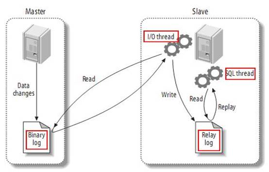
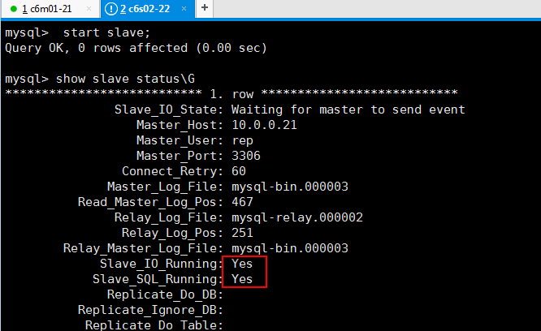

[TOC]


# 第四单元-mysql主从复制集群应用

## 4.1 MySQL主从复制

###  4.1.1 mysql主从复制介绍

MySQL主从又叫做Replication、AB复制。简单讲就是A和B两台机器做主从后，在A上写数据，另外一台B也会跟着写数据，两者数据实时同步的

    MySQL的主从复制的主要场景有以下几个：
    
    1）从服务器作为主服务器的实时数据备份
    
    2）主从服务器实现读写分离（主写从读），从服务器实现负载均衡
    
    3）把多个从服务器根据业务重要性进行拆分访问（从服务器根据业务进行拆分）


###  4.1.2 mysql主从复制工作原理



MySQL的主从复制是一个异步的复制过程（虽然一般情况下感觉是实时的），数据将从一个MySQL主数据库（我们称之为Master）复制到另一个MySQL数据库（我们称之为Slave），在Master于Slave之间实现整个主从复制的过程是由三个线程参与完成的。其中有两个线程（SQL和IO线程）在Slave端，另外一个线程（I/O线程）在Master端。

要实现MySQL的主从复制，首先必须打开Master端的Binlog记录功能，否则就无法实现。因为整个复制过程实际上就是Slave从Master端获取BInlog日志，然后再在Slave上以相同顺序执行获取的binlog日志中记录的各种SQL操作。


下面针对MySQL主从复制原理的重点小结

- 主从复制是异步的逻辑的SQL语句级的复制
- 复制时，主库有一个I/O线程，从库有两个线程，I/O和SQL线程。
- 作为复制的所有MySQL节点的server-id都不能相同。
- binlog文件只记录对数据库有更改的SQL语句（来自数据库内容的变更），不记录任何查询（select，slow）语句。

也就是mysql主从复制是通过binlog日志为媒介实现的。


### 4.1.3 mysql支持的复制类型

3.1 基于语句的复制。在主服务器上执行的 SQL 语句，在从服务器上执行同样的语句。

配置：

```
binlog_format = 'STATEMENT';
```

3.2 基于行的复制。把改变的内容复制过去，而不是把命令在从服务器上执行一遍，从 MySQL 5.0开始支持。

配置： 

```
binlog_format = 'ROW';
```

3.3 混合类型的复制。默认采用基于语句的复制，一旦发现基于语句的无法精确的复制时，就会采用基于行的复制。

配置： 

```
binlog_format = 'MIXED';
```


## 4.2 MySQL主从复制配置

**环境介绍**

| 主机名 | 主机类型       | ip        | system    | yum安装包                                                    |
| ------ | -------------- | --------- | --------- | ------------------------------------------------------------ |
| c6m01  | 主服务器master | 10.0.0.21 | centos6.8 | mysql-server-5.1.73                                                              mysql-5.1.73 |
| c6s02  | 从服务器slave  | 10.0.0.22 | centos6.8 | mysql-server-5.1.73                                                              mysql-5.1.73 |


###  4.2.1 在mysql主服务器（master）上的配置

**rpm安装的mysql配置文件在 /usr/my.cnf**

**rpm安装的mysql数据目录在 /var/lib/mysql**

**yum安装的mysql配置文件在/etc/my.cnf**

**yum安装的mysql数据目录在 /var/lib/mysql**


以下的配置方式是通过yum安装mysql,需要`vim /etc/my.cnf`。

1.开启主库binlog,从库不用开,配置主从库server-id(不能相同)

```shell
yum -y install mysql mysql-server

vim /etc/my.cnf

[mysqld]
server-id=1
log-bin=mysql-bin

/etc/init.d/mysqld restart
```


2.主库创建同步的用户

```
mysql -uroot -p123456
mysql> grant replication slave on *.* to 'rep'@'10.0.0.%' identified by '123456';
mysql> flush privileges;
```


3.查看主服务器状态

```shell
#记录下日志文件名和位置，备用
mysql> show master status;
+------------------+----------+--------------+------------------+-------------------+
| File             | Position | Binlog_Do_DB | Binlog_Ignore_DB | Executed_Gtid_Set |
+------------------+----------+--------------+------------------+-------------------+
| mysql-bin.000003 |      467 |              |                  |                   |
+------------------+----------+--------------+------------------+-------------------+

或者
mysql> show master status\G
```


### 4.2.2 在mysql从服务器（slave）上的配置

1.配置mysql从服务器

```shell
yum -y install mysql mysql-server

vim /etc/my.cnf

[mysqld]
server-id=2
relay-log=mysql-relay

/etc/init.d/mysqld restart
```

2.关闭从服务器的复制功能

```shell
mysql -uroot -p123456
mysql> stop slave;
```

3.配置从服务器指向master

```shell
change master to master_host='10.0.0.21',
master_user='rep',
master_password='123456',
master_log_file='mysql-bin.000003',
master_log_pos=467;
```


4.开启从服务器的复制功能

```
mysql> start slave;
```

5.检查从服务器的复制功能状态

```
#检查画横线的两行是否变为yes
mysql> show slave status\G
```




6.主从复制测试

在mysql主服务器创建wg数据库，在从mysql服务器上查看数据库。发现主mysql上创建wg数据库，已经同步到从mysql上。


## 4.3 Mysql多主多从架构分析


* 一主一从
* 主主复制
* 一主多从---扩展系统读取的性能，因为读是在从库读取的
* 多主一从---5.7版本开始支持
* 联级复制