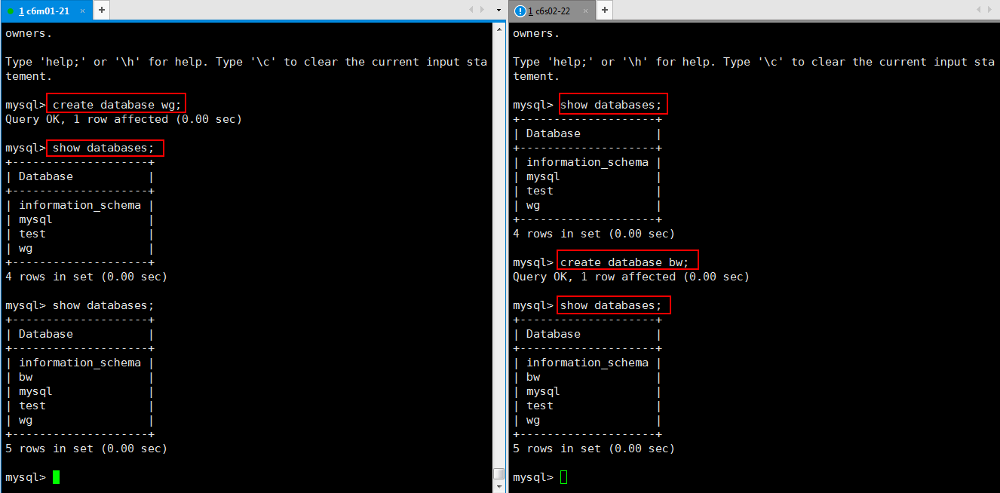

[TOC]


# 第一单元-mysql主主架构

MySQL主主同步和主从同步的原理一样，只是双方都是主从角色。

MySQL主主服务器架构与主从服务器架构不同：

主主架构的两台服务器，即为主服务器又为另一台服务器的从服务器。任何一台服务器的数据库发生变化，都会同步到另外一台服务器上，即两台服务器互为主从。

什么叫主主复制？就是两个 MySQL 都能读能写，数据记录通过二进制传达给对方从而保持数据的一致性。

MySQL 主从复制官方文档：http://dev.mysql.com/doc/refman/5.6/en/replication.html


# 1.1 环境介绍

| 主机名 | 主机类型       | ip        | system    | yum安装包                                                    |
| ------ | -------------- | --------- | --------- | ------------------------------------------------------------ |
| c6m01  | 主服务器master | 10.0.0.21 | centos6.8 | mysql-server-5.1.73                                                              mysql-5.1.73 |
| c6s02  | 从服务器slave  | 10.0.0.22 | centos6.8 | mysql-server-5.1.73                                                              mysql-5.1.73 |


# 1.2 配置部署

## 1.2.1 c6m01上操作

### 1.2.1.1 安装mysql客户端和服务端

```shell
[root@ c6m01 ~]# yum -y install mysql mysql-server
```


### 1.2.1.2 配置配置文件

```shell
[root@ c6m01 ~]# vim /etc/my.cnf
[mysqld]
server-id = 1
log-bin = mysql-bin
relay-log = relay-bin	#开启中继日志功能 
auto-increment-increment = 2	#每次增长2
auto-increment-offset = 1	#设置自动增长的字段的偏移量，即初始值为2 
```

注：

- 二都只有server-id不同和 auto-increment- offset不同

- auto-increment-increment的值应设为整个结构中服务器的总数，本案例用到两台服务器，所以值设为2。


### 1.2.1.3 创建同步的用户

```shell
mysql -uroot -p123456
mysql> grant all on *.* to 'rep'@'10.0.0.%' identified by '123456';
mysql> flush privileges;
```


### 1.2.1.4 查看主服务器状态

```shell
mysql> show master status;
+------------------+----------+--------------+------------------+
| File             | Position | Binlog_Do_DB | Binlog_Ignore_DB |
+------------------+----------+--------------+------------------+
| mysql-bin.000003 |      470 |              |                  |
+------------------+----------+--------------+------------------+
```


## 1.2.2 c6s02上操作

### 1.2.2.1 安装mysql客户端和服务端

```shell
[root@ c6s02 ~]#  yum -y install mysql mysql-server
```


### 1.2.2.2 配置配置文件

```shell
[root@ c6s02 ~]# vim /etc/my.cnf
[mysqld]
server-id = 2
log-bin = mysql-bin
relay-log = relay-bin
auto-increment-increment = 2
auto-increment-offset = 2
```


### 1.2.2.3 创建同步的用户

```shell
mysql -uroot -p123456
mysql> grant all on *.* to 'rep'@'10.0.0.%' identified by '123456';
mysql> flush privileges;

```


### 1.2.2.4 查看主服务器状态

```shell
mysql> show master status;
+------------------+----------+--------------+------------------+
| File             | Position | Binlog_Do_DB | Binlog_Ignore_DB |
+------------------+----------+--------------+------------------+
| mysql-bin.000004 |      106 |              |                  |
+------------------+----------+--------------+------------------+

```


## 1.2.3 配置两台服务器互为主从

 **c6m01上操作：**

```shell
[root@ c6m01 ~]# mysql -uroot -p123456

mysql> stop slave;
```

指向c6s02的master：

```shell
change master to master_host='10.0.0.22',
master_user='rep',
master_password='123456',
master_log_file='mysql-bin.000004',
master_log_pos=106;
```

开启slave并查看状态：

```shell
mysql> start slave;
mysql> show slave status\G
*************************** 1. row ***************************
               Slave_IO_State: Waiting for master to send event
                  Master_Host: 10.0.0.22
                  Master_User: rep
                  Master_Port: 3306
                Connect_Retry: 60
              Master_Log_File: mysql-bin.000004
          Read_Master_Log_Pos: 325
               Relay_Log_File: relay-bin.000002
                Relay_Log_Pos: 470
        Relay_Master_Log_File: mysql-bin.000004
             Slave_IO_Running: Yes
            Slave_SQL_Running: Yes

```


**c6s02上操作：**

```shell
[root@ c6s02 ~]# mysql -uroot -p123456
mysql> stop slave;
```

指向 c6m01的master：

```shell
change master to master_host='10.0.0.21',
master_user='rep',
master_password='123456',
master_log_file='mysql-bin.000003',
master_log_pos=470;
```


开启slave并查看状态：

```shell
mysql> start slave;
Query OK, 0 rows affected (0.00 sec)

mysql> show slave status\G
*************************** 1. row ***************************
               Slave_IO_State: Waiting for master to send event
                  Master_Host: 10.0.0.21
                  Master_User: rep
                  Master_Port: 3306
                Connect_Retry: 60
              Master_Log_File: mysql-bin.000003
          Read_Master_Log_Pos: 470
               Relay_Log_File: relay-bin.000002
                Relay_Log_Pos: 251
        Relay_Master_Log_File: mysql-bin.000003
             Slave_IO_Running: Yes
            Slave_SQL_Running: Yes

```

至此，两台机器做mysql互为主从完毕。


## 1.2.4 分别测试两台互为主从的机器




