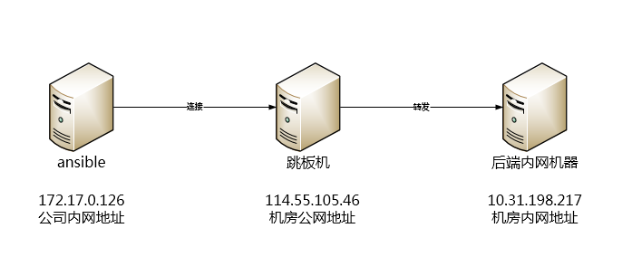

[TOC]


# ssh代理穿透

# 一. 需求背景

在我们使用ansible的过程中经常会遇到这样的情况，我们要管理的机器都在机房内网中，这些内网机器的登录都是通过跳板机或者堡垒机登录。而我们的ansible机器不能直接管理到这些后端的机器，那这个问题如何解决呢？


# 二. 解决方法

由于ansible管理机器都是通过ssh，而ssh则为我们提供了一个agent forward功能，我们可以借助这个功能来解决上述问题。**原理：ssh协议代理穿透**


# 三.测试环境

前提条件，跳板机：114.55.105.46 和 后端内网机器：10.31.198.217；已经实现了免密登录。

  

| 角色         | IP地址            | 用户          | 机器位置 |
| ------------ | ----------------- | ------------- | -------- |
| ansible机器  | 内网172.17.0.126  | root          | 公司     |
| 跳板机       | 公网114.55.105.46 | admin普通用户 | 机房     |
| 后端内网机器 | 内网10.31.198.217 | admin普通用户 | 机房     |


# 四.配置ssh forward

ansible使用秘钥key连接；经堡垒机转发直接登录后端机器。(秘钥的生成都是在ansible机器上)。

**1.生成ansible登录跳板机密钥对**

```bash
$ ssh-keygen 
Generating public/private rsa key pair. 
Enter file in which to save the key (/root/.ssh/id_rsa): /root/.ssh/id_rsa 
Enter passphrase (empty for no passphrase): 
Enter same passphrase again: 
Your identification has been saved in /root/.ssh/id_rsa. 
Your public key has been saved in /root/.ssh/id_rsa.pub.
```

**2.将公钥拷贝到跳板机。**

```bash
$ ssh-copy-id -i /root/.ssh/id_rsa.pub admin@114.55.105.46 -p 22
```

此时，ansible机器就可以直连跳板机。

**3.生成登录后端机器密钥对（与第一个密钥对名字不同）**

```bash
$ ssh-keygen -f /root/.ssh/prod_id_rsa 
Generating public/private rsa key pair.
Enter passphrase (empty for no passphrase):
Enter same passphrase again:
Your identification has been saved in /root/.ssh/prod_id_rsa.
Your public key has been saved in /root/.ssh/prod_id_rsa.pub.
```

**4.将对应公钥内容拷贝到后端机器的认证文件中**

将`/root/.ssh/prod_id_rsa.pub`中的内容复制到`10.31.198.217`机器`/home/admin/.ssh/authorized_keys`如果没有就手动穿件一个这个文件。

注意权限：`authorized_keys` 权限为600 所属组及所属用户是admin

**5.在ansible机器上配置ssh连接文件。(后面指定这个文件连接后端机器)**

```bash
$ cat .ssh/config
Host bxg-bastion
    User admin
    port 22
    HostName  114.55.105.46
    IdentityFile /root/.ssh/id_rsa
    ProxyCommand none
    BatchMode yes
    PasswordAuthentication no
Host 10.31.198.*
    User admin
    Port 22
    TCPKeepAlive yes
    ForwardAgent yes
    Compression yes
    ControlMaster auto
    ControlPath ~/.ssh/mux-%r@%h:%p
    ControlPersist 4h
    ServerAliveInterval 60
    ServerAliveCountMax 20
    ProxyCommand ssh -q -W %h:%p  admin@114.55.105.46
    IdentityFile /root/.ssh/prod_id_rsa
```

- **使用ControlPersist特性自动登陆SSH服务器**

实现方法

此功能是使用SSH的ControlPersist特性，SSH版本必须是5.6或以上版本才可使用ControlPersist特性。

- **多条连接共享**

如果你需要在多个窗口中打开到同一个服务器的连接，而不想每次都输入用户名，密码，或是等待连接建立，那么你可以配置SSH的连接共享选项，在本地打开你的SSH配置文件，通常它们位于~/.ssh/config，然后添加下面2行(ControlMaster配合ControlPath一起使用)：

```
ControlMaster auto
ControlPath /tmp/ssh_mux_%h_%p_%r
```

现在试试断开你与服务器的连接，并建立一条新连接，然后打开一个新窗口，再创建一条连接，你会发现，第二条连接几乎是在瞬间就建立好了。

- **文件传输**

连接共享不止可以帮助你共享多个SSH连接，如果你需要通过SFTP与服务器传输文件，你会发现，它们使用的依然是同一条连接，如果你使用的Bash，你会发现，你甚至SSH甚至支持Tab对服务器端文件进行自动补全，共享连接选项对于那些需要借助SSH的工具，比如rsync，git等等也同样有效。

- **长连接**

如果你发现自己每条需要连接同一个服务器无数次，那么长连接选项就是为你准备的。

```
ControlPersist yes 
```

打开之后即使关闭了所有的已连接ssh连接，一段时间内也能无需密码重新连接。

```
ControlPersist 4h 
```

每次通过SSH与服务器建立连接之后，这条连接将被保持4个小时，即使在你退出服务器之后这条连接依然可以重用，因此，在你下一次(4小时之内)登录服务器时，你会发现连接以闪电般的速度建立完成，这个选项对于通过scp拷贝多个文件提速尤其明显，因为你不在需要为每个文件做单独的认证了。

Compression为压缩选项，打开之后加快数据传输速度。

此时在ansible机器就可以直连后端服务器了

```bash
$ ssh 10.31.198.217
Last login: Tue May 28 13:06:00 2019 from 10.172.201.198
```

**6.配置测试ansible直接操作后端服务器**

**命令行带参数测试**

```bash
$ ansible all -m ping --ssh-common-args='-o ProxyCommand="ssh -W %h:%p -q admin@114.55.105.46"'
zabbix-server | SUCCESS => {
    "ansible_facts": {
        "discovered_interpreter_python": "/usr/bin/python"
    },
    "changed": false,
    "ping": "pong"
```

**配置ansible的配置文件ansible.cfg**

```bash
$ vim /etc/ansible/ansible.cfg

[ssh_connection]
ssh_args = '-C -o ControlMaster=auto -o ControlPersist=600s  -F /root/.ssh/config -q'
scp_if_ssh = True
control_path = ~/.ssh/mux-%%r@%%h:%%p
```

**配置ansible的inventory文件 。默认是/etc/ansible/hosts**

```bash
$ egrep -v '^$|^#' /etc/ansible/hosts

[zabbix]
zabbix-server ansible_ssh_host=10.31.198.217 ansible_ssh_port=22
```

**ansible不带参数测试**

```bash
$ ansible all -m ping
zabbix-server | SUCCESS => {
    "ansible_facts": {
        "discovered_interpreter_python": "/usr/bin/python"
    },
    "changed": false,
    "ping": "pong"
```

