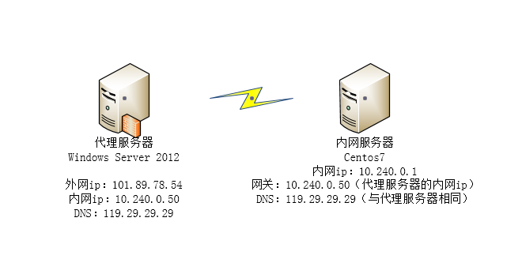
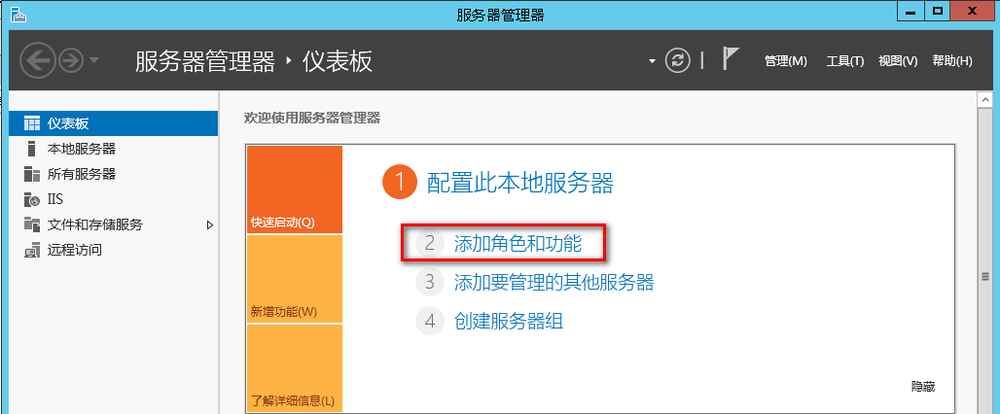
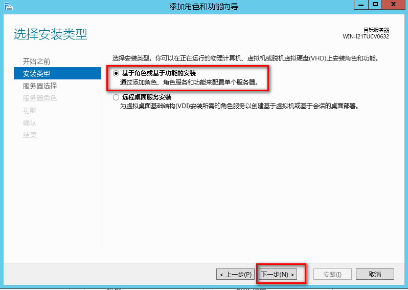
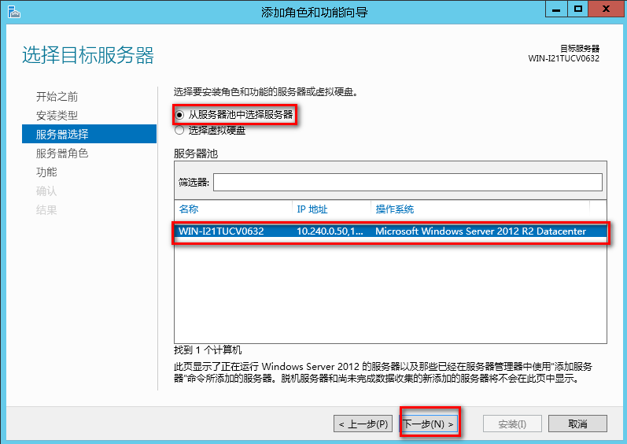
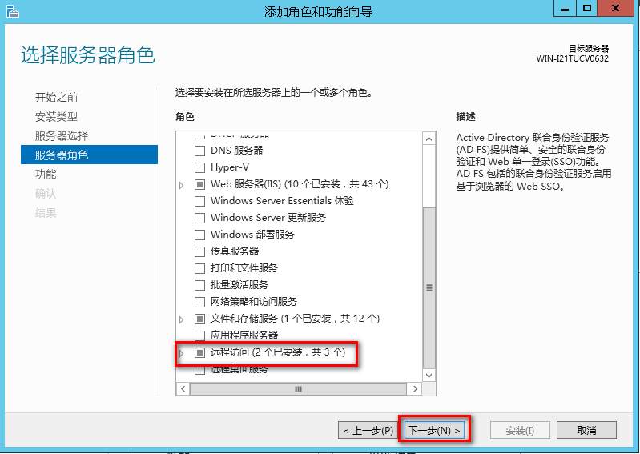
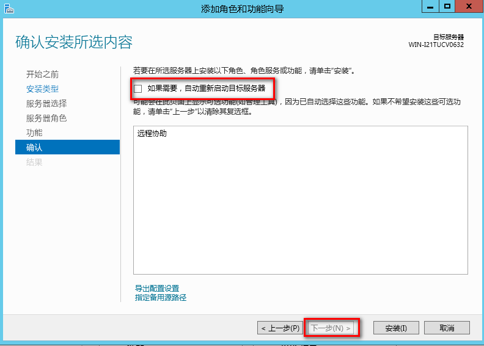
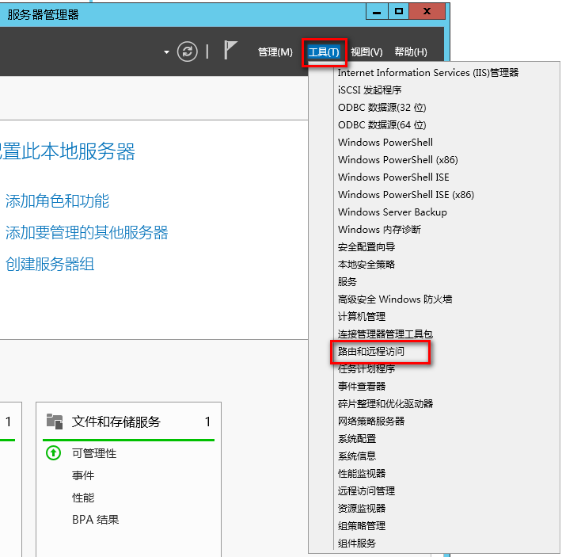
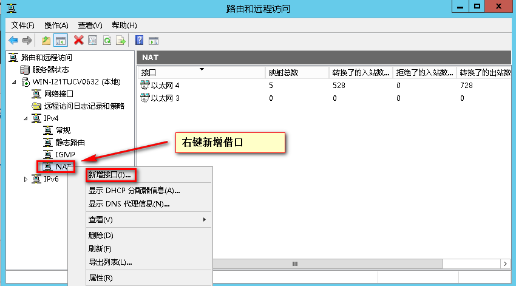
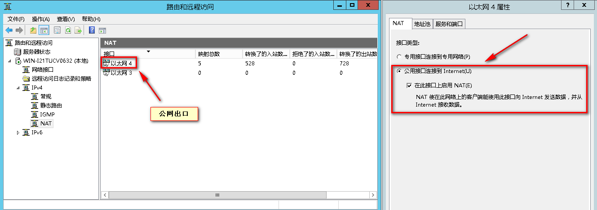
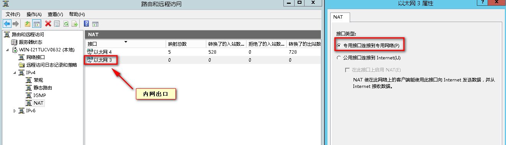

# Windows Server 2012配置NAT代理服务器

# **一、NAT概述**

​    网络地址转换NAT(Network Address Translation)可以动态改变通过路由器的IP报文的内容(修改报文的源IP地址和/或目的IP地址)。离开路由器的报文的源地址或目的地址会转换成与原来不同的地址。这种功能对于申请了少量IP地址空间，但上网主机的数量远远超过了IP地址数目的组织机构来说十分有用。这不仅可以节省维护公共地址的成本而且可以阻止外部网络直接与内部网络通讯从而达到了一定程度上的安全保证。

# **二、NAT的特点与原理**

1. 支持内网到外网多对一的地址映射

2. 支持DHCP功能
3. 支持DNS中继代理

4. 支持端口映射功能

5. NAT外部网络接口可使用多个Public IP，再搭配地址映射功能，能让因特网的特殊应用程序通过NAT服务器与内网应用程序通信。

# **三、实验搭建**

服务器说明：

**1.安装和配置路由与远程访问**

Win2012

添加远程访问服务

【说明】Windows 2012将添加角色及功能组合成一个操作步骤，在原来的Windows Server 2008及Windows 2008 R2中是分开的。

**2.配置路由和远程访问**

# **四、注意事项**

- 注意windows防火墙
- 修改内网服务器网关为代理服务器内网ip