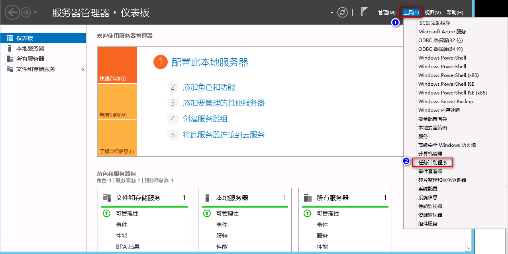
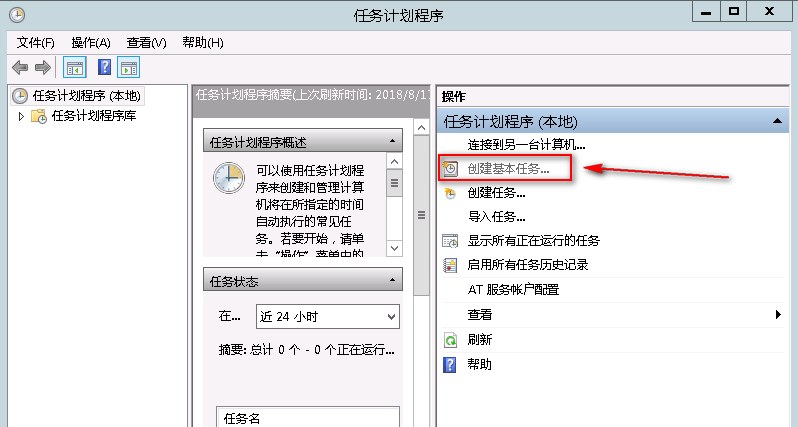
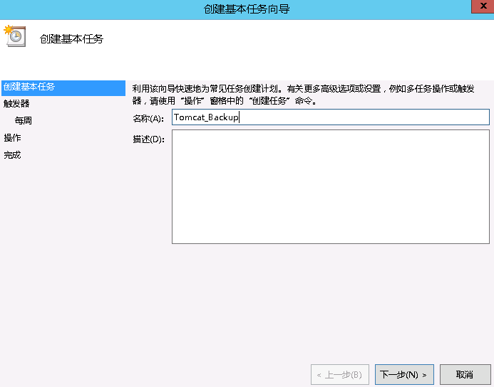
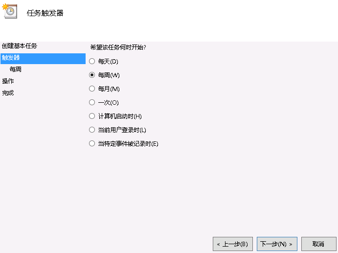
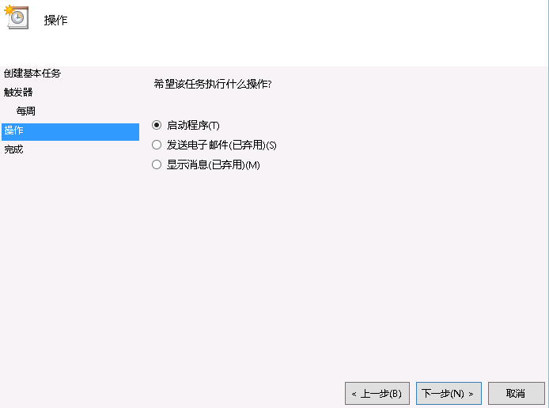
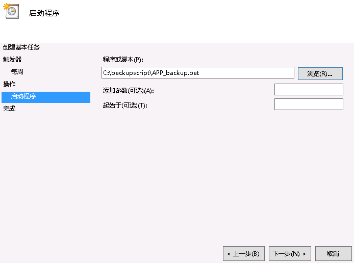

# windows计划任务添加

**Windows Server 2008**

首先Windows Server 2008不同于其他服务器操作系统和Windows Server 2003有着很大的区别，计划任务的名称是“任务计划程序”不在控制面板里，而是在“管理工具”里。由于服务器需要做些任务，定时执行，自己写程序吧，麻烦，所以采用BAT进行代替操作，网络上很多人都在说每分钟执行怎么配置，今天我们就配置一下。

 

**Windows Server 2012**

1、打开“任务计划程序”–> 点击“任务计划程序库”在右则会看到操作项里有“创建基本任务”和“创建任务”如图所示：

2、点击“创建任务”后如图所示：填写好相应的名称和勾选好必要的条件

3、选择“触发器”选项，点击“新建”，创建任务执行时间，“重复任务间隔”这个选择后，后面有时间选择，是每小时，还是每分，**可自己选择后再修改时间**，再确定。

**特别说明：我差点被骗了，认为Windows计划任务是精确不到分钟级别的，主要是看到“重复时间间隔(P)”右边没有“1分钟”选项，如下图所示：**

其实，它除了下拉选择外，还可手动修改时间值，比如上面的“1分钟”!!!

 

4、再来配置需要执行的“操作”，就是选择所写的程序或是BAT文件，这里很重要的配置是选择BAT文件后，**在“起始于（可选）”这里一定要填写相应执行程序或是BAT文件的所在目录，要不然是执行不成功的。**

5、添加后，列表栏中会出现添加的计划任务。

